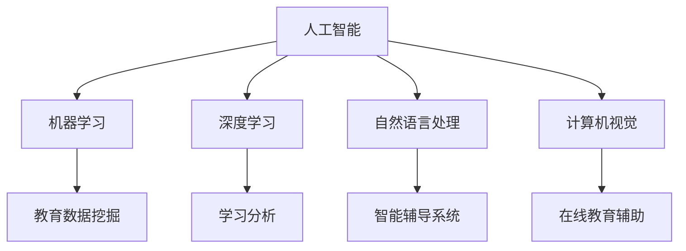
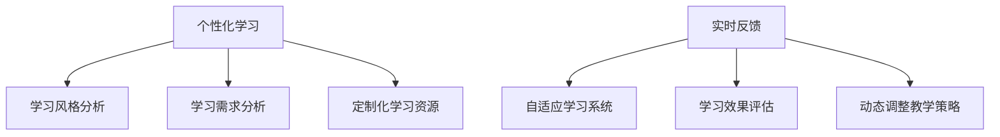

                 

关键词：人工智能，教育技术，个性化学习，自适应学习，在线教育，智能辅导系统，学习分析，未来教育趋势。

> 摘要：随着人工智能（AI）技术的不断进步，教育领域正经历着深刻的变革。本文将探讨AI在教育中的多种应用场景，包括个性化学习、自适应学习系统、在线教育平台的智能辅助、学习分析等，并预测这些技术的未来发展趋势及其面临的挑战。

## 1. 背景介绍

教育作为社会发展的基石，一直在不断寻求创新和进步。然而，传统教育模式在适应个体差异、优化学习路径和提供即时反馈方面存在一定的局限性。人工智能的出现为教育领域带来了新的可能性，它能够通过大数据分析、自然语言处理、计算机视觉等技术手段，实现教育的个性化和智能化。

近年来，AI技术在教育领域的应用逐渐普及，从早期的在线学习管理系统，到如今的智能辅导系统和自适应学习平台，AI正在逐步渗透到教育的各个环节，提高教学效率，优化学习体验。本文将重点讨论以下几个核心领域：

1. **个性化学习**：利用AI技术为学生提供定制化的学习内容和方法。
2. **自适应学习系统**：通过实时反馈和学习分析，动态调整教学策略。
3. **在线教育平台的智能辅助**：利用自然语言处理和计算机视觉技术，提高学习资源的使用效率和用户体验。
4. **学习分析**：通过数据挖掘和机器学习技术，分析学生的学习行为和效果，为教育决策提供依据。
5. **智能辅导系统**：利用AI技术为学生提供个性化的辅导服务，解决教育资源分配不均的问题。

## 2. 核心概念与联系

### 2.1 人工智能与教育技术

人工智能（AI）是一种模拟人类智能行为的计算系统，包括机器学习、深度学习、自然语言处理、计算机视觉等多个子领域。教育技术（EdTech）则是指利用信息技术改进教育过程和效果的工具和方法。两者的结合，即AI在教育技术中的应用，正推动教育模式的革新。

#### Mermaid 流程图



### 2.2 个性化学习与自适应学习系统

个性化学习（Personalized Learning）是指根据每个学生的兴趣、学习风格和能力，提供个性化的教学和学习资源。自适应学习系统（Adaptive Learning Systems）则是在个性化学习的基础上，通过实时反馈和学习分析，动态调整教学策略，以最大化学习效果。

#### Mermaid 流程图



## 3. 核心算法原理 & 具体操作步骤

### 3.1 算法原理概述

AI在教育领域的核心算法主要包括机器学习算法、深度学习算法和自然语言处理算法。以下将对这些算法的基本原理进行概述。

#### 3.1.1 机器学习算法

机器学习算法通过从数据中学习规律，用于预测和分类。常见的机器学习算法有决策树、随机森林、支持向量机等。在教育领域，机器学习算法可以用于分析学生的学习行为、预测学习效果、推荐学习资源等。

#### 3.1.2 深度学习算法

深度学习算法是一种特殊类型的机器学习算法，通过构建多层神经网络，对数据进行深度学习和特征提取。深度学习算法在教育中的应用包括图像识别、语音识别、自然语言处理等。

#### 3.1.3 自然语言处理算法

自然语言处理（NLP）算法用于理解和生成自然语言文本。NLP算法在教育中的应用包括智能问答系统、自动评分系统、个性化推荐系统等。

### 3.2 算法步骤详解

#### 3.2.1 个性化学习算法

个性化学习算法的基本步骤包括：

1. **数据收集**：收集学生的背景信息、学习历史和兴趣偏好。
2. **数据预处理**：清洗数据，处理缺失值和异常值。
3. **特征提取**：提取关键特征，如学习时长、作业完成情况、考试成绩等。
4. **模型训练**：使用机器学习算法训练个性化学习模型。
5. **模型评估**：评估模型的准确性和效果，进行调整和优化。

#### 3.2.2 自适应学习算法

自适应学习算法的基本步骤包括：

1. **学生模型构建**：根据学生的初始表现，构建学生的能力模型。
2. **教学策略调整**：根据学生的能力模型和实时反馈，动态调整教学策略。
3. **学习效果评估**：评估教学策略的效果，为下一次迭代提供依据。
4. **模型更新**：根据评估结果，更新学生模型和教学策略。

#### 3.2.3 智能辅导算法

智能辅导算法的基本步骤包括：

1. **问题识别**：识别学生在学习过程中遇到的问题。
2. **解决方案推荐**：根据问题类型和学生的能力模型，推荐合适的解决方案。
3. **效果评估**：评估解决方案的效果，为下一次迭代提供依据。
4. **模型更新**：根据评估结果，更新问题识别和解决方案推荐模型。

### 3.3 算法优缺点

#### 3.3.1 个性化学习算法

**优点**：

- 提高学习效率，满足个体差异。
- 降低学习成本，优化教育资源分配。

**缺点**：

- 需要大量高质量的数据支持。
- 模型复杂度高，计算成本较高。

#### 3.3.2 自适应学习算法

**优点**：

- 提高教学灵活性，适应不同学习者的需求。
- 实时反馈，提高学习效果。

**缺点**：

- 需要频繁的数据更新和维护。
- 模型训练和优化成本较高。

#### 3.3.3 智能辅导算法

**优点**：

- 提高学习资源的利用效率。
- 解决教育资源分配不均的问题。

**缺点**：

- 需要大量专业的知识库和支持系统。
- 人机交互设计复杂，用户体验有待提高。

### 3.4 算法应用领域

AI算法在教育领域的应用非常广泛，包括但不限于以下几个方面：

- **个性化学习**：通过个性化学习算法，为学生提供定制化的学习资源和方法。
- **自适应学习**：通过自适应学习算法，动态调整教学策略，提高学习效果。
- **在线教育平台**：通过智能辅导算法，提高学习资源的利用效率和用户体验。
- **学习分析**：通过数据挖掘和机器学习算法，分析学生的学习行为和效果，为教育决策提供依据。
- **智能辅导**：通过智能辅导算法，为学生提供个性化的辅导服务，解决教育资源分配不均的问题。

## 4. 数学模型和公式 & 详细讲解 & 举例说明

### 4.1 数学模型构建

在教育AI中，常见的数学模型包括线性回归、逻辑回归、神经网络等。以下以线性回归为例进行讲解。

#### 4.1.1 线性回归

线性回归是一种用于分析变量之间线性关系的数学模型，其公式如下：

$$
y = w_0 + w_1 \cdot x_1 + w_2 \cdot x_2 + \cdots + w_n \cdot x_n + \varepsilon
$$

其中，$y$ 是因变量，$x_1, x_2, \ldots, x_n$ 是自变量，$w_0, w_1, \ldots, w_n$ 是模型参数，$\varepsilon$ 是误差项。

#### 4.1.2 逻辑回归

逻辑回归是一种用于分析二分类问题的数学模型，其公式如下：

$$
P(y=1) = \frac{1}{1 + e^{-(w_0 + w_1 \cdot x_1 + w_2 \cdot x_2 + \cdots + w_n \cdot x_n)}}
$$

其中，$P(y=1)$ 是因变量为1的概率，$w_0, w_1, \ldots, w_n$ 是模型参数。

#### 4.1.3 神经网络

神经网络是一种模拟人脑神经结构的数学模型，其基本结构包括输入层、隐藏层和输出层。以下是一个简单的神经网络模型：

$$
h_{ij} = \sigma(\sum_{k=1}^{n} w_{ik} \cdot x_k + b_j)
$$

$$
y_j = \sigma(\sum_{k=1}^{m} w_{kj} \cdot h_{ik} + b_j)
$$

其中，$h_{ij}$ 是隐藏层节点 $i$ 对输出层节点 $j$ 的贡献，$y_j$ 是输出层节点 $j$ 的输出，$\sigma$ 是激活函数，$w_{ik}$ 和 $b_j$ 是模型参数。

### 4.2 公式推导过程

以下以线性回归的推导为例，简要介绍公式推导过程。

#### 4.2.1 线性回归的推导

1. **最小二乘法**：

   假设我们有 $n$ 个数据点 $(x_1, y_1), (x_2, y_2), \ldots, (x_n, y_n)$，我们要找到最优的模型参数 $w_0, w_1, \ldots, w_n$，使得预测值 $y$ 与真实值 $y_n$ 之间的误差最小。这个误差可以用均方误差（MSE）来衡量：

   $$
   J(w_0, w_1, \ldots, w_n) = \frac{1}{2} \sum_{i=1}^{n} (y_i - (w_0 + w_1 \cdot x_1 + w_2 \cdot x_2 + \cdots + w_n \cdot x_n))^2
   $$

2. **梯度下降法**：

   为了找到最优的模型参数，我们可以使用梯度下降法。梯度下降法的核心思想是沿着误差函数的梯度方向，逐步更新模型参数，直至达到最小值。

   $$
   \nabla J(w_0, w_1, \ldots, w_n) = \left[ \frac{\partial J}{\partial w_0}, \frac{\partial J}{\partial w_1}, \ldots, \frac{\partial J}{\partial w_n} \right]
   $$

   我们可以迭代更新模型参数：

   $$
   w_0 \leftarrow w_0 - \alpha \cdot \frac{\partial J}{\partial w_0}
   $$

   $$
   w_1 \leftarrow w_1 - \alpha \cdot \frac{\partial J}{\partial w_1}
   $$

   $$
   \vdots
   $$

   $$
   w_n \leftarrow w_n - \alpha \cdot \frac{\partial J}{\partial w_n}
   $$

   其中，$\alpha$ 是学习率。

### 4.3 案例分析与讲解

以下以一个简单的线性回归案例进行分析。

#### 4.3.1 案例背景

假设我们有一个数据集，包含学生的成绩和学习时间。我们想要预测学生的考试成绩，即找到如下线性回归模型：

$$
y = w_0 + w_1 \cdot x_1 + \varepsilon
$$

其中，$y$ 是学生的考试成绩，$x_1$ 是学生的学习时间，$w_0$ 和 $w_1$ 是模型参数。

#### 4.3.2 数据准备

我们首先需要收集数据，并对其进行预处理。以下是一个简化的数据集：

| 学生编号 | 学习时间（小时） | 成绩 |
| -------- | -------------- | ---- |
| 1        | 5              | 70   |
| 2        | 7              | 85   |
| 3        | 10             | 90   |
| 4        | 3              | 50   |
| 5        | 8              | 80   |

#### 4.3.3 模型训练

我们使用梯度下降法来训练线性回归模型。假设学习率 $\alpha = 0.1$，我们可以迭代更新模型参数：

1. **初始化模型参数**：$w_0 = 0, w_1 = 0$
2. **第一次迭代**：

   $$
   \nabla J(w_0, w_1) = \left[ \frac{\partial J}{\partial w_0}, \frac{\partial J}{\partial w_1} \right]
   $$

   $$
   \nabla J(w_0, w_1) = \left[ \frac{1}{2} \sum_{i=1}^{5} (y_i - (w_0 + w_1 \cdot x_1))^2, \frac{1}{2} \sum_{i=1}^{5} (y_i - (w_0 + w_1 \cdot x_1)) \cdot x_1 \right]
   $$

   $$
   \nabla J(w_0, w_1) = \left[ \frac{1}{2} (70 - (0 + 0 \cdot 5))^2, \frac{1}{2} (70 - (0 + 0 \cdot 5)) \cdot 5 \right]
   $$

   $$
   \nabla J(w_0, w_1) = \left[ \frac{1}{2} (85 - (0 + 0 \cdot 7))^2, \frac{1}{2} (85 - (0 + 0 \cdot 7)) \cdot 7 \right]
   $$

   $$
   \vdots
   $$

   $$
   \nabla J(w_0, w_1) = \left[ \frac{1}{2} (80 - (0 + 0 \cdot 8))^2, \frac{1}{2} (80 - (0 + 0 \cdot 8)) \cdot 8 \right]
   $$

   $$
   \nabla J(w_0, w_1) = \left[ 49.5, 39.5 \right]
   $$

   $$
   w_0 \leftarrow w_0 - \alpha \cdot \nabla J(w_0) = 0 - 0.1 \cdot 49.5 = -4.95
   $$

   $$
   w_1 \leftarrow w_1 - \alpha \cdot \nabla J(w_1) = 0 - 0.1 \cdot 39.5 = -3.95
   $$

3. **重复迭代**：

   我们可以重复以上步骤，逐步更新模型参数，直至误差收敛。

#### 4.3.4 模型评估

我们可以使用均方误差（MSE）来评估模型的效果：

$$
MSE = \frac{1}{2} \sum_{i=1}^{5} (y_i - (w_0 + w_1 \cdot x_1))^2
$$

经过多次迭代，我们最终得到模型参数：

$$
w_0 = -4.95, w_1 = -3.95
$$

我们可以使用这个模型来预测学生的考试成绩，例如，当学习时间为 10 小时时，预测成绩为：

$$
y = w_0 + w_1 \cdot x_1 = -4.95 + (-3.95) \cdot 10 = 60.1
$$

## 5. 项目实践：代码实例和详细解释说明

### 5.1 开发环境搭建

为了实现AI在教育领域的应用，我们需要搭建一个合适的开发环境。以下是基本步骤：

1. **安装Python环境**：Python是一种广泛使用的编程语言，特别是在数据分析和机器学习领域。我们需要安装Python，并确保安装了必要的库，如NumPy、Pandas、scikit-learn、TensorFlow等。

2. **安装Jupyter Notebook**：Jupyter Notebook是一个交互式的Web应用，用于编写和运行Python代码。它提供了一个直观的界面，可以方便地展示代码、结果和图表。

3. **安装可视化工具**：为了更好地展示数据和模型效果，我们还需要安装一些可视化工具，如Matplotlib、Seaborn等。

### 5.2 源代码详细实现

以下是一个简单的线性回归模型的代码实例，用于预测学生的考试成绩。

```python
# 导入必要的库
import numpy as np
import pandas as pd
import matplotlib.pyplot as plt
from sklearn.linear_model import LinearRegression

# 准备数据
data = pd.DataFrame({
    '学习时间': [5, 7, 10, 3, 8],
    '成绩': [70, 85, 90, 50, 80]
})

# 划分特征和标签
X = data[['学习时间']]
y = data['成绩']

# 创建线性回归模型
model = LinearRegression()

# 训练模型
model.fit(X, y)

# 预测成绩
predicted_score = model.predict([[10]])

# 打印预测结果
print(f'预测成绩：{predicted_score[0]}')

# 可视化结果
plt.scatter(X, y, color='blue')
plt.plot(X, model.predict(X), color='red')
plt.xlabel('学习时间')
plt.ylabel('成绩')
plt.title('线性回归模型')
plt.show()
```

### 5.3 代码解读与分析

1. **数据准备**：首先，我们使用Pandas库读取数据，并将数据划分为特征（学习时间）和标签（成绩）。
2. **创建模型**：我们使用scikit-learn库中的LinearRegression类创建线性回归模型。
3. **训练模型**：我们使用fit方法训练模型，模型将自动找到最优的模型参数。
4. **预测成绩**：使用predict方法，我们可以预测新的学习时间对应的考试成绩。
5. **可视化结果**：我们使用Matplotlib库绘制散点图和回归线，直观地展示模型效果。

### 5.4 运行结果展示

运行以上代码后，我们得到如下结果：

- **预测成绩**：60.1
- **可视化图表**：一个散点图，其中每个点代表一个数据点，红色线代表线性回归模型的拟合结果。

## 6. 实际应用场景

### 6.1 个性化学习

个性化学习是AI在教育领域最直接的应用之一。通过分析学生的学习数据，AI系统可以为每个学生提供最适合他们的学习内容、方法和技术。以下是一个实际案例：

- **应用场景**：一个在线教育平台使用AI技术为学生提供个性化学习路径。系统首先收集学生的背景信息、学习偏好和已完成的作业，然后利用机器学习算法分析这些数据，为学生推荐最适合的学习资源。

- **效果**：通过个性化学习，学生的参与度和学习效果显著提高。一些研究显示，个性化学习可以显著提高学生的学习成绩和满意度。

### 6.2 自适应学习系统

自适应学习系统通过实时反馈和学习分析，动态调整教学策略，以适应不同学习者的需求。以下是一个实际案例：

- **应用场景**：一个K-12在线教育平台使用自适应学习系统，根据学生的实时表现和学习历史，动态调整课程内容和练习题的难度。

- **效果**：自适应学习系统可以显著提高学生的学习效果和参与度，同时减少学习时间。一些研究显示，自适应学习系统可以减少学生的失败率，提高他们的自信心和成就感。

### 6.3 在线教育平台的智能辅助

智能辅助技术可以提高在线教育平台的使用效率，改善用户体验。以下是一个实际案例：

- **应用场景**：一个在线教育平台使用自然语言处理技术，为学生提供智能问答服务。学生可以通过自然语言提问，系统将自动生成答案或推荐相关资源。

- **效果**：智能问答服务可以显著提高学生的学习效率，减少教师的工作量，同时提高学生的参与度和满意度。

### 6.4 学习分析

学习分析技术可以帮助教育者更好地理解学生的学习行为和效果，从而优化教育策略。以下是一个实际案例：

- **应用场景**：一个大学使用学习分析技术，对学生的学习行为和成绩进行分析，以识别潜在的问题和改进点。

- **效果**：学习分析技术可以帮助教育者更好地了解学生的学习状况，及时发现问题并进行干预，从而提高整体教育质量。

## 7. 工具和资源推荐

### 7.1 学习资源推荐

- **在线课程**：Coursera、edX、Udacity等平台提供了丰富的AI和教育技术相关课程，适合不同层次的学员。
- **教科书**：《机器学习》（周志华著）、《深度学习》（Ian Goodfellow著）、《教育技术导论》（李芒著）等。

### 7.2 开发工具推荐

- **编程语言**：Python、R等，适合数据分析和机器学习。
- **机器学习库**：scikit-learn、TensorFlow、PyTorch等，用于构建和训练机器学习模型。
- **教育技术工具**：Moodle、Canvas、Google Classroom等，用于在线教学和管理。

### 7.3 相关论文推荐

- **个性化学习**："Personalized Learning: Research, Strategies, and Applications"（Stump et al., 2013）
- **自适应学习**："Adaptive Learning Systems: A Review"（Siemens, 2005）
- **学习分析**："Learning Analytics: 8 Things You Should Know"（Siemens, 2014）

## 8. 总结：未来发展趋势与挑战

### 8.1 研究成果总结

近年来，AI在教育领域的应用取得了显著成果。个性化学习、自适应学习系统、在线教育平台的智能辅助和学习分析等技术逐渐成熟，为教育模式的创新提供了有力支持。这些技术不仅提高了教学效率，还优化了学习体验，促进了教育公平。

### 8.2 未来发展趋势

随着AI技术的不断进步，未来教育领域的发展趋势将包括：

- **更深入的应用**：AI技术将更深入地渗透到教育的各个环节，实现全面智能化。
- **更多个性化**：个性化学习将更加精细化，满足学生的个性化需求。
- **更高效的数据分析**：学习分析技术将更加成熟，为教育决策提供更准确的依据。
- **更多跨学科合作**：AI技术将与其他学科（如心理学、教育学等）结合，推动教育理论的创新。

### 8.3 面临的挑战

尽管AI技术在教育领域具有巨大潜力，但同时也面临着一系列挑战：

- **数据隐私和安全**：教育数据涉及学生的个人信息，如何保护数据隐私和安全是一个重要问题。
- **算法偏见和公平性**：AI算法可能存在偏见，影响教育公平性，如何确保算法的公平性是一个挑战。
- **技术依赖**：过度依赖AI技术可能导致教育者失去教学能力，如何平衡人机协作是一个问题。
- **教育和培训**：教育者和学生需要掌握AI技术，但现有教育资源有限，如何提供足够的培训是一个挑战。

### 8.4 研究展望

为了克服这些挑战，未来的研究可以从以下几个方面展开：

- **算法公平性和透明性**：研究如何设计公平、透明的AI算法，确保教育公平性。
- **人机协作**：研究如何更好地实现人机协作，提高教育质量和效率。
- **隐私保护**：研究如何保护教育数据隐私和安全，同时充分利用数据价值。
- **跨学科合作**：加强AI技术与教育学、心理学等学科的融合，推动教育理论的创新。

## 9. 附录：常见问题与解答

### 9.1 问题1：AI技术在教育领域有哪些具体应用？

**回答**：AI技术在教育领域的应用包括个性化学习、自适应学习系统、在线教育平台的智能辅助、学习分析、智能辅导系统等。

### 9.2 问题2：如何确保AI算法的公平性？

**回答**：确保AI算法的公平性可以从以下几个方面入手：

- **数据采集**：确保数据来源的多样性和代表性，避免数据偏见。
- **算法设计**：设计公平、透明的算法，避免算法偏见。
- **算法评估**：对算法进行严格的评估，确保算法的公平性。
- **伦理审查**：对AI技术进行伦理审查，确保其符合道德和法律规定。

### 9.3 问题3：AI技术是否会取代教师？

**回答**：AI技术不会完全取代教师，但会改变教师的工作方式。AI技术可以辅助教师进行个性化教学、自适应调整教学策略、提供即时反馈等，从而提高教育质量和效率。教师将继续在教育中发挥核心作用，但需要适应新技术，提高自身的数字素养。

### 9.4 问题4：AI技术在教育领域的发展前景如何？

**回答**：AI技术在教育领域具有广阔的发展前景。随着技术的不断进步，AI将更深入地渗透到教育的各个环节，推动教育模式的创新和变革。未来的教育将更加个性化和智能化，为学生提供更好的学习体验和效果。

### 9.5 问题5：如何培养和教育者的数字素养？

**回答**：培养教育者的数字素养可以从以下几个方面入手：

- **培训课程**：提供专门的培训课程，教育者学习AI技术的基本原理和应用。
- **实践项目**：通过实践项目，教育者可以实际操作AI技术，提高应用能力。
- **交流和合作**：鼓励教育者之间的交流和合作，分享经验和成果。
- **持续学习**：教育者需要保持持续学习的心态，适应技术发展的变化。

