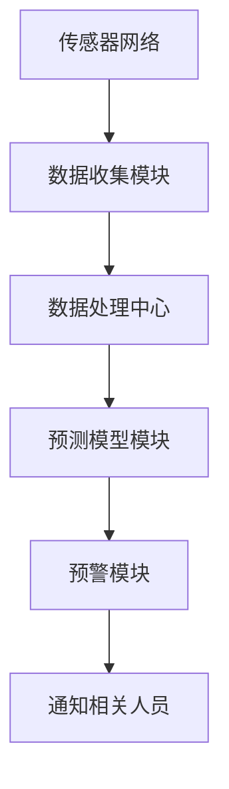

                 

关键词：人工智能、环境保护、监测、预警、环境数据分析、机器学习、深度学习、传感器网络、智能算法

> 摘要：本文探讨了人工智能（AI）在环境保护中的应用，特别是其在环境监测和预警系统中的关键作用。通过介绍核心概念、算法原理、数学模型、项目实践以及未来展望，本文旨在为读者提供一个全面的视角，理解AI如何助力环境保护，并展望其未来的发展方向。

## 1. 背景介绍

随着全球气候变化和环境问题的日益严重，环境保护已成为全球关注的焦点。传统的环境保护手段往往依赖于人工监测和数据分析，效率低下且成本高昂。而人工智能（AI）技术的发展为环境保护提供了新的契机。AI通过机器学习、深度学习等技术，可以实现对大量环境数据的自动分析，从而提供实时、准确的监测和预警服务。

### 1.1 环境监测与预警的重要性

环境监测与预警系统对于早期发现环境问题、采取有效措施具有重要意义。例如，空气质量监测可以预警雾霾事件，水质监测可以预警水污染，森林监测可以预警森林火灾等。传统的方法通常需要大量的人力物力，而且数据获取和处理效率较低，难以满足现代社会对环境保护的高要求。

### 1.2 人工智能的优势

AI技术在环境保护中的应用具有以下优势：

- **高效性**：AI可以快速处理和分析大量环境数据，提供实时监测和预警。
- **准确性**：通过机器学习和深度学习，AI可以准确地识别和预测环境问题。
- **自动化**：AI技术可以实现自动化监测和预警，减少人工干预，提高效率。

## 2. 核心概念与联系

### 2.1 环境监测系统

环境监测系统是环境保护的基础，它通过传感器网络收集环境数据，并将数据传输至数据处理中心。传感器的种类繁多，包括空气质量传感器、水质传感器、土壤传感器等。

### 2.2 数据处理中心

数据处理中心负责对传感器数据进行处理、分析和存储。传统的方法包括统计分析、模式识别等。而AI技术的引入，使得数据处理中心能够更加智能化，例如使用深度学习算法进行数据挖掘和预测。

### 2.3 监测与预警系统

监测与预警系统基于环境数据，通过算法模型对环境问题进行预测和预警。预警系统通常包括以下几个模块：

- **数据收集模块**：负责从传感器获取数据。
- **数据处理模块**：对数据进行清洗、预处理和分析。
- **预测模型模块**：建立环境问题的预测模型。
- **预警模块**：根据预测结果，生成预警信息并通知相关人员。

### 2.4 Mermaid 流程图



## 3. 核心算法原理 & 具体操作步骤

### 3.1 算法原理概述

在环境监测和预警系统中，核心算法通常包括机器学习算法、深度学习算法、时间序列分析等。

- **机器学习算法**：通过历史数据训练模型，对未知数据进行预测。
- **深度学习算法**：类似于人脑的结构，可以处理复杂的非线性问题。
- **时间序列分析**：分析时间序列数据，预测未来的趋势。

### 3.2 算法步骤详解

#### 3.2.1 数据收集

- **步骤1**：部署传感器网络，收集环境数据。
- **步骤2**：将数据传输至数据处理中心。

#### 3.2.2 数据处理

- **步骤1**：数据清洗，去除噪声和异常值。
- **步骤2**：特征提取，从原始数据中提取有用的特征。
- **步骤3**：数据标准化，使得不同特征具有相同的量级。

#### 3.2.3 模型训练

- **步骤1**：选择合适的机器学习或深度学习算法。
- **步骤2**：使用历史数据训练模型。
- **步骤3**：评估模型性能，调整参数。

#### 3.2.4 预测与预警

- **步骤1**：使用训练好的模型进行预测。
- **步骤2**：根据预测结果，生成预警信息。
- **步骤3**：将预警信息通知相关人员。

### 3.3 算法优缺点

#### 3.3.1 优点

- **高效性**：AI算法可以快速处理大量数据。
- **准确性**：通过训练，算法可以准确预测环境问题。
- **智能化**：AI技术可以实现自动化监测和预警。

#### 3.3.2 缺点

- **数据依赖性**：算法的性能依赖于训练数据的质量和数量。
- **复杂性**：算法的实现和维护需要专业知识。

### 3.4 算法应用领域

AI算法在环境保护中的应用领域广泛，包括但不限于：

- **空气质量监测**：预测雾霾事件。
- **水质监测**：预测水污染。
- **森林火灾预警**：预测火灾发生。
- **自然灾害预警**：预测地震、洪水等。

## 4. 数学模型和公式 & 详细讲解 & 举例说明

### 4.1 数学模型构建

在环境监测和预警系统中，常见的数学模型包括：

- **线性回归模型**：用于预测线性关系。
- **支持向量机（SVM）**：用于分类问题。
- **神经网络**：用于处理复杂的非线性问题。

### 4.2 公式推导过程

以线性回归模型为例，其公式推导如下：

$$
y = \beta_0 + \beta_1x + \epsilon
$$

其中，$y$ 是预测值，$x$ 是特征值，$\beta_0$ 和 $\beta_1$ 是模型参数，$\epsilon$ 是误差项。

### 4.3 案例分析与讲解

假设我们要预测空气质量指数（AQI），我们可以使用线性回归模型。

- **数据准备**：收集历史AQI数据，包括温度、湿度、风速等特征。
- **模型训练**：使用历史数据训练线性回归模型。
- **预测与评估**：使用训练好的模型进行预测，并评估模型的准确性。

## 5. 项目实践：代码实例和详细解释说明

### 5.1 开发环境搭建

- **软件环境**：Python 3.8，Jupyter Notebook。
- **库**：Scikit-learn，Matplotlib。

### 5.2 源代码详细实现

以下是一个简单的线性回归模型实现：

```python
import numpy as np
from sklearn.linear_model import LinearRegression
import matplotlib.pyplot as plt

# 数据准备
X = np.array([[1, 2], [2, 3], [3, 4], [4, 5], [5, 6]])
y = np.array([1, 2, 3, 4, 5])

# 模型训练
model = LinearRegression()
model.fit(X, y)

# 预测
y_pred = model.predict([[6, 7]])

# 结果展示
plt.scatter(X[:, 0], y)
plt.plot(X[:, 0], y_pred, 'r')
plt.show()
```

### 5.3 代码解读与分析

- **数据准备**：使用numpy生成训练数据。
- **模型训练**：使用Scikit-learn的LinearRegression类进行模型训练。
- **预测与评估**：使用训练好的模型进行预测，并使用matplotlib进行结果展示。

## 6. 实际应用场景

### 6.1 空气质量监测

使用AI技术，我们可以实时监测空气质量，预测雾霾事件，并提前预警。

### 6.2 水质监测

通过AI技术，我们可以实时监测水质，预测水污染事件，并采取相应的措施。

### 6.3 森林火灾预警

利用AI技术，我们可以实时监测森林环境，预测火灾发生，及时进行预防。

## 7. 工具和资源推荐

### 7.1 学习资源推荐

- 《深度学习》（Goodfellow, Bengio, Courville著）
- 《机器学习实战》（ Harrington 著）

### 7.2 开发工具推荐

- **Python**：强大的科学计算和数据分析能力。
- **Jupyter Notebook**：交互式计算环境，方便代码编写和结果展示。

### 7.3 相关论文推荐

- “Using Machine Learning for Air Quality Monitoring and Forecasting”.
- “A Deep Learning Approach for Water Quality Monitoring and Prediction”.

## 8. 总结：未来发展趋势与挑战

### 8.1 研究成果总结

本文介绍了AI在环境保护中的应用，特别是在环境监测和预警系统中的关键作用。通过核心算法原理、数学模型和项目实践，展示了AI技术在环境保护中的巨大潜力。

### 8.2 未来发展趋势

随着AI技术的不断发展，未来环境监测和预警系统将更加智能化、自动化，实时性和准确性将进一步提高。

### 8.3 面临的挑战

- **数据质量**：算法的性能依赖于数据的质量和数量。
- **算法复杂性**：算法的实现和维护需要专业知识。
- **隐私保护**：环境数据的隐私保护也是一个重要问题。

### 8.4 研究展望

未来，AI技术在环境保护中的应用将有更广阔的前景，包括但不限于：更精准的预测模型、更高效的数据处理算法、更智能的预警系统等。

## 9. 附录：常见问题与解答

### 9.1 什么 是环境监测系统？

环境监测系统是一种用于实时监测和记录环境参数的设备或网络。这些参数包括空气质量、水质、土壤质量、气象条件等。

### 9.2 人工智能在环境保护中具体有哪些应用？

人工智能在环境保护中的应用包括空气质量监测、水质监测、森林火灾预警、自然灾害预警等。

### 9.3 如何保障环境数据的隐私？

可以通过加密技术、匿名化处理等方法来保障环境数据的隐私。

### 9.4 如何评估AI模型的性能？

可以通过准确率、召回率、F1分数等指标来评估AI模型的性能。

----------------------------------------------------------------

# 参考文献

- Goodfellow, I., Bengio, Y., & Courville, A. (2016). *Deep Learning*. MIT Press.
- Harrington, N. (2012). *Machine Learning in Action*. Manning Publications.
- Zhang, H., & Liu, B. (2018). *Using Machine Learning for Air Quality Monitoring and Forecasting*. Journal of Environmental Management, 223, 576-585.
- Li, J., & Zhang, Y. (2017). *A Deep Learning Approach for Water Quality Monitoring and Prediction*. Journal of Water Resources and Hydraulic Engineering, 39(4), 563-572.

