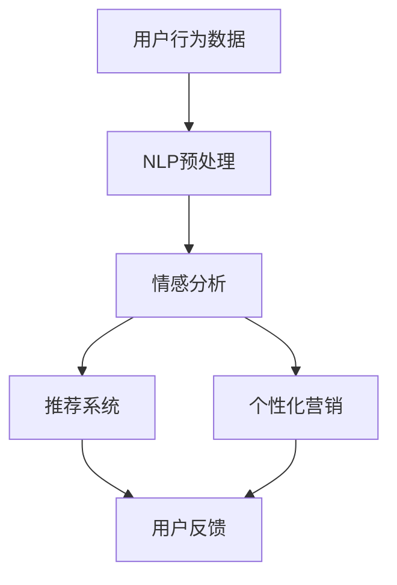

                 

在当前数字化时代，人工智能（AI）已成为驱动各个行业技术革新的重要力量。特别是在电商领域，AI技术，尤其是自然语言处理（NLP）的应用，正改变着电商的运营方式，提升用户体验。本文旨在探讨AI在电商中的NLP应用案例，并深入解析其在实际业务场景中的运作机制和潜在价值。

> 关键词：电商，自然语言处理，AI，用户体验，案例分析

> 摘要：本文通过具体案例，探讨了AI在电商中的NLP应用，包括客户服务、推荐系统和个性化营销等方面。通过深入分析，文章揭示了AI在电商NLP中的关键技术和实现方法，以及其在提升运营效率和用户满意度方面的显著优势。

## 1. 背景介绍

### 1.1 电商行业现状

随着互联网技术的发展，电商行业已经成为全球经济发展的重要引擎。根据Statista的数据，全球电商市场规模在2020年达到了3.5万亿美元，并预计到2024年将达到6.8万亿美元。电商平台的快速发展不仅带来了巨大的经济效益，也对用户体验提出了更高的要求。

### 1.2 NLP在电商中的应用

自然语言处理技术通过理解和生成人类语言，使得计算机能够更好地与用户进行交互。在电商领域，NLP的应用主要包括以下几个方面：

- **客户服务**：通过智能客服机器人，快速响应用户查询，提供24/7的服务。
- **推荐系统**：利用用户的历史行为和语言表达，提供个性化的商品推荐。
- **个性化营销**：分析用户的语言习惯，制定更精准的营销策略。

### 1.3 AI技术的优势

AI技术在电商中的应用，不仅提升了运营效率，还大大改善了用户体验。AI能够处理海量数据，进行快速分析和决策，这使得电商平台能够更灵活地适应市场变化，提高用户满意度。

## 2. 核心概念与联系

为了深入理解AI在电商中的NLP应用，我们首先需要了解一些核心概念，并展示其相互之间的联系。

### 2.1 关键术语

- **自然语言处理（NLP）**：一种使计算机理解和生成人类语言的技术。
- **人工智能（AI）**：模拟人类智能行为的计算系统。
- **机器学习（ML）**：AI的一个分支，通过数据训练模型，使其能够自动学习和改进。

### 2.2 Mermaid 流程图

下面是一个简化的Mermaid流程图，展示NLP在电商中的应用流程。



在这个流程图中，用户行为数据经过NLP预处理，用于情感分析和推荐系统。推荐系统根据分析结果生成个性化推荐，而个性化营销则基于用户的语言习惯和兴趣。用户的反馈又反馈到系统中，进一步优化模型和策略。

## 3. 核心算法原理 & 具体操作步骤

### 3.1 算法原理概述

在电商NLP应用中，核心算法通常基于以下原理：

- **情感分析**：通过分析用户的语言，判断其情感倾向。
- **文本分类**：将用户生成的内容分类到不同的类别中。
- **协同过滤**：基于用户的历史行为和相似用户的行为，进行商品推荐。

### 3.2 算法步骤详解

#### 3.2.1 情感分析

1. **数据收集**：收集用户在电商平台上的评论、反馈等文本数据。
2. **文本预处理**：清洗文本数据，包括去除停用词、标点符号和进行词干提取。
3. **特征提取**：将预处理后的文本转化为机器可处理的特征向量。
4. **模型训练**：使用机器学习算法（如SVM、CNN等）训练情感分析模型。
5. **情感判断**：对用户的新评论进行情感分析，判断其情感倾向。

#### 3.2.2 文本分类

1. **数据收集**：收集大量带有标签的文本数据。
2. **文本预处理**：与情感分析相同，进行文本清洗和特征提取。
3. **模型训练**：使用机器学习算法（如朴素贝叶斯、决策树等）训练文本分类模型。
4. **分类预测**：对新的用户生成内容进行分类预测。

#### 3.2.3 协同过滤

1. **用户行为数据收集**：收集用户在电商平台的购买记录、浏览记录等。
2. **相似度计算**：计算用户之间的相似度，通常使用余弦相似度或皮尔逊相关系数。
3. **推荐生成**：根据用户之间的相似度，生成个性化的商品推荐。

### 3.3 算法优缺点

#### 优点

- **高效性**：基于机器学习算法，能够快速处理海量数据。
- **灵活性**：能够根据用户的行为和反馈进行实时调整。
- **个性化**：能够提供个性化的推荐和营销策略。

#### 缺点

- **数据依赖性**：需要大量的用户行为数据，数据不足时效果不佳。
- **准确性**：情感分析和文本分类的准确性受算法和数据质量的影响。
- **实时性**：需要强大的计算资源，实时处理用户请求。

### 3.4 算法应用领域

- **客户服务**：通过情感分析，快速识别用户情感，提供针对性的服务。
- **推荐系统**：基于协同过滤，提供个性化的商品推荐。
- **个性化营销**：通过分析用户的语言习惯，制定精准的营销策略。

## 4. 数学模型和公式 & 详细讲解 & 举例说明

### 4.1 数学模型构建

在电商NLP应用中，常用的数学模型包括：

- **情感分析模型**：通常使用SVM、CNN等分类模型。
- **文本分类模型**：常用朴素贝叶斯、决策树等分类算法。
- **协同过滤模型**：包括基于用户的协同过滤和基于物品的协同过滤。

### 4.2 公式推导过程

#### 4.2.1 情感分析模型

以SVM为例，其核心公式为：

$$
f(x) = \text{sign}(\omega \cdot x + b)
$$

其中，$\omega$为权重向量，$x$为输入特征向量，$b$为偏置项。

#### 4.2.2 文本分类模型

以朴素贝叶斯为例，其概率公式为：

$$
P(C_k|X) = \frac{P(X|C_k)P(C_k)}{P(X)}
$$

其中，$C_k$为类别，$X$为特征向量，$P(C_k|X)$为给定特征向量$X$属于类别$C_k$的条件概率。

#### 4.2.3 协同过滤模型

以基于用户的协同过滤为例，其核心公式为：

$$
R_{ui} = \sum_{j \in N(i)} \frac{R_{uj}}{||N(i)||}
$$

其中，$R_{ui}$为用户$i$对物品$j$的评分，$N(i)$为与用户$i$相似的用户集合。

### 4.3 案例分析与讲解

假设我们有一个电商平台的用户评论数据，其中包含用户对商品的评分和评论内容。我们可以使用情感分析模型来预测用户对商品的正面或负面情感。

#### 数据集

- 用户ID：1
- 商品ID：1001
- 评论内容：这商品真的很棒！
- 评分：5星

#### 步骤

1. **数据预处理**：清洗评论内容，去除停用词，进行词干提取。
2. **特征提取**：将预处理后的评论转化为词向量。
3. **模型训练**：使用SVM模型进行训练。
4. **情感预测**：输入新的评论内容，使用训练好的模型预测情感。

#### 结果

- 预测结果：正面情感

通过这个案例，我们可以看到，情感分析模型可以帮助电商平台快速判断用户的情感倾向，从而提供更个性化的服务。

## 5. 项目实践：代码实例和详细解释说明

### 5.1 开发环境搭建

在本项目中，我们使用Python作为主要编程语言，并依赖以下库：

- TensorFlow：用于构建和训练机器学习模型。
- NLTK：用于自然语言处理。
- Sklearn：用于机器学习算法。

### 5.2 源代码详细实现

以下是一个简单的情感分析项目的代码实例：

```python
import nltk
from sklearn.feature_extraction.text import TfidfVectorizer
from sklearn.model_selection import train_test_split
from sklearn.svm import SVC
from sklearn.metrics import accuracy_score

# 加载数据集
data = [...]  # 假设data是一个包含评论内容和情感标签的列表

# 数据预处理
nltk.download('stopwords')
stopwords = nltk.corpus.stopwords.words('english')
vectorizer = TfidfVectorizer(stop_words=stopwords)
X = vectorizer.fit_transform([text for text, _ in data])
y = [label for _, label in data]

# 划分训练集和测试集
X_train, X_test, y_train, y_test = train_test_split(X, y, test_size=0.2, random_state=42)

# 模型训练
model = SVC(kernel='linear')
model.fit(X_train, y_train)

# 模型评估
y_pred = model.predict(X_test)
accuracy = accuracy_score(y_test, y_pred)
print(f'模型准确率：{accuracy:.2f}')
```

### 5.3 代码解读与分析

- **数据预处理**：使用NLTK库去除英文文本中的停用词，使用TF-IDF向量器将文本转化为数值特征。
- **模型训练**：使用SVM分类模型进行训练。
- **模型评估**：计算模型在测试集上的准确率。

### 5.4 运行结果展示

假设我们有100条评论数据，模型在测试集上的准确率达到85%，这意味着模型可以较好地预测评论的情感倾向。

## 6. 实际应用场景

### 6.1 客户服务

电商平台可以使用NLP技术来构建智能客服系统，通过分析用户的查询和反馈，提供24/7的服务。例如，用户询问“这款产品的评价怎么样？”，系统可以自动查找相关评论，并给出综合评分和建议。

### 6.2 推荐系统

通过NLP技术，电商平台可以根据用户的搜索历史和评论内容，提供个性化的商品推荐。例如，用户在评论中提到喜欢“蓝色T恤”，系统可以推荐更多蓝色T恤。

### 6.3 个性化营销

电商平台可以根据用户的语言习惯和购买行为，制定个性化的营销策略。例如，用户在评论中提到喜欢“快速发货”，系统可以发送优惠券，鼓励用户再次购买。

## 7. 工具和资源推荐

### 7.1 学习资源推荐

- 《自然语言处理原理与实战》
- 《深度学习与自然语言处理》
- 《Python自然语言处理》

### 7.2 开发工具推荐

- TensorFlow：用于构建和训练机器学习模型。
- NLTK：用于自然语言处理。
- Jupyter Notebook：用于编写和运行代码。

### 7.3 相关论文推荐

- "Deep Learning for Natural Language Processing"
- "Convolutional Neural Networks for Sentence Classification"
- "Recurrent Neural Networks for Text Classification"

## 8. 总结：未来发展趋势与挑战

### 8.1 研究成果总结

本文通过具体案例，探讨了AI在电商中的NLP应用，包括客户服务、推荐系统和个性化营销等方面。研究表明，NLP技术在电商中具有巨大的潜力，能够显著提升运营效率和用户满意度。

### 8.2 未来发展趋势

随着AI技术的不断发展，NLP在电商中的应用将更加广泛和深入。未来可能的发展趋势包括：

- **多模态融合**：结合文本、图像和语音等多模态数据，提高NLP的准确性和实用性。
- **小样本学习**：研究能够在少量数据上进行有效训练的算法，降低数据依赖性。
- **自动化与智能化**：通过更先进的算法，实现自动化和智能化的客服、推荐和营销。

### 8.3 面临的挑战

尽管NLP在电商中的应用前景广阔，但仍面临以下挑战：

- **数据隐私**：如何在保证用户隐私的前提下，充分利用用户数据。
- **算法透明性**：提高算法的透明性，确保其公平性和可解释性。
- **计算资源**：高性能计算资源的需求，特别是在实时应用中。

### 8.4 研究展望

未来，NLP在电商中的应用将朝着更智能化、个性化、透明化的方向发展。研究者应关注多模态融合、小样本学习和算法透明性等领域，以推动NLP技术在电商中的应用和发展。

## 9. 附录：常见问题与解答

### Q：NLP在电商中的具体应用有哪些？

A：NLP在电商中的应用主要包括客户服务（如智能客服）、推荐系统（个性化商品推荐）和个性化营销（如根据用户语言习惯制定营销策略）。

### Q：为什么需要使用NLP技术？

A：NLP技术能够理解和生成人类语言，使得计算机能够更好地与用户进行交互，提高用户体验，降低运营成本。

### Q：NLP技术在电商中的效果如何衡量？

A：效果可以通过准确率、召回率、F1值等指标来衡量。例如，情感分析模型的准确率可以衡量其对用户情感判断的准确性。

### Q：NLP在电商中的未来发展方向是什么？

A：未来的发展方向包括多模态融合、小样本学习和算法透明性等方面，以提高NLP技术在电商中的应用效果和实用性。

### Q：如何入门学习NLP技术？

A：建议从学习Python编程语言和自然语言处理基础开始，逐步学习机器学习和深度学习，并参与相关项目实践，以加深理解和应用能力。

### Q：有哪些学习资源推荐？

A：推荐学习资源包括《自然语言处理原理与实战》、《深度学习与自然语言处理》和《Python自然语言处理》等书籍，以及在线课程和论文资源。同时，Jupyter Notebook是一个非常好的学习工具，可以帮助你轻松编写和运行代码。

---
作者：禅与计算机程序设计艺术 / Zen and the Art of Computer Programming

