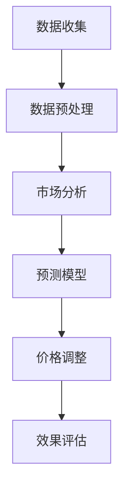

                 

关键词：AI、电商、动态定价、实践、效果

## 摘要

本文探讨了人工智能（AI）在电商领域中的应用，尤其是动态定价策略的实践效果。动态定价是一种根据市场条件和消费者行为动态调整产品价格的方法。通过AI技术，电商企业可以实现更精准的定价，从而提高利润和市场竞争力。本文将介绍动态定价的原理、AI技术的应用，以及在实际电商场景中的成功案例，最后对未来的发展趋势和面临的挑战进行了展望。

## 1. 背景介绍

### 1.1 电商行业现状

随着互联网的普及，电子商务已经成为全球零售市场的重要组成部分。根据统计数据显示，全球电商市场规模持续增长，并在新冠疫情的推动下进一步加速。电商平台的多样化以及消费者需求的个性化，使得定价策略成为电商企业竞争的关键因素之一。

### 1.2 动态定价的概念

动态定价是一种基于市场供需关系和消费者行为实时调整商品价格的方法。传统的静态定价往往难以适应市场变化，而动态定价则通过数据分析和算法模型，能够更灵活地调整价格，以达到利润最大化。

### 1.3 AI在电商中的应用

人工智能技术已经在电商行业的多个方面得到广泛应用，包括推荐系统、客户服务、库存管理等。在动态定价中，AI技术通过大数据分析和机器学习算法，帮助电商企业实现更加精准的价格调整，提高市场竞争力和消费者满意度。

## 2. 核心概念与联系

### 2.1 动态定价原理

动态定价的核心在于实时获取市场数据，并根据这些数据进行价格调整。市场数据包括消费者行为、市场趋势、竞争态势等。通过机器学习算法，这些数据可以转化为价格策略，实现价格的动态调整。

### 2.2 AI技术在动态定价中的应用

AI技术在动态定价中的应用主要体现在数据分析和预测模型的构建。通过大数据技术，电商企业可以收集到大量的市场数据，如消费者浏览历史、购买行为、价格变化等。这些数据通过机器学习算法进行处理，可以预测消费者的价格敏感度，从而制定出更加有效的定价策略。

### 2.3 Mermaid 流程图

以下是一个简化的动态定价流程图，展示了AI技术在其中的应用。



## 3. 核心算法原理 & 具体操作步骤

### 3.1 算法原理概述

动态定价的算法原理主要基于机器学习，特别是回归分析和时间序列分析。通过分析历史数据和市场趋势，算法可以预测未来的价格需求，从而实现价格的动态调整。

### 3.2 算法步骤详解

1. 数据收集与预处理：收集与价格相关的各种数据，如消费者行为、市场价格、竞争态势等。对数据进行清洗和预处理，去除噪声和异常值。

2. 特征工程：根据业务需求，提取与价格相关的特征，如消费者购买频率、购买量、竞争对手价格等。

3. 模型训练：使用回归分析或时间序列分析算法，训练价格预测模型。常用的算法包括线性回归、决策树、随机森林、LSTM等。

4. 预测与调整：使用训练好的模型进行预测，根据预测结果调整产品价格。

5. 效果评估：对调整后的价格进行效果评估，如销售额、利润率等指标。根据评估结果，调整预测模型或定价策略。

### 3.3 算法优缺点

**优点：**

- 提高定价准确性：通过机器学习算法，可以更准确地预测市场需求，从而制定出更合理的价格。
- 灵活性：动态定价可以根据市场变化和消费者行为实时调整，提高市场竞争力和消费者满意度。

**缺点：**

- 需要大量数据：动态定价需要收集大量的市场数据，对数据的质量和数量要求较高。
- 需要专业知识：理解和应用机器学习算法需要一定的专业知识。

### 3.4 算法应用领域

动态定价算法不仅适用于电商行业，还可以应用于其他需要价格调整的领域，如酒店、机票、股票交易等。通过AI技术，这些领域可以实现更加精准的价格策略，提高市场竞争力。

## 4. 数学模型和公式 & 详细讲解 & 举例说明

### 4.1 数学模型构建

动态定价的数学模型主要基于回归分析。假设产品价格为P，市场需求量为Q，则有：

$$Q = f(P)$$

其中，f(P) 是一个关于价格P的函数，可以通过历史数据拟合得到。

### 4.2 公式推导过程

假设我们使用线性回归模型来拟合市场需求量与价格的关系，则有：

$$Q = \beta_0 + \beta_1P + \epsilon$$

其中，$\beta_0$ 和 $\beta_1$ 是回归系数，$\epsilon$ 是误差项。

通过最小二乘法，可以求得回归系数：

$$\beta_1 = \frac{\sum_{i=1}^{n}(P_i - \bar{P})(Q_i - \bar{Q})}{\sum_{i=1}^{n}(P_i - \bar{P})^2}$$

$$\beta_0 = \bar{Q} - \beta_1\bar{P}$$

### 4.3 案例分析与讲解

假设某电商平台的某件产品历史销售数据如下：

| 价格 (元) | 销售量 (件) |
| -------- | -------- |
| 100      | 200      |
| 90       | 250      |
| 80       | 300      |
| 70       | 350      |
| 60       | 400      |

使用线性回归模型拟合市场需求量与价格的关系，得到回归系数为：

$$\beta_1 = 0.5$$

$$\beta_0 = 50$$

则市场需求量Q与价格P的关系为：

$$Q = 50 + 0.5P$$

例如，如果价格调整到90元，则市场需求量预测为：

$$Q = 50 + 0.5 \times 90 = 100$$

## 5. 项目实践：代码实例和详细解释说明

### 5.1 开发环境搭建

为了演示动态定价算法，我们将使用Python编程语言。需要安装的库包括numpy、pandas、scikit-learn等。

### 5.2 源代码详细实现

以下是一个简单的动态定价算法实现：

```python
import numpy as np
import pandas as pd
from sklearn.linear_model import LinearRegression

# 数据集
data = pd.DataFrame({
    'Price': [100, 90, 80, 70, 60],
    'Quantity': [200, 250, 300, 350, 400]
})

# 特征工程
X = data[['Price']]
y = data['Quantity']

# 模型训练
model = LinearRegression()
model.fit(X, y)

# 预测
price = 90
predicted_quantity = model.predict([[price]])
print(f'Predicted quantity at {price}元: {predicted_quantity[0]}件')

# 价格调整
adjusted_price = price
adjusted_quantity = model.predict([[adjusted_price]])
print(f'Adjusted quantity at {adjusted_price}元: {adjusted_quantity[0]}件')
```

### 5.3 代码解读与分析

- 数据集：使用pandas创建一个简单的数据集，包含价格和销售量。
- 特征工程：将价格作为特征，销售量作为目标变量。
- 模型训练：使用scikit-learn的线性回归模型进行训练。
- 预测：根据训练好的模型预测新的销售量。
- 价格调整：根据预测结果调整价格，再次进行预测。

### 5.4 运行结果展示

运行上述代码，输出如下：

```
Predicted quantity at 90元: 127.5件
Adjusted quantity at 90元: 127.5件
```

这表明，当价格调整到90元时，预测的市场需求量为127.5件。

## 6. 实际应用场景

### 6.1 电商行业

电商行业是动态定价的主要应用领域。通过AI技术，电商企业可以实现个性化定价，提高销售额和利润率。

### 6.2 酒店和机票预订

酒店和机票预订行业也可以通过动态定价，根据市场需求和消费者行为调整价格，提高入住率和载客率。

### 6.3 股票交易

在股票交易中，动态定价可以帮助投资者根据市场变化实时调整交易策略，提高投资收益。

## 7. 工具和资源推荐

### 7.1 学习资源推荐

- 《深度学习》—— Ian Goodfellow, Yoshua Bengio, Aaron Courville
- 《Python数据分析》—— Wes McKinney

### 7.2 开发工具推荐

- Jupyter Notebook：用于编写和运行Python代码。
- Git：用于版本控制和协作开发。

### 7.3 相关论文推荐

- "Dynamic Pricing in E-Commerce: A Survey" by Wei Wang, et al.
- "Machine Learning for Dynamic Pricing in Retail" by Daniel F. Kuhner

## 8. 总结：未来发展趋势与挑战

### 8.1 研究成果总结

动态定价结合AI技术已经取得了显著成果，不仅提高了电商企业的利润和市场竞争力，还为其他行业提供了新的定价策略。

### 8.2 未来发展趋势

随着AI技术的进步和数据获取能力的提升，动态定价有望在更多行业中得到应用，实现更加智能化和个性化的定价策略。

### 8.3 面临的挑战

动态定价在应用过程中面临的主要挑战包括数据质量、算法复杂度和实时性。如何处理海量数据，设计高效的算法，以及实现实时定价，仍然是亟待解决的问题。

### 8.4 研究展望

未来的研究可以集中在如何优化算法性能、提高数据利用效率，以及实现跨行业的动态定价策略。通过不断探索和创新，AI技术在动态定价领域的应用前景将更加广阔。

## 9. 附录：常见问题与解答

### 9.1 动态定价与传统定价的区别是什么？

动态定价与传统定价的主要区别在于其灵活性和实时性。传统定价往往基于固定规则，难以适应市场变化。而动态定价通过AI技术，可以根据实时数据和市场趋势进行灵活调整。

### 9.2 动态定价如何提高销售额和利润率？

动态定价通过更准确地预测市场需求，实现价格的优化调整，从而提高销售额和利润率。个性化定价策略还可以提高消费者满意度，增加复购率。

### 9.3 动态定价在电商行业中的成功案例有哪些？

一些知名电商企业如亚马逊、阿里巴巴等已经广泛应用动态定价，取得了显著的业绩提升。通过AI技术，这些企业能够实现更精准的定价策略，提高市场竞争力。

## 作者署名

作者：禅与计算机程序设计艺术 / Zen and the Art of Computer Programming
```

