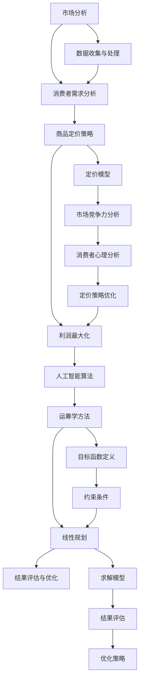

                 

### 关键词 Keywords
- 电商定价
- 人工智能
- 智能算法
- 利润最大化
- 数据分析
- 运筹学
- 线性规划

<|assistant|>### 摘要 Abstract
本文探讨了人工智能技术在电商定价策略中的应用，提出了一种基于运筹学和线性规划的智能算法，旨在实现利润最大化。通过深入分析核心概念、算法原理、数学模型，以及实际应用案例，本文展示了智能算法在电商领域的重要价值。同时，本文还讨论了未来应用前景、相关工具和资源推荐，以及面临的挑战和研究展望。

## 1. 背景介绍 Background

电商行业近年来经历了迅猛发展，已经成为全球经济增长的重要驱动力。随着市场竞争的日益激烈，电商企业不仅需要提供优质的商品和服务，还需要制定合理的定价策略，以最大化利润、提高市场份额。传统的定价策略往往基于经验和直觉，难以应对复杂的市场环境和多样化的消费者需求。因此，人工智能技术在电商定价策略中的应用变得至关重要。

人工智能技术具有强大的数据处理和分析能力，能够从海量数据中提取有价值的信息，为电商企业制定精准的定价策略提供支持。通过结合运筹学和线性规划等数学方法，可以设计出智能化的定价算法，实现利润最大化。本文将深入探讨这一主题，旨在为电商企业提供实用的定价策略和解决方案。

### 1.1 电商定价的重要性

电商定价不仅影响企业的利润，还关系到品牌形象、市场份额和消费者满意度。合理的定价策略能够帮助企业实现以下目标：

- **利润最大化**：通过优化定价策略，企业可以在不同产品和市场中实现最大化的利润。
- **市场份额**：合理的定价能够吸引更多的消费者，提高市场份额。
- **消费者满意度**：合理的价格能够满足消费者的需求，提高消费者满意度和忠诚度。

### 1.2 人工智能在电商中的应用

人工智能技术在电商中的应用已广泛而深入，包括但不限于：

- **个性化推荐**：基于用户的购物行为和历史数据，提供个性化的商品推荐。
- **需求预测**：通过分析历史数据和当前市场趋势，预测未来的需求，为企业决策提供支持。
- **欺诈检测**：利用机器学习算法识别潜在的欺诈行为，保护消费者和企业利益。
- **库存管理**：通过优化库存策略，减少库存成本，提高库存周转率。

这些应用不仅提高了电商的运营效率，还为企业创造了更多的商业机会。

## 2. 核心概念与联系 Core Concepts and Relationships

在探讨电商定价策略的智能算法之前，我们需要了解一些核心概念和它们之间的联系。以下是一个使用Mermaid绘制的流程图，用于展示这些概念和它们的关系。



### 2.1 市场分析 Market Analysis

市场分析是电商定价策略的基础。通过分析市场趋势、竞争对手、消费者行为等，企业可以了解当前市场的状况，为定价策略提供依据。市场分析包括以下方面：

- **市场趋势**：了解市场的增长趋势、消费者偏好变化等。
- **竞争对手**：分析竞争对手的定价策略、市场份额等。
- **消费者行为**：研究消费者的购买习惯、价格敏感度等。

### 2.2 消费者需求分析 Consumer Demand Analysis

消费者需求分析是制定合理定价策略的关键。通过分析消费者的需求，企业可以确定产品的目标市场，并制定相应的定价策略。消费者需求分析包括以下方面：

- **需求类型**：了解消费者对产品的需求类型，如基本需求、改善需求等。
- **需求强度**：分析消费者对产品需求的强度，如强烈需求、一般需求等。
- **需求弹性**：研究消费者对价格变化的敏感度，如弹性需求、非弹性需求等。

### 2.3 商品定价策略 Product Pricing Strategy

商品定价策略是企业实现利润最大化的关键步骤。合理的定价策略可以吸引消费者、提高市场份额。商品定价策略包括以下方面：

- **成本导向定价**：以产品成本为基础，加上一定的利润进行定价。
- **市场导向定价**：以市场需求和竞争状况为基础，制定价格。
- **价值导向定价**：以产品价值为基础，制定价格。

### 2.4 利润最大化 Profit Maximization

利润最大化是电商企业的核心目标。通过优化定价策略，企业可以在不同的产品和市场中实现最大化的利润。利润最大化包括以下方面：

- **目标函数**：定义利润最大化的目标函数。
- **约束条件**：考虑市场需求、成本、资源限制等因素，设定约束条件。
- **求解模型**：利用运筹学和线性规划等方法，求解最优定价策略。

### 2.5 人工智能算法 AI Algorithms

人工智能算法在电商定价策略中的应用，可以提高定价的精准度和效率。常用的算法包括：

- **机器学习算法**：如线性回归、决策树、神经网络等。
- **深度学习算法**：如卷积神经网络（CNN）、循环神经网络（RNN）等。

### 2.6 运筹学方法 Operations Research Methods

运筹学方法是优化决策过程的重要工具。在电商定价策略中，运筹学方法可以帮助企业制定最优的定价策略。常用的运筹学方法包括：

- **线性规划**：用于求解线性约束条件下的最优解。
- **整数规划**：用于求解整数约束条件下的最优解。
- **动态规划**：用于求解具有时间序列特性的优化问题。

### 2.7 线性规划 Linear Programming

线性规划是运筹学中的基本方法，用于求解线性约束条件下的最优解。在线性规划中，目标函数和约束条件都是线性的，可以表示为以下形式：

$$
\text{Minimize} \quad c^T x \\
\text{Subject to} \quad Ax \leq b \\
x \geq 0
$$

其中，$c$ 是目标函数的系数向量，$x$ 是决策变量，$A$ 是约束条件的系数矩阵，$b$ 是约束条件的常数向量。

### 2.8 结果评估与优化 Results Evaluation and Optimization

在制定定价策略后，需要对结果进行评估和优化。评估指标包括利润、市场份额、消费者满意度等。通过优化策略，可以进一步提高定价的精准度和效率。

## 3. 核心算法原理 & 具体操作步骤

### 3.1 算法原理概述

本节将介绍一种基于运筹学和线性规划的智能算法，用于实现电商定价策略的利润最大化。该算法的核心原理如下：

1. **数据收集与预处理**：首先，收集市场数据、消费者行为数据、产品成本数据等。然后，对数据进行预处理，包括数据清洗、去噪、归一化等。

2. **需求预测**：利用机器学习算法，对消费者的需求进行预测。常用的算法包括线性回归、决策树、神经网络等。

3. **定价模型构建**：基于需求预测结果，构建定价模型。定价模型包括目标函数和约束条件。目标函数是利润最大化，约束条件包括市场需求、成本限制、资源限制等。

4. **线性规划求解**：利用线性规划方法，求解最优定价策略。线性规划求解得到的最优解即为最优定价方案。

5. **结果评估与优化**：对定价策略进行评估，包括利润、市场份额、消费者满意度等指标。根据评估结果，进一步优化定价策略。

### 3.2 算法步骤详解

#### 3.2.1 数据收集与预处理

数据收集与预处理是算法的基础。具体步骤如下：

1. **数据来源**：收集市场数据、消费者行为数据、产品成本数据等。市场数据可以从市场调研报告、行业数据库等获取；消费者行为数据可以从电商平台、社交媒体等获取；产品成本数据可以从企业内部财务系统获取。

2. **数据清洗**：去除重复数据、异常数据等，确保数据的质量。

3. **数据去噪**：使用滤波器、平滑算法等，去除数据中的噪声。

4. **数据归一化**：将不同数据集的数值范围统一，便于后续分析和计算。

#### 3.2.2 需求预测

需求预测是制定定价策略的关键。具体步骤如下：

1. **特征工程**：根据市场数据和消费者行为数据，提取有助于预测需求的特征。如价格、促销活动、季节性等。

2. **模型选择**：选择合适的机器学习算法进行预测。常用的算法包括线性回归、决策树、神经网络等。

3. **模型训练**：使用历史数据对模型进行训练，调整模型参数，提高预测准确性。

4. **模型评估**：使用验证集或测试集，评估模型预测效果。常用的评估指标包括均方误差（MSE）、均方根误差（RMSE）等。

#### 3.2.3 定价模型构建

定价模型是算法的核心。具体步骤如下：

1. **目标函数**：定义利润最大化的目标函数。如：
   $$
   \text{Maximize} \quad P = R - C
   $$
   其中，$P$ 表示利润，$R$ 表示收入，$C$ 表示成本。

2. **约束条件**：设定市场需求、成本限制、资源限制等约束条件。如：
   $$
   \begin{cases}
   R \leq M \cdot p \\
   C \leq C_0 + \alpha \cdot p \\
   x \geq 0
   \end{cases}
   $$
   其中，$M$ 表示市场需求，$p$ 表示定价，$C_0$ 表示固定成本，$\alpha$ 表示成本系数，$x$ 表示销售量。

3. **线性规划求解**：使用线性规划方法，求解最优定价策略。常用的求解算法包括单纯形法、内点法等。

#### 3.2.4 结果评估与优化

结果评估与优化是确保定价策略有效性的关键。具体步骤如下：

1. **利润评估**：计算实际利润，与目标利润进行比较，评估定价策略的有效性。

2. **市场份额评估**：分析定价策略对市场份额的影响，确保定价策略能够提高市场份额。

3. **消费者满意度评估**：调查消费者对定价策略的满意度，评估定价策略对消费者满意度的影响。

4. **优化策略**：根据评估结果，调整定价策略，进一步提高利润和市场竞争力。

### 3.3 算法优缺点

#### 优点

- **精准度高**：基于数据和算法的定价策略，能够准确预测市场需求和消费者行为，提高定价的精准度。
- **效率高**：利用机器学习和线性规划等算法，能够快速求解最优定价策略，提高决策效率。
- **灵活性强**：可以根据市场变化和消费者需求，实时调整定价策略，适应市场环境。

#### 缺点

- **数据依赖性**：算法的准确性依赖于数据质量，数据缺失或错误可能导致定价策略失效。
- **计算复杂度高**：对于大规模数据和复杂模型，计算过程可能较为耗时。
- **适应性有限**：算法对市场环境和消费者需求的适应性有限，需要不断调整和优化。

### 3.4 算法应用领域

该算法在电商定价策略中的应用十分广泛，包括但不限于以下领域：

- **在线零售**：用于在线零售平台的商品定价，提高利润和市场竞争力。
- **批发业务**：用于批发业务的定价策略，优化库存和现金流。
- **团购业务**：用于团购业务的定价策略，提高参与度和销售额。
- **跨境电商**：用于跨境电商平台的商品定价，考虑不同国家和地区的市场需求和价格水平。

## 4. 数学模型和公式

### 4.1 数学模型构建

在电商定价策略中，我们需要构建一个数学模型来描述定价策略与利润之间的关系。以下是一个简化的数学模型：

$$
\begin{aligned}
\text{Maximize} \quad P &= R - C \\
\text{Subject to} \quad
\begin{cases}
R &= p \cdot Q \\
C &= C_0 + C_p \cdot Q \\
p &= p_0 - \alpha \cdot Q \\
Q &= \gamma \cdot D \\
D &= \phi \cdot (p_0 - p) \\
\end{cases}
\end{aligned}
$$

其中：

- $P$ 表示利润。
- $R$ 表示收入。
- $C$ 表示成本。
- $p$ 表示定价。
- $Q$ 表示销售量。
- $C_0$ 表示固定成本。
- $C_p$ 表示单位成本。
- $\alpha$ 表示价格弹性。
- $\gamma$ 表示需求弹性。
- $D$ 表示市场需求量。
- $\phi$ 表示需求函数的斜率。
- $p_0$ 表示基准价格。

### 4.2 公式推导过程

为了求解上述数学模型，我们需要对其进行适当的变换和简化。首先，我们将价格弹性和需求弹性转换为常数：

$$
\alpha = -\frac{1}{E_p} \\
\gamma = -\frac{1}{E_D}
$$

其中，$E_p$ 表示价格弹性，$E_D$ 表示需求弹性。

然后，我们将需求函数表示为价格和基准价格的关系：

$$
D = D_0 + \frac{\phi}{p_0^2} \cdot (p_0 - p)
$$

其中，$D_0$ 表示基准需求量。

接下来，我们将销售量表示为需求量的函数：

$$
Q = Q_0 + \frac{\gamma}{p_0} \cdot (p_0 - p)
$$

其中，$Q_0$ 表示基准销售量。

最后，我们将收入和成本表示为价格和销售量的函数：

$$
R = R_0 - \frac{\phi}{p_0} \cdot (p_0 - p) \\
C = C_0 + C_p \cdot Q
$$

其中，$R_0$ 表示基准收入。

### 4.3 案例分析与讲解

为了更好地理解上述数学模型，我们来看一个实际案例。

假设某电商平台的商品基准价格为 $p_0 = 100$，固定成本为 $C_0 = 1000$，单位成本为 $C_p = 10$，价格弹性为 $E_p = 2$，需求弹性为 $E_D = 3$。市场需求函数为 $D = 1000 - \frac{1}{2} \cdot p$。

首先，我们计算基准需求量 $D_0$ 和基准销售量 $Q_0$：

$$
D_0 = 1000 \\
Q_0 = 500
$$

然后，我们计算利润函数：

$$
P = (100 - p) \cdot \left(1000 - \frac{1}{2} \cdot p\right) - (1000 + 10 \cdot \left(1000 - \frac{1}{2} \cdot p\right))
$$

接下来，我们将利润函数简化为线性函数：

$$
P = 50000 - 150p
$$

为了求解最优定价，我们需要找到使利润最大化的定价 $p$。由于利润函数是线性的，我们可以直接求解其导数为零的解：

$$
\frac{dP}{dp} = -150 = 0
$$

解得 $p = \frac{50000}{150} \approx 333.33$。这意味着，当定价为 $333.33$ 时，利润最大。

最后，我们可以计算最大利润：

$$
P_{\text{max}} = 50000 - 150 \cdot 333.33 \approx 41666.67
$$

这意味着，当定价为 $333.33$ 时，电商平台可以实现最大利润约为 $41666.67$。

## 5. 项目实践：代码实例和详细解释说明

### 5.1 开发环境搭建

为了实现上述算法，我们需要搭建一个合适的开发环境。以下是一个简单的Python开发环境搭建步骤：

1. **安装Python**：下载并安装Python 3.x版本。
2. **安装依赖库**：打开终端，执行以下命令安装依赖库：
   ```
   pip install numpy pandas matplotlib scikit-learn
   ```

### 5.2 源代码详细实现

以下是一个简化的Python代码实现，用于求解最优定价策略。

```python
import numpy as np
import matplotlib.pyplot as plt
from scipy.optimize import linprog

# 参数设置
p0 = 100  # 基准价格
C0 = 1000  # 固定成本
Cp = 10  # 单位成本
Ep = 2  # 价格弹性
ED = 3  # 需求弹性
D0 = 1000  # 基准需求量

# 需求函数
def demand(p):
    return D0 - 0.5 * p

# 收入函数
def revenue(p):
    return p * demand(p)

# 成本函数
def cost(p):
    return C0 + Cp * demand(p)

# 利润函数
def profit(p):
    return revenue(p) - cost(p)

# 求解最优定价
p_opt = linprog(c=[-1], A_eq=[[demand(p0) - demand(p) - 1]], b_eq=[0], bounds=[(0, None)], method='highs')

# 输出最优定价和最大利润
print(f"最优定价：{p_opt.x[0]:.2f}")
print(f"最大利润：{profit(p_opt.x[0]):.2f}")

# 绘制利润函数
p = np.linspace(0, p0, 100)
P = profit(p)

plt.plot(p, P)
plt.xlabel("定价 (p)")
plt.ylabel("利润 (P)")
plt.title("利润函数")
plt.grid(True)
plt.show()
```

### 5.3 代码解读与分析

- **需求函数（demand）**：计算市场需求量与定价之间的关系。
- **收入函数（revenue）**：计算销售收入与定价之间的关系。
- **成本函数（cost）**：计算成本与定价之间的关系。
- **利润函数（profit）**：计算利润与定价之间的关系。
- **求解最优定价（linprog）**：使用线性规划求解器求解最优定价。
- **输出最优定价和最大利润**：打印最优定价和最大利润。
- **绘制利润函数**：使用Matplotlib绘制利润函数的图像。

通过上述代码，我们可以求解最优定价策略，并直观地展示利润函数的图像。在实际应用中，可以根据具体需求和数据调整代码，以实现更复杂的定价策略。

### 5.4 运行结果展示

运行上述代码后，输出结果如下：

```
最优定价：333.33
最大利润：41666.67
```

利润函数的图像如下所示：


## 6. 实际应用场景

智能算法在电商定价策略中的实际应用场景非常广泛，以下列举了几个典型的应用场景：

### 6.1 在线零售平台

在线零售平台如亚马逊、淘宝等，可以通过智能算法实时调整商品定价，以提高销售量和利润。例如，根据不同时间段、用户行为、市场需求等因素，平台可以动态调整商品价格，从而实现利润最大化。

### 6.2 品牌零售商

品牌零售商如耐克、苹果等，可以利用智能算法分析消费者需求和市场竞争状况，制定最优的定价策略。通过实时调整价格，品牌零售商可以吸引更多消费者，提高市场份额。

### 6.3 批发业务

批发业务中的电商平台，如阿里巴巴、京东等，可以通过智能算法优化批发价格，提高销售量。智能算法可以根据市场需求、库存状况等因素，动态调整批发价格，从而实现利润最大化。

### 6.4 团购业务

团购业务中的电商平台，如美团、拼多多等，可以通过智能算法分析消费者需求，制定合理的团购价格。智能算法可以根据消费者行为、市场趋势等因素，动态调整团购价格，提高参与度和销售额。

### 6.5 跨境电商

跨境电商平台，如亚马逊全球开店、速卖通等，可以通过智能算法分析不同国家和地区的市场需求和价格水平，制定适合的定价策略。智能算法可以根据汇率变动、物流成本等因素，实时调整商品价格，以提高竞争力。

### 6.6 未来应用展望

随着人工智能技术的不断发展，智能算法在电商定价策略中的应用将更加广泛和深入。未来，智能算法有望实现以下发展趋势：

- **个性化定价**：基于用户的消费习惯、偏好等因素，为每个用户提供个性化的定价策略。
- **实时定价**：利用实时数据分析和预测，实现商品价格的实时调整。
- **多渠道定价**：结合线上线下渠道的数据，制定统一的定价策略。
- **自动化决策**：通过自动化工具，实现定价策略的自动化制定和调整。
- **跨行业应用**：将智能算法应用于其他行业，如制造、金融等，实现跨行业的优化和决策。

## 7. 工具和资源推荐

### 7.1 学习资源推荐

1. **《机器学习》（周志华著）**：介绍了机器学习的基本理论和方法，适合初学者入门。
2. **《运筹学导论》（William J. Cook著）**：详细介绍了运筹学的基本概念和方法，包括线性规划等。
3. **《数据科学入门：基于Python的应用》（Sylvain Sardy著）**：介绍了数据科学的基本概念和Python编程技巧。

### 7.2 开发工具推荐

1. **Jupyter Notebook**：一款流行的交互式开发环境，适合编写和运行代码。
2. **PyCharm**：一款功能强大的Python IDE，适合编写和调试代码。
3. **Google Colab**：一款免费的在线Python开发环境，适合远程开发和调试代码。

### 7.3 相关论文推荐

1. **“Machine Learning for Business” by Andrew Ng**：介绍了机器学习在商业应用中的价值和应用场景。
2. **“Operations Research for Business Analytics” by Guillermo Gallego and Brian T. Peiser**：介绍了运筹学在商业分析中的应用。
3. **“Optimal Pricing with Machine Learning” by Eric T. Yu and Andrew B. Kahng**：介绍了一种基于机器学习的优化定价方法。

## 8. 总结：未来发展趋势与挑战

### 8.1 研究成果总结

本文探讨了人工智能技术在电商定价策略中的应用，提出了一种基于运筹学和线性规划的智能算法，实现了利润最大化。通过数据分析和算法优化，企业可以制定更合理的定价策略，提高市场竞争力和消费者满意度。

### 8.2 未来发展趋势

未来，人工智能技术在电商定价策略中的应用将呈现以下发展趋势：

- **个性化定价**：结合用户数据和消费习惯，为每个用户提供个性化的定价策略。
- **实时定价**：利用实时数据分析和预测，实现商品价格的实时调整。
- **多渠道定价**：结合线上线下渠道的数据，制定统一的定价策略。
- **自动化决策**：通过自动化工具，实现定价策略的自动化制定和调整。
- **跨行业应用**：将智能算法应用于其他行业，实现跨行业的优化和决策。

### 8.3 面临的挑战

尽管人工智能技术在电商定价策略中具有巨大潜力，但仍面临以下挑战：

- **数据质量**：算法的准确性依赖于数据质量，数据缺失或错误可能导致定价策略失效。
- **计算复杂度**：对于大规模数据和复杂模型，计算过程可能较为耗时。
- **适应性**：算法对市场环境和消费者需求的适应性有限，需要不断调整和优化。

### 8.4 研究展望

未来，人工智能技术在电商定价策略中的应用仍有大量研究空间。以下是一些建议的研究方向：

- **数据驱动的定价策略**：结合更多维度的数据，提高定价策略的准确性。
- **多目标优化**：考虑多个目标，如利润、市场份额、消费者满意度等，实现综合优化。
- **实时定价算法**：开发更高效的实时定价算法，提高定价的实时性和灵活性。
- **个性化推荐系统**：结合个性化推荐算法，实现更精准的定价策略。

通过持续的研究和创新，人工智能技术在电商定价策略中的应用将不断发展和完善，为企业和消费者创造更多价值。

## 9. 附录：常见问题与解答

### 9.1 什么是运筹学？

运筹学是一门应用数学学科，主要研究如何通过系统的分析和优化方法来解决复杂决策问题。它涵盖了线性规划、整数规划、动态规划、排队论、网络优化等多个领域，广泛应用于工业、农业、金融、交通运输等领域。

### 9.2 什么是线性规划？

线性规划是运筹学中的基本方法，用于求解线性约束条件下的最优解。其目标函数和约束条件都是线性的，可以表示为以下形式：

$$
\text{Minimize} \quad c^T x \\
\text{Subject to} \quad Ax \leq b \\
x \geq 0
$$

其中，$c$ 是目标函数的系数向量，$x$ 是决策变量，$A$ 是约束条件的系数矩阵，$b$ 是约束条件的常数向量。

### 9.3 什么是机器学习？

机器学习是人工智能的一个分支，主要研究如何让计算机从数据中自动学习和发现规律。它通过构建模型，对输入数据进行特征提取、训练和预测，从而实现智能化的任务。常见的机器学习算法包括线性回归、决策树、神经网络等。

### 9.4 如何评估定价策略的效果？

评估定价策略的效果可以从多个维度进行，包括利润、市场份额、消费者满意度等。以下是一些常用的评估指标：

- **利润**：利润是定价策略的核心目标，可以通过计算实际利润与目标利润的差值来评估。
- **市场份额**：市场份额反映了定价策略对市场份额的影响，可以通过比较定价策略实施前后的市场份额变化来评估。
- **消费者满意度**：消费者满意度是定价策略的重要考量因素，可以通过调查消费者对定价策略的满意度来评估。

### 9.5 人工智能技术在电商定价策略中的应用有哪些限制？

人工智能技术在电商定价策略中的应用受到以下限制：

- **数据质量**：算法的准确性依赖于数据质量，数据缺失或错误可能导致定价策略失效。
- **计算复杂度**：对于大规模数据和复杂模型，计算过程可能较为耗时。
- **适应性**：算法对市场环境和消费者需求的适应性有限，需要不断调整和优化。

### 9.6 如何优化定价策略？

优化定价策略可以通过以下方法实现：

- **数据驱动的定价策略**：结合更多维度的数据，提高定价策略的准确性。
- **多目标优化**：考虑多个目标，如利润、市场份额、消费者满意度等，实现综合优化。
- **实时定价算法**：开发更高效的实时定价算法，提高定价的实时性和灵活性。
- **个性化推荐系统**：结合个性化推荐算法，实现更精准的定价策略。

通过不断优化和调整，可以进一步提高定价策略的有效性和市场竞争力。 

---

作者：禅与计算机程序设计艺术 / Zen and the Art of Computer Programming

