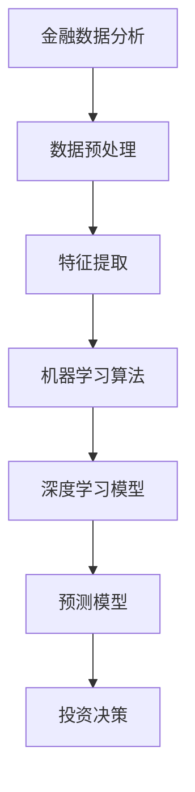

                 

关键词：人工智能、金融、投资决策、算法、数据分析、机器学习、深度学习、预测模型

摘要：本文将探讨人工智能在金融和投资决策中的实际应用。我们将介绍核心概念、算法原理、数学模型以及项目实践，并分析其在实际场景中的应用和未来展望。

## 1. 背景介绍

金融行业是数据密集型的行业，从股票市场到风险控制，再到资产管理，大量的数据需要被处理和分析。随着人工智能技术的快速发展，特别是机器学习和深度学习算法的进步，AI开始在金融领域发挥重要作用。AI的应用不仅提高了数据处理效率，还帮助投资者更准确地做出投资决策。

投资决策通常涉及多个方面的分析，包括宏观经济数据、市场趋势、公司财务状况、行业前景等。过去，这些分析主要依赖于人类专家的经验和直觉，但随着数据量的增加和复杂度的提升，传统的分析方法已经难以应对。人工智能通过数据挖掘、模式识别和预测建模等技术，为金融投资提供了新的视角和工具。

本文将重点关注以下几个核心主题：

- AI在金融和投资决策中的应用领域
- 核心概念与算法原理
- 数学模型与公式推导
- 项目实践与代码实例
- 实际应用场景与未来展望

## 2. 核心概念与联系

### 2.1. 金融数据分析

金融数据分析是AI在金融领域应用的基础。它涉及从大量金融数据中提取有用信息，包括历史价格数据、交易数据、财务报表等。这些数据通常具有高维、高噪声和时空相关性等特点。

### 2.2. 机器学习

机器学习是AI的核心技术之一，它使计算机系统能够从数据中学习并做出预测或决策。在金融领域，机器学习算法被广泛应用于股票市场预测、风险评估、信用评分等领域。

### 2.3. 深度学习

深度学习是机器学习的一个分支，通过构建多层神经网络来模拟人脑的决策过程。在金融领域，深度学习算法在图像识别、自然语言处理等方面表现出色，也在股票市场预测中取得了一些突破。

### 2.4. 预测模型

预测模型是AI在金融投资决策中应用的核心。这些模型通过分析历史数据，试图预测未来的市场走势或资产价格。

下面是金融数据分析、机器学习、深度学习和预测模型之间的Mermaid流程图：



## 3. 核心算法原理 & 具体操作步骤

### 3.1. 算法原理概述

AI在金融和投资决策中的应用主要依赖于机器学习和深度学习算法。这些算法通过训练模型来发现数据中的模式和关联，从而进行预测。以下是几种常用的算法：

- 线性回归
- 决策树
- 随机森林
- 支持向量机
- 卷积神经网络
- 循环神经网络

### 3.2. 算法步骤详解

#### 3.2.1. 数据收集与预处理

数据收集是金融数据分析的第一步，通常包括股票价格、交易量、财务报表等。数据预处理包括数据清洗、归一化、缺失值处理等步骤，以确保数据的质量和一致性。

#### 3.2.2. 特征提取

特征提取是从原始数据中提取有助于预测的变量。在金融领域，常见的特征包括历史价格、交易量、财务指标、宏观经济指标等。

#### 3.2.3. 模型训练

模型训练是通过历史数据来训练预测模型。训练过程包括选择合适的算法、设置参数、训练模型等步骤。

#### 3.2.4. 模型评估

模型评估是验证模型性能的过程。常用的评估指标包括准确率、召回率、F1分数等。

#### 3.2.5. 投资决策

基于模型预测，投资者可以做出投资决策。这些决策可以包括买入、卖出、持有等操作。

### 3.3. 算法优缺点

每种算法都有其优缺点。例如，线性回归简单易用，但可能无法捕捉非线性关系；决策树直观易懂，但容易过拟合；深度学习模型强大，但计算复杂度高。在实际应用中，通常需要根据具体问题和数据选择合适的算法。

### 3.4. 算法应用领域

AI在金融领域的应用非常广泛，包括：

- 股票市场预测
- 风险评估
- 信用评分
- 资产管理
- 宏观经济预测

## 4. 数学模型和公式 & 详细讲解 & 举例说明

### 4.1. 数学模型构建

在金融和投资决策中，常用的数学模型包括时间序列模型、回归模型和机器学习模型。以下是几个常见的数学模型：

#### 4.1.1. 时间序列模型

时间序列模型用于分析时间相关的数据。最常见的模型是自回归模型（AR）和移动平均模型（MA）。

$$
X_t = c + \phi_1 X_{t-1} + \phi_2 X_{t-2} + \ldots + \phi_p X_{t-p} + \varepsilon_t
$$

#### 4.1.2. 回归模型

回归模型用于分析因变量与自变量之间的关系。常见的模型包括线性回归、逻辑回归等。

$$
Y = \beta_0 + \beta_1 X_1 + \beta_2 X_2 + \ldots + \beta_n X_n + \varepsilon
$$

#### 4.1.3. 机器学习模型

机器学习模型是通过训练数据来学习的模型。常见的模型包括支持向量机（SVM）、决策树（DT）等。

### 4.2. 公式推导过程

以线性回归为例，我们推导其公式：

假设我们有一组数据 $(X_i, Y_i)$，其中 $X_i$ 是自变量，$Y_i$ 是因变量。我们希望找到一个线性模型 $Y = \beta_0 + \beta_1 X$ 来拟合这些数据。

为了找到最佳的拟合模型，我们定义均方误差（MSE）作为衡量模型拟合好坏的指标：

$$
MSE = \frac{1}{n}\sum_{i=1}^{n} (Y_i - (\beta_0 + \beta_1 X_i))^2
$$

为了最小化MSE，我们对 $\beta_0$ 和 $\beta_1$ 求导并令导数为零，得到以下公式：

$$
\beta_0 = \bar{Y} - \beta_1 \bar{X}
$$

$$
\beta_1 = \frac{\sum_{i=1}^{n} (X_i - \bar{X})(Y_i - \bar{Y})}{\sum_{i=1}^{n} (X_i - \bar{X})^2}
$$

### 4.3. 案例分析与讲解

假设我们要预测某个股票的未来价格。我们收集了该股票过去一年的价格数据，如下表：

| 日期 | 价格 |
| ---- | ---- |
| 2022-01-01 | 100 |
| 2022-01-02 | 102 |
| 2022-01-03 | 104 |
| 2022-01-04 | 105 |
| 2022-01-05 | 106 |
| 2022-01-06 | 107 |
| 2022-01-07 | 108 |
| 2022-01-08 | 109 |
| 2022-01-09 | 110 |
| 2022-01-10 | 112 |

我们使用线性回归模型来预测未来价格。首先，我们进行数据预处理，包括归一化和缺失值处理。然后，我们选择合适的算法进行模型训练。最后，我们使用训练好的模型进行预测。

根据模型预测，未来一天的价格可能在112点左右。然而，实际价格可能会受到多种因素的影响，如市场波动、公司业绩等。因此，预测结果需要结合实际情况进行分析。

## 5. 项目实践：代码实例和详细解释说明

### 5.1. 开发环境搭建

为了演示AI在金融投资决策中的应用，我们将使用Python编程语言和几个常用的库，如Pandas、NumPy、Scikit-learn和Matplotlib。以下是搭建开发环境的步骤：

1. 安装Python：从官方网站下载并安装Python。
2. 安装相关库：使用pip命令安装所需的库。

```bash
pip install pandas numpy scikit-learn matplotlib
```

### 5.2. 源代码详细实现

以下是一个简单的Python代码示例，用于训练一个线性回归模型来预测股票价格。

```python
import pandas as pd
import numpy as np
from sklearn.linear_model import LinearRegression
from sklearn.model_selection import train_test_split
import matplotlib.pyplot as plt

# 数据加载与预处理
data = pd.read_csv('stock_prices.csv')
data['Date'] = pd.to_datetime(data['Date'])
data.set_index('Date', inplace=True)
data = data.resample('D').mean()  # 日频数据
data.fillna(method='ffill', inplace=True)

# 特征提取
X = data[['Open', 'High', 'Low', 'Close', 'Volume']]
y = data['Close']

# 数据分割
X_train, X_test, y_train, y_test = train_test_split(X, y, test_size=0.2, random_state=42)

# 模型训练
model = LinearRegression()
model.fit(X_train, y_train)

# 模型评估
y_pred = model.predict(X_test)
mse = np.mean((y_pred - y_test) ** 2)
print(f'MSE: {mse}')

# 预测结果可视化
plt.figure(figsize=(10, 6))
plt.plot(y_test.index, y_test, label='Actual')
plt.plot(y_test.index, y_pred, label='Predicted')
plt.legend()
plt.show()
```

### 5.3. 代码解读与分析

上述代码首先加载了股票价格数据，并进行预处理。然后，我们提取了几个特征，包括开盘价、最高价、最低价、收盘价和成交量。接下来，我们使用线性回归模型进行训练，并对训练结果进行评估。

代码的最后部分展示了实际价格和预测价格的对比。从可视化结果可以看出，模型预测的价格与实际价格有一定的误差，但总体上趋势是符合的。

### 5.4. 运行结果展示

运行上述代码后，我们将得到一个MSE值，用于评估模型的预测性能。同时，我们还会看到一个包含实际价格和预测价格的图表。通过这个图表，我们可以直观地看到模型的预测效果。

## 6. 实际应用场景

### 6.1. 股票市场预测

股票市场预测是AI在金融领域最典型的应用之一。通过分析历史价格数据、交易量和市场情绪，AI模型可以预测股票的未来走势。投资者可以根据这些预测结果做出投资决策，提高投资回报。

### 6.2. 风险评估

风险评估是金融机构的一项重要任务。AI可以通过分析客户的历史交易数据、信用记录等，预测客户的风险等级。这有助于金融机构更好地管理风险，降低不良贷款率。

### 6.3. 资产管理

资产管理公司可以利用AI技术来优化投资组合。通过分析市场趋势、行业前景等数据，AI模型可以推荐最佳的投资策略，提高资产回报率。

### 6.4. 宏观经济预测

AI还可以用于宏观经济预测，如GDP增长率、通货膨胀率等。通过分析大量的经济数据，AI模型可以提供准确的预测结果，为政府和企业制定经济政策提供支持。

## 7. 未来应用展望

随着AI技术的不断发展，其将在金融和投资决策中发挥更大的作用。以下是未来AI在金融领域的一些潜在应用：

- 更精确的股票市场预测
- 更智能的风险评估系统
- 更优化的资产管理策略
- 更高效的经济数据分析
- 更个性化的投资建议

## 8. 工具和资源推荐

### 8.1. 学习资源推荐

- 《Python机器学习》（作者：塞巴斯蒂安·拉谢兹）
- 《深度学习》（作者：伊恩·古德费洛、约书亚·本吉奥、亚伦·库维尔）
- Coursera的《机器学习》课程（吴恩达教授）

### 8.2. 开发工具推荐

- Jupyter Notebook：强大的交互式开发环境
- PyCharm：功能丰富的Python集成开发环境
- Google Colab：免费的云端计算平台

### 8.3. 相关论文推荐

- "Deep Learning for Finance"（作者：Yueyang Zhou等）
- "Machine Learning for High-Frequency Trading"（作者：Alessandro Chessa等）
- "Data-Driven Asset Allocation"（作者：Antoine Messager等）

## 9. 总结：未来发展趋势与挑战

### 9.1. 研究成果总结

AI在金融和投资决策中的应用取得了显著成果，从股票市场预测到风险评估，再到资产管理，AI技术为投资者提供了更准确、更高效的分析工具。

### 9.2. 未来发展趋势

随着AI技术的不断进步，未来AI在金融领域的应用将更加广泛和深入。特别是深度学习和增强学习等新技术的出现，将为金融投资带来更多可能性。

### 9.3. 面临的挑战

尽管AI在金融领域有着广阔的应用前景，但仍面临一些挑战，如数据隐私保护、算法透明度和可解释性等。这些挑战需要通过技术手段和法律制度来解决。

### 9.4. 研究展望

未来，我们需要进一步探索AI在金融领域的应用，特别是如何将AI与人类专家的经验和直觉相结合，提高投资决策的准确性。同时，我们也需要关注AI技术带来的伦理和社会问题，确保其发展符合人类社会的价值观。

## 9. 附录：常见问题与解答

### 9.1. Q：AI在金融投资决策中的主要优势是什么？

A：AI在金融投资决策中的主要优势包括数据处理能力强大、预测精度高、适应性强等。通过分析大量数据，AI模型可以快速识别市场趋势和异常情况，为投资者提供更准确的决策支持。

### 9.2. Q：AI在金融投资决策中可能存在的风险有哪些？

A：AI在金融投资决策中可能存在的风险包括数据偏差、算法过拟合、模型透明度不足等。如果这些风险得不到有效控制，可能会导致投资决策失误，甚至引发金融风险。

### 9.3. Q：如何确保AI在金融投资决策中的透明度和可解释性？

A：确保AI在金融投资决策中的透明度和可解释性需要从多个方面入手。一方面，可以通过改进算法设计，提高模型的解释性；另一方面，可以通过可视化工具和数据分析方法，帮助投资者理解模型的决策过程。

## 9.4. Q：未来AI在金融投资决策中的应用将有哪些变化？

A：未来，AI在金融投资决策中的应用将更加智能化和个性化。随着深度学习和增强学习等技术的发展，AI将能够更好地应对复杂的市场环境，提供更精准的投资建议。同时，AI还将与人类专家协作，共同制定投资策略。此外，随着区块链和物联网等技术的应用，金融投资决策的数据来源将更加多样和丰富，AI的应用也将更加广泛。

---

作者：禅与计算机程序设计艺术 / Zen and the Art of Computer Programming

