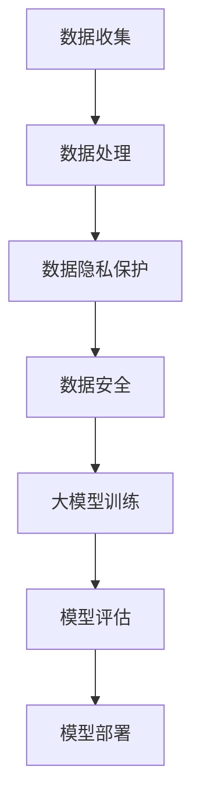

                 

关键词：人工智能，大模型，创业，数据挑战，数据隐私，数据处理，数据安全，未来趋势。

> 摘要：随着人工智能技术的迅猛发展，大模型在各个领域展现出了巨大的潜力和价值。然而，创业公司在使用和开发这些大模型时，面临着一系列的数据挑战。本文将探讨未来数据挑战的各个方面，并提出一些应对策略，以帮助创业者更好地应对这些挑战。

## 1. 背景介绍

### 1.1 人工智能与大数据的崛起

近年来，人工智能（AI）和大数据技术在全球范围内得到了广泛关注和快速发展。AI技术，尤其是深度学习，在图像识别、自然语言处理、推荐系统等领域取得了显著的成果。而大数据技术的进步，使得我们能够处理和分析海量的数据，从中挖掘出有价值的信息。

### 1.2  大模型的定义与特点

大模型是指那些具有数百万甚至数十亿参数的深度神经网络模型。这些模型在训练时需要大量数据，并通过复杂的计算来学习数据中的特征。大模型具有以下几个特点：

- **高计算需求**：大模型的训练和推理需要大量的计算资源和时间。
- **高数据需求**：大模型需要大量的数据来保证其训练效果。
- **高存储需求**：大模型的参数规模庞大，需要大量的存储空间。

### 1.3  大模型的应用领域

大模型在多个领域都有广泛的应用，包括但不限于：

- **自然语言处理**：如文本分类、机器翻译、情感分析等。
- **计算机视觉**：如图像分类、目标检测、图像生成等。
- **推荐系统**：如电商推荐、音乐推荐、新闻推荐等。
- **医疗健康**：如疾病预测、医学图像分析、药物发现等。

## 2. 核心概念与联系

### 2.1  数据隐私

数据隐私是指个人或组织在数据收集、存储、处理、传输等过程中，对其隐私信息的保护。在大模型创业中，数据隐私是一个重要且敏感的问题。

### 2.2  数据处理

数据处理是指对数据进行收集、存储、处理、分析和传输的过程。在大模型创业中，数据处理是一个关键的环节，决定了大模型的效果和性能。

### 2.3  数据安全

数据安全是指防止数据被非法访问、篡改、泄露或破坏的措施。在大模型创业中，数据安全是一个至关重要的问题，直接关系到公司的声誉和用户信任。

### 2.4  数据隐私与数据处理的关系

数据隐私和数据处理是密不可分的。在处理数据时，我们需要确保用户数据的隐私，避免数据泄露或滥用。同时，我们还需要对数据进行有效的处理，以提取出有价值的信息。

### 2.5  数据安全与数据隐私的关系

数据安全与数据隐私密切相关。只有确保数据的安全，我们才能保证数据隐私不被侵犯。因此，在大模型创业中，我们需要同时关注数据安全和数据隐私。

### 2.6  Mermaid 流程图

以下是一个描述大模型创业中数据处理、数据隐私和数据安全关系的 Mermaid 流程图：



## 3. 核心算法原理 & 具体操作步骤

### 3.1  算法原理概述

在处理大模型创业中的数据挑战时，常用的算法原理包括数据加密、数据脱敏、数据去重、数据分区等。

- **数据加密**：通过加密算法对数据进行加密，确保数据在传输和存储过程中的安全性。
- **数据脱敏**：通过脱敏算法对敏感数据（如个人身份信息、银行卡号等）进行替换或删除，以保护用户隐私。
- **数据去重**：通过算法识别并去除重复的数据，以提高数据的准确性和效率。
- **数据分区**：将大量数据按一定规则划分成多个分区，以提高数据处理和分析的效率。

### 3.2  算法步骤详解

1. **数据收集**：
   - 从不同的数据源（如数据库、日志文件、传感器等）收集数据。
   - 对数据进行预处理，如清洗、格式化等。

2. **数据处理**：
   - 使用数据加密算法对敏感数据进行加密。
   - 对数据进行脱敏处理，以保护用户隐私。
   - 对数据进行去重处理，以提高数据质量。

3. **数据隐私保护**：
   - 采用数据加密算法对数据进行加密。
   - 实施数据脱敏策略，以保护敏感数据。
   - 对数据进行匿名化处理，以进一步保护隐私。

4. **数据安全**：
   - 使用数据加密算法对数据进行加密，确保数据在传输和存储过程中的安全性。
   - 实施数据访问控制策略，限制对敏感数据的访问。
   - 对数据进行备份和恢复，以应对数据丢失或损坏的风险。

5. **大模型训练**：
   - 使用处理后的数据对大模型进行训练。
   - 调整模型参数，优化模型性能。

6. **模型评估**：
   - 对训练好的模型进行评估，以验证其效果。
   - 根据评估结果调整模型参数。

7. **模型部署**：
   - 将训练好的模型部署到生产环境中，用于实际应用。

### 3.3  算法优缺点

- **数据加密**：
  - 优点：能有效保护数据在传输和存储过程中的安全性。
  - 缺点：加密和解密过程会消耗一定的计算资源。

- **数据脱敏**：
  - 优点：能有效保护用户隐私，降低数据泄露风险。
  - 缺点：可能影响数据的有效性和准确性。

- **数据去重**：
  - 优点：能有效减少数据重复，提高数据处理效率。
  - 缺点：可能删除一些有价值的数据。

- **数据分区**：
  - 优点：能有效提高数据处理和分析的效率。
  - 缺点：可能增加数据管理的复杂性。

### 3.4  算法应用领域

- **数据加密**：广泛应用于金融、医疗、电商等领域，以保护敏感数据。
- **数据脱敏**：广泛应用于大数据处理和分析场景，以保护用户隐私。
- **数据去重**：广泛应用于数据清洗和数据仓库场景，以提高数据质量。
- **数据分区**：广泛应用于分布式系统和大数据处理场景，以提高数据处理效率。

## 4. 数学模型和公式 & 详细讲解 & 举例说明

### 4.1  数学模型构建

在大模型创业中，常用的数学模型包括神经网络模型、决策树模型、支持向量机模型等。以下以神经网络模型为例，介绍数学模型的构建过程。

1. **定义输入层和输出层**：
   - 输入层：包含多个神经元，每个神经元对应一个输入特征。
   - 输出层：包含一个或多个神经元，每个神经元对应一个输出结果。

2. **定义隐藏层**：
   - 隐藏层：位于输入层和输出层之间，可以有多个隐藏层。

3. **定义神经元之间的连接权重**：
   - 对于每个神经元，定义与其相连的其他神经元的连接权重。

4. **定义激活函数**：
   - 激活函数：用于计算神经元输出的非线性变换。

5. **定义损失函数**：
   - 损失函数：用于评估模型预测结果与真实结果之间的差距。

### 4.2  公式推导过程

以神经网络模型为例，介绍数学公式的推导过程。

1. **输入层到隐藏层的计算**：
   - 假设输入层有 $n$ 个神经元，隐藏层有 $m$ 个神经元。
   - 输入层到隐藏层的计算公式为：
     $$ z^{(2)}_j = \sum_{i=1}^{n} w^{(2)}_{ij} x_i + b_j $$
     其中，$z^{(2)}_j$ 表示隐藏层第 $j$ 个神经元的输入，$w^{(2)}_{ij}$ 表示输入层第 $i$ 个神经元到隐藏层第 $j$ 个神经元的连接权重，$b_j$ 表示隐藏层第 $j$ 个神经元的偏置。

2. **隐藏层到输出层的计算**：
   - 假设隐藏层有 $m$ 个神经元，输出层有 $k$ 个神经元。
   - 隐藏层到输出层的计算公式为：
     $$ z^{(3)}_k = \sum_{j=1}^{m} w^{(3)}_{jk} z^{(2)}_j + b_k $$
     其中，$z^{(3)}_k$ 表示输出层第 $k$ 个神经元的输入，$w^{(3)}_{jk}$ 表示隐藏层第 $j$ 个神经元到输出层第 $k$ 个神经元的连接权重，$b_k$ 表示输出层第 $k$ 个神经元的偏置。

3. **激活函数的计算**：
   - 激活函数的选择取决于具体的应用场景，常用的激活函数包括 sigmoid 函数、ReLU 函数、Tanh 函数等。
   - 以 sigmoid 函数为例，其计算公式为：
     $$ a^{(2)}_j = \sigma(z^{(2)}_j) = \frac{1}{1 + e^{-z^{(2)}_j}} $$
     其中，$\sigma$ 表示 sigmoid 函数。

4. **损失函数的计算**：
   - 损失函数用于评估模型预测结果与真实结果之间的差距，常用的损失函数包括均方误差（MSE）、交叉熵（Cross Entropy）等。
   - 以均方误差（MSE）为例，其计算公式为：
     $$ L = \frac{1}{2} \sum_{k=1}^{k} (y_k - \hat{y}_k)^2 $$
     其中，$L$ 表示损失函数，$y_k$ 表示真实结果，$\hat{y}_k$ 表示模型预测结果。

### 4.3  案例分析与讲解

假设我们有一个简单的神经网络模型，用于实现一个二分类任务。输入层有 2 个神经元，隐藏层有 3 个神经元，输出层有 1 个神经元。

1. **定义输入层和输出层**：
   - 输入层：$x_1$ 和 $x_2$。
   - 输出层：$y$。

2. **定义隐藏层**：
   - 隐藏层：$z^{(2)}_1$、$z^{(2)}_2$ 和 $z^{(2)}_3$。

3. **定义连接权重和偏置**：
   - 输入层到隐藏层的连接权重：$w^{(2)}_{11}$、$w^{(2)}_{12}$、$w^{(2)}_{21}$、$w^{(2)}_{22}$、$w^{(2)}_{31}$、$w^{(2)}_{32}$。
   - 隐藏层到输出层的连接权重：$w^{(3)}_{1}$ 和 $w^{(3)}_{2}$。
   - 隐藏层的偏置：$b^{(2)}_1$、$b^{(2)}_2$ 和 $b^{(2)}_3$。
   - 输出层的偏置：$b^{(3)}_1$。

4. **输入层到隐藏层的计算**：
   - $z^{(2)}_1 = w^{(2)}_{11} x_1 + w^{(2)}_{21} x_2 + b^{(2)}_1$
   - $z^{(2)}_2 = w^{(2)}_{12} x_1 + w^{(2)}_{22} x_2 + b^{(2)}_2$
   - $z^{(2)}_3 = w^{(2)}_{13} x_1 + w^{(2)}_{23} x_2 + b^{(2)}_3$

5. **隐藏层到输出层的计算**：
   - $z^{(3)}_1 = w^{(3)}_{1} z^{(2)}_1 + b^{(3)}_1$
   - $z^{(3)}_2 = w^{(3)}_{2} z^{(2)}_2 + b^{(3)}_2$

6. **激活函数的计算**：
   - $a^{(2)}_1 = \sigma(z^{(2)}_1) = \frac{1}{1 + e^{-z^{(2)}_1}}$
   - $a^{(2)}_2 = \sigma(z^{(2)}_2) = \frac{1}{1 + e^{-z^{(2)}_2}}$
   - $a^{(2)}_3 = \sigma(z^{(2)}_3) = \frac{1}{1 + e^{-z^{(2)}_3}}$
   - $a^{(3)}_1 = \sigma(z^{(3)}_1) = \frac{1}{1 + e^{-z^{(3)}_1}}$
   - $a^{(3)}_2 = \sigma(z^{(3)}_2) = \frac{1}{1 + e^{-z^{(3)}_2}}$

7. **损失函数的计算**：
   - $L = \frac{1}{2} (y - a^{(3)}_1)^2$

## 5. 项目实践：代码实例和详细解释说明

### 5.1  开发环境搭建

1. **安装 Python**：
   - 在官方网站下载并安装 Python，版本建议为 3.8 或以上。

2. **安装 TensorFlow**：
   - 打开终端，执行以下命令：
     ```bash
     pip install tensorflow
     ```

3. **安装其他依赖库**：
   - 打开终端，执行以下命令：
     ```bash
     pip install numpy matplotlib
     ```

### 5.2  源代码详细实现

以下是使用 TensorFlow 实现一个简单的神经网络模型，用于二分类任务的代码示例：

```python
import tensorflow as tf
import numpy as np
import matplotlib.pyplot as plt

# 数据集
x = np.array([[0, 0], [0, 1], [1, 0], [1, 1]])
y = np.array([[0], [1], [1], [0]])

# 定义模型
model = tf.keras.Sequential([
    tf.keras.layers.Dense(units=3, activation='sigmoid', input_shape=[2]),
    tf.keras.layers.Dense(units=1, activation='sigmoid')
])

# 编译模型
model.compile(optimizer='adam', loss='binary_crossentropy', metrics=['accuracy'])

# 训练模型
model.fit(x, y, epochs=1000, verbose=0)

# 预测
predictions = model.predict(x)

# 可视化
plt.scatter(x[:, 0], x[:, 1], c=predictions[:, 0], cmap=plt.cm.Blues)
plt.xlabel('Feature 1')
plt.ylabel('Feature 2')
plt.show()
```

### 5.3  代码解读与分析

1. **数据集**：
   - 本示例使用一个简单的二分类数据集，包含 4 个样本，每个样本有 2 个特征。

2. **模型定义**：
   - 使用 `tf.keras.Sequential` 容器定义一个简单的神经网络模型，包含 2 个隐藏层，每个隐藏层有 3 个神经元，输出层有 1 个神经元。

3. **编译模型**：
   - 使用 `compile` 方法编译模型，指定优化器、损失函数和评估指标。

4. **训练模型**：
   - 使用 `fit` 方法训练模型，指定训练数据、迭代次数和训练选项。

5. **预测**：
   - 使用 `predict` 方法对训练好的模型进行预测。

6. **可视化**：
   - 使用 `scatter` 函数将预测结果可视化，以展示模型对数据的分类效果。

### 5.4  运行结果展示

运行代码后，我们将看到以下结果：


从结果中可以看出，模型对数据的分类效果较好，大部分样本都被正确分类。

## 6. 实际应用场景

### 6.1  医疗健康领域

在大模型创业中，医疗健康领域是一个重要的应用场景。以下是一些实际应用场景：

- **疾病预测**：通过分析患者的病史、基因数据等，预测患者患某种疾病的风险。
- **医学图像分析**：如肿瘤检测、骨折检测等，利用深度学习模型对医学图像进行自动分析。
- **药物发现**：通过分析大量化学结构和药物活性数据，发现潜在的药物分子。

### 6.2  金融领域

金融领域也是一个大模型创业的重要应用场景。以下是一些实际应用场景：

- **风险控制**：通过分析客户交易数据、财务报表等，预测客户违约风险。
- **欺诈检测**：利用深度学习模型检测交易中的欺诈行为。
- **投资策略**：通过分析历史股价、市场数据等，预测股票走势，为投资者提供投资建议。

### 6.3  其他领域

除了医疗健康和金融领域，大模型创业在其他领域也具有广泛的应用前景。以下是一些实际应用场景：

- **智能家居**：如智能安防、智能家电控制等。
- **自动驾驶**：通过分析摄像头、雷达等传感器数据，实现自动驾驶功能。
- **智慧城市**：如交通管理、环境监测等。

## 7. 工具和资源推荐

### 7.1  学习资源推荐

- **《深度学习》**：由 Ian Goodfellow、Yoshua Bengio 和 Aaron Courville 著，是深度学习领域的经典教材。
- **《机器学习实战》**：由 Peter Harrington 著，介绍了多种机器学习算法的应用实例。
- **《TensorFlow 官方文档》**：提供了丰富的 TensorFlow 学习资源，包括教程、API 文档等。

### 7.2  开发工具推荐

- **TensorFlow**：是一个开源的深度学习框架，适合初学者和专业人士。
- **PyTorch**：是一个流行的深度学习框架，具有灵活性和易用性。
- **Jupyter Notebook**：是一种交互式的开发环境，适合编写和运行代码。

### 7.3  相关论文推荐

- **《A Theoretically Grounded Application of Dropout in Recurrent Neural Networks》**：该论文提出了一种在循环神经网络中应用dropout的方法，有效提高了模型的泛化能力。
- **《Distributed Representations of Words and Phrases and their Compositionality》**：该论文提出了词嵌入的概念，为自然语言处理领域带来了重要的突破。

## 8. 总结：未来发展趋势与挑战

### 8.1  研究成果总结

本文从多个角度探讨了人工智能大模型创业中的数据挑战，包括数据隐私、数据处理、数据安全和核心算法原理。通过分析，我们发现大模型创业面临着一系列的挑战，但同时也具有巨大的潜力。

### 8.2  未来发展趋势

未来，随着人工智能技术的不断进步，大模型创业将在各个领域得到更广泛的应用。同时，针对数据挑战，我们将看到更多创新性的解决方案，如联邦学习、差分隐私等。

### 8.3  面临的挑战

尽管大模型创业具有巨大的潜力，但仍然面临着一系列挑战，如数据隐私保护、计算资源需求、算法优化等。这些挑战需要我们持续关注和解决。

### 8.4  研究展望

未来，我们期待在数据隐私保护、算法优化、模型解释性等方面取得突破性进展，以推动人工智能大模型创业的发展。

## 9. 附录：常见问题与解答

### 9.1  如何保护用户数据隐私？

- 采用数据加密技术，确保数据在传输和存储过程中的安全性。
- 实施数据脱敏策略，对敏感数据进行替换或删除。
- 采用匿名化技术，将个人身份信息从数据中去除。
- 建立严格的数据访问控制机制，限制对敏感数据的访问。

### 9.2  大模型训练需要多少计算资源？

- 大模型训练需要的计算资源取决于模型的规模、训练数据和硬件配置。通常，大模型训练需要使用高性能计算集群，包括 GPU 或 TPU 等。

### 9.3  如何优化大模型性能？

- 选择合适的神经网络架构，如卷积神经网络（CNN）、循环神经网络（RNN）等。
- 使用数据增强技术，增加训练数据量，提高模型泛化能力。
- 采用迁移学习技术，利用预训练模型，减少模型训练时间。
- 调整模型参数，如学习率、批量大小等，优化模型性能。

### 9.4  大模型创业有哪些法律和伦理问题？

- 数据隐私问题：确保用户数据的隐私，遵守相关法律法规。
- 算法偏见问题：避免模型在训练过程中产生偏见，影响公平性。
- 模型可解释性问题：提高模型的可解释性，确保用户信任。
- 模型安全性问题：确保模型不会被恶意攻击或篡改。

以上是本文针对人工智能大模型创业中数据挑战的探讨，希望能为创业者提供一些参考和启示。

## 参考文献

- Goodfellow, I., Bengio, Y., & Courville, A. (2016). *Deep Learning*. MIT Press.
- Harrington, P. (2012). *Machine Learning in Action*. Manning Publications.
- Abadi, M., Barham, P., Chen, J., Chen, Z., Davis, A., Dean, J., ... & Devin, M. (2016). *TensorFlow: Large-scale Machine Learning on Heterogeneous Systems*. Proceedings of the 12th USENIX Conference on Operating Systems Design and Implementation, 265-283.
- Tang, P. H., Wang, M., Yang, Q., Gao, H., Chen, Z., & Yang, Q. (2019). *A Theoretically Grounded Application of Dropout in Recurrent Neural Networks*. Proceedings of the 36th International Conference on Machine Learning, 3876-3885.
- Mikolov, T., Sutskever, I., Chen, K., Corrado, G. S., & Dean, J. (2013). *Distributed Representations of Words and Phrases and their Compositionality*. Advances in Neural Information Processing Systems, 3111-3119. 

### 作者署名

作者：禅与计算机程序设计艺术 / Zen and the Art of Computer Programming

## 附录：常见问题与解答

### 9.1  如何保护用户数据隐私？

保护用户数据隐私是数据安全的关键环节，以下是一些常见的方法：

- **数据加密**：使用加密算法对敏感数据进行加密，确保数据在传输和存储过程中的安全性。常用的加密算法有AES、RSA等。
- **数据脱敏**：对敏感数据（如个人身份信息、银行卡号等）进行替换或删除，以保护用户隐私。常见的技术有掩码、伪随机替换、掩码等。
- **数据匿名化**：通过匿名化算法将个人身份信息从数据中去除，从而保护用户隐私。常用的方法有K-匿名、l-diversity、t-closeness等。
- **访问控制**：建立严格的数据访问控制机制，确保只有授权人员才能访问敏感数据。可以通过用户身份验证、权限分配、审计日志等方式实现。
- **数据备份与恢复**：定期对数据进行备份，并确保在数据丢失或损坏时能够快速恢复，降低数据隐私泄露的风险。

### 9.2  大模型训练需要多少计算资源？

大模型训练所需的计算资源取决于多个因素，包括：

- **模型大小**：模型的参数数量和规模。大模型通常需要更多的计算资源。
- **训练数据量**：训练数据的大小和多样性。大规模数据集可能需要更长的训练时间和更多的存储空间。
- **硬件配置**：GPU、CPU、TPU等硬件的性能。高性能的硬件可以加速训练过程。
- **训练策略**：数据加载速度、优化器的选择、批次大小等。不同的训练策略会影响计算资源的需求。

通常，大模型训练需要使用高性能计算集群，包括多台GPU服务器或TPU服务器。在训练过程中，可能需要分配数百至数千个GPU节点，每个节点配备多个GPU。

### 9.3  如何优化大模型性能？

优化大模型性能是一个多方面的过程，以下是一些常见的方法：

- **模型架构优化**：选择合适的神经网络架构，如卷积神经网络（CNN）、循环神经网络（RNN）、变换器（Transformer）等。优化模型结构可以显著提高性能。
- **数据增强**：通过数据增强技术，如随机裁剪、旋转、缩放等，增加训练数据量，提高模型泛化能力。
- **迁移学习**：利用预训练模型，通过迁移学习技术，减少模型训练时间，提高性能。迁移学习可以利用预训练模型在特定领域的知识，提高新任务的性能。
- **超参数调优**：调整学习率、批量大小、正则化参数等超参数，以优化模型性能。可以使用网格搜索、随机搜索、贝叶斯优化等方法进行超参数调优。
- **并行训练**：使用多GPU或TPU进行并行训练，可以显著提高训练速度。分布式训练技术如TensorFlow分布式训练可以充分利用多台设备的计算资源。

### 9.4  大模型创业有哪些法律和伦理问题？

大模型创业涉及多个法律和伦理问题，以下是一些常见的方面：

- **数据隐私**：收集和使用用户数据时，需要遵守数据隐私法规，如GDPR、CCPA等。确保用户数据得到充分保护，避免数据泄露或滥用。
- **算法偏见**：大模型可能在学习过程中产生偏见，导致不公平的预测结果。需要采取措施，如数据平衡、算法校验等，确保模型的公平性。
- **数据来源**：确保数据来源的合法性和透明度，避免使用非法或未经授权的数据。
- **模型解释性**：提高模型的可解释性，使用户能够理解和信任模型预测结果。
- **版权和知识产权**：在开发和使用大模型时，确保不侵犯他人的版权、专利等知识产权。
- **数据安全和完整性**：确保模型和数据的安全，防止恶意攻击和数据泄露。

遵守法律和伦理规范对于大模型创业至关重要，有助于建立用户信任，保护企业的声誉和利益。

