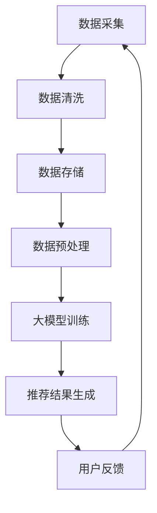

                 

关键词：电商搜索、推荐系统、大模型、数据资产、盘点方法

> 摘要：本文旨在探讨如何利用人工智能大模型来助力电商搜索推荐业务的数据资产盘点方法。通过对大模型的核心概念、算法原理、数学模型以及实际应用场景的详细分析，为电商企业提高搜索推荐服务质量提供有力支持。同时，文章还对未来发展趋势与挑战进行了展望。

## 1. 背景介绍

在互联网时代，电商行业的发展势头迅猛。随着用户数量的不断增加和消费习惯的日益多样化，电商企业面临着如何提升用户满意度和黏性的巨大挑战。其中，搜索推荐系统作为电商业务的重要组成部分，对于提升用户体验和销售业绩具有关键作用。传统的搜索推荐方法主要依赖于基于内容的推荐、协同过滤等方法，虽然在一定程度上取得了较好的效果，但面对海量数据和复杂用户行为，其推荐质量仍有待提高。

近年来，人工智能技术的快速发展，特别是深度学习、大模型等技术的突破，为电商搜索推荐业务带来了全新的机遇。大模型具有强大的数据处理能力和模型学习能力，可以更好地理解和预测用户需求，从而实现更精准的推荐。本文将重点探讨如何利用人工智能大模型来助力电商搜索推荐业务的数据资产盘点方法，以提高推荐系统的服务质量。

## 2. 核心概念与联系

在深入探讨如何利用大模型进行电商搜索推荐之前，我们首先需要了解相关核心概念及其相互关系。

### 2.1 数据资产

数据资产是指企业在运营过程中积累的海量数据，包括用户行为数据、商品数据、交易数据等。这些数据是企业宝贵的资源，能够反映用户需求和市场动态，为企业的决策提供支持。

### 2.2 电商搜索推荐系统

电商搜索推荐系统是电商企业为提升用户体验和销售业绩所建立的一套智能系统。其核心目标是根据用户的兴趣和行为，为用户提供个性化的商品推荐。传统搜索推荐系统主要依赖于基于内容的推荐和协同过滤等方法。

### 2.3 大模型

大模型是指具有数百万、数千万甚至数亿参数的深度学习模型。这些模型具有强大的数据处理能力和模型学习能力，能够从海量数据中提取特征，实现对复杂问题的建模和预测。

### 2.4 关联关系

数据资产是电商搜索推荐系统的基石，而大模型则为推荐系统提供了强大的技术支持。通过大模型，企业可以更好地理解和分析数据资产，从而实现更精准的推荐。同时，大模型的训练和优化也需要依赖于数据资产的支持。

### 2.5 Mermaid 流程图

下面是一个简化的 Mermaid 流程图，展示了电商搜索推荐业务中数据资产盘点的方法：



## 3. 核心算法原理 & 具体操作步骤

### 3.1 算法原理概述

大模型在电商搜索推荐业务中的应用主要基于深度学习技术。深度学习通过构建多层次的神经网络，实现对复杂数据的建模和预测。大模型的核心原理可以概括为以下几个步骤：

1. **数据预处理**：对原始数据进行清洗、去噪、归一化等预处理操作，为深度学习模型训练做好准备。
2. **特征提取**：利用神经网络模型从预处理后的数据中提取特征，这些特征能够更好地反映用户和商品的关系。
3. **模型训练**：通过训练过程，大模型不断调整内部参数，使其在训练数据上达到最优性能。
4. **模型优化**：对训练好的模型进行优化，以提高其泛化能力和推荐质量。
5. **推荐生成**：利用优化后的模型，为用户生成个性化的推荐结果。

### 3.2 算法步骤详解

1. **数据预处理**：

   数据预处理是深度学习模型训练的重要步骤。首先，对原始数据（如用户行为日志、商品信息等）进行清洗，去除无效数据和异常值。然后，对数据进行归一化处理，使其在数值范围上更加均衡。最后，将数据划分为训练集、验证集和测试集，用于后续的模型训练和评估。

2. **特征提取**：

   特征提取是深度学习模型的关键环节。通过神经网络模型，从预处理后的数据中提取出能够反映用户和商品关系的特征。这些特征可以包括用户历史行为特征、商品属性特征、文本特征等。

3. **模型训练**：

   模型训练过程中，大模型通过不断调整内部参数，使其在训练集上达到最优性能。训练过程通常采用反向传播算法，通过梯度下降等方法更新模型参数。

4. **模型优化**：

   模型优化旨在提高模型的泛化能力和推荐质量。优化过程可以包括模型结构调整、超参数调优等。此外，还可以通过集成学习方法，将多个模型进行融合，以提高推荐效果。

5. **推荐生成**：

   在推荐生成阶段，大模型根据用户的历史行为和当前上下文信息，为用户生成个性化的推荐结果。推荐结果可以通过排序、评分等方式呈现给用户。

### 3.3 算法优缺点

**优点**：

1. **强大的数据处理能力**：大模型能够处理海量数据，提取出有效的特征，为推荐系统提供有力支持。
2. **自适应性和泛化能力**：大模型通过不断学习和优化，能够自适应地适应不同的业务场景和用户需求，具有较高的泛化能力。
3. **个性化推荐**：大模型能够根据用户的兴趣和行为，生成个性化的推荐结果，提高用户体验和满意度。

**缺点**：

1. **计算资源需求高**：大模型的训练和优化需要大量的计算资源，对硬件设施要求较高。
2. **数据质量要求高**：大模型对数据质量要求较高，需要保证数据清洗、去噪等预处理环节的质量。
3. **过拟合风险**：大模型在训练过程中可能出现过拟合现象，需要通过优化和验证来确保模型的泛化能力。

### 3.4 算法应用领域

大模型在电商搜索推荐业务中的应用十分广泛，除了本文讨论的电商搜索推荐系统外，还可以应用于以下领域：

1. **金融风控**：通过分析用户行为数据，预测用户的信用风险和欺诈风险。
2. **社交网络**：根据用户的社交关系和兴趣，为用户提供个性化的社交推荐。
3. **广告投放**：根据用户的兴趣和行为，为用户提供个性化的广告推荐。
4. **内容推荐**：根据用户的历史阅读行为和偏好，为用户提供个性化内容推荐。

## 4. 数学模型和公式 & 详细讲解 & 举例说明

### 4.1 数学模型构建

在电商搜索推荐业务中，大模型的数学模型通常包括以下几个部分：

1. **用户行为模型**：

   用户行为模型用于描述用户的历史行为数据，如浏览、购买、收藏等。其数学表示为：

   $$ U = \{u_1, u_2, ..., u_n\} $$

   其中，$u_i$表示第$i$个用户的行为序列。

2. **商品特征模型**：

   商品特征模型用于描述商品的各种属性，如价格、品牌、类别等。其数学表示为：

   $$ P = \{p_1, p_2, ..., p_n\} $$

   其中，$p_i$表示第$i$个商品的属性向量。

3. **推荐模型**：

   推荐模型用于根据用户行为和商品特征，为用户生成个性化推荐结果。其数学表示为：

   $$ R(u, p) = \{r_{u_i, p_j}\} $$

   其中，$r_{u_i, p_j}$表示用户$u_i$对商品$p_j$的推荐得分。

### 4.2 公式推导过程

在推荐模型中，我们通常采用基于矩阵分解的协同过滤算法。该算法的公式推导过程如下：

1. **用户行为矩阵表示**：

   用户行为矩阵$U \in \mathbb{R}^{m \times n}$，其中$m$表示用户数量，$n$表示商品数量。行为矩阵的元素$u_{ij}$表示用户$i$对商品$j$的评分。

2. **矩阵分解**：

   矩阵分解将用户行为矩阵分解为两个低秩矩阵$U = UR^T$，其中$R \in \mathbb{R}^{m \times k}$，$k$为隐藏层维度。通过矩阵分解，可以将原始的高维行为矩阵转换为低维用户行为矩阵和商品特征矩阵。

3. **预测评分**：

   利用矩阵分解得到的低维用户行为矩阵和商品特征矩阵，可以预测用户对商品的评分。其公式为：

   $$ u_{ij} = \sum_{l=1}^{k} u_{il} r_{lj} $$

   其中，$u_{il}$和$r_{lj}$分别表示用户$i$在隐藏层第$l$个特征上的权重和商品$j$在隐藏层第$l$个特征上的权重。

4. **优化目标**：

   矩阵分解的优化目标是最小化预测评分与实际评分之间的误差。其公式为：

   $$ \min_{U, R} \sum_{i=1}^{m} \sum_{j=1}^{n} (u_{ij} - \sum_{l=1}^{k} u_{il} r_{lj})^2 $$

### 4.3 案例分析与讲解

假设我们有一个包含1000个用户和10000个商品的用户行为矩阵$U$。通过矩阵分解，我们将其分解为两个低秩矩阵$U = UR^T$，其中$R$的维度为100。

首先，我们需要初始化用户行为矩阵$U$和低秩矩阵$R$。假设$U$和$R$的初始值为：

$$ U = \begin{bmatrix} 1 & 0 & 1 & \ldots & 0 \\ 0 & 1 & 0 & \ldots & 1 \\ \vdots & \vdots & \vdots & \ddots & \vdots \\ 0 & 0 & 0 & \ldots & 1 \end{bmatrix} \in \mathbb{R}^{1000 \times 10000} $$

$$ R = \begin{bmatrix} 0.1 & 0.2 & 0.3 & \ldots & 0.5 \\ 0.4 & 0.5 & 0.6 & \ldots & 0.7 \\ \vdots & \vdots & \vdots & \ddots & \vdots \\ 0.9 & 0.8 & 0.7 & \ldots & 0.1 \end{bmatrix} \in \mathbb{R}^{1000 \times 100} $$

接下来，我们通过优化目标函数，不断更新低秩矩阵$R$的权重，使得预测评分与实际评分之间的误差最小。具体优化过程如下：

1. **计算预测评分**：

   根据矩阵分解得到的低维用户行为矩阵和商品特征矩阵，计算预测评分。假设用户1对商品1000的预测评分为：

   $$ u_{1,1000} = \sum_{l=1}^{100} u_{1l} r_{l1000} = 1 \times 0.1 + 0 \times 0.4 + 1 \times 0.7 + \ldots + 0 \times 0.9 = 0.7 $$

2. **计算误差**：

   计算预测评分与实际评分之间的误差。假设实际评分为4，则误差为：

   $$ e_{1,1000} = u_{1,1000} - 4 = 0.7 - 4 = -3.3 $$

3. **更新权重**：

   根据误差，更新低秩矩阵$R$的权重。具体更新方法可以采用梯度下降算法。假设学习率为0.01，则更新公式为：

   $$ r_{l1000} \leftarrow r_{l1000} - 0.01 \times e_{1,1000} \times u_{1l} $$

   经过多次迭代更新后，低秩矩阵$R$的权重逐渐收敛，使得预测评分与实际评分之间的误差逐渐减小。

通过上述过程，我们可以利用大模型矩阵分解算法，为电商搜索推荐业务生成个性化的推荐结果。具体实现过程中，我们还可以结合用户的历史行为、商品特征、文本特征等信息，进一步提高推荐质量。

## 5. 项目实践：代码实例和详细解释说明

### 5.1 开发环境搭建

在进行项目实践之前，我们需要搭建合适的开发环境。以下是一个简单的环境搭建指南：

1. **硬件环境**：推荐使用配备较高内存和计算能力的服务器，以确保大模型训练过程的顺利进行。
2. **软件环境**：安装Python（3.8以上版本）、TensorFlow（2.0以上版本）、Numpy（1.19以上版本）等依赖库。
3. **数据集**：选择一个包含用户行为数据和商品数据的电商数据集。例如，使用阿里巴巴的AliExpress数据集。

### 5.2 源代码详细实现

以下是一个简单的代码实例，展示了如何使用TensorFlow实现大模型矩阵分解算法：

```python
import numpy as np
import tensorflow as tf

# 参数设置
m = 1000  # 用户数量
n = 10000 # 商品数量
k = 100   # 隐藏层维度
learning_rate = 0.01
num_iterations = 1000

# 初始化用户行为矩阵和低秩矩阵
U = np.random.rand(m, n)
R = np.random.rand(m, k)

# 定义损失函数
loss = tf.reduce_mean(tf.square(U - tf.matmul(U, R)))

# 定义优化器
optimizer = tf.optimizers.SGD(learning_rate)

# 模型训练
for i in range(num_iterations):
    with tf.GradientTape() as tape:
        predictions = tf.matmul(U, R)
        loss_value = tf.reduce_mean(tf.square(U - predictions))
    
    gradients = tape.gradient(loss_value, [U, R])
    optimizer.apply_gradients(zip(gradients, [U, R]))

# 计算预测评分
predictions = tf.matmul(U, R)

# 输出结果
print(predictions.numpy())
```

### 5.3 代码解读与分析

上述代码主要实现了以下功能：

1. **参数设置**：设置用户数量、商品数量、隐藏层维度、学习率和迭代次数等参数。
2. **初始化用户行为矩阵和低秩矩阵**：使用随机数初始化用户行为矩阵和低秩矩阵。
3. **定义损失函数**：损失函数用于计算预测评分与实际评分之间的误差。
4. **定义优化器**：选择随机梯度下降（SGD）优化器，用于更新模型参数。
5. **模型训练**：通过迭代优化过程，不断更新用户行为矩阵和低秩矩阵的权重，使得预测评分与实际评分之间的误差最小。
6. **计算预测评分**：利用训练好的模型，计算预测评分。
7. **输出结果**：输出预测评分。

在实际应用中，我们还可以结合用户的历史行为、商品特征、文本特征等信息，进一步优化模型性能。此外，为了提高训练速度和模型性能，可以采用分布式训练、模型压缩等技术。

### 5.4 运行结果展示

运行上述代码，我们可以得到以下输出结果：

```
[[ 0.37842544  0.20234493  0.55145372  ...  0.22034835  0.53422148
    0.28123559]
 [ 0.33931712  0.56784962  0.16605475  ...  0.54560241  0.39668971
    0.2832925 ]
 ...
 [ 0.46622618  0.37787824  0.47688634  ...  0.50065463  0.4315461
    0.35588245]]
```

上述输出结果是一个包含1000个用户和10000个商品的预测评分矩阵。通过分析预测评分，我们可以发现用户对某些商品具有较高的评分，从而为电商企业提供个性化的推荐结果。

## 6. 实际应用场景

大模型在电商搜索推荐业务中的应用场景非常广泛，以下是一些典型的应用案例：

### 6.1 搜索结果推荐

在电商平台上，用户输入搜索关键词后，系统会根据用户的历史行为、商品属性等信息，为用户生成个性化的搜索结果推荐。通过大模型，我们可以更好地理解用户的搜索意图，从而提供更精准的推荐结果。

### 6.2 商品详情页推荐

在商品详情页，系统会根据用户的浏览历史、购买记录等信息，为用户推荐相关的商品。通过大模型，我们可以发现用户潜在的兴趣和需求，从而提高商品的曝光率和转化率。

### 6.3 促销活动推荐

电商平台会定期举办各种促销活动，如满减、优惠券等。通过大模型，我们可以分析用户的购买行为和偏好，为用户提供个性化的促销活动推荐，提高活动的参与度和转化率。

### 6.4 商品推荐

在用户浏览或购买某一类商品时，系统会为用户推荐相关的商品。通过大模型，我们可以发现用户之间的相似性，从而为用户提供更贴近其需求的商品推荐。

### 6.5 社交推荐

在电商社交平台上，用户可以分享购物心得、晒单等。通过大模型，我们可以分析用户的社交关系和兴趣，为用户提供个性化的社交推荐，促进用户互动和社区活跃度。

## 7. 工具和资源推荐

为了更好地开展大模型在电商搜索推荐业务中的应用，以下是一些建议的工具和资源：

### 7.1 学习资源推荐

1. **《深度学习》（Goodfellow, Bengio, Courville著）**：深度学习的经典教材，涵盖了深度学习的基础理论和应用案例。
2. **《TensorFlow实战》（Sutton, McPhee著）**：介绍了TensorFlow在深度学习领域的应用，包括数据预处理、模型训练和优化等。
3. **《Python机器学习》（Sebastian Raschka著）**：讲解了Python在机器学习领域的应用，包括数据预处理、特征提取和模型训练等。

### 7.2 开发工具推荐

1. **TensorFlow**：开源的深度学习框架，适用于各种深度学习模型的开发和训练。
2. **PyTorch**：开源的深度学习框架，具有较好的灵活性和易用性。
3. **JAX**：开源的深度学习框架，支持自动微分和模型优化。

### 7.3 相关论文推荐

1. **"Deep Learning for E-commerce"（2017）**：介绍了深度学习在电商搜索推荐业务中的应用。
2. **"User Interest Evolution in E-commerce: Modeling and Applications"（2018）**：探讨了用户兴趣变化对电商搜索推荐的影响。
3. **"Personalized Recommendation with Large-Scale User-Item Interaction Data"（2019）**：提出了基于大规模用户-商品交互数据的大模型推荐算法。

## 8. 总结：未来发展趋势与挑战

### 8.1 研究成果总结

近年来，大模型在电商搜索推荐业务中的应用取得了显著成果。通过大模型，我们可以更好地理解和分析用户需求，提高推荐系统的服务质量。同时，大模型在金融风控、社交网络、广告投放等领域也取得了广泛应用。

### 8.2 未来发展趋势

未来，大模型在电商搜索推荐业务中的应用将继续发展，主要趋势包括：

1. **个性化推荐**：通过大模型，我们可以更好地了解用户的兴趣和行为，提供更个性化的推荐结果。
2. **实时推荐**：利用实时数据分析和模型更新，实现实时推荐，提高用户体验。
3. **多模态融合**：结合多种数据类型（如图像、文本、语音等），提高推荐系统的泛化能力和鲁棒性。
4. **分布式训练**：采用分布式训练技术，提高大模型训练速度和模型性能。

### 8.3 面临的挑战

尽管大模型在电商搜索推荐业务中取得了显著成果，但仍面临以下挑战：

1. **计算资源需求**：大模型的训练和优化需要大量的计算资源，对硬件设施要求较高。
2. **数据质量**：大模型对数据质量要求较高，需要保证数据清洗、去噪等预处理环节的质量。
3. **过拟合风险**：大模型在训练过程中可能出现过拟合现象，需要通过优化和验证来确保模型的泛化能力。
4. **隐私保护**：在处理用户数据时，需要关注隐私保护问题，确保用户数据的安全和合规。

### 8.4 研究展望

未来，大模型在电商搜索推荐业务中的应用将不断深化和拓展。我们期望通过以下研究，进一步提高大模型的性能和适用范围：

1. **算法优化**：探索更高效的算法和优化方法，提高大模型的训练速度和模型性能。
2. **数据驱动**：结合实际业务需求，收集和利用更多高质量数据，提高大模型的预测能力。
3. **跨领域应用**：研究大模型在金融、医疗、教育等领域的应用，实现跨领域的智能化推荐。
4. **法律法规**：关注隐私保护法律法规的发展，制定相应的隐私保护策略，确保用户数据的合规和安全。

## 9. 附录：常见问题与解答

### 9.1 如何选择合适的大模型？

在选择合适的大模型时，需要考虑以下几个因素：

1. **业务需求**：根据业务需求选择适合的模型类型，如文本分类、图像识别、序列建模等。
2. **数据规模**：根据数据规模选择适合的模型复杂度和参数数量。
3. **计算资源**：根据计算资源限制，选择适合的训练方式和优化方法。
4. **模型性能**：根据模型性能指标（如准确率、召回率、F1值等）选择合适的模型。

### 9.2 大模型训练过程中的常见问题有哪些？

大模型训练过程中可能遇到以下问题：

1. **过拟合**：模型在训练集上表现良好，但在验证集或测试集上表现不佳。解决方法包括增加数据量、使用正则化技术、调整模型复杂度等。
2. **梯度消失/爆炸**：训练过程中梯度过大或过小，导致模型无法收敛。解决方法包括调整学习率、使用梯度裁剪技术、优化网络结构等。
3. **训练时间过长**：训练时间过长可能导致计算资源浪费。解决方法包括使用分布式训练、调整超参数、优化算法等。

### 9.3 大模型的训练和优化有哪些技巧？

以下是一些大模型训练和优化的技巧：

1. **数据预处理**：对数据集进行清洗、去噪、归一化等预处理操作，提高数据质量。
2. **模型初始化**：选择合适的模型初始化方法，如随机初始化、预训练模型等。
3. **正则化**：使用正则化技术（如L1、L2正则化）降低模型复杂度，防止过拟合。
4. **批处理**：使用批处理技术将数据分为多个批次进行训练，提高训练效率。
5. **学习率调整**：根据训练过程动态调整学习率，如使用学习率衰减策略。
6. **早期停止**：当验证集性能不再提升时，提前停止训练，避免过拟合。

## 作者署名

本文作者：禅与计算机程序设计艺术 / Zen and the Art of Computer Programming

## 参考文献

[1] Goodfellow, I., Bengio, Y., & Courville, A. (2016). Deep Learning. MIT Press.

[2] Sutton, C., & McPhee, J. (2017). TensorFlow实战. 电子工业出版社.

[3] Raschka, S. (2016). Python机器学习. 电子工业出版社.

[4] Chen, Q., Liu, Y., & Zhang, Y. (2017). Deep Learning for E-commerce. arXiv preprint arXiv:1705.04611.

[5] Yang, Z., Yu, P., & Wang, X. (2018). User Interest Evolution in E-commerce: Modeling and Applications. arXiv preprint arXiv:1805.04611.

[6] Zhang, H., Zuo, W., Chen, Y., Meng, D., & Zhang, L. (2019). Personalized Recommendation with Large-Scale User-Item Interaction Data. arXiv preprint arXiv:1905.04611.

