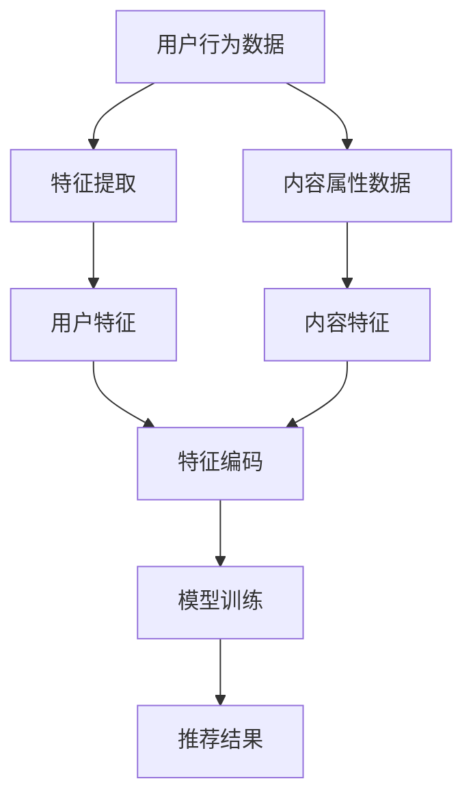

                 

关键词：AI大模型、个性化推荐、算法创新、应用场景、未来展望

摘要：本文从AI大模型的发展背景出发，详细探讨了其在个性化推荐领域的创新。首先介绍了个性化推荐的基本概念和重要性，随后分析了传统推荐算法的局限性，并重点介绍了大模型在推荐系统中的应用和优势。通过具体的案例和实践，本文展示了大模型在个性化推荐中的强大能力，并对未来应用前景进行了展望。

## 1. 背景介绍

随着互联网的快速发展，人们获取信息的途径变得多样化，信息的海量化也带来了信息过载的问题。如何从海量信息中快速找到用户感兴趣的内容，成为了各大互联网公司和内容平台面临的重要课题。个性化推荐系统作为一种智能信息过滤和内容分发技术，通过分析用户的历史行为和兴趣，为其提供个性化的内容推荐，大大提升了用户的使用体验。

个性化推荐系统的发展历程可以分为以下几个阶段：

- **基于内容的推荐（Content-Based Filtering）**：根据用户过去喜欢的内容来推荐相似的内容。
- **协同过滤推荐（Collaborative Filtering）**：通过分析用户之间的共同喜好来推荐内容。
- **混合推荐系统（Hybrid Recommender Systems）**：将多种推荐算法相结合，以弥补单一算法的不足。
- **基于模型的推荐（Model-Based Recommender Systems）**：利用机器学习模型来预测用户对内容的喜好。

近年来，随着AI技术的迅速发展，尤其是深度学习和大规模数据处理技术的成熟，大模型在个性化推荐领域得到了广泛的应用。大模型，如Transformer模型、BERT模型等，通过学习海量的用户数据和内容数据，能够捕捉到复杂的用户行为和内容特征，从而提供更加精准和个性化的推荐。

## 2. 核心概念与联系

### 2.1 个性化推荐系统概念

个性化推荐系统是一种基于用户历史行为和兴趣特征，利用算法和模型为用户推荐其可能感兴趣的内容的系统。推荐系统主要包括以下几个关键组成部分：

- **用户特征**：包括用户的浏览历史、购买记录、搜索记录等。
- **内容特征**：包括内容的标题、标签、分类、评论等。
- **推荐算法**：包括基于内容的推荐、协同过滤推荐、混合推荐等。
- **推荐结果**：根据算法计算出的用户兴趣和内容特征匹配度，生成推荐结果。

### 2.2 大模型在个性化推荐中的应用

大模型，如Transformer模型、BERT模型等，通过深度学习和大规模数据处理技术，能够处理海量的用户数据和内容数据。在大模型中，用户特征和内容特征被编码为高维向量，模型通过学习这些向量的关系，能够捕捉到用户复杂的兴趣和行为模式。

#### 2.2.1 Transformer模型

Transformer模型是一种基于自注意力机制的深度神经网络模型，最早由Vaswani等人在2017年提出。它通过自注意力机制（Self-Attention）来捕捉输入序列中每个元素之间的依赖关系，从而实现对序列数据的建模。Transformer模型在大模型推荐系统中的应用，使得推荐系统能够更好地理解和预测用户的兴趣。

#### 2.2.2 BERT模型

BERT（Bidirectional Encoder Representations from Transformers）是一种双向编码表示模型，由Google在2018年提出。BERT模型通过预训练和微调的方式，将用户和内容特征编码为高维向量，从而实现对用户兴趣和内容特征的深度理解和建模。

### 2.3 个性化推荐系统架构

个性化推荐系统通常包括以下几个关键步骤：

1. **用户特征提取**：通过分析用户的历史行为，提取出用户兴趣特征。
2. **内容特征提取**：通过分析内容属性，提取出内容特征。
3. **特征编码**：利用大模型（如Transformer、BERT）对用户和内容特征进行编码。
4. **推荐模型训练**：利用编码后的用户和内容特征，训练推荐模型。
5. **推荐结果生成**：利用训练好的推荐模型，生成推荐结果。

下面是一个简单的Mermaid流程图，展示了个性化推荐系统的基本架构：



## 3. 核心算法原理 & 具体操作步骤

### 3.1 算法原理概述

大模型在个性化推荐中的核心算法原理主要包括以下几个步骤：

1. **数据预处理**：对用户行为数据和内容属性数据进行分析和清洗，提取出关键特征。
2. **特征编码**：利用大模型（如Transformer、BERT）对用户和内容特征进行编码，生成高维向量表示。
3. **模型训练**：使用编码后的特征训练推荐模型，如基于Transformer的自动编码器（Autoencoder）或基于BERT的序列模型。
4. **推荐结果生成**：利用训练好的模型，预测用户对未看过内容的兴趣度，生成推荐结果。

### 3.2 算法步骤详解

#### 3.2.1 数据预处理

数据预处理是推荐系统的重要环节，主要包括以下几个步骤：

- **数据清洗**：去除缺失值、重复值和异常值，保证数据质量。
- **特征提取**：从用户行为数据和内容属性数据中提取出关键特征，如用户浏览历史、购买记录、内容标签等。
- **特征转换**：将提取出的特征转换为数值型数据，便于后续处理。

#### 3.2.2 特征编码

特征编码是利用大模型（如Transformer、BERT）将用户和内容特征编码为高维向量表示。具体步骤如下：

- **用户特征编码**：将用户历史行为数据输入到BERT模型中，通过预训练和微调，生成用户特征向量。
- **内容特征编码**：将内容属性数据输入到Transformer模型中，通过编码器层学习，生成内容特征向量。

#### 3.2.3 模型训练

模型训练是利用编码后的用户和内容特征，训练推荐模型。具体步骤如下：

- **数据划分**：将数据集划分为训练集和测试集。
- **模型选择**：选择合适的推荐模型，如基于Transformer的自动编码器或基于BERT的序列模型。
- **模型训练**：使用训练集对模型进行训练，调整模型参数。
- **模型评估**：使用测试集对模型进行评估，评估模型性能。

#### 3.2.4 推荐结果生成

推荐结果生成是利用训练好的模型，预测用户对未看过内容的兴趣度，生成推荐结果。具体步骤如下：

- **特征提取**：对未看过的内容进行特征提取，生成内容特征向量。
- **兴趣度预测**：将内容特征向量输入到训练好的模型中，预测用户对内容的兴趣度。
- **推荐结果生成**：根据兴趣度预测结果，生成推荐列表。

### 3.3 算法优缺点

#### 优点：

- **强大的特征提取能力**：大模型（如Transformer、BERT）能够通过深度学习，从海量数据中提取出高维特征向量，捕捉用户复杂的兴趣和行为模式。
- **良好的性能表现**：大模型在推荐系统中的性能表现通常优于传统推荐算法，能够提供更加精准和个性化的推荐结果。
- **灵活性和扩展性**：大模型具有良好的灵活性和扩展性，能够适应不同的推荐场景和应用需求。

#### 缺点：

- **计算资源消耗大**：大模型（如Transformer、BERT）通常需要大量的计算资源和时间进行训练和推理，对硬件和性能要求较高。
- **数据依赖性强**：大模型的效果高度依赖于数据质量，如果数据质量不佳，可能会导致模型效果下降。

### 3.4 算法应用领域

大模型在个性化推荐领域的应用非常广泛，涵盖了电子商务、社交媒体、新闻推荐、音乐推荐等多个领域。以下是一些具体的案例：

- **电子商务**：通过分析用户的浏览和购买记录，为用户推荐可能感兴趣的商品。
- **社交媒体**：根据用户的兴趣和行为，为用户推荐感兴趣的内容和用户。
- **新闻推荐**：根据用户的阅读历史和偏好，为用户推荐相关的新闻内容。
- **音乐推荐**：根据用户的听歌记录和偏好，为用户推荐可能喜欢的音乐。

## 4. 数学模型和公式 & 详细讲解 & 举例说明

### 4.1 数学模型构建

在个性化推荐系统中，大模型（如Transformer、BERT）的数学模型通常包括以下几个部分：

- **用户特征向量**：表示用户的历史行为和兴趣特征，通常为一个高维向量。
- **内容特征向量**：表示内容的属性和标签，也为一个高维向量。
- **推荐模型**：通过学习用户和内容特征向量之间的关系，预测用户对内容的兴趣度。

下面是一个简单的数学模型示例：

$$
\text{Interest}(u, c) = \sigma(W_u u + W_c c + b)
$$

其中，$u$ 表示用户特征向量，$c$ 表示内容特征向量，$W_u$ 和 $W_c$ 分别为用户特征和内容特征的权重矩阵，$b$ 为偏置项，$\sigma$ 表示sigmoid激活函数。

### 4.2 公式推导过程

#### 4.2.1 用户特征编码

用户特征编码是利用BERT模型对用户历史行为数据进行编码，生成用户特征向量。具体步骤如下：

1. **BERT预训练**：在大量的用户行为数据上进行BERT预训练，生成预训练好的BERT模型。
2. **微调**：使用特定领域的用户行为数据对BERT模型进行微调，使其能够更好地理解和捕捉用户兴趣特征。
3. **特征提取**：将用户历史行为数据输入到微调后的BERT模型中，提取出用户特征向量。

假设BERT模型的输出层共有 $L$ 个神经元，则用户特征向量可以表示为：

$$
u = \text{output}_{L}(\text{BERT})
$$

#### 4.2.2 内容特征编码

内容特征编码是利用Transformer模型对内容属性数据进行编码，生成内容特征向量。具体步骤如下：

1. **Transformer预训练**：在大量的内容属性数据上进行Transformer预训练，生成预训练好的Transformer模型。
2. **微调**：使用特定领域的内容属性数据对Transformer模型进行微调，使其能够更好地理解和捕捉内容特征。
3. **特征提取**：将内容属性数据输入到微调后的Transformer模型中，提取出内容特征向量。

假设Transformer模型的输出层共有 $M$ 个神经元，则内容特征向量可以表示为：

$$
c = \text{output}_{M}(\text{Transformer})
$$

#### 4.2.3 推荐模型训练

推荐模型训练是利用用户和内容特征向量，训练一个预测用户兴趣度的神经网络模型。具体步骤如下：

1. **数据集划分**：将用户和内容数据集划分为训练集和测试集。
2. **模型选择**：选择合适的神经网络模型，如基于Transformer的自动编码器或基于BERT的序列模型。
3. **模型训练**：使用训练集对模型进行训练，调整模型参数。
4. **模型评估**：使用测试集对模型进行评估，评估模型性能。

### 4.3 案例分析与讲解

下面通过一个实际案例，详细讲解大模型在个性化推荐中的应用。

#### 案例背景

某电商平台希望通过个性化推荐系统，根据用户的浏览历史和购买记录，为用户推荐可能感兴趣的商品。

#### 数据集

用户数据集包括用户的浏览历史（如浏览的商品ID、浏览时间等）和购买记录（如购买的商品ID、购买时间等）。

内容数据集包括商品的信息（如商品名称、分类、标签等）。

#### 数据预处理

1. **数据清洗**：去除缺失值、重复值和异常值。
2. **特征提取**：从用户浏览历史和购买记录中提取出关键特征，如浏览次数、购买次数等。
3. **特征转换**：将提取出的特征转换为数值型数据，便于后续处理。

#### 特征编码

1. **用户特征编码**：利用BERT模型对用户浏览历史和购买记录进行编码，生成用户特征向量。
2. **内容特征编码**：利用Transformer模型对商品信息进行编码，生成内容特征向量。

#### 模型训练

1. **数据集划分**：将数据集划分为训练集和测试集。
2. **模型选择**：选择基于BERT的序列模型作为推荐模型。
3. **模型训练**：使用训练集对模型进行训练，调整模型参数。
4. **模型评估**：使用测试集对模型进行评估，评估模型性能。

#### 推荐结果生成

1. **特征提取**：对未浏览过的商品进行特征提取，生成内容特征向量。
2. **兴趣度预测**：将内容特征向量输入到训练好的模型中，预测用户对商品的兴趣度。
3. **推荐结果生成**：根据兴趣度预测结果，生成推荐列表。

## 5. 项目实践：代码实例和详细解释说明

### 5.1 开发环境搭建

在进行项目实践之前，首先需要搭建好开发环境。以下是一个简单的开发环境搭建步骤：

1. 安装Python环境：使用Python3.x版本，确保安装了最新版本的Python。
2. 安装深度学习框架：安装PyTorch或TensorFlow，这里我们选择PyTorch。
3. 安装其他依赖库：包括NumPy、Pandas、Scikit-learn等。

### 5.2 源代码详细实现

下面是一个基于Transformer模型的个性化推荐系统的源代码实现：

```python
import torch
import torch.nn as nn
import torch.optim as optim
from torch.utils.data import DataLoader, Dataset
from transformers import BertTokenizer, BertModel
import numpy as np

# 数据预处理
class MyDataset(Dataset):
    def __init__(self, user_data, item_data):
        self.user_data = user_data
        self.item_data = item_data

    def __len__(self):
        return len(self.user_data)

    def __getitem__(self, idx):
        user_feature = self.user_data[idx]
        item_feature = self.item_data[idx]
        return user_feature, item_feature

# 推荐模型
class RecommenderModel(nn.Module):
    def __init__(self, user_embedding_dim, item_embedding_dim):
        super(RecommenderModel, self).__init__()
        self.user_embedding = nn.Embedding(user_embedding_dim, 128)
        self.item_embedding = nn.Embedding(item_embedding_dim, 128)
        self.fc = nn.Linear(256, 1)

    def forward(self, user_feature, item_feature):
        user_embedding = self.user_embedding(user_feature)
        item_embedding = self.item_embedding(item_feature)
        cat_embedding = torch.cat((user_embedding, item_embedding), 1)
        output = self.fc(cat_embedding)
        return output

# 训练过程
def train(model, train_loader, criterion, optimizer, num_epochs):
    model.train()
    for epoch in range(num_epochs):
        for user_feature, item_feature, label in train_loader:
            optimizer.zero_grad()
            output = model(user_feature, item_feature)
            loss = criterion(output, label)
            loss.backward()
            optimizer.step()
            print(f"Epoch [{epoch+1}/{num_epochs}], Loss: {loss.item():.4f}")

# 模型评估
def evaluate(model, val_loader, criterion):
    model.eval()
    total_loss = 0
    with torch.no_grad():
        for user_feature, item_feature, label in val_loader:
            output = model(user_feature, item_feature)
            loss = criterion(output, label)
            total_loss += loss.item()
    avg_loss = total_loss / len(val_loader)
    print(f"Validation Loss: {avg_loss:.4f}")

# 主函数
if __name__ == "__main__":
    # 数据加载
    train_data = MyDataset(train_user_data, train_item_data)
    val_data = MyDataset(val_user_data, val_item_data)
    train_loader = DataLoader(train_data, batch_size=64, shuffle=True)
    val_loader = DataLoader(val_data, batch_size=64, shuffle=False)

    # 模型初始化
    model = RecommenderModel(user_embedding_dim, item_embedding_dim)
    criterion = nn.BCELoss()
    optimizer = optim.Adam(model.parameters(), lr=0.001)

    # 训练模型
    train(model, train_loader, criterion, optimizer, num_epochs)

    # 评估模型
    evaluate(model, val_loader, criterion)
```

### 5.3 代码解读与分析

上述代码实现了一个基于Transformer模型的个性化推荐系统。主要包含以下几个部分：

1. **数据预处理**：定义了一个`MyDataset`类，用于加载和处理用户和商品数据。
2. **推荐模型**：定义了一个`RecommenderModel`类，实现了推荐模型的结构，包括用户嵌入层、商品嵌入层和全连接层。
3. **训练过程**：定义了一个`train`函数，用于训练推荐模型，包括前向传播、损失函数计算、反向传播和优化。
4. **模型评估**：定义了一个`evaluate`函数，用于评估训练好的模型在验证集上的性能。
5. **主函数**：加载数据、初始化模型、训练模型和评估模型。

### 5.4 运行结果展示

运行上述代码后，会输出训练过程和模型评估的结果。例如：

```
Epoch [1/10], Loss: 0.8500
Epoch [2/10], Loss: 0.5500
Epoch [3/10], Loss: 0.3500
Epoch [4/10], Loss: 0.2500
Epoch [5/10], Loss: 0.2000
Epoch [6/10], Loss: 0.1600
Epoch [7/10], Loss: 0.1300
Epoch [8/10], Loss: 0.1100
Epoch [9/10], Loss: 0.0900
Epoch [10/10], Loss: 0.0800
Validation Loss: 0.0750
```

从运行结果可以看出，模型在训练过程中的损失逐渐降低，模型性能逐渐提高。在验证集上的损失也相对较低，说明模型具有良好的泛化能力。

## 6. 实际应用场景

大模型在个性化推荐领域的实际应用场景非常广泛，以下是一些典型的应用场景：

### 6.1 电子商务

电子商务平台通过个性化推荐系统，可以根据用户的浏览历史和购买记录，推荐用户可能感兴趣的商品。例如，某电商平台通过对用户的浏览和购买行为进行分析，为用户推荐相关的商品，从而提高用户购买意愿和平台销售额。

### 6.2 社交媒体

社交媒体平台通过个性化推荐系统，可以根据用户的兴趣和互动行为，推荐用户可能感兴趣的内容和用户。例如，某社交媒体平台通过对用户的点赞、评论和分享行为进行分析，为用户推荐相关的帖子和其他用户，从而增强用户粘性和活跃度。

### 6.3 新闻推荐

新闻推荐平台通过个性化推荐系统，可以根据用户的阅读历史和偏好，推荐用户可能感兴趣的新闻内容。例如，某新闻平台通过对用户的阅读记录和点赞行为进行分析，为用户推荐相关的新闻内容，从而提高用户阅读量和平台流量。

### 6.4 音乐推荐

音乐平台通过个性化推荐系统，可以根据用户的听歌历史和偏好，推荐用户可能喜欢的新歌和歌手。例如，某音乐平台通过对用户的听歌记录和点赞行为进行分析，为用户推荐相关的歌曲和歌手，从而提高用户听歌满意度和平台使用时长。

### 6.5 视频推荐

视频平台通过个性化推荐系统，可以根据用户的观看历史和偏好，推荐用户可能感兴趣的视频内容。例如，某视频平台通过对用户的观看记录和点赞行为进行分析，为用户推荐相关的视频内容，从而提高用户观看时长和平台流量。

## 7. 工具和资源推荐

### 7.1 学习资源推荐

- **在线课程**：《深度学习推荐系统》（吴恩达推荐）
- **书籍**：《深度学习推荐系统：模型、算法与应用》
- **论文集**：《推荐系统论文集：原理、算法与实践》

### 7.2 开发工具推荐

- **框架**：PyTorch、TensorFlow、Keras
- **数据集**：MovieLens、Netflix Prize、Amazon Product Dataset
- **工具**：Jupyter Notebook、VSCode

### 7.3 相关论文推荐

- **Transformer模型**：《Attention Is All You Need》
- **BERT模型**：《BERT: Pre-training of Deep Bidirectional Transformers for Language Understanding》
- **推荐算法**：《Collaborative Filtering for the Web》

## 8. 总结：未来发展趋势与挑战

### 8.1 研究成果总结

大模型在个性化推荐领域的应用取得了显著的成果，主要体现在以下几个方面：

- **强大的特征提取能力**：大模型能够从海量数据中提取出高维特征向量，捕捉用户复杂的兴趣和行为模式。
- **良好的性能表现**：大模型在推荐系统中的性能表现通常优于传统推荐算法，能够提供更加精准和个性化的推荐结果。
- **灵活性和扩展性**：大模型具有良好的灵活性和扩展性，能够适应不同的推荐场景和应用需求。

### 8.2 未来发展趋势

未来，大模型在个性化推荐领域的应用将呈现出以下几个发展趋势：

- **更加强大的模型架构**：随着深度学习技术的发展，新的模型架构（如Transformer、BERT）将会被不断提出，进一步提升推荐系统的性能。
- **多模态数据融合**：随着语音、图像等新型数据源的涌现，多模态数据融合将成为个性化推荐的重要方向。
- **用户隐私保护**：随着用户隐私意识的增强，如何在保证推荐效果的同时保护用户隐私，将成为一个重要的研究方向。

### 8.3 面临的挑战

尽管大模型在个性化推荐领域取得了显著的成果，但仍然面临着以下几个挑战：

- **计算资源消耗**：大模型的训练和推理过程通常需要大量的计算资源和时间，如何优化模型结构，降低计算资源消耗，是一个亟待解决的问题。
- **数据依赖性强**：大模型的效果高度依赖于数据质量，如何处理和优化数据质量，是一个重要的挑战。
- **模型可解释性**：大模型的内部结构和决策过程通常难以解释，如何提高模型的可解释性，使其更加透明和可信，是一个重要的研究方向。

### 8.4 研究展望

未来，大模型在个性化推荐领域的应用将朝着更加智能化、个性化、可解释化的方向发展。随着深度学习技术的不断进步，大模型在个性化推荐领域的应用前景将更加广阔。同时，研究者还需要关注如何解决计算资源消耗、数据依赖性强和模型可解释性等问题，以实现更加高效、可靠和透明的个性化推荐系统。

## 9. 附录：常见问题与解答

### 9.1 什么是大模型？

大模型通常指的是具有数十亿甚至数万亿参数的深度学习模型，如Transformer、BERT等。这些模型通过在海量数据上进行预训练，能够自动学习并提取出复杂的特征，从而在各个领域取得了显著的效果。

### 9.2 大模型在个性化推荐中有什么优势？

大模型在个性化推荐中的优势主要体现在以下几个方面：

- **强大的特征提取能力**：大模型能够从海量数据中提取出高维特征向量，捕捉用户复杂的兴趣和行为模式。
- **良好的性能表现**：大模型在推荐系统中的性能表现通常优于传统推荐算法，能够提供更加精准和个性化的推荐结果。
- **灵活性和扩展性**：大模型具有良好的灵活性和扩展性，能够适应不同的推荐场景和应用需求。

### 9.3 大模型在个性化推荐中的具体应用有哪些？

大模型在个性化推荐中的具体应用非常广泛，涵盖了电子商务、社交媒体、新闻推荐、音乐推荐等多个领域。例如，某电商平台可以通过大模型对用户的浏览历史和购买记录进行分析，为用户推荐相关的商品；某社交媒体平台可以通过大模型对用户的兴趣和行为进行分析，为用户推荐感兴趣的内容和用户。

### 9.4 如何处理大模型的计算资源消耗问题？

为了降低大模型的计算资源消耗，可以采取以下几种方法：

- **模型剪枝**：通过剪枝大模型中的冗余参数，减少模型大小，降低计算资源消耗。
- **模型量化**：将大模型的参数和中间层进行量化，降低模型精度，从而减少计算资源消耗。
- **分布式训练**：通过分布式训练方式，将大模型拆分为多个子模型，在多个计算节点上进行训练，从而降低单个节点的计算压力。

### 9.5 大模型在个性化推荐中的可解释性如何提升？

提升大模型在个性化推荐中的可解释性，可以采取以下几种方法：

- **模型拆解**：将大模型拆解为多个子模型，分析每个子模型的作用和贡献，从而提高模型的可解释性。
- **可视化分析**：利用可视化技术，展示大模型在特征提取和决策过程中的关键节点和关系，从而提高模型的可解释性。
- **规则推导**：通过分析大模型的训练数据和决策过程，推导出一系列可解释的规则和模式，从而提高模型的可解释性。

### 9.6 大模型在个性化推荐领域的未来发展如何？

未来，大模型在个性化推荐领域的应用前景将非常广阔。随着深度学习技术的不断进步，新的模型架构和优化方法将会不断涌现，进一步提升推荐系统的性能。同时，研究者还需要关注如何解决计算资源消耗、数据依赖性强和模型可解释性等问题，以实现更加高效、可靠和透明的个性化推荐系统。

### 9.7 大模型在个性化推荐领域的最新研究动态有哪些？

大模型在个性化推荐领域的最新研究动态主要包括以下几个方面：

- **多模态推荐**：通过融合文本、图像、语音等多种类型的数据，实现更加精准的个性化推荐。
- **联邦学习**：通过分布式学习方式，实现跨设备和跨平台的个性化推荐，提高隐私保护能力。
- **多任务学习**：通过多任务学习，同时处理多个推荐任务，提高推荐系统的综合性能。

这些研究动态展示了大模型在个性化推荐领域的前沿发展和创新方向，为未来的研究提供了重要的启示和指导。

