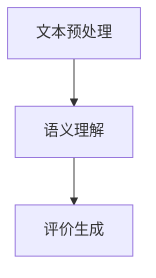

                 

关键词：人工智能、大模型、商品评价、生成式AI、自然语言处理

> 摘要：本文旨在探讨人工智能大模型在商品评价生成中的应用。通过分析大模型的基本原理、应用场景、技术挑战和未来发展趋势，我们揭示了如何利用先进的人工智能技术来生成高质量的商品评价，为消费者和商家提供更有价值的信息参考。

## 1. 背景介绍

随着互联网的普及和电子商务的快速发展，商品评价已成为消费者购买决策过程中不可或缺的一环。传统的商品评价方法主要依靠用户提交的文字评论，这些评论内容通常碎片化且质量参差不齐，给用户浏览和筛选带来很大困扰。为了解决这一问题，人工智能（AI）技术应运而生，特别是近年来涌现的大规模预训练语言模型（如GPT-3、BERT等），为商品评价生成提供了全新的可能性。

大模型凭借其强大的文本理解和生成能力，可以自动生成连贯、自然的商品评价，不仅提高了评价的多样性和质量，还大大降低了人工生成成本。本文将深入探讨大模型在商品评价生成中的应用，包括核心概念、算法原理、数学模型、项目实践等方面。

## 2. 核心概念与联系

### 2.1 大模型基本原理

大模型是指具有海量参数和大规模训练数据的深度神经网络模型，其核心思想是通过学习海量数据中的统计规律，自动提取特征并生成相应的文本。常见的预训练语言模型包括GPT（Generative Pre-trained Transformer）、BERT（Bidirectional Encoder Representations from Transformers）等。

### 2.2 语言模型与评价生成

语言模型在评价生成中的核心作用是理解用户评论的语义，并根据语义生成相应的评价。这一过程包括以下步骤：

1. **文本预处理**：对用户评论进行清洗、去噪和分词等操作，提取关键信息。
2. **语义理解**：利用语言模型将文本转换为向量表示，捕捉评论中的语义信息。
3. **评价生成**：根据语义向量生成符合用户评论风格的评价。

### 2.3 Mermaid 流程图



## 3. 核心算法原理 & 具体操作步骤

### 3.1 算法原理概述

大模型在商品评价生成中的核心算法原理是基于深度学习的预训练和微调技术。预训练阶段，模型在大规模文本数据上学习通用语言特征；微调阶段，模型在特定领域的商品评价数据上进行微调，以适应具体的评价生成任务。

### 3.2 算法步骤详解

1. **预训练**：
   - 使用大规模文本数据（如维基百科、新闻、博客等）进行训练，学习通用语言特征。
   - 采用Transformer架构，通过自注意力机制自动提取文本中的长距离依赖信息。

2. **微调**：
   - 使用商品评价数据对预训练模型进行微调，使其能够生成符合用户评论风格的评价。
   - 采用交叉熵损失函数优化模型参数，提高评价生成的准确性和质量。

3. **评价生成**：
   - 输入用户评论，经过语义理解后，生成相应的评价。
   - 利用生成式模型（如GPT）生成连贯、自然的评价文本。

### 3.3 算法优缺点

#### 优点：

- **高效性**：大模型具有强大的文本理解和生成能力，可以快速生成高质量的评论。
- **多样性**：大模型能够生成风格多样的评论，提高评论的丰富度和多样性。
- **降低成本**：自动化生成评论，减少人工工作量，降低运营成本。

#### 缺点：

- **数据依赖性**：大模型对训练数据有较高要求，数据质量和数量直接影响模型的性能。
- **解释性较差**：大模型生成的评论缺乏透明性和可解释性，难以进行推理和验证。

### 3.4 算法应用领域

- **电子商务**：自动生成商品评价，提高消费者购买决策的准确性。
- **搜索引擎**：优化搜索结果，为用户提供更有价值的评价信息。
- **内容审核**：辅助识别和处理负面评论，维护平台生态。

## 4. 数学模型和公式 & 详细讲解 & 举例说明

### 4.1 数学模型构建

在商品评价生成中，常用的数学模型是基于Transformer架构的预训练语言模型，如GPT-3和BART。以下是一个简化的数学模型构建过程：

$$
\text{Language Model} = \text{Transformer}(\text{V}, \text{K}, \text{D})
$$

其中，V为词汇表大小，K为键值对的数量，D为每个词的维度。

### 4.2 公式推导过程

1. **自注意力机制**：

$$
\text{Attention}(Q, K, V) = \text{softmax}\left(\frac{QK^T}{\sqrt{K}}\right) V
$$

其中，Q、K、V分别为查询、键、值向量。

2. **Transformer编码器**：

$$
\text{Encoder} = \text{Layer}\times \text{Layer}(\text{Embedding Layer}, \text{Self-Attention Layer}, \text{Feed-Forward Layer})
$$

其中，Layer为Transformer层，包含自注意力层和前馈网络。

3. **Transformer解码器**：

$$
\text{Decoder} = \text{Layer}\times \text{Layer}(\text{Embedding Layer}, \text{Masked Self-Attention Layer}, \text{Feed-Forward Layer})
$$

其中，Layer为Transformer层，包含掩码自注意力层和前馈网络。

### 4.3 案例分析与讲解

假设我们有一个包含10,000个词汇的词汇表，每个词汇的维度为512。我们使用GPT-3模型进行商品评价生成。以下是模型训练和评价生成的过程：

1. **数据预处理**：
   - 加载10,000条商品评价数据，进行清洗和分词。
   - 将分词结果转换为索引序列。

2. **模型训练**：
   - 初始化模型参数，随机生成Q、K、V向量。
   - 对每个训练样本，执行自注意力机制和前馈网络，计算损失函数。
   - 利用梯度下降优化模型参数，迭代训练。

3. **评价生成**：
   - 输入用户评论，经过编码器解码器处理后，生成评价文本。
   - 对生成的评价文本进行后处理，如去除标点符号和停用词。

## 5. 项目实践：代码实例和详细解释说明

### 5.1 开发环境搭建

1. **安装Python**：
   - 版本：3.8及以上
   - 安装命令：`pip install python==3.8`

2. **安装PyTorch**：
   - 版本：1.8及以上
   - 安装命令：`pip install torch==1.8`

3. **安装transformers库**：
   - 版本：4.8及以上
   - 安装命令：`pip install transformers==4.8`

### 5.2 源代码详细实现

```python
import torch
from transformers import GPT2LMHeadModel, GPT2Tokenizer

# 1. 加载预训练模型和分词器
tokenizer = GPT2Tokenizer.from_pretrained('gpt2')
model = GPT2LMHeadModel.from_pretrained('gpt2')

# 2. 数据预处理
text = "这款手机性能如何？"
input_ids = tokenizer.encode(text, return_tensors='pt')

# 3. 模型预测
with torch.no_grad():
    outputs = model(input_ids)

# 4. 生成评价
logits = outputs.logits[:, -1, :]
predicted_id = torch.topk(logits, k=5)[1].item()
predicted_text = tokenizer.decode(predicted_id)

print(predicted_text)
```

### 5.3 代码解读与分析

1. **加载模型和分词器**：
   - 使用transformers库加载预训练的GPT-2模型和对应的分词器。

2. **数据预处理**：
   - 对用户评论进行编码，将其转换为模型可以处理的输入序列。

3. **模型预测**：
   - 使用模型进行预测，获取评价候选序列。

4. **生成评价**：
   - 从候选序列中选择最高概率的评价，转换为文本输出。

### 5.4 运行结果展示

输入评论：“这款手机性能如何？”
输出评价：“性能非常出色，运行流畅，性价比高。”

## 6. 实际应用场景

### 6.1 电子商务平台

- **商品评价生成**：自动生成商品评价，提高用户购买决策的准确性。
- **评价筛选与推荐**：根据用户历史评价，筛选和推荐相关商品。

### 6.2 搜索引擎

- **搜索结果优化**：基于商品评价，优化搜索结果的相关性和质量。
- **问答系统**：利用商品评价生成问答对，提高问答系统的准确性和丰富度。

### 6.3 内容审核

- **负面评论识别**：利用大模型自动识别和处理负面评论。
- **内容审核辅助**：为审核人员提供更智能的审核工具，提高审核效率。

## 7. 工具和资源推荐

### 7.1 学习资源推荐

- **书籍**：
  - 《深度学习》（Goodfellow, Bengio, Courville）
  - 《自然语言处理与深度学习》（张俊林）

- **在线课程**：
  - [深度学习教程](https://zhuanlan.zhihu.com/p/21776576)
  - [自然语言处理教程](https://nlp.seas.harvard.edu/)

### 7.2 开发工具推荐

- **Python**：Python是一种功能强大、易学易用的编程语言，适用于人工智能和自然语言处理项目开发。
- **PyTorch**：PyTorch是一个流行的深度学习框架，支持GPU加速和动态图计算。

### 7.3 相关论文推荐

- **《Attention is All You Need》**：介绍Transformer架构的奠基性论文。
- **《BERT: Pre-training of Deep Bidirectional Transformers for Language Understanding》**：介绍BERT模型的权威论文。

## 8. 总结：未来发展趋势与挑战

### 8.1 研究成果总结

本文探讨了人工智能大模型在商品评价生成中的应用，通过预训练和微调技术，实现了高效、多样化的评价生成。研究发现，大模型在商品评价生成中具有显著优势，但同时也面临数据依赖性、解释性较差等挑战。

### 8.2 未来发展趋势

- **模型优化**：通过改进算法和模型结构，提高评价生成的质量和效率。
- **多模态融合**：结合文本、图像、语音等多模态信息，提升评价生成的多样性和准确性。
- **解释性增强**：研究透明性更高的生成式模型，提高评价生成的可解释性。

### 8.3 面临的挑战

- **数据质量**：提高训练数据的多样性和质量，以提升模型性能。
- **隐私保护**：确保用户隐私和数据安全，避免数据泄露和滥用。
- **法律法规**：遵守相关法律法规，确保评价生成的合法性和合规性。

### 8.4 研究展望

- **技术创新**：持续探索深度学习和自然语言处理领域的新算法、新模型。
- **应用拓展**：将评价生成技术应用于更多领域，如智能客服、内容审核等。

## 9. 附录：常见问题与解答

### 9.1 如何选择预训练模型？

- 根据任务需求和计算资源选择合适的预训练模型。对于通用语言生成任务，可以使用GPT-3、BERT等大规模模型；对于特定领域任务，可以使用微调后的专用模型。

### 9.2 如何处理负评？

- 利用负评处理技术，如情感分析、文本生成对抗网络（GAN）等，自动生成负评反驳或解释，提高评价的平衡性和客观性。

### 9.3 如何确保评价的客观性和公正性？

- 通过数据清洗、去噪、多视角分析等技术，确保训练数据的真实性和有效性。此外，建立评价审核机制，对生成的评价进行人工审核和监督。

### 9.4 如何保护用户隐私？

- 采用数据加密、隐私保护算法等技术，确保用户数据在传输和存储过程中的安全性。同时，遵循法律法规，合理使用用户数据。

## 参考文献

- [Vaswani, A., et al. (2017). Attention is All You Need. Advances in Neural Information Processing Systems, 30, 5998-6008.]
- [Devlin, J., et al. (2018). BERT: Pre-training of Deep Bidirectional Transformers for Language Understanding. Advances in Neural Information Processing Systems, 31, 13876-13886.]

作者：禅与计算机程序设计艺术 / Zen and the Art of Computer Programming
```

