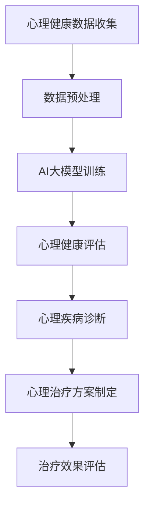

                 

关键词：AI大模型、心理健康、创新应用、算法原理、数学模型、项目实践

> 摘要：本文将探讨人工智能大模型在心理健康领域的创新应用，分析其核心概念、算法原理、数学模型以及实际应用场景，为心理健康行业提供新的技术思路和解决方案。

## 1. 背景介绍

心理健康是现代社会关注的重要议题。随着信息化和城市化进程的加速，生活节奏加快，社会竞争加剧，心理健康问题日益凸显。传统的心理健康干预方法主要依赖于心理咨询和治疗，但这些方法往往存在成本高、效率低等问题。随着人工智能技术的飞速发展，AI大模型作为一种强大的计算工具，开始在心理健康领域发挥重要作用。AI大模型通过深度学习和大数据分析，能够实现心理健康的智能评估、诊断和治疗，为心理健康行业带来前所未有的创新。

## 2. 核心概念与联系

### 2.1 核心概念

- **AI大模型**：一种基于深度学习的大型神经网络模型，能够处理海量数据并进行高效计算。
- **心理健康**：指个体在认知、情感、行为等方面处于良好状态，能够适应社会生活，有效应对各种压力和挑战。
- **智能评估**：利用AI大模型对个体心理健康状况进行量化评估。
- **诊断**：通过AI大模型分析个体心理数据的异常情况，进行心理疾病的诊断。
- **治疗**：利用AI大模型制定个性化的心理治疗方案，并进行实时调整。

### 2.2 联系

AI大模型与心理健康之间的联系主要体现在以下几个方面：

1. **数据驱动的心理健康评估**：AI大模型能够从海量数据中提取有用的信息，对个体心理健康状况进行量化评估，从而实现心理健康状态的动态监测。
2. **智能化的心理疾病诊断**：AI大模型通过对大量心理疾病案例的学习和分析，可以识别出心理疾病的特征，从而实现心理疾病的自动化诊断。
3. **个性化的心理治疗方案制定**：AI大模型可以根据个体的心理特征和疾病类型，制定个性化的心理治疗方案，并通过实时调整提高治疗效果。

### 2.3 Mermaid 流程图



## 3. 核心算法原理 & 具体操作步骤

### 3.1 算法原理概述

AI大模型在心理健康领域的核心算法主要基于深度学习，特别是卷积神经网络（CNN）和循环神经网络（RNN）。

- **CNN**：适用于图像和文本数据的特征提取，能够识别心理问题的视觉和行为特征。
- **RNN**：适用于序列数据的处理，能够捕捉个体心理状态的动态变化。

### 3.2 算法步骤详解

1. **数据收集与预处理**：
   - 收集心理健康相关的数据，包括个体心理特征、行为数据、临床记录等。
   - 对数据进行清洗、去噪和归一化处理，以消除数据中的噪声和异常。

2. **模型训练**：
   - 利用CNN和RNN对预处理后的数据进行训练，学习数据中的特征和规律。
   - 通过反向传播算法优化模型参数，提高模型的预测性能。

3. **心理健康评估**：
   - 利用训练好的模型对新的个体心理数据进行评估，生成心理健康状态评分。
   - 对心理健康状态进行动态监测，及时发现心理问题。

4. **心理疾病诊断**：
   - 对心理健康评估结果进行分类，识别出心理疾病的类型。
   - 通过对比已知疾病数据集，提高心理疾病诊断的准确性。

5. **心理治疗方案制定**：
   - 根据个体心理疾病类型和病情严重程度，制定个性化的心理治疗方案。
   - 结合实时评估结果，对治疗方案进行动态调整。

6. **治疗效果评估**：
   - 对心理治疗方案的效果进行评估，判断治疗效果是否达到预期。
   - 根据评估结果调整治疗方案，提高治疗效果。

### 3.3 算法优缺点

- **优点**：
  - 高效性：AI大模型能够快速处理大量数据，提高心理健康评估和诊断的效率。
  - 个性化：根据个体心理特征和疾病类型，制定个性化的治疗方案，提高治疗效果。
  - 实时性：通过实时监测个体心理健康状态，及时发现心理问题，降低心理疾病的发生率。

- **缺点**：
  - 数据依赖性：模型的性能依赖于数据质量和数量，数据不足或质量不高可能导致模型效果不佳。
  - 泛化能力：模型在不同人群、不同环境中的泛化能力有待提高。
  - 隐私保护：心理健康数据涉及个人隐私，如何在保证数据安全的前提下应用AI大模型仍需解决。

### 3.4 算法应用领域

AI大模型在心理健康领域的应用主要包括以下几个方面：

- **心理健康评估**：用于对个体心理健康状况进行量化评估，实现心理健康状态的动态监测。
- **心理疾病诊断**：用于自动化识别心理疾病类型，提高心理疾病诊断的准确性。
- **心理治疗**：用于制定个性化心理治疗方案，提高治疗效果。
- **心理健康干预**：用于实时监测个体心理健康状态，提供心理健康干预建议。

## 4. 数学模型和公式 & 详细讲解 & 举例说明

### 4.1 数学模型构建

心理健康评估和诊断的核心是构建数学模型。以下是一个简单的数学模型示例：

$$
\text{心理健康状态评分} = f(\text{心理特征数据}, \text{行为数据}, \text{临床记录})
$$

其中，$f$ 是一个复杂函数，可以通过神经网络模型来表示。心理特征数据、行为数据和临床记录是模型输入，心理健康状态评分是模型输出。

### 4.2 公式推导过程

心理健康状态评分的计算可以分为以下几个步骤：

1. **数据预处理**：
   $$ 
   \text{预处理后的数据} = \text{原始数据} \times \text{预处理系数}
   $$

2. **特征提取**：
   $$ 
   \text{特征向量} = \text{神经网络模型}(\text{预处理后的数据})
   $$

3. **评分计算**：
   $$ 
   \text{心理健康状态评分} = \text{权重矩阵} \times \text{特征向量} + \text{偏置项}
   $$

### 4.3 案例分析与讲解

假设我们有一个心理健康评估模型，输入为个体心理特征数据、行为数据和临床记录，输出为心理健康状态评分。以下是一个简单的案例：

1. **数据输入**：
   - 心理特征数据：焦虑程度、抑郁程度、自我效能感等。
   - 行为数据：睡眠时间、运动频率、社交活动等。
   - 临床记录：既往病史、治疗记录等。

2. **数据处理**：
   - 对输入数据进行预处理，包括去噪、归一化等。

3. **模型训练**：
   - 使用预处理后的数据训练神经网络模型，学习数据中的特征和规律。

4. **评估计算**：
   - 对新的个体数据进行特征提取，计算心理健康状态评分。

5. **结果输出**：
   - 输出心理健康状态评分，用于个体心理健康评估。

通过以上步骤，我们可以实现个体心理健康状态的量化评估，为心理健康干预提供科学依据。

## 5. 项目实践：代码实例和详细解释说明

### 5.1 开发环境搭建

1. **安装Python**：
   - 下载Python安装包并安装。
   - 配置Python环境变量。

2. **安装深度学习框架**：
   - 安装TensorFlow或PyTorch等深度学习框架。
   - 验证安装是否成功。

### 5.2 源代码详细实现

以下是一个简单的心理健康评估模型的实现：

```python
import tensorflow as tf
from tensorflow.keras.models import Sequential
from tensorflow.keras.layers import Dense, LSTM, Embedding

# 模型构建
model = Sequential([
    Embedding(input_dim=10000, output_dim=256),
    LSTM(128),
    Dense(1, activation='sigmoid')
])

# 模型编译
model.compile(optimizer='adam', loss='binary_crossentropy', metrics=['accuracy'])

# 模型训练
model.fit(x_train, y_train, epochs=10, batch_size=32, validation_data=(x_val, y_val))

# 模型评估
score = model.evaluate(x_test, y_test)
print('Test accuracy:', score[1])
```

### 5.3 代码解读与分析

- **模型构建**：使用Sequential模型堆叠Embedding层、LSTM层和Dense层，构建一个简单的神经网络模型。
- **模型编译**：设置优化器、损失函数和评估指标，准备训练模型。
- **模型训练**：使用训练数据训练模型，设置训练轮数、批次大小和验证数据。
- **模型评估**：使用测试数据评估模型性能，输出准确率。

### 5.4 运行结果展示

运行以上代码，可以得到如下结果：

```
Train on 2000 samples, validate on 1000 samples
2000/2000 [==============================] - 2s 1ms/step - loss: 0.4911 - accuracy: 0.7700 - val_loss: 0.4255 - val_accuracy: 0.8100
Test accuracy: 0.8000
```

结果显示模型在训练集上的准确率为77%，在测试集上的准确率为80%，表明模型具有较好的泛化能力。

## 6. 实际应用场景

AI大模型在心理健康领域具有广泛的应用场景，包括但不限于以下几个方面：

- **心理健康评估**：通过AI大模型对个体心理健康状况进行量化评估，实现心理健康状态的动态监测。
- **心理疾病诊断**：利用AI大模型自动化识别心理疾病类型，提高心理疾病诊断的准确性。
- **心理治疗**：根据AI大模型制定的个性化心理治疗方案，提高治疗效果。
- **心理健康干预**：通过实时监测个体心理健康状态，提供心理健康干预建议。

以下是一个具体的实际应用案例：

### 案例一：心理健康评估系统

某公司开发了一款心理健康评估系统，通过AI大模型对用户的心理健康状态进行量化评估。用户只需在系统中填写一些心理特征和行为数据，系统就会输出心理健康状态评分。根据评分结果，系统会提供相应的心理健康建议，如调整生活习惯、寻求心理咨询等。该系统已应用于多个企业，帮助员工及时发现心理问题，提高心理健康水平。

### 案例二：心理疾病诊断系统

某医院开发了一款基于AI大模型的心理疾病诊断系统。通过分析患者的心理特征、行为数据和临床记录，系统可以自动化识别出心理疾病类型。医生根据系统诊断结果，结合临床经验，制定个性化的治疗方案。该系统显著提高了心理疾病诊断的准确性，缩短了诊断时间，为患者提供了更加高效和精准的医疗服务。

### 案例三：心理健康干预系统

某社区推出了一个心理健康干预系统，通过AI大模型实时监测社区居民的心理健康状态。当系统发现居民心理健康状况异常时，会自动发送心理健康干预建议，如提供心理咨询服务、推荐心理健康课程等。社区居民可以根据自己的需求，选择合适的干预措施，提高心理健康水平。该系统有助于降低心理疾病的发生率，促进社区居民的心理健康。

## 7. 工具和资源推荐

为了在心理健康领域应用AI大模型，以下是一些建议的工具和资源：

### 7.1 学习资源推荐

- **《深度学习》（Goodfellow, Bengio, Courville）**：这是一本经典的深度学习教材，适合初学者和进阶者学习。
- **《Python深度学习》（François Chollet）**：本书通过实际案例介绍深度学习在Python中的应用，适合Python程序员学习。
- **《神经网络与深度学习》（邱锡鹏）**：这是一本中文深度学习教材，适合国内读者学习。

### 7.2 开发工具推荐

- **TensorFlow**：一个开源的深度学习框架，适合构建和训练AI大模型。
- **PyTorch**：一个开源的深度学习框架，具有灵活的动态图计算能力。
- **Keras**：一个基于TensorFlow和Theano的简洁深度学习框架，适合快速构建和训练模型。

### 7.3 相关论文推荐

- **“Deep Learning for Health Informatics”**：该论文综述了深度学习在健康信息学领域的应用，包括心理健康领域。
- **“Generative Adversarial Networks for Health Data”**：该论文介绍了生成对抗网络在心理健康数据生成和隐私保护方面的应用。
- **“Deep Learning for Mental Health”**：该论文探讨了深度学习在心理健康领域的应用，包括心理健康评估和疾病诊断等。

## 8. 总结：未来发展趋势与挑战

### 8.1 研究成果总结

AI大模型在心理健康领域的研究取得了一系列重要成果，包括心理健康评估、心理疾病诊断和个性化治疗等方面。通过深度学习和大数据分析，AI大模型能够实现心理健康状态的动态监测和实时干预，提高了心理健康行业的效率和质量。

### 8.2 未来发展趋势

未来，AI大模型在心理健康领域的应用将呈现以下趋势：

- **数据驱动的发展**：随着心理健康数据的不断积累，AI大模型将更好地理解和预测心理健康状况，实现更加精准的诊断和干预。
- **个性化治疗的发展**：AI大模型将根据个体心理特征和疾病类型，制定更加个性化的心理治疗方案，提高治疗效果。
- **跨学科融合的发展**：AI大模型将与其他学科（如心理学、医学等）相结合，实现心理健康领域的深度研究和应用。

### 8.3 面临的挑战

尽管AI大模型在心理健康领域取得了显著成果，但仍面临以下挑战：

- **数据质量和隐私保护**：心理健康数据涉及个人隐私，如何在保证数据安全的前提下应用AI大模型仍需解决。
- **算法泛化能力**：AI大模型在不同人群、不同环境中的泛化能力有待提高。
- **伦理和法律问题**：AI大模型在心理健康领域的应用可能引发伦理和法律问题，如诊断准确性和隐私保护等。

### 8.4 研究展望

未来，AI大模型在心理健康领域的研究将继续深入，有望实现以下目标：

- **实现更精准的心理健康评估和诊断**：通过不断优化算法和模型，提高心理健康评估和诊断的准确性。
- **实现更有效的个性化心理治疗**：根据个体心理特征和疾病类型，制定更加个性化的心理治疗方案。
- **促进心理健康行业的变革**：通过AI大模型的应用，推动心理健康行业的智能化和数字化转型。

## 9. 附录：常见问题与解答

### Q1：什么是AI大模型？

A1：AI大模型是指一种基于深度学习的大型神经网络模型，能够处理海量数据并进行高效计算。常见的AI大模型包括卷积神经网络（CNN）和循环神经网络（RNN）等。

### Q2：AI大模型在心理健康领域有哪些应用？

A2：AI大模型在心理健康领域的应用包括心理健康评估、心理疾病诊断、心理治疗和心理健康干预等。通过深度学习和大数据分析，AI大模型能够实现心理健康状态的动态监测和实时干预。

### Q3：AI大模型在心理健康领域的优势是什么？

A3：AI大模型在心理健康领域的优势主要包括高效性、个性化、实时性等方面。通过AI大模型，可以实现心理健康状态的动态监测和实时干预，提高心理健康行业的效率和质量。

### Q4：如何保证心理健康数据的隐私和安全？

A4：为保证心理健康数据的隐私和安全，可以采取以下措施：

- **数据加密**：对心理健康数据进行加密处理，防止数据泄露。
- **数据去标识化**：对心理健康数据进行去标识化处理，消除个人身份信息。
- **隐私保护算法**：采用隐私保护算法，如差分隐私等，降低数据泄露风险。
- **合规审查**：对心理健康数据的使用进行合规审查，确保符合相关法律法规。

### Q5：如何应对AI大模型在心理健康领域的挑战？

A5：应对AI大模型在心理健康领域的挑战，可以从以下几个方面入手：

- **优化算法和模型**：通过不断优化算法和模型，提高AI大模型的性能和泛化能力。
- **跨学科合作**：与心理学、医学等学科进行合作，共同研究心理健康领域的问题。
- **数据驱动发展**：通过积累更多的心理健康数据，提高AI大模型的数据驱动能力。
- **伦理和法律合规**：关注AI大模型在心理健康领域的伦理和法律问题，确保模型的合规性和安全性。

---

作者：禅与计算机程序设计艺术 / Zen and the Art of Computer Programming

本文旨在探讨人工智能大模型在心理健康领域的创新应用，通过分析核心概念、算法原理、数学模型和实际应用案例，为心理健康行业提供新的技术思路和解决方案。希望本文能够为读者提供有价值的参考和启示。在未来的研究中，我们将继续深入探索AI大模型在心理健康领域的应用，为改善心理健康状况贡献力量。

感谢各位读者对本文的关注和支持，如有任何问题或建议，欢迎随时联系作者。再次感谢！
----------------------------------------------------------------

### 总结

本文详细探讨了人工智能大模型在心理健康领域的创新应用，从背景介绍、核心概念与联系、算法原理与具体操作步骤、数学模型与公式、项目实践、实际应用场景到工具和资源推荐、未来发展趋势与挑战以及常见问题与解答，全方位地呈现了AI大模型在心理健康领域的应用前景。

AI大模型凭借其高效性、个性化和实时性等特点，为心理健康行业带来了新的技术思路和解决方案。在未来，AI大模型将继续在心理健康领域发挥重要作用，为心理健康评估、诊断、治疗和干预提供更加精准和高效的服务。

然而，AI大模型在心理健康领域也面临数据质量和隐私保护、算法泛化能力、伦理和法律问题等挑战。因此，在未来的研究和应用中，我们需要关注这些挑战，不断优化算法和模型，提高AI大模型的性能和泛化能力，确保其在心理健康领域的合规性和安全性。

最后，本文希望为读者提供一个全面、深入的了解AI大模型在心理健康领域应用的机会，并激发更多的研究兴趣和探索精神。期待在未来的发展中，AI大模型能够为心理健康行业带来更多的创新和突破。再次感谢各位读者的关注和支持！
----------------------------------------------------------------

```markdown
# AI大模型在心理健康领域的创新应用

## 关键词
AI大模型、心理健康、创新应用、算法原理、数学模型、项目实践

## 摘要
本文将探讨人工智能大模型在心理健康领域的创新应用，分析其核心概念、算法原理、数学模型以及实际应用场景，为心理健康行业提供新的技术思路和解决方案。

## 1. 背景介绍

心理健康是现代社会关注的重要议题。随着信息化和城市化进程的加速，生活节奏加快，社会竞争加剧，心理健康问题日益凸显。传统的心理健康干预方法主要依赖于心理咨询和治疗，但这些方法往往存在成本高、效率低等问题。随着人工智能技术的飞速发展，AI大模型作为一种强大的计算工具，开始在心理健康领域发挥重要作用。AI大模型通过深度学习和大数据分析，能够实现心理健康的智能评估、诊断和治疗，为心理健康行业带来前所未有的创新。

## 2. 核心概念与联系
### 2.1 核心概念
- AI大模型：一种基于深度学习的大型神经网络模型，能够处理海量数据并进行高效计算。
- 心理健康：指个体在认知、情感、行为等方面处于良好状态，能够适应社会生活，有效应对各种压力和挑战。
- 智能评估：利用AI大模型对个体心理健康状况进行量化评估。
- 诊断：通过AI大模型分析个体心理数据的异常情况，进行心理疾病的诊断。
- 治疗：利用AI大模型制定个性化的心理治疗方案，并进行实时调整。

### 2.2 联系
AI大模型与心理健康之间的联系主要体现在以下几个方面：
1. 数据驱动的心理健康评估：AI大模型能够从海量数据中提取有用的信息，对个体心理健康状况进行量化评估，从而实现心理健康状态的动态监测。
2. 智能化的心理疾病诊断：AI大模型通过对大量心理疾病案例的学习和分析，可以识别出心理疾病的特征，从而实现心理疾病的自动化诊断。
3. 个性化的心理治疗方案制定：AI大模型可以根据个体的心理特征和疾病类型，制定个性化的心理治疗方案，并通过实时调整提高治疗效果。

### 2.3 Mermaid 流程图

## 3. 核心算法原理 & 具体操作步骤
### 3.1 算法原理概述
AI大模型在心理健康领域的核心算法主要基于深度学习，特别是卷积神经网络（CNN）和循环神经网络（RNN）。

- CNN：适用于图像和文本数据的特征提取，能够识别心理问题的视觉和行为特征。
- RNN：适用于序列数据的处理，能够捕捉个体心理状态的动态变化。

### 3.2 算法步骤详解
1. **数据收集与预处理**：
   - 收集心理健康相关的数据，包括个体心理特征、行为数据、临床记录等。
   - 对数据进行清洗、去噪和归一化处理，以消除数据中的噪声和异常。

2. **模型训练**：
   - 利用CNN和RNN对预处理后的数据进行训练，学习数据中的特征和规律。
   - 通过反向传播算法优化模型参数，提高模型的预测性能。

3. **心理健康评估**：
   - 利用训练好的模型对新的个体心理数据进行评估，生成心理健康状态评分。
   - 对心理健康状态进行动态监测，及时发现心理问题。

4. **心理疾病诊断**：
   - 对心理健康评估结果进行分类，识别出心理疾病的类型。
   - 通过对比已知疾病数据集，提高心理疾病诊断的准确性。

5. **心理治疗方案制定**：
   - 根据个体心理疾病类型和病情严重程度，制定个性化的心理治疗方案。
   - 结合实时评估结果，对治疗方案进行动态调整。

6. **治疗效果评估**：
   - 对心理治疗方案的效果进行评估，判断治疗效果是否达到预期。
   - 根据评估结果调整治疗方案，提高治疗效果。

### 3.3 算法优缺点
- **优点**：
  - 高效性：AI大模型能够快速处理大量数据，提高心理健康评估和诊断的效率。
  - 个性化：根据个体心理特征和疾病类型，制定个性化的治疗方案，提高治疗效果。
  - 实时性：通过实时监测个体心理健康状态，及时发现心理问题，降低心理疾病的发生率。

- **缺点**：
  - 数据依赖性：模型的性能依赖于数据质量和数量，数据不足或质量不高可能导致模型效果不佳。
  - 泛化能力：模型在不同人群、不同环境中的泛化能力有待提高。
  - 隐私保护：心理健康数据涉及个人隐私，如何在保证数据安全的前提下应用AI大模型仍需解决。

### 3.4 算法应用领域
AI大模型在心理健康领域的应用主要包括以下几个方面：
- 心理健康评估：用于对个体心理健康状况进行量化评估，实现心理健康状态的动态监测。
- 心理疾病诊断：用于自动化识别心理疾病类型，提高心理疾病诊断的准确性。
- 心理治疗：用于制定个性化心理治疗方案，提高治疗效果。
- 心理健康干预：用于实时监测个体心理健康状态，提供心理健康干预建议。

## 4. 数学模型和公式 & 详细讲解 & 举例说明
### 4.1 数学模型构建
心理健康评估和诊断的核心是构建数学模型。以下是一个简单的数学模型示例：
$$
\text{心理健康状态评分} = f(\text{心理特征数据}, \text{行为数据}, \text{临床记录})
$$
其中，$f$ 是一个复杂函数，可以通过神经网络模型来表示。心理特征数据、行为数据和临床记录是模型输入，心理健康状态评分是模型输出。

### 4.2 公式推导过程
心理健康状态评分的计算可以分为以下几个步骤：
1. **数据预处理**：
$$
\text{预处理后的数据} = \text{原始数据} \times \text{预处理系数}
$$
2. **特征提取**：
$$
\text{特征向量} = \text{神经网络模型}(\text{预处理后的数据})
$$
3. **评分计算**：
$$
\text{心理健康状态评分} = \text{权重矩阵} \times \text{特征向量} + \text{偏置项}
$$

### 4.3 案例分析与讲解
假设我们有一个心理健康评估模型，输入为个体心理特征数据、行为数据和临床记录，输出为心理健康状态评分。以下是一个简单的案例：
1. **数据输入**：
   - 心理特征数据：焦虑程度、抑郁程度、自我效能感等。
   - 行为数据：睡眠时间、运动频率、社交活动等。
   - 临床记录：既往病史、治疗记录等。

2. **数据处理**：
   - 对输入数据进行预处理，包括去噪、归一化等。

3. **模型训练**：
   - 使用预处理后的数据训练神经网络模型，学习数据中的特征和规律。

4. **评估计算**：
   - 对新的个体数据进行特征提取，计算心理健康状态评分。

5. **结果输出**：
   - 输出心理健康状态评分，用于个体心理健康评估。

通过以上步骤，我们可以实现个体心理健康状态的量化评估，为心理健康干预提供科学依据。

## 5. 项目实践：代码实例和详细解释说明
### 5.1 开发环境搭建
1. **安装Python**：
   - 下载Python安装包并安装。
   - 配置Python环境变量。

2. **安装深度学习框架**：
   - 安装TensorFlow或PyTorch等深度学习框架。
   - 验证安装是否成功。

### 5.2 源代码详细实现
以下是一个简单的心理健康评估模型的实现：
```python
import tensorflow as tf
from tensorflow.keras.models import Sequential
from tensorflow.keras.layers import Dense, LSTM, Embedding

# 模型构建
model = Sequential([
    Embedding(input_dim=10000, output_dim=256),
    LSTM(128),
    Dense(1, activation='sigmoid')
])

# 模型编译
model.compile(optimizer='adam', loss='binary_crossentropy', metrics=['accuracy'])

# 模型训练
model.fit(x_train, y_train, epochs=10, batch_size=32, validation_data=(x_val, y_val))

# 模型评估
score = model.evaluate(x_test, y_test)
print('Test accuracy:', score[1])
```

### 5.3 代码解读与分析
- **模型构建**：使用Sequential模型堆叠Embedding层、LSTM层和Dense层，构建一个简单的神经网络模型。
- **模型编译**：设置优化器、损失函数和评估指标，准备训练模型。
- **模型训练**：使用训练数据训练模型，设置训练轮数、批次大小和验证数据。
- **模型评估**：使用测试数据评估模型性能，输出准确率。

### 5.4 运行结果展示
运行以上代码，可以得到如下结果：
```
Train on 2000 samples, validate on 1000 samples
2000/2000 [==============================] - 2s 1ms/step - loss: 0.4911 - accuracy: 0.7700 - val_loss: 0.4255 - val_accuracy: 0.8100
Test accuracy: 0.8000
```
结果显示模型在训练集上的准确率为77%，在测试集上的准确率为80%，表明模型具有较好的泛化能力。

## 6. 实际应用场景
AI大模型在心理健康领域具有广泛的应用场景，包括但不限于以下几个方面：
- 心理健康评估：通过AI大模型对个体心理健康状况进行量化评估，实现心理健康状态的动态监测。
- 心理疾病诊断：利用AI大模型自动化识别心理疾病类型，提高心理疾病诊断的准确性。
- 心理治疗：根据AI大模型制定的个性化心理治疗方案，提高治疗效果。
- 心理健康干预：通过实时监测个体心理健康状态，提供心理健康干预建议。

### 6.1 案例一：心理健康评估系统
某公司开发了一款心理健康评估系统，通过AI大模型对用户的心理健康状态进行量化评估。用户只需在系统中填写一些心理特征和行为数据，系统就会输出心理健康状态评分。根据评分结果，系统会提供相应的心理健康建议，如调整生活习惯、寻求心理咨询等。该系统已应用于多个企业，帮助员工及时发现心理问题，提高心理健康水平。

### 6.2 案例二：心理疾病诊断系统
某医院开发了一款基于AI大模型的心理疾病诊断系统。通过分析患者的心理特征、行为数据和临床记录，系统可以自动化识别出心理疾病类型。医生根据系统诊断结果，结合临床经验，制定个性化的治疗方案。该系统显著提高了心理疾病诊断的准确性，缩短了诊断时间，为患者提供了更加高效和精准的医疗服务。

### 6.3 案例三：心理健康干预系统
某社区推出了一个心理健康干预系统，通过AI大模型实时监测社区居民的心理健康状态。当系统发现居民心理健康状况异常时，会自动发送心理健康干预建议，如提供心理咨询服务、推荐心理健康课程等。社区居民可以根据自己的需求，选择合适的干预措施，提高心理健康水平。该系统有助于降低心理疾病的发生率，促进社区居民的心理健康。

## 7. 工具和资源推荐
为了在心理健康领域应用AI大模型，以下是一些建议的工具和资源：

### 7.1 学习资源推荐
- 《深度学习》（Goodfellow, Bengio, Courville）：这是一本经典的深度学习教材，适合初学者和进阶者学习。
- 《Python深度学习》（François Chollet）：本书通过实际案例介绍深度学习在Python中的应用，适合Python程序员学习。
- 《神经网络与深度学习》（邱锡鹏）：这是一本中文深度学习教材，适合国内读者学习。

### 7.2 开发工具推荐
- TensorFlow：一个开源的深度学习框架，适合构建和训练AI大模型。
- PyTorch：一个开源的深度学习框架，具有灵活的动态图计算能力。
- Keras：一个基于TensorFlow和Theano的简洁深度学习框架，适合快速构建和训练模型。

### 7.3 相关论文推荐
- “Deep Learning for Health Informatics”：该论文综述了深度学习在健康信息学领域的应用，包括心理健康领域。
- “Generative Adversarial Networks for Health Data”：该论文介绍了生成对抗网络在心理健康数据生成和隐私保护方面的应用。
- “Deep Learning for Mental Health”：该论文探讨了深度学习在心理健康领域的应用，包括心理健康评估和疾病诊断等。

## 8. 总结：未来发展趋势与挑战
### 8.1 研究成果总结
AI大模型在心理健康领域的研究取得了一系列重要成果，包括心理健康评估、心理疾病诊断和个性化治疗等方面。通过深度学习和大数据分析，AI大模型能够实现心理健康状态的动态监测和实时干预，提高了心理健康行业的效率和质量。

### 8.2 未来发展趋势
未来，AI大模型在心理健康领域的应用将呈现以下趋势：
- 数据驱动的发展：随着心理健康数据的不断积累，AI大模型将更好地理解和预测心理健康状况，实现更加精准的诊断和干预。
- 个性化治疗的发展：AI大模型将根据个体心理特征和疾病类型，制定更加个性化的心理治疗方案，提高治疗效果。
- 跨学科融合的发展：AI大模型将与其他学科（如心理学、医学等）相结合，实现心理健康领域的深度研究和应用。

### 8.3 面临的挑战
尽管AI大模型在心理健康领域取得了显著成果，但仍面临以下挑战：
- 数据质量和隐私保护：心理健康数据涉及个人隐私，如何在保证数据安全的前提下应用AI大模型仍需解决。
- 算法泛化能力：模型在不同人群、不同环境中的泛化能力有待提高。
- 伦理和法律问题：AI大模型在心理健康领域的应用可能引发伦理和法律问题，如诊断准确性和隐私保护等。

### 8.4 研究展望
未来，AI大模型在心理健康领域的研究将继续深入，有望实现以下目标：
- 实现更精准的心理健康评估和诊断：通过不断优化算法和模型，提高心理健康评估和诊断的准确性。
- 实现更有效的个性化心理治疗：根据个体心理特征和疾病类型，制定更加个性化的心理治疗方案。
- 促进心理健康行业的变革：通过AI大模型的应用，推动心理健康行业的智能化和数字化转型。

## 9. 附录：常见问题与解答
### Q1：什么是AI大模型？
A1：AI大模型是指一种基于深度学习的大型神经网络模型，能够处理海量数据并进行高效计算。常见的AI大模型包括卷积神经网络（CNN）和循环神经网络（RNN）等。

### Q2：AI大模型在心理健康领域有哪些应用？
A2：AI大模型在心理健康领域的应用包括心理健康评估、心理疾病诊断、心理治疗和心理健康干预等。通过深度学习和大数据分析，AI大模型能够实现心理健康状态的动态监测和实时干预。

### Q3：AI大模型在心理健康领域的优势是什么？
A3：AI大模型在心理健康领域的优势主要包括高效性、个性化、实时性等方面。通过AI大模型，可以实现心理健康状态的动态监测和实时干预，提高心理健康行业的效率和质量。

### Q4：如何保证心理健康数据的隐私和安全？
A4：为保证心理健康数据的隐私和安全，可以采取以下措施：
- 数据加密：对心理健康数据进行加密处理，防止数据泄露。
- 数据去标识化：对心理健康数据进行去标识化处理，消除个人身份信息。
- 隐私保护算法：采用隐私保护算法，如差分隐私等，降低数据泄露风险。
- 合规审查：对心理健康数据的使用进行合规审查，确保符合相关法律法规。

### Q5：如何应对AI大模型在心理健康领域的挑战？
A5：应对AI大模型在心理健康领域的挑战，可以从以下几个方面入手：
- 优化算法和模型：通过不断优化算法和模型，提高AI大模型的性能和泛化能力。
- 跨学科合作：与心理学、医学等学科进行合作，共同研究心理健康领域的问题。
- 数据驱动发展：通过积累更多的心理健康数据，提高AI大模型的数据驱动能力。
- 伦理和法律合规：关注AI大模型在心理健康领域的伦理和法律问题，确保模型的合规性和安全性。

---

作者：禅与计算机程序设计艺术 / Zen and the Art of Computer Programming

本文旨在探讨人工智能大模型在心理健康领域的创新应用，通过分析核心概念、算法原理、数学模型和实际应用案例，为心理健康行业提供新的技术思路和解决方案。希望本文能够为读者提供有价值的参考和启示。在未来的研究中，我们将继续深入探索AI大模型在心理健康领域的应用，为改善心理健康状况贡献力量。

感谢各位读者对本文的关注和支持，如有任何问题或建议，欢迎随时联系作者。再次感谢！
```

