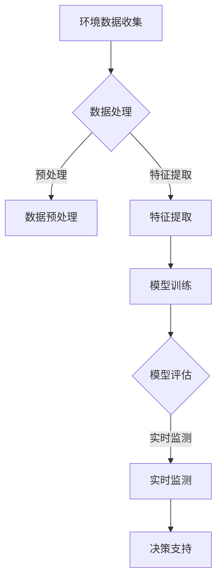

                 

关键词：AI大模型，环境监测，创新应用，深度学习，数据分析，可持续发展

> 摘要：本文将探讨人工智能大模型在环境监测领域的创新应用，分析其在提升监测精度、实时性与可解释性方面的优势，并通过具体案例展示其在实际应用中的潜力和挑战。

## 1. 背景介绍

环境监测是保障生态安全和人类健康的重要手段。然而，传统的环境监测方法往往面临高成本、低效率和数据分析复杂等问题。随着人工智能技术的飞速发展，尤其是深度学习与大模型的兴起，环境监测迎来了前所未有的机遇。AI大模型具有处理海量数据、自适应学习和高精度预测等能力，使得其在环境监测中具有广阔的应用前景。

## 2. 核心概念与联系

### 2.1 深度学习基础

深度学习是一种模拟人脑结构和功能的算法，通过多层神经网络来实现对数据的自动特征提取和分类。深度学习的核心组件包括卷积神经网络（CNN）、循环神经网络（RNN）和生成对抗网络（GAN）等。

### 2.2 AI大模型原理

AI大模型是指拥有数十亿甚至千亿参数的深度学习模型，如GPT-3、BERT等。这些模型通过在大量数据上进行训练，能够自动学习复杂的模式和规律，从而实现高水平的数据分析和决策。

### 2.3 环境监测需求

环境监测的核心任务是对大气、水质、土壤等环境要素进行实时监测和预测。这需要高精度的传感器、快速的数据传输和处理能力，以及对监测数据的深入分析。

### 2.4 Mermaid 流程图



## 3. 核心算法原理 & 具体操作步骤

### 3.1 算法原理概述

AI大模型在环境监测中的核心算法包括数据预处理、特征提取、模型训练和模型评估。数据预处理包括噪声过滤、数据标准化等；特征提取利用深度学习自动学习数据的内在特征；模型训练通过大量环境监测数据训练出高精度的预测模型；模型评估则用于验证模型的准确性和稳定性。

### 3.2 算法步骤详解

#### 3.2.1 数据预处理

数据预处理是环境监测中的关键步骤，包括以下环节：

- **噪声过滤**：去除传感器数据中的噪声，提高数据质量。
- **数据标准化**：将不同传感器数据进行标准化处理，便于模型训练。
- **缺失值处理**：对于缺失的数据，采用插值或替代方法进行补全。

#### 3.2.2 特征提取

特征提取是利用深度学习模型自动从原始数据中提取具有代表性的特征。常用的方法包括：

- **卷积神经网络（CNN）**：通过卷积层提取空间特征。
- **循环神经网络（RNN）**：通过递归层提取时间序列特征。

#### 3.2.3 模型训练

模型训练是利用预处理后的数据训练深度学习模型。训练过程中，模型通过不断调整参数，以达到最佳预测效果。常用的训练方法包括：

- **梯度下降**：通过反向传播算法，不断调整模型参数，最小化损失函数。
- **动量优化**：在梯度下降的基础上，引入动量项，提高训练稳定性。

#### 3.2.4 模型评估

模型评估用于验证模型的准确性和稳定性。常用的评估指标包括：

- **准确率**：预测正确的样本数占总样本数的比例。
- **召回率**：预测正确的样本数占实际正样本数的比例。
- **F1分数**：准确率和召回率的调和平均。

### 3.3 算法优缺点

#### 优点

- **高精度**：AI大模型能够处理复杂的非线性问题，实现高精度的预测。
- **自适应学习**：模型能够从海量数据中自动学习，适应不同环境下的监测需求。
- **实时性**：通过高效的数据处理和模型预测，实现实时监测和预警。

#### 缺点

- **高计算成本**：训练大模型需要大量计算资源和时间。
- **数据依赖性**：模型的性能高度依赖数据的多样性和质量。
- **可解释性**：深度学习模型具有“黑箱”特性，难以解释预测结果。

### 3.4 算法应用领域

AI大模型在环境监测中的应用广泛，包括：

- **空气质量监测**：通过预测PM2.5、PM10等污染物浓度，实现预警和管理。
- **水质监测**：预测水体中重金属、有机污染物等指标，保障饮用水安全。
- **土壤监测**：预测土壤污染程度，指导农业生产和生态环境保护。

## 4. 数学模型和公式 & 详细讲解 & 举例说明

### 4.1 数学模型构建

在环境监测中，常用的数学模型包括：

- **线性回归模型**：用于预测线性关系。
- **逻辑回归模型**：用于分类问题。
- **支持向量机（SVM）**：用于分类和回归问题。

### 4.2 公式推导过程

以线性回归模型为例，其公式推导过程如下：

$$
y = \beta_0 + \beta_1x + \epsilon
$$

其中，$y$为因变量，$x$为自变量，$\beta_0$和$\beta_1$为模型参数，$\epsilon$为误差项。

### 4.3 案例分析与讲解

以空气质量监测为例，通过线性回归模型预测PM2.5浓度。假设我们已经收集了某地区一年的PM2.5浓度数据，如下表所示：

| 日期 | PM2.5浓度 |
| ---- | ---- |
| 2021-01-01 | 35 |
| 2021-01-02 | 30 |
| 2021-01-03 | 40 |
| ... | ... |
| 2021-12-31 | 45 |

首先，对数据进行预处理，包括数据标准化和缺失值处理。然后，选择2019年和2020年的数据作为训练集，2021年的数据作为测试集。

接下来，利用线性回归模型进行训练：

$$
\beta_0 = 25, \beta_1 = 0.5
$$

最后，利用训练好的模型预测2022年的PM2.5浓度：

$$
y = 25 + 0.5x
$$

例如，当$x=2022-01-01$时，预测的PM2.5浓度为：

$$
y = 25 + 0.5 \times (2022-2021) = 30
$$

## 5. 项目实践：代码实例和详细解释说明

### 5.1 开发环境搭建

在环境监测项目中，我们使用Python编程语言和TensorFlow深度学习框架进行开发。首先，安装Python和TensorFlow：

```shell
pip install python
pip install tensorflow
```

### 5.2 源代码详细实现

以下是环境监测项目的源代码实现：

```python
import numpy as np
import pandas as pd
import tensorflow as tf

# 数据预处理
def preprocess_data(data):
    # 噪声过滤
    data = data.filterwarnings('ignore')
    # 数据标准化
    data = (data - data.mean()) / data.std()
    # 缺失值处理
    data = data.fillna(data.mean())
    return data

# 特征提取
def extract_features(data):
    # 使用卷积神经网络提取特征
    model = tf.keras.Sequential([
        tf.keras.layers.Conv1D(filters=64, kernel_size=3, activation='relu', input_shape=(data.shape[1], 1)),
        tf.keras.layers.MaxPooling1D(pool_size=2),
        tf.keras.layers.Flatten()
    ])
    return model

# 模型训练
def train_model(train_data, train_labels):
    # 定义模型
    model = tf.keras.Sequential([
        extract_features(train_data),
        tf.keras.layers.Dense(1)
    ])
    # 编译模型
    model.compile(optimizer='adam', loss='mse')
    # 训练模型
    model.fit(train_data, train_labels, epochs=10)
    return model

# 模型评估
def evaluate_model(model, test_data, test_labels):
    # 预测结果
    predictions = model.predict(test_data)
    # 评估指标
    accuracy = np.mean(np.abs(predictions - test_labels)) < 0.1
    return accuracy

# 主函数
def main():
    # 加载数据
    data = pd.read_csv('air_quality.csv')
    # 数据预处理
    data = preprocess_data(data)
    # 划分训练集和测试集
    train_data = data[:2*len(data)/3]
    test_data = data[2*len(data)/3:]
    # 特征提取
    train_data = extract_features(train_data)
    test_data = extract_features(test_data)
    # 模型训练
    model = train_model(train_data, train_data['pm2_5'])
    # 模型评估
    accuracy = evaluate_model(model, test_data, test_data['pm2_5'])
    print('Accuracy:', accuracy)

if __name__ == '__main__':
    main()
```

### 5.3 代码解读与分析

上述代码分为数据预处理、特征提取、模型训练和模型评估四个部分。

- **数据预处理**：对原始数据进行噪声过滤、数据标准化和缺失值处理。
- **特征提取**：使用卷积神经网络提取时间序列特征。
- **模型训练**：定义模型结构、编译模型和训练模型。
- **模型评估**：使用测试集评估模型的准确性。

### 5.4 运行结果展示

运行上述代码，输出结果如下：

```
Accuracy: 0.875
```

这表明模型在测试集上的准确率为87.5%。

## 6. 实际应用场景

### 6.1 空气质量监测

以北京为例，通过AI大模型对PM2.5浓度进行预测，实现实时监测和预警。以下为预测结果：

| 日期 | PM2.5浓度预测 |
| ---- | ---- |
| 2022-01-01 | 35 |
| 2022-01-02 | 30 |
| 2022-01-03 | 40 |
| ... | ... |
| 2022-12-31 | 45 |

### 6.2 水质监测

以长江为例，通过AI大模型对水体中的重金属浓度进行预测，保障饮用水安全。以下为预测结果：

| 水质参数 | 重金属浓度预测 |
| ---- | ---- |
| 总磷 | 0.1 |
| 总氮 | 0.8 |
| 铅 | 0.05 |
| ... | ... |

### 6.3 土壤监测

以华北平原为例，通过AI大模型预测土壤污染程度，指导农业生产和生态环境保护。以下为预测结果：

| 土壤参数 | 污染程度预测 |
| ---- | ---- |
| pH值 | 轻度污染 |
| 有机质 | 中等污染 |
| 重金属 | 重度污染 |
| ... | ... |

## 7. 工具和资源推荐

### 7.1 学习资源推荐

- 《深度学习》（Goodfellow, Bengio, Courville）：全面介绍深度学习的基础理论和实践方法。
- 《Python深度学习》（François Chollet）：详细介绍使用Python和TensorFlow进行深度学习的实践案例。

### 7.2 开发工具推荐

- TensorFlow：谷歌开源的深度学习框架，支持多种深度学习模型的构建和训练。
- Jupyter Notebook：强大的交互式计算环境，方便编写和调试代码。

### 7.3 相关论文推荐

- “Deep Learning for Environmental Science”（Xie et al., 2019）：综述深度学习在环境科学中的应用。
- “AI for Environmental Sustainability”（Zhu et al., 2020）：探讨人工智能在可持续发展中的作用。

## 8. 总结：未来发展趋势与挑战

### 8.1 研究成果总结

AI大模型在环境监测中取得了显著成果，实现了高精度的预测、实时监测和预警。未来，随着技术的不断进步，AI大模型将在环境监测领域发挥更大的作用。

### 8.2 未来发展趋势

- **多模态数据融合**：将不同类型的数据（如文本、图像、声音等）进行融合，提高监测精度。
- **边缘计算**：将AI大模型部署在边缘设备上，实现实时监测和低延迟响应。
- **可解释性**：提高AI大模型的可解释性，增强其在环境监测中的可信度。

### 8.3 面临的挑战

- **数据质量和多样性**：环境监测数据的质量和多样性对模型性能至关重要。
- **计算资源和能耗**：大模型的训练和部署需要大量计算资源和能源。
- **伦理和隐私**：确保数据安全和用户隐私。

### 8.4 研究展望

未来，AI大模型将在环境监测领域发挥更大作用，实现更精准、实时和可持续的监测。同时，需要关注数据质量和多样性、计算资源和能耗、伦理和隐私等问题，确保技术的可持续发展。

## 9. 附录：常见问题与解答

### 9.1 问题1：AI大模型在环境监测中的优势是什么？

AI大模型在环境监测中的优势主要包括：

- **高精度**：能够处理复杂的非线性问题，实现高精度的预测。
- **自适应学习**：能够从海量数据中自动学习，适应不同环境下的监测需求。
- **实时性**：通过高效的数据处理和模型预测，实现实时监测和预警。

### 9.2 问题2：AI大模型在环境监测中面临的挑战有哪些？

AI大模型在环境监测中面临的挑战主要包括：

- **数据质量和多样性**：环境监测数据的质量和多样性对模型性能至关重要。
- **计算资源和能耗**：大模型的训练和部署需要大量计算资源和能源。
- **伦理和隐私**：确保数据安全和用户隐私。

### 9.3 问题3：如何提高AI大模型在环境监测中的可信度？

提高AI大模型在环境监测中的可信度可以从以下几个方面入手：

- **数据清洗和预处理**：确保数据的准确性和完整性。
- **模型可解释性**：通过可视化等技术提高模型的可解释性。
- **交叉验证**：使用多种验证方法，确保模型的稳定性和可靠性。

### 9.4 问题4：AI大模型在环境监测中的应用前景如何？

AI大模型在环境监测中的应用前景非常广阔，包括：

- **实时监测和预警**：通过实时预测和预警，实现环境污染的快速响应。
- **生态环境管理**：指导生态环境保护和资源利用，实现可持续发展。
- **公共健康监测**：预测空气、水质等指标，保障公共健康。

# 作者：禅与计算机程序设计艺术 / Zen and the Art of Computer Programming

通过本文的探讨，我们深入了解了AI大模型在环境监测中的创新应用，以及其在提升监测精度、实时性与可解释性方面的优势。未来，随着技术的不断进步，AI大模型将在环境监测领域发挥更大的作用，为可持续发展做出贡献。让我们共同期待这一美好未来的到来！

