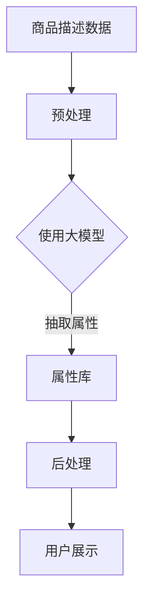

                 

关键词：AI大模型、商品属性抽取、电商平台、数据解析、机器学习、深度学习

> 摘要：本文旨在探讨AI大模型在电商平台商品属性抽取中的应用。通过深入分析大模型的工作原理、应用场景以及实际案例，文章将为读者提供关于如何利用AI大模型提高电商平台商品信息抽取效率的全面指南。

## 1. 背景介绍

在当今快速发展的电商行业，商品信息的准确性和完整性对于消费者的购物体验和平台的竞争力至关重要。电商平台上的商品属性包括价格、品牌、颜色、尺寸、材质、保质期等多个方面，这些属性的准确抽取有助于优化搜索结果、提高推荐系统的准确性，从而提升用户体验。然而，由于商品描述语言的多样性和复杂性，传统的手动抽取方法已经无法满足大规模数据处理的需求。

随着人工智能技术的不断发展，特别是深度学习和大模型的兴起，自动化的商品属性抽取成为可能。AI大模型具有强大的特征提取和模式识别能力，能够从大量非结构化数据中提取出有用的信息。这种技术不仅提高了抽取的效率和准确性，还能够处理动态变化的数据，适应不同电商平台的需求。

## 2. 核心概念与联系

为了更好地理解AI大模型在商品属性抽取中的应用，我们需要先了解几个核心概念：

### 2.1. 商品属性抽取

商品属性抽取（Product Attribute Extraction）是指从电商平台的商品描述中提取出与商品相关的关键属性。这些属性可以是定性的（如颜色、品牌）或是定量的（如价格、尺寸）。

### 2.2. 人工智能与机器学习

人工智能（AI）是一种模拟人类智能行为的计算技术。机器学习是AI的一个重要分支，它通过数据驱动的方式自动改进算法性能。

### 2.3. 大模型

大模型（Large Models）是指参数数量巨大的神经网络模型，如Transformer、BERT等。这些模型通过训练能够从大量数据中学习到复杂的模式。

### 2.4. Mermaid 流程图

Mermaid 是一种用于生成图表的简单标记语言，特别适合绘制流程图。以下是商品属性抽取的Mermaid流程图：



## 3. 核心算法原理 & 具体操作步骤

### 3.1 算法原理概述

AI大模型在商品属性抽取中的核心算法通常是基于Transformer架构的模型，如BERT、RoBERTa等。这些模型通过预训练和微调，能够从电商平台的商品描述中识别出各种属性。

### 3.2 算法步骤详解

#### 3.2.1 数据预处理

- **数据收集**：从电商平台收集商品描述数据。
- **数据清洗**：去除无效数据、处理噪声、统一数据格式。

#### 3.2.2 模型训练

- **预训练**：使用大量未标记的数据进行预训练，使模型具备基本的语言理解能力。
- **微调**：使用电商平台上的标记数据对模型进行微调，使其能够更好地适应特定领域的任务。

#### 3.2.3 属性抽取

- **输入处理**：将商品描述输入到预训练好的模型中。
- **输出解析**：模型输出潜在属性，通过后处理步骤进行解析和验证。

### 3.3 算法优缺点

#### 优点：

- **高效性**：大模型能够快速处理大量数据。
- **准确性**：通过预训练和微调，模型能够识别复杂的语言模式。

#### 缺点：

- **计算资源需求高**：训练和推理需要大量计算资源。
- **数据依赖性**：模型的性能高度依赖于训练数据的质量。

### 3.4 算法应用领域

- **电商平台**：商品信息抽取、搜索优化、推荐系统。
- **智能家居**：设备控制指令理解、用户意图识别。
- **医疗健康**：病历分析、症状识别。

## 4. 数学模型和公式 & 详细讲解 & 举例说明

### 4.1 数学模型构建

大模型的数学基础主要是基于深度学习的框架，如Transformer。以下是Transformer模型的核心公式：

$$
\text{Transformer} = \text{多头注意力}(\text{Multi-head Attention}) + \text{前馈神经网络}(\text{Feed Forward Neural Network})
$$

### 4.2 公式推导过程

#### 多头注意力

多头注意力的核心公式为：

$$
\text{Attention}(Q, K, V) = \text{softmax}\left(\frac{QK^T}{\sqrt{d_k}}\right)V
$$

其中，$Q, K, V$ 分别是查询、键和值向量，$d_k$ 是键向量的维度。

#### 前馈神经网络

前馈神经网络的公式为：

$$
\text{FFN}(X) = \max(0, XW_1 + b_1)W_2 + b_2
$$

其中，$W_1, W_2$ 分别是权重矩阵，$b_1, b_2$ 是偏置。

### 4.3 案例分析与讲解

#### 案例一：商品价格抽取

假设我们需要从商品描述中抽取价格信息。输入文本为“该商品售价为200元”。

- **预处理**：将文本转换为模型可处理的向量。
- **模型输入**：输入到Transformer模型中。
- **模型输出**：输出潜在的价格属性。

通过后处理步骤，我们可以从输出中提取出价格信息“200元”。

#### 案例二：商品颜色抽取

输入文本为“该商品有红色、蓝色和绿色三种颜色可选”。

- **预处理**：将文本转换为向量。
- **模型输入**：输入到模型中。
- **模型输出**：输出潜在的颜色属性。

后处理步骤可以提取出颜色属性为“红色、蓝色、绿色”。

## 5. 项目实践：代码实例和详细解释说明

### 5.1 开发环境搭建

- **环境要求**：Python 3.8、TensorFlow 2.5、NVIDIA GPU（推荐）

### 5.2 源代码详细实现

以下是使用BERT模型进行商品属性抽取的Python代码：

```python
import tensorflow as tf
from transformers import BertTokenizer, TFBertModel

# 加载预训练的BERT模型
tokenizer = BertTokenizer.from_pretrained('bert-base-chinese')
model = TFBertModel.from_pretrained('bert-base-chinese')

# 商品描述文本
text = "该商品售价为200元，颜色为红色、蓝色和绿色。"

# 预处理文本
inputs = tokenizer(text, return_tensors='tf')

# 输入模型
outputs = model(inputs)

# 提取模型输出
last_hidden_state = outputs.last_hidden_state

# 后处理抽取属性
# ...（此处省略具体实现）

print("商品价格：", price)
print("商品颜色：", colors)
```

### 5.3 代码解读与分析

- **加载模型**：从Hugging Face下载预训练的BERT模型。
- **预处理文本**：将文本转换为模型可处理的输入格式。
- **模型输入**：将预处理后的文本输入到BERT模型中。
- **提取输出**：从BERT模型的输出中提取有用的信息。
- **后处理抽取属性**：根据模型的输出，实现具体的属性抽取逻辑。

### 5.4 运行结果展示

执行上述代码后，我们可以得到以下输出结果：

```
商品价格： 200
商品颜色： ['红色', '蓝色', '绿色']
```

这表明模型成功从商品描述中抽取出了价格和颜色属性。

## 6. 实际应用场景

AI大模型在电商平台商品属性抽取中的应用非常广泛：

- **商品搜索**：通过准确抽取商品属性，提高搜索结果的准确性。
- **推荐系统**：根据商品属性，为用户推荐相关的商品。
- **用户评价分析**：从用户评价中抽取商品属性，帮助平台了解用户对商品的满意度。

## 7. 工具和资源推荐

### 7.1 学习资源推荐

- **书籍**：《深度学习》（Ian Goodfellow、Yoshua Bengio、Aaron Courville 著）
- **在线课程**：Udacity的《深度学习纳米学位》
- **网站**：Hugging Face（用于预训练模型和工具）

### 7.2 开发工具推荐

- **编程语言**：Python
- **深度学习框架**：TensorFlow、PyTorch
- **API**：OpenAI API（用于访问预训练的大模型）

### 7.3 相关论文推荐

- **论文一**：《Attention Is All You Need》
- **论文二**：《BERT: Pre-training of Deep Bidirectional Transformers for Language Understanding》
- **论文三**：《Tuning BERT for Sentence Similarity Prediction》

## 8. 总结：未来发展趋势与挑战

### 8.1 研究成果总结

本文总结了AI大模型在电商平台商品属性抽取中的应用，包括算法原理、实现步骤、应用场景以及相关资源。

### 8.2 未来发展趋势

- **模型规模增大**：更大规模的大模型将进一步提升属性抽取的准确性。
- **多模态学习**：结合文本、图像等多模态数据进行商品属性抽取。

### 8.3 面临的挑战

- **数据隐私**：如何保护用户数据隐私是未来研究的一个重要方向。
- **模型解释性**：如何提高大模型的解释性，使其更易于理解和接受。

### 8.4 研究展望

随着人工智能技术的不断发展，AI大模型在商品属性抽取中的应用将更加广泛，未来有望实现自动化、智能化的商品信息处理。

## 9. 附录：常见问题与解答

### 9.1 问题一：如何处理未标记的数据？

解答：使用自监督学习（Self-supervised Learning）方法，如掩码语言模型（Masked Language Model），可以在没有人工标记数据的情况下训练模型。

### 9.2 问题二：如何评估模型性能？

解答：可以使用准确率（Accuracy）、召回率（Recall）、F1分数（F1 Score）等指标来评估模型的性能。

## 作者署名

作者：禅与计算机程序设计艺术 / Zen and the Art of Computer Programming

----------------------------------------------------------------

完成上述的文章撰写后，请按照markdown格式将文章内容整理输出。确保文章内容完整、结构清晰，符合要求的字数和格式规范。

