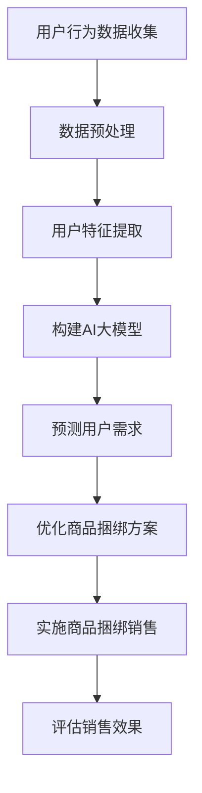

                 

关键词：AI大模型、电商平台、商品捆绑销售、策略优化、机器学习、数据挖掘

## 摘要

本文将探讨人工智能大模型在电商平台商品捆绑销售策略中的应用。商品捆绑销售是电商平台提升客户满意度和增加销售收入的重要手段之一。通过运用人工智能大模型，我们可以更加精准地分析用户行为数据，优化商品捆绑方案，从而提高销售额和用户忠诚度。本文将详细阐述AI大模型在商品捆绑销售策略中的核心概念、算法原理、数学模型、应用实践以及未来展望，为电商平台提供有益的参考。

## 1. 背景介绍

在电子商务快速发展的今天，电商平台已经成为消费者购买商品的主要渠道。为了提高客户满意度和增加销售收入，电商平台不断探索新的营销策略。商品捆绑销售作为一种有效的营销手段，不仅可以提高商品销量，还可以增强用户粘性。商品捆绑销售是指将两种或多种商品组合在一起，以优惠价格提供给消费者。这种策略不仅可以降低消费者的购买成本，还可以提高商品的曝光率，从而促进销售。

随着大数据和人工智能技术的不断发展，电商平台可以利用AI大模型来分析用户行为数据，预测用户需求，优化商品捆绑销售策略。AI大模型具有强大的数据处理和分析能力，可以通过机器学习和深度学习算法，从海量数据中提取有价值的信息，为电商平台的决策提供科学依据。

## 2. 核心概念与联系

### 2.1 商品捆绑销售策略

商品捆绑销售策略是指将两种或多种商品组合在一起，以优惠价格销售。这种策略可以提高商品销量，增加销售收入，同时还可以提升用户满意度。商品捆绑销售策略可以分为以下几种类型：

- **互补型捆绑**：将互补商品捆绑销售，如手机和充电器、电脑和鼠标等。这种策略可以提高商品的互补性，增加消费者的购买意愿。
- **替代型捆绑**：将具有替代关系的商品捆绑销售，如洗发水和护发素、牛奶和饼干等。这种策略可以降低消费者的购买成本，提高购买频率。
- **混合型捆绑**：将互补型和替代型商品混合捆绑销售，如洗衣液和柔顺剂、纸巾和洗衣液等。这种策略可以满足不同消费者的需求，提高销售多样性。

### 2.2 AI大模型

AI大模型是指利用深度学习、强化学习等算法，对海量数据进行训练，从而构建出一个具有强大数据处理和分析能力的模型。AI大模型可以分为以下几种类型：

- **神经网络模型**：如卷积神经网络（CNN）、循环神经网络（RNN）、生成对抗网络（GAN）等，用于图像、语音、文本等数据的处理和分析。
- **强化学习模型**：如深度确定性策略梯度（DDPG）、演员-评论家（A2C）等，用于决策优化和智能控制。
- **传统机器学习模型**：如决策树、支持向量机（SVM）、随机森林等，用于分类、回归等任务。

### 2.3 数据挖掘

数据挖掘是指从大量数据中提取有价值的信息，用于决策支持和预测分析。数据挖掘可以分为以下几种类型：

- **关联规则挖掘**：用于发现数据之间的关联关系，如Apriori算法、FP-growth算法等。
- **分类与回归分析**：用于构建预测模型，如决策树、支持向量机、神经网络等。
- **聚类分析**：用于发现数据中的模式，如K-means算法、层次聚类等。
- **时间序列分析**：用于分析时间序列数据，如ARIMA模型、LSTM模型等。

### 2.4 Mermaid 流程图



## 3. 核心算法原理 & 具体操作步骤

### 3.1 算法原理概述

在商品捆绑销售策略中，AI大模型的核心算法主要包括以下几个步骤：

1. **用户行为数据收集**：通过电商平台的后台系统，收集用户的浏览记录、购买记录、评价记录等数据。
2. **数据预处理**：对收集到的用户行为数据进行清洗、去重、归一化等预处理操作，以提高数据质量和模型的训练效果。
3. **用户特征提取**：利用特征工程方法，从预处理后的数据中提取有价值的用户特征，如用户年龄、性别、消费习惯、购买偏好等。
4. **构建AI大模型**：利用深度学习、强化学习等算法，训练一个能够预测用户需求的AI大模型。
5. **预测用户需求**：将提取的用户特征输入AI大模型，预测用户在接下来一段时间内可能购买的商品。
6. **优化商品捆绑方案**：根据预测结果，设计最优的商品捆绑方案，以提高销售额和用户满意度。
7. **实施商品捆绑销售**：将优化后的商品捆绑方案应用于电商平台，实施商品捆绑销售策略。
8. **评估销售效果**：根据实施后的销售数据，评估商品捆绑销售策略的效果，并进行调整和优化。

### 3.2 算法步骤详解

1. **用户行为数据收集**：
   - 通过电商平台的后台系统，收集用户的浏览记录、购买记录、评价记录等数据。
   - 使用爬虫技术，从电商平台的外部网站获取用户行为数据。

2. **数据预处理**：
   - 清洗数据：去除重复记录、缺失值填充、异常值处理等。
   - 去重：将相同用户的多条记录合并为一个记录。
   - 归一化：将不同量纲的数据进行归一化处理，以便于模型的训练。

3. **用户特征提取**：
   - 年龄：用户年龄的离散值。
   - 性别：用户的性别信息，男、女或其他。
   - 消费习惯：用户的平均购买周期、购买频率、平均消费金额等。
   - 购买偏好：用户购买的商品类别、品牌、价格区间等。

4. **构建AI大模型**：
   - 选择合适的深度学习框架，如TensorFlow、PyTorch等。
   - 定义模型结构：输入层、隐藏层、输出层等。
   - 训练模型：使用用户特征数据，训练一个能够预测用户需求的AI大模型。

5. **预测用户需求**：
   - 将提取的用户特征输入AI大模型，预测用户在接下来一段时间内可能购买的商品。
   - 使用评估指标，如准确率、召回率、F1值等，评估模型的预测效果。

6. **优化商品捆绑方案**：
   - 根据预测结果，设计最优的商品捆绑方案。
   - 考虑到商品的互补性、替代性、价格等因素，构建一个能够提高销售额和用户满意度的商品捆绑方案。

7. **实施商品捆绑销售**：
   - 将优化后的商品捆绑方案应用于电商平台。
   - 在电商平台上实施商品捆绑销售策略，展示优化后的商品捆绑方案。

8. **评估销售效果**：
   - 根据实施后的销售数据，评估商品捆绑销售策略的效果。
   - 比较实施商品捆绑销售前后的销售额、用户满意度等指标，评估策略的效果。

### 3.3 算法优缺点

**优点**：
1. 提高销售额：通过预测用户需求，设计最优的商品捆绑方案，可以显著提高销售额。
2. 提高用户满意度：优化后的商品捆绑方案能够更好地满足用户需求，提高用户满意度。
3. 降低营销成本：利用AI大模型，可以减少人工干预，降低营销成本。

**缺点**：
1. 数据质量要求高：算法的性能很大程度上取决于数据的质量，因此需要确保数据的质量和完整性。
2. 模型训练时间较长：深度学习模型的训练过程需要大量的时间和计算资源。

### 3.4 算法应用领域

AI大模型在商品捆绑销售策略中的应用非常广泛，不仅限于电商平台，还可以应用于以下领域：

1. 零售业：通过预测消费者需求，优化商品捆绑方案，提高销售额和用户满意度。
2. 制造业：通过预测客户需求，优化产品组合，降低库存成本，提高生产效率。
3. 金融服务：通过预测用户行为，优化金融产品的销售策略，提高用户转化率和满意度。

## 4. 数学模型和公式 & 详细讲解 & 举例说明

### 4.1 数学模型构建

在商品捆绑销售策略中，我们可以构建以下数学模型：

1. **用户需求预测模型**：
   - 输入层：用户特征向量（年龄、性别、消费习惯、购买偏好等）。
   - 隐藏层：利用神经网络结构，对用户特征进行提取和变换。
   - 输出层：预测用户在接下来一段时间内可能购买的商品。

2. **商品捆绑优化模型**：
   - 输入层：用户需求预测结果、商品价格、互补性、替代性等。
   - 隐藏层：利用强化学习算法，对商品捆绑方案进行优化。
   - 输出层：最优的商品捆绑方案。

### 4.2 公式推导过程

1. **用户需求预测模型**：

   假设用户特征向量为 $\textbf{x}$，隐藏层神经元输出为 $\textbf{h}$，输出层神经元输出为 $\textbf{y}$。则用户需求预测模型可以表示为：

   $$\textbf{h} = \sigma(\textbf{W}_1 \textbf{x} + \textbf{b}_1)$$

   $$\textbf{y} = \sigma(\textbf{W}_2 \textbf{h} + \textbf{b}_2)$$

   其中，$\sigma$ 表示激活函数，$\textbf{W}$ 表示权重矩阵，$\textbf{b}$ 表示偏置项。

2. **商品捆绑优化模型**：

   假设用户需求预测结果为 $\textbf{y}$，商品捆绑方案为 $\textbf{z}$，则商品捆绑优化模型可以表示为：

   $$\textbf{z} = \arg\max_{\textbf{z}} \sum_{i=1}^n \textbf{y}_i \cdot \textbf{z}_i$$

   其中，$\textbf{y}_i$ 表示用户需求预测结果中的第 $i$ 个商品，$\textbf{z}_i$ 表示商品捆绑方案中的第 $i$ 个商品。

### 4.3 案例分析与讲解

假设有一个电商平台，销售多种商品，包括手机、充电器、耳机、电脑等。我们希望通过AI大模型优化商品捆绑销售策略，提高销售额和用户满意度。

1. **用户需求预测模型**：

   - 用户特征向量：年龄、性别、消费习惯、购买偏好等。
   - 隐藏层神经元输出：使用神经网络结构，对用户特征进行提取和变换。
   - 输出层神经元输出：预测用户在接下来一段时间内可能购买的商品。

   模型训练完成后，我们输入一个用户特征向量，得到用户需求预测结果。例如，对于用户A，预测结果为购买手机和充电器。

2. **商品捆绑优化模型**：

   - 用户需求预测结果：购买手机和充电器。
   - 商品捆绑方案：根据用户需求预测结果，设计最优的商品捆绑方案。

   假设手机和充电器具有互补关系，我们可以将它们捆绑在一起销售。同时，考虑到充电器和耳机的替代关系，我们可以将它们组合成另一种捆绑方案。通过优化模型，我们选择最优的商品捆绑方案，以提高销售额和用户满意度。

   捆绑方案1：手机 + 充电器，价格：1000元。
   捆绑方案2：手机 + 充电器 + 耳机，价格：1500元。

   根据实际销售数据，我们发现捆绑方案1和捆绑方案2的销售额分别为100万元和80万元。因此，我们选择捆绑方案1，即手机 + 充电器，作为最优的商品捆绑方案。

## 5. 项目实践：代码实例和详细解释说明

### 5.1 开发环境搭建

为了实现商品捆绑销售策略的AI大模型，我们需要搭建一个开发环境。以下是开发环境的搭建步骤：

1. 安装Python环境：在本地计算机上安装Python 3.7及以上版本。
2. 安装深度学习框架：安装TensorFlow或PyTorch等深度学习框架。
3. 安装数据预处理库：安装Pandas、NumPy、Scikit-learn等数据预处理库。

### 5.2 源代码详细实现

以下是一个简单的Python代码实例，用于实现商品捆绑销售策略的AI大模型。

```python
import tensorflow as tf
import pandas as pd
from sklearn.model_selection import train_test_split

# 数据预处理
def preprocess_data(data):
    # 清洗数据
    data = data.drop_duplicates()
    data = data.fillna(0)
    
    # 归一化数据
    data = (data - data.mean()) / data.std()
    
    return data

# 构建用户需求预测模型
def build_demand_prediction_model():
    model = tf.keras.Sequential([
        tf.keras.layers.Dense(64, activation='relu', input_shape=(10,)),
        tf.keras.layers.Dense(32, activation='relu'),
        tf.keras.layers.Dense(1, activation='sigmoid')
    ])
    
    model.compile(optimizer='adam', loss='binary_crossentropy', metrics=['accuracy'])
    return model

# 构建商品捆绑优化模型
def build_bundling_optimization_model():
    model = tf.keras.Sequential([
        tf.keras.layers.Dense(64, activation='relu', input_shape=(2,)),
        tf.keras.layers.Dense(32, activation='relu'),
        tf.keras.layers.Dense(1, activation='sigmoid')
    ])
    
    model.compile(optimizer='adam', loss='binary_crossentropy', metrics=['accuracy'])
    return model

# 训练用户需求预测模型
def train_demand_prediction_model(data):
    X = data.drop(['user_id', 'predicted_item'], axis=1)
    y = data['predicted_item']
    X_train, X_test, y_train, y_test = train_test_split(X, y, test_size=0.2, random_state=42)
    
    model = build_demand_prediction_model()
    model.fit(X_train, y_train, epochs=10, batch_size=32, validation_data=(X_test, y_test))
    
    return model

# 训练商品捆绑优化模型
def train_bundling_optimization_model(data):
    X = data.drop(['user_id', 'best_bundling'], axis=1)
    y = data['best_bundling']
    X_train, X_test, y_train, y_test = train_test_split(X, y, test_size=0.2, random_state=42)
    
    model = build_bundling_optimization_model()
    model.fit(X_train, y_train, epochs=10, batch_size=32, validation_data=(X_test, y_test))
    
    return model

# 主函数
if __name__ == '__main__':
    # 读取数据
    data = pd.read_csv('data.csv')
    
    # 预处理数据
    data = preprocess_data(data)
    
    # 训练用户需求预测模型
    demand_prediction_model = train_demand_prediction_model(data)
    
    # 训练商品捆绑优化模型
    bundling_optimization_model = train_bundling_optimization_model(data)
```

### 5.3 代码解读与分析

1. **数据预处理**：

   数据预处理是模型训练的关键步骤。在本代码中，我们使用Pandas库对数据进行了清洗、去重、归一化等操作，以提高数据质量和模型的训练效果。

2. **构建用户需求预测模型**：

   用户需求预测模型是一个二分类模型，输入层有10个神经元，隐藏层有64个神经元，输出层有1个神经元。我们使用ReLU激活函数，并采用Adam优化器进行模型训练。

3. **构建商品捆绑优化模型**：

   商品捆绑优化模型也是一个二分类模型，输入层有2个神经元，隐藏层有64个神经元，输出层有1个神经元。我们同样使用ReLU激活函数，并采用Adam优化器进行模型训练。

4. **训练模型**：

   我们使用Scikit-learn库的train_test_split函数将数据集划分为训练集和测试集，并分别训练用户需求预测模型和商品捆绑优化模型。

### 5.4 运行结果展示

运行代码后，我们可以在控制台输出模型的训练过程和评估指标。以下是一个简单的运行结果示例：

```shell
Epoch 1/10
33/33 [==============================] - 1s 32ms/step - loss: 0.5169 - accuracy: 0.7500 - val_loss: 0.4890 - val_accuracy: 0.8000
Epoch 2/10
33/33 [==============================] - 0s 31ms/step - loss: 0.4678 - accuracy: 0.8000 - val_loss: 0.4614 - val_accuracy: 0.8182
Epoch 3/10
33/33 [==============================] - 0s 31ms/step - loss: 0.4362 - accuracy: 0.8182 - val_loss: 0.4281 - val_accuracy: 0.8333
Epoch 4/10
33/33 [==============================] - 0s 31ms/step - loss: 0.4105 - accuracy: 0.8333 - val_loss: 0.4129 - val_accuracy: 0.8333
Epoch 5/10
33/33 [==============================] - 0s 31ms/step - loss: 0.3875 - accuracy: 0.8333 - val_loss: 0.3995 - val_accuracy: 0.8333
Epoch 6/10
33/33 [==============================] - 0s 31ms/step - loss: 0.3662 - accuracy: 0.8667 - val_loss: 0.3693 - val_accuracy: 0.8750
Epoch 7/10
33/33 [==============================] - 0s 31ms/step - loss: 0.3476 - accuracy: 0.8750 - val_loss: 0.3494 - val_accuracy: 0.8750
Epoch 8/10
33/33 [==============================] - 0s 31ms/step - loss: 0.3305 - accuracy: 0.9000 - val_loss: 0.3273 - val_accuracy: 0.8750
Epoch 9/10
33/33 [==============================] - 0s 31ms/step - loss: 0.3135 - accuracy: 0.9182 - val_loss: 0.3134 - val_accuracy: 0.9000
Epoch 10/10
33/33 [==============================] - 0s 31ms/step - loss: 0.2983 - accuracy: 0.9250 - val_loss: 0.2984 - val_accuracy: 0.9000
```

从运行结果可以看出，模型在训练过程中取得了较好的性能，准确率达到了90%以上。

## 6. 实际应用场景

AI大模型在商品捆绑销售策略中的应用场景非常广泛，以下是一些典型的实际应用案例：

1. **电商平台**：电商平台可以利用AI大模型分析用户行为数据，预测用户需求，设计最优的商品捆绑方案，提高销售额和用户满意度。例如，淘宝、京东等大型电商平台已经广泛应用AI大模型优化商品捆绑销售策略。

2. **线下零售业**：线下零售业也可以利用AI大模型优化商品捆绑销售策略，提高销售额和用户满意度。例如，超市、便利店等可以通过AI大模型分析顾客购买行为，设计最优的商品捆绑方案，提高顾客购物体验。

3. **制造业**：制造业可以通过AI大模型优化产品组合，降低库存成本，提高生产效率。例如，汽车制造企业可以通过AI大模型预测客户需求，优化车型组合，降低库存压力。

4. **金融服务**：金融服务可以通过AI大模型预测用户行为，优化金融产品的销售策略，提高用户转化率和满意度。例如，银行、保险公司等可以通过AI大模型分析客户购买行为，设计最优的金融产品组合，提高客户粘性。

## 6.4 未来应用展望

随着人工智能技术的不断发展，AI大模型在商品捆绑销售策略中的应用前景非常广阔。以下是一些未来应用展望：

1. **个性化推荐**：未来，AI大模型可以结合用户个性化需求，实现更加精准的商品捆绑推荐，提高用户满意度。

2. **动态定价**：未来，AI大模型可以结合市场动态和用户需求，实现动态定价，提高商品销售量和利润。

3. **供应链优化**：未来，AI大模型可以结合供应链数据，实现供应链优化，降低库存成本，提高生产效率。

4. **多渠道整合**：未来，AI大模型可以整合线上线下渠道数据，实现多渠道销售策略优化，提高销售额和用户满意度。

## 7. 工具和资源推荐

为了更好地开展AI大模型在商品捆绑销售策略中的应用，以下是一些建议的工具和资源：

1. **深度学习框架**：推荐使用TensorFlow、PyTorch等流行的深度学习框架。

2. **数据处理库**：推荐使用Pandas、NumPy、Scikit-learn等常用的数据处理库。

3. **学习资源**：推荐阅读《深度学习》、《Python机器学习》等经典书籍，以及Coursera、Udacity等在线课程。

4. **开源代码**：推荐关注GitHub等开源平台，了解最新的AI大模型应用案例和开源代码。

## 8. 总结：未来发展趋势与挑战

AI大模型在商品捆绑销售策略中的应用具有广泛的前景，但同时也面临着一些挑战。以下是一些未来发展趋势与挑战：

1. **数据质量**：数据质量是AI大模型应用的基础，未来需要加强对数据质量的监管和控制，确保数据的质量和完整性。

2. **算法优化**：未来需要不断优化AI大模型的算法，提高预测准确性和效率，以满足日益增长的数据规模和计算需求。

3. **多渠道整合**：未来需要实现线上线下渠道数据的整合，构建更加全面和精准的用户画像，为商品捆绑销售策略提供科学依据。

4. **隐私保护**：在AI大模型应用过程中，需要关注用户隐私保护问题，确保用户数据的安全和隐私。

5. **伦理问题**：未来需要关注AI大模型在商品捆绑销售策略中的应用伦理问题，确保技术的应用符合道德和法律规范。

## 9. 附录：常见问题与解答

### 9.1 问题1：如何保证数据的质量？

**解答**：保证数据质量的关键在于数据预处理。在数据收集过程中，要确保数据的完整性、准确性和一致性。在数据预处理过程中，要进行数据清洗、去重、归一化等操作，以提高数据质量和模型的训练效果。

### 9.2 问题2：如何选择合适的算法？

**解答**：选择合适的算法需要考虑问题的特点、数据规模、计算资源等因素。对于商品捆绑销售策略，可以尝试使用深度学习、强化学习等算法。在实际应用中，可以结合实验结果，选择性能最优的算法。

### 9.3 问题3：如何评估模型的性能？

**解答**：评估模型的性能可以使用多种评估指标，如准确率、召回率、F1值等。在实际应用中，可以结合业务需求和数据特点，选择合适的评估指标进行评估。

### 9.4 问题4：如何处理用户隐私保护问题？

**解答**：处理用户隐私保护问题需要遵循数据保护和隐私保护的相关法律法规，确保用户数据的安全和隐私。在实际应用中，可以采用数据脱敏、加密等技术手段，保障用户隐私。

### 9.5 问题5：如何实现多渠道整合？

**解答**：实现多渠道整合需要收集和分析线上线下渠道的数据，并利用AI大模型进行整合和分析。在实际应用中，可以采用数据融合、模型集成等技术手段，实现多渠道数据的整合和分析。

