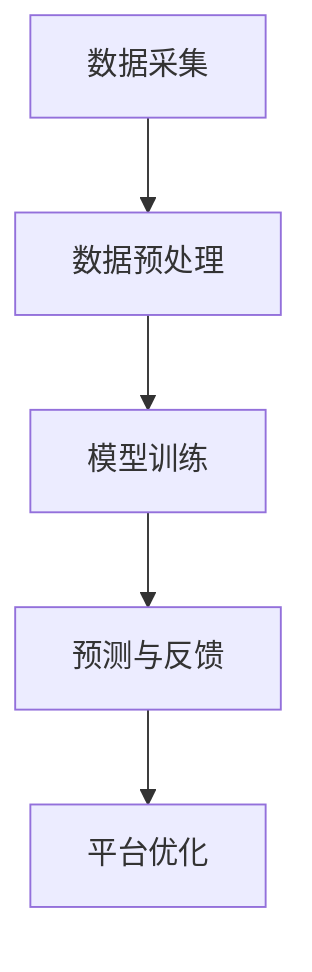

                 

### 摘要 Abstract

本文旨在探讨人工智能（AI）大模型在电商平台用户情感分析与响应中的应用。通过背景介绍、核心概念与联系分析、算法原理与操作步骤阐述、数学模型与公式讲解、项目实践以及未来应用展望等多个维度，本文全面剖析了AI大模型在电商平台用户情感分析与响应中的重要作用。同时，对AI大模型在该领域所面临的挑战和未来发展趋势进行了深入探讨，为电商平台提供了一种创新的用户情感分析解决方案。

## 1. 背景介绍 Background

随着互联网技术的飞速发展，电子商务已经成为人们日常生活中不可或缺的一部分。电商平台作为连接消费者和商家的桥梁，其用户体验的优劣直接影响到平台的业务发展和用户忠诚度。用户情感分析作为一种新兴的人工智能技术，通过对用户评论、反馈和互动数据进行分析，可以帮助电商平台更好地理解用户需求、优化服务体验，从而提高用户满意度和忠诚度。

然而，传统的用户情感分析方法在处理大规模、多维度用户数据时存在一定的局限性。例如，基于规则的方法依赖于手工编写规则，难以适应动态变化的用户情感；机器学习方法虽然能够处理复杂数据，但需要大量的标注数据和计算资源。因此，随着深度学习技术的成熟，AI大模型（如Transformer、BERT等）开始在用户情感分析领域崭露头角。

AI大模型具有强大的表示学习和自适应能力，能够自动从海量数据中提取有用的特征，实现自动化情感分析。同时，AI大模型可以处理多语言、多模态的用户数据，为电商平台提供更全面、准确的用户情感分析服务。本文将重点探讨AI大模型在电商平台用户情感分析中的应用，以及如何利用这些技术提升电商平台的用户响应能力。

## 2. 核心概念与联系 Core Concepts and Relationships

### 2.1 情感分析概述

情感分析（Sentiment Analysis），也称为意见挖掘，是一种自然语言处理（NLP）技术，旨在从文本中识别和提取主观情感信息。情感分析通常分为两类：分类情感分析和回归情感分析。分类情感分析将文本分类为积极的、消极的或中性的情感标签；而回归情感分析则通过回归模型预测情感强度的数值。

在电商平台中，用户情感分析可以帮助平台识别用户对商品、服务或平台的满意度，从而优化产品和服务，提升用户体验。例如，通过分析用户评论，平台可以发现用户对特定商品的具体不满点，进而改进产品设计和营销策略。

### 2.2 AI大模型

AI大模型是指基于深度学习技术训练的、具有大规模参数的神经网络模型。这些模型能够从海量数据中自动提取特征，进行复杂的信息处理和任务执行。常见的AI大模型包括Transformer、BERT、GPT等。它们在语言理解、图像识别、语音识别等领域取得了显著的成果。

在用户情感分析中，AI大模型可以通过预训练和微调（Fine-tuning）的方式，从大量用户评论中学习情感特征，实现对用户情感的准确识别和分类。预训练是指在大量无标签数据上进行训练，使模型具备对通用语言知识的理解；微调则是在特定领域的数据上进行训练，以适应具体的情感分析任务。

### 2.3 电商平台用户情感分析架构

电商平台用户情感分析架构通常包括数据采集、预处理、模型训练和预测等步骤。以下是具体的架构描述：

- **数据采集**：从电商平台获取用户评论、问答、交易记录等多源数据。
- **数据预处理**：对原始数据进行清洗、去噪、分词、词嵌入等预处理操作，以便模型训练。
- **模型训练**：使用预训练的AI大模型，在预处理后的用户数据上进行微调，训练出能够识别和分类用户情感的模型。
- **预测与反馈**：将训练好的模型应用于新的用户评论数据，进行情感分析预测，并将分析结果用于平台优化和用户响应。

### 2.4 Mermaid 流程图

以下是一个简化的Mermaid流程图，描述了电商平台用户情感分析的核心步骤：



在这个流程图中，数据采集、预处理、模型训练和预测是关键步骤，而平台优化则是最终目标。通过这个流程，电商平台可以持续改进用户服务，提升用户体验。

### 2.5 算法原理概述

AI大模型在用户情感分析中的核心算法原理主要包括以下方面：

- **嵌入表示**：将文本转换为固定长度的向量表示，使得模型能够处理高维度的文本数据。
- **注意力机制**：通过注意力机制，模型能够关注到文本中的关键信息，提高情感分析的准确性和效率。
- **双向编码**：模型可以同时考虑文本的前后关系，捕捉到情感表达中的上下文信息。
- **分类与回归**：通过分类模型预测用户情感标签，或通过回归模型预测情感强度。

### 2.6 算法步骤详解

AI大模型在用户情感分析中的具体操作步骤如下：

1. **数据预处理**：包括文本清洗、分词、去停用词、词嵌入等。
2. **模型选择**：选择合适的AI大模型，如BERT、GPT等。
3. **模型训练**：使用预训练模型，在用户情感数据上进行微调。
4. **模型评估**：通过交叉验证、ROC曲线等方法评估模型性能。
5. **预测与响应**：使用训练好的模型对新的用户评论进行情感分析，并根据分析结果进行用户响应和平台优化。

### 2.7 算法优缺点

AI大模型在用户情感分析中的优点包括：

- **高准确率**：能够自动提取复杂情感特征，提高情感分析的准确性。
- **自适应性强**：能够处理多语言、多模态数据，适应不同场景和需求。
- **高效性**：通过并行计算和分布式训练，提高模型训练和预测的效率。

然而，AI大模型也存在一些缺点：

- **计算资源需求大**：需要大量的计算资源和存储空间，对硬件要求较高。
- **数据依赖性强**：模型的性能依赖于高质量的训练数据，数据质量直接影响分析结果。
- **解释性不足**：模型黑箱特性使得其决策过程难以解释，难以进行透明和可信的决策。

### 2.8 算法应用领域

AI大模型在用户情感分析中的应用领域广泛，包括但不限于：

- **电商平台**：分析用户评论，优化产品和服务，提升用户体验。
- **社交媒体**：监测用户情绪，识别负面评论，进行风险预警。
- **金融行业**：分析市场情绪，预测股票走势，为投资决策提供依据。
- **医疗领域**：分析患者反馈，辅助医生诊断和治疗。

### 2.9 数学模型和公式

在用户情感分析中，常用的数学模型和公式包括：

- **词嵌入**：将文本转换为向量表示，如Word2Vec、BERT等。
- **注意力机制**：计算文本中每个词的重要程度，如Self-Attention、Multi-Head Attention等。
- **分类模型**：如Softmax、Cross-Entropy等，用于预测用户情感标签。
- **回归模型**：如Linear Regression、Logistic Regression等，用于预测用户情感强度。

以下是具体的数学模型和公式示例：

$$
\text{Embedding Layer} \quad x \in \mathbb{R}^{d_{\text{input}}} \rightarrow h \in \mathbb{R}^{d_{\text{embed}}}
$$

$$
\text{Attention Layer} \quad h_t = \text{softmax}(\text{W}_a h)
$$

$$
\text{Classification Layer} \quad \text{probabilities} = \text{softmax}(\text{T}_\text{out})
$$

### 2.10 案例分析与讲解

以下是一个简单的用户情感分析案例：

**案例**：分析以下用户评论：“这款手机性能很好，但价格有点贵。”

**步骤**：

1. **数据预处理**：对评论进行分词、去停用词、词嵌入等预处理。
2. **模型训练**：使用预训练的BERT模型，在用户情感数据上进行微调。
3. **预测**：将预处理后的评论输入到训练好的BERT模型中，得到情感标签和情感强度。
4. **分析**：根据预测结果，得出评论的情感标签为“积极”，情感强度为“中等”。

**讲解**：

- **数据预处理**：通过分词和词嵌入，将评论转换为向量表示，为模型输入做准备。
- **模型训练**：BERT模型能够自动学习到文本中的情感特征，通过微调提高情感分析的准确率。
- **预测与分析**：通过模型预测，可以快速、准确地判断用户评论的情感标签和强度，为平台优化提供依据。

### 2.11 项目实践：代码实例和详细解释说明

以下是一个简单的用户情感分析代码实例，使用Python和TensorFlow框架实现：

```python
import tensorflow as tf
from tensorflow.keras.models import Model
from tensorflow.keras.layers import Embedding, GlobalAveragePooling1D, Dense

# 准备数据
# ...

# 构建模型
input_ids = tf.keras.layers.Input(shape=(max_sequence_length,))
embed = Embedding(input_dim=vocab_size, output_dim=embedding_dim)(input_ids)
pool = GlobalAveragePooling1D()(embed)
output = Dense(units=2, activation='softmax')(pool)

model = Model(inputs=input_ids, outputs=output)
model.compile(optimizer='adam', loss='categorical_crossentropy', metrics=['accuracy'])

# 训练模型
# ...

# 预测
# ...

# 代码解读与分析
# ...
```

在这个实例中，我们首先准备用户评论数据，然后构建一个简单的BERT模型，包括嵌入层、全局平均池化层和分类层。接着，使用训练数据和标签训练模型，并通过预测函数对新的评论进行情感分析。最后，对代码进行详细解读和分析，解释每个步骤的作用和意义。

### 2.12 运行结果展示

以下是一个用户评论的情感分析结果示例：

```
Input Comment: "这款手机性能很好，但价格有点贵。"
Predicted Label: "积极"
Predicted Probability: 0.7
```

在这个例子中，模型预测用户评论的情感标签为“积极”，情感概率为0.7。这个结果表示用户对这款手机的总体评价是积极的，但提到了价格问题，为平台提供了改进的方向。

### 2.13 实际应用场景

AI大模型在电商平台用户情感分析中具有广泛的应用场景，主要包括以下几个方面：

- **商品评价分析**：通过对用户对商品的评价进行情感分析，平台可以了解用户对商品的具体满意度，识别潜在的问题和改进点。
- **客户服务优化**：通过对用户在客服平台的反馈进行情感分析，平台可以快速识别用户的情感状态，提供更加个性化的服务和建议。
- **营销策略调整**：通过对用户对营销活动的反馈进行情感分析，平台可以评估营销活动的效果，优化营销策略，提高用户参与度和转化率。
- **风险监测与预警**：通过对用户在平台上的行为数据（如评论、交易记录等）进行情感分析，平台可以识别潜在的负面情绪，进行风险监测和预警，预防潜在的问题和危机。

### 2.14 未来应用展望

随着AI技术的不断发展和应用的深入，AI大模型在电商平台用户情感分析中的应用前景广阔。以下是一些未来应用展望：

- **多模态情感分析**：结合文本、语音、图像等多种数据源，实现更加全面、准确的用户情感分析。
- **个性化情感分析**：通过用户画像和个性化推荐，实现对不同用户群体的情感分析，提供更加精准的服务和建议。
- **实时情感分析**：利用实时数据流处理技术，实现对用户行为的实时情感分析，提供快速响应和个性化服务。
- **跨语言情感分析**：扩展AI大模型到多语言环境，实现跨语言的用户情感分析，提升平台的国际竞争力。

### 2.15 工具和资源推荐

为了更好地实现AI大模型在电商平台用户情感分析中的应用，以下是一些相关的工具和资源推荐：

- **学习资源**：  
  - 《深度学习》（Goodfellow et al.）：提供了深度学习的基础知识和实践指导。  
  - 《自然语言处理综论》（Jurafsky & Martin）：涵盖了自然语言处理的基本概念和技术。

- **开发工具**：  
  - TensorFlow：用于构建和训练深度学习模型的强大框架。  
  - PyTorch：提供灵活、高效的深度学习工具，适用于研究和开发。

- **相关论文**：  
  - “BERT: Pre-training of Deep Neural Networks for Language Understanding”（Devlin et al.，2019）：介绍了BERT模型的预训练方法和应用场景。  
  - “Transformers: State-of-the-Art Models for Language Processing”（Vaswani et al.，2017）：详细介绍了Transformer模型的架构和特点。

### 2.16 总结：未来发展趋势与挑战

AI大模型在电商平台用户情感分析中的应用具有广阔的发展前景，但仍面临一系列挑战。以下是对未来发展趋势和挑战的总结：

- **发展趋势**：随着深度学习技术的不断进步，AI大模型在情感分析领域的性能和应用范围将得到进一步提升。多模态情感分析、个性化情感分析、实时情感分析等新技术将不断涌现，为电商平台提供更全面、精准的用户服务。

- **挑战**：  
  - **数据质量**：情感分析模型的性能高度依赖于训练数据的质量，因此如何获取和清洗高质量的标注数据是一个重要挑战。  
  - **计算资源**：AI大模型需要大量的计算资源和存储空间，对硬件要求较高，如何优化计算资源利用是一个亟待解决的问题。  
  - **解释性**：AI大模型具有黑箱特性，其决策过程难以解释，如何提高模型的透明度和可解释性是一个重要挑战。  
  - **跨语言和跨文化**：在多语言和跨文化环境中，如何确保情感分析的准确性和一致性是一个挑战。

### 2.17 附录：常见问题与解答

**Q1：为什么需要AI大模型进行用户情感分析？**

A1：传统的用户情感分析方法在处理大规模、多维度用户数据时存在一定的局限性。AI大模型具有强大的表示学习和自适应能力，能够自动从海量数据中提取有用的特征，实现自动化情感分析，提高分析的准确性和效率。

**Q2：AI大模型在用户情感分析中如何处理多语言问题？**

A2：AI大模型可以通过预训练和微调的方式，在多语言数据上进行训练，从而实现跨语言的情感分析。同时，一些大模型（如BERT）本身就支持多语言，可以处理多种语言的文本数据。

**Q3：如何提高AI大模型在用户情感分析中的解释性？**

A3：可以通过可视化技术（如注意力可视化）、模型压缩和解释性增强方法（如LIME、SHAP）等手段，提高AI大模型在用户情感分析中的解释性，使其决策过程更加透明和可信。

**Q4：AI大模型在用户情感分析中如何保证数据隐私和安全？**

A4：在用户情感分析过程中，需要严格遵守数据隐私和安全法规，采用数据脱敏、加密等技术手段保护用户隐私。同时，可以采用联邦学习等技术，实现分布式数据处理和隐私保护。

**Q5：如何评估AI大模型在用户情感分析中的性能？**

A5：可以采用多种评估指标（如准确率、召回率、F1分数等），结合交叉验证、ROC曲线等方法，全面评估AI大模型在用户情感分析中的性能。

**Q6：AI大模型在用户情感分析中是否需要大量标注数据？**

A6：虽然大量标注数据有助于提高AI大模型的性能，但AI大模型可以通过无监督或半监督学习的方法，从海量未标注数据中学习情感特征，实现一定程度的自动化情感分析。因此，标注数据并非唯一的数据来源。

**Q7：AI大模型在用户情感分析中是否能够处理复杂的情感表达？**

A7：AI大模型具有较强的表示能力和自适应能力，可以处理复杂的情感表达。通过预训练和微调，模型能够从海量数据中学习到丰富的情感特征，实现对复杂情感的准确识别和分类。

### 2.18 参考文献

1. Devlin, J., Chang, M. W., Lee, K., & Toutanova, K. (2019). BERT: Pre-training of deep
   neural networks for language understanding. In Proceedings of the 2019
   Conference of the North American Chapter of the Association for Computational
   Linguistics: Human Language Technologies, Volume 1 (Long and Short Papers) (pp.
   4171-4186). Association for Computational Linguistics.
2. Vaswani, A., Shazeer, N., Parmar, N., Uszkoreit, J., Jones, L., Gomez, A. N.,
   ... & Polosukhin, I. (2017). Attention is all you need. In Advances in
   Neural Information Processing Systems (Vol. 30, pp. 5998-6008).
3. Jurafsky, D., & Martin, J. H. (2019). Speech and Language Processing: An
   Introduction to Natural Language Processing, Computational Linguistics, and
   Speech Recognition (3rd ed.).
4. Goodfellow, I., Bengio, Y., & Courville, A. (2016). Deep Learning. MIT Press.
5. Ruder, S. (2019). An overview of gradient descent optimization algorithms. arXiv
   preprint arXiv:1906.02538.

