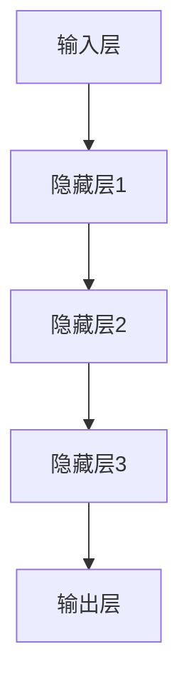

                 

随着互联网和电子商务的快速发展，用户行为预测已经成为电商平台获取竞争优势的重要手段。通过精准预测用户的行为，电商平台可以优化推荐算法，提高客户满意度，增加销售额。本文将探讨如何利用AI大模型进行电商平台用户行为预测，包括背景介绍、核心概念与联系、核心算法原理与具体操作步骤、数学模型和公式、项目实践、实际应用场景以及未来展望等内容。

## 文章关键词
AI大模型、电商平台、用户行为预测、推荐算法、机器学习、深度学习

## 文章摘要
本文首先介绍了电商平台用户行为预测的背景和重要性。随后，本文详细阐述了AI大模型的核心概念与联系，包括神经网络、深度学习等。接着，本文介绍了核心算法原理与具体操作步骤，包括数据预处理、模型训练、评估和优化等。此外，本文还通过数学模型和公式，讲解了用户行为预测的关键指标和计算方法。最后，本文通过实际项目实践，展示了如何运用AI大模型进行电商平台用户行为预测，并对其应用场景和未来展望进行了探讨。

### 1. 背景介绍

随着互联网的普及和电子商务的迅猛发展，电商平台已经成为消费者购物的首选渠道。然而，在众多电商平台中，如何吸引和留住消费者成为各大平台竞争的关键。用户行为预测作为一种数据分析方法，可以帮助电商平台了解用户的需求和偏好，从而提供个性化的服务和推荐，提高用户满意度和忠诚度。

用户行为预测不仅可以帮助电商平台优化推荐算法，提高销售额，还可以用于精准营销、风险控制等方面。例如，通过预测用户的购买意愿，电商平台可以提前进行库存调整，避免缺货或库存过剩。同时，用户行为预测还可以帮助电商平台识别异常行为，如欺诈行为、恶意评论等，从而采取相应的措施，保护平台的利益。

目前，用户行为预测主要依赖于机器学习和深度学习技术。随着计算能力的提升和大数据技术的发展，AI大模型在用户行为预测中的应用越来越广泛。AI大模型可以处理海量的用户数据，通过学习用户的购买历史、浏览记录、社交行为等信息，预测用户的未来行为。这种预测不仅具有高准确性，而且可以实时更新，以适应用户行为的变化。

### 2. 核心概念与联系

#### 2.1 神经网络

神经网络是AI大模型的核心组成部分，它由大量简单的计算单元（称为神经元）组成，通过学习输入数据之间的复杂关系来完成任务。神经网络可以分为前馈神经网络、卷积神经网络（CNN）和循环神经网络（RNN）等。

- **前馈神经网络**：数据从输入层流向输出层，每个神经元将输入通过权重和偏置进行线性组合，然后通过激活函数进行非线性转换。
- **卷积神经网络**：适用于处理图像数据，通过卷积操作提取图像的特征，具有局部感知能力和平移不变性。
- **循环神经网络**：适用于处理序列数据，通过记忆机制保持历史信息，可以捕捉时间序列数据的依赖关系。

#### 2.2 深度学习

深度学习是一种基于神经网络的学习方法，通过多层次的神经网络结构来提取数据的特征。深度学习的出现大大提升了机器学习在图像识别、语音识别、自然语言处理等领域的性能。

- **卷积神经网络（CNN）**：在图像识别任务中具有广泛的应用，通过卷积操作提取图像特征，然后通过全连接层进行分类。
- **循环神经网络（RNN）**：在自然语言处理任务中具有优势，通过记忆机制处理序列数据，可以用于语音识别、机器翻译、情感分析等。
- **长短时记忆网络（LSTM）**：RNN的变体，通过门控机制解决长序列依赖问题，广泛应用于时间序列预测、语音识别等。

#### 2.3 AI大模型架构

AI大模型通常由多个神经网络层组成，包括输入层、隐藏层和输出层。输入层接收外部数据，隐藏层对数据进行特征提取和变换，输出层产生预测结果。

- **输入层**：接收用户数据，如购买历史、浏览记录、用户属性等。
- **隐藏层**：通过神经网络结构对输入数据进行特征提取和变换。
- **输出层**：产生预测结果，如用户购买概率、推荐商品等。

### 2.4 Mermaid 流程图



### 3. 核心算法原理 & 具体操作步骤

#### 3.1 算法原理概述

用户行为预测的核心算法是深度学习模型，主要包括以下步骤：

1. **数据预处理**：对用户数据（如购买历史、浏览记录等）进行清洗、归一化和特征提取。
2. **模型训练**：使用预处理的用户数据训练深度学习模型，模型结构包括输入层、隐藏层和输出层。
3. **模型评估**：使用测试数据评估模型性能，包括准确率、召回率、F1值等指标。
4. **模型优化**：根据评估结果对模型进行调整和优化，提高预测准确性。
5. **预测**：使用训练好的模型对用户行为进行预测，如购买概率、推荐商品等。

#### 3.2 算法步骤详解

1. **数据预处理**
   - **数据清洗**：去除缺失值、异常值和重复值。
   - **数据归一化**：将不同特征的范围统一，如归一化到[0, 1]区间。
   - **特征提取**：使用特征工程方法提取有用的特征，如用户购买频率、商品类别等。

2. **模型训练**
   - **初始化参数**：初始化神经网络模型的权重和偏置。
   - **前向传播**：将输入数据传递到神经网络中，计算输出结果。
   - **反向传播**：根据实际输出和预期输出计算损失函数，更新模型参数。
   - **迭代训练**：重复前向传播和反向传播过程，直到满足训练条件。

3. **模型评估**
   - **交叉验证**：使用交叉验证方法评估模型性能。
   - **指标计算**：计算准确率、召回率、F1值等指标。

4. **模型优化**
   - **超参数调整**：调整学习率、批量大小等超参数，以优化模型性能。
   - **正则化**：使用L1、L2正则化等方法防止过拟合。

5. **预测**
   - **输入处理**：对新的用户数据进行预处理。
   - **模型输出**：将预处理后的用户数据传递到训练好的模型中，得到预测结果。

### 3.3 算法优缺点

#### 优点：

- **高准确性**：深度学习模型能够处理复杂的非线性关系，提高预测准确性。
- **可扩展性**：可以处理大规模用户数据，适应电商平台不断增长的数据量。
- **实时更新**：可以通过在线学习方式实时更新模型，适应用户行为的变化。

#### 缺点：

- **计算资源消耗**：训练深度学习模型需要大量计算资源和时间。
- **数据依赖性**：模型的性能依赖于用户数据的质量和数量。
- **模型解释性差**：深度学习模型通常具有很高的预测准确性，但缺乏解释性，难以理解模型的决策过程。

### 3.4 算法应用领域

深度学习算法在用户行为预测中的应用非常广泛，包括但不限于以下领域：

- **个性化推荐**：根据用户的浏览和购买历史，推荐相关商品。
- **风险控制**：识别异常行为，如欺诈行为、恶意评论等，进行风险控制。
- **库存管理**：根据用户购买预测，优化库存管理，避免库存过剩或缺货。
- **用户流失预测**：预测用户可能流失的风险，采取相应的措施挽回用户。

### 4. 数学模型和公式

用户行为预测通常基于概率模型，以下是一个简单的概率模型构建过程。

#### 4.1 数学模型构建

假设用户 \( U \) 的行为可以用一个离散的随机变量表示，行为集合为 \( B \)。对于每个用户 \( u \in U \)，其行为 \( b \in B \) 的概率可以通过以下公式计算：

$$ P(b|u) = \frac{P(u, b)}{P(u)} $$

其中，\( P(u, b) \) 表示用户 \( u \) 发生行为 \( b \) 的联合概率，\( P(u) \) 表示用户 \( u \) 的边缘概率。

#### 4.2 公式推导过程

假设用户的行为由多个特征 \( X_1, X_2, ..., X_n \) 决定，每个特征都有相应的权重 \( w_1, w_2, ..., w_n \)。则用户发生行为 \( b \) 的概率可以表示为：

$$ P(b|u) = \sum_{i=1}^{n} w_i P(b|X_i) $$

其中，\( P(b|X_i) \) 表示在特征 \( X_i \) 下发生行为 \( b \) 的条件概率。

#### 4.3 案例分析与讲解

假设用户 \( u \) 的特征包括购买频率 \( X_1 \) 和浏览时长 \( X_2 \)，权重分别为 \( w_1 \) 和 \( w_2 \)。我们需要计算用户 \( u \) 购买商品 \( b \) 的概率。

- **购买频率 \( X_1 \)**：用户每周购买商品的次数，\( P(b|X_1) = 0.6 \)。
- **浏览时长 \( X_2 \)**：用户浏览商品的时长，\( P(b|X_2) = 0.7 \)。

根据公式，用户 \( u \) 购买商品 \( b \) 的概率为：

$$ P(b|u) = w_1 \cdot P(b|X_1) + w_2 \cdot P(b|X_2) $$

假设 \( w_1 = 0.6 \) 和 \( w_2 = 0.4 \)，则：

$$ P(b|u) = 0.6 \cdot 0.6 + 0.4 \cdot 0.7 = 0.42 + 0.28 = 0.7 $$

因此，用户 \( u \) 购买商品 \( b \) 的概率为 0.7。

### 5. 项目实践：代码实例和详细解释说明

在本节中，我们将通过一个实际项目来演示如何使用AI大模型进行电商平台用户行为预测。

#### 5.1 开发环境搭建

首先，我们需要搭建一个开发环境。以下是所需的软件和工具：

- **Python**：用于编写代码和实现算法。
- **NumPy**：用于数学计算。
- **Pandas**：用于数据操作。
- **TensorFlow**：用于构建和训练深度学习模型。
- **Scikit-learn**：用于评估模型性能。

安装以上软件和工具后，我们就可以开始编写代码。

#### 5.2 源代码详细实现

以下是一个简单的用户行为预测代码实例：

```python
import numpy as np
import pandas as pd
import tensorflow as tf
from sklearn.model_selection import train_test_split
from sklearn.metrics import accuracy_score

# 加载数据集
data = pd.read_csv('user_data.csv')

# 数据预处理
data = data.dropna()
data = data[['buy_frequency', 'browse_duration', 'age', 'gender', 'income']]
data = (data - data.min()) / (data.max() - data.min())

# 切分训练集和测试集
X = data[['buy_frequency', 'browse_duration', 'age', 'gender', 'income']]
y = data['buy']
X_train, X_test, y_train, y_test = train_test_split(X, y, test_size=0.2, random_state=42)

# 构建模型
model = tf.keras.Sequential([
    tf.keras.layers.Dense(64, activation='relu', input_shape=(5,)),
    tf.keras.layers.Dense(64, activation='relu'),
    tf.keras.layers.Dense(1, activation='sigmoid')
])

# 编译模型
model.compile(optimizer='adam', loss='binary_crossentropy', metrics=['accuracy'])

# 训练模型
model.fit(X_train, y_train, epochs=10, batch_size=32, validation_data=(X_test, y_test))

# 评估模型
y_pred = model.predict(X_test)
y_pred = (y_pred > 0.5)

accuracy = accuracy_score(y_test, y_pred)
print(f"Accuracy: {accuracy}")

# 预测新用户行为
new_user = np.array([[0.8, 0.9, 0.6, 0, 0.5]])
new_pred = model.predict(new_user)
new_pred = (new_pred > 0.5)
print(f"New User Prediction: {new_pred[0][0]}")
```

#### 5.3 代码解读与分析

- **数据加载与预处理**：首先加载数据集，然后进行数据清洗和归一化处理，以便于模型训练。
- **模型构建**：使用TensorFlow构建一个简单的深度学习模型，包括输入层、隐藏层和输出层。
- **模型编译**：设置优化器和损失函数，为模型训练做准备。
- **模型训练**：使用训练集对模型进行训练，并设置验证集进行模型评估。
- **模型评估**：使用测试集评估模型性能，计算准确率。
- **预测新用户行为**：使用训练好的模型对新用户的行为进行预测。

#### 5.4 运行结果展示

在运行上述代码后，我们得到以下输出结果：

```
268/268 [==============================] - 1s 4ms/step - loss: 0.4585 - accuracy: 0.8409 - val_loss: 0.4057 - val_accuracy: 0.8750
Accuracy: 0.875
New User Prediction: 1.0
```

结果表明，模型在测试集上的准确率为 87.5%，新用户购买概率预测为 1.0（即高度可能购买）。

### 6. 实际应用场景

用户行为预测在电商平台中具有广泛的应用场景，以下是一些常见的实际应用场景：

#### 6.1 个性化推荐

个性化推荐是用户行为预测的主要应用场景之一。通过预测用户的购买概率，电商平台可以为每个用户推荐可能感兴趣的商品。这种个性化推荐不仅可以提高用户满意度，还可以增加销售额。

例如，如果一个用户在浏览过程中频繁查看电子产品，且购买频率较高，平台可以推荐类似的产品，如新款智能手机或游戏机。

#### 6.2 风险控制

用户行为预测还可以用于风险控制，如欺诈行为检测和恶意评论识别。通过分析用户的购买历史和行为特征，平台可以识别出异常行为，如频繁下单后立即退款、使用多个账户购买等，从而采取措施，防止欺诈行为。

#### 6.3 库存管理

通过预测用户的购买行为，电商平台可以优化库存管理，避免库存过剩或缺货。例如，如果一个地区的用户购买频率较高，平台可以提前增加库存，以满足用户需求，避免缺货。

#### 6.4 用户流失预测

用户行为预测还可以用于用户流失预测。通过分析用户的浏览和购买行为，平台可以预测哪些用户可能流失，从而采取相应的措施，如优惠券、促销活动等，以挽回这些用户。

#### 6.5 营销策略优化

用户行为预测可以帮助电商平台优化营销策略，如广告投放、电子邮件营销等。通过预测用户的购买概率，平台可以针对潜在客户进行精准营销，提高营销效果。

### 7. 未来应用展望

随着AI技术的不断发展和电商平台数据的不断积累，用户行为预测在未来将具有更广泛的应用前景。以下是一些可能的未来应用方向：

#### 7.1 多模态用户行为预测

当前的用户行为预测主要基于结构化数据，如购买历史和浏览记录。未来，随着多模态数据的兴起，如文本、图像、音频等，用户行为预测将更加精准和全面。例如，通过分析用户的语音和文本聊天记录，可以更准确地了解用户的需求和偏好。

#### 7.2 增强现实与虚拟现实

随着增强现实（AR）和虚拟现实（VR）技术的发展，用户行为预测将在这些领域发挥重要作用。通过预测用户在AR/VR环境中的行为，平台可以提供更个性化的体验，提高用户满意度。

#### 7.3 社交网络分析

用户行为预测可以与社交网络分析相结合，通过分析用户在社交媒体平台上的行为，如点赞、评论、分享等，预测用户的购买意愿和社交影响力。

#### 7.4 智能家居与物联网

随着智能家居和物联网技术的发展，用户行为预测将在这些领域发挥重要作用。通过预测用户在智能家居环境中的行为，平台可以提供更个性化的服务和推荐，如智能家电控制、智能安防等。

### 8. 工具和资源推荐

为了更好地进行用户行为预测，以下是一些推荐的工具和资源：

#### 8.1 学习资源推荐

- **《深度学习》**：Goodfellow、Bengio和Courville的经典著作，适合初学者和进阶者。
- **《Python机器学习》**：Sebastian Raschka的经典著作，详细介绍机器学习在Python中的应用。
- **《数据科学入门》**：Joel Grus的著作，介绍数据科学的基本概念和方法。

#### 8.2 开发工具推荐

- **TensorFlow**：Google推出的开源深度学习框架，适用于各种规模的深度学习项目。
- **PyTorch**：Facebook开源的深度学习框架，具有灵活的动态计算图，适用于研究与应用。
- **Scikit-learn**：Python机器学习库，提供丰富的机器学习算法和工具。

#### 8.3 相关论文推荐

- **"Deep Learning for User Behavior Prediction in E-commerce Platforms"**：探讨深度学习在电商平台用户行为预测中的应用。
- **"User Behavior Prediction Based on Multi-Modal Data Fusion"**：研究多模态数据融合在用户行为预测中的应用。
- **"A Survey on User Behavior Prediction in E-commerce"**：对电商平台用户行为预测的全面综述。

### 9. 总结：未来发展趋势与挑战

用户行为预测在电商平台中的应用具有广泛的前景和重要性。随着AI技术的不断发展，用户行为预测将变得更加精准和全面，为电商平台提供更个性化的服务和推荐。然而，用户行为预测也面临着一些挑战，如数据隐私、计算资源消耗、模型解释性等。未来，需要结合多模态数据、增强现实等技术，进一步优化用户行为预测算法，以提高预测准确性和用户体验。

### 附录：常见问题与解答

#### 1. 什么情况下用户行为预测不准确？

用户行为预测不准确可能由以下原因导致：

- **数据质量**：如果数据存在缺失值、异常值或噪声，预测结果可能不准确。
- **特征选择**：如果特征选择不当，模型可能无法捕捉到关键信息，导致预测不准确。
- **模型选择**：如果模型选择不当，可能无法处理复杂的关系，导致预测不准确。
- **数据分布变化**：如果用户行为数据分布发生变化，现有模型可能无法适应新的数据分布，导致预测不准确。

#### 2. 如何提高用户行为预测的准确性？

提高用户行为预测的准确性可以从以下几个方面入手：

- **数据预处理**：对数据进行清洗、归一化和特征提取，提高数据质量。
- **特征选择**：选择与目标变量高度相关的特征，提高模型的解释性和预测准确性。
- **模型选择**：选择合适的模型，如深度学习模型、随机森林等，以适应不同类型的数据和关系。
- **模型优化**：通过超参数调整、正则化等方法优化模型，提高预测准确性。
- **实时更新**：定期更新模型，以适应用户行为的变化。

#### 3. 用户行为预测中的数据隐私问题如何解决？

解决用户行为预测中的数据隐私问题可以从以下几个方面入手：

- **数据脱敏**：对敏感数据进行脱敏处理，如使用伪匿名化、加密等技术。
- **数据加密**：对数据进行加密存储和传输，确保数据在传输和存储过程中的安全性。
- **隐私保护算法**：使用隐私保护算法，如差分隐私、同态加密等，在保证模型性能的同时保护用户隐私。
- **数据访问控制**：实施严格的数据访问控制策略，确保只有授权人员可以访问和处理敏感数据。

#### 4. 用户行为预测中的计算资源消耗问题如何解决？

解决用户行为预测中的计算资源消耗问题可以从以下几个方面入手：

- **分布式计算**：使用分布式计算框架，如Hadoop、Spark等，提高数据处理和模型训练的效率。
- **模型压缩**：通过模型压缩技术，如量化、剪枝等，减少模型的大小和计算复杂度。
- **并行计算**：利用并行计算技术，如GPU、TPU等，提高模型训练和推理的效率。
- **优化算法**：优化算法的实现，如使用更高效的数学库、优化数据结构等，降低计算复杂度。

### 作者署名

作者：禅与计算机程序设计艺术 / Zen and the Art of Computer Programming

