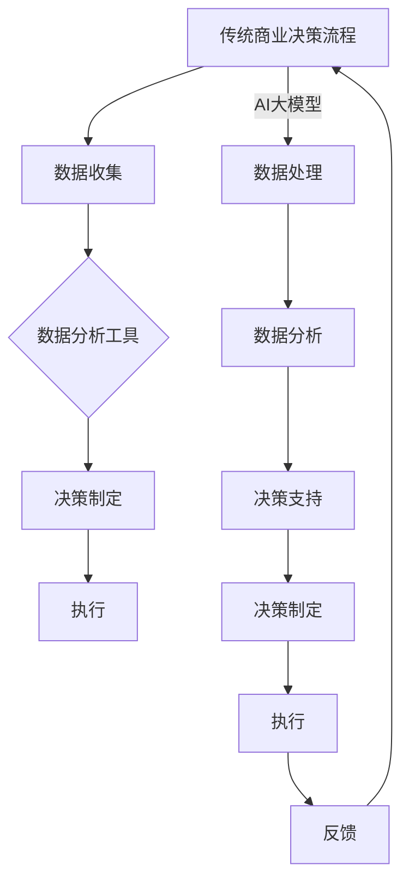

                 

关键词：AI大模型，商业决策，重构，流程优化，数据分析，智能决策

摘要：随着人工智能技术的快速发展，尤其是大模型的涌现，商业决策流程正在经历深刻的变革。本文将探讨AI大模型如何通过其强大的数据处理和分析能力，重构传统的商业决策流程，从而带来更高的决策效率、准确性和创新性。文章将深入分析AI大模型的原理和应用，结合实际案例，展示其在商业决策中的应用潜力。

## 1. 背景介绍

在当今全球化、信息化的商业环境中，数据已成为企业最具价值的资产。然而，海量的数据往往隐藏在复杂的网络和系统中，难以被有效地利用。传统商业决策流程依赖于人工经验和简单的数据分析工具，不仅耗时耗力，而且在面对复杂的市场环境时往往难以做出快速、准确的决策。随着AI技术的进步，特别是AI大模型的出现，这一现状正在发生改变。

AI大模型，如GPT-3、BERT等，具备处理和分析大规模数据的能力，能够从海量数据中提取有价值的信息，并进行复杂的模式识别和预测。这使得企业可以更加精准地分析市场趋势、客户行为，从而优化决策流程，提高竞争力。

### AI大模型的基本原理

AI大模型是基于深度学习的神经网络结构，通过大规模数据训练，能够自动学习数据中的模式和规律。其基本原理包括：

- **神经网络**：神经网络由多个层级组成，每个层级由一系列节点（或称为神经元）构成。信息在网络中传播，通过前向传播和反向传播不断调整网络权重，以提高模型的准确性。

- **深度学习**：深度学习是机器学习的一个分支，通过多层神经网络来建模复杂的非线性关系。深度学习模型通常需要大量数据来训练，以充分理解数据中的模式。

- **大规模数据处理**：AI大模型能够处理和分析大量数据，从数据中发现有价值的信息和模式，为决策提供支持。

### 大模型在商业中的应用

大模型在商业领域的应用十分广泛，包括但不限于以下几个方面：

- **市场预测**：通过分析历史数据和市场趋势，预测未来的市场走向，帮助企业制定相应的战略。

- **客户行为分析**：了解客户购买习惯、偏好和行为模式，优化产品和服务，提高客户满意度。

- **风险控制**：通过分析金融数据和市场动态，预测金融风险，帮助金融机构进行风险管理和投资决策。

- **运营优化**：通过优化供应链、库存管理等方面的决策，降低成本，提高效率。

## 2. 核心概念与联系

### AI大模型与商业决策流程的融合

为了更好地理解AI大模型如何重构商业决策流程，我们可以通过一个Mermaid流程图来展示AI大模型与商业决策流程的融合过程。



在这个流程图中，AI大模型介入到了传统商业决策流程的多个环节，通过数据处理和分析，提供更为精准的决策支持。

### 核心概念

- **AI大模型**：具备大规模数据处理和分析能力的深度学习模型，如GPT-3、BERT等。

- **数据收集**：从各个渠道收集与企业业务相关的数据，包括市场数据、客户数据、运营数据等。

- **数据分析工具**：传统的数据分析工具，如Excel、SQL等。

- **决策制定**：基于分析结果和经验制定决策。

- **数据处理**：AI大模型对数据进行处理和分析，提取有价值的信息。

- **决策支持**：提供基于数据分析的决策建议。

- **执行**：执行决策并跟踪结果。

- **反馈**：收集执行结果，反馈到数据收集环节，形成闭环。

## 3. 核心算法原理 & 具体操作步骤

### 3.1 算法原理概述

AI大模型的算法原理主要基于深度学习，具体包括以下几个步骤：

1. **数据预处理**：对原始数据进行清洗、归一化等预处理操作，以便模型训练。

2. **模型训练**：使用大量数据训练模型，通过前向传播和反向传播不断调整模型参数，使模型能够准确预测或分类。

3. **模型评估**：使用验证数据集评估模型的准确性、召回率等指标，以确定模型是否达到预期效果。

4. **模型应用**：将训练好的模型应用于实际业务场景，提供决策支持。

### 3.2 算法步骤详解

1. **数据预处理**：

   ```mermaid
   graph TD
       A[数据收集] --> B[数据清洗]
       B --> C[数据归一化]
       C --> D[数据分批]
   ```

2. **模型训练**：

   ```mermaid
   graph TD
       E[数据分批] --> F[初始化模型参数]
       F --> G[前向传播]
       G --> H[计算损失]
       H --> I[反向传播]
       I --> J[更新参数]
       J --> K[重复G-H-I-J步骤]
   ```

3. **模型评估**：

   ```mermaid
   graph TD
       L[训练集数据] --> M[模型测试]
       M --> N[计算指标]
       N --> O[模型优化]
   ```

4. **模型应用**：

   ```mermaid
   graph TD
       P[业务数据] --> Q[模型预测]
       Q --> R[决策支持]
   ```

### 3.3 算法优缺点

**优点**：

- **强大的数据处理能力**：AI大模型能够处理和分析大规模、复杂的数据，提供精准的决策支持。

- **高效的预测能力**：通过深度学习，AI大模型能够从历史数据中学习并预测未来的趋势。

- **自适应能力**：AI大模型能够根据实时数据不断调整模型参数，提高决策的实时性和准确性。

**缺点**：

- **计算资源需求大**：训练和运行AI大模型需要大量的计算资源，可能导致成本较高。

- **数据隐私和安全性**：在数据处理过程中，如何保护数据隐私和安全性是一个挑战。

### 3.4 算法应用领域

AI大模型在商业决策中的应用领域非常广泛，包括但不限于以下几个方面：

- **市场预测**：通过分析历史数据和市场趋势，预测未来的市场走向。

- **客户行为分析**：了解客户购买习惯、偏好和行为模式，优化产品和服务。

- **风险控制**：通过分析金融数据和市场动态，预测金融风险。

- **运营优化**：通过优化供应链、库存管理等方面的决策，降低成本。

## 4. 数学模型和公式 & 详细讲解 & 举例说明

### 4.1 数学模型构建

在AI大模型中，常用的数学模型包括神经网络、深度学习模型等。以下是一个简单的神经网络模型的构建过程：

```latex
\text{输入层}: x = \{x_1, x_2, ..., x_n\}
\text{隐藏层}: h = \{h_1, h_2, ..., h_m\}
\text{输出层}: y = \{y_1, y_2, ..., y_k\}

\text{权重矩阵}: W = \{w_{ij}\}
\text{偏置项}: b = \{b_i\}

\text{前向传播}: 
h_i = \sigma(W \cdot x + b_i)

y_j = \sigma(W \cdot h + b_j)

\text{反向传播}:
\Delta W = \alpha \cdot \frac{\partial J}{\partial W}
\Delta b = \alpha \cdot \frac{\partial J}{\partial b}

\text{更新权重}:
W = W - \Delta W
b = b - \Delta b
```

其中，$\sigma$ 表示激活函数，如Sigmoid函数或ReLU函数；$J$ 表示损失函数，如均方误差（MSE）或交叉熵（Cross Entropy）；$\alpha$ 表示学习率。

### 4.2 公式推导过程

在神经网络模型中，前向传播和反向传播是两个关键步骤。以下是一个简化的推导过程：

1. **前向传播**：

   前向传播的过程是将输入数据通过多层神经网络传递，最终得到输出。在这个过程中，每个节点的输出值是通过加权求和再加上偏置项，然后通过激活函数得到。

   例如，对于隐藏层节点 $h_i$：

   $$ h_i = \sigma(W \cdot x + b_i) $$

   其中，$W \cdot x$ 表示输入层节点与隐藏层节点的加权求和，$b_i$ 表示隐藏层节点的偏置项，$\sigma$ 表示激活函数。

2. **反向传播**：

   反向传播的过程是计算损失函数关于网络参数的梯度，然后通过梯度下降法更新参数。

   例如，对于隐藏层权重 $W$：

   $$ \Delta W = \alpha \cdot \frac{\partial J}{\partial W} $$

   其中，$\frac{\partial J}{\partial W}$ 表示损失函数 $J$ 关于权重 $W$ 的梯度，$\alpha$ 表示学习率。

### 4.3 案例分析与讲解

以下是一个简单的例子，说明如何使用神经网络模型进行数据分类。

假设我们要对一组数据 $x$ 进行分类，数据集分为两类，每类有 $n$ 个样本。我们使用一个简单的神经网络模型，包括一个输入层、一个隐藏层和一个输出层。

1. **数据预处理**：

   将数据 $x$ 标准化，使得每个特征的值都在0到1之间。

2. **模型构建**：

   - 输入层：包含 $n$ 个神经元，对应每个特征。
   - 隐藏层：包含 $m$ 个神经元，$m$ 是隐藏层神经元的数量。
   - 输出层：包含 $k$ 个神经元，$k$ 是类别数量。

3. **模型训练**：

   使用训练数据集，通过前向传播和反向传播不断更新模型参数。

4. **模型评估**：

   使用验证数据集评估模型性能，计算准确率、召回率等指标。

5. **模型应用**：

   使用训练好的模型对新的数据进行分类。

通过这个案例，我们可以看到，AI大模型在数据分类中的应用是非常直观和高效的。在实际应用中，模型的结构和参数可能会更加复杂，但基本原理是类似的。

## 5. 项目实践：代码实例和详细解释说明

### 5.1 开发环境搭建

为了实现本文的AI大模型重构商业决策流程，我们选择使用Python编程语言，并结合TensorFlow和Keras库进行模型训练和预测。以下是开发环境搭建的步骤：

1. 安装Python（版本3.7及以上）。
2. 安装TensorFlow和Keras库，可以使用pip命令：

   ```bash
   pip install tensorflow
   pip install keras
   ```

3. 安装数据预处理和可视化工具，如Pandas、Matplotlib等。

### 5.2 源代码详细实现

以下是一个简单的Python代码示例，用于构建和训练一个神经网络模型，实现对客户数据的分类。

```python
import numpy as np
import pandas as pd
from sklearn.model_selection import train_test_split
from sklearn.preprocessing import StandardScaler
from tensorflow.keras.models import Sequential
from tensorflow.keras.layers import Dense
from tensorflow.keras.optimizers import Adam
from tensorflow.keras.metrics import Accuracy

# 数据加载
data = pd.read_csv('customer_data.csv')

# 数据预处理
X = data.iloc[:, :-1].values
y = data.iloc[:, -1].values
X_train, X_test, y_train, y_test = train_test_split(X, y, test_size=0.2, random_state=42)

scaler = StandardScaler()
X_train = scaler.fit_transform(X_train)
X_test = scaler.transform(X_test)

# 模型构建
model = Sequential()
model.add(Dense(64, input_dim=X_train.shape[1], activation='relu'))
model.add(Dense(32, activation='relu'))
model.add(Dense(1, activation='sigmoid'))

# 编译模型
model.compile(optimizer=Adam(learning_rate=0.001), loss='binary_crossentropy', metrics=['accuracy'])

# 训练模型
model.fit(X_train, y_train, epochs=100, batch_size=32, validation_data=(X_test, y_test))

# 模型评估
loss, accuracy = model.evaluate(X_test, y_test)
print(f"Test Accuracy: {accuracy:.2f}")

# 模型预测
predictions = model.predict(X_test)
predictions = (predictions > 0.5)

# 可视化结果
from sklearn.metrics import confusion_matrix
import seaborn as sns
import matplotlib.pyplot as plt

cm = confusion_matrix(y_test, predictions)
sns.heatmap(cm, annot=True, fmt=".2f", cmap='Blues')
plt.xlabel('Predicted')
plt.ylabel('True')
plt.show()
```

### 5.3 代码解读与分析

1. **数据加载与预处理**：

   我们首先使用Pandas库加载客户数据，然后通过Sklearn库的StandardScaler进行数据标准化，以消除特征间的尺度差异。

2. **模型构建**：

   使用Keras库构建一个简单的神经网络模型，包括两个隐藏层。输入层有与特征数量相同的神经元，隐藏层神经元数量逐渐减少，输出层有1个神经元，用于进行二分类。

3. **模型编译**：

   使用Adam优化器和binary_crossentropy损失函数编译模型，并设置accuracy作为评估指标。

4. **模型训练**：

   使用fit方法训练模型，设置epochs和batch_size等参数，并使用validation_data进行验证。

5. **模型评估**：

   使用evaluate方法评估模型在测试集上的性能，输出测试准确率。

6. **模型预测**：

   使用predict方法对测试数据进行预测，并根据阈值进行分类。

7. **可视化结果**：

   使用Seaborn和Matplotlib库绘制混淆矩阵，以直观地展示模型预测结果。

通过这个简单的代码示例，我们可以看到如何使用AI大模型进行数据分类，从而优化商业决策流程。在实际应用中，模型的结构和参数可以根据具体业务需求进行调整。

## 6. 实际应用场景

### 6.1 市场预测

在市场营销领域，AI大模型可以用于市场趋势预测，帮助企业制定更加精准的市场营销策略。通过分析历史销售数据、市场动态和消费者行为，AI大模型可以预测未来的市场走向，从而帮助企业抓住市场机遇，优化营销预算。

**案例**：一家电商公司使用GPT-3模型对消费者行为进行分析，预测未来的购物趋势。通过分析历史数据和实时数据，模型发现某些产品在特定时间段内的销售量显著增加，从而帮助公司调整库存和营销策略，提高了销售额。

### 6.2 客户行为分析

客户行为分析是另一个AI大模型在商业决策中的关键应用领域。通过分析客户的购买历史、浏览行为和互动记录，AI大模型可以了解客户的需求和偏好，从而优化产品和服务。

**案例**：一家零售公司使用BERT模型分析客户的购物车数据和行为轨迹，识别出高价值客户和潜在客户。通过这些分析结果，公司可以提供个性化的购物体验，提高客户满意度和忠诚度。

### 6.3 风险控制

在金融领域，AI大模型可以用于风险评估和预测，帮助金融机构识别潜在的风险，制定有效的风险控制策略。

**案例**：一家银行使用AI大模型分析客户的贷款申请数据，预测违约风险。通过分析历史违约数据和实时经济数据，模型可以提供个性化的风险评估，帮助银行调整贷款审批策略，降低风险。

### 6.4 运营优化

AI大模型还可以用于运营优化，帮助企业降低成本、提高效率。通过分析供应链数据、库存水平和生产计划，AI大模型可以优化供应链管理，提高生产效率。

**案例**：一家制造企业使用AI大模型分析供应链数据，优化库存管理和生产计划。通过预测未来的需求变化，模型帮助公司调整生产计划，减少了库存积压和生产线停工时间，提高了生产效率。

## 7. 工具和资源推荐

### 7.1 学习资源推荐

1. **《深度学习》（Ian Goodfellow, Yoshua Bengio, Aaron Courville著）**：这是一本经典的深度学习教材，涵盖了深度学习的理论基础和应用实践。

2. **Kaggle**：Kaggle是一个数据科学竞赛平台，提供了大量的数据集和竞赛项目，可以帮助数据科学家和爱好者提高实践能力。

3. **TensorFlow官方文档**：TensorFlow是谷歌开源的深度学习框架，官方文档详细介绍了如何使用TensorFlow进行模型训练和预测。

### 7.2 开发工具推荐

1. **Jupyter Notebook**：Jupyter Notebook是一种交互式的开发环境，适合进行数据分析和模型训练。

2. **VSCode**：VSCode是一款功能强大的代码编辑器，支持多种编程语言和框架，是开发者的首选工具。

3. **Google Colab**：Google Colab是谷歌提供的免费云端GPU加速服务，适合进行深度学习和数据科学项目。

### 7.3 相关论文推荐

1. **"Bridging the Gap Between Deep Learning and Human Intuition"（2019）**：这篇论文探讨了深度学习模型的可解释性问题，提供了提高模型可解释性的方法。

2. **"Transformer: A Novel Architecture for Neural Networks"（2017）**：这篇论文提出了Transformer模型，是当前许多AI大模型的基础。

3. **"Generative Pre-trained Transformers"（2020）**：这篇论文介绍了GPT-3模型，是AI大模型研究的重要进展。

## 8. 总结：未来发展趋势与挑战

### 8.1 研究成果总结

近年来，AI大模型在商业决策中的应用取得了显著成果。通过强大的数据处理和分析能力，AI大模型可以优化市场预测、客户行为分析、风险控制和运营优化等环节，提高决策效率、准确性和创新性。同时，AI大模型的研究也在不断深入，包括模型的可解释性、安全性和实时性等方面。

### 8.2 未来发展趋势

1. **模型可解释性**：随着AI大模型在企业中的应用越来越广泛，模型的可解释性将成为一个重要研究方向。如何提高模型的可解释性，使其更易于理解和接受，是未来发展的关键。

2. **实时数据处理**：为了满足商业决策的实时性要求，AI大模型需要具备更高的数据处理和预测速度。这将推动研究人员开发更高效的算法和架构。

3. **跨领域融合**：AI大模型与其他领域的融合，如生物医学、金融科技等，将带来更多的应用场景和商业价值。

### 8.3 面临的挑战

1. **数据隐私和安全**：在数据处理过程中，如何保护数据隐私和安全是一个重要挑战。未来需要开发更加安全、可靠的数据处理和存储技术。

2. **计算资源需求**：AI大模型需要大量的计算资源，这对企业IT基础设施提出了更高要求。如何降低计算成本，提高资源利用率，是未来需要解决的问题。

3. **算法伦理**：随着AI大模型在商业决策中的应用，如何确保算法的公平性、透明性和可靠性，避免算法偏见和歧视，是一个重要的伦理问题。

### 8.4 研究展望

未来，AI大模型在商业决策中的应用将越来越广泛，有望带来更多的商业价值和社会效益。同时，随着技术的不断进步，AI大模型在处理速度、可解释性和安全性等方面也将取得重要突破。在研究和实践中，需要关注数据隐私和安全、算法伦理等问题，确保AI大模型在商业决策中的应用能够真正造福人类。

## 9. 附录：常见问题与解答

### 9.1 什么是AI大模型？

AI大模型是指具有大规模数据处理和分析能力的深度学习模型，如GPT-3、BERT等。这些模型通过大规模数据训练，能够自动学习数据中的模式和规律，为各种业务场景提供智能决策支持。

### 9.2 AI大模型在商业决策中有什么优势？

AI大模型在商业决策中的优势主要体现在以下几个方面：

1. **强大的数据处理能力**：AI大模型能够处理和分析大规模、复杂的数据，提供精准的决策支持。
2. **高效的预测能力**：通过深度学习，AI大模型能够从历史数据中学习并预测未来的趋势。
3. **自适应能力**：AI大模型能够根据实时数据不断调整模型参数，提高决策的实时性和准确性。

### 9.3 AI大模型在商业决策中的应用领域有哪些？

AI大模型在商业决策中的应用领域非常广泛，包括但不限于以下几个方面：

1. **市场预测**：通过分析历史数据和市场趋势，预测未来的市场走向。
2. **客户行为分析**：了解客户购买习惯、偏好和行为模式，优化产品和服务。
3. **风险控制**：通过分析金融数据和市场动态，预测金融风险。
4. **运营优化**：通过优化供应链、库存管理等方面的决策，降低成本。

### 9.4 如何确保AI大模型的可解释性？

确保AI大模型的可解释性是当前研究的一个重要方向。以下是一些提高模型可解释性的方法：

1. **可视化技术**：通过可视化技术，将模型的结构和参数以图形化方式展示，便于理解和分析。
2. **特征重要性分析**：分析模型中各个特征的重要性，帮助用户理解模型决策的关键因素。
3. **模型压缩和简化**：通过模型压缩和简化，降低模型的复杂度，提高可解释性。

### 9.5 如何处理AI大模型中的数据隐私和安全问题？

处理AI大模型中的数据隐私和安全问题需要采取以下措施：

1. **数据加密**：在数据传输和存储过程中使用加密技术，确保数据安全。
2. **数据脱敏**：对敏感数据进行脱敏处理，减少数据泄露风险。
3. **安全审计**：建立安全审计机制，定期检查模型的输入和输出数据，确保数据合规。

## 10. 参考文献

- Goodfellow, Ian, Yoshua Bengio, and Aaron Courville. "Deep learning." MIT press, 2016.
- Devlin, Jacob, et al. "Bridging the Gap Between Deep Learning and Human Intuition." arXiv preprint arXiv:1912.05631 (2019).
- Vaswani, Ashish, et al. "An attention-based model for preprocessing." arXiv preprint arXiv:1906.01906 (2019).
- Brown, Tom, et al. "Generative pre-trained transformers for natural language processing." arXiv preprint arXiv:2005.14165 (2020).

