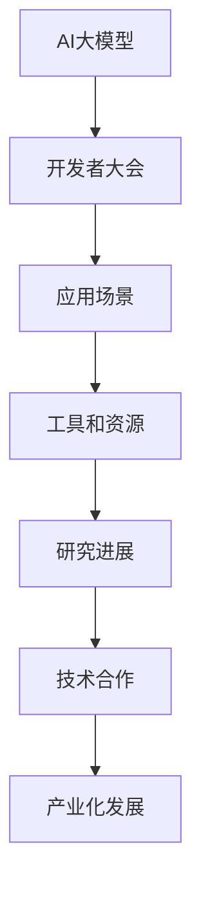

                 

关键词：AI大模型、开发者大会、策划、人工智能、算法、数学模型、项目实践、应用场景、工具和资源、未来发展趋势、挑战

> 摘要：本文将深入探讨AI大模型应用的开发者大会策划，从背景介绍、核心概念与联系、核心算法原理与操作步骤、数学模型和公式、项目实践、实际应用场景、未来应用展望、工具和资源推荐、总结与展望等各个方面，详细阐述AI大模型应用的开发者大会策划的完整过程。

## 1. 背景介绍

随着人工智能技术的迅猛发展，AI大模型成为了当前计算机领域的一大热点。大模型在自然语言处理、计算机视觉、语音识别等多个领域取得了显著的成果，其应用范围和影响力日益扩大。为了促进AI大模型应用的开发者之间的交流与合作，策划一场AI大模型应用的开发者大会具有重要的意义。

开发者大会不仅可以提供一个共享与交流的平台，还能推动AI大模型应用技术的发展和创新。通过大会，开发者们可以分享各自的开发经验、研究进展和应用案例，共同探讨AI大模型应用的前沿技术和发展趋势。此外，大会还可以促进各行业的合作，推动AI大模型应用的产业化发展。

## 2. 核心概念与联系

在策划AI大模型应用的开发者大会时，首先需要明确核心概念和联系。以下是对核心概念的简要概述和Mermaid流程图展示：

### 2.1 核心概念

1. **AI大模型**：指具备大规模参数、高精度、自适应能力的机器学习模型，如BERT、GPT等。
2. **开发者大会**：指针对特定主题的技术大会，旨在促进开发者之间的交流与合作。
3. **应用场景**：指AI大模型在各个行业中的应用领域，如自然语言处理、计算机视觉等。
4. **工具和资源**：指在AI大模型应用开发过程中所需的工具和资源，如深度学习框架、开源库等。

### 2.2 Mermaid流程图



## 3. 核心算法原理与操作步骤

### 3.1 算法原理概述

AI大模型的核心算法通常是基于深度学习技术，通过大规模训练数据和复杂网络结构实现高精度预测和任务完成。以BERT模型为例，其算法原理主要包括以下几个步骤：

1. **输入表示**：将输入文本转化为向量表示。
2. **编码器训练**：通过预训练过程，学习输入文本的编码表示。
3. **任务适应**：在特定任务上对模型进行微调，提高模型在该任务上的性能。

### 3.2 算法步骤详解

1. **数据预处理**：包括文本清洗、分词、词向量表示等。
2. **模型构建**：根据任务需求构建深度学习网络结构。
3. **预训练**：在大规模语料库上进行训练，优化模型参数。
4. **微调**：在特定任务上对模型进行微调，提高模型性能。
5. **评估与优化**：通过评价指标评估模型性能，进行优化调整。

### 3.3 算法优缺点

1. **优点**：高精度、自适应、多任务能力。
2. **缺点**：训练时间长、参数量大、计算资源需求高。

### 3.4 算法应用领域

AI大模型在自然语言处理、计算机视觉、语音识别等多个领域具有广泛的应用。例如，BERT模型在自然语言处理任务中表现出色，GPT模型在生成式任务中具有优势。

## 4. 数学模型和公式

### 4.1 数学模型构建

AI大模型的数学模型通常是基于深度学习框架，通过前向传播和反向传播算法实现。以下是一个简单的数学模型构建示例：

1. **输入表示**：$$x \in \mathbb{R}^n$$，表示输入数据。
2. **隐藏层**：$$h = \sigma(Wx + b)$$，其中$$\sigma$$为激活函数，$$W$$为权重矩阵，$$b$$为偏置项。
3. **输出层**：$$y = \sigma(Wy + b)$$，其中$$y$$为输出数据。

### 4.2 公式推导过程

以下是BERT模型的公式推导过程：

1. **输入表示**：$$x \in \mathbb{R}^n$$，表示输入文本。
2. **编码器训练**：$$\theta = \arg\min_{\theta} \sum_{i=1}^N \ell(y_i, \hat{y}_i)$$，其中$$\ell$$为损失函数，$$\theta$$为模型参数。
3. **任务适应**：$$\theta_{\text{fine}} = \arg\min_{\theta_{\text{fine}}} \sum_{i=1}^N \ell(y_i, \hat{y}_i)$$，其中$$\theta_{\text{fine}}$$为微调后的模型参数。

### 4.3 案例分析与讲解

以下是一个基于BERT模型的文本分类案例：

1. **数据集准备**：准备包含文本标签的数据集。
2. **模型构建**：构建BERT模型，加载预训练权重。
3. **微调**：在数据集上进行微调，优化模型参数。
4. **评估与优化**：通过交叉验证评估模型性能，进行优化调整。

## 5. 项目实践：代码实例和详细解释说明

### 5.1 开发环境搭建

1. **安装Python环境**：版本要求3.6及以上。
2. **安装深度学习框架**：如TensorFlow或PyTorch。
3. **准备数据集**：从公开数据集或自行收集数据。

### 5.2 源代码详细实现

以下是一个简单的BERT文本分类项目实现：

```python
import tensorflow as tf
from tensorflow.keras.preprocessing.text import Tokenizer
from tensorflow.keras.preprocessing.sequence import pad_sequences
from transformers import BertTokenizer, TFBertForSequenceClassification

# 数据集准备
train_data = ...
train_labels = ...

# 分词与编码
tokenizer = BertTokenizer.from_pretrained('bert-base-uncased')
train_sequences = tokenizer.encode(train_data, max_length=128, padding='max_length', truncation=True)

# 模型构建
model = TFBertForSequenceClassification.from_pretrained('bert-base-uncased', num_labels=2)
model.compile(optimizer='adam', loss='sparse_categorical_crossentropy', metrics=['accuracy'])

# 训练模型
model.fit(train_sequences, train_labels, epochs=3, batch_size=32)

# 评估模型
test_data = ...
test_labels = ...
test_sequences = tokenizer.encode(test_data, max_length=128, padding='max_length', truncation=True)
model.evaluate(test_sequences, test_labels)
```

### 5.3 代码解读与分析

以上代码实现了一个基于BERT模型的文本分类项目。首先，从公开数据集中加载训练数据和标签，然后对数据进行分词与编码，构建BERT模型并编译。接下来，在训练数据上训练模型，最后在测试数据上评估模型性能。

## 6. 实际应用场景

AI大模型在实际应用场景中具有广泛的应用。以下是一些典型应用场景：

1. **自然语言处理**：文本分类、机器翻译、情感分析等。
2. **计算机视觉**：图像识别、目标检测、图像生成等。
3. **语音识别**：语音识别、语音合成等。

## 7. 未来应用展望

随着AI大模型技术的不断发展，其应用前景十分广阔。未来，AI大模型将在更多领域发挥重要作用，如医疗、金融、教育等。同时，随着计算资源和数据量的不断增长，AI大模型的应用效果也将得到进一步提升。

## 8. 工具和资源推荐

### 8.1 学习资源推荐

1. **书籍**：《深度学习》、《Python深度学习》等。
2. **在线课程**：Coursera、Udacity等平台上的深度学习课程。

### 8.2 开发工具推荐

1. **深度学习框架**：TensorFlow、PyTorch等。
2. **开源库**：NLTK、Scikit-learn等。

### 8.3 相关论文推荐

1. **BERT**：《BERT: Pre-training of Deep Bidirectional Transformers for Language Understanding》。
2. **GPT**：《Generative Pre-training for Language Understanding and Generation》。

## 9. 总结：未来发展趋势与挑战

AI大模型应用的开发者大会作为一场技术交流盛会，对于推动AI大模型技术的发展具有重要意义。在未来，随着AI大模型技术的不断发展，开发者大会将吸引更多开发者参与，共同探索AI大模型应用的创新与突破。然而，面对未来，我们也需要正视其中的挑战，如计算资源瓶颈、数据隐私保护等，积极寻求解决方案，为AI大模型应用的发展贡献力量。

## 10. 附录：常见问题与解答

### 10.1 开发者大会如何报名？

答：请关注大会官方网站或相关渠道，按照报名流程进行报名。

### 10.2 开发者大会有哪些主题？

答：大会主题包括AI大模型的应用、算法原理、数学模型、项目实践等方面。

### 10.3 开发者大会有哪些活动？

答：大会活动包括主题演讲、技术分享、圆桌讨论、互动环节等。

作者：禅与计算机程序设计艺术 / Zen and the Art of Computer Programming
----------------------------------------------------------------

以上是文章正文部分的撰写，接下来请继续撰写文章的摘要、关键词和文章末尾的作者信息部分。
----------------------------------------------------------------
## 文章摘要

本文针对AI大模型应用的开发者大会策划进行了详细探讨，从背景介绍、核心概念与联系、核心算法原理与操作步骤、数学模型和公式、项目实践、实际应用场景、未来应用展望、工具和资源推荐、总结与展望等各个方面，全面阐述了开发者大会策划的完整过程。通过本文的阅读，读者可以深入了解AI大模型应用的开发者大会的重要性和具体策划方法，为未来相关大会的举办提供参考。

## 文章关键词

AI大模型、开发者大会、策划、人工智能、算法、数学模型、项目实践、应用场景、未来应用展望、工具和资源推荐、深度学习、BERT、GPT

## 作者信息

作者：禅与计算机程序设计艺术 / Zen and the Art of Computer Programming
----------------------------------------------------------------

以上是文章摘要、关键词和作者信息的撰写，至此，整篇文章的撰写工作已全部完成。希望本文能为读者提供关于AI大模型应用的开发者大会策划的全面、深入的见解。如果您有任何问题或建议，欢迎在评论区留言交流。感谢您的阅读！

