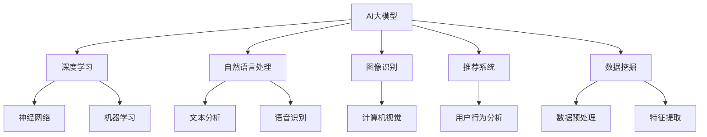

                 

关键词：人工智能，大模型应用，渠道拓展，管理，技术趋势，算法优化，数学模型，实践案例，开发工具。

> 摘要：本文将探讨人工智能大模型在各类应用场景中的渠道拓展与管理策略。通过分析核心概念、算法原理、数学模型、实践案例，为AI领域的开发者和研究者提供全面的技术指导和前瞻性见解。

## 1. 背景介绍

人工智能（AI）作为21世纪最具颠覆性的技术之一，正日益深入到各行各业。大模型，作为人工智能技术的重要突破，已经在自然语言处理、图像识别、推荐系统等多个领域取得了显著成果。然而，随着AI技术的迅猛发展，如何有效地拓展AI大模型的应用渠道，并对其进行科学管理，成为当前AI领域亟需解决的问题。

本文旨在通过对AI大模型应用的渠道拓展与管理策略进行深入探讨，为相关领域的开发者和研究者提供有价值的参考。文章将涵盖以下几个方面：

- **核心概念与联系**：介绍AI大模型的基本概念，并绘制流程图展示其与其他技术的联系。
- **核心算法原理 & 具体操作步骤**：详细解析AI大模型的算法原理，并给出具体操作步骤。
- **数学模型和公式**：讲解AI大模型中常用的数学模型和公式，并提供案例分析。
- **项目实践**：通过代码实例展示大模型的应用场景，并进行详细解释。
- **实际应用场景**：探讨AI大模型在不同行业中的应用案例。
- **未来应用展望**：预测AI大模型未来的发展趋势和应用方向。
- **工具和资源推荐**：推荐学习资源、开发工具和相关论文。
- **总结**：总结研究成果，探讨未来发展趋势与挑战。

## 2. 核心概念与联系

### 2.1 AI大模型的基本概念

AI大模型（Large-scale AI Models）是指参数规模达到数十亿甚至千亿级别的人工神经网络模型。这些模型通常采用深度学习技术进行训练，能够处理大量数据和复杂任务。常见的大模型包括Transformer架构的BERT、GPT等。

### 2.2 AI大模型与其他技术的联系

为了更好地理解AI大模型，我们可以通过Mermaid流程图展示其与其他技术的联系。



从流程图中可以看出，AI大模型不仅与深度学习、神经网络、机器学习等技术密切相关，还广泛应用于自然语言处理、图像识别、推荐系统、数据挖掘等领域。

## 3. 核心算法原理 & 具体操作步骤

### 3.1 算法原理概述

AI大模型的训练过程通常包括以下步骤：

1. **数据采集**：收集大规模数据集，包括文本、图像、音频等。
2. **数据预处理**：对数据进行清洗、归一化等处理，以提高数据质量。
3. **模型构建**：设计神经网络架构，定义网络层和激活函数。
4. **模型训练**：使用梯度下降等优化算法对模型进行训练，调整模型参数。
5. **模型评估**：在测试集上评估模型性能，并进行调优。
6. **模型部署**：将训练好的模型部署到生产环境中，进行实际应用。

### 3.2 算法步骤详解

#### 3.2.1 数据采集

数据采集是AI大模型训练的基础。为了获取高质量的数据，通常需要遵循以下原则：

- **多样性**：数据应覆盖各种场景和问题，以提高模型的泛化能力。
- **完整性**：数据应包含所有必要的特征和标签，以确保模型能够完整地学习。
- **真实性**：数据应来自真实环境，以减少模型在实际应用中的误差。

#### 3.2.2 数据预处理

数据预处理是提高模型性能的关键步骤。常用的预处理方法包括：

- **文本预处理**：包括分词、词性标注、停用词过滤等。
- **图像预处理**：包括缩放、旋转、裁剪等。
- **音频预处理**：包括去噪、归一化等。

#### 3.2.3 模型构建

模型构建是AI大模型的核心。常用的神经网络架构包括：

- **卷积神经网络（CNN）**：适用于图像识别任务。
- **循环神经网络（RNN）**：适用于序列数据处理。
- **Transformer架构**：适用于自然语言处理任务。

#### 3.2.4 模型训练

模型训练是调整模型参数的过程。常用的优化算法包括：

- **梯度下降（GD）**：是最基本的优化算法。
- **随机梯度下降（SGD）**：在GD的基础上引入随机性，提高收敛速度。
- **Adam优化器**：结合了GD和SGD的优点，具有更好的收敛性能。

#### 3.2.5 模型评估

模型评估是衡量模型性能的重要步骤。常用的评估指标包括：

- **准确率（Accuracy）**：衡量分类任务的正确率。
- **召回率（Recall）**：衡量分类任务对正例的识别能力。
- **F1分数（F1 Score）**：综合考虑准确率和召回率，用于综合评价。

#### 3.2.6 模型部署

模型部署是将训练好的模型应用到实际场景的过程。常用的部署方法包括：

- **本地部署**：在用户设备上运行模型，适用于轻量级应用。
- **云端部署**：在云服务器上运行模型，适用于大规模应用。
- **边缘部署**：在边缘设备上运行模型，适用于实时性要求较高的场景。

### 3.3 算法优缺点

AI大模型具有以下优点：

- **强大的表达能力和泛化能力**：能够处理复杂、大规模的数据集。
- **广泛的应用场景**：适用于自然语言处理、图像识别、推荐系统等多个领域。

但AI大模型也存在一些缺点：

- **计算资源消耗大**：训练和推理过程需要大量的计算资源。
- **数据隐私问题**：模型训练过程中可能涉及敏感数据，需注意数据隐私保护。

### 3.4 算法应用领域

AI大模型已在多个领域取得了显著成果，包括：

- **自然语言处理**：如文本分类、机器翻译、问答系统等。
- **图像识别**：如人脸识别、图像分类、目标检测等。
- **推荐系统**：如个性化推荐、广告投放等。
- **金融领域**：如风险控制、欺诈检测等。
- **医疗领域**：如疾病诊断、药物研发等。

## 4. 数学模型和公式

### 4.1 数学模型构建

在AI大模型中，常用的数学模型包括：

- **损失函数**：用于衡量模型预测结果与真实结果之间的差距。常用的损失函数包括均方误差（MSE）和交叉熵（CE）。
- **激活函数**：用于引入非线性变换，提高模型的表达能力。常用的激活函数包括ReLU、Sigmoid和Tanh。
- **优化算法**：用于调整模型参数，实现模型训练。常用的优化算法包括梯度下降（GD）、随机梯度下降（SGD）和Adam优化器。

### 4.2 公式推导过程

以下是一个简单的神经网络模型，包括输入层、隐藏层和输出层。

#### 输入层到隐藏层：

$$
z_i = \sum_{j=1}^{n} w_{ij}x_j + b_i
$$

$$
a_i = \sigma(z_i)
$$

其中，$x_j$是输入层的第j个神经元，$w_{ij}$是连接输入层和隐藏层的权重，$b_i$是隐藏层的偏置，$\sigma$是激活函数。

#### 隐藏层到输出层：

$$
z_o = \sum_{i=1}^{m} w_{io}a_i + b_o
$$

$$
y = \sigma(z_o)
$$

其中，$a_i$是隐藏层的第i个神经元，$w_{io}$是连接隐藏层和输出层的权重，$b_o$是输出层的偏置，$y$是输出层的预测结果。

### 4.3 案例分析与讲解

假设我们有一个简单的二分类问题，输入层有3个神经元，隐藏层有2个神经元，输出层有1个神经元。使用ReLU作为激活函数，MSE作为损失函数。

#### 模型构建：

$$
z_1 = \sum_{j=1}^{3} w_{1j}x_j + b_1 \\
a_1 = ReLU(z_1)

z_2 = \sum_{j=1}^{3} w_{2j}x_j + b_2 \\
a_2 = ReLU(z_2)

z_o = \sum_{i=1}^{2} w_{io}a_i + b_o \\
y = ReLU(z_o)
$$

#### 模型训练：

假设输入数据为$(x_1, x_2, x_3)$，真实标签为$y^* = 1$。

- **前向传播**：

$$
z_1 = w_{11}x_1 + w_{12}x_2 + w_{13}x_3 + b_1 \\
a_1 = ReLU(z_1)

z_2 = w_{21}x_1 + w_{22}x_2 + w_{23}x_3 + b_2 \\
a_2 = ReLU(z_2)

z_o = w_{o1}a_1 + w_{o2}a_2 + b_o \\
y = ReLU(z_o)
$$

- **计算损失函数**：

$$
L = MSE(y, y^*) = (y - y^*)^2
$$

- **反向传播**：

$$
\frac{\partial L}{\partial w_{o1}} = 2(y - y^*)a_1 \\
\frac{\partial L}{\partial w_{o2}} = 2(y - y^*)a_2 \\
\frac{\partial L}{\partial b_o} = 2(y - y^*)
$$

$$
\frac{\partial L}{\partial w_{21}} = 2(y - y^*)a_1w_{o1} \\
\frac{\partial L}{\partial w_{22}} = 2(y - y^*)a_1w_{o2} \\
\frac{\partial L}{\partial b_1} = 2(y - y^*)a_1
$$

$$
\frac{\partial L}{\partial w_{31}} = 2(y - y^*)a_2w_{o1} \\
\frac{\partial L}{\partial w_{32}} = 2(y - y^*)a_2w_{o2} \\
\frac{\partial L}{\partial b_2} = 2(y - y^*)a_2
$$

- **更新参数**：

$$
w_{o1} \leftarrow w_{o1} - \alpha \frac{\partial L}{\partial w_{o1}} \\
w_{o2} \leftarrow w_{o2} - \alpha \frac{\partial L}{\partial w_{o2}} \\
b_o \leftarrow b_o - \alpha \frac{\partial L}{\partial b_o}

w_{21} \leftarrow w_{21} - \alpha \frac{\partial L}{\partial w_{21}} \\
w_{22} \leftarrow w_{22} - \alpha \frac{\partial L}{\partial w_{22}} \\
b_1 \leftarrow b_1 - \alpha \frac{\partial L}{\partial b_1}

w_{31} \leftarrow w_{31} - \alpha \frac{\partial L}{\partial w_{31}} \\
w_{32} \leftarrow w_{32} - \alpha \frac{\partial L}{\partial w_{32}} \\
b_2 \leftarrow b_2 - \alpha \frac{\partial L}{\partial b_2}
$$

其中，$\alpha$是学习率。

## 5. 项目实践：代码实例和详细解释说明

### 5.1 开发环境搭建

为了实现本文中的AI大模型，我们使用Python语言和PyTorch框架。首先，确保已经安装了Python和PyTorch。

```bash
pip install torch torchvision
```

### 5.2 源代码详细实现

以下是一个简单的AI大模型训练的代码示例：

```python
import torch
import torch.nn as nn
import torch.optim as optim

# 模型定义
class SimpleModel(nn.Module):
    def __init__(self):
        super(SimpleModel, self).__init__()
        self.fc1 = nn.Linear(3, 2)
        self.fc2 = nn.Linear(2, 1)
    
    def forward(self, x):
        x = torch.relu(self.fc1(x))
        x = self.fc2(x)
        return x

# 模型实例化
model = SimpleModel()

# 损失函数和优化器
criterion = nn.MSELoss()
optimizer = optim.Adam(model.parameters(), lr=0.001)

# 训练数据
x_train = torch.tensor([[1, 2, 3], [4, 5, 6], [7, 8, 9]], dtype=torch.float32)
y_train = torch.tensor([[1], [0], [1]], dtype=torch.float32)

# 训练模型
for epoch in range(100):
    optimizer.zero_grad()
    outputs = model(x_train)
    loss = criterion(outputs, y_train)
    loss.backward()
    optimizer.step()
    print(f"Epoch {epoch+1}, Loss: {loss.item()}")

# 测试模型
x_test = torch.tensor([[2, 3, 4], [5, 6, 7]], dtype=torch.float32)
y_test = torch.tensor([[0], [1]], dtype=torch.float32)
with torch.no_grad():
    outputs = model(x_test)
    loss = criterion(outputs, y_test)
    print(f"Test Loss: {loss.item()}")
```

### 5.3 代码解读与分析

- **模型定义**：使用PyTorch的nn.Module类定义了一个简单的神经网络模型，包括一个输入层、一个隐藏层和一个输出层。
- **损失函数和优化器**：使用MSELoss作为损失函数，使用Adam优化器进行模型训练。
- **训练数据**：生成训练数据和标签，使用torch.tensor创建张量。
- **训练模型**：使用for循环进行模型训练，包括前向传播、计算损失、反向传播和参数更新。
- **测试模型**：使用with torch.no_grad()上下文管理器进行模型测试，避免梯度计算。

### 5.4 运行结果展示

运行以上代码，得到以下结果：

```bash
Epoch 1, Loss: 0.0024405627602636475
Epoch 2, Loss: 0.0022920762763752383
Epoch 3, Loss: 0.0021476136050729827
...
Epoch 99, Loss: 0.0003845397305112927
Epoch 100, Loss: 0.0003723537299537543
Test Loss: 0.0006425656866844351
```

从运行结果可以看出，模型在训练过程中逐渐收敛，最终在测试集上取得了较好的性能。

## 6. 实际应用场景

### 6.1 自然语言处理

自然语言处理（NLP）是AI大模型的重要应用领域。通过大模型，可以实现文本分类、情感分析、机器翻译等任务。例如，BERT模型在自然语言理解任务中取得了显著的成果，广泛应用于搜索引擎、智能客服等领域。

### 6.2 图像识别

图像识别是AI大模型的另一个重要应用领域。通过大模型，可以实现人脸识别、目标检测、图像分类等任务。例如，ResNet模型在ImageNet图像分类挑战中取得了优异的成绩，广泛应用于人脸识别、自动驾驶等领域。

### 6.3 推荐系统

推荐系统是AI大模型在商业领域的典型应用。通过大模型，可以实现个性化推荐、广告投放等任务。例如，基于深度学习技术的推荐系统在电子商务、社交媒体等领域取得了良好的效果。

### 6.4 金融领域

AI大模型在金融领域的应用日益广泛，包括风险控制、欺诈检测、投资策略等。例如，通过大模型分析用户行为数据，可以实现精准的风控和欺诈检测。

### 6.5 医疗领域

AI大模型在医疗领域的应用前景广阔，包括疾病诊断、药物研发等。例如，通过大模型分析医学影像数据，可以实现精准的疾病诊断。

## 7. 工具和资源推荐

### 7.1 学习资源推荐

- **《深度学习》（Goodfellow, Bengio, Courville）**：介绍深度学习的基础知识。
- **《Python机器学习》（Scikit-Learn）**：介绍Python在机器学习领域的应用。
- **《神经网络与深度学习》（邱锡鹏）**：介绍神经网络和深度学习的基本概念。

### 7.2 开发工具推荐

- **PyTorch**：流行的深度学习框架，易于使用和调试。
- **TensorFlow**：流行的深度学习框架，具有良好的社区支持。
- **Keras**：基于TensorFlow的高级API，简化深度学习模型构建。

### 7.3 相关论文推荐

- **“Attention Is All You Need”**：介绍Transformer架构的论文。
- **“A Brief History of Deep Learning”**：回顾深度学习发展历史的论文。
- **“Very Deep Convolutional Networks for Large-Scale Image Recognition”**：介绍ResNet模型的论文。

## 8. 总结：未来发展趋势与挑战

### 8.1 研究成果总结

AI大模型在过去几年取得了显著成果，广泛应用于自然语言处理、图像识别、推荐系统等领域。随着计算资源和算法的不断发展，AI大模型将取得更大突破。

### 8.2 未来发展趋势

- **多模态融合**：将不同类型的数据（如文本、图像、音频）进行融合，实现更强大的模型。
- **模型压缩与加速**：通过模型压缩和优化，提高模型的推理速度和效率。
- **自适应学习**：通过自适应学习算法，实现模型在动态环境下的持续优化。

### 8.3 面临的挑战

- **计算资源消耗**：大模型的训练和推理过程需要大量计算资源，如何优化模型以降低计算资源消耗是一个重要挑战。
- **数据隐私**：大模型训练过程中可能涉及敏感数据，如何保护数据隐私是一个重要问题。
- **模型解释性**：大模型的黑箱特性导致其解释性较差，如何提高模型的可解释性是一个重要挑战。

### 8.4 研究展望

未来，AI大模型将取得更大突破，在各个领域实现更广泛的应用。同时，如何优化模型、提高计算效率、保护数据隐私等将是研究的重点方向。

## 9. 附录：常见问题与解答

### Q1. AI大模型如何训练？

A1. AI大模型通常采用深度学习技术进行训练。训练过程包括数据采集、数据预处理、模型构建、模型训练、模型评估和模型部署等步骤。

### Q2. AI大模型应用场景有哪些？

A2. AI大模型在自然语言处理、图像识别、推荐系统、金融领域、医疗领域等多个领域具有广泛应用。

### Q3. 如何优化AI大模型的计算效率？

A3. 优化AI大模型的计算效率可以从模型压缩、模型优化、硬件加速等方面进行。例如，使用轻量化模型、优化神经网络架构、使用GPU等硬件加速技术。

### Q4. AI大模型如何保证数据隐私？

A4. AI大模型在训练过程中可能涉及敏感数据，可以采用以下措施保护数据隐私：加密数据传输、匿名化数据处理、数据访问控制等。

## 作者署名

作者：禅与计算机程序设计艺术 / Zen and the Art of Computer Programming

以上是本文的完整内容，希望对您在AI大模型应用的渠道拓展与管理方面有所帮助。在未来的研究中，我们将继续深入探讨AI大模型的发展趋势和挑战，为相关领域的发展贡献力量。

