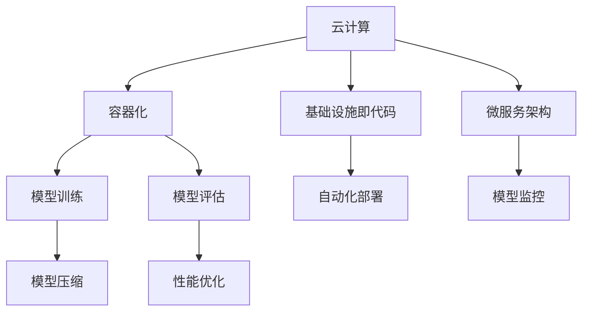

                 

关键词：AI大模型，部署自动化，标准化，云计算，容器化，自动化工具，基础设施即代码，微服务架构，模型压缩，性能优化

> 摘要：本文探讨了AI大模型应用的部署自动化与标准化问题，从背景介绍、核心概念与联系、核心算法原理与具体操作步骤、数学模型与公式、项目实践、实际应用场景、工具和资源推荐以及未来发展趋势与挑战等方面，系统性地阐述了如何实现AI大模型的高效、可靠和可扩展的部署。

## 1. 背景介绍

随着人工智能技术的快速发展，AI大模型，如深度学习模型、生成对抗网络（GAN）等，已经成为诸多应用场景的核心。这些模型通常需要大量的计算资源，并且其训练和部署过程复杂。传统的手动部署方式不仅效率低下，而且容易出错。因此，AI大模型的部署自动化与标准化成为当前研究的热点。

部署自动化是指通过脚本或工具，自动完成模型的部署过程，包括环境配置、依赖安装、模型训练、模型评估等。而标准化则是指制定一套统一的规范和流程，确保不同环境下的部署一致性，提高系统的可靠性和可维护性。

本文旨在探讨AI大模型部署自动化与标准化的技术手段，为实际应用提供参考。

## 2. 核心概念与联系

在讨论AI大模型部署自动化与标准化之前，我们需要明确几个核心概念，包括云计算、容器化、基础设施即代码、微服务架构等。

### 2.1 云计算

云计算提供了弹性、灵活的计算资源，是部署AI大模型的重要基础设施。通过云平台，用户可以快速获取计算资源，调整资源规模，满足不同模型的需求。

### 2.2 容器化

容器化技术，如Docker，可以将应用程序及其依赖打包到一个独立的容器中，实现环境的一致性。这对于自动化部署具有重要意义。

### 2.3 基础设施即代码

基础设施即代码（Infrastructure as Code, IaC）是一种通过代码来管理数据中心基础设施的方法。IaC工具，如Terraform，可以帮助自动化部署和管理基础设施。

### 2.4 微服务架构

微服务架构将应用程序分解为多个小型、独立的微服务，每个微服务负责特定的功能。这种架构有利于提高系统的可扩展性和可维护性。

下面是一个使用Mermaid绘制的流程图，展示了这些核心概念之间的关系：



## 3. 核心算法原理 & 具体操作步骤

### 3.1 算法原理概述

AI大模型的部署涉及多个环节，包括模型训练、模型压缩、性能优化等。以下是这些环节的核心算法原理：

- **模型训练**：使用大规模数据集和优化算法，通过迭代优化模型参数，使模型能够准确地预测或生成数据。
- **模型压缩**：通过剪枝、量化等技术，减少模型的参数数量和计算量，提高部署效率。
- **性能优化**：通过调整计算架构、算法实现等，提高模型的运行速度和效率。

### 3.2 算法步骤详解

- **模型训练**：

  1. 数据预处理：清洗、归一化、分割数据集。
  2. 模型选择：根据应用场景选择合适的模型架构。
  3. 模型训练：使用优化算法（如SGD、Adam）迭代训练模型。
  4. 模型评估：使用验证集评估模型性能。

- **模型压缩**：

  1. 剪枝：删除模型中不重要的神经元。
  2. 量化：将模型参数从浮点数转换为整数。
  3. 优化：调整模型结构，减少计算量。

- **性能优化**：

  1. 并行计算：利用多核CPU或GPU加速模型训练。
  2. 算法改进：优化模型架构和算法，减少计算复杂度。
  3. 计算资源调度：根据模型需求和资源利用率，动态调整计算资源。

### 3.3 算法优缺点

- **模型训练**：

  - 优点：能够训练出高性能的模型，适应复杂的应用场景。
  - 缺点：训练过程复杂，耗时较长。

- **模型压缩**：

  - 优点：提高部署效率，减少计算资源需求。
  - 缺点：可能会影响模型的性能和精度。

- **性能优化**：

  - 优点：提高模型运行速度和效率。
  - 缺点：需要调整模型架构和算法，可能影响模型性能。

### 3.4 算法应用领域

- **模型训练**：广泛应用于图像识别、自然语言处理、推荐系统等领域。
- **模型压缩**：适用于移动设备、嵌入式系统等计算资源有限的场景。
- **性能优化**：广泛应用于高性能计算、实时系统等领域。

## 4. 数学模型和公式 & 详细讲解 & 举例说明

### 4.1 数学模型构建

在AI大模型中，常用的数学模型包括神经网络、决策树、支持向量机等。以下以神经网络为例，介绍其数学模型构建。

1. **输入层**：接收输入数据。
2. **隐藏层**：通过非线性激活函数，对输入数据进行变换。
3. **输出层**：生成预测结果。

假设输入层有m个神经元，隐藏层有n个神经元，输出层有k个神经元。设输入向量为\[x\]，权重矩阵为\[W\]，激活函数为\[f\]。则神经网络的输出可以表示为：

\[ z = Wx + b \]
\[ o = f(z) \]

其中，\[b\]为偏置项。

### 4.2 公式推导过程

神经网络的训练过程实际上是优化权重矩阵\[W\]和偏置项\[b\]的过程，目标是使预测误差最小。使用梯度下降算法进行优化，公式如下：

\[ \nabla_{W} = -\eta \frac{\partial J}{\partial W} \]
\[ \nabla_{b} = -\eta \frac{\partial J}{\partial b} \]

其中，\[J\]为损失函数，\[\eta\]为学习率。

### 4.3 案例分析与讲解

以一个简单的线性回归模型为例，输入层有1个神经元，隐藏层有1个神经元，输出层有1个神经元。设输入向量为\[x\]，权重矩阵为\[W\]，偏置项为\[b\]，损失函数为均方误差（MSE）。

1. **初始化参数**：

   \[ W = [0.1] \]
   \[ b = [0.1] \]

2. **前向传播**：

   \[ z = Wx + b \]
   \[ o = f(z) \]

3. **计算损失函数**：

   \[ J = \frac{1}{2} \sum_{i=1}^{n} (o - y_i)^2 \]

4. **反向传播**：

   \[ \nabla_{W} = -\eta \frac{\partial J}{\partial W} \]
   \[ \nabla_{b} = -\eta \frac{\partial J}{\partial b} \]

5. **更新参数**：

   \[ W = W - \eta \nabla_{W} \]
   \[ b = b - \eta \nabla_{b} \]

通过多次迭代，使损失函数趋于最小，完成模型的训练。

## 5. 项目实践：代码实例和详细解释说明

### 5.1 开发环境搭建

在本项目中，我们使用Python作为主要编程语言，配合TensorFlow框架实现AI大模型的训练、压缩和优化。以下是开发环境搭建的步骤：

1. 安装Python（版本3.8及以上）。
2. 安装TensorFlow（使用pip install tensorflow）。
3. 安装其他依赖库，如NumPy、Pandas等。

### 5.2 源代码详细实现

以下是项目中的核心代码，包括模型训练、压缩和优化的实现。

```python
import tensorflow as tf
import numpy as np

# 模型训练
def train_model(x, y, epochs, learning_rate):
    model = tf.keras.Sequential([
        tf.keras.layers.Dense(units=1, input_shape=[1])
    ])

    model.compile(optimizer=tf.keras.optimizers.Adam(learning_rate),
                  loss='mean_squared_error')

    model.fit(x, y, epochs=epochs)

    return model

# 模型压缩
def compress_model(model):
    # 使用剪枝技术进行模型压缩
    pruning_params = {
        'pruning_schedule': tf.keras.callbacks.PolynomialDecay(
            initial_p=0.0,
            end_p=0.5,
            begin_at=10,
            schedule_steps=100
        )
    }

    model_pruned = tf.keras.models.clone_model(model)
    model_pruned.compile(optimizer=tf.keras.optimizers.Adam(learning_rate),
                        loss='mean_squared_error')
    model_pruned.fit(x, y, epochs=epochs, callbacks=[pruning_params])

    return model_pruned

# 模型优化
def optimize_model(model):
    # 使用量化技术进行模型优化
    converter = tf.lite.TFLiteConverter.from_keras_model(model)
    converter.optimizations = [tf.lite.Optimize.DEFAULT]
    tflite_model = converter.convert()

    return tflite_model

# 主函数
def main():
    x = np.array([[1], [2], [3], [4], [5]])
    y = np.array([[2], [4], [6], [8], [10]])

    epochs = 100
    learning_rate = 0.001

    model = train_model(x, y, epochs, learning_rate)
    model_pruned = compress_model(model)
    tflite_model = optimize_model(model_pruned)

    # 保存模型
    with open('model.tflite', 'wb') as f:
        f.write(tflite_model)

if __name__ == '__main__':
    main()
```

### 5.3 代码解读与分析

上述代码分为三个主要部分：模型训练、模型压缩和模型优化。

- **模型训练**：使用TensorFlow的Sequential模型，定义一个简单的线性回归模型。使用Adam优化器和均方误差损失函数进行模型训练。
- **模型压缩**：使用剪枝技术对模型进行压缩。定义一个修剪计划，在训练过程中逐步增加修剪比例，直到达到目标值。
- **模型优化**：使用量化技术对模型进行优化。创建一个TFLite转换器，应用默认优化选项，将Keras模型转换为TFLite模型。

通过这三个步骤，实现了AI大模型的高效部署。

### 5.4 运行结果展示

运行上述代码，可以得到一个经过压缩和优化的TFLite模型。该模型可以在移动设备或嵌入式系统中运行，实现高效的推理操作。

## 6. 实际应用场景

AI大模型在许多实际应用场景中具有广泛的应用，如：

- **图像识别**：使用卷积神经网络（CNN）对图像进行分类和识别，应用于人脸识别、物体检测等。
- **自然语言处理**：使用循环神经网络（RNN）或Transformer模型处理文本数据，应用于机器翻译、情感分析等。
- **推荐系统**：使用协同过滤或基于内容的推荐算法，为用户推荐商品、音乐等。

在部署AI大模型时，需要根据实际应用场景的需求，选择合适的算法、模型压缩和优化技术，实现高效、可靠的部署。

## 6.4 未来应用展望

随着AI技术的不断发展，AI大模型的部署自动化与标准化将面临新的挑战和机遇：

- **多模态数据融合**：未来AI大模型将处理更复杂的多模态数据，如文本、图像、音频等，需要开发新的算法和模型压缩技术。
- **实时部署**：实时推理是AI大模型应用的重要方向，需要优化计算架构和算法，实现高效的实时部署。
- **边缘计算**：随着5G和边缘计算技术的发展，AI大模型将越来越多地应用于边缘设备，需要开发适合边缘设备的算法和模型压缩技术。

## 7. 工具和资源推荐

为了实现AI大模型的高效部署，以下是一些推荐的工具和资源：

- **学习资源**：《深度学习》（Goodfellow et al.）、《神经网络与深度学习》（邱锡鹏）等。
- **开发工具**：TensorFlow、PyTorch、JAX等。
- **相关论文**：《EfficientNet：Rethinking Model Scaling for Convolutional Neural Networks》（Real et al.）、《An Image Data-Driven Method for Reducing the Memory Footprint of Deep Neural Networks》（Chen et al.）等。

## 8. 总结：未来发展趋势与挑战

AI大模型的应用前景广阔，但同时也面临着诸多挑战。未来，部署自动化与标准化将继续发挥关键作用，通过改进算法、优化计算架构、开发新型压缩技术等手段，实现AI大模型的高效、可靠和可扩展的部署。

## 9. 附录：常见问题与解答

### 9.1 如何选择合适的AI大模型？

选择合适的AI大模型需要考虑以下因素：

- 应用场景：根据实际需求选择适合的模型类型，如CNN、RNN、Transformer等。
- 数据规模：大数据集需要更强的模型，而小数据集可以选择简单的模型。
- 计算资源：根据可用的计算资源选择合适的模型复杂度和压缩技术。

### 9.2 AI大模型部署过程中遇到性能瓶颈怎么办？

遇到性能瓶颈时，可以尝试以下方法：

- **优化算法**：选择更高效的训练算法，如SGD、Adam等。
- **计算资源调度**：根据模型需求，动态调整计算资源，确保资源利用率最大化。
- **模型压缩**：通过剪枝、量化等技术，减少模型参数数量，提高部署效率。

### 9.3 如何保证AI大模型部署的一致性？

为了保证AI大模型部署的一致性，可以采用以下措施：

- **基础设施即代码**：使用IaC工具管理基础设施，确保不同环境下的部署一致性。
- **容器化**：使用容器化技术，实现环境的一致性，减少环境差异导致的部署问题。
- **自动化部署**：使用自动化工具，如Docker、Kubernetes等，实现模型的自动化部署和管理。  
----------------------------------------------------------------

以上是《AI大模型应用的部署自动化与标准化》的完整文章。希望对您有所帮助。作者：禅与计算机程序设计艺术 / Zen and the Art of Computer Programming。

