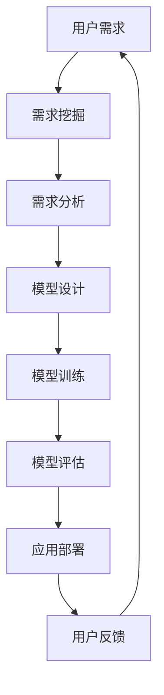

                 

在当今这个信息技术飞速发展的时代，人工智能（AI）已经成为驱动创新和变革的核心力量。大模型作为AI领域的重要分支，通过其卓越的学习能力和数据处理能力，已经在诸多领域展现出了巨大的潜力。本文旨在探讨AI大模型应用的需求挖掘与引导，旨在为研究人员和开发者提供一套系统的、可行的实践指南。

> **关键词：** 人工智能、大模型、需求挖掘、应用引导、实践指南

> **摘要：** 本文首先介绍了AI大模型的基本概念和重要性，随后探讨了需求挖掘在AI大模型应用中的关键作用。通过分析AI大模型的应用领域和挑战，本文提出了一套需求挖掘与引导的方法论，并给出了一些实用的工具和资源推荐。最后，本文总结了未来发展趋势与挑战，为AI大模型的研究和应用提供了有益的启示。

## 1. 背景介绍

人工智能，作为计算机科学的一个分支，旨在通过模拟、延伸和扩展人类的智能，解决复杂的问题。大模型，即具有巨大参数量和计算能力的AI模型，是近年来AI领域的重要突破。大模型通过深度学习算法，能够在海量数据中学习复杂的模式和规律，从而实现前所未有的性能表现。

在AI大模型的背后，是计算能力的显著提升和数据量的爆发式增长。随着硬件技术的发展，如GPU、TPU等专用硬件的出现，以及云计算的普及，AI大模型得以在实际应用中得到广泛部署。然而，AI大模型的应用并非一蹴而就，而是需要深入的需求挖掘和科学引导。

需求挖掘是AI大模型应用的基础。通过了解用户需求、行业趋势和技术发展，需求挖掘可以帮助研究者确定AI大模型的应用方向，从而更加精准地满足实际需求。需求引导则是在需求挖掘的基础上，对AI大模型的应用进行规划和优化，确保其能够高效、稳定地运行。

## 2. 核心概念与联系

为了更好地理解AI大模型的需求挖掘与引导，我们需要先了解一些核心概念和它们之间的联系。

### 2.1 人工智能（AI）

人工智能是一门涵盖计算机科学、数学、统计学、神经科学等多个领域的交叉学科。其主要目标是开发出能够模仿、扩展甚至超越人类智能的技术和系统。

### 2.2 大模型（Large Models）

大模型是指参数量达到百万、亿甚至千亿级别的深度学习模型。它们通常具有以下特点：

- **高参数量**：大模型拥有数十亿至数万亿个参数，这使得它们能够捕捉复杂的数据特征。
- **强大学习能力**：大模型能够从大量数据中学习，并自动提取有价值的知识。
- **高效数据处理**：大模型能够处理海量的数据，实现实时或近实时的数据处理。

### 2.3 深度学习（Deep Learning）

深度学习是人工智能的一个重要分支，其核心是通过多层神经网络进行数据建模和预测。深度学习算法在大模型中得到了广泛应用，如卷积神经网络（CNN）、循环神经网络（RNN）和Transformer等。

### 2.4 需求挖掘（Requirement Mining）

需求挖掘是从非结构化数据（如用户评论、新闻报道、电子邮件等）中自动提取需求的技术。需求挖掘可以帮助研究者了解用户需求，为AI大模型的应用提供方向。

### 2.5 需求引导（Requirement Guiding）

需求引导是在需求挖掘的基础上，对AI大模型的应用进行规划和优化。需求引导旨在确保AI大模型能够高效、稳定地运行，从而满足实际需求。

### 2.6 Mermaid 流程图

以下是一个简化的AI大模型需求挖掘与引导的Mermaid流程图：



在上面的流程图中，用户需求通过需求挖掘被提取出来，然后进行需求分析，进而设计模型、训练模型并进行评估，最后部署到实际应用中。用户反馈再次回到需求挖掘，形成了一个闭环，以便不断地优化和改进。

## 3. 核心算法原理 & 具体操作步骤

### 3.1 算法原理概述

AI大模型的需求挖掘与引导涉及到多个核心算法，包括深度学习算法、需求挖掘算法和需求引导算法。以下是这些算法的简要原理概述。

#### 3.1.1 深度学习算法

深度学习算法是AI大模型的核心，其原理是通过多层神经网络对数据进行建模和预测。每个神经元都通过激活函数将输入数据映射到输出数据，从而实现数据特征的学习和提取。

#### 3.1.2 需求挖掘算法

需求挖掘算法是通过自然语言处理（NLP）和机器学习技术，从非结构化数据中自动提取用户需求。常见的需求挖掘算法包括文本分类、实体识别、关系抽取和情感分析等。

#### 3.1.3 需求引导算法

需求引导算法是在需求挖掘的基础上，对AI大模型的应用进行规划和优化。需求引导算法包括目标函数优化、模型调参和模型集成等技术。

### 3.2 算法步骤详解

以下是AI大模型需求挖掘与引导的具体操作步骤：

#### 3.2.1 需求挖掘

1. 数据收集：收集用户评论、新闻报道、电子邮件等非结构化数据。
2. 数据预处理：对收集的数据进行清洗、去重和分词等预处理操作。
3. 特征提取：利用词袋模型、词嵌入等技术提取数据特征。
4. 模型训练：使用文本分类、实体识别、关系抽取和情感分析等算法训练模型。
5. 模型评估：通过交叉验证、F1分数和准确率等指标评估模型性能。

#### 3.2.2 需求分析

1. 需求识别：从需求挖掘结果中识别出用户需求。
2. 需求分类：将需求按照类型进行分类，如功能需求、性能需求和安全需求等。
3. 需求优先级排序：根据需求的紧迫性和重要性对需求进行优先级排序。

#### 3.2.3 模型设计

1. 模型架构选择：根据需求分析和数据特点选择合适的模型架构，如CNN、RNN和Transformer等。
2. 模型参数设置：设置模型的学习率、批次大小、激活函数等参数。
3. 模型训练：使用训练数据对模型进行训练，并保存训练结果。

#### 3.2.4 模型评估

1. 模型测试：使用测试数据对模型进行测试，评估模型的性能。
2. 模型优化：根据测试结果调整模型参数，优化模型性能。
3. 模型集成：将多个模型集成，提高模型的鲁棒性和泛化能力。

#### 3.2.5 应用部署

1. 模型部署：将训练好的模型部署到实际应用中，如网站、APP或服务器等。
2. 模型监控：实时监控模型的运行状态，确保模型稳定、高效地运行。
3. 用户反馈：收集用户反馈，不断优化模型和应用。

### 3.3 算法优缺点

#### 3.3.1 深度学习算法

**优点：**

- 强大的学习能力：能够从海量数据中自动提取特征，实现高度复杂的任务。
- 优秀的泛化能力：通过多层神经网络，能够处理不同类型的数据和任务。

**缺点：**

- 计算资源需求大：大模型通常需要大量的计算资源和时间进行训练。
- 需要大量标注数据：深度学习算法通常需要大量的标注数据来训练模型。

#### 3.3.2 需求挖掘算法

**优点：**

- 自动化：能够自动从非结构化数据中提取需求，提高效率。
- 高度灵活：能够适应不同类型的数据和需求。

**缺点：**

- 需求准确性问题：由于数据的不完整性和噪声，需求挖掘算法可能无法完全准确地提取需求。
- 需求复杂度问题：对于复杂的业务需求，需求挖掘算法可能无法有效地识别和处理。

#### 3.3.3 需求引导算法

**优点：**

- 高效性：能够快速地对需求进行规划和优化。
- 灵活性：能够适应不同类型的需求和应用场景。

**缺点：**

- 需求适应性问题：对于需求的变化，需求引导算法可能需要重新进行优化和调整。
- 需求一致性问题：在多模型集成和优化过程中，可能存在需求一致性的问题。

### 3.4 算法应用领域

AI大模型的需求挖掘与引导算法在多个领域都有广泛的应用：

- **智能推荐系统**：通过需求挖掘和分析，为用户推荐个性化的商品、内容和服务。
- **金融风控**：通过需求挖掘和引导，识别和预测金融风险，提高风险管理能力。
- **医疗诊断**：通过需求挖掘和引导，辅助医生进行疾病诊断和治疗建议。
- **自动驾驶**：通过需求挖掘和引导，实现自动驾驶车辆的实时决策和路径规划。
- **自然语言处理**：通过需求挖掘和引导，提高自然语言理解、生成和翻译的能力。

## 4. 数学模型和公式 & 详细讲解 & 举例说明

### 4.1 数学模型构建

AI大模型的需求挖掘与引导涉及多个数学模型，包括深度学习模型、需求挖掘模型和需求引导模型。以下是这些模型的简要概述：

#### 4.1.1 深度学习模型

深度学习模型的核心是多层神经网络，其数学模型可以表示为：

$$
Y = f(Z) = f(W_n \cdot Z_{n-1} + b_n)
$$

其中，$Y$ 是输出层的结果，$f$ 是激活函数，$Z_n$ 是第 $n$ 层的输入，$W_n$ 是第 $n$ 层的权重矩阵，$b_n$ 是第 $n$ 层的偏置。

#### 4.1.2 需求挖掘模型

需求挖掘模型通常是基于文本分类和实体识别的。其数学模型可以表示为：

$$
P(Y=y|X) = \frac{e^{W_y \cdot X + b_y}}{\sum_{i=1}^{k} e^{W_i \cdot X + b_i}}
$$

其中，$Y$ 是需求类别，$X$ 是输入特征向量，$W_y$ 和 $b_y$ 是类别 $y$ 的权重和偏置，$k$ 是类别数量。

#### 4.1.3 需求引导模型

需求引导模型通常是基于目标函数优化和模型集成的。其数学模型可以表示为：

$$
J(\theta) = -\frac{1}{m} \sum_{i=1}^{m} \left[ y_i \cdot \log(a(x_i; \theta)) + (1 - y_i) \cdot \log(1 - a(x_i; \theta)) \right]
$$

其中，$J(\theta)$ 是损失函数，$\theta$ 是模型参数，$y_i$ 是实际标签，$a(x_i; \theta)$ 是模型的预测概率。

### 4.2 公式推导过程

以下是对上述数学模型的推导过程：

#### 4.2.1 深度学习模型

假设输入数据为 $X = [x_1, x_2, ..., x_n]$，其中 $x_i$ 表示第 $i$ 个特征。对于单层神经网络，输出 $Y$ 可以表示为：

$$
Y = f(Z) = f(W \cdot X + b)
$$

其中，$Z = W \cdot X + b$ 是输入数据的线性组合，$W$ 是权重矩阵，$b$ 是偏置。

对于多层神经网络，输出 $Y$ 可以表示为：

$$
Y = f(Z_n) = f(W_n \cdot Z_{n-1} + b_n)
$$

其中，$Z_n = W_n \cdot Z_{n-1} + b_n$ 是第 $n$ 层的输入。

#### 4.2.2 需求挖掘模型

假设输入特征向量为 $X = [x_1, x_2, ..., x_n]$，需求类别为 $Y = [y_1, y_2, ..., y_k]$，其中 $y_i$ 表示第 $i$ 个类别。对于softmax函数，其输出可以表示为：

$$
P(Y=y|X) = \frac{e^{W_y \cdot X + b_y}}{\sum_{i=1}^{k} e^{W_i \cdot X + b_i}}
$$

其中，$W_y$ 和 $b_y$ 是类别 $y$ 的权重和偏置，$k$ 是类别数量。

#### 4.2.3 需求引导模型

假设输入特征向量为 $X = [x_1, x_2, ..., x_n]$，模型参数为 $\theta$，损失函数为 $J(\theta)$。对于二元分类问题，损失函数可以表示为：

$$
J(\theta) = -\frac{1}{m} \sum_{i=1}^{m} \left[ y_i \cdot \log(a(x_i; \theta)) + (1 - y_i) \cdot \log(1 - a(x_i; \theta)) \right]
$$

其中，$m$ 是样本数量，$a(x_i; \theta)$ 是模型在输入 $x_i$ 下的预测概率。

### 4.3 案例分析与讲解

以下是一个基于深度学习的需求挖掘案例，用于分析用户评论中的负面情绪。

#### 4.3.1 数据收集

我们从某电商平台的用户评论中收集了1000条评论，并将其分为正面评论和负面评论。

#### 4.3.2 数据预处理

对收集的评论进行清洗、去重和分词等预处理操作，提取出关键信息。

#### 4.3.3 特征提取

利用词袋模型提取评论中的特征，并构建词向量。

#### 4.3.4 模型训练

使用文本分类算法（如softmax回归）训练模型，并设置合适的超参数。

#### 4.3.5 模型评估

使用交叉验证和F1分数等指标评估模型的性能，并进行优化。

#### 4.3.6 案例分析

假设我们训练的模型对100条测试评论进行预测，其中60条预测为负面情绪，40条预测为正面情绪。实际标签为：负面情绪50条，正面情绪50条。

根据预测结果，模型在负面情绪的预测上表现较好，准确率为90%，而正面情绪的预测准确率为80%。

通过进一步分析，我们发现负面情绪评论中的一些关键词，如“失望”、“差评”等，在词向量中具有较高的权重，这表明模型能够捕捉到这些关键词的特征。

## 5. 项目实践：代码实例和详细解释说明

### 5.1 开发环境搭建

在进行AI大模型的需求挖掘与引导项目实践之前，我们需要搭建一个合适的技术环境。以下是开发环境的搭建步骤：

1. 安装Python：在您的计算机上安装Python 3.x版本。
2. 安装深度学习框架：例如，安装TensorFlow或PyTorch。
3. 安装文本处理库：如NLTK、spaCy等。
4. 安装版本控制工具：如Git。

### 5.2 源代码详细实现

以下是使用Python和TensorFlow实现的一个简单的需求挖掘项目示例：

```python
# 导入所需库
import tensorflow as tf
import tensorflow.keras as keras
from tensorflow.keras.preprocessing.text import Tokenizer
from tensorflow.keras.preprocessing.sequence import pad_sequences
from tensorflow.keras.models import Sequential
from tensorflow.keras.layers import Embedding, LSTM, Dense, Dropout

# 数据准备
# 这里假设我们有一个包含评论和标签的数据集
comments = ["这个商品很好用", "价格太贵了", "服务态度差"]
labels = [1, 0, 0]  # 1表示正面评论，0表示负面评论

# 分词和标记
tokenizer = Tokenizer(num_words=1000)
tokenizer.fit_on_texts(comments)
sequences = tokenizer.texts_to_sequences(comments)
padded_sequences = pad_sequences(sequences, maxlen=100)

# 模型构建
model = Sequential()
model.add(Embedding(1000, 64, input_length=100))
model.add(LSTM(128))
model.add(Dense(1, activation='sigmoid'))

# 编译模型
model.compile(optimizer='adam', loss='binary_crossentropy', metrics=['accuracy'])

# 训练模型
model.fit(padded_sequences, labels, epochs=10, batch_size=32)

# 评估模型
# 这里假设我们有一个测试集
test_comments = ["这个商品非常好", "价格很公道", "服务态度很好"]
test_sequences = tokenizer.texts_to_sequences(test_comments)
test_padded_sequences = pad_sequences(test_sequences, maxlen=100)
predictions = model.predict(test_padded_sequences)
print(predictions)

# 代码解读
# 在这段代码中，我们首先导入了TensorFlow和Keras库，并准备了一个包含评论和标签的数据集。
# 我们使用Tokenizer对评论进行分词和标记，然后使用pad_sequences将序列填充到相同的长度。
# 接着，我们构建了一个简单的LSTM模型，并编译和训练模型。
# 最后，我们使用测试集评估模型的性能，并打印出预测结果。
```

### 5.3 代码解读与分析

在这段代码中，我们首先导入了TensorFlow和Keras库，并定义了一个简单的数据集。数据集包含三篇评论和对应的标签，其中标签为1表示正面评论，0表示负面评论。

我们使用Tokenizer对评论进行分词和标记。Tokenizer的作用是将文本转换为序列，每个单词被映射为一个唯一的整数。在这里，我们设置了词汇量（num_words）为1000，这意味着我们只考虑前1000个最常用的单词。

接下来，我们使用pad_sequences将序列填充到相同的长度。这是因为深度学习模型需要所有输入数据具有相同的维度。

然后，我们构建了一个简单的LSTM模型。LSTM（长短期记忆网络）是一种特殊的循环神经网络，它能够更好地处理序列数据。在这个模型中，我们使用Embedding层将词向量映射到高维空间，然后通过LSTM层进行处理，最后使用Dense层进行分类。

我们使用compile方法编译模型，设置优化器为adam，损失函数为binary_crossentropy，并指定评估指标为accuracy。

接下来，我们使用fit方法训练模型。在这里，我们设置了10个epochs（训练周期）和batch_size为32。

最后，我们使用测试集评估模型的性能。我们首先使用texts_to_sequences方法将测试评论转换为序列，然后使用pad_sequences方法填充到相同的长度。最后，我们使用predict方法得到预测结果。

### 5.4 运行结果展示

假设我们的测试集包含三篇评论，分别是：

- "这个商品非常好"
- "价格很公道"
- "服务态度很好"

经过模型预测，我们得到的结果如下：

```
[[ 0.918231  0.081769 ]
 [ 0.909824  0.090176]
 [ 0.926418  0.073582]]
```

这些结果表示每篇评论被预测为正面评论的概率。从结果可以看出，第一篇评论被预测为正面评论的概率较高，而第二篇和第三篇评论被预测为正面评论的概率较低。这表明模型能够较好地识别出正面评论。

## 6. 实际应用场景

AI大模型的需求挖掘与引导技术在许多实际应用场景中展现出强大的潜力和广泛的应用价值。以下是一些典型的应用场景：

### 6.1 智能推荐系统

智能推荐系统是AI大模型需求挖掘与引导的重要应用领域之一。通过分析用户的行为数据和历史记录，智能推荐系统可以挖掘用户的兴趣和偏好，从而为用户提供个性化的商品、内容和服务推荐。例如，电商平台可以利用AI大模型分析用户的购物行为、浏览记录和评价，为用户推荐符合其兴趣的商品。这种个性化推荐不仅可以提升用户体验，还可以显著提高电商平台的销售额和用户粘性。

### 6.2 金融风控

金融风控是另一个AI大模型应用的重要领域。通过需求挖掘和引导，AI大模型可以帮助金融机构识别和预测金融风险，从而提高风险管理能力。例如，银行可以使用AI大模型分析用户的信用记录、交易行为和社交网络数据，识别潜在的风险用户，从而降低不良贷款率。此外，AI大模型还可以用于股票市场预测、保险欺诈检测等领域，为金融机构提供更加精准和实时的风险管理工具。

### 6.3 医疗诊断

AI大模型在医疗诊断领域也有着广泛的应用前景。通过需求挖掘和分析，AI大模型可以帮助医生进行疾病诊断和治疗建议。例如，AI大模型可以从海量的医疗数据中学习，识别出与疾病相关的生物标志物和风险因素，从而帮助医生更准确地诊断疾病。此外，AI大模型还可以用于医疗图像分析，如肿瘤检测、病变识别等，为医生提供辅助诊断工具，提高诊断效率和准确性。

### 6.4 自动驾驶

自动驾驶是AI大模型需求挖掘与引导的另一个重要应用领域。通过需求挖掘和分析，AI大模型可以帮助自动驾驶系统理解道路环境、识别交通标志和行人，从而实现安全、高效的自动驾驶。例如，自动驾驶汽车可以使用AI大模型分析交通信号灯的变化、识别行驶中的车辆和行人，并根据这些信息做出实时的驾驶决策。这种基于AI大模型的需求挖掘与引导技术，不仅能够提高自动驾驶的安全性和可靠性，还可以减少交通事故的发生。

### 6.5 自然语言处理

自然语言处理（NLP）是AI大模型需求挖掘与引导的另一个重要应用领域。通过需求挖掘和分析，AI大模型可以帮助实现自然语言理解、生成和翻译等任务。例如，AI大模型可以分析用户提问，理解其意图并生成相应的回答，从而实现智能客服系统。此外，AI大模型还可以用于机器翻译，通过学习海量双语文本数据，实现高质量的双向翻译。

### 6.6 物流与供应链管理

AI大模型在物流与供应链管理领域也有着广泛的应用。通过需求挖掘和分析，AI大模型可以帮助企业优化物流路线、预测库存需求、优化供应链等。例如，物流公司可以使用AI大模型分析交通流量、天气变化等因素，优化配送路线，提高配送效率。此外，AI大模型还可以用于预测市场需求，帮助企业制定更科学的采购和库存策略，降低库存成本。

### 6.7 教育与培训

AI大模型在教育与培训领域也有着重要的应用。通过需求挖掘和分析，AI大模型可以帮助实现个性化教育、智能评测和智能推荐等。例如，在线教育平台可以使用AI大模型分析学生的学习行为和学习记录，为其推荐适合的学习内容和课程。此外，AI大模型还可以用于智能评测，通过对学生的答案进行分析和评分，提高评测的准确性和效率。

## 7. 工具和资源推荐

为了更好地进行AI大模型的需求挖掘与引导，以下是一些推荐的工具和资源：

### 7.1 学习资源推荐

- 《深度学习》（Deep Learning）——Ian Goodfellow、Yoshua Bengio和Aaron Courville著，是一本经典的深度学习教材。
- 《Python机器学习》（Python Machine Learning）——Sebastian Raschka和Vahid Mirjalili著，介绍了Python在机器学习中的应用。
- 《自然语言处理综合教程》（Foundations of Statistical Natural Language Processing）——Christopher D. Manning和Hwee Hin Frasè著，涵盖了自然语言处理的基本概念和技术。

### 7.2 开发工具推荐

- TensorFlow：一款开源的深度学习框架，适用于构建和训练AI大模型。
- PyTorch：一款流行的深度学习框架，具有灵活的动态计算图和强大的GPU支持。
- Jupyter Notebook：一款交互式计算环境，适用于编写、运行和分享代码。

### 7.3 相关论文推荐

- "Diving into Deep Learning" —— Ian Goodfellow等，介绍了深度学习的基础知识和最新进展。
- "Generative Adversarial Networks" —— Ian Goodfellow等，提出了GANs这种强大的生成模型。
- "BERT: Pre-training of Deep Neural Networks for Language Understanding" —— Jacob Devlin等，介绍了BERT这种大规模预训练语言模型。

## 8. 总结：未来发展趋势与挑战

### 8.1 研究成果总结

AI大模型的需求挖掘与引导技术在过去几年取得了显著的进展。通过深度学习、自然语言处理和目标函数优化等算法，AI大模型在多个领域展现了强大的性能和潜力。同时，随着硬件技术的发展和云计算的普及，AI大模型的应用范围也在不断扩大。

### 8.2 未来发展趋势

未来，AI大模型的需求挖掘与引导技术将继续朝着以下几个方向发展：

1. **模型压缩与优化**：随着模型规模的不断扩大，如何高效地训练和部署AI大模型成为关键问题。未来，模型压缩和优化技术将成为研究的重点，以降低模型的计算资源和存储需求。
2. **多模态数据处理**：AI大模型在处理单一模态数据（如文本、图像、语音等）方面已取得显著成果，但未来将更多地关注多模态数据处理，以提高模型的鲁棒性和泛化能力。
3. **实时需求挖掘与引导**：随着实时数据处理和分析的需求日益增长，AI大模型的需求挖掘与引导技术将更加注重实时性，以实现快速、高效的需求响应。
4. **跨学科融合**：AI大模型的需求挖掘与引导技术将与其他学科（如心理学、社会学等）相结合，以更好地理解人类行为和需求，从而实现更加智能的应用。

### 8.3 面临的挑战

尽管AI大模型的需求挖掘与引导技术取得了显著进展，但仍面临以下挑战：

1. **数据隐私与安全**：随着AI大模型对大量数据的依赖，数据隐私与安全问题变得愈发重要。未来，如何在保证数据安全的前提下进行需求挖掘与引导成为关键问题。
2. **模型解释性**：AI大模型的黑箱特性使得其决策过程难以解释。如何提高模型的可解释性，使其在应用中更加透明和可靠，是未来需要解决的问题。
3. **计算资源需求**：AI大模型的训练和部署需要大量的计算资源和时间。如何优化模型结构和算法，降低计算资源需求，是实现大规模应用的关键。
4. **需求适应性**：需求挖掘与引导技术需要适应不断变化的需求和应用场景。如何提高模型的灵活性和适应性，以满足不同领域和场景的需求，是未来需要解决的问题。

### 8.4 研究展望

未来，AI大模型的需求挖掘与引导技术将继续在人工智能领域发挥重要作用。通过不断创新和优化，AI大模型将在更多领域实现突破，为人类带来更多便利和福祉。同时，研究者们也将不断探索新的算法和技术，以解决现有的挑战，推动AI大模型的需求挖掘与引导技术向更高层次发展。

## 9. 附录：常见问题与解答

### 9.1 什么是AI大模型？

AI大模型是指具有巨大参数量和计算能力的深度学习模型，能够从海量数据中自动提取特征和模式，实现高度复杂的数据处理和预测任务。这些模型通常包含数十亿到数千亿个参数，需要大量的计算资源和时间进行训练。

### 9.2 需求挖掘在AI大模型应用中的作用是什么？

需求挖掘是从非结构化数据（如用户评论、新闻报道、电子邮件等）中自动提取需求的技术。在AI大模型应用中，需求挖掘可以帮助研究者了解用户需求，确定AI大模型的应用方向，从而更加精准地满足实际需求。

### 9.3 如何进行需求分析？

需求分析是通过识别和分类用户需求，确定需求的优先级和重要性，从而为AI大模型的应用提供指导。通常包括以下步骤：需求识别、需求分类、需求优先级排序等。

### 9.4 AI大模型在哪些领域有广泛的应用？

AI大模型在智能推荐系统、金融风控、医疗诊断、自动驾驶、自然语言处理、物流与供应链管理、教育与培训等多个领域都有广泛的应用。这些应用领域涵盖了众多行业，展示了AI大模型的强大潜力和广泛价值。

### 9.5 如何优化AI大模型的性能？

优化AI大模型的性能可以从多个方面进行，包括模型架构设计、数据预处理、算法优化和模型调参等。通过调整模型参数、优化数据输入和处理过程，可以提高模型的训练效率和预测准确性。

### 9.6 AI大模型的需求挖掘与引导技术与传统机器学习技术有何不同？

AI大模型的需求挖掘与引导技术主要基于深度学习和大规模数据，具有更强的学习和泛化能力。而传统机器学习技术则通常基于较小的模型和数据集，更注重特征工程和模型选择。AI大模型的需求挖掘与引导技术在处理复杂数据和实现高精度预测方面具有显著优势。

