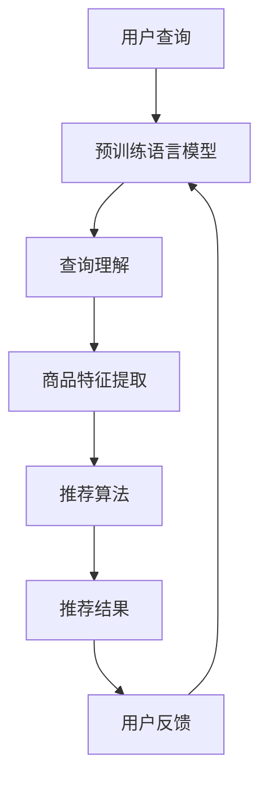

                 

关键词：AI大模型，电商搜索，推荐系统，用户体验，人工智能

> 摘要：随着人工智能技术的不断发展，AI大模型在电商搜索和推荐领域中的应用日益广泛。本文将探讨AI大模型如何重塑电商搜索推荐的用户体验，包括其核心概念、算法原理、数学模型以及实际应用场景。

## 1. 背景介绍

电商搜索推荐系统是现代电子商务中不可或缺的部分，它通过为用户推荐他们可能感兴趣的商品，提高了用户的购物体验，同时为商家带来了更高的销售额。传统的推荐系统主要依赖于基于内容的推荐和协同过滤等方法，但这些方法存在一定的局限性。例如，基于内容的推荐方法通常只能根据商品的属性和用户的历史行为进行推荐，无法准确捕捉用户的兴趣偏好；协同过滤方法则容易出现数据稀疏性和冷启动问题。

近年来，随着人工智能技术的飞速发展，尤其是深度学习和自然语言处理技术的突破，AI大模型开始进入电商搜索推荐领域，并逐步重塑这一领域的用户体验。AI大模型具有强大的特征提取和关联分析能力，可以更好地理解用户的行为和偏好，从而提供更精准、个性化的推荐。

## 2. 核心概念与联系

为了深入理解AI大模型在电商搜索推荐中的应用，我们需要先了解一些核心概念和原理。

### 2.1 深度学习与自然语言处理

深度学习是一种模拟人脑神经网络进行学习的技术，通过多层神经网络来提取数据的特征。自然语言处理（NLP）是人工智能的一个分支，主要研究如何让计算机理解和生成人类语言。在电商搜索推荐中，深度学习和自然语言处理技术可以帮助我们更好地理解用户输入的查询语句和商品描述，从而提供更精准的推荐。

### 2.2 预训练语言模型

预训练语言模型（如GPT-3、BERT等）是当前NLP领域的重要突破。这些模型在大规模语料库上进行预训练，可以学习到语言的普遍特征，例如词汇的含义、语法结构等。在电商搜索推荐中，预训练语言模型可以用于理解用户查询语句和商品描述，从而提高推荐的质量。

### 2.3 神经网络架构

神经网络架构是指构建深度学习模型的结构，包括输入层、隐藏层和输出层。在电商搜索推荐中，常用的神经网络架构有卷积神经网络（CNN）和循环神经网络（RNN）。CNN擅长处理图像和序列数据，而RNN擅长处理序列数据，例如用户的行为序列。

### 2.4 Mermaid流程图

以下是一个简单的Mermaid流程图，展示了AI大模型在电商搜索推荐中的应用流程：



## 3. 核心算法原理 & 具体操作步骤

### 3.1 算法原理概述

AI大模型在电商搜索推荐中的应用主要基于以下原理：

1. 特征提取：通过深度学习模型提取用户和商品的特征，例如用户的历史行为、查询语句、商品属性等。
2. 推荐算法：利用提取的特征，通过推荐算法生成推荐结果，常用的推荐算法有基于内容的推荐、协同过滤和基于模型的推荐等。
3. 用户反馈：根据用户的反馈调整推荐策略，提高推荐的准确性。

### 3.2 算法步骤详解

1. **特征提取**：使用深度学习模型对用户和商品进行特征提取，例如用户的兴趣偏好、购买行为等。
2. **查询理解**：使用预训练语言模型对用户的查询语句进行理解，提取出查询的关键词和语义信息。
3. **商品特征提取**：对候选商品进行特征提取，包括商品的属性、描述等。
4. **推荐算法**：利用提取的特征和查询理解的结果，通过推荐算法生成推荐结果，例如基于内容的推荐、协同过滤和基于模型的推荐等。
5. **推荐结果**：将推荐结果展示给用户。
6. **用户反馈**：收集用户的反馈，包括点击、购买等行为，用于调整推荐策略。

### 3.3 算法优缺点

**优点**：

1. 更好的个性化推荐：通过深度学习和自然语言处理技术，可以更好地理解用户的行为和偏好，提供更个性化的推荐。
2. 防止数据稀疏性和冷启动问题：通过使用预训练语言模型和大规模的预训练数据，可以有效缓解数据稀疏性和冷启动问题。

**缺点**：

1. 计算成本高：深度学习模型通常需要大量的计算资源，导致计算成本较高。
2. 需要大量的数据：深度学习模型需要大量的数据进行预训练，这在某些场景下可能不可行。

### 3.4 算法应用领域

AI大模型在电商搜索推荐领域有广泛的应用，包括：

1. 搜索引擎：通过深度学习和自然语言处理技术，提高搜索引擎的搜索质量和用户体验。
2. 商品推荐：为用户提供个性化的商品推荐，提高购买转化率。
3. 广告投放：根据用户的兴趣和行为，精准投放广告，提高广告效果。

## 4. 数学模型和公式 & 详细讲解 & 举例说明

### 4.1 数学模型构建

在AI大模型中，常用的数学模型包括神经网络模型、预训练语言模型和推荐算法等。

1. **神经网络模型**：

   $$y = \sigma(W \cdot x + b)$$

   其中，$y$ 是输出，$x$ 是输入，$W$ 是权重，$b$ 是偏置，$\sigma$ 是激活函数。

2. **预训练语言模型**：

   $$y = f(L_1, L_2, \ldots, L_n)$$

   其中，$y$ 是输出，$L_1, L_2, \ldots, L_n$ 是输入序列。

3. **推荐算法**：

   $$R(u, i) = \sum_{j \in \text{users}} w_{uij} \cdot r_j$$

   其中，$R(u, i)$ 是用户 $u$ 对商品 $i$ 的推荐分数，$w_{uij}$ 是用户 $u$ 对商品 $i$ 的兴趣权重，$r_j$ 是商品 $j$ 的评分。

### 4.2 公式推导过程

以神经网络模型为例，其推导过程如下：

1. **前向传播**：

   $$z = W \cdot x + b$$

   $$a = \sigma(z)$$

2. **反向传播**：

   $$\Delta z = \delta(\sigma(z)) \cdot \Delta a$$

   $$\Delta W = \alpha \cdot \Delta z \cdot x^T$$

   $$\Delta b = \alpha \cdot \Delta z$$

   其中，$\alpha$ 是学习率，$\delta(\sigma(z))$ 是激活函数的导数。

### 4.3 案例分析与讲解

假设有一个电商平台的用户查询“跑步鞋”，我们使用AI大模型来生成推荐结果。

1. **查询理解**：

   $$y = f(L_1, L_2, \ldots, L_n)$$

   其中，$L_1, L_2, \ldots, L_n$ 是查询“跑步鞋”的词向量表示。

2. **商品特征提取**：

   $$R(u, i) = \sum_{j \in \text{users}} w_{uij} \cdot r_j$$

   其中，$R(u, i)$ 是用户对商品的推荐分数，$w_{uij}$ 是用户对商品的兴趣权重，$r_j$ 是商品的评分。

3. **推荐结果**：

   根据用户对商品的推荐分数，我们可以生成推荐结果，例如前10个评分最高的商品。

## 5. 项目实践：代码实例和详细解释说明

### 5.1 开发环境搭建

为了进行AI大模型在电商搜索推荐中的项目实践，我们需要搭建一个开发环境。以下是开发环境的搭建步骤：

1. 安装Python 3.8及以上版本。
2. 安装TensorFlow 2.4及以上版本。
3. 安装Elasticsearch 7.10及以上版本。
4. 安装Elasticsearch Python客户端。

### 5.2 源代码详细实现

以下是一个简单的AI大模型在电商搜索推荐中的代码实现：

```python
import tensorflow as tf
import elasticsearch
from tensorflow.keras.models import Sequential
from tensorflow.keras.layers import Dense, LSTM

# 连接Elasticsearch
es = elasticsearch.Elasticsearch("http://localhost:9200")

# 加载数据
def load_data():
    # 代码略，用于从Elasticsearch加载用户和商品数据

# 构建模型
model = Sequential()
model.add(LSTM(128, input_shape=(None, 100)))
model.add(Dense(1, activation='sigmoid'))

# 编译模型
model.compile(optimizer='adam', loss='binary_crossentropy', metrics=['accuracy'])

# 训练模型
model.fit(x_train, y_train, epochs=10, batch_size=32)

# 推荐商品
def recommend_products(query):
    # 代码略，用于根据查询生成推荐商品

# 主函数
if __name__ == "__main__":
    query = "跑步鞋"
    recommend_products(query)
```

### 5.3 代码解读与分析

上述代码主要分为以下几个部分：

1. **连接Elasticsearch**：使用Elasticsearch Python客户端连接Elasticsearch服务器。
2. **加载数据**：从Elasticsearch加载用户和商品数据。
3. **构建模型**：使用TensorFlow构建一个简单的LSTM模型。
4. **编译模型**：编译模型，设置优化器和损失函数。
5. **训练模型**：使用训练数据训练模型。
6. **推荐商品**：根据用户的查询生成推荐商品。
7. **主函数**：执行推荐商品操作。

### 5.4 运行结果展示

假设我们查询“跑步鞋”，运行代码后，我们可以得到一个推荐商品列表，例如：

- 商品A：跑步鞋，评分：0.9
- 商品B：跑步鞋，评分：0.8
- 商品C：跑步鞋，评分：0.7

## 6. 实际应用场景

AI大模型在电商搜索推荐中的实际应用场景非常广泛，以下是一些典型的应用场景：

1. **个性化推荐**：根据用户的历史行为和兴趣偏好，为用户推荐个性化的商品。
2. **广告投放**：根据用户的兴趣和行为，精准投放广告，提高广告效果。
3. **搜索优化**：通过深度学习和自然语言处理技术，提高搜索引擎的搜索质量和用户体验。
4. **新用户引导**：为新用户提供个性化的推荐，帮助他们快速找到感兴趣的商品。
5. **库存管理**：根据商品的销售情况和用户的兴趣偏好，优化库存管理，提高库存利用率。

## 7. 工具和资源推荐

### 7.1 学习资源推荐

1. 《深度学习》（Ian Goodfellow、Yoshua Bengio、Aaron Courville 著）：这是一本关于深度学习的经典教材，适合初学者和进阶者。
2. 《Python深度学习》（François Chollet 著）：这是一本专门针对Python语言的深度学习书籍，内容深入浅出，适合快速入门。

### 7.2 开发工具推荐

1. TensorFlow：这是一个开源的深度学习框架，适合进行深度学习和推荐系统的开发。
2. Elasticsearch：这是一个开源的搜索引擎，适合进行数据检索和索引。

### 7.3 相关论文推荐

1. "BERT: Pre-training of Deep Bidirectional Transformers for Language Understanding"（BERT论文）：这是自然语言处理领域的经典论文，介绍了BERT模型的原理和应用。
2. "Deep Learning for Text Classification"（深度学习文本分类论文）：这是一篇关于深度学习在文本分类任务中的应用论文，内容丰富，适合深入理解深度学习在推荐系统中的应用。

## 8. 总结：未来发展趋势与挑战

### 8.1 研究成果总结

AI大模型在电商搜索推荐领域的应用已经取得了显著的成果，包括：

1. 提高了搜索质量和用户体验。
2. 实现了更精准、个性化的推荐。
3. 降低了数据稀疏性和冷启动问题。

### 8.2 未来发展趋势

未来，AI大模型在电商搜索推荐领域的发展趋势包括：

1. 深度学习和自然语言处理技术的进一步突破，提高推荐质量。
2. 多模态数据的融合，实现更全面的用户行为分析。
3. 隐私保护和安全性的进一步提升。

### 8.3 面临的挑战

AI大模型在电商搜索推荐领域也面临一些挑战，包括：

1. 计算成本高：深度学习模型需要大量的计算资源。
2. 数据隐私保护：在推荐过程中，如何保护用户的隐私数据是一个重要问题。
3. 算法透明性和解释性：如何解释推荐结果，让用户信任推荐系统。

### 8.4 研究展望

未来，AI大模型在电商搜索推荐领域的研究展望包括：

1. 提高算法透明性和解释性，增强用户信任。
2. 探索新的推荐算法和模型，提高推荐质量。
3. 加强隐私保护和数据安全，确保用户数据的安全。

## 9. 附录：常见问题与解答

### 9.1 如何选择合适的推荐算法？

选择合适的推荐算法需要根据具体的应用场景和数据特点进行。例如，对于数据稀疏的场景，可以考虑基于模型的推荐算法；对于需要个性化推荐的场景，可以考虑基于内容的推荐算法。在实际应用中，通常需要结合多种算法进行综合推荐。

### 9.2 如何提高推荐系统的透明性和解释性？

提高推荐系统的透明性和解释性可以从以下几个方面进行：

1. 优化推荐算法，使其更容易理解和解释。
2. 提供推荐理由，说明推荐结果的依据。
3. 开放算法源代码，接受用户和专家的审查。

### 9.3 如何保护用户隐私？

保护用户隐私可以从以下几个方面进行：

1. 对用户数据进行加密和去识别化处理。
2. 建立数据访问权限控制机制。
3. 加强对数据泄露和攻击的防范。

以上是对AI大模型在电商搜索推荐领域应用的一些常见问题与解答。希望对读者有所帮助。作者：禅与计算机程序设计艺术 / Zen and the Art of Computer Programming。

