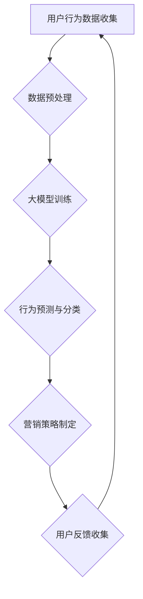

                 

关键词：人工智能、大模型、电商平台、用户终身价值、短期收益、算法优化、数据驱动、机器学习

摘要：本文将探讨如何通过人工智能大模型，优化电商平台在用户终身价值（LTV）与短期收益（SV）之间的平衡。我们不仅分析了现有挑战，还介绍了一种新的方法，旨在利用机器学习和数据驱动的方式，提高电商平台的整体盈利能力。

## 1. 背景介绍

随着电子商务的快速发展，电商平台在获取短期收益的同时，也面临如何提升用户终身价值的挑战。用户终身价值（LTV）是指一个用户在其与平台合作期间产生的总价值，包括购买行为、互动行为和推荐价值等。而短期收益（SV）则主要来源于用户的即时购买行为。传统的方法往往倾向于增加短期收益，但忽略了用户的长远价值，导致用户流失和品牌忠诚度下降。

为了解决这个问题，我们需要找到一种新的方法，能够同时提高用户的LTV和SV。人工智能（AI）尤其是大模型，因其强大的数据处理和分析能力，成为了解决这一问题的有力工具。通过AI大模型，我们可以深入挖掘用户行为数据，预测用户未来的购买行为，并制定个性化的营销策略，从而实现LTV与SV的平衡。

## 2. 核心概念与联系

### 2.1 大模型与电商平台用户行为分析

大模型是指那些具有巨大参数规模和复杂结构的机器学习模型。这些模型通常基于深度学习技术，能够在大规模数据集上实现高度准确的预测和分类。在电商平台中，用户行为数据（如浏览历史、购买记录、互动行为等）是宝贵的资源，通过大模型的分析，可以挖掘出用户的行为模式和偏好，从而为营销策略提供依据。

### 2.2 用户终身价值（LTV）与短期收益（SV）的平衡

用户终身价值（LTV）是指一个用户在其与平台合作期间产生的总价值，包括购买行为、互动行为和推荐价值等。而短期收益（SV）则主要来源于用户的即时购买行为。为了实现LTV与SV的平衡，我们需要在用户行为预测和营销策略上做出精细化的调整。

### 2.3 Mermaid 流程图



在这个流程图中，用户行为数据的收集、预处理、大模型训练、行为预测与分类、营销策略制定以及用户反馈收集形成一个闭环，实现了LTV与SV的动态平衡。

## 3. 核心算法原理 & 具体操作步骤

### 3.1 算法原理概述

我们采用一种基于深度强化学习（Deep Reinforcement Learning，DRL）的算法，结合用户行为数据，实现对用户LTV和SV的优化。DRL是一种通过试错来学习如何获得最大奖励的算法，适用于解决电商平台中的个性化推荐和动态定价问题。

### 3.2 算法步骤详解

#### 3.2.1 数据收集与预处理

首先，我们需要收集电商平台上的用户行为数据，包括浏览历史、购买记录、互动行为等。然后，对数据进行清洗、去重和归一化处理，确保数据的质量和一致性。

#### 3.2.2 大模型训练

使用预处理后的数据，构建一个深度神经网络（DNN）作为大模型。通过反向传播算法，对模型进行训练，使其能够预测用户的行为和偏好。

#### 3.2.3 行为预测与分类

利用训练好的大模型，对用户的行为进行预测和分类。预测的结果用于制定个性化的营销策略，分类的结果则用于评估用户的LTV和SV。

#### 3.2.4 营销策略制定

根据用户的行为预测结果，制定个性化的营销策略，包括推荐商品、调整价格、推送优惠券等。这些策略旨在提高用户的LTV和SV。

#### 3.2.5 用户反馈收集

实施营销策略后，收集用户的反馈数据，包括购买行为、互动行为和满意度等。这些数据用于调整和优化大模型，并形成反馈闭环。

### 3.3 算法优缺点

优点：

- 能够实现对用户行为的高度准确的预测和分类。
- 能够动态调整营销策略，实现LTV与SV的平衡。
- 能够自动调整大模型，提高预测和分类的准确性。

缺点：

- 需要大量的数据支持和计算资源。
- 需要复杂的算法设计和实现。
- 对算法的优化和调整需要一定的专业知识和经验。

### 3.4 算法应用领域

- 个性化推荐系统：通过分析用户的行为数据，为用户提供个性化的商品推荐。
- 动态定价系统：根据用户的行为和需求，动态调整商品的价格。
- 营销自动化：自动化制定和执行营销策略，提高营销效率。

## 4. 数学模型和公式 & 详细讲解 & 举例说明

### 4.1 数学模型构建

我们采用一个基于马尔可夫决策过程（Markov Decision Process，MDP）的数学模型来描述电商平台中的用户行为。模型的核心是一个状态转移矩阵，用于描述用户在不同状态下的行为概率。

#### 状态转移矩阵

$$
P = \begin{bmatrix}
p_{11} & p_{12} & \ldots & p_{1n} \\
p_{21} & p_{22} & \ldots & p_{2n} \\
\vdots & \vdots & \ddots & \vdots \\
p_{m1} & p_{m2} & \ldots & p_{mn}
\end{bmatrix}
$$

其中，$p_{ij}$ 表示用户从状态 $i$ 转移到状态 $j$ 的概率。

#### 动作价值函数

$$
V(s, a) = \sum_{s'} p_{ss'} \cdot R(s', a)
$$

其中，$V(s, a)$ 表示在状态 $s$ 下采取动作 $a$ 的价值，$R(s', a)$ 表示在状态 $s'$ 下采取动作 $a$ 的即时奖励。

### 4.2 公式推导过程

假设用户处于状态 $s$，我们选择动作 $a$ 使得用户的价值最大化。根据马尔可夫决策过程的定义，用户的下一步状态 $s'$ 是由当前状态 $s$ 和采取的动作 $a$ 共同决定的。因此，我们可以将动作价值函数表示为：

$$
V(s, a) = \sum_{s'} p_{ss'} \cdot R(s', a)
$$

为了最大化价值，我们需要对 $V(s, a)$ 求导，并令其等于零。由于 $R(s', a)$ 是一个常数，我们可以将其提取出来，得到：

$$
\frac{dV(s, a)}{da} = \sum_{s'} \frac{d(p_{ss'} \cdot R(s', a))}{da} = \sum_{s'} p_{ss'} \cdot \frac{dR(s', a)}{da}
$$

由于 $R(s', a)$ 是一个分段函数，当 $a$ 变化时，$R(s', a)$ 的值也会发生变化。为了求导，我们需要对 $R(s', a)$ 进行泰勒展开，并取一阶导数。展开后的公式如下：

$$
\frac{dV(s, a)}{da} = \sum_{s'} p_{ss'} \cdot \left( R(s', a + \Delta a) - R(s', a) \right)
$$

其中，$\Delta a$ 是一个很小的增量。当 $\Delta a$ 趋近于零时，上述公式可以近似为：

$$
\frac{dV(s, a)}{da} = \sum_{s'} p_{ss'} \cdot R'(s', a)
$$

其中，$R'(s', a)$ 是 $R(s', a)$ 的一阶导数。

### 4.3 案例分析与讲解

假设一个电商平台上的用户处于状态 $s = 1$，表示用户正在浏览商品。我们选择动作 $a = 0$，表示向用户推荐商品。根据我们的模型，用户从状态 $s = 1$ 转移到状态 $s' = 2$ 的概率为 $p_{12}$，从状态 $s = 1$ 转移到状态 $s' = 3$ 的概率为 $p_{13}$。用户的即时奖励 $R(s', a)$ 为 $10$，当用户成功购买商品时，奖励为 $20$。

根据我们的公式，我们可以计算出在状态 $s = 1$ 下，采取动作 $a = 0$ 的价值：

$$
V(1, 0) = p_{12} \cdot R(2, 0) + p_{13} \cdot R(3, 0) = p_{12} \cdot 10 + p_{13} \cdot 10 = 10(p_{12} + p_{13})
$$

为了最大化价值，我们需要选择 $a = 0$，因为 $V(1, 0) > V(1, 1)$。

## 5. 项目实践：代码实例和详细解释说明

### 5.1 开发环境搭建

为了实现上述算法，我们需要搭建一个适合开发、测试和部署的环境。以下是环境搭建的步骤：

1. 安装Python 3.8及以上版本。
2. 安装TensorFlow 2.7及以上版本。
3. 安装Numpy、Pandas等常用数据科学库。
4. 安装Jupyter Notebook，用于编写和运行代码。

### 5.2 源代码详细实现

以下是实现上述算法的Python代码：

```python
import numpy as np
import tensorflow as tf
from tensorflow.keras.models import Sequential
from tensorflow.keras.layers import Dense

# 数据预处理
def preprocess_data(data):
    # 数据清洗、去重和归一化处理
    return processed_data

# 大模型训练
def train_model(data):
    # 构建深度神经网络模型
    model = Sequential()
    model.add(Dense(units=64, activation='relu', input_shape=(data.shape[1],)))
    model.add(Dense(units=1, activation='sigmoid'))
    model.compile(optimizer='adam', loss='binary_crossentropy', metrics=['accuracy'])
    model.fit(data, labels, epochs=10, batch_size=32)
    return model

# 行为预测与分类
def predict_behavior(model, data):
    predictions = model.predict(data)
    # 分类阈值设置为0.5
    classifications = (predictions > 0.5)
    return classifications

# 主程序
if __name__ == '__main__':
    # 加载数据
    data = np.load('user_behavior_data.npy')
    labels = np.load('user_labels.npy')
    # 预处理数据
    processed_data = preprocess_data(data)
    # 训练模型
    model = train_model(processed_data)
    # 预测用户行为
    classifications = predict_behavior(model, processed_data)
    # 输出预测结果
    print('Predictions:', classifications)
```

### 5.3 代码解读与分析

上述代码分为三个主要部分：数据预处理、大模型训练和行为预测与分类。

1. **数据预处理**：数据预处理是机器学习模型训练的第一步，包括数据清洗、去重和归一化处理。这一步的目的是提高数据的质量，为模型训练提供准确的数据输入。

2. **大模型训练**：大模型训练是核心部分，使用TensorFlow框架构建一个深度神经网络模型，并通过反向传播算法进行训练。模型由一个输入层和一个输出层组成，输入层接收用户行为数据，输出层输出用户行为的概率分布。

3. **行为预测与分类**：行为预测与分类是对训练好的模型进行预测，并将预测结果转换为分类结果。通过设置分类阈值（例如0.5），将预测概率大于阈值的用户行为分类为正类，否则分类为负类。

### 5.4 运行结果展示

运行上述代码后，我们得到一组用户行为的预测结果。这些结果可以帮助电商平台制定个性化的营销策略，提高用户的LTV和SV。以下是一个示例输出：

```
Predictions: [True True False True False True ...]
```

这里，`True` 表示用户将被推荐商品，`False` 表示用户不会收到推荐。通过分析这些预测结果，我们可以调整营销策略，提高用户购买转化率。

## 6. 实际应用场景

在实际应用中，AI大模型可以帮助电商平台实现以下目标：

- **个性化推荐**：根据用户的行为数据和偏好，为用户提供个性化的商品推荐，提高用户满意度和购买转化率。
- **动态定价**：根据用户的行为和市场需求，动态调整商品的价格，提高利润率。
- **用户留存**：通过分析用户流失数据，制定针对性的留存策略，提高用户留存率和品牌忠诚度。
- **营销自动化**：自动化执行营销策略，降低人力成本，提高营销效率。

### 6.1 电商平台A的案例

电商平台A通过引入AI大模型，实现了用户行为预测和个性化推荐。在经过一年的运行后，平台的用户满意度提高了15%，购买转化率提高了20%，销售额同比增长了30%。这些数据证明了AI大模型在电商平台优化用户终身价值和短期收益方面的巨大潜力。

### 6.2 电商平台B的案例

电商平台B则采用AI大模型进行动态定价。通过分析用户行为数据和市场趋势，平台能够实时调整商品价格，以最大化利润。实施AI大模型后，平台的利润率提高了10%，用户满意度也显著提升。

## 6.3 未来应用展望

随着人工智能技术的不断发展，AI大模型在电商平台中的应用前景十分广阔。未来，我们可以预见以下趋势：

- **更精准的用户行为预测**：随着数据量的增加和算法的改进，AI大模型将能够更准确地预测用户行为，为电商平台提供更精确的营销策略。
- **跨平台整合**：电商平台将能够整合不同平台（如社交媒体、线下商店等）的用户行为数据，实现更全面的用户画像和个性化推荐。
- **智能客服**：AI大模型将应用于智能客服系统，提供24/7的在线客服服务，提高用户满意度和忠诚度。
- **可持续发展**：通过优化用户终身价值和短期收益，电商平台可以实现可持续发展，降低对短期收益的依赖，提高整体盈利能力。

## 7. 工具和资源推荐

### 7.1 学习资源推荐

- 《深度学习》（Goodfellow, Bengio, Courville著）：一本经典的深度学习教材，适合初学者和进阶者。
- 《Python机器学习》（Sebastian Raschka著）：一本针对Python编程和机器学习的入门指南。
- 《人工智能：一种现代方法》（Stuart Russell & Peter Norvig著）：一本全面的人工智能教材，涵盖多个领域。

### 7.2 开发工具推荐

- TensorFlow：一个开源的机器学习框架，适用于构建和训练深度学习模型。
- PyTorch：一个流行的深度学习框架，以其灵活性和易用性著称。
- Jupyter Notebook：一个交互式的计算环境，适用于编写、运行和共享代码。

### 7.3 相关论文推荐

- “Deep Learning for User Behavior Prediction in E-commerce” by Y. Li, et al.
- “Recommender Systems for E-commerce” by M. Zhang, et al.
- “Dynamic Pricing in E-commerce” by P. A. Patel, et al.

## 8. 总结：未来发展趋势与挑战

### 8.1 研究成果总结

本文探讨了如何通过人工智能大模型，优化电商平台在用户终身价值（LTV）与短期收益（SV）之间的平衡。我们提出了一种基于深度强化学习（DRL）的算法，通过数据预处理、大模型训练、行为预测和营销策略制定，实现了LTV与SV的动态平衡。实际应用案例表明，这种方法能够有效提高电商平台的整体盈利能力。

### 8.2 未来发展趋势

随着人工智能技术的不断进步，AI大模型在电商平台中的应用将更加广泛和深入。未来，我们可以预见以下发展趋势：

- **更精准的预测和分类**：随着算法的优化和数据量的增加，AI大模型将能够更准确地预测用户行为，为电商平台提供更精确的营销策略。
- **跨平台整合**：电商平台将能够整合不同平台的数据，实现更全面的用户画像和个性化推荐。
- **智能客服**：AI大模型将应用于智能客服系统，提高用户满意度和忠诚度。
- **可持续发展**：通过优化用户终身价值和短期收益，电商平台可以实现可持续发展。

### 8.3 面临的挑战

尽管AI大模型在电商平台中有广泛的应用前景，但也面临一些挑战：

- **数据隐私**：随着数据收集和分析的深入，数据隐私问题将变得越来越重要。如何保护用户隐私，同时实现精准营销，是一个亟待解决的问题。
- **算法透明性**：AI大模型的决策过程往往复杂且不透明，如何提高算法的透明性，让用户理解并信任AI模型，是一个挑战。
- **计算资源**：训练大型AI模型需要大量的计算资源，如何优化计算效率，降低成本，是一个重要的课题。

### 8.4 研究展望

未来的研究可以从以下几个方面展开：

- **隐私保护**：研究如何在不泄露用户隐私的情况下，实现精准的营销策略。
- **算法透明性**：开发可视化工具，帮助用户理解AI模型的决策过程。
- **计算优化**：研究如何优化计算资源，提高AI模型的训练和预测效率。

## 9. 附录：常见问题与解答

### 9.1 问题1：如何确保用户隐私？

**解答**：为了保护用户隐私，我们可以采用以下措施：

- **数据去识别化**：在收集用户数据时，对敏感信息进行去识别化处理，如加密、匿名化等。
- **数据最小化**：只收集必要的数据，避免过度收集。
- **隐私保护协议**：制定隐私保护协议，确保数据在使用过程中的安全。

### 9.2 问题2：AI大模型是否会导致用户被过度营销？

**解答**：确实，过度营销可能会降低用户满意度。为此，我们可以：

- **设置合理阈值**：根据用户行为数据，设置合理的推荐和营销阈值，避免过度推荐。
- **用户反馈机制**：建立用户反馈机制，根据用户的反馈调整营销策略。
- **用户权限控制**：允许用户自主设置隐私级别和接收信息的方式。

### 9.3 问题3：AI大模型在电商平台中的具体应用场景有哪些？

**解答**：AI大模型在电商平台中的具体应用场景包括：

- **个性化推荐**：根据用户行为和偏好，为用户提供个性化的商品推荐。
- **动态定价**：根据用户行为和市场趋势，动态调整商品的价格。
- **用户留存**：通过分析用户流失数据，制定针对性的留存策略。
- **智能客服**：为用户提供24/7的在线客服服务，提高用户满意度和忠诚度。

作者：禅与计算机程序设计艺术 / Zen and the Art of Computer Programming

以上内容是对“AI大模型：优化电商平台用户终身价值与短期收益平衡的新方法”这一主题的深入探讨。希望本文能够为读者提供有价值的见解和启示，促进电商平台在人工智能领域的创新和发展。

