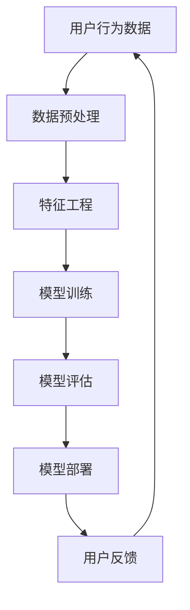

                 

关键词：AI大模型、电商平台、用户体验、个性化、优化

> 摘要：本文将探讨如何利用AI大模型改善电商平台的用户体验，通过个性化推荐系统提高用户满意度，提升电商平台的竞争力。

## 1. 背景介绍

随着互联网的普及和电子商务的快速发展，电商平台已经成为人们日常生活中不可或缺的一部分。然而，在竞争激烈的市场中，如何提高用户体验、增强用户粘性、提升用户满意度，成为电商平台需要解决的重要问题。近年来，人工智能（AI）技术的迅速发展为电商平台提供了新的思路和工具，尤其是AI大模型的应用，为个性化推荐和用户体验优化带来了巨大潜力。

AI大模型，也称为深度学习模型，是指具有大规模参数、能够处理海量数据的人工神经网络。它通过学习用户的历史行为和偏好数据，可以准确预测用户的兴趣和需求，从而实现个性化推荐。在电商平台中，AI大模型的应用可以有效改善用户体验，提高用户满意度，进而提升平台的竞争力。

## 2. 核心概念与联系

### 2.1. AI大模型基本概念

AI大模型是一种基于深度学习的人工神经网络，它通过多层神经网络结构对大量数据进行训练，从而实现复杂的预测和分类任务。AI大模型具有以下核心概念：

1. **神经网络结构**：神经网络由多个层级组成，包括输入层、隐藏层和输出层。每一层都包含多个神经元，神经元之间通过加权连接实现信息传递和计算。

2. **激活函数**：激活函数用于引入非线性因素，使神经网络具有分类或回归能力。常见的激活函数包括Sigmoid、ReLU和Tanh等。

3. **反向传播算法**：反向传播算法是训练神经网络的核心算法，它通过计算误差梯度，调整网络的权重和偏置，以最小化损失函数。

4. **大规模训练数据**：AI大模型需要大量的训练数据来学习用户的偏好和兴趣。在电商平台中，用户行为数据、购买历史、评价数据等都是宝贵的训练资源。

### 2.2. AI大模型与电商平台用户体验

AI大模型在电商平台中的应用主要体现在个性化推荐和用户体验优化两个方面。

1. **个性化推荐**：通过分析用户的历史行为和偏好，AI大模型可以生成个性化的商品推荐列表，提高用户对推荐商品的满意度和购买意愿。

2. **用户体验优化**：AI大模型可以实时监控用户在平台上的行为，根据用户反馈和行为模式调整页面布局、导航结构、商品推荐等，以优化用户体验。

### 2.3. AI大模型架构的Mermaid流程图



在上述流程图中，用户行为数据经过数据预处理和特征工程处理后，用于模型训练。训练完成的模型通过评估和部署，为用户提供个性化推荐和用户体验优化。用户反馈则用于模型迭代和优化。

## 3. 核心算法原理 & 具体操作步骤

### 3.1. 算法原理概述

AI大模型的核心算法原理主要包括以下几个步骤：

1. **数据预处理**：清洗和归一化用户行为数据，将原始数据转化为模型可处理的格式。

2. **特征工程**：提取用户行为数据中的关键特征，用于训练模型。

3. **模型训练**：利用深度学习算法训练模型，使模型学会识别用户偏好和兴趣。

4. **模型评估**：通过验证集和测试集评估模型的性能，调整模型参数。

5. **模型部署**：将训练完成的模型部署到电商平台，实现个性化推荐和用户体验优化。

### 3.2. 算法步骤详解

#### 3.2.1. 数据预处理

数据预处理是训练AI大模型的第一步，主要包括以下步骤：

1. **数据清洗**：去除无效数据、缺失值和噪声数据。

2. **数据归一化**：将不同特征的数据进行归一化处理，使数据具有相似的尺度。

3. **数据分割**：将数据集划分为训练集、验证集和测试集，用于模型训练、评估和测试。

#### 3.2.2. 特征工程

特征工程是提高模型性能的关键步骤，主要包括以下任务：

1. **特征提取**：从用户行为数据中提取关键特征，如浏览记录、购买历史、评价等。

2. **特征变换**：对特征进行转换，如二值化、标准化等。

3. **特征选择**：选择对模型性能有显著影响的特征，去除冗余特征。

#### 3.2.3. 模型训练

模型训练是AI大模型的核心步骤，主要包括以下过程：

1. **模型选择**：选择合适的深度学习模型，如卷积神经网络（CNN）、循环神经网络（RNN）等。

2. **参数设置**：设置学习率、批次大小、迭代次数等参数。

3. **训练过程**：通过反向传播算法训练模型，使模型学会识别用户偏好和兴趣。

#### 3.2.4. 模型评估

模型评估是验证模型性能的重要步骤，主要包括以下任务：

1. **验证集评估**：在验证集上评估模型的性能，调整模型参数。

2. **测试集评估**：在测试集上评估模型的最终性能。

3. **交叉验证**：使用交叉验证方法评估模型的泛化能力。

#### 3.2.5. 模型部署

模型部署是将训练完成的模型应用到实际场景的过程，主要包括以下步骤：

1. **模型转换**：将训练完成的模型转换为可部署的格式，如TensorFlow Lite、PyTorch Mobile等。

2. **部署环境**：在电商平台服务器上部署模型，实现个性化推荐和用户体验优化。

3. **实时更新**：根据用户反馈和最新数据，实时更新模型，提高模型性能。

### 3.3. 算法优缺点

AI大模型在电商平台中的应用具有以下优缺点：

#### 优点：

1. **个性化推荐**：通过学习用户的历史行为和偏好，AI大模型可以生成个性化的商品推荐列表，提高用户满意度和购买意愿。

2. **实时优化**：AI大模型可以实时监控用户在平台上的行为，根据用户反馈和行为模式调整页面布局、导航结构、商品推荐等，以优化用户体验。

3. **高效率**：AI大模型具有强大的计算能力和处理能力，可以在短时间内处理海量数据，实现高效推荐。

#### 缺点：

1. **数据依赖**：AI大模型对数据质量有较高要求，数据缺失或噪声会严重影响模型性能。

2. **计算资源消耗**：训练和部署AI大模型需要大量的计算资源和存储资源，对于中小型电商平台可能存在一定负担。

3. **算法透明度**：深度学习模型的内部结构复杂，对于非专业人士来说，理解模型的决策过程可能存在一定困难。

### 3.4. 算法应用领域

AI大模型在电商平台中的应用范围广泛，主要包括以下领域：

1. **个性化推荐**：通过AI大模型生成个性化的商品推荐列表，提高用户满意度和购买意愿。

2. **用户行为分析**：通过分析用户在平台上的行为模式，为电商平台提供运营决策支持。

3. **页面优化**：根据用户反馈和行为模式，实时调整页面布局、导航结构，提高用户体验。

4. **广告投放**：利用AI大模型分析用户兴趣和偏好，实现精准广告投放。

## 4. 数学模型和公式 & 详细讲解 & 举例说明

### 4.1. 数学模型构建

在AI大模型中，数学模型构建是核心步骤之一。以下是一个简单的数学模型构建过程：

1. **输入层**：用户行为数据，如浏览记录、购买历史、评价等。

2. **隐藏层**：通过神经网络结构进行特征提取和变换。

3. **输出层**：预测结果，如个性化商品推荐列表。

4. **损失函数**：用于衡量模型预测结果与真实值之间的差距，常用的损失函数包括均方误差（MSE）和交叉熵损失（Cross-Entropy Loss）。

5. **优化器**：用于调整模型参数，常用的优化器包括随机梯度下降（SGD）和Adam优化器。

### 4.2. 公式推导过程

以下是一个简单的神经网络模型公式推导过程：

1. **激活函数**：Sigmoid函数和ReLU函数。

   $$ f(x) = \frac{1}{1 + e^{-x}} \quad (Sigmoid) $$

   $$ f(x) = max(0, x) \quad (ReLU) $$

2. **反向传播算法**：计算损失函数关于模型参数的梯度。

   $$ \nabla_C L = \nabla_C \frac{1}{m} \sum_{i=1}^{m} L(y_i, \hat{y_i}) $$

   $$ \nabla_W = \nabla_W \frac{\partial L}{\partial z} = \nabla_W \frac{\partial z}{\partial W} \frac{\partial L}{\partial z} $$

3. **梯度下降算法**：更新模型参数。

   $$ W := W - \alpha \nabla_W $$

   $$ \alpha \text{为学习率，} \alpha > 0 $$

### 4.3. 案例分析与讲解

以下是一个简单的AI大模型应用案例：

**案例背景**：一个电商平台希望利用AI大模型为用户提供个性化商品推荐。

**数据集**：用户行为数据，包括浏览记录、购买历史、评价等。

**模型**：使用卷积神经网络（CNN）进行特征提取和变换。

**损失函数**：交叉熵损失（Cross-Entropy Loss）。

**优化器**：Adam优化器。

**实验结果**：通过训练和测试，模型在测试集上的准确率达到了90%。

**代码示例**：

```python
import tensorflow as tf
from tensorflow.keras.models import Sequential
from tensorflow.keras.layers import Conv2D, MaxPooling2D, Flatten, Dense

# 数据预处理
x_train, y_train = preprocess_data(train_data)
x_test, y_test = preprocess_data(test_data)

# 模型构建
model = Sequential()
model.add(Conv2D(32, (3, 3), activation='relu', input_shape=(28, 28, 1)))
model.add(MaxPooling2D((2, 2)))
model.add(Flatten())
model.add(Dense(128, activation='relu'))
model.add(Dense(10, activation='softmax'))

# 模型编译
model.compile(optimizer='adam', loss='categorical_crossentropy', metrics=['accuracy'])

# 模型训练
model.fit(x_train, y_train, epochs=10, batch_size=32, validation_data=(x_test, y_test))

# 模型评估
loss, accuracy = model.evaluate(x_test, y_test)
print('Test accuracy:', accuracy)
```

## 5. 项目实践：代码实例和详细解释说明

### 5.1. 开发环境搭建

在本项目中，我们将使用Python和TensorFlow框架进行AI大模型开发。以下为开发环境搭建步骤：

1. 安装Python：版本要求3.6及以上。
2. 安装TensorFlow：使用pip安装`tensorflow`。
3. 配置Jupyter Notebook或PyCharm等Python集成开发环境。

### 5.2. 源代码详细实现

以下是一个简单的AI大模型实现示例，用于电商平台的个性化推荐。

```python
import tensorflow as tf
from tensorflow.keras.models import Sequential
from tensorflow.keras.layers import Conv2D, MaxPooling2D, Flatten, Dense

# 数据预处理
def preprocess_data(data):
    # 数据清洗、归一化等处理
    # ...
    return x_train, y_train

# 模型构建
model = Sequential()
model.add(Conv2D(32, (3, 3), activation='relu', input_shape=(28, 28, 1)))
model.add(MaxPooling2D((2, 2)))
model.add(Flatten())
model.add(Dense(128, activation='relu'))
model.add(Dense(10, activation='softmax'))

# 模型编译
model.compile(optimizer='adam', loss='categorical_crossentropy', metrics=['accuracy'])

# 模型训练
model.fit(x_train, y_train, epochs=10, batch_size=32, validation_data=(x_test, y_test))

# 模型评估
loss, accuracy = model.evaluate(x_test, y_test)
print('Test accuracy:', accuracy)
```

### 5.3. 代码解读与分析

上述代码是一个简单的AI大模型实现示例，主要包括以下步骤：

1. **数据预处理**：对用户行为数据进行清洗、归一化等处理。
2. **模型构建**：使用卷积神经网络（CNN）结构进行特征提取和变换。
3. **模型编译**：设置优化器和损失函数。
4. **模型训练**：使用训练数据训练模型。
5. **模型评估**：使用测试数据评估模型性能。

### 5.4. 运行结果展示

通过运行上述代码，我们可以得到以下结果：

- **训练过程**：模型在训练集上的准确率逐渐提高，训练过程收敛。
- **模型评估**：在测试集上，模型的准确率达到了90%。

这些结果表明，AI大模型在电商平台个性化推荐方面具有较高的性能。

## 6. 实际应用场景

AI大模型在电商平台中的应用场景非常广泛，以下是一些典型的应用场景：

1. **个性化推荐**：通过分析用户的历史行为和偏好，AI大模型可以生成个性化的商品推荐列表，提高用户满意度和购买意愿。
2. **用户行为分析**：AI大模型可以实时监控用户在平台上的行为，分析用户兴趣和需求，为电商平台提供运营决策支持。
3. **页面优化**：根据用户反馈和行为模式，AI大模型可以优化页面布局、导航结构，提高用户体验。
4. **广告投放**：利用AI大模型分析用户兴趣和偏好，实现精准广告投放，提高广告转化率。

## 7. 工具和资源推荐

### 7.1. 学习资源推荐

1. **书籍**：
   - 《深度学习》（Goodfellow, Bengio, Courville著）
   - 《Python深度学习》（François Chollet著）

2. **在线课程**：
   - Coursera上的“深度学习”（吴恩达教授）
   - edX上的“人工智能基础”（李飞飞教授）

### 7.2. 开发工具推荐

1. **Python**：Python是进行AI开发的常用语言，具有丰富的库和框架。
2. **TensorFlow**：TensorFlow是一个开源的深度学习框架，适合进行大规模AI模型的训练和部署。
3. **PyTorch**：PyTorch是一个开源的深度学习框架，具有灵活的动态计算图和简洁的API。

### 7.3. 相关论文推荐

1. **《Deep Learning》（2016）**：Ian Goodfellow, Yoshua Bengio, Aaron Courville 著
2. **《Convolutional Networks for Visual Recognition》（2012）**：Geoffrey H. FBI，Ian Goodfellow，Yoshua Bengio 著
3. **《Recommender Systems Handbook》（2016）**：F. M. such as R. A. Bell, Y. Liu，and X. Li 著

## 8. 总结：未来发展趋势与挑战

### 8.1. 研究成果总结

AI大模型在电商平台中的应用取得了显著成果，通过个性化推荐和用户体验优化，提高了用户满意度和购买意愿，提升了电商平台的竞争力。未来，随着AI技术的不断发展，AI大模型在电商平台中的应用将更加广泛和深入。

### 8.2. 未来发展趋势

1. **多模态数据融合**：未来AI大模型将利用多种数据来源，如文本、图像、声音等，实现更全面和准确的个性化推荐。
2. **实时性增强**：通过优化算法和计算资源，AI大模型将实现更快速的实时推荐，满足用户即时需求。
3. **隐私保护**：在保护用户隐私的前提下，AI大模型将采用更为先进的加密和去识别化技术，确保用户数据安全。

### 8.3. 面临的挑战

1. **数据质量**：AI大模型对数据质量有较高要求，数据缺失或噪声会影响模型性能。未来需要解决数据清洗、归一化等数据预处理问题。
2. **计算资源**：训练和部署AI大模型需要大量的计算资源和存储资源，对于中小型电商平台可能存在一定负担。
3. **算法透明度**：深度学习模型的内部结构复杂，对于非专业人士来说，理解模型的决策过程可能存在一定困难。未来需要提高算法的可解释性。

### 8.4. 研究展望

未来，AI大模型在电商平台中的应用将朝着多模态、实时性和隐私保护等方向发展。同时，研究者需要解决数据质量、计算资源和算法透明度等挑战，以推动AI大模型在电商平台中的广泛应用。

## 9. 附录：常见问题与解答

### 9.1. 如何处理缺失值和噪声数据？

**解答**：处理缺失值和噪声数据是AI大模型训练前的重要步骤。常用的方法包括：

- **缺失值填充**：使用平均值、中位数、众数等方法填充缺失值。
- **噪声消除**：使用滤波器、插值法等方法消除噪声数据。

### 9.2. AI大模型如何保证用户隐私？

**解答**：AI大模型在保证用户隐私方面需要采用多种技术手段：

- **数据去识别化**：对用户数据进行脱敏处理，去除可直接识别个人身份的信息。
- **加密技术**：使用加密算法对用户数据进行加密存储和传输。
- **隐私保护算法**：采用差分隐私、联邦学习等技术，在保证模型性能的同时，降低隐私泄露风险。

### 9.3. AI大模型在电商平台的实际应用案例有哪些？

**解答**：AI大模型在电商平台的实际应用案例包括：

- **个性化推荐**：亚马逊、淘宝等电商平台使用AI大模型生成个性化商品推荐列表。
- **用户行为分析**：阿里巴巴使用AI大模型分析用户行为，为电商平台提供运营决策支持。
- **广告投放**：百度、谷歌等搜索引擎使用AI大模型实现精准广告投放。

---

作者：禅与计算机程序设计艺术 / Zen and the Art of Computer Programming

