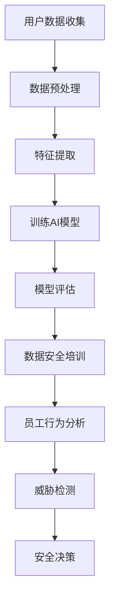

                 

关键词：人工智能、用户数据安全、电商、培训、机器学习、网络安全、隐私保护、AI 技术应用

> 摘要：随着电商行业的迅速发展，用户数据的保护变得越来越重要。本文探讨了人工智能（AI）在电商企业中如何通过自动化和智能化的方法来提升用户数据安全培训的效果。文章首先介绍了电商企业面临的数据安全挑战，然后详细阐述了AI技术的应用场景、优势及实际操作步骤，最后对未来的发展趋势和挑战进行了展望。

## 1. 背景介绍

电商行业近年来经历了爆炸性的增长，这不仅带来了巨大的经济效益，也引发了用户数据安全的问题。随着大数据和云计算技术的普及，电商企业积累了海量的用户数据，这些数据包括个人身份信息、消费习惯、地理位置等敏感信息。这些数据一旦泄露，将对用户的隐私和安全造成严重威胁。

### 1.1 电商数据安全挑战

- **数据量巨大**：电商企业的用户数据规模庞大，数据量的增加使得传统的安全管理方法难以应对。
- **数据类型多样**：用户数据类型繁多，包括结构化和非结构化数据，不同类型的数据需要不同的处理和保护方式。
- **数据泄露风险高**：由于用户数据的重要性，电商企业往往成为黑客攻击的目标。
- **合规要求严格**：全球各地的法律法规对用户数据安全提出了更高的要求，如欧盟的《通用数据保护条例》（GDPR）。

### 1.2 数据安全培训的重要性

数据安全培训是电商企业保障用户数据安全的关键环节。通过培训，员工可以了解数据安全的基本知识，提高安全意识，掌握正确的数据处理和防护技能。有效的数据安全培训不仅能减少人为错误导致的 数据泄露，还能帮助企业满足合规要求。

## 2. 核心概念与联系

为了更好地理解AI在数据安全培训中的应用，我们需要了解几个核心概念和它们之间的联系：

### 2.1 人工智能（AI）

人工智能是指通过计算机模拟人类智能行为的技术，包括机器学习、深度学习、自然语言处理等。AI技术能够从海量数据中自动学习模式，进行预测和决策。

### 2.2 机器学习（ML）

机器学习是AI的一个分支，它利用算法从数据中学习，并做出预测或决策。在数据安全培训中，机器学习可以用于识别安全威胁、分析员工行为等。

### 2.3 深度学习（DL）

深度学习是机器学习的一个子领域，它使用多层神经网络进行学习。深度学习在图像识别、语音识别等领域表现出色，也可以用于数据安全分析。

### 2.4 数据安全与隐私保护

数据安全和隐私保护是确保用户数据不被未经授权的访问、使用、泄露或破坏的一系列措施。在AI的辅助下，电商企业可以更有效地进行数据安全监控和隐私保护。

### 2.5 Mermaid 流程图

以下是一个简化的AI在数据安全培训中应用的Mermaid流程图：



### 2.6 人工智能与数据安全培训的关系

人工智能在数据安全培训中的应用主要体现在以下几个方面：

- **自动化培训**：AI可以自动生成个性化的培训内容，提高培训效率。
- **智能化监控**：AI可以实时监控员工的行为和数据安全情况，提供实时反馈。
- **威胁分析**：AI可以分析潜在的安全威胁，帮助员工及时了解风险。

## 3. 核心算法原理 & 具体操作步骤

### 3.1 算法原理概述

AI在数据安全培训中的应用主要基于以下几个算法原理：

- **监督学习**：通过已标记的数据集训练模型，使其能够识别和预测数据安全相关的事件。
- **无监督学习**：在没有标记的数据集上训练模型，用于发现潜在的安全威胁。
- **强化学习**：通过奖励和惩罚机制，训练模型在数据安全场景中做出最优决策。

### 3.2 算法步骤详解

#### 3.2.1 数据收集与预处理

1. **数据收集**：收集电商企业的用户数据，包括交易记录、员工行为数据等。
2. **数据预处理**：清洗数据，处理缺失值、异常值，将数据转换为适合机器学习的格式。

#### 3.2.2 特征提取

1. **特征选择**：选择与数据安全相关的特征，如用户访问时间、访问频率等。
2. **特征工程**：对特征进行变换和组合，提高模型的性能。

#### 3.2.3 训练AI模型

1. **选择模型**：根据数据特点，选择合适的机器学习模型，如决策树、神经网络等。
2. **训练模型**：使用预处理后的数据集训练模型。
3. **模型优化**：通过交叉验证、调整参数等方法优化模型。

#### 3.2.4 模型评估

1. **评估指标**：选择合适的评估指标，如准确率、召回率等。
2. **评估模型**：对模型进行评估，确保其能够准确预测数据安全相关事件。

#### 3.2.5 数据安全培训

1. **个性化培训内容生成**：根据员工的行为数据和模型预测结果，生成个性化的培训内容。
2. **实时监控与反馈**：实时监控员工的数据安全行为，提供实时反馈和指导。
3. **持续优化**：根据员工的行为数据和培训效果，持续优化培训内容和方法。

### 3.3 算法优缺点

#### 3.3.1 优点

- **高效性**：AI可以处理大量的数据，提高培训效率。
- **个性化**：AI可以根据员工的特点和需求，提供个性化的培训内容。
- **实时性**：AI可以实时监控和反馈员工的行为，及时发现问题。

#### 3.3.2 缺点

- **数据依赖性**：AI的性能依赖于数据质量，数据不准确可能导致误判。
- **模型黑盒性**：机器学习模型的工作原理复杂，难以解释，可能导致信任问题。

### 3.4 算法应用领域

AI在数据安全培训中的应用不仅限于电商企业，还可以广泛应用于其他领域，如金融、医疗等，为不同领域的用户数据安全提供智能化解决方案。

## 4. 数学模型和公式 & 详细讲解 & 举例说明

### 4.1 数学模型构建

在AI数据安全培训中，常用的数学模型包括监督学习模型和无监督学习模型。

#### 4.1.1 监督学习模型

监督学习模型是一种从已知数据中学习并做出预测的模型。常见的监督学习模型有：

- **线性回归**：用于预测连续值。
- **逻辑回归**：用于预测概率。
- **支持向量机（SVM）**：用于分类任务。
- **决策树**：用于分类和回归任务。

#### 4.1.2 无监督学习模型

无监督学习模型是一种从未知数据中学习并发现规律的模型。常见的无监督学习模型有：

- **聚类分析**：用于将数据分为不同的群组。
- **主成分分析（PCA）**：用于数据降维。
- **自编码器**：用于特征提取和降维。

### 4.2 公式推导过程

以线性回归为例，线性回归模型的目标是最小化预测值与实际值之间的误差平方和。

$$
\min \sum_{i=1}^{n} (y_i - \hat{y}_i)^2
$$

其中，$y_i$ 是实际值，$\hat{y}_i$ 是预测值。

为了求解最优参数，可以对上式求导，并令导数为零，得到：

$$
\frac{\partial}{\partial \theta_j} \sum_{i=1}^{n} (y_i - \hat{y}_i)^2 = -2 \sum_{i=1}^{n} (y_i - \hat{y}_i) x_{ij} = 0
$$

解上述方程组，即可得到最优参数 $\theta$。

### 4.3 案例分析与讲解

#### 4.3.1 案例背景

某电商企业希望利用AI技术对其员工进行数据安全培训，以减少数据泄露的风险。该企业收集了员工的历史行为数据，包括登录时间、操作频率、访问页面等。

#### 4.3.2 数据预处理

1. **数据清洗**：去除重复数据、缺失值和异常值。
2. **特征工程**：对特征进行标准化处理，如对时间特征进行归一化。

#### 4.3.3 特征提取

1. **选择特征**：选择与数据安全相关的特征，如登录时间、操作频率等。
2. **特征组合**：将多个特征组合成新的特征，如登录时间和操作频率的乘积。

#### 4.3.4 训练模型

1. **选择模型**：选择线性回归模型。
2. **训练模型**：使用历史行为数据训练线性回归模型。

#### 4.3.5 模型评估

1. **评估指标**：选择均方误差（MSE）作为评估指标。
2. **评估模型**：计算模型的MSE，确保其能够准确预测员工的行为。

#### 4.3.6 数据安全培训

1. **个性化培训内容生成**：根据员工的行为数据和模型预测结果，生成个性化的培训内容。
2. **实时监控与反馈**：实时监控员工的数据安全行为，提供实时反馈和指导。

## 5. 项目实践：代码实例和详细解释说明

### 5.1 开发环境搭建

- **Python**：作为主要编程语言。
- **Scikit-learn**：用于机器学习模型的训练和评估。
- **Pandas**：用于数据处理。
- **Matplotlib**：用于数据可视化。

### 5.2 源代码详细实现

```python
# 导入必要的库
import pandas as pd
import numpy as np
from sklearn.linear_model import LinearRegression
from sklearn.metrics import mean_squared_error
from sklearn.model_selection import train_test_split

# 读取数据
data = pd.read_csv('employee_data.csv')

# 数据预处理
data = data.drop_duplicates()
data = data.fillna(data.mean())

# 特征工程
data['login_time_difference'] = data['login_time'] - data['login_time'].min()
data['operation_frequency_difference'] = data['operation_frequency'] - data['operation_frequency'].min()

# 选择特征和目标变量
X = data[['login_time_difference', 'operation_frequency_difference']]
y = data['data_leak_flag']

# 划分训练集和测试集
X_train, X_test, y_train, y_test = train_test_split(X, y, test_size=0.2, random_state=42)

# 训练模型
model = LinearRegression()
model.fit(X_train, y_train)

# 预测和评估
y_pred = model.predict(X_test)
mse = mean_squared_error(y_test, y_pred)
print('MSE:', mse)

# 可视化
import matplotlib.pyplot as plt

plt.scatter(X_test['login_time_difference'], y_test)
plt.plot(X_test['login_time_difference'], y_pred, color='red')
plt.xlabel('Login Time Difference')
plt.ylabel('Data Leak Flag')
plt.show()
```

### 5.3 代码解读与分析

上述代码实现了从数据预处理到模型训练和评估的完整流程。首先，读取和清洗数据，然后进行特征工程，选择和组合特征。接下来，划分训练集和测试集，训练线性回归模型，并进行预测和评估。最后，使用matplotlib库进行数据可视化，展示模型的效果。

## 6. 实际应用场景

### 6.1 电商企业数据安全培训

在电商企业的数据安全培训中，AI技术可以用于以下几个方面：

- **自动化培训内容生成**：根据员工的行为数据和模型预测结果，自动生成个性化的培训内容。
- **实时监控与反馈**：实时监控员工的数据安全行为，提供实时反馈和指导。
- **威胁分析**：分析潜在的安全威胁，帮助员工及时了解风险。

### 6.2 金融领域数据安全

金融领域的用户数据安全同样面临巨大挑战。AI技术可以用于以下几个方面：

- **欺诈检测**：通过分析用户行为数据，实时检测和预防欺诈行为。
- **客户行为分析**：分析客户行为，提供个性化的服务和风险管理。
- **合规性检查**：确保企业遵守相关的法律法规，减少合规风险。

### 6.3 医疗领域数据安全

医疗领域的用户数据安全尤为重要。AI技术可以用于以下几个方面：

- **患者隐私保护**：通过数据加密和匿名化技术，保护患者隐私。
- **数据安全培训**：对医疗人员进行数据安全培训，提高安全意识。
- **医疗数据分析**：利用AI技术进行医疗数据分析，提高诊断和治疗水平。

## 7. 工具和资源推荐

### 7.1 学习资源推荐

- **《Python机器学习》**：由塞巴斯蒂安·拉斯克恩（Sebastian Raschka）所著，适合初学者入门。
- **《深度学习》**：由伊恩·古德费洛（Ian Goodfellow）、约书亚·本吉奥（ Yoshua Bengio）和亚伦·库维尔（Aaron Courville）所著，适合深入理解深度学习。
- **《数据科学入门》**：由杰里米·琼斯（Jason Brownlee）所著，适合了解数据科学的基础知识。

### 7.2 开发工具推荐

- **Scikit-learn**：用于机器学习模型训练和评估。
- **TensorFlow**：用于深度学习模型训练和部署。
- **Pandas**：用于数据处理和分析。
- **Matplotlib**：用于数据可视化。

### 7.3 相关论文推荐

- **"Deep Learning for Security: A Survey"**：对深度学习在网络安全中的应用进行了全面的综述。
- **"AI and Data Security: A Roadmap"**：探讨了人工智能在数据安全领域的应用前景。
- **"Machine Learning for Cybersecurity"**：分析了机器学习在网络安全中的应用方法和挑战。

## 8. 总结：未来发展趋势与挑战

### 8.1 研究成果总结

人工智能技术在数据安全培训领域取得了显著的成果，主要体现在以下几个方面：

- **自动化培训内容生成**：AI能够根据员工的特点和需求，自动生成个性化的培训内容，提高培训效率。
- **实时监控与反馈**：AI可以实时监控员工的数据安全行为，提供实时反馈和指导，提高员工的安全意识。
- **威胁分析**：AI可以分析潜在的安全威胁，帮助员工及时了解风险，提高数据安全防护能力。

### 8.2 未来发展趋势

随着人工智能技术的不断发展，未来数据安全培训将呈现以下趋势：

- **更智能的培训系统**：AI技术将更加成熟，能够提供更加智能、个性化的培训系统。
- **跨领域应用**：AI技术在数据安全培训领域的应用将不仅限于电商、金融、医疗等领域，还将扩展到其他行业。
- **实时性与自动化**：AI技术将实现更高效、实时的数据安全监控和培训，减少人为错误。

### 8.3 面临的挑战

尽管AI技术在数据安全培训领域具有巨大的潜力，但也面临着以下挑战：

- **数据隐私保护**：在利用用户数据进行培训时，如何保护用户隐私是一个重要问题。
- **模型解释性**：机器学习模型的工作原理复杂，难以解释，如何提高模型的解释性是一个挑战。
- **算法公平性**：AI算法在处理数据时可能存在偏见，如何确保算法的公平性是一个关键问题。

### 8.4 研究展望

未来，数据安全培训的研究将朝着以下方向发展：

- **算法优化**：通过改进算法，提高AI模型的性能和可解释性。
- **跨领域合作**：加强不同领域之间的合作，共同推动AI技术在数据安全培训领域的应用。
- **标准化**：制定相关标准和规范，确保AI技术在数据安全培训中的应用合法、有效。

## 9. 附录：常见问题与解答

### 9.1 什么是数据安全培训？

数据安全培训是指通过教育、培训和意识提升，使员工了解数据安全的重要性，掌握数据保护的基本知识和技能，以降低数据泄露和不当处理的风险。

### 9.2 人工智能如何帮助进行数据安全培训？

人工智能可以通过自动化生成培训内容、实时监控员工行为、分析安全威胁等方式，提高数据安全培训的效率和质量。

### 9.3 人工智能在数据安全培训中面临哪些挑战？

人工智能在数据安全培训中面临的主要挑战包括数据隐私保护、模型解释性、算法公平性等。

### 9.4 电商企业如何利用人工智能进行数据安全培训？

电商企业可以利用人工智能进行数据安全培训，具体步骤包括：收集员工行为数据、进行数据预处理、训练机器学习模型、生成个性化培训内容、实时监控与反馈等。

## 作者署名

作者：禅与计算机程序设计艺术 / Zen and the Art of Computer Programming

[END]
```

