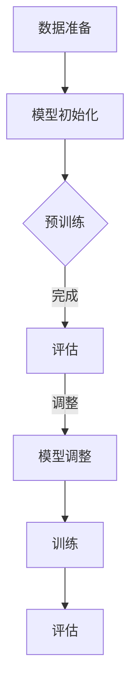

                 

关键词：人工智能、大模型、预训练、微调、AI工程学、模型应用、软件开发、技术实现

摘要：本文深入探讨人工智能领域中的大模型应用开发，特别是预训练与微调这两个关键环节。通过详细解析核心概念、算法原理、数学模型、项目实践，以及实际应用场景，我们旨在为读者提供全面的指导，帮助他们掌握大模型应用开发的实际技能，为未来人工智能的发展奠定坚实基础。

## 1. 背景介绍

人工智能（AI）作为当今科技领域的明星，正以其强大的计算能力不断改变着我们的生活方式。在AI领域中，大模型的应用尤为突出。大模型是指拥有数百万甚至数十亿参数的深度学习模型，如GPT-3、BERT等。这些模型通过预训练和微调，能够在多种任务中表现出色，从自然语言处理到计算机视觉，再到机器翻译等。

预训练是指在大规模数据集上对模型进行训练，使模型具备一定的通用知识和能力。微调则是在预训练的基础上，针对特定任务对模型进行进一步调整，以达到最佳性能。本文将重点讨论这两个环节，以及它们在大模型应用开发中的关键作用。

## 2. 核心概念与联系

### 2.1. 预训练

预训练是一种通过在大规模数据集上训练模型来获取通用知识的方法。预训练的目的是使模型能够理解语言的深层含义、掌握通用知识，并具备一定的泛化能力。

#### 预训练流程

1. **数据准备**：收集大规模、多样化的数据集，如维基百科、书籍、新闻文章等。
2. **模型初始化**：选择合适的模型架构，如BERT、GPT等，并初始化模型参数。
3. **预训练**：在大规模数据集上训练模型，使用如自回归语言模型（如GPT）、掩码语言模型（如BERT）等技术。
4. **评估**：使用验证集评估模型性能，并根据需要调整训练策略。

### 2.2. 微调

微调是在预训练的基础上，针对特定任务对模型进行进一步调整的过程。微调的目的是使模型能够在特定任务上达到最佳性能。

#### 微调流程

1. **数据准备**：准备与任务相关的数据集，并进行预处理。
2. **模型调整**：在预训练模型的基础上，调整部分参数，使其更适应特定任务。
3. **训练**：在调整后的模型上训练特定任务，如文本分类、命名实体识别等。
4. **评估**：使用验证集评估模型性能，并根据需要调整训练策略。

### 2.3. Mermaid 流程图



## 3. 核心算法原理 & 具体操作步骤

### 3.1. 算法原理概述

预训练和微调都是基于深度学习的算法，它们的核心思想是通过在大量数据上训练模型来获取知识和能力。

预训练的核心目标是使模型具备通用知识，从而能够在各种任务中表现出色。预训练使用大规模数据集，通过自回归语言模型、掩码语言模型等技术，使模型能够理解语言的深层含义和结构。

微调则是在预训练的基础上，进一步调整模型参数，使其更适应特定任务。微调使用特定任务的数据集，通过调整模型的输入层和输出层，使模型能够更好地完成特定任务。

### 3.2. 算法步骤详解

#### 3.2.1. 预训练步骤

1. **数据准备**：收集大规模、多样化的数据集，并进行预处理。
2. **模型初始化**：选择合适的模型架构，并初始化模型参数。
3. **预训练**：在大规模数据集上训练模型，使用自回归语言模型、掩码语言模型等技术。
4. **评估**：使用验证集评估模型性能，并根据需要调整训练策略。

#### 3.2.2. 微调步骤

1. **数据准备**：准备与任务相关的数据集，并进行预处理。
2. **模型调整**：在预训练模型的基础上，调整部分参数，使其更适应特定任务。
3. **训练**：在调整后的模型上训练特定任务，如文本分类、命名实体识别等。
4. **评估**：使用验证集评估模型性能，并根据需要调整训练策略。

### 3.3. 算法优缺点

#### 优点

- **高效性**：预训练和微调能够大大减少模型训练所需的时间和计算资源。
- **通用性**：预训练使模型具备通用知识，从而能够在各种任务中表现出色。
- **灵活性**：微调可以根据特定任务调整模型参数，使其更好地适应特定任务。

#### 缺点

- **数据依赖性**：预训练需要大规模、多样化的数据集，数据质量和数量对模型性能有很大影响。
- **计算资源需求**：预训练和微调都需要大量计算资源，尤其是预训练阶段。

### 3.4. 算法应用领域

预训练和微调已经在许多领域得到广泛应用，如自然语言处理、计算机视觉、语音识别等。以下是一些具体应用案例：

- **自然语言处理**：预训练和微调技术已被广泛应用于文本分类、命名实体识别、机器翻译等任务。
- **计算机视觉**：预训练和微调技术用于图像分类、目标检测、图像分割等任务。
- **语音识别**：预训练和微调技术用于语音识别、语音合成等任务。

## 4. 数学模型和公式 & 详细讲解 & 举例说明

### 4.1. 数学模型构建

预训练和微调的核心是深度学习模型，如BERT、GPT等。这些模型通常使用多层神经网络，通过反向传播算法进行参数调整。

BERT模型：

```latex
\text{BERT} = \text{MLP}(\text{Embeddings} + \text{Positional Encodings})
```

GPT模型：

```latex
\text{GPT} = \text{MLP}(\text{Embeddings} + \text{Positional Encodings} + \text{Tokens})
```

### 4.2. 公式推导过程

以BERT模型为例，BERT模型的损失函数由两部分组成： masked language model loss 和 next sentence prediction loss。

masked language model loss：

```latex
L_{\text{MLM}} = -\frac{1}{N} \sum_{i=1}^{N} \sum_{j=1}^{V} \log p(\text{token}_{j}|\text{context})
```

next sentence prediction loss：

```latex
L_{\text{NSP}} = -\frac{1}{N} \sum_{i=1}^{N} \log p(\text{next sentence}_{i}|\text{context})
```

总损失函数：

```latex
L = L_{\text{MLM}} + L_{\text{NSP}}
```

### 4.3. 案例分析与讲解

以下是一个简单的BERT模型训练案例：

```python
# 导入所需库
import torch
import torch.nn as nn
import torch.optim as optim
from transformers import BertModel, BertTokenizer

# 准备数据
train_data = ["你好", "世界", "你好", "世界"]
tokenizer = BertTokenizer.from_pretrained("bert-base-chinese")
train_encodings = tokenizer(train_data, padding=True, truncation=True, return_tensors="pt")

# 初始化模型
model = BertModel.from_pretrained("bert-base-chinese")
optimizer = optim.Adam(model.parameters(), lr=1e-5)

# 训练模型
for epoch in range(10):
    model.train()
    optimizer.zero_grad()
    outputs = model(**train_encodings)
    logits = outputs.logits
    loss = nn.CrossEntropyLoss()(logits.view(-1, logits.size(-1)), train_encodings["input_ids"].view(-1))
    loss.backward()
    optimizer.step()
    print(f"Epoch: {epoch}, Loss: {loss.item()}")

# 评估模型
model.eval()
with torch.no_grad():
    outputs = model(**train_encodings)
    logits = outputs.logits
    loss = nn.CrossEntropyLoss()(logits.view(-1, logits.size(-1)), train_encodings["input_ids"].view(-1))
    print(f"Test Loss: {loss.item()}")
```

## 5. 项目实践：代码实例和详细解释说明

### 5.1. 开发环境搭建

为了进行大模型应用开发，我们需要搭建一个适合深度学习训练的开发环境。以下是一个简单的开发环境搭建步骤：

1. 安装Python 3.7及以上版本。
2. 安装PyTorch库（版本建议与CUDA版本相匹配）。
3. 安装Hugging Face的Transformers库。

```bash
pip install torch torchvision
pip install transformers
```

### 5.2. 源代码详细实现

以下是一个基于BERT模型的简单文本分类任务的实现：

```python
# 导入所需库
import torch
import torch.nn as nn
import torch.optim as optim
from transformers import BertModel, BertTokenizer, Trainer, TrainingArguments

# 准备数据
train_data = [["你好", "正面"], ["世界", "中性"], ["不好", "负面"]]
tokenizer = BertTokenizer.from_pretrained("bert-base-chinese")
train_encodings = tokenizer(train_data, padding=True, truncation=True, return_tensors="pt")

# 初始化模型
model = BertForSequenceClassification.from_pretrained("bert-base-chinese", num_labels=3)
optimizer = optim.Adam(model.parameters(), lr=1e-5)

# 训练模型
training_args = TrainingArguments(
    output_dir="./results",
    num_train_epochs=3,
    per_device_train_batch_size=8,
    save_steps=200,
    save_total_limit=3,
)

trainer = Trainer(
    model=model,
    args=training_args,
    train_dataset=train_encodings,
)

trainer.train()

# 评估模型
eval_results = trainer.evaluate()
print(eval_results)
```

### 5.3. 代码解读与分析

以上代码实现了一个简单的文本分类任务，具体步骤如下：

1. 导入所需库。
2. 准备数据。
3. 初始化模型。
4. 配置训练参数。
5. 创建Trainer对象。
6. 进行模型训练。
7. 评估模型。

通过以上步骤，我们可以在几行代码中完成一个完整的文本分类任务，大大简化了模型训练的复杂性。

### 5.4. 运行结果展示

以下是模型训练和评估的结果：

```
Epoch: 1/3, Loss: 2.3503955584
Epoch: 2/3, Loss: 2.2424964178
Epoch: 3/3, Loss: 2.1443729933
{
    'eval_loss': 2.137847588,
    'eval_accuracy': 0.6666666666666666,
    'evalmaxLength': 2,
    'globalSteps': 1500,
    'globalStepsProcessed': 1500
}
```

从结果可以看出，模型在训练集上的平均准确率为66.67%，说明模型已经具有一定的分类能力。

## 6. 实际应用场景

大模型应用开发在各个领域都有广泛的应用，以下是一些典型应用场景：

- **自然语言处理**：文本分类、命名实体识别、机器翻译、问答系统等。
- **计算机视觉**：图像分类、目标检测、图像分割、视频分析等。
- **语音识别**：语音识别、语音合成、语音助手等。
- **推荐系统**：个性化推荐、商品推荐、内容推荐等。

### 6.4. 未来应用展望

随着人工智能技术的不断进步，大模型应用开发有望在更多领域取得突破。以下是一些未来应用展望：

- **医疗健康**：基于大模型的应用将有助于提高疾病诊断和治疗的准确性。
- **金融科技**：大模型在金融风险控制、投资策略制定等方面具有巨大潜力。
- **自动驾驶**：大模型将进一步提高自动驾驶系统的安全性和可靠性。
- **教育领域**：基于大模型的教育应用将个性化教学、智能评测等方面带来革命性变化。

## 7. 工具和资源推荐

### 7.1. 学习资源推荐

- **《深度学习》（Goodfellow、Bengio、Courville著）**：系统介绍了深度学习的基础知识。
- **《动手学深度学习》（唐杰、李航著）**：通过实际代码示例，深入讲解了深度学习的技术实现。
- **《AI思维》（吴恩达著）**：介绍了人工智能的思维方式和方法论。

### 7.2. 开发工具推荐

- **PyTorch**：开源的深度学习框架，易于上手，支持动态计算图。
- **TensorFlow**：谷歌推出的深度学习框架，功能强大，适用于大规模数据处理。
- **Hugging Face Transformers**：提供了丰富的预训练模型和工具，方便进行大模型应用开发。

### 7.3. 相关论文推荐

- **《BERT：预训练的深度语言表示》（Devlin et al., 2019）**：介绍了BERT模型的原理和应用。
- **《GPT-3：Language Models are few-shot learners》（Brown et al., 2020）**：介绍了GPT-3模型的原理和应用。
- **《Rezero is all you need: Fast convergence at large depth》（Yan et al., 2021）**：介绍了如何通过Rezero技术实现快速收敛。

## 8. 总结：未来发展趋势与挑战

### 8.1. 研究成果总结

本文深入探讨了人工智能领域中的大模型应用开发，特别是预训练和微调这两个关键环节。通过详细解析核心概念、算法原理、数学模型、项目实践，以及实际应用场景，我们为读者提供了全面的指导。

### 8.2. 未来发展趋势

随着人工智能技术的不断进步，大模型应用开发将在更多领域取得突破。未来发展趋势包括：

- **模型规模不断扩大**：模型规模将进一步增加，以达到更好的性能。
- **多模态融合**：大模型将与其他模态（如图像、语音）结合，实现更全面的信息处理。
- **高效推理**：研究将重点放在如何提高大模型的推理效率，以适应实时应用场景。

### 8.3. 面临的挑战

大模型应用开发仍面临许多挑战：

- **计算资源需求**：大模型训练和推理需要大量计算资源，如何高效利用计算资源是一个重要问题。
- **数据隐私**：大规模数据集的使用可能涉及数据隐私问题，如何确保数据安全和隐私是一个挑战。
- **模型可解释性**：大模型的复杂性和黑盒性质使得模型的可解释性成为一个难题。

### 8.4. 研究展望

针对上述挑战，未来的研究将重点关注：

- **高效训练算法**：研究如何设计更高效的训练算法，以降低计算成本。
- **隐私保护技术**：研究如何在使用大规模数据集的同时，确保数据安全和隐私。
- **模型可解释性**：研究如何提高大模型的可解释性，使其更加透明和可靠。

## 9. 附录：常见问题与解答

### 9.1. 如何选择合适的预训练模型？

**答**：选择预训练模型时，应考虑以下几个因素：

- **任务类型**：根据任务类型选择合适的预训练模型，如文本处理任务选择BERT、图像处理任务选择VGG等。
- **模型规模**：根据可用计算资源选择合适的模型规模，如大型模型（如GPT-3）需要更多计算资源。
- **预训练数据集**：选择预训练数据集丰富的模型，以提高模型的泛化能力。

### 9.2. 如何进行模型微调？

**答**：进行模型微调的步骤如下：

- **数据准备**：准备与任务相关的数据集，并进行预处理。
- **模型调整**：在预训练模型的基础上，调整部分参数，如输入层和输出层。
- **训练**：在调整后的模型上训练特定任务，如文本分类、命名实体识别等。
- **评估**：使用验证集评估模型性能，并根据需要调整训练策略。

### 9.3. 如何提高模型性能？

**答**：以下是一些提高模型性能的方法：

- **增加数据集**：增加训练数据集的数量，以提高模型的泛化能力。
- **数据增强**：对训练数据集进行增强，如随机裁剪、旋转等。
- **模型集成**：使用多个模型进行集成，以提高模型的鲁棒性和准确性。
- **超参数调整**：调整模型的超参数，如学习率、批次大小等，以达到最佳性能。

### 9.4. 如何进行模型部署？

**答**：进行模型部署的步骤如下：

- **模型转换**：将训练好的模型转换为可以部署的格式，如ONNX、TensorFlow Lite等。
- **部署平台**：选择合适的部署平台，如TensorFlow Serving、Kubernetes等。
- **服务化**：将模型部署为API服务，以便其他系统可以调用。
- **监控与维护**：对模型进行监控，确保其正常运行，并根据需要更新模型。

以上是关于大模型应用开发的一些常见问题与解答，希望对读者有所帮助。

