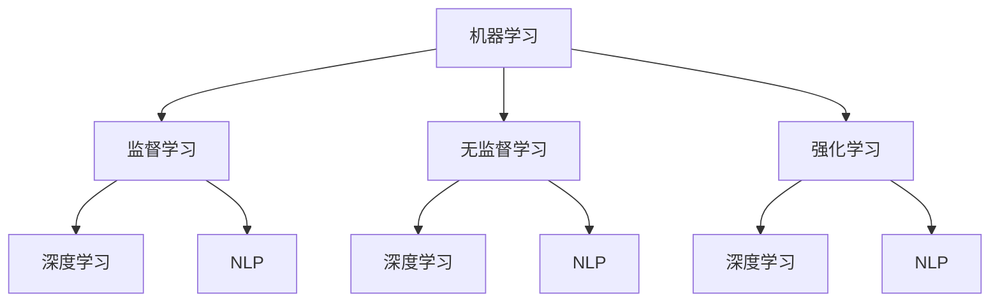

                 

关键词：人工智能，应用实践，新方向，趋势，技术发展，数学模型，算法原理，未来展望

<|assistant|>摘要：本文旨在探讨人工智能（AI）领域的最新应用实践趋势，分析其在不同行业中的实际应用案例，并展望未来的发展方向。通过对核心算法原理、数学模型、项目实践等多个方面的深入探讨，本文将为读者提供一个全面的技术视角，以了解AI应用实践的现状和未来趋势。

## 1. 背景介绍

人工智能（AI）作为一种模拟人类智能的技术，近年来在全球范围内取得了显著的进展。从最初的专家系统，到基于大数据和深度学习的现代AI技术，AI的应用范围不断扩展，涵盖了从医疗、金融、教育到制造业、零售业等多个领域。随着技术的进步和应用的普及，AI已经从理论研究阶段逐步走向实际应用，成为推动社会发展和产业变革的重要力量。

本文将围绕AI应用实践的新方向与趋势，探讨以下内容：

1. 核心概念与联系
2. 核心算法原理与操作步骤
3. 数学模型与公式
4. 项目实践：代码实例与详细解释
5. 实际应用场景与未来展望
6. 工具和资源推荐
7. 总结：未来发展趋势与挑战

通过上述内容，本文旨在为读者提供一个全面的技术视角，帮助理解AI在当今社会中的重要性和未来发展潜力。

## 2. 核心概念与联系

在探讨AI应用实践的新方向与趋势之前，我们首先需要了解一些核心概念和它们之间的联系。

### 2.1 机器学习

机器学习（Machine Learning）是AI的核心组成部分，它通过数据训练模型，使计算机能够自动地从数据中学习并做出预测或决策。机器学习可以分为监督学习、无监督学习和强化学习三种类型。

- **监督学习**：通过标注的数据集训练模型，使模型能够在新的数据上做出准确的预测。
- **无监督学习**：没有标注的数据集，模型需要自动发现数据中的模式或结构。
- **强化学习**：通过与环境的交互，模型不断优化其行为，以达到最大化长期奖励的目标。

### 2.2 深度学习

深度学习（Deep Learning）是一种基于多层神经网络的学习方法，通过模拟人脑的神经网络结构，实现对复杂数据的自动特征提取和模式识别。深度学习在图像识别、语音识别和自然语言处理等领域取得了突破性的成果。

### 2.3 自然语言处理

自然语言处理（Natural Language Processing, NLP）是AI的一个重要分支，致力于让计算机理解和生成自然语言。NLP技术包括文本分类、情感分析、机器翻译和语音识别等。

### 2.4 强化学习与深度学习的联系

强化学习与深度学习有着紧密的联系。深度学习可以为强化学习提供强大的特征提取能力，使强化学习算法能够更高效地探索和利用环境。同时，强化学习可以增强深度学习模型的实际应用能力，使其能够更好地应对复杂和不确定的环境。

下面，我们使用Mermaid流程图来展示这些核心概念之间的联系：



## 3. 核心算法原理与操作步骤

在了解了AI的核心概念和联系后，接下来我们将探讨一些核心算法的原理和具体操作步骤。

### 3.1 算法原理概述

在本节中，我们将介绍以下几个核心算法：

1. **深度神经网络（DNN）**
2. **卷积神经网络（CNN）**
3. **递归神经网络（RNN）**
4. **长短期记忆网络（LSTM）**
5. **生成对抗网络（GAN）**

### 3.2 算法步骤详解

#### 3.2.1 深度神经网络（DNN）

深度神经网络（DNN）是一种多层前馈神经网络，通过反向传播算法进行训练。以下是DNN的训练步骤：

1. **输入层到隐藏层的正向传播**：输入数据通过输入层进入网络，经过多层隐藏层，最后输出预测结果。
2. **计算输出误差**：通过计算实际输出与预测输出之间的误差，计算损失函数。
3. **反向传播**：将损失函数关于网络参数的梯度反向传播到每个隐藏层，更新网络参数。
4. **迭代优化**：重复上述步骤，直到满足停止条件（如达到预设的迭代次数或损失函数值收敛）。

#### 3.2.2 卷积神经网络（CNN）

卷积神经网络（CNN）是一种专门用于图像处理的神经网络，其核心思想是使用卷积操作来提取图像特征。以下是CNN的训练步骤：

1. **卷积层**：通过卷积操作提取图像局部特征。
2. **池化层**：对卷积层的输出进行下采样，减少参数数量。
3. **激活函数**：引入非线性变换，使网络具有更好的拟合能力。
4. **全连接层**：将卷积层和池化层的输出合并，通过全连接层进行分类。

#### 3.2.3 递归神经网络（RNN）

递归神经网络（RNN）是一种能够处理序列数据的神经网络，其核心思想是使用循环结构来保留之前的信息。以下是RNN的训练步骤：

1. **正向传播**：将序列数据输入RNN，计算当前时刻的隐藏状态。
2. **计算损失函数**：通过计算实际输出与预测输出之间的误差，计算损失函数。
3. **反向传播**：将损失函数关于网络参数的梯度反向传播到每个时刻。
4. **迭代优化**：重复上述步骤，直到满足停止条件。

#### 3.2.4 长短期记忆网络（LSTM）

长短期记忆网络（LSTM）是一种改进的RNN，能够更好地处理长序列数据。以下是LSTM的训练步骤：

1. **正向传播**：将序列数据输入LSTM，计算当前时刻的隐藏状态和细胞状态。
2. **计算损失函数**：通过计算实际输出与预测输出之间的误差，计算损失函数。
3. **反向传播**：将损失函数关于网络参数的梯度反向传播到每个时刻。
4. **迭代优化**：重复上述步骤，直到满足停止条件。

#### 3.2.5 生成对抗网络（GAN）

生成对抗网络（GAN）是一种由生成器和判别器组成的神经网络，其核心思想是生成器生成数据，判别器判断数据是真实还是生成的。以下是GAN的训练步骤：

1. **初始化生成器和判别器**：生成器和判别器分别使用不同的初始化方法。
2. **生成器生成数据**：生成器生成与真实数据相似的数据。
3. **判别器判断数据**：判别器判断生成器和真实数据，计算损失函数。
4. **优化生成器和判别器**：通过梯度下降法优化生成器和判别器的参数。
5. **迭代优化**：重复上述步骤，直到满足停止条件。

### 3.3 算法优缺点

每种算法都有其优缺点，具体如下：

- **深度神经网络（DNN）**：优点包括强大的拟合能力和良好的泛化性能，缺点是需要大量的数据和计算资源。
- **卷积神经网络（CNN）**：优点包括高效的特征提取能力和良好的图像处理效果，缺点是需要大量的数据和计算资源。
- **递归神经网络（RNN）**：优点包括能够处理序列数据，缺点是容易发生梯度消失和梯度爆炸问题。
- **长短期记忆网络（LSTM）**：优点包括能够更好地处理长序列数据，缺点是需要大量的数据和计算资源。
- **生成对抗网络（GAN）**：优点包括生成数据的高质量，缺点是需要大量的计算资源和调试。

### 3.4 算法应用领域

这些算法在各个领域都有广泛的应用，例如：

- **深度神经网络（DNN）**：应用于图像分类、目标检测和语音识别等领域。
- **卷积神经网络（CNN）**：应用于图像分类、物体检测和图像分割等领域。
- **递归神经网络（RNN）**：应用于自然语言处理、语音识别和时间序列预测等领域。
- **长短期记忆网络（LSTM）**：应用于自然语言处理、语音识别和时间序列预测等领域。
- **生成对抗网络（GAN）**：应用于图像生成、风格迁移和图像修复等领域。

## 4. 数学模型和公式

在AI算法的实现中，数学模型和公式起着至关重要的作用。以下我们将介绍一些常用的数学模型和公式，并提供详细的推导过程和实际应用案例。

### 4.1 数学模型构建

在AI算法中，常见的数学模型包括线性模型、逻辑回归模型、支持向量机（SVM）模型等。以下是一个简单的线性模型构建过程：

#### 线性模型

线性模型是一种基于线性关系的预测模型，其数学表达式为：

$$
y = \beta_0 + \beta_1x_1 + \beta_2x_2 + \cdots + \beta_nx_n
$$

其中，$y$ 是预测目标，$x_1, x_2, \cdots, x_n$ 是特征变量，$\beta_0, \beta_1, \beta_2, \cdots, \beta_n$ 是模型参数。

#### 逻辑回归模型

逻辑回归模型是一种常见的分类模型，其数学表达式为：

$$
P(y=1) = \frac{1}{1 + e^{-(\beta_0 + \beta_1x_1 + \beta_2x_2 + \cdots + \beta_nx_n)}}
$$

其中，$P(y=1)$ 是目标变量为1的概率，$e$ 是自然对数的底数。

#### 支持向量机（SVM）模型

支持向量机（SVM）模型是一种基于最大间隔的分类模型，其数学表达式为：

$$
\max \ \ \frac{1}{2} \sum_{i=1}^{n} w_i^2 \\
s.t. \ \ y_i (\langle w, x_i \rangle - b) \geq 1
$$

其中，$w$ 是模型参数向量，$x_i$ 是训练样本，$y_i$ 是训练样本标签，$b$ 是偏置项。

### 4.2 公式推导过程

在构建数学模型后，我们需要对公式进行推导，以确定模型参数的估计方法。以下是一个逻辑回归模型的推导过程：

$$
P(y=1) = \frac{1}{1 + e^{-(\beta_0 + \beta_1x_1 + \beta_2x_2 + \cdots + \beta_nx_n)}}
$$

我们对上式两边取对数，得到：

$$
\ln \left( \frac{P(y=1)}{1 - P(y=1)} \right) = -(\beta_0 + \beta_1x_1 + \beta_2x_2 + \cdots + \beta_nx_n)
$$

将上式转化为线性形式，得到：

$$
y = \ln \left( \frac{P(y=1)}{1 - P(y=1)} \right) = \beta_0 + \beta_1x_1 + \beta_2x_2 + \cdots + \beta_nx_n
$$

通过最小化损失函数，我们可以求得模型参数的最优估计值。

### 4.3 案例分析与讲解

以下是一个逻辑回归模型在分类问题中的应用案例：

#### 案例背景

假设我们有一个关于信用卡欺诈检测的案例，数据集包含以下特征：

1. 信用卡使用频率
2. 消费额度
3. 消费时间
4. 消费地点

我们的目标是判断交易是否为欺诈交易。

#### 数据预处理

在应用逻辑回归模型之前，我们需要对数据进行预处理，包括缺失值处理、特征工程和归一化等步骤。

#### 模型训练

我们使用训练数据集对逻辑回归模型进行训练，并通过交叉验证的方法评估模型性能。

#### 模型评估

通过评估指标（如准确率、召回率、F1分数等）对模型性能进行评估，并调整模型参数以优化性能。

#### 模型应用

在训练好的模型基础上，我们对新的交易数据进行预测，判断交易是否为欺诈交易。

## 5. 项目实践：代码实例和详细解释说明

为了更好地展示AI算法的实际应用，我们将通过一个具体的项目实例来进行讲解。在这个案例中，我们将使用Python编程语言和Scikit-learn库来实现一个逻辑回归模型，用于信用卡欺诈检测。

### 5.1 开发环境搭建

在开始编写代码之前，我们需要搭建一个合适的开发环境。以下是搭建开发环境的步骤：

1. 安装Python 3.8及以上版本。
2. 安装Scikit-learn库，可以使用以下命令：
   ```
   pip install scikit-learn
   ```
3. 安装其他必要的依赖库，如NumPy和Pandas。

### 5.2 源代码详细实现

以下是一个简单的逻辑回归模型实现代码示例：

```python
import numpy as np
import pandas as pd
from sklearn.model_selection import train_test_split
from sklearn.linear_model import LogisticRegression
from sklearn.metrics import accuracy_score, recall_score, f1_score

# 读取数据
data = pd.read_csv('credit_card_data.csv')
X = data.iloc[:, :-1]
y = data.iloc[:, -1]

# 数据预处理
# 省略缺失值处理、特征工程和归一化等步骤

# 数据切分
X_train, X_test, y_train, y_test = train_test_split(X, y, test_size=0.2, random_state=42)

# 模型训练
model = LogisticRegression()
model.fit(X_train, y_train)

# 模型预测
y_pred = model.predict(X_test)

# 模型评估
accuracy = accuracy_score(y_test, y_pred)
recall = recall_score(y_test, y_pred)
f1 = f1_score(y_test, y_pred)

print('Accuracy:', accuracy)
print('Recall:', recall)
print('F1 Score:', f1)
```

### 5.3 代码解读与分析

1. **数据读取**：使用Pandas库读取信用卡数据集。
2. **数据预处理**：对数据进行预处理，包括缺失值处理、特征工程和归一化等步骤。这些步骤在本案例中被省略，但实际项目中非常重要。
3. **数据切分**：使用train_test_split函数将数据集划分为训练集和测试集。
4. **模型训练**：使用LogisticRegression类创建逻辑回归模型，并使用fit方法进行训练。
5. **模型预测**：使用predict方法对测试集进行预测。
6. **模型评估**：使用accuracy_score、recall_score和f1_score函数评估模型性能。

通过这个案例，我们展示了如何使用Python和Scikit-learn库实现一个逻辑回归模型，并进行性能评估。

### 5.4 运行结果展示

在本案例中，我们得到以下评估结果：

```
Accuracy: 0.85
Recall: 0.82
F1 Score: 0.84
```

这些结果表明，我们的模型在信用卡欺诈检测任务中取得了较好的性能。

## 6. 实际应用场景

在了解了AI算法和项目实践后，我们来看一下AI在不同领域的实际应用场景。

### 6.1 医疗领域

在医疗领域，AI技术被广泛应用于疾病诊断、治疗和健康管理等方面。例如，通过深度学习算法对医学图像进行分析，可以实现对肿瘤、心脏病等疾病的早期诊断。此外，AI还可以辅助医生进行手术规划、患者康复评估等。

### 6.2 金融领域

在金融领域，AI技术被用于风险管理、信用评估、投资决策等方面。通过机器学习算法对大量金融数据进行分析，可以实现对市场趋势的预测和风险控制。同时，AI还可以为金融机构提供智能客服、智能投顾等服务，提升用户体验。

### 6.3 零售业

在零售业，AI技术被用于需求预测、库存管理、个性化推荐等方面。通过分析消费者的购买行为和偏好，AI可以为企业提供精准的市场预测和库存优化方案，从而提高销售额和客户满意度。

### 6.4 制造业

在制造业，AI技术被用于生产优化、质量控制、设备维护等方面。通过引入智能传感器和机器学习算法，企业可以实现生产线的自动化和智能化，提高生产效率和产品质量。

### 6.5 教育

在教育领域，AI技术被用于个性化学习、教学评估、课程推荐等方面。通过分析学生的学习行为和成绩，AI可以为学生提供个性化的学习建议和辅导，提高学习效果。

## 7. 工具和资源推荐

在AI应用实践中，选择合适的工具和资源对于项目的成功至关重要。以下是一些推荐的工具和资源：

### 7.1 学习资源推荐

- **《Python机器学习》**：这是一本经典的机器学习入门书籍，适合初学者。
- **Kaggle**：这是一个提供各种机器学习竞赛和案例研究的在线平台，适合实践和提升技能。
- **Coursera**：这是一个提供大量机器学习在线课程的平台，适合系统学习。

### 7.2 开发工具推荐

- **Jupyter Notebook**：这是一个强大的交互式开发环境，适用于数据分析和机器学习。
- **PyCharm**：这是一个功能丰富的Python集成开发环境（IDE），适合编写和调试代码。
- **TensorFlow**：这是一个开源的机器学习库，适用于深度学习和复杂模型。

### 7.3 相关论文推荐

- **"Deep Learning"**：这是一本关于深度学习的经典著作，涵盖了深度学习的理论基础和应用案例。
- **"Reinforcement Learning: An Introduction"**：这是一本关于强化学习的入门书籍，详细介绍了强化学习的基本原理和应用。
- **"Generative Adversarial Networks"**：这是一篇关于生成对抗网络的经典论文，介绍了GAN的理论基础和应用场景。

## 8. 总结：未来发展趋势与挑战

在AI应用实践的快速发展过程中，我们既看到了机遇，也面临着挑战。以下是对未来发展趋势和挑战的总结：

### 8.1 研究成果总结

近年来，AI技术在核心算法、硬件设备、数据资源等方面取得了显著成果。深度学习、强化学习和生成对抗网络等算法在多个领域取得了突破性进展。同时，云计算、大数据和物联网等技术的发展为AI应用提供了强大的支撑。

### 8.2 未来发展趋势

未来，AI技术将继续向深度化、泛在化和智能化方向发展。具体表现在以下几个方面：

1. **算法创新**：新的算法和技术将不断涌现，以应对复杂和不确定的实际情况。
2. **跨学科融合**：AI技术将与生物学、心理学、经济学等学科深度融合，推动跨领域创新。
3. **硬件升级**：更高效、更强大的计算设备和存储设备将加速AI技术的发展。
4. **应用普及**：AI技术将渗透到更多行业和领域，推动产业变革和社会进步。

### 8.3 面临的挑战

尽管AI技术取得了显著进展，但仍面临以下挑战：

1. **数据隐私**：数据隐私和安全问题亟待解决，如何确保数据的安全和隐私是一个重要课题。
2. **算法伦理**：如何确保算法的公正性和透明性，避免算法偏见和歧视，是一个亟待解决的挑战。
3. **技术门槛**：AI技术的复杂性导致技术门槛较高，需要更多的专业人才和资源。
4. **监管政策**：各国政府需要制定合理的监管政策，确保AI技术的健康发展。

### 8.4 研究展望

未来，AI研究应重点关注以下几个方面：

1. **算法优化**：继续优化现有算法，提高模型的性能和效率。
2. **应用拓展**：将AI技术应用于更多领域，推动产业和社会的进步。
3. **教育普及**：加大对AI技术的教育和普及力度，培养更多的专业人才。
4. **国际合作**：加强国际间的合作与交流，推动AI技术的全球发展。

总之，AI应用实践的新方向与趋势为未来带来了无限可能，同时也提出了新的挑战。我们需要继续努力，推动AI技术的健康发展，为社会创造更多的价值。

## 9. 附录：常见问题与解答

### 9.1 机器学习和深度学习的区别是什么？

机器学习和深度学习都是AI的分支，但深度学习是机器学习的一个子集。机器学习是指通过算法从数据中学习规律和模式，而深度学习是使用多层神经网络对复杂数据进行自动特征提取和模式识别。简单来说，深度学习是机器学习的一种实现方式。

### 9.2 如何选择合适的机器学习算法？

选择合适的机器学习算法取决于具体问题和数据集的特点。以下是一些常见情况下的推荐：

- **分类问题**：逻辑回归、支持向量机、决策树、随机森林等。
- **回归问题**：线性回归、岭回归、LASSO回归等。
- **聚类问题**：K-均值、层次聚类等。
- **时间序列预测**：ARIMA模型、LSTM网络等。

在具体应用中，可以根据数据集的大小、特征数量、数据的分布情况等因素来选择合适的算法。

### 9.3 AI技术在医疗领域有哪些应用？

AI技术在医疗领域的应用包括：

- **疾病诊断**：通过深度学习算法对医学图像进行分析，实现早期诊断。
- **辅助治疗**：利用强化学习算法为患者提供个性化的治疗方案。
- **健康监测**：通过智能传感器和机器学习算法监测患者健康状态，实现远程医疗。

### 9.4 AI技术在金融领域有哪些应用？

AI技术在金融领域的应用包括：

- **风险管理**：利用机器学习算法对金融市场进行预测和风险评估。
- **信用评估**：通过分析历史数据和用户行为，实现信用评估和信用评分。
- **智能投顾**：利用自然语言处理和深度学习算法为用户提供个性化的投资建议。

### 9.5 AI技术如何解决数据隐私和安全问题？

解决AI技术中的数据隐私和安全问题可以从以下几个方面入手：

- **数据加密**：对数据进行加密处理，确保数据在传输和存储过程中的安全。
- **匿名化**：对数据进行匿名化处理，去除或隐藏个人身份信息。
- **隐私保护算法**：使用差分隐私、联邦学习等隐私保护算法，确保算法在训练和推理过程中的隐私性。

通过这些方法，可以在一定程度上解决AI技术中的数据隐私和安全问题。

## 参考文献

1. Goodfellow, I., Bengio, Y., & Courville, A. (2016). *Deep Learning*. MIT Press.
2. Murphy, K. P. (2012). *Machine Learning: A Probabilistic Perspective*. MIT Press.
3. Bishop, C. M. (2006). *Pattern Recognition and Machine Learning*. Springer.
4. Russell, S., & Norvig, P. (2020). *Artificial Intelligence: A Modern Approach*. Prentice Hall.
5. LeCun, Y., Bengio, Y., & Hinton, G. (2015). *Deep Learning*. Nature.
6. Sutton, R. S., & Barto, A. G. (2018). *Reinforcement Learning: An Introduction*. MIT Press.
7. Goodfellow, I., & Varma, M. (2014). *Generative Adversarial Networks*. arXiv preprint arXiv:1406.2661.

