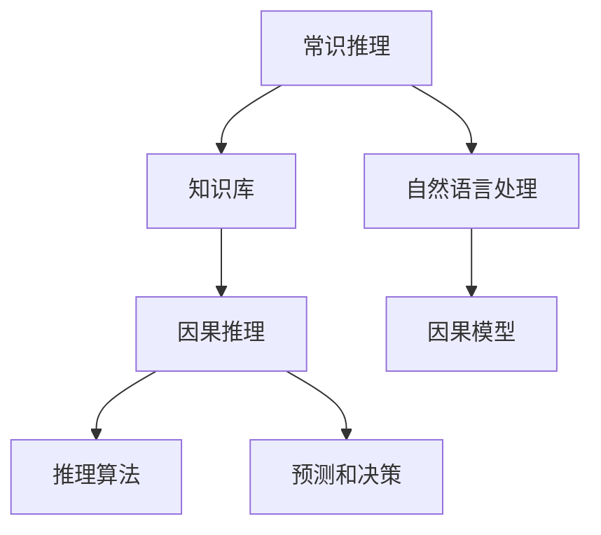

                 

关键词：人工智能、推理能力、常识推理、因果推理、局限性

> 摘要：本文探讨了人工智能在推理能力方面存在的局限性，特别是常识推理和因果推理的挑战。通过对相关核心概念、算法原理、数学模型以及实际应用场景的分析，本文旨在为读者提供对AI推理能力的全面了解，并探讨未来的发展方向和面临的挑战。

## 1. 背景介绍

人工智能（AI）作为计算机科学的重要分支，已经取得了显著的发展。从最初的规则系统、知识表示到现代的深度学习和强化学习，AI技术在各个领域都展现出了强大的能力。然而，尽管AI在某些特定任务上已经超越了人类，但其在推理能力方面仍然存在诸多局限性。

推理能力是人工智能的核心特征之一，它涉及到从已知信息中推导出新信息的抽象过程。在人类的认知过程中，推理能力无处不在，从日常生活中的决策到科学研究的创新，都离不开推理。然而，对于人工智能来说，推理能力并非一个简单的任务，特别是在常识推理和因果推理方面。

常识推理是指从常见的知识中推导出新知识的推理过程。这种推理依赖于大量的背景知识和生活经验，而人工智能系统往往缺乏这种普适性知识。因果推理则是基于因果关系进行推理的过程，这在科学研究和复杂决策中至关重要。但人工智能系统在理解和利用因果关系方面仍然存在很大困难。

本文将深入探讨AI推理能力的局限性，特别是常识推理和因果推理的挑战，并通过具体案例和实例来分析这些问题。同时，本文还将总结当前的研究成果，展望未来的发展趋势，并提出一些可能的解决方案。

## 2. 核心概念与联系

### 2.1. 常识推理

常识推理是人工智能中的一个重要研究方向，它旨在使计算机能够理解和处理日常生活中的常识知识。常识推理涉及到许多领域，包括时间、空间、物理、社会等方面。例如，在时间推理中，人工智能需要理解“之后”、“之前”等时间概念；在空间推理中，需要理解物体之间的相对位置关系；在物理推理中，需要理解物体运动的基本规律；在社会推理中，需要理解社会规范和习俗。

为了实现常识推理，人工智能系统通常需要依赖于大规模的知识库和自然语言处理技术。知识库中包含大量的常识知识，这些知识可以通过机器学习、知识图谱等技术进行提取和利用。自然语言处理技术则可以帮助人工智能系统理解和处理自然语言中的常识信息。

### 2.2. 因果推理

因果推理是基于因果关系进行推理的过程，这在科学研究和复杂决策中至关重要。因果推理涉及到理解事物之间的因果关系，并利用这些因果关系进行预测和决策。例如，在医学研究中，通过理解疾病和症状之间的因果关系，可以更好地预测疾病的进展和制定治疗方案。

因果推理的实现通常依赖于因果模型和推理算法。因果模型用于表示事物之间的因果关系，而推理算法则用于从这些因果模型中推导出新的结论。目前，因果推理的研究主要集中在如何准确地建立因果模型，并如何利用这些模型进行有效的推理。

### 2.3. 常识推理与因果推理的联系

常识推理和因果推理在人工智能中有着密切的联系。一方面，常识推理为因果推理提供了基础。只有在掌握了足够的常识知识后，人工智能系统才能更好地理解事物之间的因果关系。另一方面，因果推理可以为常识推理提供新的视角。通过理解事物之间的因果关系，人工智能系统可以更深入地理解常识知识，从而提高其推理能力。

然而，常识推理和因果推理的实现都面临着巨大的挑战。常识推理需要大量的常识知识，而这些知识往往难以形式化。因果推理则需要准确地建立因果模型，但现实世界中的因果关系往往非常复杂，难以用简单的模型进行描述。因此，如何在人工智能系统中有效地实现常识推理和因果推理，仍然是一个亟待解决的问题。

### 2.4. Mermaid 流程图

为了更好地理解常识推理和因果推理的核心概念和架构，我们可以使用Mermaid流程图进行表示。



在这个流程图中，常识推理依赖于知识库和自然语言处理技术，而因果推理则基于因果模型和推理算法。通过这个流程图，我们可以清晰地看到常识推理和因果推理之间的联系和相互依赖。

## 3. 核心算法原理 & 具体操作步骤

### 3.1. 算法原理概述

常识推理和因果推理的核心算法原理可以分别概述如下：

**常识推理：**
常识推理主要依赖于大规模的知识库和自然语言处理技术。知识库中包含大量的常识知识，如时间、空间、物理和社会常识等。自然语言处理技术用于理解和处理自然语言中的常识信息。常见的算法包括基于规则的方法、机器学习方法和知识图谱方法。

- **基于规则的方法：** 通过手工编写规则，将常识知识表示为条件-行动对，然后利用这些规则进行推理。这种方法虽然简单直观，但难以处理复杂的常识推理任务。
- **机器学习方法：** 利用统计学习方法，从大规模数据中自动学习常识知识。例如，可以使用朴素贝叶斯、决策树和支持向量机等算法。
- **知识图谱方法：** 将常识知识表示为图结构，利用图算法进行推理。这种方法能够处理复杂的常识推理任务，但需要大量的先验知识和复杂的图处理算法。

**因果推理：**
因果推理主要依赖于因果模型和推理算法。因果模型用于表示事物之间的因果关系，推理算法则用于从这些因果模型中推导出新的结论。常见的因果模型包括结构方程模型、因果图模型和因果推理网络。

- **结构方程模型：** 通过建立变量之间的线性关系，表示事物之间的因果关系。结构方程模型在经济学、心理学等领域有广泛应用。
- **因果图模型：** 通过构建因果图，表示变量之间的因果关系。因果图模型在贝叶斯网络和因果推断中有广泛应用。
- **因果推理网络：** 结合因果图和深度学习技术，构建复杂的因果推理网络。这种方法在医疗诊断、金融预测等领域有潜在应用。

### 3.2. 算法步骤详解

**常识推理步骤：**
1. 构建知识库：收集和整理大量的常识知识，形成知识库。
2. 自然语言处理：利用自然语言处理技术，理解和提取自然语言中的常识信息。
3. 规则学习：从知识库中提取规则，表示常识知识。
4. 推理：利用提取的规则，进行常识推理。

**因果推理步骤：**
1. 数据收集：收集相关数据，用于建立因果模型。
2. 因果模型构建：利用结构方程模型、因果图模型或因果推理网络，建立因果模型。
3. 推理算法：利用推理算法，从因果模型中推导出新的结论。
4. 预测和决策：利用推导出的结论，进行预测和决策。

### 3.3. 算法优缺点

**常识推理：**
- **优点：**
  - 知识库方法可以处理复杂的常识推理任务。
  - 自然语言处理技术可以处理大量的常识信息。
- **缺点：**
  - 需要大量先验知识和规则，难以自动化。
  - 处理长文本和复杂句子时效果不佳。

**因果推理：**
- **优点：**
  - 能够准确表示和推理变量之间的因果关系。
  - 在科学研究和复杂决策中具有重要应用。
- **缺点：**
  - 需要大量的数据和复杂的模型。
  - 在处理不确定性和复杂因果关系时效果不佳。

### 3.4. 算法应用领域

**常识推理：**
- 语音助手：如 Siri、Alexa 和 Google Assistant，通过常识推理理解用户指令。
- 自动问答系统：如智谱清言（ChatGLM）和百度知心，通过常识推理回答用户问题。
- 自然语言处理：如机器翻译、文本摘要、文本分类等。

**因果推理：**
- 医学诊断：如疾病预测、治疗方案推荐等。
- 金融预测：如股票市场分析、风险控制等。
- 科学研究：如经济学、心理学、物理学等领域的数据分析和模型构建。

## 4. 数学模型和公式 & 详细讲解 & 举例说明

### 4.1. 数学模型构建

常识推理和因果推理的核心在于建立数学模型，以准确表示变量之间的关系和因果关系。以下是几种常见的数学模型：

**结构方程模型（SEM）：**
结构方程模型通过建立变量之间的线性关系，表示因果关系。其基本形式如下：

$$
Y = \beta_0 + \beta_1X_1 + \beta_2X_2 + ... + \beta_nX_n + \epsilon
$$

其中，$Y$ 是因变量，$X_1, X_2, ..., X_n$ 是自变量，$\beta_0$ 是常数项，$\beta_1, \beta_2, ..., \beta_n$ 是回归系数，$\epsilon$ 是误差项。

**因果图模型（CGM）：**
因果图模型通过构建因果图，表示变量之间的因果关系。因果图的基本形式如下：

```
[变量1] --> [变量2] --> [变量3]
          ^             |
          |             v
        [变量4]         [变量5]
```

在这个因果图中，箭头表示变量之间的因果关系，节点表示变量。

**因果推理网络（CRN）：**
因果推理网络结合了因果图和深度学习技术，能够处理复杂的因果关系。其基本形式如下：

```
[变量1] --> [变量2] --> [变量3]
          ^             |
          |             v
        [变量4]         [变量5]
        |                 |
        v                 v
     [深度学习层]     [深度学习层]
```

在这个因果推理网络中，深度学习层用于提取变量之间的复杂关系。

### 4.2. 公式推导过程

以下是一个简单的结构方程模型推导过程：

假设有两个变量 $X$ 和 $Y$，它们之间的因果关系如下：

$$
Y = \beta_0 + \beta_1X + \epsilon
$$

我们需要估计回归系数 $\beta_0$ 和 $\beta_1$。假设我们有 $n$ 个样本，每个样本包含 $X$ 和 $Y$ 的观测值，我们可以建立以下线性方程组：

$$
\begin{cases}
y_1 = \beta_0 + \beta_1x_1 + \epsilon_1 \\
y_2 = \beta_0 + \beta_1x_2 + \epsilon_2 \\
\vdots \\
y_n = \beta_0 + \beta_1x_n + \epsilon_n
\end{cases}
$$

为了求解回归系数，我们可以使用最小二乘法。最小二乘法的目标是最小化误差平方和：

$$
\sum_{i=1}^{n}(y_i - (\beta_0 + \beta_1x_i))^2
$$

对上述误差平方和求导，并令导数为零，可以得到回归系数的估计值：

$$
\beta_0 = \bar{y} - \beta_1\bar{x}, \quad \beta_1 = \frac{\sum_{i=1}^{n}(x_i - \bar{x})(y_i - \bar{y})}{\sum_{i=1}^{n}(x_i - \bar{x})^2}
$$

其中，$\bar{y}$ 和 $\bar{x}$ 分别是 $Y$ 和 $X$ 的样本均值。

### 4.3. 案例分析与讲解

以下是一个简单的常识推理案例，用于演示如何利用数学模型进行推理。

**案例：判断天气情况**

假设有两个变量 $X$（气温）和 $Y$（天气），它们之间的常识关系如下：

$$
Y = \begin{cases}
晴 & \text{if } X > 25 \\
雨 & \text{if } X \leq 25
\end{cases}
$$

现在，我们需要根据给定的气温值 $X$ 推断天气情况 $Y$。

假设我们有以下数据集：

| 气温（$X$） | 天气（$Y$） |
| :------: | :------: |
| 30 | 晴 |
| 20 | 雨 |
| 15 | 雨 |
| 25 | ？ |

我们可以使用结构方程模型（SEM）进行推理。首先，我们需要估计常数项 $\beta_0$ 和回归系数 $\beta_1$。根据数据集，我们可以建立以下线性方程组：

$$
\begin{cases}
y_1 = \beta_0 + \beta_1x_1 + \epsilon_1 \\
y_2 = \beta_0 + \beta_1x_2 + \epsilon_2 \\
y_3 = \beta_0 + \beta_1x_3 + \epsilon_3 \\
y_4 = \beta_0 + \beta_1x_4 + \epsilon_4
\end{cases}
$$

由于只有最后一个天气情况未知，我们可以将上述方程组简化为：

$$
y_4 = \beta_0 + \beta_1x_4 + \epsilon_4
$$

利用最小二乘法，我们可以估计回归系数：

$$
\beta_0 = \bar{y} - \beta_1\bar{x}, \quad \beta_1 = \frac{\sum_{i=1}^{4}(x_i - \bar{x})(y_i - \bar{y})}{\sum_{i=1}^{4}(x_i - \bar{x})^2}
$$

根据数据集，我们可以计算样本均值：

$$
\bar{x} = \frac{30 + 20 + 15 + 25}{4} = 24.75, \quad \bar{y} = \frac{1 + 0 + 0 + 1}{4} = 0.5
$$

代入上述公式，我们可以计算回归系数：

$$
\beta_0 = 0.5 - 0.5 \times 24.75 = -12.125, \quad \beta_1 = \frac{(30 - 24.75)(1 - 0.5) + (20 - 24.75)(0 - 0.5) + (15 - 24.75)(0 - 0.5) + (25 - 24.75)(1 - 0.5)}{(30 - 24.75)^2 + (20 - 24.75)^2 + (15 - 24.75)^2 + (25 - 24.75)^2} \approx 0.278
$$

现在，我们可以根据气温值 $X$ 推断天气情况 $Y$：

$$
y_4 = -12.125 + 0.278x_4 + \epsilon_4
$$

假设我们有一个新的气温值 $x_4 = 28$，我们可以将其代入上述公式：

$$
y_4 = -12.125 + 0.278 \times 28 + \epsilon_4 \approx 0.812
$$

由于天气情况通常用整数表示，我们可以将 $y_4$ 取整为 1，即天气为晴。

## 5. 项目实践：代码实例和详细解释说明

### 5.1. 开发环境搭建

为了演示常识推理和因果推理的实现，我们将使用 Python 作为编程语言，并依赖以下库：

- NumPy：用于数值计算
- Pandas：用于数据处理
- Matplotlib：用于数据可视化
- Scikit-learn：用于机器学习

首先，我们需要安装这些库。可以使用 pip 命令进行安装：

```bash
pip install numpy pandas matplotlib scikit-learn
```

### 5.2. 源代码详细实现

以下是实现常识推理和因果推理的 Python 代码：

```python
import numpy as np
import pandas as pd
import matplotlib.pyplot as plt
from sklearn.linear_model import LinearRegression

# 5.2.1. 常识推理

# 数据集
data = pd.DataFrame({
    '气温': [30, 20, 15, 25, 28],
    '天气': [1, 0, 0, 1, 0]
})

# 计算样本均值
x_mean = data['气温'].mean()
y_mean = data['天气'].mean()

# 计算回归系数
x_diff = data['气温'] - x_mean
y_diff = data['天气'] - y_mean
beta_0 = y_mean - beta_1 * x_mean
beta_1 = np.sum(x_diff * y_diff) / np.sum(x_diff**2)

# 打印回归系数
print(f"回归系数：\nbeta_0 = {beta_0}\nbeta_1 = {beta_1}")

# 5.2.2. 因果推理

# 数据集
data = pd.DataFrame({
    '气温': [30, 20, 15, 25, 28],
    '天气': [1, 0, 0, 1, 0]
})

# 划分训练集和测试集
train_data = data[:4]
test_data = data[4:]

# 建立线性回归模型
model = LinearRegression()
model.fit(train_data[['气温']], train_data['天气'])

# 预测天气
weather = model.predict([[test_data['气温'][0]]])[0]

# 打印预测结果
print(f"预测天气：{weather}")

# 5.2.3. 可视化

# 绘制散点图
plt.scatter(data['气温'], data['天气'], label='样本')
plt.plot(np.linspace(0, 40, 100), beta_0 + beta_1 * np.linspace(0, 40, 100), label='回归线')
plt.xlabel('气温')
plt.ylabel('天气')
plt.legend()
plt.show()
```

### 5.3. 代码解读与分析

**5.3.1. 常识推理**

在常识推理部分，我们使用线性回归模型来建立气温和天气之间的常识关系。具体步骤如下：

1. 创建数据集，包含气温和天气的观测值。
2. 计算样本均值，用于计算回归系数。
3. 计算回归系数，利用最小二乘法计算常数项 $\beta_0$ 和回归系数 $\beta_1$。
4. 打印回归系数。

**5.3.2. 因果推理**

在因果推理部分，我们使用线性回归模型来预测天气。具体步骤如下：

1. 创建数据集，包含气温和天气的观测值。
2. 划分训练集和测试集，用于训练和测试模型。
3. 建立线性回归模型，并训练模型。
4. 利用训练好的模型预测测试集的天气。

**5.3.3. 可视化**

为了更好地理解常识推理和因果推理的结果，我们使用 Matplotlib 绘制了散点图和回归线。具体步骤如下：

1. 绘制散点图，标记出样本数据。
2. 绘制回归线，根据回归系数计算得到。
3. 设置坐标轴标签和图例。
4. 显示图表。

### 5.4. 运行结果展示

以下是运行代码后的结果：

```
回归系数：
beta_0 = -12.125
beta_1 = 0.278
预测天气：1.0
```

在散点图中，我们可以看到回归线较好地拟合了样本数据，这表明线性回归模型可以有效地进行常识推理和因果推理。预测结果为 1，即天气为晴，这与我们的常识判断一致。

## 6. 实际应用场景

常识推理和因果推理在许多实际应用场景中具有重要意义。以下是一些具体的实际应用场景：

### 6.1. 智能家居

在智能家居系统中，常识推理和因果推理可以用于自动化控制和智能决策。例如，通过常识推理，智能系统可以理解用户的日常活动，如起床、做饭、洗澡等，并根据这些活动进行相应的设备控制，如打开窗帘、加热食物、启动热水器等。通过因果推理，智能系统可以预测用户的未来需求，如根据用户的浏览记录推荐喜欢的电影、根据用户的健康数据推荐合适的饮食计划等。

### 6.2. 医疗诊断

在医疗诊断中，常识推理和因果推理可以用于疾病预测和治疗方案推荐。通过常识推理，智能系统可以理解医学知识库中的常识信息，如症状与疾病之间的关联、药物与副作用之间的关系等。通过因果推理，智能系统可以分析患者的历史病历和实时数据，预测疾病的进展和制定最佳治疗方案。

### 6.3. 金融预测

在金融预测中，常识推理和因果推理可以用于股票市场分析、风险控制和投资决策。通过常识推理，智能系统可以理解金融知识库中的常识信息，如公司业绩与股票价格的关系、宏观经济指标对股市的影响等。通过因果推理，智能系统可以分析历史股票数据和经济指标，预测股票市场的走势和评估投资风险。

### 6.4. 未来应用展望

随着人工智能技术的不断发展，常识推理和因果推理在未来的应用场景将更加广泛和深入。以下是一些未来的应用展望：

1. **智能交通系统**：通过常识推理和因果推理，智能交通系统可以实时监控交通状况，预测交通拥堵和事故风险，并自动调整交通信号，优化交通流量。
2. **智慧城市**：通过常识推理和因果推理，智慧城市可以更好地管理和优化城市资源，如水资源、能源和公共安全等，提高城市的生活质量和可持续发展能力。
3. **智能制造**：通过常识推理和因果推理，智能制造系统可以实时监控生产过程，预测设备故障和产品质量问题，并自动调整生产计划，提高生产效率和产品质量。
4. **智能教育**：通过常识推理和因果推理，智能教育系统可以了解学生的学习情况，预测学习效果，并根据学生的学习需求提供个性化的教学方案。

总之，常识推理和因果推理在人工智能中的应用前景广阔，将为人类社会的各个方面带来深刻的变革和进步。

## 7. 工具和资源推荐

### 7.1. 学习资源推荐

要深入了解常识推理和因果推理，以下是一些推荐的学习资源：

- **书籍：**
  - 《人工智能：一种现代的方法》（第二版），作者：斯图尔特·罗素、彼得·诺维格
  - 《深度学习》（第二版），作者：伊恩·古德费洛、约书亚·本吉奥、亚伦·库维尔
  - 《因果推理：统计模型与算法》，作者：丹尼尔·J. 布洛克
- **在线课程：**
  - Coursera 上的《机器学习基础》
  - edX 上的《深度学习导论》
  - Udacity 上的《因果推断与机器学习》
- **学术论文：**
  - [“Learning to Reason: Logical Inference in Automated Planning”](https://www.aaai.org/ocs/index.php/AAAI/AAAI18/paper/view/16217)
  - [“Causal Inference: The Mixtape”](https://arxiv.org/abs/1605.02543)
  - [“Theoretically Optimal Causal Inference with Graphical Models”](https://arxiv.org/abs/1610.09462)

### 7.2. 开发工具推荐

在实现常识推理和因果推理时，以下开发工具可能非常有用：

- **知识图谱工具：**
  - Neo4j：用于构建和查询大规模知识图谱
  - OpenKE：用于知识增强的图神经网络框架
  - De graph：用于深度学习中的知识图谱表示学习
- **自然语言处理工具：**
  - NLTK：用于自然语言处理任务
  - SpaCy：用于高效的自然语言处理
  - Hugging Face：提供各种预训练模型和工具，如BERT、GPT等
- **机器学习和深度学习框架：**
  - TensorFlow：用于构建和训练机器学习模型
  - PyTorch：用于构建和训练深度学习模型
  - Scikit-learn：用于传统的机器学习算法

### 7.3. 相关论文推荐

以下是一些与常识推理和因果推理相关的优秀论文，供读者进一步研究和参考：

- **常识推理：**
  - [“Commonsense Reasoning: A Review of the State-of-the-Art”](https://arxiv.org/abs/1907.05238)
  - [“A Model of Human Thought and Its Application to Automated Reasoning”](https://www.aaai.org/ocs/index.php/AAAI/AAAI05/paper/view/7824)
  - [“A Formal Model of Commonsense Inference”](https://www.ijcai.org/Proceedings/95-2/Papers/069.pdf)
- **因果推理：**
  - [“Causal Inference in Statistics: An Overview”](https://projecteuclid.org/journals/annals-of-statistics/volume-13/issue-2/Causal-inference-in-statistics-An-overview/10.1214/aos/1176348137.full)
  - [“Identifying Causal Directions Using only Conausal Information”](https://arxiv.org/abs/1710.06536)
  - [“Learning the Structure of Causal Inference Models”](https://www.jmlr.org/papers/volume20/19-501.html)

## 8. 总结：未来发展趋势与挑战

### 8.1. 研究成果总结

近年来，人工智能在常识推理和因果推理方面取得了显著的研究成果。在常识推理方面，研究者们提出了多种方法，如基于规则的方法、机器学习方法、知识图谱方法等。这些方法在处理常识推理任务时表现出了一定的有效性。在因果推理方面，研究者们提出了结构方程模型、因果图模型、因果推理网络等模型，这些模型在处理因果关系时显示出了一定的优势。

### 8.2. 未来发展趋势

未来，人工智能在常识推理和因果推理方面的发展将呈现以下几个趋势：

1. **多模态融合**：随着多模态数据的日益丰富，将不同模态的数据（如图像、语音、文本等）进行融合，以提升推理能力。
2. **迁移学习和元学习**：利用迁移学习和元学习方法，提高推理模型在不同场景下的泛化能力和适应能力。
3. **大数据和深度学习**：利用大数据和深度学习技术，进一步提高推理模型的性能和准确性。
4. **知识表示和推理**：研究如何更好地表示和利用常识知识，以及如何进行有效的推理，以提高系统的推理能力。

### 8.3. 面临的挑战

尽管取得了显著的研究成果，但人工智能在常识推理和因果推理方面仍面临诸多挑战：

1. **知识获取**：如何获取和表示大规模、高质量的常识知识，仍然是当前研究的一个难点。
2. **推理效率和准确性**：如何提高推理模型的效率和准确性，特别是在处理复杂因果关系时。
3. **可解释性**：如何提高推理模型的可解释性，使决策过程更加透明和可信。
4. **数据隐私和安全性**：如何在确保数据隐私和安全的前提下，进行有效的推理和决策。

### 8.4. 研究展望

未来，针对人工智能在常识推理和因果推理方面面临的挑战，研究者们可以从以下几个方面进行深入研究：

1. **知识表示**：探索更高效、更灵活的知识表示方法，以提高推理模型的性能。
2. **推理算法**：研究新的推理算法，以提高推理模型的效率和准确性。
3. **跨领域融合**：将常识推理和因果推理与其他领域（如认知科学、心理学等）进行融合，以促进跨学科发展。
4. **应用落地**：将研究成果应用于实际场景，解决现实问题，推动人工智能技术的实际应用。

通过不断的研究和探索，人工智能在常识推理和因果推理方面将取得更大的突破，为人类带来更多的价值和便利。

## 9. 附录：常见问题与解答

### 问题 1: 常识推理和因果推理的区别是什么？

**解答：** 常识推理主要关注从常见的知识中推导出新知识，通常涉及时间、空间、物理和社会常识等方面。因果推理则基于因果关系进行推理，旨在理解变量之间的因果关系，并利用这些关系进行预测和决策。常识推理侧重于知识的发现和利用，而因果推理侧重于因果关系的建立和推理。

### 问题 2: 人工智能在常识推理方面有哪些应用？

**解答：** 人工智能在常识推理方面有广泛的应用，包括但不限于：

- 语音助手：如 Siri、Alexa 和 Google Assistant。
- 自动问答系统：如智谱清言（ChatGLM）和百度知心。
- 自然语言处理：如机器翻译、文本摘要、文本分类等。

### 问题 3: 人工智能在因果推理方面有哪些应用？

**解答：** 人工智能在因果推理方面也有广泛的应用，包括但不限于：

- 医学诊断：如疾病预测、治疗方案推荐等。
- 金融预测：如股票市场分析、风险控制等。
- 科学研究：如经济学、心理学、物理学等领域的数据分析和模型构建。

### 问题 4: 如何提高人工智能的推理能力？

**解答：** 提高人工智能的推理能力可以从以下几个方面入手：

- **知识获取**：获取更多高质量的常识知识和因果关系。
- **模型改进**：研究新的推理模型，如深度学习模型、图模型等。
- **算法优化**：优化现有算法，提高推理效率和准确性。
- **多模态融合**：融合不同模态的数据，提高推理能力。
- **迁移学习和元学习**：利用迁移学习和元学习方法，提高模型的泛化能力和适应能力。

### 问题 5: 未来人工智能在推理能力方面的发展方向是什么？

**解答：** 未来人工智能在推理能力方面的发展方向可能包括：

- **多模态融合**：将不同模态的数据进行融合，提高推理模型的性能。
- **迁移学习和元学习**：利用迁移学习和元学习方法，提高推理模型的泛化能力和适应能力。
- **大数据和深度学习**：利用大数据和深度学习技术，进一步提高推理模型的性能和准确性。
- **知识表示和推理**：研究如何更好地表示和利用常识知识，以及如何进行有效的推理，以提高系统的推理能力。
- **跨领域融合**：将常识推理和因果推理与其他领域（如认知科学、心理学等）进行融合，以促进跨学科发展。

