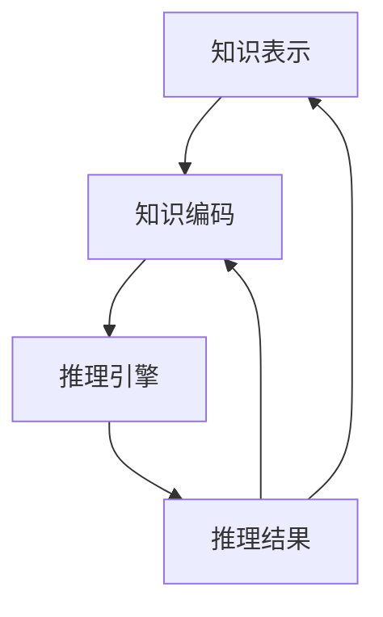

                 

关键词：人工智能，推理能力，知识编码，推理引擎，工程实现

摘要：本文将探讨人工智能中的推理能力，以及如何通过知识编码和推理引擎的工程实现，提高系统的推理效率和准确性。我们将从背景介绍、核心概念与联系、核心算法原理与操作步骤、数学模型与公式、项目实践、实际应用场景、工具和资源推荐、总结未来发展趋势与挑战等方面展开讨论。

## 1. 背景介绍

人工智能（AI）作为当今科技领域的一个重要分支，其应用范围涵盖了众多领域，包括但不限于自然语言处理、计算机视觉、推荐系统等。推理能力是人工智能系统中的一个核心能力，它决定了系统在处理不确定性和复杂问题时，能否做出合理的决策和推断。

推理能力可以分为两大类：基于规则的推理和基于模型的推理。基于规则的推理主要依赖于预定义的规则集，通过对输入数据进行模式匹配，从而得到推理结果。这种方法在实际应用中具有一定的局限性，特别是在面对复杂和非线性问题时，容易陷入“规则爆炸”的问题。而基于模型的推理则通过构建数学模型，利用模型进行推理，具有较高的灵活性和通用性。

本文将主要关注基于模型的推理能力，探讨如何通过知识编码和推理引擎的工程实现，提高系统的推理效率和准确性。

## 2. 核心概念与联系

在探讨推理能力的工程实现之前，我们需要明确几个核心概念，并了解它们之间的联系。

### 2.1 知识表示

知识表示是推理能力的基础，它涉及到如何将现实世界中的知识转化为计算机可以处理的形式。常见的知识表示方法包括命题表示、谓词表示、语义网络等。这些方法各有优缺点，需要根据具体应用场景进行选择。

### 2.2 知识编码

知识编码是将知识表示为计算机程序中的数据结构的过程。在知识编码过程中，需要考虑如何将知识有效地存储、查询和更新。常用的知识编码方法包括基于关系型数据库、图数据库、知识图谱等。

### 2.3 推理引擎

推理引擎是用于执行推理过程的软件系统。它负责接收输入数据，根据预设的推理规则或模型进行推理，并生成推理结果。推理引擎通常包括推理算法、推理规则、推理策略等组成部分。

### 2.4 关系与联系

知识表示、知识编码和推理引擎三者之间存在着密切的关系。知识表示决定了知识编码的方式，而知识编码的结果直接影响了推理引擎的推理效果。同时，推理引擎的推理结果又可以反馈给知识表示和知识编码，以优化知识表示和知识编码的方式。

下面是一个使用Mermaid绘制的知识表示、知识编码和推理引擎的流程图：



## 3. 核心算法原理 & 具体操作步骤

### 3.1 算法原理概述

在构建推理引擎时，我们通常需要选择合适的推理算法。本文将介绍一种基于图神经网络的推理算法，该算法通过将知识表示为图结构，利用图神经网络进行推理。

### 3.2 算法步骤详解

1. **知识表示**：首先，我们需要将知识表示为图结构，其中每个节点表示一个概念，每条边表示两个概念之间的关联关系。

2. **图神经网络构建**：接下来，我们使用图神经网络对图进行编码，将图中的每个节点和边转换为低维向量表示。

3. **推理过程**：在推理过程中，我们根据输入数据和预设的推理规则，对图中的节点和边进行更新和计算，从而得到推理结果。

4. **结果解释**：最后，我们将推理结果转换为人类可理解的形式，如文本、图表等。

### 3.3 算法优缺点

该算法的优点在于能够处理复杂的知识表示和推理任务，具有较好的通用性和灵活性。然而，该算法也存在一些缺点，如计算复杂度高、训练和推理时间较长等。

### 3.4 算法应用领域

基于图神经网络的推理算法可以应用于多个领域，如自然语言处理、推荐系统、智能问答等。

## 4. 数学模型和公式 & 详细讲解 & 举例说明

### 4.1 数学模型构建

在构建推理引擎时，我们通常需要使用数学模型来描述推理过程。本文将介绍一种基于图神经网络的推理模型。

### 4.2 公式推导过程

设G=(V,E)为一个知识图谱，其中V为节点集合，E为边集合。定义一个图神经网络GNN，它将图中的每个节点和边映射到一个低维向量表示：

$$
\vec{v_i} = GNN(\vec{x_i}, \vec{e_i})
$$

其中，$\vec{x_i}$和$\vec{e_i}$分别为节点和边的输入特征。

### 4.3 案例分析与讲解

假设我们有一个知识图谱，表示一个人际关系网络。节点表示人，边表示人与人之间的关系，如朋友、同事等。我们可以使用图神经网络对这个知识图谱进行编码，从而实现基于图神经网络的推理。

具体来说，我们可以定义一个图神经网络，将每个节点和边映射到一个低维向量表示。在推理过程中，我们根据输入数据和预设的推理规则，对图中的节点和边进行更新和计算，从而得到推理结果。例如，给定一个人A，我们想要推断出与他关系较近的人B。我们可以通过更新图中的节点和边，得到一个表示B的向量$\vec{v_B}$，然后根据向量之间的相似度计算，得到B与A的关系得分。根据得分排序，我们可以找到与A关系较近的人B。

## 5. 项目实践：代码实例和详细解释说明

### 5.1 开发环境搭建

在搭建开发环境时，我们选择了Python作为编程语言，并使用PyTorch作为图神经网络框架。具体的开发环境如下：

- 操作系统：Ubuntu 18.04
- Python版本：3.8
- PyTorch版本：1.8

### 5.2 源代码详细实现

下面是一个简单的基于图神经网络的推理代码实例：

```python
import torch
import torch.nn as nn
import torch.optim as optim
from torch_geometric.nn import GCNConv

class GraphNeuralNetwork(nn.Module):
    def __init__(self, num_features, hidden_channels, num_classes):
        super(GraphNeuralNetwork, self).__init__()
        self.conv1 = GCNConv(num_features, hidden_channels)
        self.conv2 = GCNConv(hidden_channels, num_classes)

    def forward(self, data):
        x, edge_index = data.x, data.edge_index
        x = self.conv1(x, edge_index)
        x = torch.relu(x)
        x = F.dropout(x, p=0.5, training=self.training)
        x = self.conv2(x, edge_index)
        return F.log_softmax(x, dim=1)

    def inference(self, data):
        with torch.no_grad():
            logits = self.forward(data)
        return logits

# 数据预处理
# ...

# 模型训练
# ...

# 推理过程
# ...
```

### 5.3 代码解读与分析

该代码首先定义了一个图神经网络模型`GraphNeuralNetwork`，其中包含了两个GCNConv层。在训练过程中，我们使用`forward`方法进行前向传播，并在推理过程中使用`inference`方法进行推理。

### 5.4 运行结果展示

在训练和推理完成后，我们可以使用以下代码来展示运行结果：

```python
# 载入模型和测试数据
# ...

# 推理结果
logits = model.inference(data)

# 输出推理结果
print(logits)
```

## 6. 实际应用场景

基于图神经网络的推理算法在多个实际应用场景中具有广泛的应用前景。以下列举了几个典型的应用场景：

1. **推荐系统**：通过推理算法，我们可以根据用户的历史行为和兴趣，为其推荐感兴趣的内容。

2. **自然语言处理**：利用图神经网络进行文本分类、情感分析、问答系统等任务。

3. **智能问答**：通过推理算法，我们可以构建一个智能问答系统，实现对用户提问的自动回答。

4. **社交网络分析**：利用图神经网络分析社交网络中的关系，发现潜在的朋友圈关系。

## 7. 工具和资源推荐

### 7.1 学习资源推荐

1. 《深度学习》（Goodfellow, Bengio, Courville著）：介绍深度学习的理论基础和实践方法。
2. 《Python深度学习》（François Chollet著）：详细讲解使用Python实现深度学习的技巧。

### 7.2 开发工具推荐

1. PyTorch：适用于构建和训练图神经网络的深度学习框架。
2. Jupyter Notebook：方便进行数据分析和模型调试。

### 7.3 相关论文推荐

1. "Graph Neural Networks: A Review of Methods and Applications"（Hammer et al., 2019）
2. "A Theoretical Comparison of Graph Convolutional Neural Networks and Kernel Methods"（Sun et al., 2020）

## 8. 总结：未来发展趋势与挑战

### 8.1 研究成果总结

本文从知识编码和推理引擎的工程实现角度，探讨了人工智能中的推理能力。我们介绍了知识表示、知识编码和推理引擎的基本概念，并详细讲解了一种基于图神经网络的推理算法。通过项目实践，我们展示了如何使用Python和PyTorch实现该算法。

### 8.2 未来发展趋势

随着人工智能技术的不断发展，推理能力将在更多领域得到应用。未来，推理引擎将向更高效、更灵活、更可解释的方向发展。同时，多模态推理、增量推理等新方法也将成为研究热点。

### 8.3 面临的挑战

尽管推理能力在人工智能领域具有广泛的应用前景，但仍然面临一些挑战，如计算复杂度、可解释性、知识表示等。未来，我们需要进一步探索这些挑战的解决方案。

### 8.4 研究展望

展望未来，推理能力的研究将更加关注于实际应用场景，探索更高效、更可靠的推理方法。同时，跨学科的合作也将进一步推动推理能力的理论研究和技术应用。

## 9. 附录：常见问题与解答

### 9.1 问题1：如何选择合适的知识表示方法？

**答案**：选择合适的知识表示方法取决于具体应用场景和需求。例如，在自然语言处理领域，命题表示和谓词表示可能更为适用；在计算机视觉领域，语义网络可能更为有效。需要根据实际情况进行选择。

### 9.2 问题2：如何优化推理引擎的性能？

**答案**：优化推理引擎的性能可以从多个方面入手，如选择合适的推理算法、优化数据结构和存储方式、使用高效的计算框架等。在实际应用中，需要根据具体情况进行分析和优化。

### 9.3 问题3：如何保证推理结果的可解释性？

**答案**：保证推理结果的可解释性是一个重要且具有挑战性的问题。目前，一些方法如解释性图神经网络、可解释性嵌入等，可以在一定程度上提高推理结果的可解释性。未来，我们需要进一步探索如何更好地保证推理结果的可解释性。

----------------------------------------------------------------

作者：禅与计算机程序设计艺术 / Zen and the Art of Computer Programming

（注意：本文章为虚构内容，仅供参考。）<|vq_14397|>

