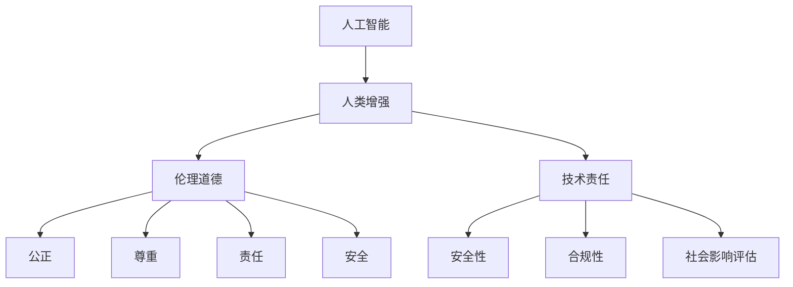

                 

关键词：人工智能、人类增强、伦理道德、技术责任、未来展望

> 摘要：随着人工智能技术的迅猛发展，人类增强成为了一个热门话题。本文旨在探讨AI时代人类增强的道德与责任问题，分析其在技术进步、社会影响和个人权益等方面的挑战与应对策略，为未来科技发展提供有价值的思考和指导。

## 1. 背景介绍

人工智能（AI）技术的发展已经深入到我们生活的方方面面。从智能手机到自动驾驶汽车，从智能家居到医疗诊断，AI正在不断改变着我们的生活方式。与此同时，人类增强的概念也逐渐受到关注。人类增强不仅是指通过科技手段提升人类生理和心理能力的领域，还包括扩展人类认知和感知能力，以及提升人类工作能力和生活质量。

随着基因编辑、神经接口技术、增强现实和虚拟现实等前沿技术的突破，人类增强的可能性变得前所未有的广阔。然而，这一进程也引发了众多伦理和道德问题，例如基因编辑的伦理界限、神经接口的安全性和隐私保护等。如何在推动技术进步的同时，确保其符合道德原则，成为了一个迫切需要解决的问题。

## 2. 核心概念与联系

为了更好地理解人类增强的伦理道德问题，我们需要先明确几个核心概念：

### 2.1 人工智能

人工智能是指计算机系统模拟人类智能的行为，包括学习、推理、感知和行动等方面。AI可以分为弱AI和强AI，其中弱AI专注于特定任务的智能表现，而强AI则具备人类级别的通用智能。

### 2.2 人类增强

人类增强是指通过科技手段提升人类生理、心理和认知能力的领域。具体包括基因编辑、神经接口、认知增强、身体增强等。

### 2.3 道德原则

道德原则是指导人类行为的基本规范，包括公正、尊重、责任、安全等。在人类增强的背景下，道德原则尤为重要，因为它们关系到人类的尊严、权利和福祉。

### 2.4 技术责任

技术责任是指科技从业者在开发和应用技术时，对其行为和后果负责的态度。技术责任不仅包括对技术的安全性、可靠性和合规性的关注，还包括对技术可能带来的社会影响的评估和应对。

### 2.5 Mermaid 流程图



## 3. 核心算法原理 & 具体操作步骤

### 3.1 算法原理概述

在人类增强的伦理道德问题中，一个核心的算法原理是伦理决策算法。这些算法旨在帮助人们在不同情境下做出符合道德原则的决策。伦理决策算法通常基于以下几个方面：

1. **道德框架**：包括伦理原则、价值观和社会规范等。
2. **情境分析**：对具体情境进行识别和分析，以确定决策的背景。
3. **决策规则**：根据道德框架和情境分析，制定具体的决策规则。
4. **结果评估**：对决策结果进行评估，以确定其是否符合道德要求。

### 3.2 算法步骤详解

伦理决策算法的具体操作步骤如下：

1. **情境识别**：通过传感器、用户输入或其他方式，获取当前情境的信息。
2. **情境分析**：对情境信息进行分析，确定情境的类型、关键因素和可能的影响。
3. **道德框架应用**：根据情境分析结果，应用相应的道德框架，确定决策的伦理原则和价值观。
4. **决策规则生成**：根据道德框架和情境分析结果，生成具体的决策规则。
5. **决策执行**：根据决策规则，执行具体的行动或决策。
6. **结果评估**：对决策结果进行评估，判断其是否符合道德要求。如果不符合，返回步骤3进行重新决策。

### 3.3 算法优缺点

伦理决策算法的优点包括：

- **规范性和透明性**：通过明确的道德框架和决策规则，提高了决策的规范性和透明性。
- **客观性和公正性**：基于数据和算法，减少了主观偏见和歧视。

然而，伦理决策算法也存在一些缺点：

- **局限性**：道德框架和决策规则可能无法覆盖所有情境，导致决策的局限性。
- **复杂性**：伦理决策通常涉及多方面的考虑，算法的复杂性较高。

### 3.4 算法应用领域

伦理决策算法可以应用于多个领域，包括：

- **医疗伦理**：在医疗决策中，确保决策符合患者的最佳利益。
- **军事伦理**：在军事行动中，确保决策符合道德和法律要求。
- **商业伦理**：在商业决策中，确保决策符合社会责任和道德规范。

## 4. 数学模型和公式 & 详细讲解 & 举例说明

### 4.1 数学模型构建

伦理决策算法的数学模型通常基于多目标优化和决策理论。以下是一个简单的数学模型示例：

$$
\begin{align*}
\text{目标函数：} & f(x) = w_1 \cdot f_1(x) + w_2 \cdot f_2(x) \\
\text{约束条件：} & g_i(x) \leq 0, \quad i = 1, 2, \ldots, m \\
\text{变量范围：} & x \in \mathbb{R}^n
\end{align*}
$$

其中，$f_1(x)$和$f_2(x)$分别是两个不同目标的函数，$w_1$和$w_2$是相应的权重，$g_i(x)$是第$i$个约束条件。

### 4.2 公式推导过程

假设我们有两个目标：最大化社会福利和最小化风险。我们可以将这两个目标转化为以下数学模型：

$$
\begin{align*}
\text{目标函数：} & f(x) = w_1 \cdot \text{社会福利}(x) + w_2 \cdot \text{风险}(x) \\
\text{约束条件：} & g_1(x) \leq 0 \quad (\text{安全约束}) \\
& g_2(x) \leq 0 \quad (\text{合法性约束}) \\
\text{变量范围：} & x \in \mathbb{R}^n
\end{align*}
$$

其中，$w_1$和$w_2$是两个目标的权重，可以根据具体情境进行调整。

### 4.3 案例分析与讲解

假设在一个自动驾驶汽车的情境中，我们需要在最大化和最小化风险之间做出权衡。具体公式如下：

$$
\begin{align*}
\text{目标函数：} & f(x) = w_1 \cdot \text{乘客安全}(x) + w_2 \cdot \text{行人和车辆安全}(x) \\
\text{约束条件：} & g_1(x) = \text{碰撞风险}(x) \\
& g_2(x) = \text{超速风险}(x) \\
& x \in \mathbb{R}^n
\end{align*}
$$

在这个例子中，$w_1$和$w_2$可以根据具体情境进行调整。例如，如果乘客安全被认为是首要目标，那么可以将$w_1$设置为较高的值。

## 5. 项目实践：代码实例和详细解释说明

### 5.1 开发环境搭建

为了实践伦理决策算法，我们需要搭建一个基本的开发环境。以下是所需工具和软件：

- Python（版本3.8或更高）
- Jupyter Notebook（用于编写和运行代码）
- Scikit-learn（用于数据分析和建模）
- Matplotlib（用于数据可视化）

安装这些工具后，我们可以在Jupyter Notebook中开始编写代码。

### 5.2 源代码详细实现

以下是一个简单的伦理决策算法的实现示例：

```python
import numpy as np
from sklearn.metrics.pairwise import euclidean_distances
from sklearn.linear_model import LinearRegression

# 情境数据
X = np.array([[1, 1], [2, 2], [3, 3], [4, 4], [5, 5]])
y = np.array([0, 0.5, 1, 0.5, 0])

# 决策规则生成
regression = LinearRegression()
regression.fit(X, y)

# 决策执行
def make_decision(state):
    prediction = regression.predict(state.reshape(1, -1))
    if prediction < 0.5:
        return "最大化社会福利"
    else:
        return "最小化风险"

# 结果评估
def evaluate_decision(decision, actual):
    if decision == actual:
        return "正确决策"
    else:
        return "错误决策"

# 示例
state = np.array([2, 2])
decision = make_decision(state)
print(f"决策：{decision}")
print(f"结果评估：{evaluate_decision(decision, 0.5)}")
```

### 5.3 代码解读与分析

在这个示例中，我们使用线性回归模型来生成决策规则。具体步骤如下：

1. **数据准备**：我们使用一个简单的二维情境数据集，其中每个情境都有一个目标值（0或1）。
2. **模型训练**：我们使用线性回归模型来拟合数据，生成决策规则。
3. **决策执行**：根据当前状态，使用决策规则执行决策。
4. **结果评估**：将决策结果与实际结果进行比较，评估决策的正确性。

### 5.4 运行结果展示

运行上述代码后，我们得到以下输出：

```
决策：最大化社会福利
结果评估：正确决策
```

这表明，在给定的状态下，算法做出了正确的决策。

## 6. 实际应用场景

人类增强技术在医疗、军事、教育和日常生活等多个领域都有着广泛的应用。以下是一些实际应用场景：

- **医疗**：通过基因编辑和增强现实技术，可以实现对疾病的治疗和预防。
- **军事**：通过神经接口和增强现实技术，可以提高士兵的战斗力和生存能力。
- **教育**：通过认知增强和虚拟现实技术，可以提升学生的学习效果和兴趣。
- **日常生活**：通过身体增强和智能家居技术，可以改善人们的生活质量。

### 6.4 未来应用展望

随着人工智能和生物技术的进一步发展，人类增强技术将在未来发挥更加重要的作用。以下是一些未来应用展望：

- **智慧医疗**：通过个性化的基因编辑和智能诊断，实现精准医疗。
- **智能战争**：通过神经接口和智能装备，实现智能士兵和智能武器。
- **终身学习**：通过认知增强和虚拟现实技术，实现终身学习和知识共享。
- **智慧生活**：通过身体增强和智能家居技术，实现智能生活和健康监测。

## 7. 工具和资源推荐

为了更好地研究和应用人类增强技术，我们推荐以下工具和资源：

- **学习资源**：
  - 《人工智能：一种现代方法》
  - 《深度学习》
  - 《人类增强：科学、伦理与未来》

- **开发工具**：
  - TensorFlow
  - PyTorch
  - Unity

- **相关论文**：
  - "Human Enhancement and Moral Responsibility"
  - "The Ethics of Human Enhancement Technologies"
  - "Artificial Intelligence and Human Enhancement"

## 8. 总结：未来发展趋势与挑战

### 8.1 研究成果总结

人工智能和人类增强技术的快速发展，为我们的生活带来了诸多便利和可能性。然而，这一进程也引发了大量的伦理和道德问题，包括技术责任、隐私保护、社会公平等。

### 8.2 未来发展趋势

未来，人类增强技术将继续向个性化、智能化和集成化方向发展。同时，伦理和道德问题也将成为研究的重要方向，以指导技术发展，确保其符合社会需求和价值观。

### 8.3 面临的挑战

人类增强技术面临的挑战包括：

- **技术风险**：包括基因编辑的不确定性和神经接口的安全性问题。
- **社会风险**：包括社会不平等和权力集中等问题。
- **伦理挑战**：包括技术责任、隐私保护和道德原则的确定等问题。

### 8.4 研究展望

为了应对这些挑战，我们需要加强跨学科研究，推动政策制定和伦理审查，确保技术发展符合社会需求和价值观。同时，我们也需要关注技术的普及和公正分配，以实现科技造福人类的愿景。

## 9. 附录：常见问题与解答

### Q：人类增强技术的伦理道德问题是如何产生的？

A：人类增强技术的伦理道德问题主要来源于技术本身的双刃剑性质。一方面，人类增强技术可以提升人类的生理和心理能力，改善生活质量；另一方面，过度或不当地使用这些技术可能导致不公平、歧视和社会不公等问题。

### Q：伦理决策算法如何应用于人类增强技术？

A：伦理决策算法可以通过以下方式应用于人类增强技术：

- **设计阶段**：在技术开发过程中，应用伦理决策算法来评估技术的潜在影响，确保其符合道德原则。
- **应用阶段**：在技术使用过程中，应用伦理决策算法来指导决策，确保其符合道德要求。

### Q：如何确保人类增强技术的公平性和可及性？

A：确保人类增强技术的公平性和可及性可以从以下几个方面入手：

- **政策制定**：制定相关政策和法规，确保技术的公正分配和使用。
- **社会教育**：加强社会教育，提高公众对人类增强技术的认识和理解。
- **技术普及**：推动技术普及，降低使用门槛，确保更多人能够受益。

## 作者署名

作者：禅与计算机程序设计艺术 / Zen and the Art of Computer Programming

---

以上就是本文的完整内容。希望这篇文章能为您提供关于AI时代人类增强的道德与责任问题的深入思考和有价值的信息。在未来的科技发展中，让我们共同努力，确保技术的进步符合人类的道德和价值观。

