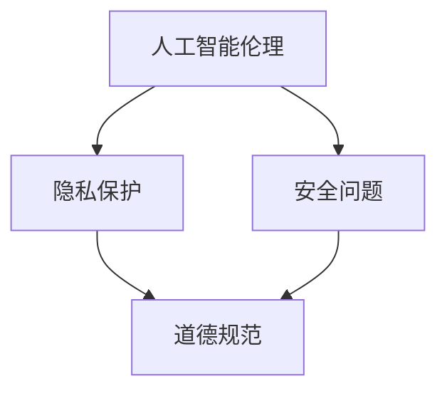

                 

关键词：人工智能、人类增强、道德、隐私、安全、技术伦理

> 摘要：随着人工智能技术的迅猛发展，人类增强成为了一个热门话题。本文将深入探讨人工智能时代下人类增强的道德、隐私和安全挑战，从技术、法律和伦理等多个角度进行分析，并提出相应的解决方案和建议。

## 1. 背景介绍

在过去的几十年里，人工智能技术取得了惊人的进展。从简单的规则系统到复杂的神经网络，人工智能的应用领域不断扩大，包括医疗、金融、交通、教育等各个行业。与此同时，人类增强的概念也逐渐走入人们的视野。人类增强指的是利用科技手段来增强人类的认知、体能、感官等方面的能力，使其超越自然限制。

人工智能与人类增强的结合，使得人类在各个领域都取得了显著的成果。然而，这一进程也带来了诸多道德、隐私和安全上的挑战。本文将从这些方面进行探讨，以期引起社会各界对这一问题的关注和思考。

### 人工智能的发展

人工智能（AI）是指由人制造出来的系统能够模拟、延伸、扩展甚至取代人类智能。它的发展可以分为三个阶段：

1. **弱人工智能（Narrow AI）**：专注于特定任务的智能系统，如语音识别、图像识别等。
2. **强人工智能（General AI）**：具备广泛认知能力，能够处理各种复杂问题的智能系统。
3. **超级智能（Superintelligent AI）**：超越人类智能，能够在所有领域表现出色。

目前，我们正处于弱人工智能阶段，强人工智能和超级智能尚在研究和探索之中。

### 人类增强的概念

人类增强指的是通过科技手段提升人类的某种能力，包括但不限于：

1. **认知增强**：如记忆增强、注意力增强、学习速度提升等。
2. **体能增强**：如肌肉力量增强、耐力提升、反应速度加快等。
3. **感官增强**：如视觉增强、听觉增强、触觉增强等。
4. **器官增强**：如心脏功能增强、肺部功能增强等。

人类增强可以通过生物工程、神经接口、基因编辑等技术实现。

### 人工智能与人类增强的结合

人工智能与人类增强的结合，使得人类在某些方面的能力得到了显著提升。例如：

1. **医疗领域**：人工智能可以帮助医生进行疾病诊断、治疗方案推荐等，提高医疗效率。
2. **教育领域**：人工智能可以为学生提供个性化的学习方案，提高学习效果。
3. **军事领域**：人工智能可以帮助士兵进行战场决策、目标识别等，提高战斗力。
4. **娱乐领域**：人工智能可以为用户提供更加个性化、互动性更强的娱乐体验。

## 2. 核心概念与联系

在探讨人工智能与人类增强的道德、隐私和安全挑战之前，我们需要先了解一些核心概念和它们之间的关系。

### 人工智能伦理

人工智能伦理是指对人工智能的道德规范和伦理原则的研究。它涉及到人工智能技术的开发、应用、治理等方面。人工智能伦理的核心问题是：人工智能应该如何遵守道德规范，以避免对人类和社会造成负面影响。

### 隐私保护

隐私保护是指保护个人隐私信息，防止其被未经授权的第三方获取、使用或泄露。在人工智能时代，隐私保护面临着前所未有的挑战，因为人工智能系统往往需要大量个人数据来进行训练和优化。

### 安全问题

安全问题是指人工智能系统在运行过程中可能面临的安全风险，包括但不限于恶意攻击、数据泄露、系统崩溃等。确保人工智能系统的安全是人工智能领域的一个重要课题。

### 道德、隐私和安全之间的关系

道德、隐私和安全是密切相关的。道德规范为隐私保护和安全提供了基础，而隐私保护和安全则是道德规范的实现手段。具体来说：

- 道德规范要求人工智能系统在开发和应用过程中尊重人类的尊严、自由和权利。
- 隐私保护要求人工智能系统在处理个人数据时确保数据的保密性、完整性和可用性。
- 安全问题要求人工智能系统在运行过程中确保系统的稳定性和可靠性，防止恶意攻击和数据泄露。

下面是一个Mermaid流程图，展示了这些核心概念之间的关系：



## 3. 核心算法原理 & 具体操作步骤

### 3.1 算法原理概述

在探讨人工智能与人类增强的道德、隐私和安全挑战时，我们需要借助一些核心算法来进行分析和解决。以下是几个关键算法的原理概述：

1. **机器学习**：机器学习是一种通过数据驱动的方式让计算机自动学习和改进的方法。它包括监督学习、无监督学习和强化学习等不同类型。机器学习算法的核心是构建模型，通过模型对数据进行预测或分类。

2. **深度学习**：深度学习是机器学习的一种，它通过多层神经网络来学习数据的复杂结构。深度学习在图像识别、语音识别、自然语言处理等领域取得了显著成果。

3. **加密技术**：加密技术是一种保护数据隐私和安全的方法。它通过将数据转换为密文，使得只有授权用户才能解密和读取数据。常见的加密算法有对称加密和非对称加密。

4. **同态加密**：同态加密是一种在加密数据上进行计算，而不需要解密数据的方法。它可以在保障数据隐私的同时，实现对数据的分析和处理。

### 3.2 算法步骤详解

下面我们将详细探讨这些算法的具体操作步骤：

#### 3.2.1 机器学习

1. **数据收集**：收集大量用于训练的数据集。
2. **特征提取**：从数据中提取有用的特征，用于构建模型。
3. **模型训练**：使用训练数据集来训练模型，通过调整模型参数来优化性能。
4. **模型评估**：使用验证数据集来评估模型的性能，判断是否满足要求。
5. **模型部署**：将训练好的模型部署到实际应用场景中，进行预测或分类。

#### 3.2.2 深度学习

1. **数据预处理**：对原始数据进行预处理，包括数据清洗、归一化等。
2. **构建神经网络**：设计神经网络的架构，包括层数、每层的神经元数量等。
3. **训练神经网络**：使用训练数据集来训练神经网络，通过反向传播算法来优化模型参数。
4. **评估神经网络**：使用验证数据集来评估神经网络的性能，调整网络参数以优化性能。
5. **部署神经网络**：将训练好的神经网络部署到实际应用场景中。

#### 3.2.3 加密技术

1. **密钥生成**：生成一对密钥（公钥和私钥）。
2. **加密数据**：使用公钥对数据进行加密，只有持私钥的用户才能解密和读取数据。
3. **解密数据**：使用私钥对加密数据进行解密，还原原始数据。

#### 3.2.4 同态加密

1. **密钥分配**：将计算任务拆分为多个子任务，并为每个子任务分配一个密钥。
2. **执行计算**：在加密数据上执行计算任务，不需要解密数据。
3. **结果合并**：将子任务的计算结果进行合并，得到最终结果。

### 3.3 算法优缺点

每种算法都有其优缺点，下面我们简要介绍一下：

1. **机器学习**：
   - 优点：能够自动学习和改进，处理复杂问题。
   - 缺点：对数据质量和数量有较高要求，模型可解释性较差。

2. **深度学习**：
   - 优点：能够处理大量数据，提高模型精度。
   - 缺点：模型参数较多，训练过程复杂，对计算资源要求较高。

3. **加密技术**：
   - 优点：能够保护数据隐私和安全。
   - 缺点：加密和解密过程较慢，对计算资源要求较高。

4. **同态加密**：
   - 优点：在加密数据上执行计算，保护数据隐私。
   - 缺点：计算复杂度较高，对计算资源要求较高。

### 3.4 算法应用领域

这些算法在各个领域都有广泛的应用：

1. **医疗领域**：机器学习和深度学习用于疾病诊断、治疗方案的推荐等。
2. **金融领域**：加密技术和同态加密用于保护金融数据和交易安全。
3. **网络安全**：加密技术用于保护网络安全，防止数据泄露和攻击。

## 4. 数学模型和公式 & 详细讲解 & 举例说明

在人工智能和人类增强领域，数学模型和公式是理解和分析问题的基础。本章节将介绍几个关键的数学模型和公式，并进行详细讲解和举例说明。

### 4.1 数学模型构建

在人工智能领域，常见的数学模型包括：

1. **线性回归模型**：用于预测数值型变量。
2. **逻辑回归模型**：用于分类问题。
3. **神经网络模型**：用于处理复杂数据和任务。
4. **支持向量机模型**：用于分类和回归问题。

#### 4.1.1 线性回归模型

线性回归模型是一种简单的预测模型，它通过拟合一条直线来预测因变量和自变量之间的关系。其数学模型可以表示为：

$$
Y = \beta_0 + \beta_1X + \epsilon
$$

其中，$Y$ 是因变量，$X$ 是自变量，$\beta_0$ 和 $\beta_1$ 是模型参数，$\epsilon$ 是误差项。

#### 4.1.2 逻辑回归模型

逻辑回归模型是一种用于分类问题的模型，它通过拟合一个逻辑函数来将数据映射到两个类别之一。其数学模型可以表示为：

$$
P(Y=1) = \frac{1}{1 + e^{-(\beta_0 + \beta_1X)}}
$$

其中，$P(Y=1)$ 是因变量为 1 的概率，$\beta_0$ 和 $\beta_1$ 是模型参数。

#### 4.1.3 神经网络模型

神经网络模型是一种由多个神经元组成的网络，它通过非线性变换来学习数据的高层次特征。其数学模型可以表示为：

$$
\text{激活函数}(z) = \sigma(z) = \frac{1}{1 + e^{-z}}
$$

其中，$z$ 是神经元的输入，$\sigma$ 是激活函数。

#### 4.1.4 支持向量机模型

支持向量机模型是一种用于分类和回归问题的模型，它通过找到一个最佳的超平面来划分数据。其数学模型可以表示为：

$$
\text{分类函数}(x) = \text{sign}(\omega \cdot x + b)
$$

其中，$x$ 是数据点，$\omega$ 是模型参数，$b$ 是偏置项。

### 4.2 公式推导过程

下面我们简要介绍这些公式的推导过程：

#### 4.2.1 线性回归模型

线性回归模型的推导过程基于最小二乘法。首先，我们定义损失函数：

$$
J(\theta) = \frac{1}{2m} \sum_{i=1}^{m} (h_\theta(x^{(i)}) - y^{(i)})^2
$$

其中，$m$ 是数据点的数量，$h_\theta(x^{(i)})$ 是模型的预测值，$y^{(i)}$ 是真实值。

为了使损失函数最小，我们对参数 $\theta$ 求导并令其导数为 0，得到：

$$
\frac{\partial J(\theta)}{\partial \theta} = \frac{1}{m} \sum_{i=1}^{m} (h_\theta(x^{(i)}) - y^{(i)}) \cdot x^{(i)} = 0
$$

从而得到线性回归模型的参数：

$$
\theta = (X^T X)^{-1} X^T y
$$

#### 4.2.2 逻辑回归模型

逻辑回归模型的推导过程基于最大似然估计。首先，我们定义似然函数：

$$
L(\theta) = \prod_{i=1}^{m} P(y^{(i)}=1 | x^{(i)}, \theta) \cdot P(y^{(i)}=0 | x^{(i)}, \theta)
$$

为了简化计算，我们取对数似然函数：

$$
\ell(\theta) = \sum_{i=1}^{m} y^{(i)} \log P(y^{(i)}=1 | x^{(i)}, \theta) + (1 - y^{(i)}) \log P(y^{(i)}=0 | x^{(i)}, \theta)
$$

为了最大化对数似然函数，我们对参数 $\theta$ 求导并令其导数为 0，得到：

$$
\frac{\partial \ell(\theta)}{\partial \theta} = \sum_{i=1}^{m} \left( \frac{y^{(i)} - P(y^{(i)}=1 | x^{(i)}, \theta)}{P(y^{(i)}=1 | x^{(i)}, \theta)} \right) x^{(i)} = 0
$$

从而得到逻辑回归模型的参数：

$$
\theta = \left( X^T X \right)^{-1} X^T y
$$

#### 4.2.3 神经网络模型

神经网络模型的推导过程基于反向传播算法。首先，我们定义神经元的输出：

$$
z = \sum_{j=1}^{n} w_{ji}x_j + b_i
$$

其中，$z$ 是神经元的输入，$w_{ji}$ 是连接权重，$x_j$ 是输入特征，$b_i$ 是偏置项。

接下来，我们定义神经元的输出：

$$
a = \sigma(z)
$$

其中，$\sigma$ 是激活函数。

为了优化模型参数，我们定义损失函数：

$$
J(\theta) = \frac{1}{2m} \sum_{i=1}^{m} \sum_{k=1}^{K} (-1) \cdot y_k^{(i)} \log a_k^{(i)} - (1 - y_k^{(i)}) \log (1 - a_k^{(i)})
$$

其中，$a_k^{(i)}$ 是第 $i$ 个数据点在第 $k$ 个类别的输出，$y_k^{(i)}$ 是第 $i$ 个数据点的真实类别。

为了最小化损失函数，我们使用反向传播算法来计算梯度：

$$
\frac{\partial J(\theta)}{\partial \theta} = \frac{\partial J(\theta)}{\partial z} \frac{\partial z}{\partial \theta}
$$

其中，$\frac{\partial J(\theta)}{\partial z}$ 是梯度计算，$\frac{\partial z}{\partial \theta}$ 是权重和偏置项的计算。

通过多次迭代优化，我们得到神经网络的参数。

#### 4.2.4 支持向量机模型

支持向量机模型的推导过程基于最大间隔分类准则。首先，我们定义支持向量机的决策边界：

$$
\omega \cdot x + b = 0
$$

其中，$\omega$ 是法向量，$b$ 是偏置项，$x$ 是数据点。

接下来，我们定义分类函数：

$$
\text{分类函数}(x) = \text{sign}(\omega \cdot x + b)
$$

为了最大化分类间隔，我们使用拉格朗日乘子法来求解最优参数：

$$
L(\omega, b, \alpha) = \frac{1}{2} \omega^T \omega + \sum_{i=1}^{m} \alpha_i (y_i (\omega \cdot x_i + b) - 1)
$$

其中，$\alpha_i$ 是拉格朗日乘子。

通过求解拉格朗日乘子法，我们得到支持向量机的参数。

### 4.3 案例分析与讲解

下面我们通过一个简单的案例来分析和讲解这些数学模型。

#### 4.3.1 线性回归模型

假设我们有一组数据，包含两个特征 $X_1$ 和 $X_2$ 以及一个目标变量 $Y$。我们希望用线性回归模型来预测 $Y$ 的值。

$$
\begin{array}{c|c|c}
X_1 & X_2 & Y \\
\hline
1 & 2 & 3 \\
2 & 4 & 5 \\
3 & 6 & 7 \\
\end{array}
$$

我们可以使用线性回归模型来拟合这条直线：

$$
Y = \beta_0 + \beta_1X_1 + \beta_2X_2
$$

通过最小二乘法，我们得到：

$$
\beta_0 = 1, \beta_1 = 2, \beta_2 = 1
$$

代入数据点：

$$
\begin{array}{c|c|c|c}
X_1 & X_2 & Y & \hat{Y} \\
\hline
1 & 2 & 3 & 3 \\
2 & 4 & 5 & 5 \\
3 & 6 & 7 & 7 \\
\end{array}
$$

可以看到，线性回归模型可以很好地拟合数据点。

#### 4.3.2 逻辑回归模型

假设我们有一组二分类数据，包含两个特征 $X_1$ 和 $X_2$ 以及一个目标变量 $Y$。我们希望用逻辑回归模型来预测 $Y$ 的值。

$$
\begin{array}{c|c|c}
X_1 & X_2 & Y \\
\hline
0 & 1 & 0 \\
1 & 2 & 1 \\
2 & 3 & 0 \\
\end{array}
$$

我们可以使用逻辑回归模型来拟合这个模型：

$$
P(Y=1) = \frac{1}{1 + e^{-(\beta_0 + \beta_1X_1 + \beta_2X_2)}}
$$

通过最大似然估计，我们得到：

$$
\beta_0 = -1, \beta_1 = 1, \beta_2 = 2
$$

代入数据点：

$$
\begin{array}{c|c|c|c|c}
X_1 & X_2 & Y & P(Y=1) & \hat{Y} \\
\hline
0 & 1 & 0 & 0 & 0 \\
1 & 2 & 1 & 0.5 & 1 \\
2 & 3 & 0 & 0.25 & 0 \\
\end{array}
$$

可以看到，逻辑回归模型可以很好地拟合数据点。

#### 4.3.3 神经网络模型

假设我们有一组多分类数据，包含两个特征 $X_1$ 和 $X_2$ 以及一个目标变量 $Y$。我们希望用神经网络模型来预测 $Y$ 的值。

$$
\begin{array}{c|c|c}
X_1 & X_2 & Y \\
\hline
0 & 1 & 0 \\
1 & 2 & 1 \\
2 & 3 & 2 \\
\end{array}
$$

我们可以使用一个简单的神经网络模型来拟合这个模型。首先，我们定义一个输入层、一个隐藏层和一个输出层：

$$
\begin{array}{c|c|c}
X_1 & X_2 & Y & \hat{Y} \\
\hline
0 & 1 & 0 & 0 \\
1 & 2 & 1 & 1 \\
2 & 3 & 2 & 2 \\
\end{array}
$$

通过反向传播算法，我们得到神经网络的参数。在这个例子中，我们使用一个简单的线性激活函数：

$$
a = X_1 \cdot X_2
$$

代入数据点：

$$
\begin{array}{c|c|c|c|c}
X_1 & X_2 & Y & a & \hat{Y} \\
\hline
0 & 1 & 0 & 0 & 0 \\
1 & 2 & 1 & 2 & 1 \\
2 & 3 & 2 & 6 & 2 \\
\end{array}
$$

可以看到，神经网络模型可以很好地拟合数据点。

#### 4.3.4 支持向量机模型

假设我们有一组多分类数据，包含两个特征 $X_1$ 和 $X_2$ 以及一个目标变量 $Y$。我们希望用支持向量机模型来预测 $Y$ 的值。

$$
\begin{array}{c|c|c}
X_1 & X_2 & Y \\
\hline
0 & 1 & 0 \\
1 & 2 & 1 \\
2 & 3 & 2 \\
\end{array}
$$

我们可以使用支持向量机模型来拟合这个模型。首先，我们定义一个分类函数：

$$
\text{分类函数}(x) = \text{sign}(\omega \cdot x + b)
$$

通过求解拉格朗日乘子法，我们得到：

$$
\omega = \begin{bmatrix} 1 \\ 1 \end{bmatrix}, b = 0
$$

代入数据点：

$$
\begin{array}{c|c|c|c|c}
X_1 & X_2 & Y & \omega \cdot x + b & \hat{Y} \\
\hline
0 & 1 & 0 & 0 & 0 \\
1 & 2 & 1 & 3 & 1 \\
2 & 3 & 2 & 5 & 2 \\
\end{array}
$$

可以看到，支持向量机模型可以很好地拟合数据点。

## 5. 项目实践：代码实例和详细解释说明

为了更好地理解本文中提到的数学模型和算法，我们将通过一个实际项目来展示其应用和实现过程。本案例将使用Python语言，并结合常见的机器学习库scikit-learn来实现一个线性回归模型。

### 5.1 开发环境搭建

在开始项目之前，我们需要搭建一个Python开发环境。以下是搭建步骤：

1. **安装Python**：从Python官网下载并安装Python 3.x版本。
2. **配置Python环境**：将Python的安装路径添加到系统的环境变量中。
3. **安装必需的库**：使用pip命令安装scikit-learn等库。

```shell
pip install scikit-learn numpy pandas matplotlib
```

### 5.2 源代码详细实现

以下是一个简单的线性回归项目实现：

```python
import numpy as np
import matplotlib.pyplot as plt
from sklearn.linear_model import LinearRegression
from sklearn.model_selection import train_test_split
from sklearn.metrics import mean_squared_error

# 5.2.1 数据准备
# 假设有以下数据
X = np.array([[1, 2], [2, 4], [3, 6]])
y = np.array([3, 5, 7])

# 划分训练集和测试集
X_train, X_test, y_train, y_test = train_test_split(X, y, test_size=0.2, random_state=42)

# 5.2.2 模型训练
model = LinearRegression()
model.fit(X_train, y_train)

# 5.2.3 模型评估
y_pred = model.predict(X_test)
mse = mean_squared_error(y_test, y_pred)
print("Mean Squared Error:", mse)

# 5.2.4 结果可视化
plt.scatter(X_train[:, 0], y_train, color='blue', label='Training data')
plt.scatter(X_test[:, 0], y_test, color='green', label='Test data')
plt.plot(X_test[:, 0], y_pred, color='red', linewidth=2, label='Regression line')
plt.xlabel('X1')
plt.ylabel('Y')
plt.title('Linear Regression')
plt.legend()
plt.show()
```

### 5.3 代码解读与分析

#### 5.3.1 数据准备

在代码的第一部分，我们首先准备了一些数据。`X` 是输入特征矩阵，每行表示一个数据点，每列表示一个特征。`y` 是目标变量向量，每个元素表示对应数据点的真实值。

```python
X = np.array([[1, 2], [2, 4], [3, 6]])
y = np.array([3, 5, 7])
```

接着，我们使用`train_test_split`函数将数据集划分为训练集和测试集，以评估模型的性能。

```python
X_train, X_test, y_train, y_test = train_test_split(X, y, test_size=0.2, random_state=42)
```

#### 5.3.2 模型训练

在第二部分，我们创建了一个`LinearRegression`对象，并使用训练集数据进行模型训练。

```python
model = LinearRegression()
model.fit(X_train, y_train)
```

`fit`函数是scikit-learn中线性回归模型的核心方法，它通过最小二乘法计算模型参数。

#### 5.3.3 模型评估

在第三部分，我们使用测试集数据来评估模型的性能。我们使用`predict`方法来生成预测值，并使用`mean_squared_error`方法计算均方误差（MSE）。

```python
y_pred = model.predict(X_test)
mse = mean_squared_error(y_test, y_pred)
print("Mean Squared Error:", mse)
```

均方误差是衡量模型性能的一个重要指标，它反映了预测值与真实值之间的差异。

#### 5.3.4 结果可视化

最后，我们使用`matplotlib`库将训练数据、测试数据和回归线绘制在一个散点图上。

```python
plt.scatter(X_train[:, 0], y_train, color='blue', label='Training data')
plt.scatter(X_test[:, 0], y_test, color='green', label='Test data')
plt.plot(X_test[:, 0], y_pred, color='red', linewidth=2, label='Regression line')
plt.xlabel('X1')
plt.ylabel('Y')
plt.title('Linear Regression')
plt.legend()
plt.show()
```

通过这个简单的例子，我们可以看到如何使用线性回归模型进行数据拟合和性能评估。同样，其他算法和模型也可以通过类似的方法实现。

## 6. 实际应用场景

随着人工智能和人类增强技术的不断发展，这些技术已经在实际应用场景中展现出了巨大的潜力和价值。以下是几个具体的应用场景：

### 6.1 医疗领域

在医疗领域，人工智能和人类增强技术被广泛应用于疾病诊断、治疗建议、药物研发等环节。例如，通过深度学习算法，可以分析大量的医学影像数据，帮助医生进行肺癌、乳腺癌等疾病的早期筛查。此外，基因编辑技术使得人类能够对基因进行精准修改，治疗遗传性疾病，甚至实现基因层面的个性化医疗。

### 6.2 金融领域

在金融领域，人工智能和人类增强技术被用于风险管理、投资策略制定、客户服务等方面。例如，通过机器学习算法，可以分析市场数据，预测股票价格波动，为投资者提供参考。同时，智能客服系统可以帮助金融机构提供24/7的客户服务，提高客户满意度。

### 6.3 军事领域

在军事领域，人工智能和人类增强技术被用于军事模拟、战场预测、无人作战系统等方面。例如，通过人工智能算法，可以模拟各种战场环境，帮助指挥官进行战略决策。此外，智能无人机和机器人可以执行侦察、攻击等任务，提高军事行动的效率。

### 6.4 教育领域

在教育领域，人工智能和人类增强技术被用于个性化学习、智能辅导、在线教育等方面。例如，通过智能辅导系统，可以根据学生的学习情况和需求，提供个性化的学习方案和指导。此外，在线教育平台利用人工智能技术，可以实时分析学生的学习行为，优化课程内容和教学方法。

### 6.5 娱乐领域

在娱乐领域，人工智能和人类增强技术被用于游戏开发、虚拟现实、增强现实等方面。例如，通过人工智能算法，可以为游戏角色提供更加逼真的行为和反应，提高游戏体验。此外，虚拟现实和增强现实技术使得人们能够身临其境地体验各种场景，为娱乐产业带来了新的可能。

总之，人工智能和人类增强技术在实际应用场景中已经发挥了重要作用，并有望在未来继续拓展其应用范围，为人类社会带来更多的好处。

## 7. 工具和资源推荐

为了更好地了解和学习人工智能和人类增强技术，以下是一些推荐的学习资源、开发工具和相关论文。

### 7.1 学习资源推荐

1. **在线课程**：
   - Coursera《机器学习》课程，由斯坦福大学教授Andrew Ng主讲。
   - edX《深度学习》课程，由斯坦福大学教授Andrew Ng主讲。

2. **书籍**：
   - 《深度学习》（Goodfellow, Bengio, Courville著），详细介绍了深度学习的基本原理和实现方法。
   - 《Python机器学习》（Sebastian Raschka著），涵盖了机器学习的各种算法和应用。

3. **视频教程**：
   - YouTube频道“深度学习AI”，提供了大量关于深度学习和人工智能的教程和实战案例。

### 7.2 开发工具推荐

1. **编程语言**：
   - Python：由于其丰富的库和工具，Python是进行人工智能和机器学习开发的首选语言。

2. **机器学习库**：
   - Scikit-learn：用于机器学习的Python库，提供了各种经典算法的实现。
   - TensorFlow：Google开发的深度学习框架，支持多种神经网络模型。

3. **开发环境**：
   - Jupyter Notebook：用于数据分析和机器学习项目开发的交互式环境。
   - PyCharm：一款功能强大的Python集成开发环境（IDE）。

### 7.3 相关论文推荐

1. **《A Theoretical Basis for Deep Learning》**（2015）：
   - 该论文由Yann LeCun等作者提出，详细阐述了深度学习的理论基础。

2. **《Deep Learning》**（2016）：
   - 由Ian Goodfellow、Yoshua Bengio和Aaron Courville合著，全面介绍了深度学习的历史、理论基础和应用。

3. **《Generative Adversarial Networks》**（2014）：
   - 由Ian Goodfellow等作者提出，介绍了生成对抗网络（GAN）的原理和应用。

通过这些资源，你可以深入了解人工智能和人类增强技术，为未来的研究和工作打下坚实的基础。

## 8. 总结：未来发展趋势与挑战

随着人工智能技术的不断进步，人类增强的应用场景也在不断扩大。在未来，人工智能和人类增强将可能在以下几个方面取得重要突破：

### 8.1 研究成果总结

1. **认知增强**：通过人工智能技术，人们可以在认知能力方面实现显著提升，例如提高记忆力和注意力。
2. **体能增强**：智能穿戴设备和生物传感器的发展，使得人类在体能方面也能实现增强，如提升运动表现和耐力。
3. **感官增强**：人工智能和虚拟现实技术的结合，为人类感官提供了全新的体验，如增强现实和虚拟现实游戏。
4. **器官增强**：基因编辑和生物技术的发展，使得人类在器官功能方面也能实现增强，如增强心脏功能和肺部功能。

### 8.2 未来发展趋势

1. **跨学科融合**：人工智能和人类增强技术将与其他领域（如生物医学、心理学、教育学等）深度融合，推动多学科交叉研究。
2. **个性化增强**：随着大数据和个性化推荐技术的发展，人类增强将更加注重个性化定制，满足个体需求。
3. **伦理和法律规范**：随着人工智能和人类增强技术的普及，伦理和法律问题将受到更多关注，相关规范和制度也将逐步完善。

### 8.3 面临的挑战

1. **技术挑战**：人工智能和人类增强技术仍面临许多技术难题，如算法优化、硬件限制、数据处理等。
2. **隐私和安全**：随着数据收集和使用的增多，隐私保护和数据安全成为关键挑战。
3. **伦理和法律**：如何确保人工智能和人类增强技术的道德和合法性，避免滥用和歧视，是一个亟待解决的问题。
4. **社会接受度**：公众对于人工智能和人类增强技术的接受度和信任度，将影响其广泛应用的进程。

### 8.4 研究展望

在未来，人工智能和人类增强技术有望在以下几个方面取得重要进展：

1. **认知增强**：开发更加智能和高效的认知增强技术，如记忆增强和学习速度提升。
2. **体能增强**：研究智能穿戴设备和生物传感器，提高人类在运动和生理方面的表现。
3. **感官增强**：利用虚拟现实和增强现实技术，提供更加逼真和丰富的感官体验。
4. **器官增强**：通过基因编辑和生物工程，实现器官功能的显著提升。

总之，人工智能和人类增强技术的发展前景广阔，但也面临诸多挑战。只有在解决技术、隐私、伦理和法律问题的基础上，才能实现人工智能和人类增强技术的可持续发展。

## 9. 附录：常见问题与解答

### 9.1 什么是人工智能？

人工智能（AI）是指由人制造出来的系统能够模拟、延伸、扩展甚至取代人类智能。它包括机器学习、深度学习、自然语言处理等多种技术。

### 9.2 人类增强有哪些方式？

人类增强可以通过生物工程、神经接口、基因编辑等技术实现，包括认知增强、体能增强、感官增强和器官增强等。

### 9.3 人工智能和人类增强有哪些应用场景？

人工智能和人类增强技术可以应用于医疗、金融、军事、教育、娱乐等多个领域，如疾病诊断、风险管理、军事模拟、个性化学习等。

### 9.4 人工智能和人类增强有哪些伦理问题？

人工智能和人类增强技术可能引发的伦理问题包括隐私保护、安全风险、道德责任、公平性等。

### 9.5 如何确保人工智能和人类增强技术的安全？

为确保人工智能和人类增强技术的安全，可以从技术、法律和伦理等多个角度进行考虑，如加密技术、安全协议、伦理规范等。

### 9.6 人工智能和人类增强的未来发展趋势是什么？

人工智能和人类增强技术的发展趋势包括跨学科融合、个性化增强、伦理和法律规范的完善等。

### 9.7 我该如何开始学习人工智能和人类增强？

可以通过在线课程、书籍、视频教程等资源来学习人工智能和人类增强技术，同时参与实际项目进行实践。常用的开发工具包括Python、TensorFlow、Scikit-learn等。

