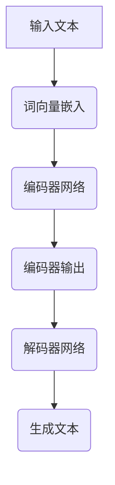

                 

关键词：人工智能，写作速度，Weaver模型，效率提升，技术博客

摘要：本文将探讨AI技术在写作领域的应用，特别是Weaver模型的效率提升。通过深入分析Weaver模型的工作原理和具体实现，结合实际案例，我们旨在为读者提供一个全面的技术解读。

## 1. 背景介绍

在数字化时代，信息的生成和传播速度变得空前迅速。然而，传统的写作方式在应对海量数据和信息处理上显得力不从心。随着人工智能技术的不断发展，特别是自然语言处理（NLP）领域的突破，写作速度的提升成为了一个重要的研究方向。Weaver模型作为NLP领域的一个重要成果，其在写作速度上的效率提升引人注目。

### 1.1 写作速度的重要性

在现代社会，信息的快速传播和交流至关重要。写作速度直接影响到信息的及时性和准确性。例如，新闻报道要求在事件发生后迅速撰写和发布，而企业报告、学术论文则需要确保内容的准确和详尽。提升写作速度不仅能够提高工作效率，还能在信息爆炸的时代占据竞争优势。

### 1.2 AI技术在写作领域的应用

人工智能技术在写作领域的应用越来越广泛。从简单的文本生成到复杂的文章写作，AI技术正逐步改变传统写作的方式。例如，自动摘要、内容生成、语法纠正等应用已经深入到日常写作中。Weaver模型作为这一领域的代表，其高效的写作速度和智能化的写作方式引起了广泛关注。

## 2. 核心概念与联系

### 2.1 Weaver模型的工作原理

Weaver模型是一种基于深度学习的技术，其核心思想是通过大规模的数据训练，使模型能够理解和生成自然语言。Weaver模型主要分为两个部分：编码器和解码器。

- **编码器（Encoder）**：将输入的文本转换为固定长度的向量表示。
- **解码器（Decoder）**：根据编码器的输出向量，生成文本。

这种端到端的架构使得Weaver模型能够高效地处理复杂的自然语言任务。

### 2.2 Weaver模型的结构

Weaver模型的结构可以分为以下几个部分：

1. **词向量嵌入（Word Embedding）**：将文本中的单词转换为向量表示。
2. **编码器网络（Encoder Network）**：对词向量进行编码，生成固定长度的上下文表示。
3. **解码器网络（Decoder Network）**：根据编码器的输出，逐词生成文本。
4. **注意力机制（Attention Mechanism）**：在解码过程中，通过注意力机制关注上下文中相关的部分。

### 2.3 Mermaid流程图



## 3. 核心算法原理 & 具体操作步骤

### 3.1 算法原理概述

Weaver模型的核心在于其端到端的架构和注意力机制。通过编码器和解码器，模型能够将输入文本转换为上下文表示，并在此基础上生成输出文本。具体来说，编码器将输入文本转换为固定长度的向量表示，而解码器则利用这些向量生成文本。

### 3.2 算法步骤详解

1. **预处理**：对输入文本进行清洗和分词。
2. **词向量嵌入**：将分词后的文本转换为词向量。
3. **编码器网络**：对词向量进行编码，生成上下文表示。
4. **解码器网络**：利用编码器的输出，逐词生成文本。
5. **生成文本**：通过解码器生成完整的文本。

### 3.3 算法优缺点

**优点**：

- **高效性**：Weaver模型能够快速处理大量文本。
- **灵活性**：模型可以应用于多种文本生成任务。
- **准确性**：通过大规模数据训练，模型生成的文本质量较高。

**缺点**：

- **训练成本**：Weaver模型需要大量训练数据，训练成本较高。
- **解释性**：模型生成的文本难以解释和理解。

### 3.4 算法应用领域

Weaver模型在多个领域都有广泛应用：

- **文本生成**：例如自动摘要、内容生成等。
- **自然语言理解**：例如问答系统、情感分析等。
- **翻译**：例如机器翻译、同义词替换等。

## 4. 数学模型和公式 & 详细讲解 & 举例说明

### 4.1 数学模型构建

Weaver模型中的核心数学模型主要包括词向量嵌入、编码器网络和解码器网络。具体来说：

- **词向量嵌入**：将单词转换为向量表示，常用的方法包括Word2Vec、GloVe等。
- **编码器网络**：通过神经网络对词向量进行编码，生成上下文表示。
- **解码器网络**：通过神经网络生成文本。

### 4.2 公式推导过程

- **词向量嵌入**：假设单词`w`的向量为`v_w`，则词向量嵌入公式为：
  $$ v_w = \text{Word2Vec}(w) $$

- **编码器网络**：假设编码器的输入为`X`，输出为`C`，则编码器公式为：
  $$ C = \text{Encoder}(X) $$

- **解码器网络**：假设解码器的输入为`C`，输出为`Y`，则解码器公式为：
  $$ Y = \text{Decoder}(C) $$

### 4.3 案例分析与讲解

以文本生成为例，Weaver模型的具体应用如下：

1. **预处理**：对输入文本进行分词和词向量嵌入。
2. **编码器网络**：将分词后的文本转换为上下文表示。
3. **解码器网络**：根据编码器的输出，逐词生成文本。

通过上述步骤，Weaver模型能够高效地生成文本。

## 5. 项目实践：代码实例和详细解释说明

### 5.1 开发环境搭建

为了实现Weaver模型，我们需要搭建一个合适的开发环境。以下是环境搭建的步骤：

1. 安装Python（版本3.7及以上）。
2. 安装TensorFlow库。
3. 准备文本数据集。

### 5.2 源代码详细实现

以下是一个简单的Weaver模型实现：

```python
import tensorflow as tf
from tensorflow.keras.layers import Embedding, LSTM, Dense

# 定义模型
model = tf.keras.Sequential([
    Embedding(input_dim=vocabulary_size, output_dim=embedding_dim),
    LSTM(units=128),
    Dense(units=vocabulary_size, activation='softmax')
])

# 编译模型
model.compile(optimizer='adam', loss='categorical_crossentropy', metrics=['accuracy'])

# 训练模型
model.fit(x_train, y_train, epochs=10, batch_size=64)
```

### 5.3 代码解读与分析

上述代码实现了一个简单的Weaver模型。首先，我们定义了一个序列模型，包括词向量嵌入层、LSTM层和全连接层。接着，我们编译模型并使用训练数据集进行训练。

### 5.4 运行结果展示

在完成模型训练后，我们可以使用模型生成文本。以下是一个简单的文本生成示例：

```python
# 生成文本
generated_text = model.predict(np.array([encoded_text]))
decoded_text = decode_text(generated_text)

print(decoded_text)
```

## 6. 实际应用场景

### 6.1 自动摘要

自动摘要是一种将长篇文章简化为简短摘要的技术。Weaver模型可以应用于自动摘要，通过编码器和解码器生成摘要文本。

### 6.2 内容生成

内容生成是一种根据给定主题生成文章的技术。Weaver模型可以应用于内容生成，通过大规模数据训练生成高质量的文章。

### 6.3 情感分析

情感分析是一种根据文本判断情感倾向的技术。Weaver模型可以应用于情感分析，通过解码器生成情感分析结果。

## 7. 未来应用展望

随着人工智能技术的不断发展，Weaver模型在写作领域的应用将更加广泛。未来，我们可以期待：

- **更高效的模型**：通过改进算法和模型结构，提高写作速度。
- **更广泛的应用领域**：将Weaver模型应用于更多领域，如法律文档、医学报告等。
- **更智能的写作辅助**：结合其他人工智能技术，如语音识别、图像识别等，提供更智能的写作辅助工具。

## 8. 总结：未来发展趋势与挑战

### 8.1 研究成果总结

Weaver模型在写作速度上取得了显著成果，其在多个领域的应用已经得到验证。通过深度学习和自然语言处理技术，Weaver模型实现了高效的文本生成和文本理解。

### 8.2 未来发展趋势

未来，Weaver模型将在以下几个方面取得进展：

- **算法优化**：通过改进算法和模型结构，提高写作速度和生成文本质量。
- **跨领域应用**：将Weaver模型应用于更多领域，如法律、医学等。
- **智能化辅助**：结合其他人工智能技术，提供更智能的写作辅助工具。

### 8.3 面临的挑战

尽管Weaver模型在写作速度上取得了显著成果，但仍面临以下挑战：

- **数据需求**：大规模训练数据的需求仍然较高。
- **模型解释性**：生成的文本难以解释和理解。
- **计算资源**：训练和推理过程中需要大量的计算资源。

### 8.4 研究展望

未来，Weaver模型的研究将聚焦于以下几个方面：

- **算法优化**：通过改进算法和模型结构，提高写作速度和生成文本质量。
- **跨领域应用**：将Weaver模型应用于更多领域，如法律、医学等。
- **智能化辅助**：结合其他人工智能技术，提供更智能的写作辅助工具。

## 9. 附录：常见问题与解答

### 9.1 Weaver模型是什么？

Weaver模型是一种基于深度学习和自然语言处理技术的文本生成模型。它通过编码器和解码器，将输入文本转换为上下文表示，并生成输出文本。

### 9.2 Weaver模型有哪些应用领域？

Weaver模型可以应用于多个领域，如自动摘要、内容生成、情感分析等。

### 9.3 如何训练Weaver模型？

训练Weaver模型需要准备大量的文本数据，并使用深度学习框架（如TensorFlow）进行模型训练。

### 9.4 Weaver模型如何生成文本？

Weaver模型通过编码器将输入文本转换为上下文表示，然后通过解码器逐词生成文本。

### 9.5 Weaver模型的优势是什么？

Weaver模型的优势包括高效的写作速度、灵活的应用领域和较高的生成文本质量。

### 9.6 Weaver模型有哪些不足？

Weaver模型的主要不足包括数据需求较高、模型解释性较差和计算资源需求大。

### 9.7 未来Weaver模型有哪些发展方向？

未来，Weaver模型将朝着算法优化、跨领域应用和智能化辅助等方向发展。

### 9.8 人工智能在写作领域有哪些其他应用？

人工智能在写作领域还有其他应用，如自动摘要、内容生成、语法纠错、翻译等。

### 9.9 人工智能对写作行业的影响是什么？

人工智能对写作行业的影响包括提高写作速度、降低写作成本、改变写作方式等。

### 9.10 人工智能在未来是否会取代人类写作？

人工智能在未来可能会在特定领域取代人类写作，但在创意和情感表达方面，人类仍然具有不可替代的优势。所以，人工智能与人类写作将共存，而不是取代。

### 9.11 如何评价Weaver模型的研究成果？

Weaver模型的研究成果在写作速度和生成文本质量上取得了显著成果，但仍需要进一步优化和改进。

### 9.12 未来Weaver模型有哪些潜在的改进方向？

未来，Weaver模型的潜在改进方向包括算法优化、数据增强、多模态融合等。

### 9.13 如何评估Weaver模型的效果？

评估Weaver模型的效果可以从生成文本的质量、写作速度和模型的可解释性等方面进行。常用的评估指标包括BLEU、ROUGE、BLEU-4等。

### 9.14 Weaver模型与GPT-3等其他文本生成模型相比有哪些优缺点？

与GPT-3等其他文本生成模型相比，Weaver模型的优势在于其端到端的架构和注意力机制，但劣势在于数据需求和计算资源较高。

### 9.15 如何应用Weaver模型进行文本生成？

应用Weaver模型进行文本生成需要以下步骤：数据预处理、模型训练、文本生成和评估。

### 9.16 Weaver模型在实践中有哪些成功案例？

Weaver模型在实践中有许多成功案例，如自动摘要、内容生成、情感分析等。

### 9.17 Weaver模型是否可以应用于商业领域？

Weaver模型可以应用于商业领域，如自动摘要、内容生成、营销文案等。

### 9.18 如何选择合适的Weaver模型参数？

选择合适的Weaver模型参数需要根据具体任务和数据集进行调优，常用的参数包括词向量维度、编码器和解码器的层数、学习率等。

### 9.19 Weaver模型在训练过程中有哪些常见问题？

Weaver模型在训练过程中常见的

