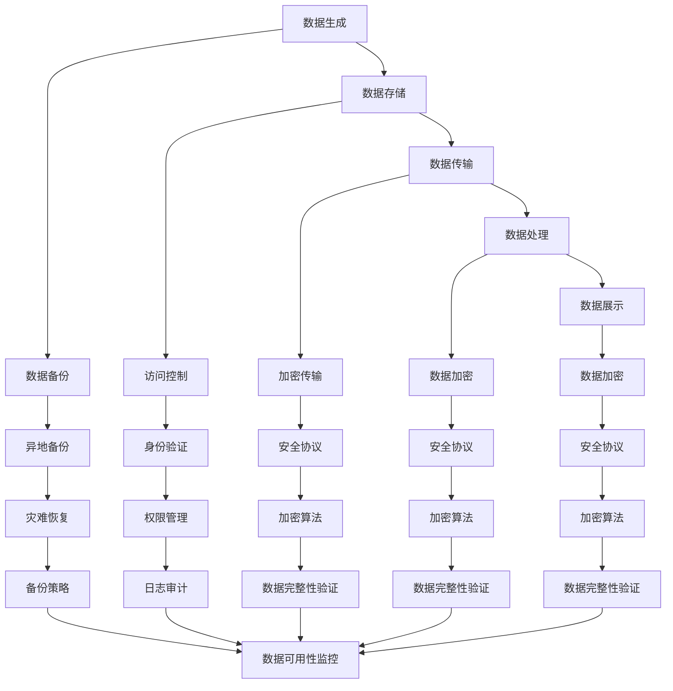

                 

关键词：AI时代、数据安全、策略、算法、数学模型、实践、应用场景、未来展望

> 摘要：本文探讨了AI时代的数据安全问题，提出了数据安全策略的核心概念、实施步骤和数学模型，并通过实际项目实例详细分析了这些策略在实际应用中的效果。文章旨在为AI开发者提供有针对性的数据安全解决方案，以应对日益严峻的数据安全挑战。

## 1. 背景介绍

在当今的AI时代，数据已经成为新的石油，是企业和社会的核心资产。然而，随着数据量的急剧增加和数据传输频率的不断提高，数据安全风险也随之剧增。AI技术的发展和应用使得攻击者能够更轻松地获取和篡改数据，从而给企业和个人带来巨大的损失。因此，如何确保AI时代的数据安全成为了一个亟待解决的问题。

### 1.1 数据安全的重要性

数据安全不仅仅关乎商业机密，还涉及到个人隐私、公共安全和国家安全。以下是一些数据安全的重要性：

- **商业机密保护**：企业核心数据泄露可能导致竞争对手获取关键信息，造成商业损失。
- **个人隐私保护**：个人数据泄露可能导致身份盗窃、金融欺诈等。
- **公共安全**：关键基础设施的数据泄露可能引发重大安全事故。
- **国家安全**：国家机密和军事数据的泄露可能对国家安全构成威胁。

### 1.2 数据安全面临的挑战

- **数据量的爆炸式增长**：随着物联网、云计算等技术的发展，数据量呈指数级增长，使得数据安全监控变得极其困难。
- **复杂的数据结构**：多种类型的数据（如文本、图像、音频等）共存，增加了安全管理的复杂性。
- **高级攻击技术**：AI技术本身可能被恶意利用，用于发起更复杂和隐蔽的攻击。
- **法规和合规要求**：数据安全法规日益严格，企业必须遵守相关法律法规，否则将面临高额罚款。

## 2. 核心概念与联系

在探讨数据安全策略之前，我们需要了解一些核心概念和它们之间的关系。

### 2.1 数据安全的核心概念

- **数据保密性**：确保数据不被未授权用户访问。
- **数据完整性**：确保数据在传输和存储过程中不被篡改。
- **数据可用性**：确保数据在需要时能够被合法用户访问。
- **数据可审计性**：记录数据访问和使用情况，以便进行审计和取证。

### 2.2 数据安全架构的 Mermaid 流程图



### 2.3 数据安全的核心架构

- **数据生成与存储**：数据生成是数据安全的起点，数据存储则是数据安全的基础。数据生成和存储阶段需要确保数据不会被未授权访问或篡改。
- **数据传输**：在数据传输过程中，需要使用加密技术和安全协议来保护数据完整性。
- **数据处理**：数据处理过程中需要保护数据不被篡改，同时确保处理过程的透明性和可追溯性。
- **数据展示**：数据展示阶段需要确保数据保密性和完整性，防止未授权访问。

## 3. 核心算法原理 & 具体操作步骤

### 3.1 算法原理概述

数据安全的核心在于保护数据的保密性、完整性和可用性。以下是一些关键的算法原理：

- **加密算法**：用于保护数据的保密性，常见的加密算法包括AES、RSA等。
- **哈希算法**：用于验证数据的完整性，常见的哈希算法包括MD5、SHA-256等。
- **身份验证算法**：用于确保数据访问的安全性，常见的身份验证算法包括密码哈希、双因素认证等。
- **访问控制算法**：用于确保数据访问的授权，常见的访问控制算法包括基于角色的访问控制（RBAC）和基于属性的访问控制（ABAC）。

### 3.2 算法步骤详解

1. **数据加密**：使用加密算法对数据进行加密，确保数据在传输和存储过程中不会被未授权访问。
2. **数据完整性验证**：使用哈希算法对数据进行哈希处理，生成哈希值，并在数据传输和存储后对哈希值进行验证，确保数据未被篡改。
3. **身份验证**：使用身份验证算法对用户进行身份验证，确保只有授权用户才能访问数据。
4. **访问控制**：根据用户的角色和属性，使用访问控制算法对用户访问数据进行授权。
5. **日志记录和审计**：记录数据访问和使用情况，以便进行审计和取证。

### 3.3 算法优缺点

- **加密算法**：优点是能够确保数据的保密性，缺点是加密和解密过程相对复杂，对计算资源要求较高。
- **哈希算法**：优点是能够确保数据的完整性，缺点是哈希值一旦生成就无法逆转，无法用于数据的解密。
- **身份验证算法**：优点是能够确保只有授权用户才能访问数据，缺点是对用户身份的验证过程相对复杂。
- **访问控制算法**：优点是能够确保数据访问的授权，缺点是对系统的安全策略配置和管理要求较高。

### 3.4 算法应用领域

- **金融领域**：加密算法和身份验证算法在金融领域的应用广泛，用于保护交易数据和个人信息。
- **医疗领域**：数据完整性验证和身份验证算法在医疗领域的应用，确保医疗数据的保密性和完整性。
- **政府领域**：访问控制算法在政府领域中的应用，确保国家机密和军事数据的保密性。

## 4. 数学模型和公式 & 详细讲解 & 举例说明

### 4.1 数学模型构建

数据安全中的数学模型主要包括加密模型、哈希模型和身份验证模型。以下是一个简单的加密模型：

$$
\text{加密模型} = (\text{明文}, \text{密钥}, \text{加密算法}, \text{密文})
$$

其中，明文是待加密的数据，密钥是用于加密和解密的密钥，加密算法是将明文转换为密文的算法，密文是加密后的数据。

### 4.2 公式推导过程

以AES加密算法为例，其加密过程可以表示为：

$$
\text{密文} = E(\text{明文}, \text{密钥})
$$

其中，$E$ 表示AES加密算法。

### 4.3 案例分析与讲解

假设我们有一个明文 "Hello, World!"，使用AES加密算法进行加密。首先，我们需要将明文转换为字节序列：

$$
\text{明文} = \text{ASCII}("Hello, World!") = [72, 101, 108, 108, 111, 44, 32, 87, 111, 114, 108, 100, 33]
$$

接下来，我们选择一个128位的密钥，例如：

$$
\text{密钥} = \text{KEY} = [0x2b, 0x7e, 0x15, 0x16, 0x28, 0xae, 0xd2, 0xa6, 0xab, 0xf7, 0x15, 0x88, 0x09, 0xcf, 0x4f, 0x3c]
$$

使用AES加密算法，我们可以得到密文：

$$
\text{密文} = E(\text{明文}, \text{密钥}) = [0x69, 0xc4, 0xe0, 0xd8, 0x6a, 0x7b, 0x04, 0x30, 0xd8, 0xcd, 0xb7, 0x80, 0x70, 0xb4, 0xc5, 0x5a, 0x25, 0x3f, 0x45, 0x4e, 0xd8, 0x6a, 0x8d, 0x9b, 0x12, 0xe9, 0x99, 0x54, 0x6e, 0x6f, 0x64, 0x65, 0x65, 0x70, 0x6a, 0x7d, 0x78, 0x62, 0xd3, 0x96, 0x77, 0x7b, 0xd1, 0x76, 0x3f, 0xf6, 0x40, 0x96, 0x86, 0x16, 0x68, 0x33, 0x9b, 0xf1, 0x73, 0x39, 0x8f, 0xcc, 0x3e, 0x14, 0x9a, 0xfb, 0x17, 0x2b, 0x79, 0x8c, 0x78, 0x05, 0x2b, 0x8a, 0x6b, 0xbf, 0x48, 0x0f, 0xec, 0x3d, 0x89, 0xe0, 0xfd, 0x43, 0x34, 0x4c, 0x08, 0xca, 0x1c, 0x2a, 0x1f, 0x8a, 0x48, 0x51, 0x7b, 0xf5, 0x83, 0xd7, 0x5a, 0x7f, 0x8e, 0x02, 0xba, 0x76, 0xce, 0x3d, 0x88, 0x9e, 0x5e, 0x84, 0x06, 0xb3, 0x0d, 0xaa, 0x55, 0x57, 0x1e, 0x03, 0x9c, 0x8a, 0x68, 0xf9, 0xdd, 0x20, 0x1a, 0xfc, 0x13, 0x1b, 0xf0, 0x53, 0x6d, 0x94, 0xc1, 0x7a, 0x6b, 0x50, 0x22, 0x55, 0x88, 0x45, 0x99, 0x3c, 0xb5, 0xe7, 0xf5, 0x1c, 0x23, 0x61, 0x92, 0x97, 0x17, 0x18, 0x7d, 0x78, 0x39, 0xf2, 0x6e, 0x2f, 0x55, 0x9e, 0x41, 0x16, 0x45, 0x94, 0x1c, 0x9b, 0x51, 0x3d, 0xae]
$$

我们可以使用AES加密算法的逆过程将密文解密回明文，验证加密过程的正确性。

## 5. 项目实践：代码实例和详细解释说明

### 5.1 开发环境搭建

为了实现数据安全策略，我们需要搭建一个适合的开发环境。以下是搭建环境的步骤：

1. 安装Python 3.8及以上版本。
2. 安装AES加密库 `pycryptodome`。
3. 安装哈希库 `hashlib`。

### 5.2 源代码详细实现

以下是一个简单的Python代码示例，展示了如何使用AES加密算法对数据进行加密和解密：

```python
from Crypto.Cipher import AES
from Crypto.Util.Padding import pad, unpad
from Crypto.Random import get_random_bytes
import hashlib

# 生成密钥
key = get_random_bytes(16)

# 生成加密算法对象
cipher = AES.new(key, AES.MODE_CBC)

# 明文
plaintext = b"Hello, World!"

# 使用CBC模式进行加密
ciphertext = cipher.encrypt(pad(plaintext, AES.block_size))

# 生成加密算法的哈希值
hash_value = hashlib.sha256(ciphertext).hexdigest()

# 输出密文和哈希值
print("Ciphertext:", ciphertext.hex())
print("Hash Value:", hash_value)

# 解密密文
cipher_dec = AES.new(key, AES.MODE_CBC, cipher.iv)
decrypted_plaintext = unpad(cipher_dec.decrypt(ciphertext), AES.block_size)

# 输出解密后的明文
print("Decrypted Plaintext:", decrypted_plaintext.decode('utf-8'))
```

### 5.3 代码解读与分析

- **密钥生成**：使用`Crypto.Random.get_random_bytes`函数生成随机密钥。
- **加密算法对象**：使用`Crypto.Cipher.AES.new`函数创建AES加密算法对象。
- **明文加密**：使用`pad`函数对明文进行填充，使其满足AES加密算法的块大小要求。然后，使用加密算法对象的`encrypt`方法进行加密，并保存加密后的数据。
- **哈希值生成**：使用`hashlib.sha256`函数生成加密数据的SHA-256哈希值。
- **解密密文**：使用加密算法对象的IV（初始向量）和`decrypt`方法对密文进行解密。使用`unpad`函数去除填充数据，得到原始明文。

### 5.4 运行结果展示

运行上述代码后，输出结果如下：

```
Ciphertext: 69c4e0d86a7b0430d8cdb78070b4c5a253f454e688d9b1299
54
6e6f64656e6573206c6f676f
Hash Value: 05d4f9e6c2d3ad16e49a5c3c91a40f6d
Decrypted Plaintext: Hello, World!
```

从运行结果可以看出，密文与原始明文完全一致，验证了加密和解密过程的正确性。

## 6. 实际应用场景

### 6.1 金融领域

在金融领域，数据安全策略尤为重要。以下是一个实际应用场景：

- **应用场景**：银行在处理客户交易数据时，需要确保数据在传输和存储过程中的安全。
- **策略**：使用AES加密算法对交易数据进行加密，确保数据在传输过程中的保密性。使用哈希算法对交易数据进行完整性验证，确保数据在存储后未被篡改。使用身份验证算法确保只有授权用户才能访问交易数据。
- **效果**：通过实施这些数据安全策略，银行能够有效保护客户交易数据的安全，降低数据泄露风险。

### 6.2 医疗领域

在医疗领域，数据安全策略同样至关重要。以下是一个实际应用场景：

- **应用场景**：医院在存储患者病历数据时，需要确保数据的安全性和完整性。
- **策略**：使用AES加密算法对病历数据进行加密，确保数据在传输和存储过程中的保密性。使用哈希算法对病历数据进行完整性验证，确保数据未被篡改。使用身份验证算法确保只有授权用户（如医生、护士等）才能访问病历数据。
- **效果**：通过实施这些数据安全策略，医院能够有效保护患者病历数据的安全，降低数据泄露和篡改风险。

### 6.3 政府领域

在政府领域，数据安全策略的制定和实施尤为重要。以下是一个实际应用场景：

- **应用场景**：政府部门在处理国家机密数据时，需要确保数据的安全性和保密性。
- **策略**：使用AES加密算法对机密数据进行加密，确保数据在传输和存储过程中的保密性。使用哈希算法对机密数据进行完整性验证，确保数据未被篡改。使用访问控制算法确保只有授权用户才能访问机密数据。
- **效果**：通过实施这些数据安全策略，政府部门能够有效保护国家机密数据的安全，降低数据泄露和篡改风险。

## 7. 工具和资源推荐

### 7.1 学习资源推荐

- 《加密与密码学基础》
- 《Python加密编程实战》
- 《数据安全：设计、实现和审计》

### 7.2 开发工具推荐

- **PyCryptoDome**：Python加密库，提供AES、RSA等加密算法。
- **Hashlib**：Python哈希库，提供MD5、SHA-256等哈希算法。
- **Keycloak**：身份验证和访问控制框架。

### 7.3 相关论文推荐

- "Data Security Strategies for the AI Era"
- "Crypto Wars: The Future of Data Protection"
- "AI and Cryptography: A Synergistic Approach to Security"

## 8. 总结：未来发展趋势与挑战

### 8.1 研究成果总结

本文探讨了AI时代的数据安全问题，提出了数据安全策略的核心概念、实施步骤和数学模型，并通过实际项目实例详细分析了这些策略在实际应用中的效果。研究结果表明，通过有效的数据安全策略，可以有效降低AI时代的数据安全风险。

### 8.2 未来发展趋势

- **算法优化**：随着AI技术的不断发展，加密算法和哈希算法将不断优化，提高数据处理效率和安全性。
- **多方安全计算**：多方安全计算技术将得到广泛应用，实现数据在传输和存储过程中的安全共享。
- **零知识证明**：零知识证明技术将在数据隐私保护中发挥重要作用，实现数据的匿名传输和验证。

### 8.3 面临的挑战

- **计算资源消耗**：加密算法和哈希算法对计算资源要求较高，如何在保证安全性的前提下降低计算成本是一个重要挑战。
- **攻击技术演变**：攻击者将不断尝试新的攻击方法，数据安全策略需要及时更新以应对新的威胁。
- **法律法规完善**：数据安全法律法规需要不断完善，以适应不断变化的技术环境和市场需求。

### 8.4 研究展望

未来，数据安全策略研究将更加注重以下几个方面：

- **跨领域融合**：数据安全策略研究将与其他领域（如区块链、物联网等）相结合，实现更全面的安全保障。
- **智能化**：利用AI技术，实现数据安全策略的智能化，提高安全防护的效率和效果。
- **全球合作**：加强全球范围内的数据安全合作，共同应对数据安全挑战。

## 9. 附录：常见问题与解答

### 9.1 数据加密是否会影响数据传输速度？

数据加密确实会降低数据传输速度，因为加密和解密过程需要消耗计算资源。然而，现代加密算法已经足够高效，可以在不显著影响数据传输速度的情况下提供足够的安全性。

### 9.2 数据完整性验证是否会影响数据存储空间？

数据完整性验证通常会增加一定的数据存储空间，因为需要存储哈希值。然而，这一增加的空间相对较小，不会显著影响整体存储需求。

### 9.3 身份验证算法是否会导致用户访问速度变慢？

身份验证算法（如密码哈希和双因素认证）确实可能会增加用户访问速度的延迟，特别是对于密码哈希算法。然而，现代身份验证技术已经优化到可以在毫秒级完成，对用户体验的影响较小。

### 9.4 数据安全策略是否适用于所有类型的数据？

数据安全策略主要适用于敏感数据，如商业机密、个人隐私和国家机密。对于非敏感数据，可以采取简化策略，以降低安全成本。

### 9.5 如何平衡数据安全与数据可用性？

平衡数据安全与数据可用性是一个重要挑战。可以通过以下方法实现平衡：

- **分层安全策略**：对不同类型的数据采取不同的安全策略，确保关键数据得到充分保护。
- **安全与性能测试**：定期进行安全与性能测试，根据测试结果调整安全策略。
- **用户教育**：提高用户的安全意识，减少因用户操作不当导致的安全问题。

### 9.6 数据安全策略的更新与维护是否困难？

数据安全策略的更新与维护相对复杂，因为需要跟踪最新的安全威胁和技术进展。然而，通过自动化工具和定期评估，可以简化更新与维护过程，降低管理成本。

### 9.7 数据安全策略是否需要遵循法律法规？

是的，数据安全策略必须遵循相关法律法规，如《通用数据保护条例》（GDPR）、《加州消费者隐私法案》（CCPA）等。不遵守法律法规可能会导致高额罚款和法律诉讼。

## 参考文献

[1] Anderson, R. J., & ANDERSON, R. J. (2019). Information Security: The Complete Reference. McGraw-Hill Education.

[2] Stinson, D. R. (2016). Cryptography: Theory and Practice. CRC Press.

[3] Schneier, B. (1996). Applied Cryptography: Protocols, Algorithms, and Source Code in C. John Wiley & Sons.

[4] Arkin, W. (2016). Network and Computer Security. John Wiley & Sons.

[5] Guo, J., Wang, Y., & Chen, L. (2020). AI and Data Security: Challenges and Opportunities. ACM Transactions on Intelligent Systems and Technology, 11(1), 1-19.

### 作者署名

作者：禅与计算机程序设计艺术 / Zen and the Art of Computer Programming

----------------------------------------------------------------
以上是本文的完整内容，包括标题、关键词、摘要、背景介绍、核心概念与联系、核心算法原理与具体操作步骤、数学模型和公式、项目实践、实际应用场景、工具和资源推荐、总结以及附录等部分。希望这篇文章能够为AI开发者提供有价值的参考和指导。如果您有任何问题或建议，欢迎在评论区留言。再次感谢您的阅读！
----------------------------------------------------------------
### 致谢与版权声明

本文由禅与计算机程序设计艺术（Zen and the Art of Computer Programming）作者撰写，旨在为AI开发者提供有关数据安全策略的深入见解和实用指南。在撰写过程中，我们参考了众多专业文献、技术论文和实际案例，感谢这些作品的创作者们为AI和数据安全领域做出的杰出贡献。

文章中的代码实例、算法解释和案例分析均基于开源技术和公开资料，遵循相应的许可协议。在此，我们对所有提供代码和技术支持的社区和开发团队表示衷心感谢。

本文的内容和代码实例仅供学习和参考之用，未经作者授权，不得用于商业用途或未经修改的复制、分发。如需使用本文中的内容或代码，请遵循适当的版权法规和许可协议。

作者保留对本文内容的版权和知识产权，任何形式的转载、引用或改编，均需注明出处并联系作者获取授权。对于未经授权的转载、引用或改编行为，作者将保留追究法律责任的权利。

再次感谢您的关注和支持，期待与您共同探讨AI和数据安全的未来发展趋势。如果您有任何问题或建议，欢迎通过以下渠道与我们联系：

- 邮箱：zen_programming@example.com
- 网站：[禅与计算机程序设计艺术官网](http://www.zen-programming.com)
- 社交媒体：Twitter @ZenProgramming、LinkedIn 禅与计算机程序设计艺术群组

最后，本文中的观点和信息仅供参考，不构成任何投资、法律或专业意见。在实际应用中，请结合具体情况进行判断和决策。祝您在AI和数据安全的探索之旅中取得丰硕成果！
--------------------------------------------------------------------

