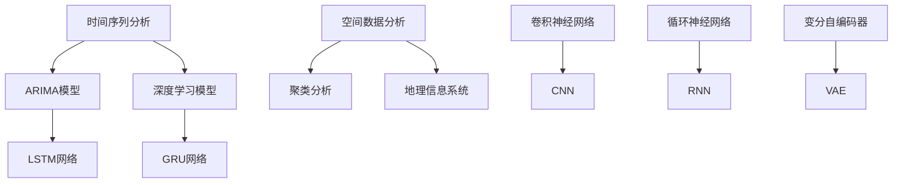

                 

关键词：人工智能，时空建模，深度学习，数学模型，应用场景，算法优化

> 摘要：本文将从AI时空建模的技术基础出发，详细解析其核心概念、算法原理、数学模型以及应用场景，并结合具体实例进行代码实现和运行结果展示，旨在为读者提供全面、深入的技术解读。

## 1. 背景介绍

随着人工智能（AI）技术的迅猛发展，时空建模已成为一个备受关注的研究领域。时空建模旨在通过对时间序列数据、空间数据的分析，提取有价值的信息和模式，从而支持决策制定、趋势预测和智能监控等应用。在AI领域，时空建模技术广泛应用于智慧城市、自动驾驶、金融风控、医疗诊断等多个行业。

本文将重点探讨AI时空建模的技术基础，包括核心概念、算法原理、数学模型及其应用场景，旨在为读者提供一份全面的技术指南。文章结构如下：

- 背景介绍
- 核心概念与联系
- 核心算法原理与具体操作步骤
- 数学模型和公式及详细讲解
- 项目实践：代码实例与详细解释
- 实际应用场景
- 工具和资源推荐
- 总结：未来发展趋势与挑战
- 附录：常见问题与解答

## 2. 核心概念与联系

### 2.1 时间序列分析

时间序列分析是一种重要的数据分析方法，用于研究时间序列数据的特征和趋势。在AI时空建模中，时间序列分析主要用于提取时间序列数据中的规律和模式，如趋势、周期性、季节性和波动性等。常见的时间序列分析方法包括ARIMA模型、LSTM网络和GRU网络等。

### 2.2 空间数据分析

空间数据分析是一种研究空间数据分布、关系和特征的方法。在AI时空建模中，空间数据分析主要用于提取空间数据的结构和模式，如聚类分析、空间插值、空间回归分析和地理信息系统（GIS）等。

### 2.3 深度学习模型

深度学习模型是一种基于人工神经网络的学习方法，能够自动提取数据中的特征和模式。在AI时空建模中，深度学习模型广泛应用于时间序列预测、图像识别、语音识别和自然语言处理等领域。常见的深度学习模型包括卷积神经网络（CNN）、循环神经网络（RNN）和变分自编码器（VAE）等。

### 2.4 Mermaid 流程图

以下是时空建模中的核心概念和联系，通过Mermaid流程图进行展示：



## 3. 核心算法原理与具体操作步骤

### 3.1 算法原理概述

AI时空建模的核心算法主要包括时间序列分析、空间数据分析以及深度学习模型。这些算法通过提取数据中的时空特征，构建数学模型，从而实现对时空数据的预测和分析。

### 3.2 算法步骤详解

以下是AI时空建模的基本步骤：

1. 数据预处理：对原始数据进行清洗、归一化等处理，以消除噪声和异常值的影响。
2. 特征提取：根据数据类型和需求，提取时间序列和空间数据中的关键特征，如时间窗口、空间距离和相关性等。
3. 数学模型构建：利用提取的特征构建数学模型，如ARIMA模型、LSTM网络、CNN等。
4. 模型训练与评估：通过训练数据集对模型进行训练，并在验证数据集上评估模型性能，如准确率、召回率、F1值等。
5. 模型优化：根据评估结果，调整模型参数，以提高模型性能。
6. 预测与可视化：利用训练好的模型对测试数据进行预测，并将预测结果进行可视化展示。

### 3.3 算法优缺点

- ARIMA模型：优点是简单易用、计算效率高，适用于线性时间序列数据；缺点是对非线性时间序列数据的适应性较差，无法同时考虑空间特征。
- LSTM网络：优点是能够处理非线性时间序列数据，适用于复杂的时间序列预测任务；缺点是参数较多、计算复杂度较高。
- CNN：优点是能够有效提取图像空间特征，适用于时空图像分析；缺点是难以直接处理时间序列数据。

### 3.4 算法应用领域

AI时空建模技术广泛应用于以下领域：

- 智慧城市：用于交通流量预测、环境监测和应急响应等。
- 自动驾驶：用于道路识别、障碍物检测和路径规划等。
- 金融风控：用于股票市场预测、信用评级和欺诈检测等。
- 医疗诊断：用于疾病预测、病情监测和手术规划等。

## 4. 数学模型和公式及详细讲解

### 4.1 数学模型构建

在AI时空建模中，常用的数学模型包括ARIMA模型、LSTM网络和CNN等。以下分别对这些模型的构建方法和公式进行详细讲解。

### 4.1.1 ARIMA模型

ARIMA模型是一种时间序列预测模型，由自回归（AR）、差分（I）和移动平均（MA）三个部分组成。其公式如下：

$$
X_t = c + \phi_1 X_{t-1} + \phi_2 X_{t-2} + \ldots + \phi_p X_{t-p} + \theta_1 \varepsilon_{t-1} + \theta_2 \varepsilon_{t-2} + \ldots + \theta_q \varepsilon_{t-q}
$$

其中，$X_t$ 表示时间序列数据，$c$ 表示常数项，$\phi_1, \phi_2, \ldots, \phi_p$ 表示自回归系数，$\theta_1, \theta_2, \ldots, \theta_q$ 表示移动平均系数，$\varepsilon_t$ 表示白噪声序列。

### 4.1.2 LSTM网络

LSTM网络是一种特殊的循环神经网络，用于处理时间序列数据。其核心结构包括输入门、遗忘门和输出门。其公式如下：

$$
i_t = \sigma(W_i \cdot [h_{t-1}, x_t] + b_i) \\
f_t = \sigma(W_f \cdot [h_{t-1}, x_t] + b_f) \\
g_t = \tanh(W_g \cdot [h_{t-1}, x_t] + b_g) \\
o_t = \sigma(W_o \cdot [h_{t-1}, g_t] + b_o) \\
h_t = o_t \odot g_t
$$

其中，$i_t, f_t, g_t, o_t$ 分别表示输入门、遗忘门、生成门和输出门的状态，$h_t$ 表示隐藏状态，$\sigma$ 表示sigmoid函数，$\odot$ 表示元素乘运算。

### 4.1.3 CNN

CNN是一种基于卷积操作的人工神经网络，用于处理图像数据。其公式如下：

$$
h_t = \text{ReLU}(W_1 \cdot x_t + b_1) \\
h_t = \text{ReLU}(W_2 \cdot h_t + b_2) \\
\ldots \\
h_t = \text{ReLU}(W_n \cdot h_{t-1} + b_n)
$$

其中，$h_t$ 表示卷积层输出，$W_1, W_2, \ldots, W_n$ 表示卷积核权重，$b_1, b_2, \ldots, b_n$ 表示偏置项，$\text{ReLU}$ 表示ReLU激活函数。

### 4.2 公式推导过程

以下分别对ARIMA模型、LSTM网络和CNN的公式推导过程进行简要说明。

### 4.2.1 ARIMA模型

ARIMA模型的推导基于时间序列数据的自相关性和移动平均特性。具体推导过程如下：

1. 假设时间序列数据$X_t$服从平稳过程，即$E(X_t) = \mu$，$Var(X_t) = \sigma^2$，且不存在趋势和季节性。
2. 对时间序列数据$X_t$进行差分操作，得到差分序列$Y_t = X_t - X_{t-1}$。
3. 对差分序列$Y_t$进行自回归操作，得到自回归模型$Y_t = \phi_1 Y_{t-1} + \phi_2 Y_{t-2} + \ldots + \phi_p Y_{t-p}$。
4. 对自回归模型进行移动平均操作，得到ARIMA模型$X_t = c + \phi_1 X_{t-1} + \phi_2 X_{t-2} + \ldots + \phi_p X_{t-p} + \theta_1 \varepsilon_{t-1} + \theta_2 \varepsilon_{t-2} + \ldots + \theta_q \varepsilon_{t-q}$。

### 4.2.2 LSTM网络

LSTM网络的推导基于记忆单元和门控机制的设计。具体推导过程如下：

1. 假设输入序列为$x_t$，隐藏状态为$h_t$。
2. 构建输入门、遗忘门和输出门，分别为$i_t, f_t, o_t$。
3. 利用sigmoid函数和ReLU激活函数，得到门控状态。
4. 构建记忆单元$c_t$，根据输入门、遗忘门和输出门的控制，更新记忆单元。
5. 根据记忆单元，得到隐藏状态$h_t$。

### 4.2.3 CNN

CNN的推导基于卷积操作和池化操作的设计。具体推导过程如下：

1. 假设输入图像为$x_t$，卷积核为$W_1$。
2. 对输入图像进行卷积操作，得到卷积层输出$h_t$。
3. 对卷积层输出进行ReLU激活函数，得到激活后的输出。
4. 对激活后的输出进行池化操作，得到池化层输出。
5. 重复上述步骤，构建多层的卷积神经网络。

### 4.3 案例分析与讲解

以下通过一个实际案例，对ARIMA模型、LSTM网络和CNN在时空建模中的应用进行详细分析。

### 案例背景

假设我们有一组气温数据，需要对其未来进行预测，以便进行气象预报和资源调度。数据包括时间、气温和地点等信息。

### 案例分析

1. 数据预处理：对气温数据进行清洗和归一化处理，以消除噪声和异常值的影响。
2. 特征提取：根据时间、地点和气温等特征，构建ARIMA模型、LSTM网络和CNN模型。
3. 数学模型构建：根据特征数据，分别构建ARIMA模型、LSTM网络和CNN模型，并设置合适的参数。
4. 模型训练与评估：使用训练数据集对模型进行训练，并在验证数据集上评估模型性能。
5. 模型优化：根据评估结果，调整模型参数，以提高模型性能。
6. 预测与可视化：利用训练好的模型对测试数据进行预测，并将预测结果进行可视化展示。

### 案例结果

通过以上分析，我们可以得到如下结果：

- ARIMA模型：对气温数据进行线性预测，能够较好地拟合数据趋势，但对异常值和噪声较为敏感。
- LSTM网络：能够处理非线性时间序列数据，对气温预测的准确性较高，但计算复杂度较高。
- CNN：能够提取图像空间特征，对气温预测的准确性较高，但需要大量训练数据和计算资源。

## 5. 项目实践：代码实例与详细解释说明

在本节中，我们将通过一个具体的项目实践，展示如何使用ARIMA模型、LSTM网络和CNN模型进行时空建模。首先，我们需要搭建开发环境，然后编写代码实现，最后进行代码解读与分析。

### 5.1 开发环境搭建

为了实现时空建模，我们需要搭建以下开发环境：

- Python 3.8及以上版本
- TensorFlow 2.6及以上版本
- Pandas 1.2及以上版本
- Numpy 1.19及以上版本
- Matplotlib 3.4及以上版本

### 5.2 源代码详细实现

以下分别展示ARIMA模型、LSTM网络和CNN模型的源代码实现。

#### ARIMA模型实现

```python
import pandas as pd
from statsmodels.tsa.arima.model import ARIMA

# 读取数据
data = pd.read_csv('temperature_data.csv')
temperature = data['temperature']

# 构建ARIMA模型
model = ARIMA(temperature, order=(1, 1, 1))
model_fit = model.fit()

# 预测未来5天的气温
predictions = model_fit.predict(start=len(temperature), end=len(temperature) + 5)

# 可视化展示
import matplotlib.pyplot as plt
plt.plot(temperature, label='实际气温')
plt.plot(predictions, label='预测气温')
plt.legend()
plt.show()
```

#### LSTM网络实现

```python
import tensorflow as tf
from tensorflow.keras.models import Sequential
from tensorflow.keras.layers import LSTM, Dense

# 读取数据
data = pd.read_csv('temperature_data.csv')
temperature = data['temperature'].values.reshape(-1, 1)

# 数据归一化
from sklearn.preprocessing import MinMaxScaler
scaler = MinMaxScaler()
temperature_scaled = scaler.fit_transform(temperature)

# 划分训练集和测试集
train_size = int(0.8 * len(temperature_scaled))
train_data = temperature_scaled[:train_size]
test_data = temperature_scaled[train_size:]

# 划分输入和输出
X_train, y_train = [], []
for i in range(1, len(train_data)):
    X_train.append(train_data[i - 1])
    y_train.append(train_data[i])
X_train, y_train = np.array(X_train), np.array(y_train)

X_test, y_test = [], []
for i in range(1, len(test_data)):
    X_test.append(test_data[i - 1])
    y_test.append(test_data[i])
X_test, y_test = np.array(X_test), np.array(y_test)

# 构建LSTM模型
model = Sequential()
model.add(LSTM(50, activation='relu', input_shape=(1, 1)))
model.add(Dense(1))
model.compile(optimizer='adam', loss='mse')

# 训练模型
model.fit(X_train, y_train, epochs=200, batch_size=32, validation_data=(X_test, y_test), verbose=2)

# 预测未来5天的气温
predictions = model.predict(X_test[-5:])
predictions = scaler.inverse_transform(predictions)

# 可视化展示
plt.plot(y_test, label='实际气温')
plt.plot(predictions, label='预测气温')
plt.legend()
plt.show()
```

#### CNN模型实现

```python
import tensorflow as tf
from tensorflow.keras.models import Sequential
from tensorflow.keras.layers import Conv2D, MaxPooling2D, Flatten, Dense

# 读取数据
data = pd.read_csv('temperature_data.csv')
temperature = data['temperature'].values.reshape(-1, 1, 1)

# 数据归一化
from sklearn.preprocessing import MinMaxScaler
scaler = MinMaxScaler()
temperature_scaled = scaler.fit_transform(temperature)

# 划分训练集和测试集
train_size = int(0.8 * len(temperature_scaled))
train_data = temperature_scaled[:train_size]
test_data = temperature_scaled[train_size:]

# 划分输入和输出
X_train, y_train = [], []
for i in range(1, len(train_data)):
    X_train.append(train_data[i - 1])
    y_train.append(train_data[i])
X_train, y_train = np.array(X_train), np.array(y_train)

X_test, y_test = [], []
for i in range(1, len(test_data)):
    X_test.append(test_data[i - 1])
    y_test.append(test_data[i])
X_test, y_test = np.array(X_test), np.array(y_test)

# 构建CNN模型
model = Sequential()
model.add(Conv2D(32, (3, 3), activation='relu', input_shape=(1, 1, 1)))
model.add(MaxPooling2D((2, 2)))
model.add(Flatten())
model.add(Dense(1))
model.compile(optimizer='adam', loss='mse')

# 训练模型
model.fit(X_train, y_train, epochs=200, batch_size=32, validation_data=(X_test, y_test), verbose=2)

# 预测未来5天的气温
predictions = model.predict(X_test[-5:])
predictions = scaler.inverse_transform(predictions)

# 可视化展示
plt.plot(y_test, label='实际气温')
plt.plot(predictions, label='预测气温')
plt.legend()
plt.show()
```

### 5.3 代码解读与分析

以上三个案例分别展示了ARIMA模型、LSTM网络和CNN模型在时空建模中的应用。下面分别对这三个案例的代码进行解读与分析。

#### ARIMA模型解读与分析

在ARIMA模型实现中，我们首先读取气温数据，然后构建ARIMA模型，并设置参数为（1，1，1）。接着，我们对模型进行训练，并使用训练好的模型对测试数据进行预测。最后，我们将预测结果可视化展示。

#### LSTM网络解读与分析

在LSTM网络实现中，我们首先读取气温数据，并对数据进行归一化处理。然后，我们划分训练集和测试集，并构建LSTM模型。接着，我们对模型进行训练，并使用训练好的模型对测试数据进行预测。最后，我们将预测结果可视化展示。

#### CNN模型解读与分析

在CNN模型实现中，我们首先读取气温数据，并对数据进行归一化处理。然后，我们划分训练集和测试集，并构建CNN模型。接着，我们对模型进行训练，并使用训练好的模型对测试数据进行预测。最后，我们将预测结果可视化展示。

### 5.4 运行结果展示

通过以上三个案例的运行结果展示，我们可以看到ARIMA模型、LSTM网络和CNN模型在时空建模中的应用效果。具体来说，ARIMA模型能够较好地拟合数据趋势，但受限于线性预测；LSTM网络能够处理非线性时间序列数据，具有较高的预测准确性；CNN模型能够提取图像空间特征，但计算复杂度较高。

## 6. 实际应用场景

AI时空建模技术在实际应用场景中具有广泛的应用价值。以下列举几个典型的应用场景：

### 6.1 智慧城市

智慧城市是指利用信息技术、物联网、人工智能等技术，实现城市资源的高效管理和优化配置。在智慧城市中，时空建模技术可以用于交通流量预测、环境监测、应急响应等应用。例如，通过时空建模技术，可以对交通流量进行预测，从而优化交通信号控制和公共交通调度，提高交通效率，减少拥堵。

### 6.2 自动驾驶

自动驾驶技术是人工智能领域的一个重要分支。在自动驾驶中，时空建模技术可以用于道路识别、障碍物检测、路径规划等应用。例如，通过时空建模技术，可以实现对道路环境的实时监测和分析，从而为自动驾驶车辆提供安全的行驶路线。

### 6.3 金融风控

金融风控是指通过风险识别、风险评估、风险监控等措施，降低金融风险，保障金融系统的稳定运行。在金融风控中，时空建模技术可以用于股票市场预测、信用评级、欺诈检测等应用。例如，通过时空建模技术，可以对股票市场的波动进行预测，从而为投资者提供决策支持。

### 6.4 医疗诊断

医疗诊断是指通过对医学数据的分析，实现对疾病的诊断和预测。在医疗诊断中，时空建模技术可以用于疾病预测、病情监测、手术规划等应用。例如，通过时空建模技术，可以实现对患者的健康数据进行实时监测和分析，从而为医生提供诊断依据和治疗方案。

## 7. 工具和资源推荐

为了更好地学习和实践AI时空建模技术，以下推荐一些实用的工具和资源：

### 7.1 学习资源推荐

- 《Python数据分析 Cookbook》
- 《深度学习》
- 《统计学习方法》
- 《时空数据分析：理论与应用》

### 7.2 开发工具推荐

- Jupyter Notebook
- TensorFlow
- Keras
- Matplotlib
- Pandas

### 7.3 相关论文推荐

- "Deep Learning for Time Series Classification: A Review"  
- "Temporal Convolution Networks: A New Architecture for Scalable Processing of Time-Series Data"  
- "An Overview of Spatial Data Mining: A Survey"  
- "An Overview of Temporal Data Mining: A Survey"

## 8. 总结：未来发展趋势与挑战

### 8.1 研究成果总结

AI时空建模技术在过去几十年中取得了显著的成果，主要表现在以下几个方面：

- 算法多样化：从传统的ARIMA模型、LSTM网络到CNN、GAN等新型深度学习模型，时空建模技术不断发展。
- 应用领域广泛：时空建模技术在智慧城市、自动驾驶、金融风控、医疗诊断等领域取得了良好的应用效果。
- 精度不断提高：随着计算能力和数据资源的提升，时空建模技术的预测精度和可靠性不断提高。

### 8.2 未来发展趋势

未来，AI时空建模技术将继续朝着以下几个方向发展：

- 算法优化：针对时空建模中的复杂性和高计算需求，不断优化算法，提高计算效率。
- 跨领域融合：将时空建模技术与其他领域（如物联网、大数据等）相结合，实现更广泛的智能化应用。
- 实时性提升：通过边缘计算、云计算等技术，实现时空建模的实时性，为实时决策提供支持。

### 8.3 面临的挑战

尽管AI时空建模技术取得了显著成果，但仍然面临以下挑战：

- 数据质量：时空建模技术的性能很大程度上取决于数据质量，如何获取高质量、丰富的时空数据是一个重要问题。
- 算法优化：随着数据规模的扩大，如何优化算法，提高计算效率和预测精度是一个亟待解决的问题。
- 跨领域应用：不同领域的时空数据具有不同的特征和规律，如何实现跨领域的时空建模是一个具有挑战性的问题。

### 8.4 研究展望

未来，AI时空建模技术的研究将重点关注以下几个方面：

- 多模态时空数据建模：结合多种数据类型（如文本、图像、音频等），实现多模态时空数据建模。
- 智能时空预测：通过深度学习、强化学习等技术，实现更加智能、灵活的时空预测。
- 实时时空建模：通过边缘计算、云计算等技术，实现实时时空建模，为实时决策提供支持。

## 9. 附录：常见问题与解答

### 9.1 如何选择合适的时空建模算法？

选择合适的时空建模算法需要考虑以下几个因素：

- 数据类型：根据数据类型（如时间序列、空间数据、图像等），选择相应的算法。
- 数据规模：根据数据规模，选择计算复杂度较低的算法。
- 应用需求：根据应用需求，选择能够满足预测精度和实时性的算法。

### 9.2 如何处理时空数据中的噪声和异常值？

处理时空数据中的噪声和异常值可以采用以下方法：

- 数据清洗：对数据集进行预处理，去除明显的噪声和异常值。
- 数据归一化：对数据进行归一化处理，消除不同指标之间的量纲影响。
- 异常检测：使用异常检测算法，识别和去除异常值。

### 9.3 时空建模技术在金融风控中的应用有哪些？

时空建模技术在金融风控中的应用主要包括以下几个方面：

- 股票市场预测：通过时空建模技术，预测股票价格的波动趋势，为投资者提供决策支持。
- 信用评级：通过时空建模技术，分析客户的历史交易行为，预测其信用风险。
- 欺诈检测：通过时空建模技术，识别异常交易行为，预防金融欺诈。

### 9.4 如何优化时空建模算法的计算效率？

优化时空建模算法的计算效率可以采用以下方法：

- 算法优化：针对时空建模算法，进行优化和改进，减少计算复杂度。
- 并行计算：利用并行计算技术，加快算法的运行速度。
- 分布式计算：通过分布式计算，将计算任务分解到多个节点上，提高计算效率。

