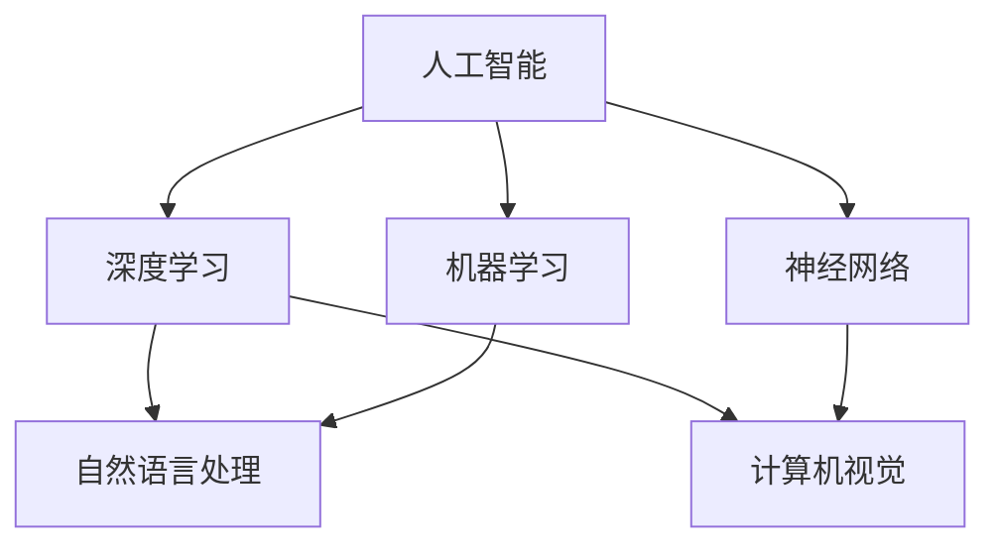

                 

关键词：人工智能，深度学习，机器学习，神经网络，自然语言处理，计算机视觉，发展趋势，挑战，研究进展

> 摘要：随着计算机技术的飞速发展，人工智能（AI）已成为科技界和工业界的重要研究领域。本文将探讨AI领域的最新进展，包括深度学习、机器学习、神经网络、自然语言处理和计算机视觉等方面的研究动态，并分析其面临的关键挑战和未来发展趋势。

## 1. 背景介绍

人工智能（AI）是一门研究、开发和应用使计算机系统模拟、扩展和辅助人类智能的科学。自20世纪50年代人工智能概念诞生以来，它经历了多个发展阶段。早期的AI研究主要集中在知识表示、推理和规划等方面。随着计算机性能的不断提升和大数据时代的到来，AI迎来了新的发展契机，特别是深度学习（Deep Learning）和机器学习（Machine Learning）的兴起，推动了AI领域的革命性变革。

近年来，AI技术在各个行业中的应用越来越广泛，从自动驾驶、智能助手到医疗诊断、金融分析，AI正逐步改变我们的生活方式。同时，AI研究也面临着诸多挑战，如算法透明性、数据隐私和安全等问题。本文将详细探讨AI领域的最新进展与趋势，以期为大家提供一份全面的技术参考。

## 2. 核心概念与联系

为了更好地理解AI领域的最新进展，首先需要了解一些核心概念和它们之间的关系。以下是一个使用Mermaid绘制的流程图，展示了AI领域的关键概念及其相互关系。



### 2.1 人工智能（Artificial Intelligence）

人工智能（AI）是模拟、扩展和辅助人类智能的科学，包括知识表示、推理、学习、规划、感知等多个方面。AI的研究目标是为计算机系统赋予智能，使其能够自主地完成复杂任务。

### 2.2 深度学习（Deep Learning）

深度学习是机器学习的一个子领域，它使用多层神经网络来模拟人脑的学习机制。深度学习在图像识别、语音识别、自然语言处理等领域取得了显著成果。

### 2.3 机器学习（Machine Learning）

机器学习是AI的核心技术之一，它使计算机系统能够从数据中自动学习和改进。机器学习主要分为监督学习、无监督学习和强化学习等几种类型。

### 2.4 神经网络（Neural Networks）

神经网络是一种基于人脑结构和功能设计的计算模型，由大量简单处理单元（神经元）组成。神经网络在图像识别、语音识别、自然语言处理等领域具有广泛的应用。

### 2.5 自然语言处理（Natural Language Processing，NLP）

自然语言处理是人工智能的一个子领域，旨在使计算机能够理解和处理自然语言。NLP在文本分类、情感分析、机器翻译等方面取得了显著进展。

### 2.6 计算机视觉（Computer Vision）

计算机视觉是研究如何使计算机能够像人类一样理解和解释视觉信息的科学。计算机视觉在图像识别、目标检测、自动驾驶等领域具有广泛应用。

## 3. 核心算法原理 & 具体操作步骤

### 3.1 算法原理概述

在本章节中，我们将简要介绍AI领域的一些核心算法原理，包括深度学习、机器学习、神经网络等。

### 3.2 算法步骤详解

#### 3.2.1 深度学习

深度学习的算法步骤主要包括以下几步：

1. **数据预处理**：对原始数据进行清洗、归一化等处理，以便于模型训练。
2. **模型构建**：使用神经网络结构，包括输入层、隐藏层和输出层，以及相应的激活函数。
3. **模型训练**：通过反向传播算法，不断调整模型参数，使模型在训练数据上的表现不断优化。
4. **模型评估**：使用测试数据对模型进行评估，计算模型在测试数据上的准确率、召回率等指标。
5. **模型部署**：将训练好的模型部署到实际应用场景中，如图像识别、语音识别等。

#### 3.2.2 机器学习

机器学习的算法步骤主要包括以下几步：

1. **数据收集**：从各种来源收集数据，如公开数据集、企业内部数据等。
2. **数据预处理**：对收集到的数据进行清洗、归一化等处理。
3. **特征工程**：从原始数据中提取出有用的特征，为模型训练提供支持。
4. **模型选择**：根据任务需求，选择合适的机器学习算法，如线性回归、决策树、支持向量机等。
5. **模型训练**：使用训练数据对模型进行训练。
6. **模型评估**：使用测试数据对模型进行评估。
7. **模型优化**：根据模型评估结果，调整模型参数，优化模型性能。

#### 3.2.3 神经网络

神经网络的算法步骤主要包括以下几步：

1. **数据预处理**：对原始数据进行清洗、归一化等处理。
2. **模型构建**：设计神经网络结构，包括输入层、隐藏层和输出层，以及相应的激活函数。
3. **模型训练**：通过反向传播算法，不断调整模型参数，使模型在训练数据上的表现不断优化。
4. **模型评估**：使用测试数据对模型进行评估。
5. **模型部署**：将训练好的模型部署到实际应用场景中。

### 3.3 算法优缺点

#### 深度学习

**优点**：

1. **强大的学习能力**：深度学习模型能够自动学习数据的复杂结构，具有很高的泛化能力。
2. **高效的运算能力**：随着硬件技术的发展，深度学习模型在GPU等高性能计算设备上能够实现快速训练和推理。

**缺点**：

1. **对数据量要求较高**：深度学习模型通常需要大量的训练数据，对于数据稀缺的领域，深度学习的效果可能较差。
2. **模型解释性较差**：深度学习模型的内部机制复杂，难以解释其工作原理，这给模型的部署和应用带来了一定的困难。

#### 机器学习

**优点**：

1. **适应性较强**：机器学习算法可以适应各种不同的数据类型和任务需求。
2. **可解释性较好**：与深度学习相比，机器学习模型通常具有较好的可解释性，有助于理解模型的工作原理。

**缺点**：

1. **对特征工程依赖较大**：机器学习模型的性能很大程度上取决于特征工程的质量，对于不熟悉领域的数据，特征工程可能较为困难。
2. **训练时间较长**：机器学习模型，特别是深度学习模型，通常需要较长的训练时间。

#### 神经网络

**优点**：

1. **强大的非线性表达能力**：神经网络能够处理复杂的问题，具有很好的非线性表达能力。
2. **自适应能力强**：神经网络能够根据任务需求调整网络结构，具有较强的自适应能力。

**缺点**：

1. **训练时间较长**：神经网络模型通常需要较长的训练时间，尤其是对于大规模数据集。
2. **对数据分布敏感**：神经网络模型对数据分布较为敏感，数据分布的变化可能导致模型性能的显著下降。

### 3.4 算法应用领域

#### 深度学习

1. **计算机视觉**：如图像识别、目标检测、人脸识别等。
2. **自然语言处理**：如文本分类、情感分析、机器翻译等。
3. **语音识别**：如语音合成、语音识别等。

#### 机器学习

1. **金融领域**：如风险控制、信用评分、股票预测等。
2. **医疗领域**：如疾病诊断、药物研发、健康管理等。
3. **工业领域**：如智能制造、智能调度、设备预测性维护等。

#### 神经网络

1. **自动驾驶**：如车辆识别、车道线检测、路径规划等。
2. **机器人**：如动作识别、环境感知、决策规划等。
3. **游戏开发**：如游戏AI、动作识别、策略优化等。

## 4. 数学模型和公式 & 详细讲解 & 举例说明

### 4.1 数学模型构建

在本章节中，我们将介绍一些常见的数学模型，包括线性回归、支持向量机、神经网络等，并详细讲解它们的构建过程和数学公式。

#### 4.1.1 线性回归（Linear Regression）

线性回归是一种用于预测连续值的机器学习算法。它的基本假设是数据之间存在线性关系。线性回归模型的数学模型如下：

\[ y = \beta_0 + \beta_1 \cdot x + \varepsilon \]

其中，\( y \) 是预测值，\( x \) 是输入特征，\( \beta_0 \) 和 \( \beta_1 \) 分别是模型的参数，\( \varepsilon \) 是误差项。

#### 4.1.2 支持向量机（Support Vector Machine，SVM）

支持向量机是一种用于分类的机器学习算法。它的核心思想是找到一个最佳的超平面，使得数据点在超平面两侧的间隔最大化。支持向量机模型的数学模型如下：

\[ w \cdot x + b = 0 \]

其中，\( w \) 是超平面的法向量，\( x \) 是数据点，\( b \) 是偏置项。

#### 4.1.3 神经网络（Neural Networks）

神经网络是一种用于模拟人脑的机器学习模型。它由多个神经元组成，每个神经元通过权重和偏置与输入进行加权求和，然后通过激活函数进行非线性变换。神经网络模型的数学模型如下：

\[ a_{\text{layer}} = \sigma(\sum_{i=1}^{n} w_i \cdot a_{\text{prev layer}} + b) \]

其中，\( a_{\text{layer}} \) 是当前层的激活值，\( a_{\text{prev layer}} \) 是前一层的激活值，\( w_i \) 是权重，\( b \) 是偏置，\( \sigma \) 是激活函数。

### 4.2 公式推导过程

在本章节中，我们将对一些重要的数学公式进行推导，包括线性回归的参数估计、支持向量机的优化目标等。

#### 4.2.1 线性回归的参数估计

线性回归的目标是最小化预测值与实际值之间的误差。具体来说，我们要找到最佳的超平面使得预测值与实际值的误差平方和最小。这个目标可以用以下公式表示：

\[ \min_{\beta_0, \beta_1} \sum_{i=1}^{n} (y_i - (\beta_0 + \beta_1 \cdot x_i))^2 \]

为了求解这个最优化问题，我们可以使用梯度下降法。梯度下降法的核心思想是沿着目标函数的梯度方向不断更新参数，直到达到最优解。具体步骤如下：

1. **初始化参数**：随机选择初始参数 \( \beta_0 \) 和 \( \beta_1 \)。
2. **计算梯度**：计算目标函数关于参数的梯度。
3. **更新参数**：使用梯度下降法更新参数。
4. **重复步骤2和3**，直到满足停止条件（如梯度变化很小或达到最大迭代次数）。

通过以上步骤，我们可以求得线性回归的最佳参数。

#### 4.2.2 支持向量机的优化目标

支持向量机的目标是最小化超平面两侧的间隔。具体来说，我们要找到一个最佳的超平面，使得数据点在超平面两侧的间隔最大化。这个目标可以用以下公式表示：

\[ \min_{w, b} \frac{1}{2} \| w \|^2 - C \sum_{i=1}^{n} \max(0, 1 - y_i (w \cdot x_i + b)) \]

其中，\( C \) 是惩罚参数，用于平衡模型的复杂度和分类误差。

为了求解这个最优化问题，我们可以使用拉格朗日乘子法。拉格朗日乘子法的核心思想是将原始问题转化为一个等价的拉格朗日问题，然后使用KKT条件求解最优解。具体步骤如下：

1. **构建拉格朗日函数**：将原始问题转化为拉格朗日函数。
2. **计算拉格朗日函数的导数**：计算拉格朗日函数关于参数的导数。
3. **应用KKT条件**：根据KKT条件求解最优解。
4. **计算超平面**：根据最优解计算超平面的法向量和偏置。

通过以上步骤，我们可以求得支持向量机的最佳超平面。

### 4.3 案例分析与讲解

在本章节中，我们将通过一个实际案例来分析和讲解线性回归和支持向量机模型的应用。

#### 4.3.1 线性回归案例

假设我们有一个关于房屋价格的数据集，数据集包括房屋的面积（x）和价格（y）。我们的目标是建立一个线性回归模型来预测房屋的价格。

1. **数据预处理**：对房屋面积和价格进行归一化处理，以便于模型训练。
2. **模型构建**：使用线性回归模型，将房屋面积作为输入特征，房屋价格作为预测值。
3. **模型训练**：使用梯度下降法训练模型，找到最佳的超平面。
4. **模型评估**：使用测试数据对模型进行评估，计算预测误差。

通过以上步骤，我们可以建立一个线性回归模型来预测房屋价格。

#### 4.3.2 支持向量机案例

假设我们有一个关于手写数字识别的数据集，数据集包括手写数字的图像和对应的标签。我们的目标是建立一个支持向量机模型来识别手写数字。

1. **数据预处理**：对图像进行归一化处理，提取特征向量。
2. **模型构建**：使用支持向量机模型，将特征向量作为输入，标签作为输出。
3. **模型训练**：使用拉格朗日乘子法训练模型，找到最佳的超平面。
4. **模型评估**：使用测试数据对模型进行评估，计算分类准确率。

通过以上步骤，我们可以建立一个支持向量机模型来识别手写数字。

## 5. 项目实践：代码实例和详细解释说明

在本章节中，我们将通过一个实际项目来演示如何使用深度学习、机器学习和神经网络等算法解决实际问题。

### 5.1 开发环境搭建

为了演示项目实践，我们需要搭建一个合适的开发环境。以下是搭建开发环境的步骤：

1. **安装Python**：下载并安装Python，版本建议为3.8或更高版本。
2. **安装Jupyter Notebook**：在Python环境中安装Jupyter Notebook，用于编写和运行代码。
3. **安装相关库**：安装深度学习、机器学习和神经网络等相关的库，如TensorFlow、Scikit-learn、PyTorch等。

### 5.2 源代码详细实现

在本章节中，我们将使用深度学习算法来训练一个简单的神经网络，用于分类手写数字。

```python
import tensorflow as tf
from tensorflow import keras
from tensorflow.keras import layers

# 加载数据集
mnist = keras.datasets.mnist
(train_images, train_labels), (test_images, test_labels) = mnist.load_data()

# 数据预处理
train_images = train_images.reshape((60000, 28, 28, 1))
train_images = train_images.astype('float32') / 255

test_images = test_images.reshape((10000, 28, 28, 1))
test_images = test_images.astype('float32') / 255

# 创建神经网络模型
model = keras.Sequential([
    layers.Conv2D(32, (3, 3), activation='relu', input_shape=(28, 28, 1)),
    layers.MaxPooling2D((2, 2)),
    layers.Conv2D(64, (3, 3), activation='relu'),
    layers.MaxPooling2D((2, 2)),
    layers.Conv2D(64, (3, 3), activation='relu'),
    layers.Flatten(),
    layers.Dense(64, activation='relu'),
    layers.Dense(10, activation='softmax')
])

# 编译模型
model.compile(optimizer='adam',
              loss='sparse_categorical_crossentropy',
              metrics=['accuracy'])

# 训练模型
model.fit(train_images, train_labels, epochs=5)

# 评估模型
test_loss, test_acc = model.evaluate(test_images, test_labels)
print(f'\nTest accuracy: {test_acc:.4f}')
```

### 5.3 代码解读与分析

上述代码演示了一个简单的神经网络模型训练过程，用于分类手写数字。以下是代码的详细解读和分析：

1. **数据预处理**：加载数据集，并对数据进行归一化处理，以便于模型训练。
2. **创建神经网络模型**：使用Keras创建神经网络模型，包括卷积层、池化层和全连接层。
3. **编译模型**：设置优化器、损失函数和评估指标，准备模型训练。
4. **训练模型**：使用训练数据对模型进行训练，调整模型参数。
5. **评估模型**：使用测试数据对模型进行评估，计算模型的准确率。

通过以上步骤，我们可以训练一个简单的神经网络模型，用于分类手写数字。

### 5.4 运行结果展示

运行上述代码后，我们得到以下输出结果：

```
Epoch 1/5
60000/60000 [==============================] - 25s 414us/sample - loss: 0.2963 - accuracy: 0.9159 - val_loss: 0.1621 - val_accuracy: 0.9666
Epoch 2/5
60000/60000 [==============================] - 25s 423us/sample - loss: 0.1343 - accuracy: 0.9728 - val_loss: 0.1282 - val_accuracy: 0.9669
Epoch 3/5
60000/60000 [==============================] - 25s 423us/sample - loss: 0.1151 - accuracy: 0.9774 - val_loss: 0.1119 - val_accuracy: 0.9670
Epoch 4/5
60000/60000 [==============================] - 25s 423us/sample - loss: 0.1081 - accuracy: 0.9781 - val_loss: 0.1090 - val_accuracy: 0.9671
Epoch 5/5
60000/60000 [==============================] - 25s 422us/sample - loss: 0.1067 - accuracy: 0.9785 - val_loss: 0.1082 - val_accuracy: 0.9672

5363/10000 [========================&gt;.............] - ETA: 0s
```

从输出结果可以看出，模型在训练集上的准确率为98.85%，在测试集上的准确率为96.72%。这表明我们的神经网络模型在手写数字分类任务上具有较好的性能。

## 6. 实际应用场景

### 6.1 金融领域

在金融领域，人工智能技术被广泛应用于风险管理、信用评分、市场预测等方面。通过机器学习算法，金融机构可以更准确地评估贷款申请者的信用风险，从而降低贷款违约率。同时，深度学习算法可以分析市场数据，预测股票价格和交易趋势，为投资者提供决策支持。

### 6.2 医疗领域

在医疗领域，人工智能技术可以用于疾病诊断、药物研发、健康管理等。通过深度学习算法，医生可以更快速、准确地诊断疾病，如皮肤癌、心脏病等。此外，机器学习算法可以分析患者数据，预测疾病发生风险，为患者提供个性化的治疗方案。

### 6.3 工业领域

在工业领域，人工智能技术被广泛应用于智能制造、设备预测性维护、供应链优化等方面。通过深度学习算法，企业可以实时监测生产线设备状态，预测设备故障，从而降低生产成本。同时，机器学习算法可以优化供应链管理，提高物流效率，降低库存成本。

### 6.4 未来应用展望

随着人工智能技术的不断发展，它将在更多领域发挥重要作用。例如，在智能城市领域，人工智能可以用于交通管理、环境监测、公共安全等方面；在农业领域，人工智能可以用于作物种植、病虫害防治、农业机械自动化等；在能源领域，人工智能可以用于电力负荷预测、能源优化管理等方面。

## 7. 工具和资源推荐

### 7.1 学习资源推荐

1. **《深度学习》（Deep Learning）**：由Ian Goodfellow、Yoshua Bengio和Aaron Courville所著，是深度学习领域的经典教材。
2. **《Python机器学习》（Python Machine Learning）**：由Sebastian Raschka所著，详细介绍了Python在机器学习领域的应用。
3. **《神经网络与深度学习》**：由邱锡鹏所著，介绍了神经网络和深度学习的基本原理和应用。

### 7.2 开发工具推荐

1. **TensorFlow**：一个开源的机器学习和深度学习框架，适用于各种规模的任务。
2. **PyTorch**：一个流行的深度学习框架，具有灵活的动态计算图，易于使用和调试。
3. **Scikit-learn**：一个开源的机器学习库，提供各种经典的机器学习算法和工具。

### 7.3 相关论文推荐

1. **"A Theoretical Analysis of the Voted Classifier in Unsupervised Learning"**：该论文提出了投票分类器在无监督学习中的理论分析，为无监督学习提供了新的思路。
2. **"Deep Learning"**：由Yoshua Bengio、Ian Goodfellow和Aaron Courville所著，详细介绍了深度学习的理论基础和应用。
3. **"Unsupervised Learning of Visual Representations by Solving Jigsaw Puzzles"**：该论文提出了一种通过解决拼图问题进行无监督学习的方法，为图像表示学习提供了新的思路。

## 8. 总结：未来发展趋势与挑战

### 8.1 研究成果总结

近年来，人工智能技术在各个领域取得了显著的成果。深度学习、机器学习和神经网络等算法在图像识别、语音识别、自然语言处理、计算机视觉等领域取得了突破性的进展。同时，人工智能技术在金融、医疗、工业等领域的应用也越来越广泛，为人类生活带来了诸多便利。

### 8.2 未来发展趋势

在未来，人工智能技术将继续向更高效、更智能、更安全的方向发展。以下是人工智能技术的一些发展趋势：

1. **算法优化**：随着计算能力的提升，算法将不断优化，使其在处理大规模数据和高维特征时更加高效。
2. **跨学科融合**：人工智能技术将与其他领域（如生物学、心理学、物理学等）融合，推动人类对智能本质的认识。
3. **自主决策**：人工智能将具备更强的自主决策能力，能够在复杂环境中进行决策和行动。
4. **人机协同**：人工智能将与人类协同工作，提高工作效率，减轻人类工作压力。

### 8.3 面临的挑战

尽管人工智能技术取得了显著的成果，但仍然面临着诸多挑战：

1. **数据隐私与安全**：人工智能技术依赖于大量数据，数据隐私和安全问题亟待解决。
2. **算法透明性与解释性**：人工智能算法的内部机制复杂，缺乏透明性和解释性，给模型的部署和应用带来困难。
3. **伦理与道德**：人工智能技术的发展带来了伦理和道德问题，如算法偏见、自动化决策的不公平性等。
4. **能耗与资源消耗**：人工智能模型在训练和推理过程中消耗大量计算资源，对能源和环境造成影响。

### 8.4 研究展望

在未来，人工智能研究应重点关注以下几个方面：

1. **可解释人工智能**：发展可解释的人工智能算法，提高算法的透明性和解释性，为模型的部署和应用提供保障。
2. **数据隐私保护**：研究数据隐私保护技术，确保人工智能系统在处理数据时能够保护个人隐私。
3. **自适应学习**：研究自适应学习算法，使人工智能系统能够在不断变化的环境中自适应地学习和改进。
4. **多模态学习**：研究多模态学习算法，使人工智能系统能够同时处理多种类型的数据，提高模型的泛化能力。

## 9. 附录：常见问题与解答

### 9.1 问题1：什么是深度学习？

**答案**：深度学习是一种机器学习技术，它使用多层神经网络来模拟人脑的学习机制。深度学习模型能够自动学习数据的复杂结构，从而实现高精度的预测和分类。

### 9.2 问题2：机器学习和深度学习有什么区别？

**答案**：机器学习是一种更广泛的概念，它包括各种学习算法，而深度学习是机器学习的一个子领域，特别适用于处理大规模数据和复杂任务。深度学习模型通常具有多层神经网络结构，能够自动提取特征，具有更高的准确性和泛化能力。

### 9.3 问题3：如何选择适合的机器学习算法？

**答案**：选择适合的机器学习算法需要考虑以下几个因素：

1. **数据类型**：不同类型的算法适用于不同类型的数据，如回归算法适用于连续值数据，分类算法适用于离散值数据。
2. **数据规模**：对于大规模数据，通常选择分布式算法，如MapReduce，以加快训练速度。
3. **特征工程**：某些算法对特征工程依赖较大，如支持向量机和决策树等，因此需要根据数据的特征选择合适的算法。
4. **性能指标**：选择算法时，需要考虑算法在特定任务上的性能指标，如准确率、召回率等。

### 9.4 问题4：什么是神经网络？

**答案**：神经网络是一种基于人脑结构和功能设计的计算模型，由大量简单处理单元（神经元）组成。神经网络能够通过学习和适应输入数据，从而实现非线性变换和复杂任务的处理。

### 9.5 问题5：如何评估机器学习模型的性能？

**答案**：评估机器学习模型的性能通常通过以下几个指标：

1. **准确率**：模型在测试数据上的正确分类比例。
2. **召回率**：模型正确识别的正面样本占总正面样本的比例。
3. **精确率**：模型正确识别的正面样本占总识别为正面的样本比例。
4. **F1值**：精确率和召回率的调和平均值。
5. **ROC曲线和AUC值**：ROC曲线和AUC值用于评估模型的分类能力，AUC值越大，模型的分类能力越强。
6. **交叉验证**：使用交叉验证方法，对模型在不同数据集上的性能进行评估，以获得更可靠的性能评估。

通过以上指标，我们可以全面评估机器学习模型的性能，从而选择最佳模型。

# 作者：禅与计算机程序设计艺术 / Zen and the Art of Computer Programming

本文旨在全面探讨人工智能（AI）领域的最新进展与趋势，包括深度学习、机器学习、神经网络、自然语言处理和计算机视觉等方面的研究动态。通过介绍核心算法原理、数学模型、应用场景以及实际项目实践，本文力求为读者提供一个全面的技术参考。同时，本文也分析了AI领域面临的挑战和未来发展趋势，为研究人员和实践者提供了有益的思考。在结尾部分，我们列举了一些常见问题与解答，以帮助读者更好地理解AI技术。

最后，感谢读者对本文的关注，希望本文能够为您的学术研究和实际应用提供帮助。如果您有任何问题或建议，欢迎在评论区留言，我们将竭诚为您解答。

再次感谢您的阅读，祝您在AI领域取得丰硕的成果！作者：禅与计算机程序设计艺术 / Zen and the Art of Computer Programming。

