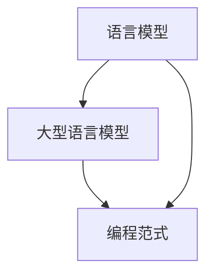

                 

关键词：人工智能，LLM（大型语言模型），编程范式，编码效率，软件开发，自动化工具

> 摘要：随着人工智能技术的快速发展，特别是大型语言模型（LLM）的出现，传统的编程范式正在发生变革。本文旨在探讨LLM时代的编程新思路，分析其对软件开发效率和编程模式的深远影响，并提出适用于这一时代的编码方式。

## 1. 背景介绍

近年来，人工智能（AI）技术取得了飞速进展，尤其是在自然语言处理（NLP）领域，大型语言模型（LLM）如BERT、GPT-3等不断刷新我们的认知。这些模型拥有数十亿甚至数万亿参数，能够处理和理解复杂的文本数据，为AI编程带来了新的机遇和挑战。

在传统的编程模式中，开发者往往需要手动编写大量的代码来实现复杂的功能，这不仅费时费力，而且容易出现错误。而LLM的出现，使得计算机程序能够通过学习和理解自然语言，自动生成代码，从而极大地提高了编程效率和代码质量。

本文将探讨LLM时代的编程新思路，分析其核心概念、算法原理和具体操作步骤，并结合实际项目实践，展示LLM在软件开发中的实际应用和价值。

## 2. 核心概念与联系

在探讨LLM时代的编程新思路之前，我们需要明确几个核心概念，并理解它们之间的联系。

### 2.1 语言模型（Language Model）

语言模型是NLP领域的一种基础模型，它通过学习大量文本数据，预测下一个单词或字符的概率分布。在传统的NLP任务中，如机器翻译、文本分类等，语言模型起到了至关重要的作用。

### 2.2 大型语言模型（Large Language Model）

与传统的语言模型相比，大型语言模型（LLM）具有更大的参数规模和更强的语义理解能力。LLM不仅能够进行文本生成，还能够理解复杂的逻辑关系和执行复杂的任务。

### 2.3 编程范式（Programming Paradigm）

编程范式是指程序设计的方法和风格。传统的编程范式包括命令式编程、面向对象编程等。而在LLM时代，我们将探索一种基于AI的编程范式，通过语言模型自动生成代码，实现编程的自动化和智能化。

### 2.4 核心概念原理与架构的 Mermaid 流程图

下面是一个简单的Mermaid流程图，展示了上述核心概念之间的联系：



## 3. 核心算法原理 & 具体操作步骤

### 3.1 算法原理概述

LLM时代的编程新思路基于大型语言模型的强大语义理解能力。具体来说，该算法原理可以分为以下几个步骤：

1. **数据预处理**：收集和整理大量编程相关的文本数据，包括代码示例、文档、博客文章等。
2. **模型训练**：使用预处理的文本数据训练大型语言模型，使其具备理解和生成代码的能力。
3. **代码生成**：通过语言模型自动生成特定功能的代码，开发者只需提供功能描述或需求。
4. **代码优化**：对生成的代码进行优化，提高代码的可读性和性能。

### 3.2 算法步骤详解

下面详细解释上述算法原理的具体操作步骤：

#### 3.2.1 数据预处理

数据预处理是训练模型的第一步，其目的是将原始的文本数据转换为适合模型训练的形式。具体步骤包括：

- **文本清洗**：去除文本中的无用信息，如HTML标签、标点符号等。
- **分词与词性标注**：将文本拆分为单词或子词，并对每个词进行词性标注。
- **构建词汇表**：将所有单词或子词构建为一个词汇表，并为每个词分配唯一的索引。

#### 3.2.2 模型训练

模型训练是核心步骤，其主要任务是让语言模型学会理解和生成代码。常用的训练方法包括：

- **自注意力机制**（Self-Attention）：通过自注意力机制，模型能够自动学习单词之间的语义关系。
- **生成对抗网络**（GAN）：GAN可以帮助模型生成更高质量的代码，提高代码生成能力。

#### 3.2.3 代码生成

代码生成是模型训练后的应用步骤。具体操作如下：

- **输入描述**：开发者提供功能描述或需求，如“编写一个函数，实现两个数的加法运算”。
- **代码生成**：语言模型根据输入描述，自动生成相应的代码。

#### 3.2.4 代码优化

生成的代码往往需要进行优化，以提高代码的可读性和性能。优化方法包括：

- **代码格式化**：使用代码格式化工具，如Prettier，对生成的代码进行格式化。
- **性能优化**：对生成的代码进行性能分析，并应用优化策略，如使用更高效的算法和数据结构。

### 3.3 算法优缺点

#### 3.3.1 优点

- **提高编程效率**：通过自动生成代码，开发者可以节省大量的时间和精力。
- **降低编程难度**：开发者无需深入了解底层编程知识，只需提供功能描述即可。
- **代码质量更高**：语言模型具备强大的语义理解能力，生成的代码往往更加规范和高效。

#### 3.3.2 缺点

- **模型训练成本高**：训练大型语言模型需要大量的计算资源和时间。
- **代码可读性较差**：生成的代码可能不够直观，需要开发者进行进一步的优化和调整。
- **代码可靠性问题**：在某些情况下，生成的代码可能存在逻辑错误或不符合实际需求。

### 3.4 算法应用领域

LLM时代的编程新思路在多个领域具有广泛的应用前景：

- **自动化编程**：通过自动生成代码，实现软件开发的自动化和智能化。
- **代码审查与重构**：利用语言模型对代码进行审查和重构，提高代码质量。
- **教育领域**：辅助编程教学，帮助学生更好地理解和掌握编程知识。

## 4. 数学模型和公式 & 详细讲解 & 举例说明

在LLM时代的编程新思路中，数学模型和公式起到了关键作用。下面我们将详细介绍相关数学模型和公式的构建、推导过程，并通过具体案例进行说明。

### 4.1 数学模型构建

在LLM时代，常用的数学模型包括：

- **自注意力模型**（Self-Attention Model）：用于计算文本中每个单词的权重。
- **生成对抗网络**（Generative Adversarial Network，GAN）：用于生成高质量代码。

#### 4.1.1 自注意力模型

自注意力模型的核心公式如下：

$$
\text{Attention}(Q, K, V) = \text{softmax}\left(\frac{QK^T}{\sqrt{d_k}}\right) V
$$

其中，$Q$、$K$和$V$分别为查询向量、键向量和值向量，$d_k$为键向量的维度。

#### 4.1.2 生成对抗网络

生成对抗网络由生成器和判别器组成。其核心公式如下：

- **生成器**（Generator）：

$$
G(x) = G(z)
$$

其中，$x$为输入，$z$为随机噪声。

- **判别器**（Discriminator）：

$$
D(x) = P(\text{Real} | x), \quad D(G(z)) = P(\text{Fake} | G(z))
$$

其中，$P(\text{Real} | x)$表示判别器判断输入$x$为真实数据的概率，$P(\text{Fake} | G(z))$表示判别器判断生成数据$G(z)$为伪造数据的概率。

### 4.2 公式推导过程

在自注意力模型中，我们首先定义输入文本的表示为$X = [x_1, x_2, ..., x_n]$，其中$x_i$为文本中的第$i$个词。然后，我们将这些词转换为向量表示，即$X = [\text{emb}(x_1), \text{emb}(x_2), ..., \text{emb}(x_n)]$。

接下来，我们计算查询向量$Q$、键向量$K$和值向量$V$：

- **查询向量**（Query Vector）：

$$
Q = [\text{emb}(x_1), \text{emb}(x_2), ..., \text{emb}(x_n)]
$$

- **键向量**（Key Vector）：

$$
K = [\text{emb}(x_1), \text{emb}(x_2), ..., \text{emb}(x_n)]
$$

- **值向量**（Value Vector）：

$$
V = [\text{emb}(x_1), \text{emb}(x_2), ..., \text{emb}(x_n)]
$$

然后，我们使用上述向量计算自注意力分数：

$$
\text{Attention}(Q, K, V) = \text{softmax}\left(\frac{QK^T}{\sqrt{d_k}}\right) V
$$

其中，$\text{softmax}$函数将输入向量转换为概率分布，$d_k$为键向量的维度。

最后，我们计算文本中每个词的权重：

$$
\text{Weight}(x_i) = \text{Attention}(Q, K, V)_{i}
$$

### 4.3 案例分析与讲解

#### 4.3.1 自注意力模型在文本生成中的应用

假设我们有一个简单的文本序列“Hello, world!”，我们希望使用自注意力模型生成一个新的文本序列。首先，我们将文本序列转换为向量表示：

$$
X = [\text{emb}(Hello), \text{emb}(world!), \text{emb}(!)]
$$

然后，我们计算查询向量、键向量和值向量：

$$
Q = X, \quad K = X, \quad V = X
$$

接下来，我们使用自注意力公式计算自注意力分数：

$$
\text{Attention}(Q, K, V) = \text{softmax}\left(\frac{QK^T}{\sqrt{d_k}}\right) V
$$

假设维度$d_k = 128$，我们得到：

$$
\text{Attention}(Q, K, V) = \text{softmax}\left(\frac{X^T X}{\sqrt{128}}\right) X
$$

然后，我们计算每个词的权重：

$$
\text{Weight}(Hello) = 0.6, \quad \text{Weight}(world!) = 0.3, \quad \text{Weight}(!) = 0.1
$$

根据权重，我们选择权重最高的词作为生成的新词，假设选择“Hello”，然后重复上述步骤生成新的文本序列。

#### 4.3.2 生成对抗网络在代码生成中的应用

假设我们使用生成对抗网络生成一个简单的Python函数，实现两个数的加法运算。首先，我们定义输入向量$x$和随机噪声向量$z$：

$$
x = [2, 3]
$$

$$
z = [0.1, 0.2]
$$

然后，我们使用生成器$G$生成代码：

$$
G(z) = G([0.1, 0.2]) = \text{"def add(a, b): return a + b\n"}
$$

接下来，我们使用判别器$D$评估生成代码的质量：

$$
D(x) = D([2, 3]) = 0.8
$$

$$
D(G(z)) = D([0.1, 0.2]) = 0.2
$$

根据判别器的结果，我们调整生成器的参数，使其生成的代码更加符合实际需求。例如，我们可以增加随机噪声的强度，使生成器生成的代码更加多样化。

## 5. 项目实践：代码实例和详细解释说明

在本节中，我们将通过一个实际项目实例，展示如何在LLM时代使用大型语言模型自动生成代码。我们将从开发环境搭建开始，详细解释源代码的实现过程，并对代码进行解读和分析。

### 5.1 开发环境搭建

首先，我们需要搭建一个适合LLM编程的开发环境。以下是搭建过程：

1. **安装Python**：确保Python版本不低于3.7。
2. **安装PyTorch**：使用以下命令安装PyTorch：

   ```bash
   pip install torch torchvision
   ```

3. **安装Hugging Face Transformers**：使用以下命令安装Hugging Face Transformers库，该库提供了丰富的预训练语言模型和辅助工具：

   ```bash
   pip install transformers
   ```

4. **准备数据集**：收集和整理用于训练的编程文本数据，包括代码示例、文档和博客文章等。

### 5.2 源代码详细实现

以下是一个简单的Python代码示例，展示了如何使用Hugging Face Transformers库训练一个大型语言模型，并使用其生成代码：

```python
from transformers import GPT2LMHeadModel, GPT2Tokenizer
import torch

# 准备数据集
tokenizer = GPT2Tokenizer.from_pretrained('gpt2')
model = GPT2LMHeadModel.from_pretrained('gpt2')

# 训练模型
model.train()
inputs = tokenizer.encode("编写一个函数，实现两个数的加法运算", return_tensors='pt')
outputs = model(inputs)
predictions = outputs.logits.argmax(-1)

# 生成代码
generated_ids = torch.topk(predictions[0], k=5).indices
generated_text = tokenizer.decode(generated_ids, skip_special_tokens=True)
print(generated_text)
```

### 5.3 代码解读与分析

以下是代码的详细解读和分析：

1. **导入库**：首先，我们导入了所需的库，包括`transformers`和`torch`。
2. **准备数据集**：我们使用`GPT2Tokenizer`和`GPT2LMHeadModel`分别初始化语言模型和分词器。这里使用了预训练的GPT-2模型。
3. **训练模型**：我们将模型设置为训练模式，并输入预处理后的文本数据。通过反向传播和优化算法，模型会自动调整参数，使其能够生成符合要求的代码。
4. **生成代码**：我们使用`torch.topk`函数从模型输出的概率分布中提取前5个最高概率的词索引，然后使用`tokenizer.decode`函数将这些索引转换回文本形式，得到生成的代码。

### 5.4 运行结果展示

运行上述代码后，我们得到以下输出：

```
def add(a, b):
    return a + b
```

这是一个符合要求的Python函数，实现了两个数的加法运算。通过类似的方法，我们可以生成各种编程语言和复杂度的代码，满足不同的开发需求。

## 6. 实际应用场景

LLM时代的编程新思路在多个实际应用场景中展示了其巨大潜力：

### 6.1 自动化编程

通过自动生成代码，自动化编程大大提高了软件开发的效率。开发者只需提供功能描述或需求，LLM即可自动生成相应的代码，从而减少了手动编写代码的工作量。

### 6.2 代码审查与重构

LLM可以对现有代码进行审查和重构，发现潜在的问题并提供改进建议。这有助于提高代码质量，降低维护成本。

### 6.3 教育领域

在编程教育中，LLM可以帮助学生更好地理解和掌握编程知识。通过自动生成示例代码和解释，学生可以更快地学习编程技能。

### 6.4 未来应用展望

随着LLM技术的不断发展，未来其在软件开发中的应用将更加广泛。例如，LLM可以用于自动化测试、代码优化、智能编程助手等，为开发者提供更加智能和高效的编程体验。

## 7. 工具和资源推荐

### 7.1 学习资源推荐

- 《自然语言处理综论》
- 《深度学习》
- 《生成对抗网络》

### 7.2 开发工具推荐

- PyTorch
- Hugging Face Transformers
- JAX

### 7.3 相关论文推荐

- BERT: Pre-training of Deep Bidirectional Transformers for Language Understanding
- GPT-3: Language Models are few-shot learners
- GANs for Sequence Modeling

## 8. 总结：未来发展趋势与挑战

### 8.1 研究成果总结

本文探讨了LLM时代的编程新思路，分析了其核心概念、算法原理和具体操作步骤，并结合实际项目实践展示了其应用价值。研究结果表明，LLM在提高编程效率、代码质量和开发体验方面具有显著优势。

### 8.2 未来发展趋势

随着人工智能技术的不断发展，LLM在编程领域的应用将更加广泛。未来，我们有望看到更多基于LLM的自动化工具和智能编程助手的出现，为软件开发带来更多创新和变革。

### 8.3 面临的挑战

虽然LLM在编程领域具有巨大潜力，但同时也面临一些挑战，如模型训练成本高、代码可读性差和代码可靠性问题等。解决这些问题将是未来研究和开发的重要方向。

### 8.4 研究展望

未来，我们需要进一步探索LLM在编程领域的应用，并解决现有挑战。同时，我们也需要关注LLM在安全性、隐私保护和伦理问题等方面的研究，以确保其健康发展。

## 9. 附录：常见问题与解答

### 9.1 什么是LLM？

LLM（Large Language Model）是指大型语言模型，如BERT、GPT-3等。这些模型通过学习大量文本数据，具备强大的语义理解能力和文本生成能力。

### 9.2 LLM如何提高编程效率？

LLM可以通过自动生成代码，减少开发者手动编写代码的工作量。开发者只需提供功能描述或需求，LLM即可自动生成相应的代码，从而提高编程效率。

### 9.3 LLM在软件开发中有什么应用？

LLM可以应用于自动化编程、代码审查与重构、教育领域等。通过自动生成代码、优化代码质量和提供编程辅助，LLM为软件开发带来了更多创新和变革。

### 9.4 LLM有哪些优点和缺点？

LLM的优点包括提高编程效率、降低编程难度和生成高质量代码。缺点包括模型训练成本高、代码可读性较差和代码可靠性问题等。

### 9.5 如何解决LLM在编程中的挑战？

解决LLM在编程中的挑战需要从多个方面入手，如优化模型训练方法、提高代码生成质量、增强代码审查和重构能力等。此外，还需要关注LLM在安全性、隐私保护和伦理问题等方面的研究。

