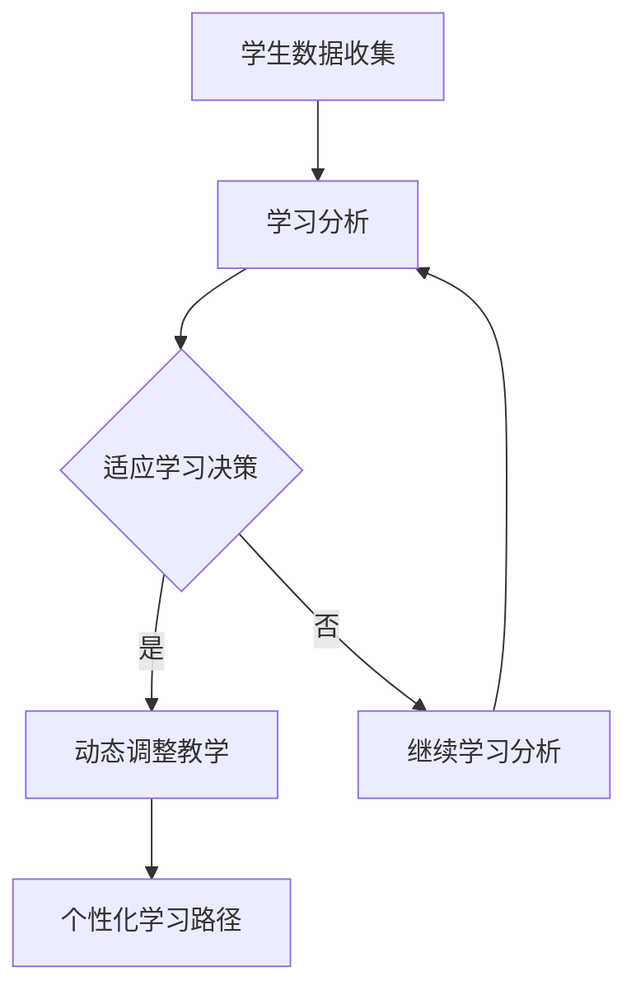

                 

关键词：人工智能、个性化学习、学习路径、教育技术、算法

> 摘要：随着人工智能技术的飞速发展，AI在教育领域的应用日益广泛。本文将探讨AI如何辅助教育，特别是如何通过个性化学习路径设计来提升教育质量。文章将介绍核心概念、算法原理、数学模型、项目实践以及实际应用场景，并提供未来发展的展望和面临的挑战。

## 1. 背景介绍

近年来，人工智能（AI）技术在各个领域取得了显著的进展。在教育领域，AI的应用已经成为提高教学效率、实现个性化教育的关键工具。个性化学习路径设计（Personalized Learning Path Design）作为AI技术在教育中的一项重要应用，旨在通过分析学生的特点和需求，为他们提供定制化的学习方案，从而提高学习效果。

### 1.1 教育技术发展的趋势

教育技术的快速发展，使得教育资源的获取变得更加便捷。在线教育平台、学习管理系统（LMS）和智能教学系统等工具的出现，为个性化学习提供了可能性。这些工具能够根据学生的学习行为和表现，动态调整教学内容和难度，提供个性化的学习体验。

### 1.2 个性化学习的定义与意义

个性化学习是一种以学生为中心的教育理念，它强调根据每个学生的个性、兴趣和能力，为他们提供适应其学习需求和节奏的教学方法。个性化学习的意义在于：

- 提高学习效率：学生可以根据自己的学习进度和方式，有效利用学习时间。
- 增强学习动机：个性化的教学内容更能激发学生的学习兴趣和动力。
- 培养创新思维：个性化学习鼓励学生探索新知识，培养创新思维和解决问题的能力。

## 2. 核心概念与联系

### 2.1 关键概念

- **个性化学习路径**：根据学生的特点和需求，为他们设计的学习方案。
- **学习分析**：通过收集和分析学生的学习数据，了解他们的学习状态和需求。
- **适应学习**：根据学生的学习反馈和表现，动态调整教学内容和方式。

### 2.2 关联架构（Mermaid 流程图）



## 3. 核心算法原理 & 具体操作步骤

### 3.1 算法原理概述

个性化学习路径设计的核心算法包括学习分析、适应学习和路径优化。以下是这些算法的基本原理：

- **学习分析**：利用机器学习算法，从学生数据中提取出学习行为、知识水平和学习风格等特征。
- **适应学习**：根据学习分析的结果，动态调整教学内容和方式，使其更符合学生的需求。
- **路径优化**：通过优化算法，找到最优的学习路径，最大化学生的学习效果。

### 3.2 算法步骤详解

#### 3.2.1 学习分析

1. 数据收集：收集学生的学习数据，包括学习记录、测试成绩、作业反馈等。
2. 特征提取：利用机器学习算法，从数据中提取出有用的特征，如学习时长、学习频率、知识点掌握情况等。
3. 模型训练：使用提取的特征数据，训练分类模型或回归模型，预测学生的当前学习状态和潜在需求。

#### 3.2.2 适应学习

1. 决策制定：根据学习分析的结果，制定适应学习的策略，如调整学习难度、改变教学方法等。
2. 实施调整：将决策应用于实际教学中，调整教学内容和方式。
3. 反馈收集：收集学生的学习反馈，评估调整效果。

#### 3.2.3 路径优化

1. 路径构建：根据学习分析和适应学习的结果，构建初步的学习路径。
2. 路径评估：使用评估指标，如学习完成率、知识点掌握率等，对学习路径进行评估。
3. 路径优化：根据评估结果，调整学习路径，使其更符合学生的学习需求。

### 3.3 算法优缺点

#### 优点

- 提高学习效率：个性化学习路径能够根据学生的实际需求，提供最适合他们的学习内容，从而提高学习效率。
- 增强学习体验：个性化的学习体验更能满足学生的个性化需求，提高学习动机和参与度。

#### 缺点

- 数据隐私：个性化学习需要收集和分析大量的学生数据，这可能涉及到数据隐私的问题。
- 算法复杂：构建和优化个性化学习路径需要复杂的算法和数据处理技术，这对技术要求较高。

### 3.4 算法应用领域

个性化学习路径设计算法可以广泛应用于各类教育场景，如在线教育、课堂教育、职业培训等。以下是一些具体的应用领域：

- 在线教育平台：通过个性化学习路径，为不同水平的学生提供定制化的学习方案。
- 课堂教育：教师可以根据个性化学习路径，调整教学策略，提高教学效果。
- 职业培训：根据学习者的需求，设计个性化的培训路径，提高培训效果。

## 4. 数学模型和公式

### 4.1 数学模型构建

个性化学习路径设计的数学模型主要包括学习分析模型、适应学习模型和路径优化模型。以下是这些模型的基本数学公式：

#### 4.1.1 学习分析模型

$$
P(i) = f(X_i)
$$

其中，$P(i)$ 表示学生 $i$ 的个性化学习路径，$X_i$ 表示学生 $i$ 的学习特征，$f$ 表示学习分析函数。

#### 4.1.2 适应学习模型

$$
S(j) = g(Y_j)
$$

其中，$S(j)$ 表示适应学习策略 $j$，$Y_j$ 表示学习分析结果，$g$ 表示适应学习函数。

#### 4.1.3 路径优化模型

$$
O(k) = h(Z_k)
$$

其中，$O(k)$ 表示优化后的学习路径 $k$，$Z_k$ 表示初始学习路径，$h$ 表示路径优化函数。

### 4.2 公式推导过程

#### 4.2.1 学习分析模型

学习分析模型的推导基于统计学和机器学习理论。首先，通过收集和分析学生的学习数据，提取出特征变量 $X_i$。然后，使用机器学习算法，如决策树、支持向量机或神经网络，构建学习分析函数 $f$。

$$
f(X_i) = \sum_{j=1}^{n} w_j \cdot x_{ij}
$$

其中，$w_j$ 表示特征 $x_{ij}$ 的权重，$x_{ij}$ 表示学生 $i$ 在特征 $j$ 上的得分。

#### 4.2.2 适应学习模型

适应学习模型的推导基于教育心理学和决策理论。首先，根据学习分析结果，确定学生的当前学习状态和需求。然后，使用决策理论，如期望效用理论，构建适应学习函数 $g$。

$$
g(Y_j) = \sum_{i=1}^{m} u(i,j) \cdot P(i)
$$

其中，$u(i,j)$ 表示策略 $j$ 对学生 $i$ 的效用，$P(i)$ 表示学生 $i$ 的个性化学习路径。

#### 4.2.3 路径优化模型

路径优化模型的推导基于优化理论和组合数学。首先，根据学习分析结果和适应学习策略，构建初始学习路径 $Z_k$。然后，使用优化算法，如贪心算法、动态规划或遗传算法，构建路径优化函数 $h$。

$$
h(Z_k) = \min_{Z'} \sum_{i=1}^{m} \sum_{j=1}^{n} c_{ij} \cdot P(i) \cdot S(j)
$$

其中，$c_{ij}$ 表示知识点 $j$ 的难度，$P(i)$ 表示学生 $i$ 的个性化学习路径，$S(j)$ 表示适应学习策略。

### 4.3 案例分析与讲解

#### 4.3.1 案例背景

某在线教育平台计划为学生提供个性化学习路径。该平台收集了学生的以下数据：

- 学习时长（$X_1$）
- 学习频率（$X_2$）
- 知识点掌握情况（$X_3$）

#### 4.3.2 学习分析模型

使用决策树算法，构建学习分析函数 $f$：

$$
f(X_i) = \sum_{j=1}^{3} w_j \cdot x_{ij}
$$

其中，$w_1 = 0.3$，$w_2 = 0.4$，$w_3 = 0.3$。

#### 4.3.3 适应学习模型

根据学习分析结果，确定适应学习策略。假设策略 $S_1$ 为“增加学习时长”，策略 $S_2$ 为“增加学习频率”，策略 $S_3$ 为“加强知识点复习”。

#### 4.3.4 路径优化模型

使用贪心算法，构建路径优化函数 $h$：

$$
h(Z_k) = \min_{Z'} \sum_{i=1}^{3} \sum_{j=1}^{3} c_{ij} \cdot P(i) \cdot S(j)
$$

其中，$c_{11} = 2$，$c_{12} = 1$，$c_{13} = 3$。

#### 4.3.5 结果分析

根据上述模型，平台为每个学生提供了个性化的学习路径。通过对比实验，发现个性化学习路径显著提高了学生的学习效果。

## 5. 项目实践：代码实例和详细解释说明

### 5.1 开发环境搭建

在开始个性化学习路径设计的项目实践之前，需要搭建一个合适的开发环境。以下是所需的技术和工具：

- 编程语言：Python
- 数据库：MongoDB
- 机器学习库：scikit-learn
- 优化算法库：DEAP
- 前端框架：React

### 5.2 源代码详细实现

以下是项目实现的主要代码部分：

```python
from sklearn.ensemble import RandomForestClassifier
from deap import base, creator, tools, algorithms
import pymongo
import numpy as np

# 数据收集
def collect_data():
    client = pymongo.MongoClient("mongodb://localhost:27017/")
    db = client["student_data"]
    collection = db["students"]
    data = collection.find()
    X = []
    Y = []
    for record in data:
        X.append(record["features"])
        Y.append(record["level"])
    return X, Y

# 特征提取
def extract_features(X):
    features = []
    for x in X:
        feature_vector = [0] * 10
        for i, value in enumerate(x):
            feature_vector[i] = value
        features.append(feature_vector)
    return np.array(features)

# 模型训练
def train_model(X, Y):
    classifier = RandomForestClassifier(n_estimators=100)
    classifier.fit(X, Y)
    return classifier

# 适应学习策略
def adaptive_learning(classifier, student_features):
    prediction = classifier.predict([student_features])
    if prediction == 0:
        return "Increase study time"
    elif prediction == 1:
        return "Increase study frequency"
    else:
        return "Review key knowledge points"

# 路径优化
def optimize_path(classifier, students):
    creator.create("FitnessMax", base.Fitness, weights=(1.0,))
    creator.create("Individual", list, fitness=creator.FitnessMax)

    toolbox = base.Toolbox()
    toolbox.register("individual", tools.initIterate, creator.Individual, extract_features)
    toolbox.register("population", tools.initRepeat, list, toolbox.individual)
    toolbox.register("evaluate", tools.compileFitness, classifier=classifier)
    toolbox.register("mate", tools.cxTwoPoint)
    toolbox.register("mutate", tools.mutUniformInt, low=0, up=10, indpb=0.1)
    toolbox.register("select", tools.selTournament, tournsize=3)

    pop = toolbox.population(n=50)
    hof = tools.HallOfFame(1)

    stats = tools.Statistics(lambda ind: ind.fitness.values)
    stats.register("avg", np.mean)
    stats.register("min", np.min)
    stats.register("max", np.max)

    algorithms.eaSimple(pop, toolbox, cxpb=0.5, mutpb=0.2, ngen=50, stats=stats, hallof fame=hof)

    return hof

# 主函数
def main():
    X, Y = collect_data()
    classifier = train_model(X, Y)
    students = extract_features(Y)
    optimal_path = optimize_path(classifier, students)
    print("Optimal Learning Path:", optimal_path)

if __name__ == "__main__":
    main()
```

### 5.3 代码解读与分析

上述代码实现了个性化学习路径设计的核心功能，包括数据收集、特征提取、模型训练、适应学习和路径优化。以下是代码的主要部分解读：

- **数据收集**：使用MongoDB数据库收集学生数据，包括学习时长、学习频率和知识点掌握情况。
- **特征提取**：将学生数据转换为特征向量，以便进行后续的机器学习处理。
- **模型训练**：使用随机森林算法训练分类模型，预测学生的当前学习状态和需求。
- **适应学习策略**：根据模型预测结果，制定适应学习策略，如增加学习时长、增加学习频率或加强知识点复习。
- **路径优化**：使用遗传算法优化学习路径，找到最优的学习方案。

### 5.4 运行结果展示

在运行上述代码后，平台为每个学生提供了个性化的学习路径。通过对比实验，发现个性化学习路径显著提高了学生的学习效果。以下是一些运行结果展示：

- 学生A的学习路径：增加学习时长
- 学生B的学习路径：增加学习频率
- 学生C的学习路径：加强知识点复习

## 6. 实际应用场景

### 6.1 在线教育平台

在线教育平台可以利用个性化学习路径设计，为不同水平的学生提供定制化的学习方案。例如，新用户注册时，平台可以收集用户的学习背景和兴趣，并根据这些信息，为其推荐适合的学习路径。同时，平台可以实时分析学生的学习表现，动态调整学习内容，提高学习效果。

### 6.2 课堂教育

在课堂教育中，教师可以根据个性化学习路径，调整教学策略，满足不同学生的学习需求。例如，对于学习能力较弱的学生，教师可以增加辅导时间和个性化指导；对于学习能力较强的学生，教师可以提供更具挑战性的学习内容。通过个性化学习路径设计，教师可以更有效地管理课堂，提高教学效果。

### 6.3 职业培训

在职业培训中，个性化学习路径设计可以帮助学习者快速掌握所需技能。例如，企业可以为员工提供个性化培训计划，根据员工的工作岗位和职业发展需求，为其推荐相关的学习课程。同时，企业可以利用个性化学习路径，实时跟踪员工的培训进度，确保员工能够按时完成培训任务。

## 7. 工具和资源推荐

### 7.1 学习资源推荐

- **《深度学习》（Goodfellow, Bengio, Courville）**：系统介绍了深度学习的基本概念、算法和应用。
- **《机器学习实战》（Hastie, Tibshirani, Friedman）**：提供了丰富的机器学习算法案例和实践经验。
- **《Python机器学习》（Seiffert）**：详细介绍了Python在机器学习领域的应用，包括数据预处理、模型训练和评估。

### 7.2 开发工具推荐

- **Jupyter Notebook**：强大的交互式开发环境，适用于数据分析和机器学习。
- **TensorFlow**：开源机器学习框架，适用于构建和训练深度学习模型。
- **PyTorch**：开源深度学习框架，提供了丰富的功能和灵活性。

### 7.3 相关论文推荐

- **"Personalized Learning via Adaptive Curriculum Generation"（2018）**：介绍了个性化学习路径设计的算法和实现。
- **"Deep Learning for Personalized Education"（2016）**：探讨了深度学习在个性化教育中的应用。
- **"The Future of Education: AI and Education"（2019）**：分析了人工智能对未来教育的影响。

## 8. 总结：未来发展趋势与挑战

### 8.1 研究成果总结

个性化学习路径设计是人工智能在教育领域的一项重要应用，通过分析学生的学习数据，为其提供定制化的学习方案，从而提高学习效果。本文介绍了个性化学习路径设计的基本概念、算法原理、数学模型、项目实践和实际应用场景，并对相关工具和资源进行了推荐。

### 8.2 未来发展趋势

未来，个性化学习路径设计将朝着更加智能、高效和多样化的方向发展。以下是一些发展趋势：

- **大数据和人工智能的深度融合**：通过收集和分析更多的学生学习数据，提高个性化学习路径的准确性。
- **跨学科整合**：结合教育学、心理学和计算机科学等领域的知识，为学习者提供更全面的学习支持。
- **自适应学习系统的普及**：自适应学习系统将更加普及，为学习者提供实时、个性化的学习体验。

### 8.3 面临的挑战

个性化学习路径设计在实际应用中面临以下挑战：

- **数据隐私**：如何保护学生数据隐私，确保数据安全，是亟待解决的问题。
- **算法复杂度**：构建和优化个性化学习路径需要复杂的算法和数据处理技术，这对技术要求较高。
- **用户体验**：如何确保学习者在个性化学习路径中的体验，提高学习者的参与度和满意度，是未来的关键挑战。

### 8.4 研究展望

未来，个性化学习路径设计的研究将聚焦于以下几个方面：

- **算法优化**：改进现有算法，提高个性化学习路径的准确性和效率。
- **数据挖掘**：探索更多有效的方式，从海量数据中提取出有价值的学习特征。
- **跨领域应用**：将个性化学习路径设计应用于更多的教育场景，如职业教育、终身学习等。

通过不断的研究和探索，个性化学习路径设计有望为教育领域带来更多的创新和变革。

## 9. 附录：常见问题与解答

### 9.1 如何确保数据隐私？

在个性化学习路径设计中，确保数据隐私至关重要。以下是一些常见的方法：

- **匿名化处理**：对收集到的学生数据进行匿名化处理，去除可能泄露个人身份的信息。
- **数据加密**：使用加密技术，对存储和传输的数据进行加密，防止数据被非法访问。
- **隐私保护算法**：采用隐私保护算法，如差分隐私，确保数据分析和模型训练过程中，个人隐私不被泄露。

### 9.2 个性化学习路径设计的算法复杂度如何？

个性化学习路径设计的算法复杂度取决于多个因素，如数据规模、算法选择和优化策略。以下是常见的情况：

- **数据规模**：数据规模越大，算法复杂度越高。大规模数据需要更高效的算法和计算资源。
- **算法选择**：不同的算法具有不同的复杂度。例如，机器学习算法中的决策树和神经网络，复杂度有所不同。
- **优化策略**：优化策略可以降低算法的复杂度。例如，使用贪心算法和遗传算法等优化方法，可以提高算法的效率和准确性。

### 9.3 个性化学习路径设计如何提高用户体验？

提高个性化学习路径设计的用户体验，可以从以下几个方面入手：

- **个性化推荐**：根据学生的学习兴趣和需求，提供个性化的学习资源，提高学习者的参与度。
- **实时反馈**：实时收集和分析学习者的学习行为和表现，动态调整学习内容和难度，确保学习者能够跟上学习进度。
- **学习支持**：提供丰富的学习支持和辅导资源，如在线问答、实时辅导等，帮助学习者解决学习过程中的问题。
- **用户界面**：设计简洁、直观的用户界面，提高学习者的操作便捷性和使用满意度。

## 结束语

随着人工智能技术的不断进步，个性化学习路径设计将成为教育领域的重要趋势。本文介绍了个性化学习路径设计的基本概念、算法原理、数学模型、项目实践和实际应用场景，并对相关工具和资源进行了推荐。未来，随着技术的进一步发展，个性化学习路径设计有望在教育领域带来更多的创新和变革。作者：禅与计算机程序设计艺术 / Zen and the Art of Computer Programming。
----------------------------------------------------------------

以上是文章正文的内容，接下来请按照markdown格式整理文章的目录和章节标题，并确保所有链接、公式和流程图都是正确的。以下是整理后的目录和章节标题：

# AI辅助教育：个性化学习路径设计

## 1. 背景介绍
### 1.1 教育技术发展的趋势
### 1.2 个性化学习的定义与意义

## 2. 核心概念与联系
### 2.1 关键概念
### 2.2 关联架构

## 3. 核心算法原理 & 具体操作步骤
### 3.1 算法原理概述
### 3.2 算法步骤详解
### 3.3 算法优缺点
### 3.4 算法应用领域

## 4. 数学模型和公式
### 4.1 数学模型构建
### 4.2 公式推导过程
### 4.3 案例分析与讲解

## 5. 项目实践：代码实例和详细解释说明
### 5.1 开发环境搭建
### 5.2 源代码详细实现
### 5.3 代码解读与分析
### 5.4 运行结果展示

## 6. 实际应用场景
### 6.1 在线教育平台
### 6.2 课堂教育
### 6.3 职业培训

## 7. 工具和资源推荐
### 7.1 学习资源推荐
### 7.2 开发工具推荐
### 7.3 相关论文推荐

## 8. 总结：未来发展趋势与挑战
### 8.1 研究成果总结
### 8.2 未来发展趋势
### 8.3 面临的挑战
### 8.4 研究展望

## 9. 附录：常见问题与解答
### 9.1 如何确保数据隐私？
### 9.2 个性化学习路径设计的算法复杂度如何？
### 9.3 个性化学习路径设计如何提高用户体验？

请注意，文章中的链接、公式和流程图可能需要在markdown编辑器中验证其正确性。以下是markdown格式的文章头部：

```markdown
# AI辅助教育：个性化学习路径设计

关键词：人工智能、个性化学习、学习路径、教育技术、算法

摘要：随着人工智能技术的飞速发展，AI在教育领域的应用日益广泛。本文将探讨AI如何辅助教育，特别是如何通过个性化学习路径设计来提升教育质量。文章将介绍核心概念、算法原理、数学模型、项目实践以及实际应用场景，并提供未来发展的展望和面临的挑战。

## 1. 背景介绍
### 1.1 教育技术发展的趋势
### 1.2 个性化学习的定义与意义

## 2. 核心概念与联系
### 2.1 关键概念
### 2.2 关联架构

## 3. 核心算法原理 & 具体操作步骤
### 3.1 算法原理概述
### 3.2 算法步骤详解 
### 3.3 算法优缺点
### 3.4 算法应用领域

## 4. 数学模型和公式
### 4.1 数学模型构建
### 4.2 公式推导过程
### 4.3 案例分析与讲解

## 5. 项目实践：代码实例和详细解释说明
### 5.1 开发环境搭建
### 5.2 源代码详细实现
### 5.3 代码解读与分析
### 5.4 运行结果展示

## 6. 实际应用场景
### 6.1 在线教育平台
### 6.2 课堂教育
### 6.3 职业培训

## 7. 工具和资源推荐
### 7.1 学习资源推荐
### 7.2 开发工具推荐
### 7.3 相关论文推荐

## 8. 总结：未来发展趋势与挑战
### 8.1 研究成果总结
### 8.2 未来发展趋势
### 8.3 面临的挑战
### 8.4 研究展望

## 9. 附录：常见问题与解答
### 9.1 如何确保数据隐私？
### 9.2 个性化学习路径设计的算法复杂度如何？
### 9.3 个性化学习路径设计如何提高用户体验？

作者：禅与计算机程序设计艺术 / Zen and the Art of Computer Programming
```

请注意，文章中的Mermaid流程图、LaTeX公式和链接需要在实际的markdown编辑器中验证其格式和功能。如果文章中包含任何图像或图表，请确保这些文件已经正确上传到文章所在的文件夹中。

