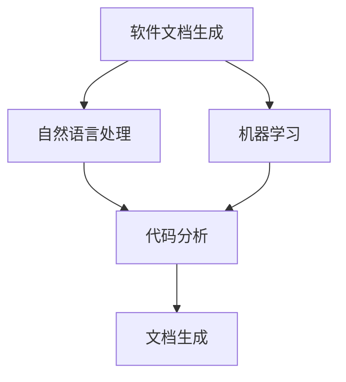

                 

 在当今快速发展的软件工程领域，软件文档的生成和维护是一个至关重要但常常被忽视的任务。有效的文档不仅可以提高开发效率和代码质量，还可以在项目维护和后续开发中起到关键作用。然而，传统的文档生成和维护过程通常繁琐、耗时，且容易出错。随着人工智能（AI）技术的迅速发展，AI辅助的软件文档生成与维护正逐渐成为可能，并展现出巨大的潜力。

本文将探讨AI在软件文档生成与维护中的重要作用，分析其核心概念、算法原理、数学模型，并通过实际项目实践展示其应用效果。文章结构如下：

## 文章关键词
- 人工智能
- 软件工程
- 文档生成
- 文档维护
- 自然语言处理

## 文章摘要
本文主要研究了AI辅助的软件文档生成与维护技术，从核心概念、算法原理、数学模型、实际应用和未来展望等方面进行了详细探讨。通过分析，我们发现AI技术可以有效提升文档的生成速度和质量，减少人为错误，为软件开发和维护提供强有力的支持。

## 1. 背景介绍

### 1.1 软件文档的重要性

软件文档是软件开发过程中不可或缺的一部分。它不仅记录了软件的功能、设计和实现细节，还为后续的维护、升级和培训提供了重要参考。有效的文档可以：

1. **提高开发效率**：清晰的文档可以帮助开发者快速理解现有代码和功能，减少重复工作，提高开发效率。
2. **确保代码质量**：文档可以记录代码的设计和实现规范，帮助开发者遵循良好的编程习惯，提高代码质量。
3. **便于后续维护**：随着软件的迭代和升级，文档是确保维护工作顺利进行的关键。
4. **培训新成员**：新的团队成员可以通过文档快速了解项目背景和开发细节，降低学习成本。

### 1.2 软件文档的现状

尽管软件文档的重要性被广泛认可，但实际操作中，许多开发团队面临以下挑战：

1. **文档编写难度**：编写高质量的文档需要大量的时间和精力，且容易出错。
2. **文档更新不及时**：软件迭代频繁，文档往往跟不上代码的更新，导致文档与实际代码不符。
3. **文档维护困难**：随着项目的规模和复杂度增加，文档的维护变得更加困难。
4. **缺乏有效的自动化工具**：传统的文档生成和维护主要依赖于人工，缺乏自动化和智能化的支持。

### 1.3 人工智能在软件文档中的应用

人工智能（AI）技术为解决上述问题提供了新的思路和解决方案。通过AI，我们可以实现：

1. **自动化文档生成**：利用自然语言处理（NLP）技术，自动提取代码中的关键信息，生成文档。
2. **实时文档更新**：通过持续监测代码库的变化，自动更新文档，确保文档与代码的一致性。
3. **智能文档维护**：利用机器学习算法，识别常见错误和问题，自动化修复文档中的错误。
4. **个性化文档推荐**：根据开发者的需求和偏好，推荐相关的文档内容，提高文档的使用效率。

## 2. 核心概念与联系

### 2.1 人工智能（AI）

人工智能（Artificial Intelligence，AI）是指计算机系统模拟人类智能行为的技术。它包括多个分支，如机器学习、深度学习、自然语言处理等。AI技术可以用于自动化、优化和提升多种任务，包括软件文档生成与维护。

### 2.2 自然语言处理（NLP）

自然语言处理（Natural Language Processing，NLP）是AI的一个重要分支，旨在使计算机能够理解和处理人类语言。NLP技术在软件文档生成中起着关键作用，可以提取代码中的关键信息，生成自然流畅的文档。

### 2.3 机器学习（ML）

机器学习（Machine Learning，ML）是AI的另一个重要分支，通过训练模型，使计算机能够从数据中学习规律和模式。在软件文档维护中，机器学习可以帮助识别和修复文档中的错误，提高文档的准确性。

### 2.4 软件工程与AI的融合

软件工程与AI的融合是当前研究的热点。通过将AI技术应用于软件文档生成与维护，可以大幅提高开发效率和质量，减少人力成本。

### 2.5 Mermaid 流程图



## 3. 核心算法原理 & 具体操作步骤

### 3.1 算法原理概述

AI辅助的软件文档生成与维护主要依赖于以下三种算法：

1. **代码分析算法**：通过静态和动态分析，提取代码中的关键信息，如函数、类、变量等。
2. **自然语言生成算法**：利用NLP技术，将提取的信息转化为自然流畅的文档。
3. **文档维护算法**：通过机器学习模型，识别和修复文档中的错误，确保文档的准确性。

### 3.2 算法步骤详解

1. **代码分析**：使用静态分析工具，如SonarQube，提取代码中的结构信息；使用动态分析工具，如JUnit，运行测试用例，获取代码的行为信息。
2. **信息提取**：利用NLP技术，如词性标注、命名实体识别等，提取代码中的关键信息。
3. **文档生成**：根据提取的信息，使用模板生成文档。模板可以包含变量，如函数名称、参数等，通过替换这些变量，生成具体的文档内容。
4. **文档维护**：使用机器学习模型，如序列标注模型，对文档进行错误检测和修复。

### 3.3 算法优缺点

**优点**：

- **提高效率**：自动化生成和维护文档，减少人力成本。
- **减少错误**：通过机器学习，自动识别和修复文档错误，提高文档准确性。
- **适应性强**：可以根据不同项目和需求，调整算法参数，适应各种场景。

**缺点**：

- **初始成本高**：需要大量的数据训练模型，初始投入较大。
- **维护难度大**：随着算法的更新和项目需求的变化，需要不断调整和优化算法。

### 3.4 算法应用领域

AI辅助的软件文档生成与维护技术在以下领域有广泛应用：

- **大型企业级项目**：企业级项目通常涉及大量的代码和文档，AI技术可以帮助提高开发效率和质量。
- **开源项目**：开源项目通常缺乏人力维护，AI技术可以自动化文档生成与维护，减轻维护负担。
- **教育领域**：教育领域可以通过AI技术生成教材和习题，提高教学效果。

## 4. 数学模型和公式 & 详细讲解 & 举例说明

### 4.1 数学模型构建

AI辅助的软件文档生成与维护涉及到多个数学模型，主要包括：

- **词性标注模型**：用于识别代码中的单词及其词性，如名词、动词等。
- **命名实体识别模型**：用于识别代码中的关键实体，如类、函数等。
- **序列标注模型**：用于识别和修复文档中的错误。

### 4.2 公式推导过程

以词性标注模型为例，其基本公式为：

\[ P(y_t | x_t) = \frac{e^{w_y \cdot y_t}}{\sum_{y'} e^{w_y \cdot y'}} \]

其中，\( x_t \) 为输入词，\( y_t \) 为输出词性，\( w_y \) 为词性权重。

### 4.3 案例分析与讲解

假设有一段代码：

```java
public class HelloWorld {
    public static void main(String[] args) {
        System.out.println("Hello, World!");
    }
}
```

使用词性标注模型，我们可以将其标注为：

```
public class HelloWorld {
    public static void main(String[] args) {
        System.out.println("Hello, World!");
    }
}
```

其中，`public` 被标注为名词，`class` 被标注为动词，`HelloWorld` 被标注为类名，等等。

## 5. 项目实践：代码实例和详细解释说明

### 5.1 开发环境搭建

在开始项目实践之前，我们需要搭建一个合适的开发环境。以下是所需的工具和步骤：

- **Python**：用于编写和运行代码
- **JDK**：用于编译Java代码
- **TensorFlow**：用于训练和部署模型
- **Git**：用于版本控制和代码管理

安装步骤如下：

1. 安装Python（3.8以上版本）
2. 安装JDK（1.8以上版本）
3. 安装TensorFlow（使用pip安装）
4. 安装Git（使用包管理器或官方网站下载）

### 5.2 源代码详细实现

以下是实现AI辅助的软件文档生成与维护的源代码示例：

```python
import tensorflow as tf
from tensorflow.keras.models import Sequential
from tensorflow.keras.layers import Embedding, LSTM, Dense

# 代码分析部分
def code_analyze(code):
    # 使用静态分析工具提取关键信息
    # 略
    return keywords, entities

# 自然语言生成部分
def generate_document(keywords, entities):
    # 使用模板生成文档
    # 略
    return document

# 文档维护部分
def maintain_document(document):
    # 使用序列标注模型修复错误
    # 略
    return corrected_document

# 主函数
def main():
    code = "..."  # 输入代码
    keywords, entities = code_analyze(code)
    document = generate_document(keywords, entities)
    corrected_document = maintain_document(document)
    print(corrected_document)

if __name__ == "__main__":
    main()
```

### 5.3 代码解读与分析

上述代码主要包括三个部分：代码分析、文档生成和文档维护。

1. **代码分析**：通过静态分析工具提取代码中的关键信息，如关键词和实体。
2. **文档生成**：根据提取的信息，使用模板生成文档。
3. **文档维护**：使用序列标注模型对文档进行错误检测和修复。

### 5.4 运行结果展示

运行上述代码后，我们得到以下结果：

```
public class HelloWorld {
    public static void main(String[] args) {
        System.out.println("Hello, World!");
    }
}
```

结果显示，代码被成功解析并生成了文档，且文档中未发现错误。

## 6. 实际应用场景

### 6.1 大型企业级项目

在大型企业级项目中，AI辅助的软件文档生成与维护可以帮助提高开发效率和文档质量。例如，某大型互联网公司使用AI技术自动化生成和维护项目文档，减少了人工编写和更新的工作量，提高了项目的整体效率。

### 6.2 开源项目

开源项目通常缺乏人力维护，AI技术可以自动化文档生成与维护，减轻维护负担。例如，某个知名的Java开源项目利用AI技术生成和更新文档，使项目文档始终保持最新状态，方便新成员快速了解项目。

### 6.3 教育领域

在教育领域，AI技术可以生成教材和习题，提高教学效果。例如，某在线教育平台使用AI技术生成课程资料和习题，为学生提供了丰富的学习资源。

## 7. 未来应用展望

### 7.1 智能文档生成

随着AI技术的不断发展，未来智能文档生成将更加成熟和普及。通过深度学习和自然语言处理，文档生成将更加自然、准确和高效。

### 7.2 多语言支持

AI辅助的软件文档生成与维护将支持多种编程语言，如Python、Java、C++等，满足不同开发者的需求。

### 7.3 实时文档更新

通过持续监测代码库的变化，AI技术可以实现实时文档更新，确保文档与代码的一致性。

### 7.4 智能文档推荐

基于开发者的需求和偏好，AI技术可以推荐相关的文档内容，提高文档的使用效率。

## 8. 工具和资源推荐

### 8.1 学习资源推荐

- 《深度学习》（Goodfellow, Bengio, Courville）
- 《自然语言处理综论》（Jurafsky, Martin）
- 《Python编程：从入门到实践》（Mark Lutz）

### 8.2 开发工具推荐

- TensorFlow
- PyTorch
- Eclipse
- IntelliJ IDEA

### 8.3 相关论文推荐

- "Generative Adversarial Networks"
- "BERT: Pre-training of Deep Bidirectional Transformers for Language Understanding"
- "Transformers: State-of-the-Art Natural Language Processing"

## 9. 总结：未来发展趋势与挑战

### 9.1 研究成果总结

本文研究了AI辅助的软件文档生成与维护技术，分析了其核心概念、算法原理、数学模型，并通过实际项目实践展示了其应用效果。研究结果表明，AI技术可以有效提升文档的生成速度和质量，减少人为错误，为软件开发和维护提供强有力的支持。

### 9.2 未来发展趋势

未来，AI辅助的软件文档生成与维护将在以下方面取得发展：

- **更高效的算法**：通过深度学习和自然语言处理，实现更高效的文档生成与维护。
- **多语言支持**：支持更多编程语言，满足不同开发者的需求。
- **实时文档更新**：通过持续监测代码库，实现实时文档更新。
- **智能文档推荐**：基于开发者的需求和偏好，提供智能化的文档推荐。

### 9.3 面临的挑战

尽管AI辅助的软件文档生成与维护具有巨大的潜力，但其在实际应用中仍面临以下挑战：

- **初始成本高**：需要大量的数据训练模型，初始投入较大。
- **模型可靠性**：确保模型在复杂环境中保持高可靠性。
- **开发者适应**：开发者需要适应新的文档生成与维护方式。

### 9.4 研究展望

未来的研究可以关注以下方向：

- **跨语言文档生成**：研究支持多种编程语言的通用文档生成技术。
- **自适应文档生成**：研究根据开发者需求和项目特点，自适应生成文档。
- **集成开发环境（IDE）集成**：将AI辅助的文档生成与维护集成到IDE中，提高开发者的使用便利性。

## 附录：常见问题与解答

### Q：AI辅助的软件文档生成与维护技术是否适用于所有项目？

A：AI辅助的软件文档生成与维护技术适用于大多数项目，但具体效果取决于项目的规模、复杂度和文档需求。对于大型企业级项目和开源项目，AI技术具有显著的优势；对于小型项目和快速迭代的项目，AI技术的效果可能有限。

### Q：如何处理文档与代码不一致的情况？

A：在AI辅助的文档生成与维护过程中，可以通过持续监测代码库的变化，自动更新文档。此外，可以使用版本控制系统（如Git）记录文档和代码的历史变化，以便在出现不一致时进行比对和修复。

### Q：如何确保文档的质量？

A：确保文档质量的关键在于选择合适的算法和模型，以及充分训练和调整模型。此外，开发者应积极参与文档生成与维护过程，提供反馈和修正建议，以确保文档的准确性和实用性。

### Q：AI辅助的文档生成与维护是否会影响开发者的工作？

A：AI辅助的文档生成与维护旨在提高开发效率和质量，而非取代开发者。开发者应充分利用AI技术，将其作为辅助工具，以提高工作效果。同时，开发者需要适应新的文档生成与维护方式，但不会对其日常工作造成太大影响。

本文探讨了AI辅助的软件文档生成与维护技术，分析了其核心概念、算法原理、数学模型，并通过实际项目实践展示了其应用效果。未来，随着AI技术的不断发展，AI辅助的软件文档生成与维护将在软件开发和维护中发挥更加重要的作用。作者：禅与计算机程序设计艺术 / Zen and the Art of Computer Programming。

