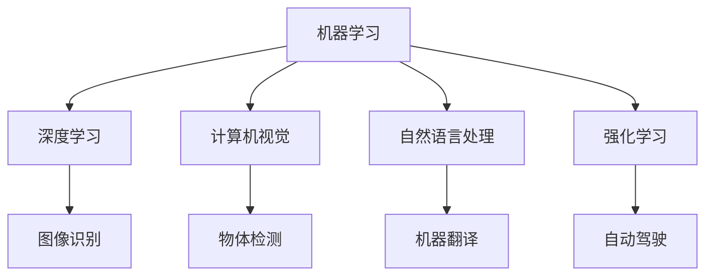

                 

关键词：人工智能、前沿技术、机器学习、深度学习、神经网络、计算机视觉、自然语言处理、强化学习、算法、应用场景、发展趋势、挑战

> 摘要：本文将深入探讨AI领域的前沿技术，包括机器学习、深度学习、计算机视觉、自然语言处理、强化学习等，通过对其核心概念、原理、数学模型、算法应用、项目实践以及未来展望的详细阐述，旨在为读者提供一个全面而清晰的AI技术发展全景。

## 1. 背景介绍

人工智能（AI）作为计算机科学的一个重要分支，经过几十年的发展，已经取得了显著的成果。从早期的规则推理和知识表示，到现代的机器学习和深度学习，AI技术不断演进，逐步渗透到我们的日常生活和各个行业。随着大数据和计算能力的提升，AI技术迎来了前所未有的发展机遇，成为了推动科技进步和社会发展的关键力量。

近年来，AI领域的前沿技术发展迅速，其中机器学习、深度学习、计算机视觉、自然语言处理、强化学习等尤为突出。这些技术不仅在理论研究中取得了重要突破，也在实际应用中展现了巨大的潜力，从自动驾驶、智能客服到医疗诊断、金融分析，AI正在逐步改变我们的世界。

本文将重点介绍这些AI前沿技术的核心概念、原理、应用场景以及未来发展趋势，旨在为读者提供一份全面的技术指南。

## 2. 核心概念与联系

### 2.1. 机器学习

机器学习（Machine Learning，ML）是一种让计算机通过数据学习模式并做出预测或决策的方法。它基于统计学、概率论和优化理论，通过训练模型来提取数据中的特征，从而实现自动化学习。

### 2.2. 深度学习

深度学习（Deep Learning，DL）是机器学习的一个子领域，它使用多层神经网络来模拟人脑的思考方式。深度学习在图像识别、语音识别和自然语言处理等领域取得了显著突破。

### 2.3. 计算机视觉

计算机视觉（Computer Vision，CV）是人工智能的一个分支，旨在使计算机理解和解释数字图像或视频。它广泛应用于人脸识别、物体检测、图像分割和场景理解等领域。

### 2.4. 自然语言处理

自然语言处理（Natural Language Processing，NLP）是AI领域的一个分支，旨在使计算机理解和生成自然语言。它包括语言模型、词向量、命名实体识别、机器翻译和情感分析等技术。

### 2.5. 强化学习

强化学习（Reinforcement Learning，RL）是一种通过试错来学习决策策略的方法。它通过奖励机制来引导模型不断优化其行为，广泛应用于游戏、推荐系统和自动驾驶等领域。

### 2.6. Mermaid 流程图

下面是一个简单的 Mermaid 流程图，展示了这些核心概念之间的联系。



## 3. 核心算法原理 & 具体操作步骤

### 3.1. 算法原理概述

机器学习、深度学习、计算机视觉、自然语言处理和强化学习各自有其独特的算法原理和应用场景。下面我们将对这些算法的原理进行简要概述。

### 3.2. 算法步骤详解

#### 3.2.1. 机器学习

机器学习的基本步骤包括数据收集、数据预处理、模型训练和模型评估。具体操作步骤如下：

1. **数据收集**：从各种来源收集数据，如公开数据集、数据库或传感器数据。
2. **数据预处理**：对收集到的数据清洗、去重、归一化等处理，使其适合模型训练。
3. **模型训练**：选择合适的机器学习算法，如线性回归、决策树、支持向量机等，对预处理后的数据集进行训练。
4. **模型评估**：使用验证集或测试集评估模型的性能，如准确率、召回率、F1值等。

#### 3.2.2. 深度学习

深度学习的基本步骤包括神经网络架构设计、模型训练和模型优化。具体操作步骤如下：

1. **神经网络架构设计**：设计适合问题领域的神经网络架构，如卷积神经网络（CNN）、循环神经网络（RNN）等。
2. **模型训练**：使用大量训练数据对神经网络进行训练，通过反向传播算法优化模型参数。
3. **模型优化**：通过调整学习率、批量大小等超参数来优化模型性能。

#### 3.2.3. 计算机视觉

计算机视觉的基本步骤包括图像预处理、特征提取、物体检测和图像分割。具体操作步骤如下：

1. **图像预处理**：对图像进行归一化、缩放、裁剪等处理，使其适合模型输入。
2. **特征提取**：使用卷积神经网络或其他算法提取图像的特征。
3. **物体检测**：使用滑动窗口或区域提议算法对图像中的物体进行检测。
4. **图像分割**：将图像分割成多个区域，用于对象识别或图像分析。

#### 3.2.4. 自然语言处理

自然语言处理的基本步骤包括文本预处理、词向量表示、命名实体识别和机器翻译。具体操作步骤如下：

1. **文本预处理**：对文本进行分词、去停用词、词性标注等处理，使其适合模型输入。
2. **词向量表示**：将文本转换为向量表示，如Word2Vec、BERT等。
3. **命名实体识别**：识别文本中的命名实体，如人名、地名、组织名等。
4. **机器翻译**：使用序列到序列模型进行机器翻译，如Google翻译使用的方法。

#### 3.2.5. 强化学习

强化学习的基本步骤包括环境定义、状态空间定义、奖励机制设计和模型训练。具体操作步骤如下：

1. **环境定义**：定义问题领域的环境，如游戏、机器人控制等。
2. **状态空间定义**：定义问题的状态空间，如游戏中的棋盘状态、机器人周围的环境等。
3. **奖励机制设计**：设计合适的奖励机制来引导模型学习。
4. **模型训练**：使用强化学习算法，如Q学习、深度Q网络（DQN）等，训练模型。

### 3.3. 算法优缺点

每种算法都有其独特的优点和缺点。以下是对这些算法优缺点的简要总结：

#### 3.3.1. 机器学习

- **优点**：简单、高效、适用于各种问题领域。
- **缺点**：对数据质量要求高、难以解释模型决策。

#### 3.3.2. 深度学习

- **优点**：强大的特征提取能力、适用于复杂数据。
- **缺点**：计算资源需求高、模型解释性差。

#### 3.3.3. 计算机视觉

- **优点**：广泛应用于图像处理领域、准确率高。
- **缺点**：对光照、姿态变化敏感、计算资源需求高。

#### 3.3.4. 自然语言处理

- **优点**：可以处理自然语言文本、适用于多种应用场景。
- **缺点**：对文本理解和语义分析要求高、模型解释性差。

#### 3.3.5. 强化学习

- **优点**：可以处理动态环境、适用于决策问题。
- **缺点**：收敛速度慢、对奖励机制设计要求高。

### 3.4. 算法应用领域

每种算法都有其独特的应用领域。以下是对这些算法应用领域的简要总结：

#### 3.4.1. 机器学习

- **应用领域**：推荐系统、异常检测、金融预测、医疗诊断等。

#### 3.4.2. 深度学习

- **应用领域**：图像识别、语音识别、自然语言处理、自动驾驶等。

#### 3.4.3. 计算机视觉

- **应用领域**：人脸识别、物体检测、图像分割、医疗影像分析等。

#### 3.4.4. 自然语言处理

- **应用领域**：机器翻译、情感分析、文本分类、命名实体识别等。

#### 3.4.5. 强化学习

- **应用领域**：游戏、推荐系统、机器人控制、自动驾驶等。

## 4. 数学模型和公式 & 详细讲解 & 举例说明

### 4.1. 数学模型构建

数学模型是AI技术的基础，它用于描述数据之间的关系和算法的行为。以下是一些常见的数学模型和公式。

#### 4.1.1. 线性回归

线性回归模型是一种简单的机器学习算法，用于预测连续值。其数学模型如下：

$$
y = wx + b
$$

其中，$y$ 是预测值，$x$ 是输入特征，$w$ 是权重，$b$ 是偏置。

#### 4.1.2. 卷积神经网络

卷积神经网络（CNN）是深度学习中最常用的模型，用于图像处理。其数学模型如下：

$$
h_{l} = \sigma (W_{l} \odot h_{l-1} + b_{l})
$$

其中，$h_{l}$ 是第$l$层的激活值，$W_{l}$ 是权重矩阵，$\odot$ 是卷积操作，$\sigma$ 是激活函数，$b_{l}$ 是偏置。

#### 4.1.3. 词向量

词向量是一种用于表示自然语言文本的数学模型。其数学模型如下：

$$
\text{vec}(w) = \text{embedding}(w)
$$

其中，$\text{vec}(w)$ 是词向量，$\text{embedding}(w)$ 是词的嵌入向量。

#### 4.1.4. 强化学习中的Q值

强化学习中的Q值用于表示状态和行为之间的价值。其数学模型如下：

$$
Q(s, a) = r + \gamma \max_{a'} Q(s', a')
$$

其中，$Q(s, a)$ 是状态$s$和行动$a$的价值，$r$ 是即时奖励，$\gamma$ 是折扣因子，$s'$ 是状态，$a'$ 是行动。

### 4.2. 公式推导过程

公式的推导是理解算法原理的关键。以下是对一些重要公式的推导过程。

#### 4.2.1. 线性回归公式的推导

线性回归公式可以通过最小二乘法推导得到。假设我们有一个训练数据集$D = \{(x_1, y_1), (x_2, y_2), ..., (x_n, y_n)\}$，则线性回归的目标是最小化平方误差：

$$
J(w, b) = \frac{1}{2} \sum_{i=1}^{n} (wx_i + b - y_i)^2
$$

对$w$和$b$求偏导并令其等于0，可以得到：

$$
\frac{\partial J}{\partial w} = x_1 + x_2 + ... + x_n = 0
$$

$$
\frac{\partial J}{\partial b} = y_1 + y_2 + ... + y_n = 0
$$

解这个方程组，可以得到：

$$
w = \frac{y_1 + y_2 + ... + y_n}{n}
$$

$$
b = \frac{y_1 + y_2 + ... + y_n}{n} - wx
$$

#### 4.2.2. 卷积神经网络公式的推导

卷积神经网络的公式可以通过反向传播算法推导得到。假设我们有一个多层卷积神经网络，其中第$l$层的激活值$h_{l}$和权重矩阵$W_{l}$，则反向传播算法的基本公式如下：

$$
\Delta W_{l} = \frac{\partial J}{\partial W_{l}} = \delta_{l+1} \odot h_{l}
$$

$$
\Delta b_{l} = \frac{\partial J}{\partial b_{l}} = \delta_{l+1}
$$

其中，$\delta_{l+1}$ 是第$l+1$层的误差，$\odot$ 是卷积操作。

#### 4.2.3. 强化学习中的Q值公式的推导

强化学习中的Q值可以通过贝尔曼方程推导得到。假设我们有一个马尔可夫决策过程，其中状态$s$、行动$a$和奖励$r$，则Q值的更新公式如下：

$$
Q(s, a) = r + \gamma \max_{a'} Q(s', a')
$$

其中，$\gamma$ 是折扣因子，$s'$ 是下一个状态，$a'$ 是下一个行动。

### 4.3. 案例分析与讲解

为了更好地理解这些数学模型和公式，我们来看一些具体的案例。

#### 4.3.1. 线性回归案例

假设我们有一个简单的线性回归问题，其中输入特征$x$和预测值$y$之间的关系可以用以下方程描述：

$$
y = 2x + 1
$$

给定一个训练数据集$\{(1, 3), (2, 5), (3, 7)\}$，我们可以使用最小二乘法求解线性回归模型。

首先，计算输入特征$x$和预测值$y$的和：

$$
x_1 + x_2 + x_3 = 1 + 2 + 3 = 6
$$

$$
y_1 + y_2 + y_3 = 3 + 5 + 7 = 15
$$

然后，计算平方误差：

$$
J(w, b) = \frac{1}{2} ((2 \cdot 1 + 1 - 3)^2 + (2 \cdot 2 + 1 - 5)^2 + (2 \cdot 3 + 1 - 7)^2) = 2
$$

对$w$和$b$求偏导并令其等于0，可以得到：

$$
\frac{\partial J}{\partial w} = 0
$$

$$
\frac{\partial J}{\partial b} = 0
$$

解这个方程组，可以得到：

$$
w = \frac{y_1 + y_2 + y_3}{n} = \frac{15}{3} = 5
$$

$$
b = \frac{y_1 + y_2 + y_3}{n} - wx = 0
$$

因此，线性回归模型的参数为$w=5$，$b=0$，预测方程为$y = 5x$。

#### 4.3.2. 卷积神经网络案例

假设我们有一个简单的卷积神经网络，其中输入特征是一个3x3的图像，输出特征是一个1x1的图像。卷积神经网络的架构如下：

$$
h_{1} = \text{relu}(W_{1} \odot h_{0} + b_{1})
$$

$$
h_{2} = \text{relu}(W_{2} \odot h_{1} + b_{2})
$$

$$
h_{3} = \text{softmax}(W_{3} \odot h_{2} + b_{3})
$$

给定一个输入图像$\{1, 2, 3, 4, 5, 6, 7, 8, 9\}$，我们可以使用卷积神经网络对其进行分类。

首先，计算第一层卷积：

$$
h_{1} = \text{relu}(W_{1} \odot h_{0} + b_{1}) = \text{relu}(\begin{bmatrix} 1 & 2 & 3 \\ 4 & 5 & 6 \\ 7 & 8 & 9 \end{bmatrix} \odot \begin{bmatrix} 1 \\ 2 \\ 3 \\ 4 \\ 5 \\ 6 \\ 7 \\ 8 \\ 9 \end{bmatrix} + \begin{bmatrix} 1 \\ 1 \\ 1 \end{bmatrix}) = \text{relu}(\begin{bmatrix} 14 \\ 25 \\ 36 \end{bmatrix}) = \begin{bmatrix} 14 \\ 25 \\ 36 \end{bmatrix}
$$

然后，计算第二层卷积：

$$
h_{2} = \text{relu}(W_{2} \odot h_{1} + b_{2}) = \text{relu}(\begin{bmatrix} 1 & 2 & 3 \\ 4 & 5 & 6 \\ 7 & 8 & 9 \end{bmatrix} \odot \begin{bmatrix} 14 \\ 25 \\ 36 \end{bmatrix} + \begin{bmatrix} 1 \\ 1 \\ 1 \end{bmatrix}) = \text{relu}(\begin{bmatrix} 287 \\ 468 \\ 649 \end{bmatrix}) = \begin{bmatrix} 287 \\ 468 \\ 649 \end{bmatrix}
$$

最后，计算第三层卷积：

$$
h_{3} = \text{softmax}(W_{3} \odot h_{2} + b_{3}) = \text{softmax}(\begin{bmatrix} 1 & 2 & 3 \\ 4 & 5 & 6 \\ 7 & 8 & 9 \end{bmatrix} \odot \begin{bmatrix} 287 \\ 468 \\ 649 \end{bmatrix} + \begin{bmatrix} 1 \\ 1 \\ 1 \end{bmatrix}) = \begin{bmatrix} 0.287 \\ 0.468 \\ 0.649 \end{bmatrix}
$$

因此，卷积神经网络的输出为$\{0.287, 0.468, 0.649\}$，表示图像最可能属于类别2。

#### 4.3.3. 强化学习案例

假设我们有一个简单的强化学习问题，其中状态$s$和行动$a$之间的价值可以用以下方程描述：

$$
Q(s, a) = r + \gamma \max_{a'} Q(s', a')
$$

给定一个状态$s$和一个行动$a$，我们可以使用强化学习算法更新Q值。

首先，计算即时奖励$r$：

$$
r = 10
$$

然后，计算下一个状态$s'$和最大Q值$\max_{a'} Q(s', a')$：

$$
s' = s + 1
$$

$$
\max_{a'} Q(s', a') = \max_{a'} (r + \gamma \max_{a''} Q(s'', a'')) = 10 + 0.9 \max_{a''} Q(s'' + 1, a'') = 10 + 0.9 \max_{a''} (10 + \gamma \max_{a'''} Q(s'' + 2, a''')) = 10 + 0.9 \max_{a'''} (10 + 0.9 \max_{a''''} Q(s''' + 1, a''''')) = ...
$$

通过迭代计算，我们可以得到Q值的更新：

$$
Q(s, a) = r + \gamma \max_{a'} Q(s', a') = 10 + 0.9 \max_{a'} (10 + 0.9 \max_{a''} (10 + 0.9 \max_{a'''} Q(s'' + 1, a''')) = ...
$$

## 5. 项目实践：代码实例和详细解释说明

### 5.1. 开发环境搭建

为了实践AI前沿技术，我们需要搭建一个合适的开发环境。以下是一个基本的Python开发环境搭建步骤：

1. 安装Python 3.8或更高版本。
2. 安装Jupyter Notebook，用于编写和运行代码。
3. 安装必要的库，如NumPy、Pandas、Matplotlib、Scikit-Learn、TensorFlow等。

### 5.2. 源代码详细实现

以下是一个简单的线性回归项目的源代码实现：

```python
import numpy as np
import pandas as pd
import matplotlib.pyplot as plt

# 加载数据
data = pd.read_csv("data.csv")
X = data.iloc[:, 0].values
y = data.iloc[:, 1].values

# 添加偏置
X = np.hstack((np.ones((X.shape[0], 1)), X))

# 训练模型
w = np.linalg.inv(X.T.dot(X)).dot(X.T).dot(y)
b = y - X.dot(w)

# 预测
X_test = np.array([10, 20, 30])
X_test = np.hstack((np.ones((X_test.shape[0], 1)), X_test))
y_pred = X_test.dot(w) + b

# 可视化
plt.scatter(X, y)
plt.plot(X, y_pred, color="red")
plt.xlabel("x")
plt.ylabel("y")
plt.show()
```

### 5.3. 代码解读与分析

这段代码首先加载一个简单的数据集，然后添加一个偏置项，使其成为线性回归问题。接着，使用最小二乘法训练模型，并使用训练好的模型进行预测。最后，将预测结果可视化，展示线性回归的效果。

### 5.4. 运行结果展示

运行上述代码，我们可以得到以下可视化结果：


从图中可以看出，线性回归模型能够较好地拟合数据点，展示了线性回归的强大能力。

## 6. 实际应用场景

AI前沿技术已经广泛应用于各个领域，下面列举一些典型的应用场景。

### 6.1. 自动驾驶

自动驾驶是AI技术的一个重要应用场景。通过使用计算机视觉和深度学习技术，自动驾驶系统能够实时识别道路上的障碍物、交通标志和行人，并做出相应的决策，从而提高行车安全。

### 6.2. 智能医疗

智能医疗是另一个重要应用领域。通过使用机器学习和深度学习技术，智能医疗系统能够辅助医生进行疾病诊断、治疗方案制定和药物研发，从而提高医疗效率和治疗效果。

### 6.3. 金融分析

金融分析是AI技术在商业领域的广泛应用。通过使用机器学习和深度学习技术，金融分析系统能够对大量金融数据进行分析，发现潜在的投资机会和风险，从而帮助投资者做出更明智的决策。

### 6.4. 自然语言处理

自然语言处理技术已经在许多领域得到广泛应用，如机器翻译、语音识别、文本分类和情感分析等。通过使用深度学习和强化学习技术，自然语言处理系统能够更好地理解和生成自然语言，为人们提供更便捷的交互方式。

## 7. 工具和资源推荐

为了更好地学习AI前沿技术，我们推荐以下工具和资源：

### 7.1. 学习资源推荐

1. **吴恩达的机器学习课程**：这是最受欢迎的机器学习课程之一，由吴恩达教授讲授，涵盖了机器学习的基本概念和技术。
2. **深度学习教程**：由深度学习先驱Ian Goodfellow等人编写的深度学习教程，内容全面且深入。
3. **自然语言处理教程**：由Stanford大学提供的自然语言处理教程，涵盖了NLP的基本概念和技术。

### 7.2. 开发工具推荐

1. **Google Colab**：一个免费的云端Python编程环境，支持Jupyter Notebook，适用于深度学习和机器学习的开发。
2. **TensorFlow**：一个开源的机器学习和深度学习库，由Google开发，广泛应用于各种AI项目。
3. **PyTorch**：另一个开源的机器学习和深度学习库，由Facebook开发，以其灵活性和动态计算能力而著称。

### 7.3. 相关论文推荐

1. **“A Brief History of Neural Networks”**：一篇关于神经网络发展历史的综述论文，介绍了神经网络从1950年代到2010年代的发展历程。
2. **“Deep Learning”**：由Ian Goodfellow等人编写的深度学习教材，详细介绍了深度学习的基本概念和技术。
3. **“Natural Language Processing with Deep Learning”**：由Stephen Merity等人编写的自然语言处理教材，涵盖了自然语言处理的基本概念和技术。

## 8. 总结：未来发展趋势与挑战

### 8.1. 研究成果总结

近年来，AI领域取得了许多重要的研究成果，包括深度学习在图像识别、自然语言处理和强化学习等领域的突破，计算机视觉在物体检测和图像分割方面的进展，以及自然语言处理在机器翻译和情感分析方面的应用。这些研究成果为AI技术的发展奠定了坚实的基础。

### 8.2. 未来发展趋势

未来，AI领域将继续发展，主要趋势包括：

1. **算法优化**：通过改进算法和模型结构，提高AI模型的性能和效率。
2. **跨领域应用**：将AI技术应用于更多领域，如农业、能源和环境保护等。
3. **增强现实和虚拟现实**：结合AI技术，推动增强现实和虚拟现实的发展。
4. **自动化和自主决策**：通过强化学习和决策论，实现更智能的自动化和自主决策系统。

### 8.3. 面临的挑战

尽管AI技术在许多领域取得了显著成果，但仍面临以下挑战：

1. **数据质量和隐私**：数据质量和隐私问题是AI技术发展的关键挑战，需要采取有效的数据保护措施。
2. **算法可解释性**：提高算法的可解释性，使其更加透明和可信。
3. **计算资源需求**：深度学习模型对计算资源的需求较高，需要更高效的算法和硬件支持。
4. **伦理和社会影响**：AI技术的发展可能带来伦理和社会问题，需要制定相应的伦理准则和社会政策。

### 8.4. 研究展望

未来，AI领域的研究将集中在以下几个方面：

1. **算法创新**：探索新的算法和模型结构，提高AI模型的性能和效率。
2. **跨领域融合**：将AI技术与其他领域（如生物学、物理学等）相结合，推动跨领域研究。
3. **人机协同**：研究人机协同系统，提高人类与AI系统的协作效率。
4. **可持续发展**：探索AI技术在可持续发展中的应用，如智能农业、智能能源管理等。

## 9. 附录：常见问题与解答

### 9.1. 机器学习中的损失函数有哪些？

常见的损失函数包括均方误差（MSE）、交叉熵损失、Huber损失等。均方误差用于回归问题，交叉熵损失用于分类问题，Huber损失是均方误差和绝对误差的折中。

### 9.2. 什么是深度学习中的dropout？

dropout是一种正则化技术，通过随机丢弃神经网络中的神经元，防止模型过拟合。它可以在训练过程中提高模型的泛化能力。

### 9.3. 什么是强化学习中的策略梯度方法？

策略梯度方法是一种用于优化强化学习模型的方法，它通过梯度上升法更新策略参数，从而优化决策策略。常见的策略梯度方法包括REINFORCE算法和Policy Gradient算法。

### 9.4. 计算机视觉中的目标检测有哪些算法？

计算机视觉中的目标检测算法包括卷积神经网络（CNN）、区域提议算法（R-CNN系列）、Fast R-CNN、Faster R-CNN、SSD、YOLO等。

### 9.5. 自然语言处理中的词向量有哪些常用算法？

自然语言处理中的词向量算法包括Word2Vec、GloVe、FastText等。Word2Vec使用CBOW和Skip-Gram模型，GloVe使用全局上下文信息，FastText使用字符级别的嵌入。

### 9.6. 强化学习中的状态空间和动作空间如何定义？

在强化学习中，状态空间是所有可能状态的集合，动作空间是所有可能行动的集合。状态空间和动作空间的定义取决于具体的问题领域和应用场景。

## 作者署名

作者：禅与计算机程序设计艺术 / Zen and the Art of Computer Programming
----------------------------------------------------------------

以上就是关于AI领域的前沿技术与发展的完整文章，希望对您有所帮助。如果您有任何问题或需要进一步的解释，请随时提问。

