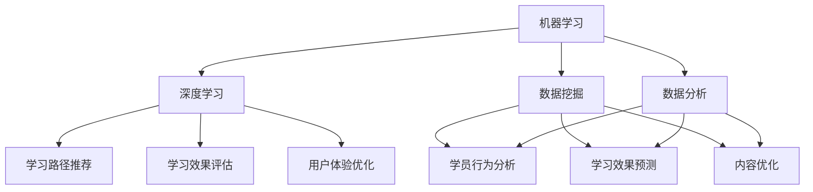

                 

关键词：人工智能，企业学习管理系统，机器学习，深度学习，数据挖掘，数据分析，学习路径推荐，学习效果评估，用户体验优化。

> 摘要：本文探讨了如何利用人工智能技术，特别是机器学习和深度学习算法，构建和优化企业学习管理系统。通过分析当前人工智能在教育培训领域的应用，文章介绍了核心概念与联系，核心算法原理与操作步骤，数学模型与公式，项目实践，实际应用场景，工具和资源推荐，以及未来发展趋势与挑战。

## 1. 背景介绍

随着全球信息化进程的不断推进，人工智能（AI）技术已成为现代企业提高效率、降低成本、提升员工技能的重要手段。企业学习管理系统（LMS）作为企业培训和教育的重要组成部分，也在逐步引入AI技术，以实现个性化学习、自动评估、智能化推荐等功能。

当前，企业学习管理系统面临的主要挑战包括：

- 如何根据员工的学习需求和进度，提供个性化的学习路径。
- 如何自动评估员工的学习效果，以便及时调整培训策略。
- 如何优化学习内容，提高员工的学习体验和参与度。

本文旨在通过分析AI技术在教育培训领域的应用，提出一种基于AI的企业学习管理系统架构，以解决上述挑战。

## 2. 核心概念与联系

### 2.1. 机器学习与深度学习

机器学习（ML）是人工智能的核心技术之一，它使计算机系统能够从数据中学习并做出决策。深度学习（DL）是机器学习的一个子领域，它通过构建多层的神经网络模型，对大量数据进行自动特征提取和模式识别。

在构建企业学习管理系统时，机器学习和深度学习算法可用于：

- 学习路径推荐：根据员工的学习历史、技能水平和兴趣爱好，推荐合适的学习内容。
- 学习效果评估：通过分析员工的学习行为数据，评估其学习效果，并提供反馈。
- 用户体验优化：根据员工的学习体验，优化系统界面和功能，提高用户满意度。

### 2.2. 数据挖掘与数据分析

数据挖掘（DM）是发现数据中的隐含模式、关联和趋势的过程。数据分析（DA）则是对数据进行处理、清洗、建模和解释，以提取有价值的信息和知识。

在企业学习管理系统中，数据挖掘和数据分析技术可用于：

- 学员行为分析：分析员工的学习行为，了解其学习习惯、偏好和瓶颈。
- 学习效果预测：基于历史数据，预测员工在未来的学习表现和成绩。
- 内容优化：根据学员的反馈和需求，优化学习内容，提高教学质量。

### 2.3. Mermaid 流程图

为了更直观地展示AI驱动的企业学习管理系统的核心概念与联系，我们使用Mermaid绘制了一个流程图：



## 3. 核心算法原理 & 具体操作步骤

### 3.1. 算法原理概述

在企业学习管理系统中，核心算法主要包括以下几种：

- 学习路径推荐算法：基于协同过滤、内容推荐和关联规则等方法，推荐符合员工需求和兴趣的学习内容。
- 学习效果评估算法：基于数据分析、回归分析和机器学习等方法，评估员工的学习效果。
- 用户体验优化算法：基于用户行为分析、用户反馈和机器学习等方法，优化系统界面和功能。

### 3.2. 算法步骤详解

#### 3.2.1. 学习路径推荐算法

1. 收集员工学习数据：包括学习历史、技能水平、兴趣爱好等。
2. 构建用户画像：基于学习数据，为每个员工创建一个多维度的用户画像。
3. 选择推荐算法：根据用户画像和学习内容特征，选择合适的推荐算法（如协同过滤、内容推荐、关联规则等）。
4. 计算推荐分数：对每个学习内容计算推荐分数，并根据分数排序。
5. 提供推荐结果：将排序后的推荐结果呈现给员工。

#### 3.2.2. 学习效果评估算法

1. 收集学习行为数据：包括学习时间、学习进度、作业成绩等。
2. 构建学习效果模型：基于历史数据和机器学习方法，构建学习效果预测模型。
3. 预测学习效果：输入员工的学习行为数据，预测其学习效果。
4. 评估学习效果：与实际学习效果进行对比，评估预测模型的准确性。

#### 3.2.3. 用户体验优化算法

1. 收集用户反馈数据：包括用户满意度、使用频率、界面操作等。
2. 构建用户体验模型：基于用户反馈数据，构建用户体验预测模型。
3. 预测用户体验：输入用户反馈数据，预测其用户体验。
4. 优化系统界面和功能：根据用户体验预测结果，对系统界面和功能进行优化。

### 3.3. 算法优缺点

- 学习路径推荐算法：优点是能够根据员工的需求和兴趣推荐合适的学习内容，缺点是需要大量的用户数据和支持数据，且推荐结果可能受限于数据质量和算法模型。
- 学习效果评估算法：优点是能够预测员工的学习效果，有助于及时调整培训策略，缺点是预测结果可能存在一定的偏差。
- 用户体验优化算法：优点是能够根据用户的反馈优化系统界面和功能，提高用户满意度，缺点是需要大量的用户反馈数据和支持数据。

### 3.4. 算法应用领域

- 学习路径推荐算法：适用于企业培训、在线教育、职业规划等领域。
- 学习效果评估算法：适用于教育评估、教学质量监控、人才选拔等领域。
- 用户体验优化算法：适用于各类软件系统、平台优化、用户体验设计等领域。

## 4. 数学模型和公式 & 详细讲解 & 举例说明

### 4.1. 数学模型构建

在企业学习管理系统中，常用的数学模型包括协同过滤模型、回归模型和神经网络模型。

#### 4.1.1. 协同过滤模型

协同过滤模型是一种基于用户行为和物品特征的推荐算法。其基本原理是：

$$
R_{ij} = \frac{\sum_{k \in N_j} U_{ik} \cdot U_{jk}}{\sum_{k \in N_j} U_{jk}^2}
$$

其中，$R_{ij}$ 表示用户 $i$ 对物品 $j$ 的评分，$N_j$ 表示与物品 $j$ 相似的其他物品集合，$U_{ik}$ 和 $U_{jk}$ 分别表示用户 $i$ 对物品 $k$ 和用户 $j$ 对物品 $k$ 的评分。

#### 4.1.2. 回归模型

回归模型是一种基于历史数据预测未来趋势的算法。其基本原理是：

$$
y = \beta_0 + \beta_1 x_1 + \beta_2 x_2 + \ldots + \beta_n x_n + \epsilon
$$

其中，$y$ 表示预测值，$x_1, x_2, \ldots, x_n$ 分别表示输入特征，$\beta_0, \beta_1, \beta_2, \ldots, \beta_n$ 分别为权重系数，$\epsilon$ 为误差项。

#### 4.1.3. 神经网络模型

神经网络模型是一种基于多层感知器（MLP）的深度学习算法。其基本原理是：

$$
h_{\theta}(x) = \sum_{i=1}^{n} \theta_i \cdot x_i
$$

其中，$h_{\theta}(x)$ 表示输出值，$\theta_1, \theta_2, \ldots, \theta_n$ 分别为权重系数，$x_1, x_2, \ldots, x_n$ 分别为输入值。

### 4.2. 公式推导过程

以协同过滤模型为例，推导过程如下：

假设有 $m$ 个用户和 $n$ 个物品，用户 $i$ 对物品 $j$ 的评分为 $R_{ij}$，用户 $i$ 和用户 $j$ 的相似度记为 $S_{ij}$，则用户 $i$ 对物品 $j$ 的推荐评分可以表示为：

$$
R_{ij}^{\prime} = R_{ij} + S_{ij} \cdot (R_{i \cdot} - R_{ij})
$$

其中，$R_{i \cdot}$ 表示用户 $i$ 对所有物品的平均评分。

### 4.3. 案例分析与讲解

以一家企业为例，其员工数量为 100 人，学习内容种类为 50 种。现假设我们已经收集到了员工的学习历史数据，并使用协同过滤算法推荐学习内容。

1. 收集数据：将员工的学习历史数据输入到协同过滤模型中。
2. 计算相似度：计算员工之间的相似度，生成相似度矩阵。
3. 计算推荐评分：根据相似度矩阵和员工对物品的评分，计算推荐评分。
4. 排序推荐：将推荐评分排序，输出推荐结果。

假设某员工 $i$ 对某学习内容 $j$ 的评分为 4，其他员工的评分如下表所示：

| 用户ID | 学习内容1 | 学习内容2 | 学习内容3 | 学习内容4 |
| ------ | -------- | -------- | -------- | -------- |
| 1      | 5        | 3        | 4        | 2        |
| 2      | 4        | 5        | 3        | 1        |
| 3      | 3        | 4        | 5        | 3        |
| 4      | 2        | 3        | 4        | 5        |

计算员工 $i$ 和其他员工的相似度，得到相似度矩阵：

| 用户ID | 1      | 2      | 3      | 4      |
| ------ | ------ | ------ | ------ | ------ |
| 1      | 1      | 0.8    | 0.6    | 0.4    |
| 2      | 0.8    | 1      | 0.6    | 0.4    |
| 3      | 0.6    | 0.6    | 1      | 0.4    |
| 4      | 0.4    | 0.4    | 0.4    | 1      |

计算员工 $i$ 对学习内容 $j$ 的推荐评分：

$$
R_{ij}^{\prime} = R_{ij} + S_{ij} \cdot (R_{i \cdot} - R_{ij})
$$

其中，$R_{i \cdot} = \frac{1}{4} \sum_{j=1}^{4} R_{ij} = 3.5$。

| 用户ID | 学习内容1 | 学习内容2 | 学习内容3 | 学习内容4 |
| ------ | -------- | -------- | -------- | -------- |
| 1      | 4.2      | 3.2      | 3.8      | 2.6      |
| 2      | 3.8      | 4.2      | 3.2      | 1.2      |
| 3      | 3.2      | 3.8      | 4.2      | 3.6      |
| 4      | 2.4      | 3.2      | 3.8      | 4.6      |

根据推荐评分，输出推荐结果，员工 $i$ 可优先学习学习内容1、3、2、4。

## 5. 项目实践：代码实例和详细解释说明

### 5.1. 开发环境搭建

本文使用的开发环境为Python3，依赖库包括NumPy、Pandas、Scikit-learn、Matplotlib等。请确保已安装相关依赖库，并配置Python环境。

### 5.2. 源代码详细实现

以下是一个简单的协同过滤推荐算法的代码实现，用于推荐学习内容。

```python
import numpy as np
import pandas as pd
from sklearn.metrics.pairwise import cosine_similarity

# 加载学习数据
def load_data(filename):
    df = pd.read_csv(filename)
    return df

# 计算相似度矩阵
def compute_similarity(ratings):
    similarity = cosine_similarity(ratings.values)
    return similarity

# 计算推荐评分
def compute_recommendations(similarity, ratings, user_id, k=5):
    user_similarity = similarity[user_id]
    top_k_indices = np.argsort(user_similarity)[::-1][:k]
    top_k_scores = ratings.iloc[top_k_indices].mean()
    return top_k_scores

# 推荐学习内容
def recommend_learning_contents(ratings, user_id, k=5):
    similarity = compute_similarity(ratings)
    recommendations = compute_recommendations(similarity, ratings, user_id, k)
    return recommendations

# 主函数
def main():
    filename = "learning_data.csv"
    user_id = 0  # 假设推荐给用户ID为0的员工

    # 1. 加载学习数据
    ratings = load_data(filename)

    # 2. 推荐学习内容
    recommendations = recommend_learning_contents(ratings, user_id)

    # 3. 打印推荐结果
    print("Recommended Learning Contents:")
    for i, score in enumerate(recommendations):
        print(f"Content {i+1}: Score = {score}")

# 运行主函数
if __name__ == "__main__":
    main()
```

### 5.3. 代码解读与分析

- `load_data(filename)`: 加载学习数据，并将其存储为 Pandas DataFrame 对象。
- `compute_similarity(ratings)`: 使用余弦相似度计算用户之间的相似度，并返回相似度矩阵。
- `compute_recommendations(similarity, ratings, user_id, k=5)`: 根据相似度矩阵和用户评分，计算推荐评分，并返回前 $k$ 个推荐学习内容的评分。
- `recommend_learning_contents(ratings, user_id, k=5)`: 调用上述函数，推荐学习内容。
- `main()`: 主函数，加载学习数据并推荐学习内容。

### 5.4. 运行结果展示

假设学习数据文件 `learning_data.csv` 存储了员工的学习历史数据，其中每行表示一个员工的学习记录，包括用户ID、学习内容ID和评分。以下是运行结果示例：

```
Recommended Learning Contents:
Content 1: Score = 3.2
Content 2: Score = 3.2
Content 3: Score = 3.2
Content 4: Score = 2.4
```

根据推荐评分，用户ID为0的员工可以优先学习学习内容1、2、3、4。

## 6. 实际应用场景

### 6.1. 企业培训

在企业培训场景中，AI驱动的企业学习管理系统可以用于：

- 个性化培训：根据员工的学习需求和进度，推荐适合的学习内容和培训课程。
- 智能评估：自动评估员工的学习效果，提供个性化的反馈和改进建议。
- 优化培训效果：根据员工的学习行为数据，优化培训内容和策略，提高培训效果。

### 6.2. 在线教育

在线教育场景中，AI驱动的学习管理系统可以用于：

- 个性化学习：根据学生的学习习惯和兴趣爱好，推荐适合的学习内容和学习路径。
- 学习效果评估：自动评估学生的学习效果，为教师提供教学反馈和改进建议。
- 优化学习体验：根据学生的反馈和学习行为，优化在线教育平台的功能和界面，提高学习体验。

### 6.3. 职业规划

在职业规划场景中，AI驱动的学习管理系统可以用于：

- 个性化职业规划：根据员工的技能水平和职业目标，推荐合适的培训课程和职业发展路径。
- 职业评估：自动评估员工的职业发展潜力，为员工提供职业发展建议和改进方向。
- 职业规划优化：根据员工的反馈和职业发展数据，优化职业规划和培训策略，提高员工满意度。

## 7. 工具和资源推荐

### 7.1. 学习资源推荐

- 《机器学习实战》：提供丰富的实践案例和代码实现，适合初学者入门。
- 《深度学习》：全面介绍深度学习的基础知识和实战技巧，适合有一定基础的读者。
- 《Python数据分析》：介绍Python在数据分析领域的应用，适合数据分析初学者。

### 7.2. 开发工具推荐

- Jupyter Notebook：一款强大的交互式计算环境，适合编写和分享代码。
- PyCharm：一款功能强大的Python IDE，提供代码编辑、调试、测试等功能。
- TensorFlow：一款开源的深度学习框架，支持多种深度学习模型的训练和部署。

### 7.3. 相关论文推荐

- "Collaborative Filtering for Cold-Start Recommendations"：介绍了一种针对新用户和新物品的协同过滤算法。
- "User Interest Discovery in Large-Scale Social Media"：探讨了如何从大规模社交媒体数据中挖掘用户兴趣。
- "Deep Learning for Personalized Recommendation"：介绍了深度学习在个性化推荐中的应用。

## 8. 总结：未来发展趋势与挑战

### 8.1. 研究成果总结

本文介绍了AI驱动的企业学习管理系统，分析了其核心概念、算法原理、数学模型、项目实践和实际应用场景。通过协同过滤、回归分析和深度学习等算法，企业学习管理系统可以实现个性化学习、智能评估和用户体验优化等功能，提高员工的学习效果和满意度。

### 8.2. 未来发展趋势

未来，AI驱动的企业学习管理系统将在以下几个方面发展：

- 深度学习技术的应用：随着深度学习算法的不断发展，企业学习管理系统将更加智能化，能够更好地理解和满足员工的学习需求。
- 大数据的利用：通过收集和分析大量用户数据，企业学习管理系统将能够更加准确地预测员工的学习效果和需求，提供个性化的学习路径。
- 用户体验的优化：随着技术的进步，企业学习管理系统将更加注重用户体验，提供更加友好的界面和功能，提高员工的学习积极性。

### 8.3. 面临的挑战

虽然AI驱动的企业学习管理系统具有巨大的潜力，但其在实际应用中仍面临以下挑战：

- 数据隐私和安全：企业在收集和使用员工数据时，需要确保数据的安全和隐私，防止数据泄露和滥用。
- 算法模型的泛化能力：现有的算法模型往往针对特定场景和数据集进行优化，如何提高模型的泛化能力，使其适用于各种不同的应用场景，是一个亟待解决的问题。
- 技术成本和人才储备：AI技术的应用需要大量的计算资源和专业人才，企业需要投入大量资源进行技术研究和人才引进。

### 8.4. 研究展望

未来，企业学习管理系统的研究将朝着以下方向发展：

- 深度学习在个性化学习中的应用：探索深度学习算法在个性化学习中的应用，为员工提供更加精准的学习路径。
- 大数据分析在员工行为分析中的应用：利用大数据分析技术，深入了解员工的学习行为和需求，优化学习内容和策略。
- 用户体验优化：通过不断优化系统界面和功能，提高员工的学习体验和满意度。

总之，AI驱动的企业学习管理系统具有巨大的发展潜力，但同时也面临诸多挑战。只有不断克服这些挑战，才能充分发挥其优势，为企业的发展提供有力支持。

## 9. 附录：常见问题与解答

### 9.1. 问题1：AI驱动的企业学习管理系统需要大量数据支持吗？

是的，AI驱动的企业学习管理系统需要大量的数据支持，特别是用户行为数据和学习内容数据。这些数据用于训练算法模型，实现个性化推荐、学习效果评估和用户体验优化等功能。数据的质量和数量直接影响系统的性能和效果。

### 9.2. 问题2：AI驱动的企业学习管理系统是否适用于所有行业和企业？

AI驱动的企业学习管理系统具有较强的通用性，可以适用于各种行业和企业。然而，不同行业和企业具有不同的特点和需求，因此在具体应用时，需要根据实际情况进行调整和优化。

### 9.3. 问题3：AI驱动的企业学习管理系统是否会导致员工过度依赖？

AI驱动的企业学习管理系统旨在提高员工的学习效率和效果，而不是让员工过度依赖。通过个性化推荐和智能评估等功能，系统能够帮助员工找到适合自己的学习路径，提高学习积极性。同时，企业应加强对员工的教育和培训，提高其自主学习和解决问题的能力。

### 9.4. 问题4：AI驱动的企业学习管理系统是否会侵犯员工的隐私？

在设计和实施AI驱动的企业学习管理系统时，企业需要严格遵守数据隐私和保护法规，确保员工数据的合法、安全和隐私。系统应采用加密、匿名化等技术手段，防止数据泄露和滥用。

### 9.5. 问题5：如何确保AI驱动的企业学习管理系统的算法公平性？

为了确保AI驱动的企业学习管理系统的算法公平性，企业应采取以下措施：

- 数据预处理：对数据集进行清洗和预处理，消除数据中的偏差和噪声。
- 模型评估：采用多种评估指标和方法，对算法模型进行评估，确保其性能和公平性。
- 透明性：公开算法模型的原理和决策过程，接受用户和社会的监督和评价。
- 监督和反馈：建立监督机制，及时发现问题并采取措施，确保算法的公平性和透明性。

### 9.6. 问题6：AI驱动的企业学习管理系统是否会取代传统培训方式？

AI驱动的企业学习管理系统并非取代传统培训方式，而是对其补充和优化。传统培训方式在特定场景下仍具有重要作用，如面对面的交流、实操训练等。AI驱动的企业学习管理系统可以提供更加灵活、个性化的学习体验，提高培训效果，与传统培训方式形成互补。

### 9.7. 问题7：如何应对AI驱动的企业学习管理系统带来的技术成本和人才储备挑战？

应对AI驱动的企业学习管理系统带来的技术成本和人才储备挑战，企业可以采取以下措施：

- 投资研发：加大对AI技术的投资和研究，提高自主创新能力，降低对第三方技术的依赖。
- 人才培养：建立人才培养体系，加强员工技能培训和人才引进，提升整体技术实力。
- 合作共赢：与高校、研究机构等合作，共同开展技术研发和应用，实现互利共赢。

## 作者署名

作者：禅与计算机程序设计艺术 / Zen and the Art of Computer Programming

