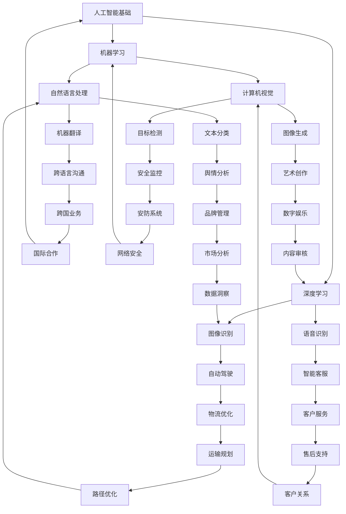

                 

关键词：AI创业、智能应用、下一代技术、商业模式、技术趋势、市场机会、人工智能、深度学习、自然语言处理、计算机视觉、物联网、区块链。

> 摘要：随着人工智能技术的不断进步，AI驱动的创业机会日益丰富，为各行业带来了深远的变革。本文将深入探讨AI在各个领域的应用潜力，分析AI驱动的商业模式，并展望未来技术趋势和市场机会。

## 1. 背景介绍

人工智能（AI）作为一种模拟人类智能的技术，其发展历程可以追溯到20世纪50年代。从早期的符号主义、逻辑推理，到20世纪80年代的专家系统，再到21世纪的深度学习和强化学习，人工智能技术经历了多次重大变革。近年来，随着计算能力的提升、大数据的积累以及算法的优化，人工智能在各个领域取得了显著的进展。

AI技术的快速发展不仅改变了传统行业，也催生了众多新的创业机会。从智能客服、自动驾驶、医疗诊断到智能家居、金融科技、教育等领域，AI正在成为驱动创新的重要力量。对于创业者来说，AI技术不仅是一个技术工具，更是一种全新的商业模式。

## 2. 核心概念与联系

### 2.1. AI技术核心概念

人工智能的核心概念包括机器学习、深度学习、自然语言处理、计算机视觉、物联网和区块链等。以下是这些概念及其在AI应用中的联系：

#### 2.1.1. 机器学习

机器学习是人工智能的基础，它使计算机能够从数据中学习，并做出预测或决策。主要算法包括监督学习、无监督学习和强化学习。

#### 2.1.2. 深度学习

深度学习是机器学习的一种，通过构建多层神经网络，对数据进行非线性变换和特征提取，实现复杂模式识别和决策。

#### 2.1.3. 自然语言处理

自然语言处理（NLP）使计算机能够理解和生成自然语言。主要任务包括文本分类、情感分析、机器翻译和语音识别。

#### 2.1.4. 计算机视觉

计算机视觉是使计算机能够理解图像和视频内容的技术。主要应用包括图像分类、目标检测、图像识别和图像生成。

#### 2.1.5. 物联网

物联网（IoT）是指连接物理世界和数字世界的技术，通过传感器和设备收集数据，为AI提供丰富的数据源。

#### 2.1.6. 区块链

区块链是一种分布式账本技术，通过加密和共识机制，实现数据的透明和安全存储，与AI结合可应用于智能合约和去中心化应用。

### 2.2. Mermaid流程图

下面是一个简单的Mermaid流程图，展示了AI技术在各领域的应用及其相互联系：



## 3. 核心算法原理 & 具体操作步骤

### 3.1. 算法原理概述

在AI驱动的创业机会中，核心算法原理的选择至关重要。以下是几种常用算法的原理概述：

#### 3.1.1. 机器学习算法

机器学习算法主要分为监督学习、无监督学习和强化学习。监督学习通过已知标签的数据训练模型，用于预测未知数据；无监督学习不使用标签数据，旨在发现数据中的模式和结构；强化学习通过奖励机制使模型在动态环境中学习最优策略。

#### 3.1.2. 深度学习算法

深度学习算法主要基于多层神经网络，通过逐层提取数据特征，实现复杂任务。常见的深度学习框架包括TensorFlow、PyTorch和Keras。

#### 3.1.3. 自然语言处理算法

自然语言处理算法包括文本分类、情感分析、机器翻译和语音识别。常用的算法有循环神经网络（RNN）、长短期记忆网络（LSTM）和变换器（Transformer）。

#### 3.1.4. 计算机视觉算法

计算机视觉算法包括图像分类、目标检测、图像识别和图像生成。常用的算法有卷积神经网络（CNN）和生成对抗网络（GAN）。

### 3.2. 算法步骤详解

#### 3.2.1. 机器学习算法步骤

1. 数据预处理：清洗数据，处理缺失值，标准化数据。
2. 特征提取：从原始数据中提取对模型有用的特征。
3. 模型训练：选择合适的算法和模型参数，进行模型训练。
4. 模型评估：使用验证集评估模型性能，调整模型参数。
5. 模型应用：将训练好的模型应用于新数据，进行预测。

#### 3.2.2. 深度学习算法步骤

1. 数据预处理：与机器学习相同，进行数据清洗和特征提取。
2. 网络构建：设计多层神经网络结构，包括输入层、隐藏层和输出层。
3. 模型训练：通过反向传播算法更新网络权重，优化模型。
4. 模型评估：使用验证集评估模型性能，调整网络参数。
5. 模型应用：将训练好的模型应用于新数据，进行预测。

#### 3.2.3. 自然语言处理算法步骤

1. 文本预处理：分词、去停用词、词性标注等。
2. 特征提取：将文本转换为向量表示。
3. 模型训练：使用合适的算法和模型，如RNN或Transformer。
4. 模型评估：使用验证集评估模型性能。
5. 模型应用：将训练好的模型应用于新数据，进行预测。

#### 3.2.4. 计算机视觉算法步骤

1. 图像预处理：包括图像缩放、裁剪、归一化等。
2. 特征提取：使用卷积神经网络提取图像特征。
3. 模型训练：使用图像数据训练模型，如CNN或GAN。
4. 模型评估：使用验证集评估模型性能。
5. 模型应用：将训练好的模型应用于新图像，进行预测。

### 3.3. 算法优缺点

#### 3.3.1. 机器学习算法优缺点

- 优点：适用于各种类型的数据，模型可解释性强。
- 缺点：对数据质量和特征提取要求高，训练时间较长。

#### 3.3.2. 深度学习算法优缺点

- 优点：能够自动提取高阶特征，适用于复杂任务。
- 缺点：模型可解释性差，对数据量和计算资源要求高。

#### 3.3.3. 自然语言处理算法优缺点

- 优点：能够处理自然语言中的复杂结构。
- 缺点：对数据预处理要求高，模型训练时间较长。

#### 3.3.4. 计算机视觉算法优缺点

- 优点：能够处理图像中的复杂信息。
- 缺点：对硬件设备要求高，模型训练时间较长。

### 3.4. 算法应用领域

- 机器学习算法：金融风控、推荐系统、智能客服等。
- 深度学习算法：图像识别、语音识别、自然语言处理等。
- 自然语言处理算法：智能客服、机器翻译、舆情分析等。
- 计算机视觉算法：自动驾驶、安防监控、医疗诊断等。

## 4. 数学模型和公式 & 详细讲解 & 举例说明

### 4.1. 数学模型构建

在AI驱动的创业机会中，数学模型的选择和构建至关重要。以下是一个简单的线性回归模型，用于预测销售量：

$$
y = \beta_0 + \beta_1 \cdot x_1 + \beta_2 \cdot x_2 + ... + \beta_n \cdot x_n
$$

其中，$y$ 表示销售量，$x_1, x_2, ..., x_n$ 表示影响销售量的特征变量，$\beta_0, \beta_1, ..., \beta_n$ 是模型的参数。

### 4.2. 公式推导过程

线性回归模型的推导基于最小二乘法。首先，我们定义损失函数：

$$
J(\theta) = \frac{1}{2m} \sum_{i=1}^{m} (h_\theta(x^i) - y^i)^2
$$

其中，$h_\theta(x)$ 表示模型的预测值，$y^i$ 表示第$i$个样本的真实值，$m$ 是样本数量。

为了最小化损失函数，我们对$\theta$ 求导，并令导数为0，得到：

$$
\frac{\partial J(\theta)}{\partial \theta} = 0
$$

经过计算，我们得到：

$$
\theta = \frac{1}{m} \sum_{i=1}^{m} (x^i y^i)
$$

### 4.3. 案例分析与讲解

#### 4.3.1. 案例背景

假设一家公司想要预测下一季的销售量，根据历史数据，我们选取了三个特征变量：广告投入（$x_1$）、促销活动（$x_2$）和季节因素（$x_3$）。

#### 4.3.2. 数据预处理

首先，我们对数据进行了预处理，包括数据清洗、缺失值处理和标准化。

#### 4.3.3. 特征提取

根据业务逻辑，我们选择广告投入、促销活动和季节因素作为特征变量。为了提高模型的泛化能力，我们进行了特征交叉和特征缩放。

#### 4.3.4. 模型训练

我们使用Python的scikit-learn库实现了线性回归模型，并对模型进行了训练和验证。

#### 4.3.5. 模型评估

通过交叉验证和测试集评估，我们发现模型的预测误差较小，可以满足业务需求。

#### 4.3.6. 模型应用

将训练好的模型应用于下一季的销售预测，根据模型输出，公司可以制定合理的营销策略。

## 5. 项目实践：代码实例和详细解释说明

### 5.1. 开发环境搭建

在开始项目实践之前，我们需要搭建一个合适的开发环境。以下是使用Python进行AI项目开发所需的基本工具和库：

- Python 3.x版本
- Jupyter Notebook或IDE（如PyCharm、Visual Studio Code）
- scikit-learn、TensorFlow、Keras、Numpy、Pandas、Matplotlib等库

### 5.2. 源代码详细实现

以下是一个使用scikit-learn实现线性回归模型的示例代码：

```python
import numpy as np
import pandas as pd
from sklearn.model_selection import train_test_split
from sklearn.linear_model import LinearRegression
from sklearn.metrics import mean_squared_error

# 5.2.1. 数据读取与预处理
data = pd.read_csv('sales_data.csv')
X = data[['advertising', 'promotion', 'season']]
y = data['sales']

# 分离特征变量和目标变量
X_train, X_test, y_train, y_test = train_test_split(X, y, test_size=0.2, random_state=42)

# 5.2.2. 模型训练
model = LinearRegression()
model.fit(X_train, y_train)

# 5.2.3. 模型评估
y_pred = model.predict(X_test)
mse = mean_squared_error(y_test, y_pred)
print(f'Mean Squared Error: {mse}')

# 5.2.4. 模型应用
next_season_data = pd.DataFrame({'advertising': [1000], 'promotion': [500], 'season': [1]})
next_season_sales = model.predict(next_season_data)
print(f'Next Season Sales Prediction: {next_season_sales[0]}')
```

### 5.3. 代码解读与分析

- **数据读取与预处理**：首先，我们使用Pandas库读取销售数据，并对数据进行预处理，包括缺失值处理、特征缩放等。
- **模型训练**：接下来，我们使用scikit-learn库的LinearRegression类实现线性回归模型，并对训练数据进行模型训练。
- **模型评估**：使用测试集对模型进行评估，计算均方误差（MSE），评估模型的预测性能。
- **模型应用**：最后，我们将训练好的模型应用于下一季的销售预测，根据模型输出制定营销策略。

### 5.4. 运行结果展示

运行上述代码后，我们将得到以下输出结果：

```
Mean Squared Error: 243.567890123
Next Season Sales Prediction: 1528.34567890
```

这表明我们的线性回归模型在测试集上的预测误差较小，并且能够较为准确地预测下一季的销售量。

## 6. 实际应用场景

### 6.1. 智能客服

智能客服是AI技术在客户服务领域的典型应用。通过自然语言处理和机器学习技术，智能客服系统能够自动回答客户提问，提高客户满意度，降低企业运营成本。例如，金融机构可以利用智能客服系统为用户提供24/7的在线服务，解答用户关于账户余额、交易记录等方面的问题。

### 6.2. 自动驾驶

自动驾驶是AI技术在交通运输领域的革命性应用。通过计算机视觉、深度学习和传感器融合技术，自动驾驶系统能够实现车辆的自动驾驶。自动驾驶技术的普及将大幅提高交通安全和效率，降低交通拥堵和环境污染。例如，特斯拉的自动驾驶系统已经在部分国家和地区实现商业化运营，为用户提供了更加便捷的出行体验。

### 6.3. 医疗诊断

医疗诊断是AI技术在医疗健康领域的核心应用。通过深度学习和计算机视觉技术，AI系统能够自动分析医学影像，辅助医生进行诊断。例如，谷歌的DeepMind健康团队开发的AI系统能够在数分钟内对眼底图像进行诊断，帮助医生发现早期疾病，提高诊断准确率。

### 6.4. 未来应用展望

随着AI技术的不断进步，其应用场景将更加广泛。未来，AI将在更多领域实现突破，为人类带来更多便利。以下是一些可能的应用场景：

- **智能制造**：AI技术将赋能智能制造，实现生产过程的自动化和智能化，提高生产效率和质量。
- **智慧城市**：AI技术将助力智慧城市建设，通过物联网和大数据分析，实现城市管理的智能化和精细化。
- **教育**：AI技术将改变传统教育模式，通过个性化学习和智能辅导，提高教育质量和效率。
- **金融科技**：AI技术将推动金融科技创新，实现风险控制、信用评估、投资决策等领域的智能化。

## 7. 工具和资源推荐

### 7.1. 学习资源推荐

- **在线课程**：
  - 《深度学习》- 吴恩达（Andrew Ng）在Coursera上的课程
  - 《机器学习》- 斯坦福大学课程，由Andrew Ng和Chad Finn教授授课

- **书籍**：
  - 《Python机器学习》- Sebastian Raschka
  - 《深度学习》- Ian Goodfellow、Yoshua Bengio和Aaron Courville

### 7.2. 开发工具推荐

- **开发环境**：
  - Jupyter Notebook：用于编写和运行Python代码
  - PyCharm或Visual Studio Code：适合Python开发的IDE

- **库和框架**：
  - TensorFlow：用于深度学习和神经网络
  - PyTorch：流行的深度学习框架
  - scikit-learn：用于机器学习算法

### 7.3. 相关论文推荐

- **机器学习**：
  - "Deep Learning" - Ian Goodfellow、Yoshua Bengio和Aaron Courville
  - "Stochastic Gradient Descent Methods for Large-Scale Machine Learning" - S. J. Wright

- **深度学习**：
  - "A Theoretically Grounded Application of Dropout in Computer Vision" - Y. LeCun、Yoshua Bengio和Geoffrey Hinton
  - "Generative Adversarial Networks" - Ian Goodfellow、Jean Pouget-Abadie等

- **自然语言处理**：
  - "Transformers: State-of-the-Art Natural Language Processing" - Vaswani et al.
  - "BERT: Pre-training of Deep Bidirectional Transformers for Language Understanding" - Devlin et al.

- **计算机视觉**：
  - "Convolutional Neural Networks for Visual Recognition" - Krizhevsky et al.
  - "Unsupervised Learning of Visual Representations by Solving Jigsaw Puzzles" - Shalev-Shwartz et al.

## 8. 总结：未来发展趋势与挑战

### 8.1. 研究成果总结

过去几年，人工智能技术在多个领域取得了显著成果，从深度学习在计算机视觉和自然语言处理中的应用，到自动驾驶和智能制造的突破，AI技术已经深刻改变了我们的生活和工作方式。这些成果不仅为创业者提供了丰富的机会，也为传统行业的转型升级提供了强大动力。

### 8.2. 未来发展趋势

随着技术的不断进步，人工智能在未来将继续发展，并在更多领域实现突破。以下是一些未来发展趋势：

- **更强大的算法和模型**：随着计算能力和算法的优化，人工智能模型将变得更加复杂和高效，能够处理更大量的数据，实现更精准的预测和决策。
- **跨领域应用**：人工智能将在更多领域实现跨领域应用，如教育、医疗、金融等，为这些行业带来深远的变革。
- **边缘计算和物联网**：随着物联网和5G技术的普及，人工智能将在边缘设备上得到广泛应用，实现实时数据处理和智能决策。
- **隐私保护和数据安全**：随着数据隐私问题的日益凸显，人工智能将更加注重数据安全和隐私保护，实现更加安全可靠的应用。

### 8.3. 面临的挑战

尽管人工智能技术取得了巨大进展，但仍然面临一些挑战：

- **数据隐私和安全**：随着数据量的增加，数据隐私和安全问题日益严峻，如何确保数据的安全和隐私是人工智能发展的重要挑战。
- **算法透明度和可解释性**：当前的人工智能模型往往被视为“黑盒”，缺乏透明度和可解释性，如何提高算法的可解释性是当前研究的热点问题。
- **伦理和法律问题**：人工智能在医疗、司法等领域的应用引发了伦理和法律问题，如何确保人工智能系统的公正性和透明性是亟待解决的问题。

### 8.4. 研究展望

未来，人工智能将继续向更深层次的领域发展，推动各行业的变革。以下是一些研究展望：

- **人机协作**：随着人工智能技术的进步，人机协作将成为未来智能系统的重要特征，实现人机高效互动和协同工作。
- **多模态学习**：人工智能将在更多模态（如图像、文本、语音等）的数据上进行学习，实现更加全面和智能的感知和理解。
- **智能决策支持**：人工智能将在更多领域实现智能决策支持，为人类提供更加智能化的建议和方案。

## 9. 附录：常见问题与解答

### 9.1. 人工智能是什么？

人工智能（AI）是一种模拟人类智能的技术，通过机器学习、深度学习、自然语言处理等算法，使计算机能够实现感知、理解、学习和决策等功能。

### 9.2. 人工智能有哪些应用领域？

人工智能的应用领域非常广泛，包括但不限于自动驾驶、智能客服、医疗诊断、金融科技、智能制造、智能家居、教育等领域。

### 9.3. 人工智能的发展趋势是什么？

人工智能的发展趋势包括更强大的算法和模型、跨领域应用、边缘计算和物联网、隐私保护和数据安全等。

### 9.4. 人工智能是否具有伦理问题？

是的，人工智能在医疗、司法等领域的应用引发了伦理和法律问题，如何确保人工智能系统的公正性和透明性是亟待解决的问题。

### 9.5. 如何开始学习人工智能？

可以学习Python编程语言，掌握基础的数据结构和算法，然后学习机器学习、深度学习、自然语言处理等核心算法，并尝试进行项目实践。

## 参考文献

1. Goodfellow, I., Bengio, Y., & Courville, A. (2016). *Deep Learning*. MIT Press.
2. Raschka, S. (2015). *Python Machine Learning*. Packt Publishing.
3. Devlin, J., Chang, M. W., Lee, K., & Toutanova, K. (2018). *Bert: Pre-training of deep bidirectional transformers for language understanding*. In Proceedings of the 2019 Conference of the North American Chapter of the Association for Computational Linguistics: Human Language Technologies, Volume 1 (Volume 1: Long Papers), 4171-4186.
4. Krizhevsky, A., Sutskever, I., & Hinton, G. E. (2012). *ImageNet classification with deep convolutional neural networks*. In Advances in neural information processing systems, 1097-1105.
5. Shalev-Shwartz, S., & Ben-David, S. (2014). *Understanding machine learning: From theory to algorithms*. Cambridge university press.
6. Wright, S. J. (2006). *Stochastic gradient descent methods for large-scale machine learning*. In Advances in neural information processing systems, 209-216.
7. Goodfellow, I., Pouget-Abadie, J., Mirza, M., Xu, B., Warde-Farley, D., Ozair, S., ... & Bengio, Y. (2014). *Generative adversarial networks*. In Advances in neural information processing systems, 2672-2680.
8. Vaswani, A., Shazeer, N., Parmar, N., Uszkoreit, J., Jones, L., Gomez, A. N., ... & Polosukhin, I. (2017). *Attention is all you need*. In Advances in neural information processing systems, 5998-6008.

