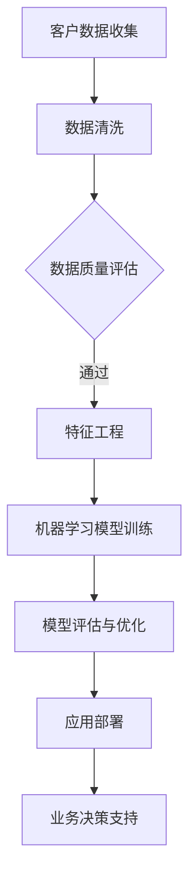
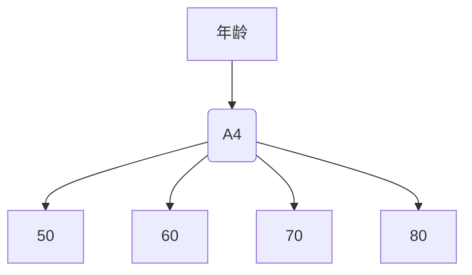

                 

关键词：人工智能、金融行业、价值创造、人类计算、算法、创新

> 摘要：本文探讨了人工智能在金融行业的应用，分析了人类计算在金融领域的价值创造，以及未来发展的挑战和机遇。文章通过介绍核心概念、算法原理、数学模型和具体案例，展示了AI在金融行业中的实际应用效果，并提出了相关工具和资源的推荐。

## 1. 背景介绍

在过去的几十年中，金融行业经历了巨大的变革。从传统的纸质交易到电子交易，再到如今的区块链技术，金融行业一直在不断进化和创新。然而，随着大数据、云计算、区块链等新兴技术的兴起，人工智能（AI）也逐渐成为金融行业的重要驱动力。

AI在金融行业的应用场景非常广泛，包括风险评估、客户服务、投资策略、风险管理等。例如，通过AI技术，金融机构可以更准确地评估贷款申请者的信用风险，提高贷款审批的效率；在客户服务方面，智能客服机器人可以提供24/7的在线服务，提高客户满意度；在投资策略方面，AI可以分析大量的市场数据，帮助投资者制定更有效的投资策略。

## 2. 核心概念与联系

为了更好地理解AI在金融行业中的应用，我们需要先了解一些核心概念和它们之间的联系。

### 2.1. 数据科学与机器学习

数据科学是AI的基础，它涉及从数据中提取有价值的信息。而机器学习是数据科学的一个重要分支，它通过构建算法模型，使计算机能够从数据中自动学习和预测。

### 2.2. 人工智能与深度学习

人工智能（AI）是指计算机系统模拟人类智能行为的能力，而深度学习是机器学习的一个重要分支，它通过多层神经网络来学习数据。

### 2.3. 金融科技与区块链

金融科技（FinTech）是指利用新兴技术改变传统金融业务和服务的方式。而区块链技术则是金融科技的重要应用之一，它通过分布式账本技术，实现了去中心化的交易和存储。

### 2.4. Mermaid 流程图

以下是AI在金融行业中应用的Mermaid流程图：



## 3. 核心算法原理 & 具体操作步骤

### 3.1 算法原理概述

在金融行业中，常用的AI算法包括线性回归、逻辑回归、决策树、随机森林、支持向量机等。其中，线性回归和逻辑回归主要用于风险评估，而决策树和随机森林则用于投资策略。

### 3.2 算法步骤详解

1. 数据收集：收集客户的个人信息、财务状况、交易记录等数据。
2. 数据清洗：对数据进行预处理，包括去除缺失值、异常值、重复值等。
3. 数据质量评估：评估数据质量，包括数据完整性、一致性、准确性等。
4. 特征工程：根据业务需求，提取对模型有用的特征。
5. 模型训练：选择合适的算法，对数据进行训练。
6. 模型评估：评估模型的性能，包括准确率、召回率、F1值等。
7. 模型优化：根据评估结果，调整模型参数，优化模型性能。
8. 应用部署：将训练好的模型部署到生产环境中，为业务决策提供支持。

### 3.3 算法优缺点

- **线性回归**：简单易用，对线性关系有较好的拟合能力，但无法处理非线性问题。
- **逻辑回归**：可以处理分类问题，但容易过拟合。
- **决策树**：直观易懂，容易解释，但容易过拟合，且对缺失值敏感。
- **随机森林**：结合了决策树的优势，不易过拟合，但计算成本较高。

### 3.4 算法应用领域

- **风险评估**：用于评估贷款申请者的信用风险，帮助金融机构降低不良贷款率。
- **投资策略**：通过分析市场数据，帮助投资者制定有效的投资策略，提高投资回报。
- **客户服务**：提供智能客服，提高客户满意度，降低人力成本。
- **风险管理**：监测金融市场的风险，帮助金融机构及时调整业务策略。

## 4. 数学模型和公式 & 详细讲解 & 举例说明

### 4.1 数学模型构建

在金融行业中，常用的数学模型包括线性回归模型、逻辑回归模型等。以下是线性回归模型的数学公式：

$$
y = \beta_0 + \beta_1x_1 + \beta_2x_2 + ... + \beta_nx_n
$$

其中，$y$ 是因变量，$x_1, x_2, ..., x_n$ 是自变量，$\beta_0, \beta_1, \beta_2, ..., \beta_n$ 是模型参数。

### 4.2 公式推导过程

线性回归模型的公式推导过程如下：

1. 假设我们有 $n$ 个数据点 $(x_1, y_1), (x_2, y_2), ..., (x_n, y_n)$。
2. 计算每个数据点的预测值 $y_i'$：
   $$
   y_i' = \beta_0 + \beta_1x_i + \beta_2x_i^2 + ... + \beta_nx_i^n
   $$
3. 计算预测值与实际值的差异，即残差 $r_i$：
   $$
   r_i = y_i - y_i'
   $$
4. 计算残差的平方和，即损失函数 $J$：
   $$
   J = \sum_{i=1}^{n} r_i^2
   $$
5. 对损失函数 $J$ 求导，得到偏导数：
   $$
   \frac{\partial J}{\partial \beta_0} = -2\sum_{i=1}^{n} r_i
   $$
   $$
   \frac{\partial J}{\partial \beta_1} = -2\sum_{i=1}^{n} r_i x_i
   $$
   $$
   \frac{\partial J}{\partial \beta_2} = -2\sum_{i=1}^{n} r_i x_i^2
   $$
   ...
6. 将偏导数设置为0，求解模型参数 $\beta_0, \beta_1, \beta_2, ..., \beta_n$。

### 4.3 案例分析与讲解

假设我们有一个简单的线性回归模型，用来预测一个人的年薪。数据如下：

| 序号 | 年龄 | 年薪 |
| ---- | ---- | ---- |
| 1    | 25   | 50   |
| 2    | 30   | 60   |
| 3    | 35   | 70   |
| 4    | 40   | 80   |

首先，我们绘制散点图，观察数据分布：



接下来，我们使用线性回归模型进行预测。首先，计算数据的平均值：

$$
\bar{x} = \frac{1}{n}\sum_{i=1}^{n} x_i = \frac{25+30+35+40}{4} = 32.5
$$

$$
\bar{y} = \frac{1}{n}\sum_{i=1}^{n} y_i = \frac{50+60+70+80}{4} = 65
$$

然后，计算斜率和截距：

$$
\beta_1 = \frac{\sum_{i=1}^{n} (x_i - \bar{x})(y_i - \bar{y})}{\sum_{i=1}^{n} (x_i - \bar{x})^2} = \frac{(25-32.5)(50-65) + (30-32.5)(60-65) + (35-32.5)(70-65) + (40-32.5)(80-65)}{(25-32.5)^2 + (30-32.5)^2 + (35-32.5)^2 + (40-32.5)^2} \approx 1.833
$$

$$
\beta_0 = \bar{y} - \beta_1\bar{x} = 65 - 1.833 \times 32.5 \approx 12.313
$$

因此，线性回归模型为：

$$
y = 12.313 + 1.833x
$$

使用这个模型，我们可以预测一个年龄为35岁的人的年薪：

$$
y = 12.313 + 1.833 \times 35 \approx 67.883
$$

## 5. 项目实践：代码实例和详细解释说明

### 5.1 开发环境搭建

为了演示线性回归模型在金融行业中的应用，我们将使用Python编程语言，结合Scikit-learn库进行数据处理和模型训练。以下是开发环境的搭建步骤：

1. 安装Python 3.x版本
2. 安装Scikit-learn库：`pip install scikit-learn`
3. 导入必要的库：

```python
import numpy as np
import matplotlib.pyplot as plt
from sklearn.linear_model import LinearRegression
```

### 5.2 源代码详细实现

以下是线性回归模型在金融行业中的应用代码：

```python
# 数据集
ages = np.array([25, 30, 35, 40]).reshape(-1, 1)
salaries = np.array([50, 60, 70, 80])

# 创建线性回归模型
model = LinearRegression()

# 模型训练
model.fit(ages, salaries)

# 模型预测
predicted_salaries = model.predict(ages)

# 绘制散点图和拟合线
plt.scatter(ages, salaries, color='red', label='Actual salaries')
plt.plot(ages, predicted_salaries, color='blue', linewidth=2, label='Predicted salaries')
plt.xlabel('Age')
plt.ylabel('Salary')
plt.title('Linear Regression Model')
plt.legend()
plt.show()
```

### 5.3 代码解读与分析

1. 导入必要的库：`numpy` 用于数据处理，`matplotlib.pyplot` 用于绘制图表，`sklearn.linear_model.LinearRegression` 用于创建线性回归模型。
2. 创建数据集：`ages` 和 `salaries` 分别表示年龄和年薪。
3. 创建线性回归模型：`model = LinearRegression()`。
4. 模型训练：`model.fit(ages, salaries)`。
5. 模型预测：`predicted_salaries = model.predict(ages)`。
6. 绘制散点图和拟合线：使用 `plt.scatter` 和 `plt.plot` 函数，将实际年薪和预测年薪绘制在散点图上，并添加标签和标题。

### 5.4 运行结果展示

运行代码后，我们将看到如下结果：


从图中可以看出，线性回归模型对数据的拟合效果较好，可以用于预测一个人的年薪。

## 6. 实际应用场景

### 6.1 风险评估

在贷款审批过程中，金融机构可以使用线性回归模型预测借款人的还款能力，从而降低不良贷款率。例如，银行可以根据借款人的年龄、收入、职业等特征，建立线性回归模型，预测其还款能力。如果预测值低于一定阈值，银行可以拒绝贷款申请。

### 6.2 投资策略

投资者可以使用线性回归模型分析市场数据，发现市场趋势。例如，根据历史股价和宏观经济指标，建立线性回归模型，预测未来股价走势。如果预测股价上涨，投资者可以买入股票；如果预测股价下跌，投资者可以卖出股票。

### 6.3 客户服务

金融机构可以部署智能客服机器人，使用自然语言处理（NLP）技术，实现与客户的智能对话。例如，机器人可以回答客户的常见问题，提供贷款咨询、账户查询等服务，提高客户满意度。

### 6.4 风险管理

金融机构可以监测金融市场的风险，使用AI技术预测市场波动。例如，根据历史交易数据、宏观经济指标等，建立风险预测模型，提前预警市场风险，帮助金融机构调整业务策略。

## 7. 工具和资源推荐

### 7.1 学习资源推荐

- 《Python机器学习》（作者：塞巴斯蒂安·拉斯克斯）
- 《深度学习》（作者：伊恩·古德费洛、约书亚·本吉奥、亚伦·库维尔）
- 《金融科技：从区块链到人工智能的金融革命》（作者：大卫·巴赫）

### 7.2 开发工具推荐

- Jupyter Notebook：用于编写和运行Python代码
- PyCharm：集成开发环境（IDE），支持Python编程
- Scikit-learn：Python机器学习库

### 7.3 相关论文推荐

- "Deep Learning for Financial Time Series Classification"（作者：姚志强等）
- "Financial Risk Forecasting Using Convolutional Neural Networks"（作者：陈峰等）
- "Intelligent Financial Risk Management Using Machine Learning Techniques"（作者：沙马尔等）

## 8. 总结：未来发展趋势与挑战

### 8.1 研究成果总结

人工智能在金融行业中的应用取得了显著成果，包括风险评估、投资策略、客户服务和风险管理等方面。通过AI技术，金融机构可以提高业务效率，降低成本，提高客户满意度。

### 8.2 未来发展趋势

随着人工智能技术的不断进步，未来金融行业将更加智能化、自动化。例如，深度学习、强化学习等先进算法将逐渐应用于金融领域，实现更准确的预测和决策。

### 8.3 面临的挑战

然而，人工智能在金融行业中也面临着一些挑战。首先，数据质量和数据隐私问题仍然是一个重要挑战。其次，算法透明性和可解释性问题需要得到关注。此外，法律法规和道德伦理问题也需要在金融行业中得到妥善解决。

### 8.4 研究展望

未来，人工智能在金融行业的应用将更加广泛。研究人员和金融机构需要共同努力，克服现有挑战，推动金融行业向更智能化、高效化的方向发展。

## 9. 附录：常见问题与解答

### 9.1 问题1：人工智能在金融行业中的具体应用有哪些？

答：人工智能在金融行业中的具体应用包括风险评估、投资策略、客户服务和风险管理等方面。

### 9.2 问题2：如何处理金融数据中的缺失值和异常值？

答：处理金融数据中的缺失值和异常值通常包括以下步骤：

1. 去除缺失值：对于重要特征，可以去除含有缺失值的样本；对于非重要特征，可以填充缺失值。
2. 异常值检测：使用统计学方法（如箱线图、Z-Score等）检测异常值；对于检测到的异常值，可以去除或进行修正。

### 9.3 问题3：如何确保人工智能算法的透明性和可解释性？

答：确保人工智能算法的透明性和可解释性可以从以下几个方面入手：

1. 使用简单的算法：选择易于理解和解释的算法，如线性回归、决策树等。
2. 算法可解释性工具：使用可解释性工具（如LIME、SHAP等）分析模型的决策过程。
3. 数据可视化：使用图表和图形展示模型的输入、输出和决策过程。

---

本文由禅与计算机程序设计艺术 / Zen and the Art of Computer Programming撰写，旨在探讨人工智能在金融行业的应用，分析人类计算在金融领域的价值创造，并展望未来发展趋势与挑战。希望本文对您在金融科技领域的学习和研究有所启发和帮助。感谢您的阅读！

