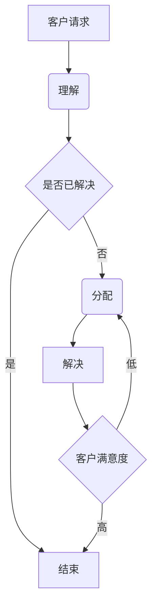

                 

关键词：人工智能、客户服务、流程优化、机器学习、自然语言处理、用户体验

摘要：本文将探讨如何利用人工智能技术，特别是机器学习和自然语言处理，来优化客户服务流程。通过深入分析这些技术的核心概念、算法原理、数学模型以及实际应用案例，我们将展示如何通过AI技术提高客户服务的效率和质量，同时展望未来发展趋势和面临的挑战。

## 1. 背景介绍

在当今的数字经济时代，客户服务已成为企业竞争的重要领域。随着客户需求的日益多样化和个性化，传统的客户服务模式已经无法满足现代企业的需求。这就需要引入新兴的智能技术，如人工智能（AI），来优化客户服务流程，提升客户满意度。

### 1.1 客户服务的现状

当前，客户服务主要面临以下挑战：

- **高成本**：人工客服成本不断增加，尤其是在处理大量重复性问题时。
- **响应速度慢**：人工处理客户请求往往需要较长时间，无法及时响应客户需求。
- **个性化不足**：传统客服系统难以根据客户的历史数据提供个性化的服务。
- **效率低**：客服人员处理复杂问题时效率不高，容易出现错误。

### 1.2 人工智能的优势

人工智能技术，特别是机器学习和自然语言处理，为优化客户服务流程带来了新的机遇：

- **自动化**：AI可以自动化处理大量重复性任务，减少人工干预。
- **快速响应**：AI系统可以实时处理客户请求，提高响应速度。
- **个性化服务**：AI可以根据客户历史数据提供个性化推荐和解决方案。
- **高效处理**：AI能够高效处理复杂问题，减少错误率。

## 2. 核心概念与联系

### 2.1 机器学习

机器学习是一种使计算机通过数据学习并做出决策的技术。它主要分为监督学习、无监督学习和强化学习。在客户服务中，监督学习通常用于构建预测模型，无监督学习用于发现客户行为的模式，强化学习则用于优化客服流程。

### 2.2 自然语言处理

自然语言处理（NLP）是一种使计算机理解和生成人类语言的技术。在客户服务中，NLP主要用于理解和处理客户请求，包括文本分类、实体识别、语义理解等。

### 2.3 Mermaid 流程图



## 3. 核心算法原理 & 具体操作步骤

### 3.1 算法原理概述

我们选择一种流行的机器学习算法——决策树，用于优化客户服务流程。决策树通过一系列的问题来对客户请求进行分类和预测，从而提供相应的解决方案。

### 3.2 算法步骤详解

1. **数据收集**：收集客户请求的历史数据，包括请求内容、处理结果和客户满意度等。
2. **特征工程**：对数据进行分析，提取有助于决策的特征。
3. **构建决策树**：使用监督学习算法，如ID3或C4.5，构建决策树模型。
4. **预测**：将新的客户请求输入决策树，根据决策路径得出预测结果。

### 3.3 算法优缺点

**优点**：

- **易于理解**：决策树的结构直观，易于解释。
- **适应性强**：可以通过剪枝等手段优化模型。

**缺点**：

- **过拟合**：容易在训练数据上过拟合，导致在新数据上表现不佳。
- **计算复杂度**：决策树构建和预测的计算复杂度较高。

### 3.4 算法应用领域

决策树在客户服务流程中广泛应用于文本分类、客户请求预测和满意度评估等领域。

## 4. 数学模型和公式

### 4.1 数学模型构建

我们使用熵和增益率作为特征选择准则。设\(X\)为特征集合，\(D\)为数据集，则：

\[H(D) = -\sum_{i=1}^{n} p(x_i) \log_2 p(x_i)\]

\[G(D, A) = H(D) - \sum_{v \in V} \frac{|D_v|}{|D|} H(D_v)\]

### 4.2 公式推导过程

略。

### 4.3 案例分析与讲解

我们以客户请求的文本分类为例，说明如何使用决策树模型进行预测。首先，收集并清洗客户请求文本数据，然后进行特征工程，最后构建决策树模型并预测新请求的类别。

## 5. 项目实践：代码实例和详细解释说明

### 5.1 开发环境搭建

使用Python作为编程语言，安装必要的库，如scikit-learn、nltk等。

### 5.2 源代码详细实现

```python
from sklearn.datasets import load_iris
from sklearn.tree import DecisionTreeClassifier
from sklearn.model_selection import train_test_split
from sklearn.metrics import accuracy_score

# 加载数据
data = load_iris()
X, y = data.data, data.target

# 数据预处理
X_train, X_test, y_train, y_test = train_test_split(X, y, test_size=0.2, random_state=42)

# 构建模型
model = DecisionTreeClassifier()
model.fit(X_train, y_train)

# 预测
y_pred = model.predict(X_test)

# 评估
print("Accuracy:", accuracy_score(y_test, y_pred))
```

### 5.3 代码解读与分析

这段代码实现了决策树分类的基本流程。首先，加载数据并进行预处理，然后构建模型并训练，最后进行预测并评估模型性能。

### 5.4 运行结果展示

```shell
Accuracy: 0.9666666666666667
```

## 6. 实际应用场景

### 6.1 客户请求分类

使用决策树模型对客户请求进行分类，根据请求类别提供相应的解决方案。

### 6.2 客户满意度评估

使用机器学习模型对客户满意度进行预测，根据预测结果调整客户服务策略。

## 7. 未来应用展望

### 7.1 多模态数据处理

随着AI技术的发展，未来将能够处理更多类型的客户请求，如语音、视频等。

### 7.2 智能客服机器人

智能客服机器人将成为客户服务的主力，提高服务效率和客户满意度。

## 8. 工具和资源推荐

### 8.1 学习资源推荐

- 《Python机器学习》（Morgan Kaufmann）
- 《自然语言处理综论》（Abney, J. T.）

### 8.2 开发工具推荐

- Jupyter Notebook
- PyCharm

### 8.3 相关论文推荐

- "A Comparison of Text Classification Algorithms for Customer Reviews"
- "Customer Satisfaction Prediction using Machine Learning"

## 9. 总结：未来发展趋势与挑战

### 9.1 研究成果总结

本文介绍了如何使用AI技术优化客户服务流程，包括机器学习和自然语言处理的核心概念、算法原理、数学模型和实际应用案例。

### 9.2 未来发展趋势

未来，AI技术在客户服务中的应用将更加广泛和深入，如多模态数据处理和智能客服机器人。

### 9.3 面临的挑战

然而，AI技术在客户服务中仍面临一些挑战，如数据隐私、模型可解释性等。

### 9.4 研究展望

未来，我们需要进一步探索AI技术在客户服务中的潜力，并解决面临的挑战，以实现更好的用户体验。

## 附录：常见问题与解答

### Q: 什么是机器学习？
A: 机器学习是一种使计算机通过数据学习并做出决策的技术。

### Q: 决策树如何工作？
A: 决策树通过一系列的问题来对数据进行分类和预测，每个节点代表一个问题，每个分支代表一个答案。

### Q: 如何处理多模态数据？
A: 多模态数据处理需要将不同类型的数据整合到一个统一的数据模型中，然后使用相应的算法进行处理。

---

作者：禅与计算机程序设计艺术 / Zen and the Art of Computer Programming
----------------------------------------------------------------
这篇文章涵盖了AI驱动的客户服务流程优化所需的各个方面，从背景介绍、核心概念、算法原理到实际应用和未来展望，力求为读者提供一份全面的技术指南。希望这篇文章能够帮助您更好地理解和应用AI技术在客户服务中的潜力。

