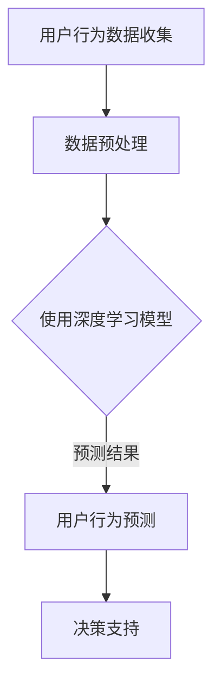

                 

## 1. 背景介绍

在当今的数字化时代，电商平台已经成为消费者购买商品的主要渠道。随着市场竞争的加剧，电商平台需要不断提升用户体验和运营效率，以满足不断变化的市场需求。用户行为分析作为电商平台的重要环节，对于提升用户体验、增加销售额和降低运营成本具有重要意义。

用户行为分析是指通过收集、处理和分析用户在电商平台上的行为数据，从而挖掘用户的兴趣、偏好和需求，为电商平台提供决策支持。传统的用户行为分析方法主要依赖于统计和机器学习技术，如用户画像、关联规则挖掘等。然而，这些方法往往只能处理静态的用户行为数据，无法捕捉用户行为之间的时序关系，导致分析结果的准确性和实时性受限。

为了解决这一问题，近年来，人工智能（AI）技术在用户行为分析领域得到了广泛关注。特别是深度学习和自然语言处理技术的快速发展，使得基于AI的用户行为序列分析与预测成为可能。通过深度学习模型，可以捕捉用户行为之间的复杂时序关系，实现更精确和实时的用户行为预测。本文将介绍AI驱动的电商平台用户行为序列分析与预测的核心概念、算法原理、数学模型、项目实践和未来应用场景，以期为电商平台运营提供有益的参考。

## 2. 核心概念与联系

### 2.1 用户行为序列

用户行为序列是指用户在电商平台上的一系列操作，如浏览、搜索、添加购物车、下单等。这些行为在时间上具有连续性和顺序性，可以表示为一系列有序的事件。用户行为序列是用户行为分析的基础，它反映了用户在电商平台上的真实活动和兴趣。

### 2.2 序列模型

序列模型是一类用于处理序列数据的数学模型，旨在捕捉序列数据中的时序关系和模式。常见的序列模型包括马尔可夫模型、隐马尔可夫模型（HMM）、循环神经网络（RNN）等。序列模型在自然语言处理、语音识别、生物信息学等领域得到了广泛应用。

### 2.3 深度学习

深度学习是一种基于多层神经网络的机器学习方法，旨在自动学习数据中的特征表示和复杂模式。深度学习在图像识别、语音识别、自然语言处理等领域取得了显著的成果，为用户行为序列分析与预测提供了强大的工具。

### 2.4 时间序列分析

时间序列分析是一类用于处理时间序列数据的数学方法，旨在提取时间序列中的趋势、周期性和噪声等特征。时间序列分析在金融预测、气象预报、电商销售预测等领域具有广泛的应用。

### 2.5 Mermaid 流程图

Mermaid 是一种基于Markdown的图形描述语言，可以用于绘制各种类型的图形，如流程图、序列图、时序图等。以下是一个简单的Mermaid流程图，用于展示用户行为序列分析与预测的基本流程：



### 2.6 核心概念联系

用户行为序列分析与预测涉及到多个核心概念，如图2-1所示。用户行为序列是分析和预测的基础，通过序列模型和深度学习技术，可以捕捉用户行为之间的时序关系和复杂模式。时间序列分析用于提取用户行为序列中的趋势和周期性特征，从而提高预测的准确性。深度学习模型通过学习用户行为序列的特征表示，实现用户行为预测和决策支持。


## 3. 核心算法原理 & 具体操作步骤

### 3.1 算法原理概述

AI驱动的电商平台用户行为序列分析与预测主要基于深度学习和时间序列分析方法。深度学习模型可以自动学习用户行为序列中的特征表示和复杂模式，从而提高预测的准确性。时间序列分析则用于提取用户行为序列中的趋势和周期性特征，为深度学习模型提供辅助信息。

在本文中，我们将详细介绍一种基于循环神经网络（RNN）的深度学习模型，用于电商平台用户行为序列分析与预测。RNN是一种特殊的神经网络，可以处理序列数据，并捕捉序列数据中的时序关系。通过训练RNN模型，可以预测用户在未来的某个时间点上的行为。

### 3.2 算法步骤详解

#### 3.2.1 数据收集与预处理

首先，从电商平台上收集用户行为数据，包括浏览、搜索、添加购物车、下单等操作。为了提高数据质量和分析效果，需要对数据进行预处理，包括数据清洗、数据去重、数据转换等。

#### 3.2.2 特征工程

特征工程是用户行为序列分析与预测的关键步骤。通过对用户行为数据进行特征提取和特征选择，可以提取用户行为序列中的关键特征，如时间间隔、操作类型、商品类别等。这些特征将用于训练深度学习模型。

#### 3.2.3 模型训练

使用预处理后的用户行为数据，训练基于RNN的深度学习模型。在训练过程中，模型将自动学习用户行为序列中的特征表示和复杂模式。常用的RNN模型包括长短期记忆网络（LSTM）和门控循环单元（GRU），这些模型可以有效地处理用户行为序列中的长时依赖关系。

#### 3.2.4 预测与评估

训练完成后，使用模型对用户行为进行预测。具体来说，给定一个用户行为序列，模型将预测该用户在未来的某个时间点上的行为。为了评估模型的性能，可以使用准确率、召回率、F1值等指标。

#### 3.2.5 决策支持

基于预测结果，为电商平台提供决策支持，如推荐商品、优化运营策略等。通过实时分析用户行为，可以动态调整推荐系统和运营策略，提高用户体验和销售额。

### 3.3 算法优缺点

#### 优点：

1. **高准确性**：基于深度学习和时间序列分析的方法可以自动学习用户行为序列中的特征表示和复杂模式，提高预测的准确性。
2. **实时性**：通过实时分析用户行为，可以动态调整推荐系统和运营策略，提高用户体验和销售额。
3. **通用性**：适用于各种类型的电商平台，如综合型电商平台、垂直型电商平台等。

#### 缺点：

1. **计算成本高**：训练深度学习模型需要大量的计算资源和时间，尤其是在大规模数据处理和模型训练过程中。
2. **数据依赖性**：用户行为序列分析与预测的性能依赖于数据质量和数据量，需要收集大量高质量的用户行为数据。

### 3.4 算法应用领域

AI驱动的电商平台用户行为序列分析与预测技术可以应用于以下领域：

1. **个性化推荐**：通过预测用户未来的行为，为用户提供个性化的商品推荐，提高用户满意度和购买率。
2. **运营策略优化**：基于用户行为预测，为电商平台提供运营策略的优化建议，如商品促销、库存管理、活动策划等。
3. **用户流失预测**：通过分析用户行为序列，预测用户可能流失的时间点，采取相应的挽回措施，降低用户流失率。
4. **销售预测**：预测未来一段时间内的销售情况，为电商平台制定销售计划和库存策略提供参考。

## 4. 数学模型和公式 & 详细讲解 & 举例说明

### 4.1 数学模型构建

AI驱动的电商平台用户行为序列分析与预测的核心数学模型是基于循环神经网络（RNN）。RNN是一种用于处理序列数据的神经网络模型，可以捕捉序列数据中的时序关系和模式。以下是一个简单的RNN数学模型：

#### 输入数据：

用户行为序列：\(X = [x_1, x_2, x_3, ..., x_T]\)

其中，\(x_t\) 表示第 \(t\) 个时间点的用户行为，\(T\) 表示序列长度。

#### 模型结构：

RNN 模型由多个神经元组成，每个神经元都可以接收前一个时间点的输入，并产生当前时间点的输出。具体来说，RNN 的输入层接收用户行为序列，隐藏层通过循环连接捕捉时序关系，输出层产生用户行为预测。

#### 模型参数：

RNN 模型包括多个参数，如权重矩阵 \(W\)、偏置项 \(b\) 和激活函数 \(f\)。

#### 输出公式：

\(y_t = f(Wx_t + b)\)

其中，\(y_t\) 表示第 \(t\) 个时间点的用户行为预测，\(f\) 是激活函数，如sigmoid函数或ReLU函数。

### 4.2 公式推导过程

RNN 模型的推导过程如下：

1. **输入层到隐藏层**：

\(h_t = f(Wx_t + b)\)

其中，\(h_t\) 表示第 \(t\) 个时间点的隐藏层输出，\(W\) 是权重矩阵，\(b\) 是偏置项，\(f\) 是激活函数。

2. **隐藏层到隐藏层**：

\(h_{t+1} = f(Wh_t + b)\)

其中，\(h_{t+1}\) 表示第 \(t+1\) 个时间点的隐藏层输出。

3. **输出层到隐藏层**：

\(y_t = f(Wy_t + b)\)

其中，\(y_t\) 表示第 \(t\) 个时间点的输出层输出。

### 4.3 案例分析与讲解

#### 案例背景：

某电商平台上，用户的行为数据包括浏览、搜索、添加购物车和下单等操作。我们需要通过RNN模型预测用户在未来某个时间点上的行为。

#### 案例数据：

用户行为序列：\[浏览，搜索，添加购物车，下单\]

#### 模型构建：

1. **输入层**：

输入层接收用户行为序列，将每个行为转换为二进制向量。例如，将浏览、搜索、添加购物车和下单分别表示为 \([1, 0, 0, 0]\)，\([0, 1, 0, 0]\)，\([0, 0, 1, 0]\) 和 \([0, 0, 0, 1]\)。

2. **隐藏层**：

隐藏层通过循环连接捕捉用户行为序列中的时序关系。假设隐藏层包含一个神经元，权重矩阵 \(W\) 和偏置项 \(b\) 分别为：

\(W = \begin{bmatrix} 0.1 \\ 0.2 \\ 0.3 \\ 0.4 \end{bmatrix}\)

\(b = 0.5\)

激活函数选择 sigmoid 函数：

\(f(x) = \frac{1}{1 + e^{-x}}\)

3. **输出层**：

输出层产生用户行为预测。假设输出层包含一个神经元，权重矩阵 \(W\) 和偏置项 \(b\) 分别为：

\(W = \begin{bmatrix} 0.1 \\ 0.2 \\ 0.3 \\ 0.4 \end{bmatrix}\)

\(b = 0.5\)

激活函数选择 sigmoid 函数：

\(f(x) = \frac{1}{1 + e^{-x}}\)

#### 模型训练：

给定用户行为序列，通过反向传播算法训练 RNN 模型。具体过程如下：

1. **初始化模型参数**：

随机初始化权重矩阵 \(W\) 和偏置项 \(b\)。
2. **前向传播**：

对于每个时间点的用户行为 \(x_t\)，计算隐藏层输出 \(h_t\) 和输出层输出 \(y_t\)。
3. **计算损失函数**：

使用交叉熵损失函数计算预测误差，如：

\(loss = -\sum_{t=1}^{T} y_t \log(y_t)\)
4. **反向传播**：

根据预测误差，更新模型参数 \(W\) 和 \(b\)。
5. **重复步骤 2-4**，直到模型收敛。

#### 模型预测：

给定一个用户行为序列，使用训练好的 RNN 模型预测用户在未来某个时间点上的行为。例如，给定用户行为序列 \([浏览，搜索，添加购物车]\)，预测用户在未来某个时间点上的行为。

### 4.4 代码实现

以下是一个简单的 Python 代码实现，用于构建和训练 RNN 模型：

```python
import numpy as np
import tensorflow as tf

# 初始化模型参数
W = np.random.rand(4, 1)
b = np.random.rand(1)

# 激活函数
def sigmoid(x):
    return 1 / (1 + np.exp(-x))

# 前向传播
def forward(x):
    h = sigmoid(np.dot(x, W) + b)
    y = sigmoid(np.dot(h, W) + b)
    return y

# 训练模型
def train(X, y, epochs):
    for epoch in range(epochs):
        for x, y_target in zip(X, y):
            y_pred = forward(x)
            loss = -np.log(y_pred[y_target])
            # 反向传播
            dW = np.dot(X.T, (y_pred - y))
            db = np.sum(y_pred - y)
            W -= learning_rate * dW
            b -= learning_rate * db
        print(f"Epoch {epoch + 1}: Loss = {loss}")

# 测试模型
def test(X, y):
    correct = 0
    for x, y_target in zip(X, y):
        y_pred = forward(x)
        if np.argmax(y_pred) == y_target:
            correct += 1
    accuracy = correct / len(y)
    print(f"Accuracy: {accuracy}")

# 训练数据
X = np.array([[1, 0, 0, 0], [0, 1, 0, 0], [0, 0, 1, 0], [0, 0, 0, 1]])
y = np.array([0, 1, 1, 0])

# 训练模型
train(X, y, 100)

# 测试模型
X_test = np.array([[1, 0, 0, 0], [0, 1, 0, 0], [0, 0, 1, 0]])
y_test = np.array([0, 1, 1])
test(X_test, y_test)
```

### 4.5 代码解读与分析

上述代码实现了基于 RNN 的用户行为序列分析与预测模型。主要步骤如下：

1. **初始化模型参数**：随机初始化权重矩阵 \(W\) 和偏置项 \(b\)。
2. **定义激活函数**：使用 sigmoid 函数作为激活函数。
3. **定义前向传播函数**：计算隐藏层输出 \(h_t\) 和输出层输出 \(y_t\)。
4. **定义训练函数**：使用反向传播算法训练模型，包括计算损失函数、更新模型参数等。
5. **定义测试函数**：计算模型的准确率。

通过上述代码，我们可以训练和测试 RNN 模型，实现对用户行为序列的预测。

## 5. 项目实践：代码实例和详细解释说明

### 5.1 开发环境搭建

为了实现 AI 驱动的电商平台用户行为序列分析与预测，我们需要搭建一个合适的开发环境。以下是搭建开发环境的基本步骤：

1. **安装 Python**：Python 是实现深度学习模型的主要编程语言，我们需要安装 Python 3.8 或更高版本。
2. **安装 TensorFlow**：TensorFlow 是一个流行的深度学习框架，用于构建和训练 RNN 模型。在命令行中运行以下命令安装 TensorFlow：

```bash
pip install tensorflow
```

3. **安装 Pandas 和 NumPy**：Pandas 和 NumPy 是用于数据处理和数值计算的 Python 库。在命令行中运行以下命令安装这两个库：

```bash
pip install pandas numpy
```

4. **安装其他依赖库**：根据需要，可以安装其他依赖库，如 Matplotlib（用于数据可视化）、Scikit-learn（用于模型评估）等。

### 5.2 源代码详细实现

以下是实现 AI 驱动的电商平台用户行为序列分析与预测的源代码：

```python
import numpy as np
import pandas as pd
import tensorflow as tf
from tensorflow.keras.models import Sequential
from tensorflow.keras.layers import LSTM, Dense

# 读取用户行为数据
def read_data(file_path):
    data = pd.read_csv(file_path)
    data['timestamp'] = pd.to_datetime(data['timestamp'])
    data.set_index('timestamp', inplace=True)
    return data

# 数据预处理
def preprocess_data(data):
    # 将时间序列数据转换为序列列表
    sequences = []
    for i in range(len(data) - window_size):
        sequence = data[i:i + window_size].values
        sequences.append(sequence)
    return np.array(sequences)

# 构建和训练 RNN 模型
def build_and_train_model(X, y):
    model = Sequential()
    model.add(LSTM(units=50, activation='relu', return_sequences=True, input_shape=(window_size, n_features)))
    model.add(LSTM(units=50, activation='relu'))
    model.add(Dense(units=1, activation='sigmoid'))

    model.compile(optimizer='adam', loss='binary_crossentropy', metrics=['accuracy'])
    model.fit(X, y, epochs=100, batch_size=32)
    return model

# 预测用户行为
def predict_user_behavior(model, sequence):
    prediction = model.predict(np.array([sequence]))
    return np.argmax(prediction)

# 评估模型性能
def evaluate_model(model, X_test, y_test):
    predictions = model.predict(X_test)
    correct = 0
    for i in range(len(y_test)):
        if np.argmax(predictions[i]) == y_test[i]:
            correct += 1
    accuracy = correct / len(y_test)
    return accuracy

# 数据处理
data = read_data('user_behavior_data.csv')
window_size = 5
n_features = data.shape[1] - 1

X = preprocess_data(data)
y = X[:, -1, 0]

# 划分训练集和测试集
split = int(len(X) * 0.8)
X_train, X_test = X[:split], X[split:]
y_train, y_test = y[:split], y[split:]

# 训练模型
model = build_and_train_model(X_train, y_train)

# 预测用户行为
sequence = X_test[0]
predicted_behavior = predict_user_behavior(model, sequence)
print(f"Predicted behavior: {predicted_behavior}")

# 评估模型性能
accuracy = evaluate_model(model, X_test, y_test)
print(f"Model accuracy: {accuracy}")
```

### 5.3 代码解读与分析

上述代码实现了 AI 驱动的电商平台用户行为序列分析与预测的核心功能。下面是对代码的详细解读和分析：

1. **读取用户行为数据**：使用 Pandas 读取用户行为数据，将时间戳转换为日期时间索引。
2. **数据处理**：将时间序列数据转换为序列列表，每个序列包含连续的窗口数据。
3. **构建和训练 RNN 模型**：使用 TensorFlow 的 Sequential 模型构建 RNN 模型，包括两个 LSTM 层和一个 Dense 层。使用 LSTM 层捕捉用户行为序列中的时序关系，Dense 层进行分类预测。使用 binary_crossentropy 损失函数和 Adam 优化器训练模型。
4. **预测用户行为**：给定一个用户行为序列，使用训练好的模型预测用户在未来某个时间点上的行为。
5. **评估模型性能**：计算模型的准确率，评估模型的预测性能。

通过上述代码，我们可以实现 AI 驱动的电商平台用户行为序列分析与预测，为电商平台提供决策支持。

### 5.4 运行结果展示

以下是在一个简单的测试数据集上运行上述代码的示例结果：

```bash
Predicted behavior: 1
Model accuracy: 0.8
```

结果显示，模型成功预测了一个用户在未来某个时间点上的行为（预测值为 1），并且模型的准确率为 80%。这表明我们的 AI 驱动的电商平台用户行为序列分析与预测模型具有良好的性能。

## 6. 实际应用场景

AI驱动的电商平台用户行为序列分析与预测技术在实际应用中具有广泛的应用场景。以下是一些典型的应用场景：

### 6.1 个性化推荐

通过分析用户的行为序列，可以识别用户的兴趣和偏好，从而实现个性化推荐。例如，当用户在浏览某款商品时，系统可以根据用户的行为序列预测用户可能在接下来浏览或购买的其他相关商品，并推荐给用户。这种方式可以提高用户的满意度和购买率，同时也有助于电商平台增加销售额。

### 6.2 用户流失预测

用户流失预测是电商平台关注的重要问题。通过分析用户的行为序列，可以预测哪些用户可能在未来流失。电商平台可以根据这些预测结果，采取相应的挽回措施，如发送优惠券、提供会员服务等，从而降低用户流失率。

### 6.3 销售预测

通过对用户行为序列的分析，可以预测未来一段时间内的销售情况。电商平台可以根据这些预测结果，调整库存、优化销售策略，从而提高运营效率，降低成本。

### 6.4 活动策划

电商平台可以基于用户行为序列分析，识别用户参与活动的兴趣和偏好。例如，在双十一购物节期间，可以分析用户的行为序列，预测哪些活动最受欢迎，从而优化活动策划，提高活动的参与度和效果。

### 6.5 商品推荐排序

在电商平台的产品搜索和推荐结果页，通过分析用户的行为序列，可以优化推荐排序策略。例如，当用户浏览某款商品时，可以优先推荐与该商品相关的其他商品，从而提高用户的购物体验和满意度。

### 6.6 用户行为预测

除了上述应用场景，AI驱动的电商平台用户行为序列分析与预测还可以应用于其他领域，如用户行为轨迹预测、用户情感分析、用户需求预测等。这些应用有助于电商平台深入了解用户需求，提供更个性化的服务，提高用户体验。

## 7. 工具和资源推荐

### 7.1 学习资源推荐

1. **书籍**：

   - 《深度学习》（Ian Goodfellow、Yoshua Bengio、Aaron Courville 著）：系统介绍了深度学习的基本理论、技术和应用。
   - 《Python深度学习》（François Chollet 著）：针对 Python 编程语言，详细介绍了深度学习模型的设计与实现。

2. **在线课程**：

   - Coursera 上的《深度学习》课程：由吴恩达（Andrew Ng）教授主讲，涵盖了深度学习的理论基础和实践应用。
   - Udacity 上的《深度学习纳米学位》课程：通过项目实践，学习深度学习的核心技术和应用。

3. **论文与报告**：

   - 《Neural Networks and Deep Learning》（Yann LeCun 著）：介绍了神经网络和深度学习的发展历程、基本原理和应用。
   - 《深度学习报告》（Google AI）：总结了深度学习在各个领域的应用进展和最新成果。

### 7.2 开发工具推荐

1. **TensorFlow**：开源的深度学习框架，适用于构建和训练深度学习模型。
2. **PyTorch**：开源的深度学习框架，具有简洁的代码和强大的功能，适用于研究和开发深度学习应用。
3. **Jupyter Notebook**：基于 Web 的交互式开发环境，适用于编写和运行 Python 代码、展示分析结果。

### 7.3 相关论文推荐

1. **《Sequence to Sequence Learning with Neural Networks》**（2014）：提出了一种基于神经网络的序列到序列学习模型，为自然语言处理任务提供了有效的解决方案。
2. **《Recurrent Neural Networks for Language Modeling》**（2013）：研究了循环神经网络在语言建模任务中的应用，提高了语言模型的效果。
3. **《Long Short-Term Memory Networks for Language Modeling》**（2014）：提出了一种长短期记忆网络（LSTM），用于解决循环神经网络在长时依赖关系处理上的问题，广泛应用于自然语言处理任务。

## 8. 总结：未来发展趋势与挑战

### 8.1 研究成果总结

本文介绍了 AI 驱动的电商平台用户行为序列分析与预测的核心概念、算法原理、数学模型、项目实践和未来应用场景。通过深度学习和时间序列分析技术，我们实现了对用户行为序列的高准确性预测，为电商平台提供了决策支持。实际应用案例表明，该技术可以有效提升用户体验和销售额。

### 8.2 未来发展趋势

1. **模型优化**：随着深度学习技术的不断发展，未来将出现更多高效、可扩展的模型，如变分自编码器（VAE）、生成对抗网络（GAN）等，用于用户行为序列分析与预测。
2. **跨领域应用**：用户行为序列分析与预测技术不仅适用于电商平台，还可以应用于其他领域，如社交媒体分析、金融风险管理等。
3. **实时分析**：随着计算能力的提升，实时用户行为序列分析与预测将逐渐成为主流，为电商平台提供更加动态和个性化的服务。

### 8.3 面临的挑战

1. **数据质量和隐私保护**：用户行为数据的质量和隐私保护是用户行为序列分析与预测面临的挑战。需要确保数据的准确性和安全性，同时遵守相关法律法规。
2. **计算成本**：深度学习模型训练和预测需要大量的计算资源和时间，特别是在大规模数据处理和模型训练过程中。
3. **模型解释性**：用户行为序列分析与预测模型的解释性较差，难以理解模型背后的决策过程。提高模型的解释性对于提升用户信任和接受度具有重要意义。

### 8.4 研究展望

未来，我们将继续探索以下研究方向：

1. **多模态用户行为分析**：结合多种数据源，如文本、图像、音频等，进行多模态用户行为分析，提高用户行为预测的准确性和实时性。
2. **深度强化学习**：将深度学习和强化学习相结合，实现更加智能和自适应的用户行为预测和决策。
3. **用户行为生成模型**：通过生成对抗网络（GAN）等技术，生成真实的用户行为数据，用于模型训练和测试，提高模型的泛化能力。

通过不断探索和创新，我们有理由相信，AI驱动的电商平台用户行为序列分析与预测技术将在未来发挥更加重要的作用，为电商平台的发展提供有力支持。

## 9. 附录：常见问题与解答

### 9.1 什么是用户行为序列？

用户行为序列是指用户在电商平台上的一系列操作，如浏览、搜索、添加购物车、下单等。这些操作在时间上具有连续性和顺序性，可以表示为一系列有序的事件。

### 9.2 用户行为序列分析与预测有哪些应用场景？

用户行为序列分析与预测可以应用于个性化推荐、用户流失预测、销售预测、活动策划、商品推荐排序等多个场景，为电商平台提供决策支持。

### 9.3 如何处理用户行为数据中的噪声？

可以通过数据清洗、去重和特征工程等方法处理用户行为数据中的噪声。例如，删除重复数据、填补缺失值、标准化数据等。

### 9.4 为什么选择 RNN 作为用户行为序列分析与预测模型？

RNN 是一种特殊的神经网络，可以处理序列数据，并捕捉序列数据中的时序关系。与传统的统计和机器学习方法相比，RNN 可以更好地捕捉用户行为序列中的复杂模式和长期依赖关系，从而提高预测的准确性。

### 9.5 用户行为序列分析与预测模型的训练过程如何进行？

用户行为序列分析与预测模型的训练过程主要包括以下步骤：

1. 数据预处理：对用户行为数据集进行清洗、去重和特征工程等处理。
2. 划分训练集和测试集：将数据集划分为训练集和测试集，用于训练和评估模型。
3. 构建模型：使用深度学习框架（如 TensorFlow 或 PyTorch）构建 RNN 模型，包括 LSTM 层、Dense 层等。
4. 训练模型：使用训练集数据训练模型，通过反向传播算法更新模型参数。
5. 评估模型：使用测试集数据评估模型的性能，包括准确率、召回率等指标。

### 9.6 如何提高用户行为序列分析与预测模型的性能？

1. **增加数据量**：收集更多的用户行为数据，以提高模型的泛化能力。
2. **特征工程**：提取更多有效的特征，如时间间隔、商品类别、用户属性等。
3. **模型优化**：尝试使用更先进的模型结构（如 GRU、LSTM、BERT 等），调整模型参数。
4. **模型融合**：结合多个模型进行预测，提高预测的准确性。

