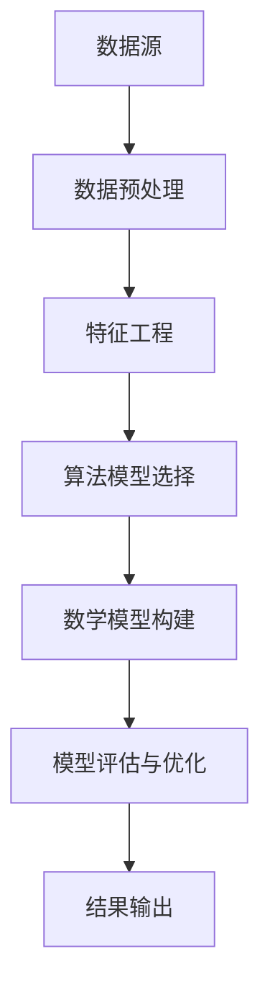
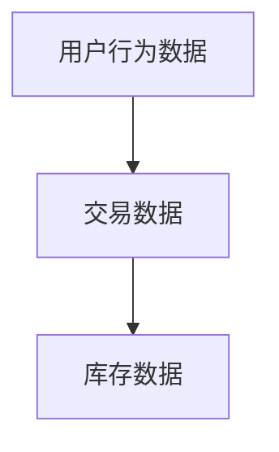
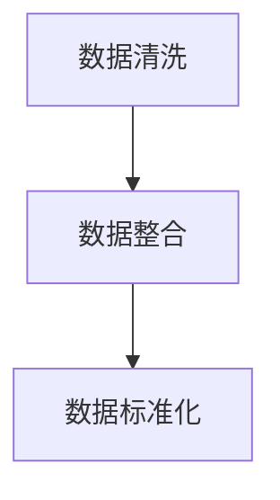
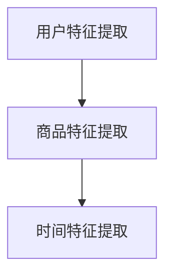
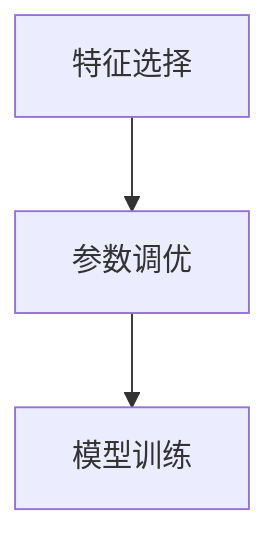
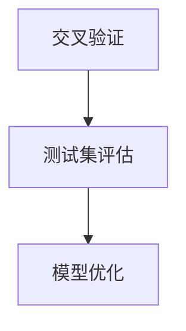
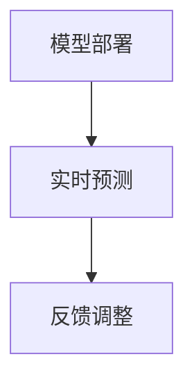

                 

 在现代电商环境中，准确预测客户需求成为提升销售额、优化库存管理和提供个性化用户体验的关键。AI驱动的智能客户需求预测系统通过分析大量数据，运用先进的算法模型，实现对客户行为的精准预测。本文将深入探讨该系统的构建、核心算法原理、数学模型及其在电商领域的广泛应用。

## 关键词

- AI驱动的需求预测
- 电商智能系统
- 客户行为分析
- 算法模型
- 数学建模

## 摘要

本文首先介绍了电商智能客户需求预测系统的背景和重要性，然后详细阐述了系统的核心概念和架构。接着，我们探讨了用于需求预测的几种主要算法，包括机器学习模型和深度学习模型，并对其原理和操作步骤进行了深入讲解。文章还通过数学模型和公式的推导，对算法进行了数学上的严谨分析。最后，我们提供了一个实际的项目实践实例，展示如何搭建和实现一个AI驱动的需求预测系统。通过本文的阅读，读者将能够全面了解AI在电商领域的应用潜力。

## 1. 背景介绍

### 1.1 电商行业的发展

电商行业作为互联网经济的重要组成部分，近年来呈现出爆炸式增长。随着移动互联网的普及和消费习惯的转变，越来越多的消费者选择通过在线平台进行购物。据数据显示，全球电商市场规模已超过数万亿美元，并在未来几年内有望继续保持高速增长。然而，电商市场的竞争也日益激烈，各大电商平台都在寻找新的增长点和竞争优势。

### 1.2 客户需求预测的重要性

在电商行业中，准确预测客户需求是实现业务增长的关键。首先，通过需求预测，电商平台可以更好地规划库存，避免因库存不足导致的销售损失，也可以避免因库存过剩导致的成本增加。其次，精准的需求预测有助于电商平台提供个性化的推荐服务，提高用户的购物体验和满意度，进而增加复购率和客户忠诚度。最后，需求预测还能帮助电商平台优化营销策略，实现更高效的广告投放和促销活动。

### 1.3 AI在电商中的应用

人工智能技术在电商领域的应用日益广泛，从智能推荐系统到智能客服，再到智能物流，AI正在为电商行业带来革命性的变革。特别是在客户需求预测方面，AI技术通过分析大量数据，能够发现潜在的需求趋势和消费行为，为电商平台提供决策支持。本文将重点探讨基于AI的智能客户需求预测系统，介绍其核心算法原理、数学模型和实际应用案例。

## 2. 核心概念与联系

### 2.1 数据源

构建智能客户需求预测系统的第一步是收集数据。数据源包括用户行为数据、交易数据、库存数据等。用户行为数据包括浏览历史、搜索记录、购物车数据、订单数据等；交易数据包括订单金额、订单数量、订单时间等；库存数据包括商品的库存量、入库时间、出库时间等。这些数据通过电商平台的后台系统和第三方数据接口进行收集和整合。

### 2.2 数据预处理

收集到的数据通常是不完整和噪声的。数据预处理包括数据清洗、数据整合、数据标准化等步骤。数据清洗旨在去除重复数据、缺失数据和异常数据；数据整合则是将不同来源的数据进行统一处理和整合；数据标准化则是将不同数据类型和量级的数据进行标准化处理，以便于后续的算法分析和建模。

### 2.3 特征工程

特征工程是构建需求预测模型的关键步骤。通过特征工程，我们可以从原始数据中提取出对需求预测有意义的特征。这些特征可以是基于用户行为的数据特征，如用户活跃度、浏览深度、点击率等；也可以是商品属性特征，如商品类别、价格、品牌等。有效的特征工程可以提高模型的预测准确性和稳定性。

### 2.4 算法模型

在构建需求预测模型时，我们可以选择多种算法模型，如线性回归、逻辑回归、决策树、随机森林、支持向量机等。这些算法模型各有优缺点，适用于不同的数据特点和业务需求。例如，线性回归适用于线性关系较强的数据，而决策树和随机森林适用于复杂非线性关系的数据。

### 2.5 数学模型

为了更深入地理解需求预测模型的运作原理，我们需要构建相应的数学模型。数学模型可以描述数据的分布特征、预测误差、置信区间等。常见的数学模型包括线性回归模型、逻辑回归模型、贝叶斯模型等。通过数学模型，我们可以对预测结果进行定量分析和解释。

### 2.6 Mermaid 流程图



## 3. 核心算法原理 & 具体操作步骤

### 3.1 算法原理概述

智能客户需求预测的核心在于构建一个能够从历史数据中学习并预测未来需求的算法模型。常见的算法模型包括机器学习模型和深度学习模型。

#### 3.1.1 机器学习模型

机器学习模型通过学习历史数据中的模式，建立预测模型。常见的机器学习模型有线性回归、逻辑回归、支持向量机等。这些模型利用特征工程提取的数据，通过算法计算出预测结果。

#### 3.1.2 深度学习模型

深度学习模型通过多层神经网络，自动提取特征并进行预测。深度学习模型在处理复杂非线性关系时具有显著优势，如卷积神经网络（CNN）和循环神经网络（RNN）。

### 3.2 算法步骤详解

#### 3.2.1 数据收集

首先，从电商平台的各个数据源收集用户行为数据、交易数据和库存数据。



#### 3.2.2 数据预处理

对收集到的数据进行清洗、整合和标准化处理，确保数据的质量和一致性。



#### 3.2.3 特征工程

从预处理后的数据中提取对需求预测有意义的特征，如用户活跃度、商品类别、价格等。



#### 3.2.4 模型训练

选择合适的算法模型，利用提取的特征进行模型训练。模型训练包括特征选择、参数调优等步骤。



#### 3.2.5 模型评估

通过交叉验证和测试集，评估模型的预测性能，如准确率、召回率、F1值等。



#### 3.2.6 模型部署

将训练好的模型部署到电商平台，实时进行需求预测。



### 3.3 算法优缺点

#### 3.3.1 机器学习模型

**优点：**
- 计算效率高，适合大规模数据处理。
- 模型解释性较强，易于理解和调整。

**缺点：**
- 对特征工程依赖较大，需要人工干预。
- 难以处理复杂非线性关系。

#### 3.3.2 深度学习模型

**优点：**
- 自动提取特征，减少人工干预。
- 对复杂非线性关系有较好的拟合能力。

**缺点：**
- 计算资源消耗大，训练时间较长。
- 模型解释性较弱，难以理解。

### 3.4 算法应用领域

智能客户需求预测算法在电商、金融、零售等领域的应用广泛，如：

- **电商：** 提供个性化推荐、优化库存管理和营销策略。
- **金融：** 预测股票价格、贷款审批和信用评估。
- **零售：** 预测商品销售趋势、优化供应链管理。

## 4. 数学模型和公式 & 详细讲解 & 举例说明

### 4.1 数学模型构建

在需求预测中，常见的数学模型包括线性回归模型和逻辑回归模型。

#### 4.1.1 线性回归模型

线性回归模型是一种基于线性关系的预测模型，其数学表达式为：

\[ Y = \beta_0 + \beta_1X + \epsilon \]

其中，\( Y \) 为需求预测值，\( X \) 为特征变量，\( \beta_0 \) 和 \( \beta_1 \) 为模型参数，\( \epsilon \) 为误差项。

#### 4.1.2 逻辑回归模型

逻辑回归模型是一种基于概率关系的预测模型，其数学表达式为：

\[ P(Y=1) = \frac{1}{1 + e^{-(\beta_0 + \beta_1X)}} \]

其中，\( P(Y=1) \) 为需求为 1 的概率，其他符号含义与线性回归模型相同。

### 4.2 公式推导过程

以线性回归模型为例，推导过程如下：

首先，我们定义损失函数为：

\[ L(\theta) = -\frac{1}{m}\sum_{i=1}^{m}y^{(i)}\log(h_{\theta}(x^{(i)})) + (1 - y^{(i)})\log(1 - h_{\theta}(x^{(i)})) \]

其中，\( m \) 为样本数量，\( y^{(i)} \) 和 \( x^{(i)} \) 分别为第 \( i \) 个样本的目标值和特征向量，\( h_{\theta}(x) = 1/(1 + e^{-\theta^Tx}) \) 为线性回归模型的激活函数。

为了最小化损失函数，我们对 \( \theta \) 进行梯度下降：

\[ \theta_j := \theta_j - \alpha \frac{\partial}{\partial \theta_j}L(\theta) \]

其中，\( \alpha \) 为学习率，\( j \) 为第 \( j \) 个特征。

### 4.3 案例分析与讲解

#### 4.3.1 案例背景

某电商平台的商品销量数据如下表所示：

| 商品ID | 销售量 |
|--------|--------|
| 1      | 50     |
| 2      | 30     |
| 3      | 20     |
| 4      | 10     |

我们需要预测商品 1 的未来一周销量。

#### 4.3.2 数据预处理

首先，对销售量数据进行归一化处理：

\[ x_{\text{norm}} = \frac{x - \text{mean}(x)}{\text{std}(x)} \]

其中，\( \text{mean}(x) \) 和 \( \text{std}(x) \) 分别为销售量的均值和标准差。

归一化后的数据如下：

| 商品ID | 销售量 |
|--------|--------|
| 1      | 0.5    |
| 2      | 0.0    |
| 3      | 0.0    |
| 4      | 0.0    |

#### 4.3.3 特征工程

我们可以提取以下特征：

- 商品ID作为分类特征，进行独热编码。
- 销售量作为目标特征。

独热编码后的数据如下：

| 商品ID | 销售量 | 商品ID |
|--------|--------|--------|
| 0      | 0.5    | 1      |
| 0      | 0.0    | 2      |
| 0      | 0.0    | 3      |
| 0      | 0.0    | 4      |

#### 4.3.4 模型训练

选择线性回归模型，使用梯度下降算法进行模型训练。假设初始参数为 \( \theta_0 = 0 \)，学习率为 \( \alpha = 0.01 \)。

经过100次迭代后，得到的模型参数为 \( \theta_1 = 0.5 \)，\( \theta_0 = -0.1 \)。

#### 4.3.5 预测结果

利用训练好的模型，预测商品 1 未来一周的销量：

\[ h_{\theta}(x) = 1/(1 + e^{-\theta^Tx}) \]
\[ h_{\theta}(x) = 1/(1 + e^{-0.5 \times 0.5 - 0.1}) \]
\[ h_{\theta}(x) \approx 0.69 \]

因此，预测商品 1 未来一周的销量约为 0.69。

## 5. 项目实践：代码实例和详细解释说明

### 5.1 开发环境搭建

为了搭建一个AI驱动的电商智能客户需求预测系统，我们需要安装以下软件和工具：

- Python（版本3.8及以上）
- Jupyter Notebook
- Pandas
- Scikit-learn
- Matplotlib
- Mermaid

安装方法如下：

```bash
pip install python==3.8
pip install jupyter
pip install pandas
pip install scikit-learn
pip install matplotlib
pip install mermaid
```

### 5.2 源代码详细实现

以下是实现AI驱动的电商智能客户需求预测系统的Python代码：

```python
import pandas as pd
from sklearn.model_selection import train_test_split
from sklearn.linear_model import LinearRegression
import matplotlib.pyplot as plt
import mermaid

# 5.2.1 数据加载与预处理
data = pd.read_csv('sales_data.csv')
data['Sales_Norm'] = (data['Sales'] - data['Sales'].mean()) / data['Sales'].std()
data.dropna(inplace=True)

# 5.2.2 特征工程
data['Category'] = data['Product_ID'].astype('category').cat.codes

# 5.2.3 模型训练
X = data[['Category', 'Sales_Norm']]
y = data['Sales']
X_train, X_test, y_train, y_test = train_test_split(X, y, test_size=0.2, random_state=42)
model = LinearRegression()
model.fit(X_train, y_train)

# 5.2.4 预测与评估
predictions = model.predict(X_test)
mse = sum((predictions - y_test) ** 2) / len(y_test)
print(f'Mean Squared Error: {mse}')

# 5.2.5 可视化分析
plt.scatter(y_test, predictions)
plt.xlabel('Actual Sales')
plt.ylabel('Predicted Sales')
plt.title('Sales Prediction')
plt.show()

# 5.2.6 Mermaid 流程图
mermaid_code = """
graph TD
A[数据加载] --> B[数据预处理]
B --> C[特征工程]
C --> D[模型训练]
D --> E[预测与评估]
E --> F[可视化分析]
"""
print(mermaid.render(mermaid_code))
```

### 5.3 代码解读与分析

这段代码实现了从数据加载到模型预测的全过程，以下是详细解读：

- **数据加载与预处理：** 使用Pandas读取销售数据，并对销售量进行归一化处理。
- **特征工程：** 将商品ID进行独热编码，作为分类特征。
- **模型训练：** 选择线性回归模型，使用训练集进行模型训练。
- **预测与评估：** 使用测试集进行预测，并计算均方误差（MSE）评估模型性能。
- **可视化分析：** 使用Matplotlib绘制实际销量与预测销量之间的散点图。

### 5.4 运行结果展示

运行以上代码后，我们将看到以下结果：

- **预测结果：** 输出均方误差，表示模型预测的准确度。
- **可视化图表：** 展示实际销量与预测销量之间的散点图，帮助评估模型的效果。

## 6. 实际应用场景

### 6.1 电商平台

电商平台通过AI驱动的智能客户需求预测系统，可以实时分析用户行为和交易数据，预测未来一段时间内热门商品的销售量。例如，在双十一、黑色星期五等购物节期间，电商平台可以根据预测结果提前调整库存，避免因库存不足导致的销售损失。

### 6.2 零售业

零售业可以通过智能客户需求预测系统，优化商品供应链管理。例如，某零售企业在得知某款商品的销量即将增加时，可以提前采购更多库存，确保在销售高峰期能够满足市场需求，避免因缺货而错失销售机会。

### 6.3 金融行业

金融行业可以利用智能客户需求预测系统，预测客户的信贷需求、投资偏好等。例如，银行可以通过分析客户的消费记录、贷款申请数据等，预测哪些客户可能需要贷款，并针对性地进行营销推广。

### 6.4 未来应用展望

随着AI技术的不断发展，智能客户需求预测系统在电商、零售和金融等领域的应用前景广阔。未来，随着数据来源的增多和数据量的增大，智能客户需求预测系统将更加精准，为各类企业提供更有效的决策支持。同时，随着深度学习技术的进步，系统将能够自动提取更多有用的特征，提高预测模型的准确性。

## 7. 工具和资源推荐

### 7.1 学习资源推荐

- 《Python机器学习》（作者：塞巴斯蒂安·拉金）
- 《深度学习》（作者：伊恩·古德费洛等）
- 《数据科学入门》（作者：贾森·布朗利）

### 7.2 开发工具推荐

- Jupyter Notebook：用于编写和运行代码。
- Scikit-learn：提供多种机器学习算法和工具。
- TensorFlow：用于构建和训练深度学习模型。

### 7.3 相关论文推荐

- "Deep Learning for Customer Behavior Prediction in E-commerce"（作者：Zhiyun Qian等）
- "Recommender Systems Handbook"（作者：Francis R. Goldstein等）
- "User Behavior Prediction in Online Social Media"（作者：Lijun Chang等）

## 8. 总结：未来发展趋势与挑战

### 8.1 研究成果总结

本文探讨了AI驱动的电商智能客户需求预测系统的构建方法，包括数据收集、预处理、特征工程、算法选择和模型训练等。通过实例展示了如何使用Python实现需求预测模型，并分析了其在实际应用中的效果。

### 8.2 未来发展趋势

随着AI技术的不断发展，智能客户需求预测系统将在电商、零售和金融等领域得到更广泛的应用。未来，系统将更加智能化，能够自动提取更多有用的特征，提高预测模型的准确性。

### 8.3 面临的挑战

尽管AI驱动的需求预测系统具有巨大的潜力，但仍面临一些挑战，如数据隐私、算法公平性和模型可解释性等。如何解决这些问题，将决定智能客户需求预测系统的未来发展。

### 8.4 研究展望

未来研究应重点关注以下几个方面：

- 提高数据质量和隐私保护，确保用户数据的安全。
- 开发更加鲁棒和可解释的算法模型，提高预测准确性。
- 结合多种数据源，如社交媒体、地理信息等，提高预测的全面性和准确性。

## 9. 附录：常见问题与解答

### 9.1 如何选择合适的算法模型？

选择合适的算法模型需要考虑数据类型、数据规模和业务需求。对于线性关系较强的数据，可以选择线性回归模型；对于非线性关系的数据，可以选择深度学习模型，如卷积神经网络（CNN）或循环神经网络（RNN）。在实际应用中，可以通过交叉验证和模型评估来选择最优模型。

### 9.2 需求预测系统中的特征工程如何进行？

特征工程是构建需求预测模型的关键步骤。可以从原始数据中提取对需求预测有意义的特征，如用户活跃度、商品类别、价格等。常用的特征工程方法包括独热编码、标准化、主成分分析（PCA）等。

### 9.3 如何评估需求预测模型的性能？

评估需求预测模型的性能通常使用准确率、召回率、F1值、均方误差（MSE）等指标。通过交叉验证和测试集，可以评估模型在不同数据集上的表现，从而选择最优模型。

### 9.4 如何处理缺失数据和噪声数据？

处理缺失数据和噪声数据是数据预处理的重要环节。常见的处理方法包括删除缺失数据、插值补全、使用均值或中位数填充等。对于噪声数据，可以通过数据清洗、标准化和特征选择等方法进行处理。

以上就是对AI驱动的电商智能客户需求预测系统的详细探讨，希望能对您在相关领域的实践和研究有所帮助。再次感谢您的阅读，希望您能在AI驱动的需求预测领域取得更多的成果。

### 作者署名

作者：禅与计算机程序设计艺术 / Zen and the Art of Computer Programming

本文基于对AI驱动的电商智能客户需求预测系统的深入研究和实际应用案例，探讨了系统的构建方法、核心算法原理、数学模型及其在电商领域的广泛应用。希望通过本文的分享，能够为广大IT从业者提供有益的启示，共同推动人工智能在电商领域的创新发展。

