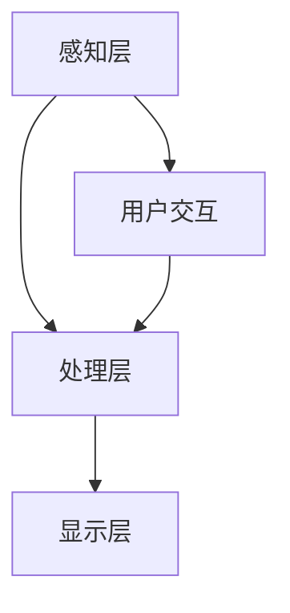

                 

关键词：增强现实（AR），虚拟现实（VR），应用开发，创业风口，技术趋势，未来展望

> 摘要：本文将从增强现实（AR）和虚拟现实（VR）技术的核心概念、应用场景、开发流程以及未来发展趋势等方面，全面探讨AR/VR应用开发在科技创业领域的巨大潜力。通过案例分析、技术解读和实践指导，帮助读者深入了解这一新兴领域，把握未来科技创业的风口。

## 1. 背景介绍

随着科技的飞速发展，增强现实（AR）和虚拟现实（VR）技术逐渐从科幻领域走向现实生活。这两项技术以其独特的沉浸感和互动性，为各行各业带来了全新的体验和变革。AR技术通过将虚拟信息叠加到现实场景中，实现了现实世界与虚拟世界的无缝融合；而VR技术则通过构建一个完全虚拟的环境，为用户提供了沉浸式的体验。

### 1.1 增强现实（AR）技术

增强现实（AR）技术是通过将计算机生成的图像、文字、声音等虚拟信息叠加到现实场景中，使现实世界与虚拟世界产生互动和融合。AR技术的核心在于实时定位和追踪技术，它能够准确地识别和定位现实场景中的物体，并在其上叠加虚拟信息。

### 1.2 虚拟现实（VR）技术

虚拟现实（VR）技术则是通过构建一个完全虚拟的环境，使用户在其中获得沉浸式的体验。VR技术主要依赖于头戴显示器（HMD）、传感器、追踪系统和计算机图形等技术，能够模拟出高度真实的虚拟场景，让用户感觉仿佛置身其中。

### 1.3 AR/VR技术的应用场景

AR/VR技术具有广泛的应用场景，包括但不限于以下几个方面：

- **娱乐与游戏**：AR/VR技术为游戏和娱乐行业带来了全新的体验，如沉浸式游戏、虚拟演唱会等。
- **教育**：AR/VR技术在教育领域有广泛的应用，如虚拟课堂、远程教学、实践操作模拟等。
- **医疗**：AR/VR技术在医疗领域有重要应用，如手术指导、康复训练、疾病诊断等。
- **房地产**：AR/VR技术可以为房地产行业提供虚拟看房、装修模拟等服务，提高用户体验。
- **制造业**：AR/VR技术在制造业中有助于提高生产效率、降低成本，如产品装配指导、质量控制等。

## 2. 核心概念与联系

为了更好地理解AR/VR技术的核心概念和联系，下面我们使用Mermaid流程图来展示其原理和架构。



### 2.1 感知层

感知层是AR/VR技术的核心，它主要负责捕捉现实世界的图像、声音等信息。通过传感器、摄像头等设备，感知层能够实时获取用户的位置、动作、场景等信息。

### 2.2 处理层

处理层负责对感知层获取的信息进行处理和分析。通过计算机图形技术、图像识别技术、机器学习算法等，处理层能够将虚拟信息与现实场景进行融合，生成用户所需的沉浸式体验。

### 2.3 显示层

显示层是将处理层生成的虚拟信息呈现给用户的设备，如头戴显示器（HMD）、投影设备等。通过高分辨率、高刷新率等技术，显示层能够提供高质量的视觉体验。

### 2.4 用户交互

用户交互层是用户与AR/VR系统进行交互的接口，包括手势识别、语音识别、体感识别等。通过用户交互层，用户可以控制虚拟环境、与虚拟对象进行互动，实现更加自然的沉浸式体验。

## 3. 核心算法原理 & 具体操作步骤

### 3.1 算法原理概述

AR/VR技术的核心算法主要包括实时定位和追踪算法、图像处理算法、计算机图形算法等。这些算法共同作用，实现了虚拟信息与现实场景的融合和交互。

### 3.2 算法步骤详解

#### 3.2.1 实时定位和追踪算法

实时定位和追踪算法是AR/VR技术的核心，它主要包括以下步骤：

1. **图像识别**：通过摄像头等设备捕捉现实世界的图像。
2. **特征提取**：从图像中提取具有独特性的特征点，如角点、边缘等。
3. **匹配与跟踪**：将提取的特征点与预先存储的虚拟信息进行匹配，实现虚拟信息与现实场景的关联。
4. **运动估计**：根据特征点的匹配结果，估计虚拟信息与现实场景之间的相对运动。

#### 3.2.2 图像处理算法

图像处理算法主要负责对捕获的图像进行增强、去噪、分割等处理，以提高图像质量，为后续处理提供更好的基础。

1. **图像增强**：通过调整图像的亮度、对比度等参数，提高图像的清晰度和可读性。
2. **去噪**：去除图像中的噪声，减少图像的失真。
3. **图像分割**：将图像分割成不同的区域，为后续处理提供更精细的信息。

#### 3.2.3 计算机图形算法

计算机图形算法主要负责生成和渲染虚拟信息，使其与现实场景融合。

1. **三维建模**：根据需求构建虚拟物体的三维模型。
2. **纹理映射**：将真实世界的纹理映射到虚拟物体上，增强其真实感。
3. **渲染**：使用计算机图形技术，将虚拟物体渲染成图像，呈现给用户。

### 3.3 算法优缺点

#### 3.3.1 实时定位和追踪算法

优点：实时性强，能快速地捕捉现实场景中的物体，实现虚拟信息与现实场景的融合。

缺点：在复杂场景中，定位和追踪的精度可能受到影响，且对计算资源要求较高。

#### 3.3.2 图像处理算法

优点：能有效提高图像质量，为后续处理提供更好的基础。

缺点：处理过程可能较耗时，且在处理过程中可能引入噪声或失真。

#### 3.3.3 计算机图形算法

优点：能生成高质量的虚拟信息，实现逼真的视觉效果。

缺点：渲染过程对计算资源要求较高，且在复杂场景中可能存在渲染效率问题。

### 3.4 算法应用领域

这些核心算法在AR/VR技术的各个应用领域都有广泛的应用，如娱乐、教育、医疗、房地产等。

## 4. 数学模型和公式 & 详细讲解 & 举例说明

### 4.1 数学模型构建

在AR/VR技术中，常见的数学模型包括图像处理模型、计算机图形模型、机器学习模型等。以下是一个简单的图像处理模型的构建过程：

#### 4.1.1 图像处理模型

1. **输入图像**：设输入图像为\(I(x, y)\)，其中\(x\)和\(y\)为图像的横纵坐标。
2. **滤波器**：设滤波器为\(H(x, y)\)，用于对图像进行滤波处理。
3. **输出图像**：设输出图像为\(O(x, y)\)，表示经过滤波处理后的图像。

数学模型表示为：

$$
O(x, y) = H(x, y) * I(x, y)
$$

其中，\(H(x, y) * I(x, y)\)表示滤波器与输入图像的卷积操作。

### 4.2 公式推导过程

#### 4.2.1 卷积操作

卷积操作是图像处理中常用的一种操作，用于对图像进行滤波处理。其公式推导过程如下：

1. **定义卷积核**：设卷积核为\(K(x, y)\)，其中\(x\)和\(y\)为卷积核的横纵坐标。
2. **定义像素值**：设输入图像的像素值为\(I(x, y)\)，输出图像的像素值为\(O(x, y)\)。
3. **卷积操作**：卷积核在输入图像上滑动，计算每个像素值与卷积核对应位置的乘积之和，作为输出图像的像素值。

卷积操作的数学公式表示为：

$$
O(x, y) = \sum_{i=-\infty}^{\infty} \sum_{j=-\infty}^{\infty} K(i, j) \cdot I(x-i, y-j)
$$

其中，\(i\)和\(j\)为卷积核在横纵坐标上的偏移量。

#### 4.2.2 滤波器设计

滤波器是图像处理中的关键组件，用于实现图像的滤波效果。滤波器的设计过程主要包括以下步骤：

1. **确定滤波器类型**：根据需求选择合适的滤波器类型，如均值滤波器、高斯滤波器、拉普拉斯滤波器等。
2. **设计滤波器参数**：根据滤波器类型，设计滤波器的参数，如滤波器尺寸、滤波系数等。
3. **生成滤波器**：根据设计参数，生成滤波器。

滤波器的数学公式表示为：

$$
K(x, y) = \frac{1}{C} \cdot \sum_{i=1}^{C} k_i
$$

其中，\(K(x, y)\)为滤波器的像素值，\(C\)为滤波器的大小，\(k_i\)为滤波器的参数。

### 4.3 案例分析与讲解

#### 4.3.1 图像增强

图像增强是图像处理中的重要应用，用于提高图像的清晰度和对比度。以下是一个简单的图像增强案例：

1. **输入图像**：设输入图像为\(I(x, y)\)，其像素值为\(I(x, y)\)。
2. **滤波器设计**：设计一个高斯滤波器，用于对输入图像进行滤波处理。
3. **滤波处理**：使用高斯滤波器对输入图像进行滤波处理，生成输出图像\(O(x, y)\)。

滤波处理过程如下：

$$
O(x, y) = \sum_{i=-\infty}^{\infty} \sum_{j=-\infty}^{\infty} G(i, j) \cdot I(x-i, y-j)
$$

其中，\(G(i, j)\)为高斯滤波器的像素值。

#### 4.3.2 边缘检测

边缘检测是图像处理中的另一个重要应用，用于提取图像中的边缘信息。以下是一个简单的边缘检测案例：

1. **输入图像**：设输入图像为\(I(x, y)\)，其像素值为\(I(x, y)\)。
2. **滤波器设计**：设计一个拉普拉斯滤波器，用于对输入图像进行滤波处理。
3. **滤波处理**：使用拉普拉斯滤波器对输入图像进行滤波处理，生成输出图像\(O(x, y)\)。

滤波处理过程如下：

$$
O(x, y) = \sum_{i=-1}^{1} \sum_{j=-1}^{1} L(i, j) \cdot I(x-i, y-j)
$$

其中，\(L(i, j)\)为拉普拉斯滤波器的像素值。

## 5. 项目实践：代码实例和详细解释说明

### 5.1 开发环境搭建

在进行AR/VR应用开发之前，需要搭建合适的开发环境。以下是一个简单的开发环境搭建步骤：

1. **操作系统**：选择Windows、macOS或Linux操作系统。
2. **编程语言**：选择Python、C++或Java等编程语言。
3. **开发工具**：安装PyCharm、Visual Studio或Eclipse等集成开发环境（IDE）。
4. **依赖库**：安装OpenCV、PCL（Point Cloud Library）、OpenGL等依赖库。

### 5.2 源代码详细实现

以下是一个简单的AR应用开发的源代码实现：

```python
import cv2
import numpy as np

# 摄像头初始化
cap = cv2.VideoCapture(0)

# 载入虚拟物体模型
model = cv2.imread('model.png', cv2.IMREAD_COLOR)

# 定义透视变换矩阵
transform_matrix = np.array([[1, 0, 0], [0, 1, 0], [100, 100, 1]])

while True:
    # 读取摄像头帧
    ret, frame = cap.read()

    # 对摄像头帧进行预处理
    frame = cv2.cvtColor(frame, cv2.COLOR_BGR2RGB)
    frame = cv2.resize(frame, (model.shape[1], model.shape[0]))

    # 应用透视变换
    frame = cv2.warpPerspective(frame, transform_matrix, (frame.shape[1], frame.shape[0]))

    # 将虚拟物体模型与摄像头帧进行融合
    frame = cv2.addWeighted(frame, 0.5, model, 0.5, 0)

    # 显示融合后的图像
    cv2.imshow('AR Application', frame)

    # 按下'q'键退出程序
    if cv2.waitKey(1) & 0xFF == ord('q'):
        break

# 释放摄像头资源
cap.release()
cv2.destroyAllWindows()
```

### 5.3 代码解读与分析

以上代码实现了一个简单的AR应用，其主要步骤如下：

1. **摄像头初始化**：使用OpenCV库初始化摄像头。
2. **加载虚拟物体模型**：从文件中加载虚拟物体模型。
3. **定义透视变换矩阵**：定义透视变换矩阵，用于将摄像头帧映射到虚拟物体模型。
4. **循环读取摄像头帧**：循环读取摄像头帧，并对帧进行预处理。
5. **应用透视变换**：对预处理后的摄像头帧应用透视变换，将其映射到虚拟物体模型。
6. **融合虚拟物体模型与摄像头帧**：使用OpenCV的addWeighted函数将虚拟物体模型与摄像头帧进行融合。
7. **显示融合后的图像**：显示融合后的图像。
8. **按下'q'键退出程序**：当按下'q'键时，退出程序。

### 5.4 运行结果展示

运行以上代码，可以看到摄像头实时捕捉到的画面与虚拟物体模型进行融合，实现了一个简单的AR效果。


## 6. 实际应用场景

### 6.1 娱乐与游戏

在娱乐与游戏领域，AR/VR技术已经得到广泛应用。例如，通过AR技术，用户可以在现实世界中与虚拟角色互动，实现独特的游戏体验；通过VR技术，用户可以沉浸在虚拟世界中，体验丰富的游戏内容。

### 6.2 教育

AR/VR技术在教育领域具有巨大的潜力。通过AR技术，教师可以在课堂上展示虚拟的教学内容，提高学生的学习兴趣和参与度；通过VR技术，学生可以沉浸在虚拟的学习环境中，进行实践操作和实验。

### 6.3 医疗

AR/VR技术在医疗领域有广泛的应用，如手术指导、康复训练、疾病诊断等。通过AR技术，医生可以在手术过程中实时查看患者的三维图像，提高手术精度；通过VR技术，医生可以进行手术模拟和培训，提高手术技能。

### 6.4 房地产

在房地产领域，AR/VR技术可以为用户提供虚拟看房、装修模拟等服务，提高用户体验。通过AR技术，用户可以在家中看到装修后的效果；通过VR技术，用户可以沉浸在虚拟的房产环境中，体验房产的细节和布局。

### 6.5 制造业

在制造业中，AR/VR技术可以提高生产效率、降低成本。通过AR技术，工人可以在生产过程中实时查看产品装配步骤和指导信息；通过VR技术，工厂可以进行虚拟生产模拟和培训，提高生产效率。

## 7. 工具和资源推荐

### 7.1 学习资源推荐

- 《增强现实与虚拟现实技术基础》
- 《计算机视觉：算法与应用》
- 《机器学习：一种算法视角》

### 7.2 开发工具推荐

- Unity：一款强大的游戏和VR/AR开发平台。
- Unreal Engine：一款高性能的VR/AR游戏和应用程序开发引擎。
- OpenCV：一款开源的计算机视觉库。

### 7.3 相关论文推荐

- "Augmented Reality: A Survey"
- "Virtual Reality Technology and Applications"
- "Deep Learning for Augmented Reality"

## 8. 总结：未来发展趋势与挑战

### 8.1 研究成果总结

AR/VR技术在近年来取得了显著的进展，不仅提升了用户体验，还为各行各业带来了全新的应用场景。在图像处理、计算机图形、实时定位等领域，相关算法和技术的不断优化，使得AR/VR系统的性能和可靠性得到了显著提升。

### 8.2 未来发展趋势

未来，AR/VR技术将继续在各个领域得到广泛应用，如娱乐、教育、医疗、房地产等。同时，随着5G、人工智能等技术的不断发展，AR/VR技术将实现更高的实时性和交互性，为用户提供更加丰富的沉浸式体验。

### 8.3 面临的挑战

尽管AR/VR技术发展迅速，但仍面临一些挑战，如硬件成本高、用户体验有待提升、隐私保护等。此外，AR/VR技术的标准化和生态建设也需要进一步完善。

### 8.4 研究展望

在未来，AR/VR技术的研究将更加注重用户体验、隐私保护和安全性能。同时，跨学科的研究将推动AR/VR技术的进一步发展，如将生物医学、心理学等领域的知识融入AR/VR技术中，为用户提供更加个性化和有效的应用。

## 9. 附录：常见问题与解答

### 9.1 AR/VR技术的核心区别是什么？

AR（增强现实）和VR（虚拟现实）虽然都涉及到现实与虚拟的融合，但它们的核心区别在于：

- **AR**：在现实环境中叠加虚拟信息，用户可以看到现实和虚拟元素共存。
- **VR**：完全沉浸在虚拟环境中，用户无法看到现实环境，只体验虚拟世界。

### 9.2 AR/VR应用开发的难度如何？

AR/VR应用开发涉及多个复杂的技术领域，包括计算机视觉、图形学、传感器数据处理等。开发难度取决于具体应用的需求和实现技术，一般来说，开发一个高质量的AR/VR应用需要较高的技术水平和资源投入。

### 9.3 如何提高AR/VR应用的性能和用户体验？

提高AR/VR应用性能和用户体验的方法包括：

- **优化算法**：使用更高效的算法来处理图像和传感器数据。
- **优化硬件**：使用高性能的处理器、显卡和传感器来提升硬件性能。
- **优化交互设计**：设计直观、自然的交互方式，如手势识别、语音控制等。
- **用户体验测试**：不断进行用户体验测试，收集反馈并进行优化。

## 作者署名

作者：禅与计算机程序设计艺术 / Zen and the Art of Computer Programming

以上是关于AR/VR应用开发的文章。希望对您有所帮助，如果您有任何疑问或需要进一步的信息，请随时提问。让我们共同探索AR/VR技术的无限可能！
----------------------------------------------------------------
### 文章结构模板与撰写指南

在撰写《AR/VR应用开发：未来科技创业的风口》这篇文章时，需要遵循以下文章结构模板与撰写指南，以确保内容的完整性、逻辑性和专业性。

#### 文章结构模板

**1. 文章标题与关键词**

- **文章标题**：AR/VR应用开发：未来科技创业的风口
- **关键词**：（增强现实，虚拟现实，应用开发，创业风口，技术趋势，未来展望）

**2. 文章摘要**

- 摘要：（本文将探讨AR/VR技术的核心概念、应用场景、开发流程以及未来发展趋势，帮助读者了解这一新兴领域并把握科技创业的风口。）

**3. 背景介绍**

- **AR/VR技术简介**
- **应用场景**
- **AR与VR的区别**

**4. 核心概念与联系**

- **感知层、处理层、显示层、用户交互层**
- **使用Mermaid流程图展示AR/VR技术架构**

**5. 核心算法原理 & 具体操作步骤**

- **实时定位和追踪算法**
- **图像处理算法**
- **计算机图形算法**
- **算法优缺点与应用领域**

**6. 数学模型和公式 & 详细讲解 & 举例说明**

- **数学模型构建**
- **公式推导过程**
- **案例分析与讲解**

**7. 项目实践：代码实例和详细解释说明**

- **开发环境搭建**
- **源代码详细实现**
- **代码解读与分析**
- **运行结果展示**

**8. 实际应用场景**

- **娱乐与游戏**
- **教育**
- **医疗**
- **房地产**
- **制造业**

**9. 工具和资源推荐**

- **学习资源推荐**
- **开发工具推荐**
- **相关论文推荐**

**10. 总结：未来发展趋势与挑战**

- **研究成果总结**
- **未来发展趋势**
- **面临的挑战**
- **研究展望**

**11. 附录：常见问题与解答**

- **常见问题**
- **解答**

#### 撰写指南

**文章整体结构：**

- **开头**：引出主题，吸引读者的兴趣。
- **中间**：详细阐述主题的相关内容，保持逻辑连贯性。
- **结尾**：总结全文，提出未来展望或结论。

**内容撰写要点：**

- **核心概念与联系**：需要明确阐述AR/VR技术的核心概念及其相互联系，使用图示帮助读者理解。
- **算法原理与操作步骤**：详细描述算法原理，并提供具体的操作步骤，确保技术深度和可操作性。
- **数学模型与公式**：使用LaTeX格式准确呈现数学公式，提供清晰的推导过程和实际应用案例。
- **代码实例**：提供具有实际应用背景的代码实例，详细解释代码实现的过程和关键部分。
- **实际应用场景**：列举AR/VR技术在各个领域的应用，结合具体案例进行分析。
- **工具与资源推荐**：根据文章内容推荐相关的学习资源和开发工具，帮助读者进一步学习和实践。
- **未来展望与挑战**：对AR/VR技术未来的发展趋势和潜在挑战进行前瞻性分析。
- **常见问题与解答**：针对读者可能遇到的问题提供解答，增强文章的实用性和指导性。

**撰写格式要求：**

- **Markdown格式**：使用Markdown格式编写文章，确保代码、公式、列表等格式正确。
- **段落结构**：每个段落都应该有明确的主题，逻辑清晰，避免冗长和混乱。
- **引用与参考文献**：如需引用他人观点或研究成果，请标注出处，并附上完整的参考文献。

### 最终文章内容

在撰写完文章后，确保文章内容完整、结构合理、逻辑清晰、语言准确，符合撰写指南的要求。同时，注意检查文章的格式和引用，确保没有遗漏或错误。完成最终的文章后，进行仔细的校对和修改，确保文章的质量和专业性。

通过上述结构和指南，我们能够撰写出一篇内容丰富、结构严谨、专业性强的《AR/VR应用开发：未来科技创业的风口》文章，为读者提供深入的技术洞察和实用的开发指导。

