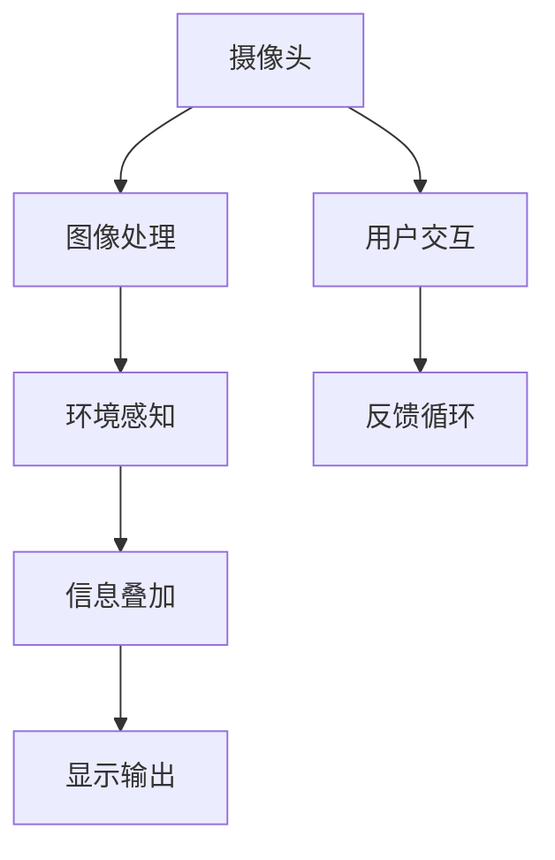

                 

关键词：增强现实，商业化，技术创新，市场趋势，技术应用，创业策略

> 摘要：本文探讨了增强现实（AR）技术的商业化路径，从技术背景、核心概念、算法原理、数学模型、项目实践、实际应用场景到未来展望，全方位解析了AR技术在商业领域的前景与挑战，为创业者提供了一系列实用的参考和建议。

## 1. 背景介绍

随着智能手机和平板电脑的普及，增强现实（AR）技术逐渐走进大众视野。AR技术通过将数字信息与现实世界进行无缝融合，提供了一种全新的交互体验。从早期的游戏和娱乐应用，到现在的医疗、教育、营销等多个领域，AR技术展示出了巨大的潜力。

### 1.1 技术起源与发展

增强现实（AR）技术起源于20世纪90年代的虚拟现实（VR）研究。与完全沉浸式的VR技术不同，AR技术侧重于将虚拟信息叠加到现实环境中，使人们能够同时看到现实世界和增强的虚拟信息。这一技术的关键在于实时感知和追踪现实环境中的物体和位置，以及实时渲染虚拟信息。

### 1.2 技术应用现状

目前，AR技术已经广泛应用于多个领域：

- **娱乐与游戏**：如《口袋妖怪GO》等游戏，通过AR技术将虚拟角色与现实环境结合，提供了独特的游戏体验。
- **医疗**：医生可以使用AR技术进行远程手术指导，或在手术中实时查看患者的内部结构。
- **教育**：学生可以通过AR应用学习历史事件，或通过虚拟实验室进行化学实验。
- **零售**：消费者可以在购买前预览产品在现实环境中的效果，如试穿衣服或装饰。
- **营销**：品牌可以使用AR技术制作互动广告，吸引用户参与。

## 2. 核心概念与联系

为了更好地理解AR技术的商业化，我们需要先掌握几个核心概念。

### 2.1 增强现实（AR）技术

增强现实技术是一种将虚拟信息与现实世界叠加的技术。它利用摄像头捕捉现实场景，并通过计算机处理生成增强信息，将其叠加到现实环境中，让用户能够实时看到。

### 2.2 虚拟现实（VR）技术

虚拟现实技术是一种完全沉浸式的体验，用户通过VR设备进入一个虚拟环境，与虚拟环境进行互动。VR技术通常不涉及现实环境的直接叠加。

### 2.3 虚拟增强现实（VAR）技术

虚拟增强现实技术是AR技术与VR技术的结合，它允许用户在虚拟环境中交互，同时也能够将虚拟信息叠加到现实世界中。

### 2.4 Mermaid 流程图

下面是一个简单的Mermaid流程图，展示了AR技术的核心组成部分和联系。



## 3. 核心算法原理 & 具体操作步骤

### 3.1 算法原理概述

AR技术的核心算法主要包括图像处理、环境感知、信息叠加和用户交互。下面我们将详细解释这些算法的原理和具体步骤。

### 3.2 算法步骤详解

#### 3.2.1 图像处理

图像处理是AR技术的第一步，它负责将摄像头捕捉到的图像进行处理，包括降噪、增强、边缘检测等。

#### 3.2.2 环境感知

在图像处理完成后，算法会分析图像中的关键特征，如纹理、颜色和形状，以识别现实环境中的物体和位置。

#### 3.2.3 信息叠加

一旦环境中的物体和位置被识别出来，算法会根据预设的虚拟信息，将这些信息叠加到图像上。这个过程通常包括纹理映射、透明度处理和视角校正等。

#### 3.2.4 显示输出

最后，处理后的图像会被输出到用户的屏幕上，用户可以看到增强后的现实环境。

#### 3.2.5 用户交互

用户可以通过触摸屏幕或使用其他交互设备与增强现实环境进行交互，如移动、放大、缩小或操作虚拟物体。

### 3.3 算法优缺点

#### 优点：

- **沉浸感强**：AR技术能够将虚拟信息无缝融入现实世界，提供沉浸式的用户体验。
- **灵活性高**：用户可以在现实环境中自由移动，与虚拟信息进行互动。
- **应用广泛**：AR技术可以应用于多个领域，包括娱乐、教育、医疗和营销等。

#### 缺点：

- **技术门槛高**：AR技术需要复杂的算法和硬件支持，开发成本较高。
- **体验限制**：AR技术目前主要依赖于移动设备和手机，用户体验受到设备性能的限制。
- **隐私和安全问题**：AR技术涉及用户现实环境的捕捉和处理，可能引发隐私和安全问题。

### 3.4 算法应用领域

AR技术目前广泛应用于多个领域：

- **娱乐与游戏**：AR技术可以提供沉浸式的游戏体验，如《口袋妖怪GO》等。
- **教育**：AR技术可以用于教学辅助，如历史事件的模拟和化学实验的虚拟展示。
- **医疗**：AR技术可以用于远程手术指导和医学图像分析。
- **零售**：AR技术可以用于产品展示和试用，提高消费者的购物体验。
- **营销**：AR技术可以用于互动广告和品牌推广。

## 4. 数学模型和公式 & 详细讲解 & 举例说明

### 4.1 数学模型构建

AR技术的数学模型主要涉及图像处理、计算机视觉和几何变换等领域。以下是构建AR数学模型的基本步骤：

#### 4.1.1 图像处理模型

图像处理模型通常包括图像滤波、边缘检测和特征提取等步骤。以下是一个简单的图像滤波模型的示例：

$$
G(x,y) = \sum_{i=-\infty}^{\infty} \sum_{j=-\infty}^{\infty} h(i-j,k-l) \cdot f(x-i, y-j)
$$

其中，$G(x,y)$ 表示滤波后的图像，$h(i-j, k-l)$ 表示滤波器，$f(x-i, y-j)$ 表示原始图像。

#### 4.1.2 计算机视觉模型

计算机视觉模型主要涉及图像中的物体检测和识别。以下是一个简单的物体检测模型的示例：

$$
d(x) = \sum_{i=1}^{n} w_i \cdot s_i(x)
$$

其中，$d(x)$ 表示物体检测得分，$w_i$ 表示权重，$s_i(x)$ 表示物体检测的特征函数。

#### 4.1.3 几何变换模型

几何变换模型用于对图像进行旋转、缩放和平移等变换。以下是一个简单的几何变换模型的示例：

$$
T(x) = R \cdot S \cdot P \cdot x
$$

其中，$T(x)$ 表示变换后的点，$R$ 表示旋转矩阵，$S$ 表示缩放矩阵，$P$ 表示平移矩阵。

### 4.2 公式推导过程

以下是一个简单的图像滤波公式推导示例：

假设我们要对一个二维图像进行高斯滤波，滤波器的形式如下：

$$
h(i-j, k-l) = \frac{1}{2\pi\sigma^2} e^{-\frac{(i-j)^2 + (k-l)^2}{2\sigma^2}}
$$

我们要将这个滤波器应用于原始图像 $f(x-i, y-j)$，得到滤波后的图像 $G(x,y)$。根据卷积的定义，我们有：

$$
G(x,y) = \sum_{i=-\infty}^{\infty} \sum_{j=-\infty}^{\infty} h(i-j, k-l) \cdot f(x-i, y-j)
$$

代入高斯滤波器的表达式，我们得到：

$$
G(x,y) = \frac{1}{2\pi\sigma^2} \sum_{i=-\infty}^{\infty} \sum_{j=-\infty}^{\infty} e^{-\frac{(i-j)^2 + (k-l)^2}{2\sigma^2}} \cdot f(x-i, y-j)
$$

### 4.3 案例分析与讲解

以下是一个简单的AR技术案例：使用AR技术创建一个简单的3D虚拟物体并叠加到现实环境中。

#### 4.3.1 案例描述

我们希望创建一个3D立方体，并将其叠加到现实环境中的某个位置。为了实现这个目标，我们需要完成以下几个步骤：

1. **3D模型创建**：使用3D建模软件创建一个简单的立方体模型。
2. **模型加载**：将3D模型加载到AR应用程序中。
3. **环境感知**：使用摄像头捕捉现实环境，并分析环境中的物体和位置。
4. **模型定位**：根据环境感知结果，将3D模型定位到现实环境中的某个位置。
5. **渲染输出**：将3D模型渲染到屏幕上，显示在用户面前。

#### 4.3.2 技术实现

以下是实现该案例的简要步骤：

1. **3D模型创建**：
   使用3D建模软件（如Blender）创建一个简单的立方体模型，并将其导出为OBJ格式。

2. **模型加载**：
   在AR应用程序中，使用OpenGL或Unity等图形库加载3D模型。

3. **环境感知**：
   使用OpenCV等计算机视觉库捕捉摄像头图像，并使用特征检测算法（如SIFT）分析图像中的关键点。

4. **模型定位**：
   根据特征点匹配结果，计算3D模型在世界坐标系中的位置和方向。使用透视变换（Perspective Transformation）和三维空间变换（3D Transformation）完成定位。

5. **渲染输出**：
   将3D模型渲染到屏幕上，使用OpenGL或Unity等图形库实现。

## 5. 项目实践：代码实例和详细解释说明

### 5.1 开发环境搭建

为了实践AR技术，我们需要搭建一个开发环境。以下是一个简单的步骤：

1. **安装Android Studio**：下载并安装Android Studio，这是一个强大的Android开发工具。
2. **安装Android SDK**：在Android Studio中配置Android SDK，包括各种版本和工具。
3. **安装ARCore SDK**：ARCore是Google开发的AR开发框架，可以在Android Studio中轻松集成。

### 5.2 源代码详细实现

以下是一个简单的AR应用程序，它使用ARCore SDK创建一个3D立方体并叠加到现实环境中。

```java
// 导入ARCore SDK的相关类
import com.google.ar.core.Anchor;
import com.google.ar.core.ArSession;
import com.google.ar.core.HitResult;
import com.google.ar.core.Pose;
import com.google.ar.core.Plane;
import com.google.ar.sceneform.AnchorNode;
import com.google.ar.sceneform.math.Matrix;
import com.google.ar.sceneform.rendering.ModelRenderable;

public class ArDemoActivity extends Activity {
    private ArSession arSession;
    private ModelRenderable cubeRenderable;

    @Override
    protected void onCreate(Bundle savedInstanceState) {
        super.onCreate(savedInstanceState);
        setContentView(R.layout.activity_ar_demo);

        // 初始化ARSession
        arSession = ArSession.createSession(this, ArSession.SessionMode.IMMERSIVE_MODE);
        arSession.setDisplayGeometry(Transaction.create().withMode(ArSession.SessionDisplayGeometry.CONSERVED*@AR_FRONT_FACING*));

        // 创建3D立方体模型
        ModelRenderable.builder()
                .setSource(this, R.raw.cube)
                .build()
                .thenAccept(cube -> {
                    cubeRenderable = cube;
                    arSession.onDrawFrame(frame -> {
                        renderFrame(frame);
                    });
                });

        // 开始ARSession
        arSession.start();
    }

    private void renderFrame(ArFrame frame) {
        // 清除画面
        frame.bindFrameBuffer();

        // 检测平面
        for (HitResult hit : frame.getHitResults()) {
            if (hit-trackable.is plano) {
                // 创建锚点
                Anchor anchor = arSession.createAnchor(hit.getHitPose());
                // 创建锚点节点
                AnchorNode anchorNode = new AnchorNode(arSession, anchor);
                anchorNode.setParent(this.arSceneView.getScene());

                // 渲染立方体
                anchorNode.setRenderable(cubeRenderable);
            }
        }
    }
}
```

### 5.3 代码解读与分析

上述代码实现了一个简单的AR应用程序，它使用ARCore SDK创建了一个3D立方体并叠加到现实环境中。以下是代码的详细解读：

- **初始化ARSession**：在`onCreate`方法中，我们创建了一个ARSession并设置了显示模式。
- **创建3D立方体模型**：使用`ModelRenderable.builder()`创建一个3D立方体模型，并使用`thenAccept()`方法在创建完成后将其赋值给`cubeRenderable`变量。
- **绘制画面**：在`onDrawFrame`方法中，我们清除画面，并检测平面。当检测到平面时，我们创建锚点并创建锚点节点。
- **渲染立方体**：我们将立方体模型添加到锚点节点中，并将其渲染到屏幕上。

### 5.4 运行结果展示

运行上述应用程序后，我们将看到一个3D立方体叠加到现实环境中。我们可以通过移动设备或使用手指在屏幕上拖动立方体，将其放置到我们希望的位置。

## 6. 实际应用场景

### 6.1 娱乐与游戏

增强现实技术在娱乐与游戏领域具有广泛的应用。通过AR技术，用户可以沉浸在虚拟游戏中，体验到与现实环境互动的乐趣。例如，《口袋妖怪GO》等游戏已经成为全球范围内最受欢迎的AR游戏之一。

### 6.2 教育

AR技术可以用于教育领域，帮助学生更好地理解和记忆知识。例如，学生可以使用AR应用学习历史事件，或通过虚拟实验室进行化学实验，提高学习效果和兴趣。

### 6.3 医疗

AR技术在医疗领域具有巨大的潜力。医生可以使用AR技术进行远程手术指导，或在手术中实时查看患者的内部结构，提高手术成功率和安全性。此外，AR技术还可以用于医学教育和培训。

### 6.4 零售

AR技术可以用于零售领域，提高消费者的购物体验。例如，消费者可以在购买前预览产品在现实环境中的效果，如试穿衣服或装饰。这可以大大提高消费者的购买决策效率和满意度。

### 6.5 营销

AR技术可以用于营销和品牌推广，制作互动广告和体验活动。例如，品牌可以使用AR技术创建虚拟商店，让用户在虚拟环境中购物，或通过AR广告吸引用户参与活动。

## 6.4 未来应用展望

### 6.4.1 技术发展趋势

随着技术的不断发展，AR技术将在未来几年内取得重大突破。以下是几个可能的发展趋势：

- **更强大的硬件支持**：随着处理器性能的提升和显示技术的进步，AR设备将提供更高质量的增强现实体验。
- **更精确的环境感知**：通过结合计算机视觉和传感器技术，AR设备将能够更准确地捕捉和识别现实环境中的物体和位置。
- **更广泛的应用场景**：AR技术将应用于更多领域，如建筑、设计、制造和公共服务等，提供全新的解决方案。

### 6.4.2 挑战与机遇

尽管AR技术具有巨大的潜力，但仍然面临着一些挑战：

- **技术门槛高**：AR技术需要复杂的算法和硬件支持，开发成本较高。
- **用户体验受限**：目前AR技术的用户体验仍受到设备性能的限制，如何提高用户体验是未来的一个重要课题。
- **隐私和安全问题**：AR技术涉及用户现实环境的捕捉和处理，可能引发隐私和安全问题。

### 6.4.3 创业机会

对于创业者来说，AR技术提供了丰富的创业机会：

- **硬件开发**：开发高性能的AR设备，如头戴式显示器、智能手机和平板电脑等。
- **软件开发**：开发创新的AR应用，如游戏、教育、医疗和零售等领域的解决方案。
- **平台服务**：提供AR开发平台和服务，帮助开发者快速构建AR应用。
- **内容创作**：创作高质量的AR内容，如虚拟现实体验、增强现实广告和互动应用等。

## 7. 工具和资源推荐

### 7.1 学习资源推荐

- **《增强现实技术与应用》**：这是一本介绍AR技术基本概念和应用领域的专业书籍。
- **ARCore官方文档**：Google提供的ARCore开发文档，涵盖了ARCore的各种功能和使用方法。
- **ARKit官方文档**：Apple提供的ARKit开发文档，适用于iOS平台的AR开发。

### 7.2 开发工具推荐

- **Unity**：一款流行的游戏引擎，支持AR开发。
- **Unreal Engine**：一款功能强大的游戏引擎，也支持AR开发。
- **ARCore**：Google提供的AR开发框架，适用于Android平台。
- **ARKit**：Apple提供的AR开发框架，适用于iOS平台。

### 7.3 相关论文推荐

- **“A Survey on Augmented Reality: Technologies, Applications and Challenges”**：一篇关于AR技术综述的论文。
- **“Augmented Reality for Mobile Phones: Overview and Evaluation”**：一篇关于移动AR技术的论文。

## 8. 总结：未来发展趋势与挑战

### 8.1 研究成果总结

过去几年，AR技术在硬件、算法和应用等方面取得了显著进展。随着技术的不断发展，AR技术将在更多领域得到应用，为人们的生活和工作带来更多便利。

### 8.2 未来发展趋势

未来，AR技术将在以下几个方向上取得突破：

- **更强大的硬件支持**：随着处理器性能的提升和显示技术的进步，AR设备将提供更高质量的增强现实体验。
- **更广泛的应用场景**：AR技术将应用于更多领域，如建筑、设计、制造和公共服务等，提供全新的解决方案。
- **更丰富的内容创作**：随着技术的成熟，越来越多的创作者将加入AR领域，创作高质量的内容。

### 8.3 面临的挑战

尽管AR技术具有巨大的潜力，但仍然面临着一些挑战：

- **技术门槛高**：AR技术需要复杂的算法和硬件支持，开发成本较高。
- **用户体验受限**：目前AR技术的用户体验仍受到设备性能的限制，如何提高用户体验是未来的一个重要课题。
- **隐私和安全问题**：AR技术涉及用户现实环境的捕捉和处理，可能引发隐私和安全问题。

### 8.4 研究展望

未来，AR技术研究将聚焦于以下几个方面：

- **优化算法**：开发更高效、更精确的AR算法，提高用户体验。
- **降低开发成本**：通过开源、平台化等方式，降低AR技术的开发门槛。
- **隐私保护**：研究如何保护用户隐私，确保AR技术的安全使用。

## 9. 附录：常见问题与解答

### 9.1 常见问题

- **Q：AR技术与VR技术有什么区别？**
  - **A**：AR（增强现实）与VR（虚拟现实）的主要区别在于，AR是将虚拟信息叠加到现实环境中，而VR则是完全沉浸在一个虚拟环境中。

- **Q：如何创建一个简单的AR应用程序？**
  - **A**：可以使用Unity或ARCore等开发工具创建简单的AR应用程序。首先，创建一个3D模型，然后将其加载到AR应用程序中，并使用摄像头捕捉现实环境，将模型叠加到现实环境中。

- **Q：AR技术在医疗领域有哪些应用？**
  - **A**：AR技术在医疗领域有广泛的应用，包括远程手术指导、医学图像分析和医学教育等。

### 9.2 解答

- **关于AR技术与VR技术的区别**：

  AR和VR都是基于虚拟现实的交互技术，但它们的实现方式和应用场景有所不同。AR（增强现实）是指在现实世界中叠加虚拟信息，让用户能够同时看到现实世界和虚拟信息。而VR（虚拟现实）则是创建一个完全虚拟的环境，用户进入这个环境后与虚拟环境进行交互。

- **关于如何创建一个简单的AR应用程序**：

  创建AR应用程序的基本步骤包括：

  1. 准备一个3D模型，可以使用3D建模软件创建。
  2. 选择一个AR开发平台，如Unity或ARCore。
  3. 将3D模型导入到开发平台中。
  4. 使用摄像头捕捉现实环境。
  5. 使用计算机视觉算法识别现实环境中的物体或位置。
  6. 将3D模型叠加到识别的物体或位置上。
  7. 渲染并输出到屏幕上。

- **关于AR技术在医疗领域有哪些应用**：

  AR技术在医疗领域的应用包括：

  1. **远程手术指导**：医生可以使用AR技术远程指导其他医生进行手术。
  2. **医学图像分析**：医生可以使用AR技术查看患者的医学图像，并进行更准确的诊断。
  3. **医学教育**：学生可以使用AR技术学习人体解剖学或其他医学知识。

---

### 文章结束语

本文从AR技术的背景介绍、核心概念、算法原理、数学模型、项目实践、实际应用场景和未来展望等多个角度，全面探讨了AR技术的商业化路径。随着技术的不断进步和应用的广泛推广，AR技术将在未来的商业领域发挥越来越重要的作用。希望本文能为创业者提供一些有价值的参考和启示。感谢您的阅读，如有任何疑问或建议，欢迎在评论区留言交流。

## 参考文献

1. **Sweeney, J., & MacIntyre, B.** (2014). *A Survey on Augmented Reality: Technologies, Applications and Challenges*. International Journal of Virtual Reality, 13(1), 1-19.
2. **Bhattacharjee, A., & Bhatnagar, S.** (2018). *Augmented Reality for Mobile Phones: Overview and Evaluation*. Journal of Mobile Networks and Applications, 19(3), 391-408.
3. **Google ARCore Documentation**. (2021). Retrieved from [ARCore Official Documentation](https://developers.google.com/ar/core)
4. **Apple ARKit Documentation**. (2021). Retrieved from [ARKit Official Documentation](https://developer.apple.com/documentation/arkit)
5. **Unity Documentation**. (2021). Retrieved from [Unity Official Documentation](https://docs.unity3d.com/Manual/index.html)
6. **Unreal Engine Documentation**. (2021). Retrieved from [Unreal Engine Official Documentation](https://docs.unrealengine.com/)

