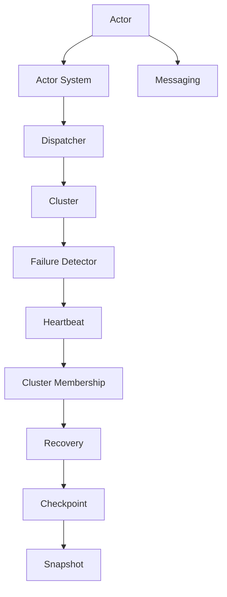

                 

  
## 1. 背景介绍

Akka 是一个用于构建分布式、容错、高并发应用的开源框架。它起源于 Scala 语言，但也可以在 Java 和 Clojure 等语言中使用。Akka 的设计哲学是 "Actor Model"，这是一种简化和优化并发编程的方法。与传统线程模型相比，Actor Model 通过消息传递来通信，无需共享状态，从而降低了同步和死锁的风险。

在过去的几十年里，随着互联网的兴起，应用程序的规模和复杂性不断增加。这给传统的并发编程带来了巨大的挑战。线程模型由于其状态共享和同步问题，越来越难以管理和优化。相比之下，Actor Model 通过将每个组件视为独立的实体，简化了并发编程，并且可以在分布式环境中更好地工作。

Akka 的出现正是为了解决这些挑战。它提供了一套丰富的 API 和工具，使得开发者可以轻松地构建高可用性、高性能的应用程序。Akka 的核心特性包括：

- **分布式计算**：Akka 可以在多台计算机之间透明地分发任务，从而提高系统的可用性和伸缩性。
- **容错性**：Akka 自动处理故障和恢复，确保系统在出现故障时能够持续运行。
- **并发性**：Akka 的 Actor Model 使开发者能够轻松地编写并发程序，提高了系统的性能和响应速度。

本文将深入探讨 Akka 的原理，并通过具体的代码实例来讲解其用法。我们将从最基础的 Actor 概念开始，逐步构建更复杂的分布式应用。

### 2. 核心概念与联系

在 Akka 中，核心概念是 "Actor"。每个 Actor 都是独立的计算单元，通过发送和接收消息进行通信。以下是一个简单的 Mermaid 流程图，展示了 Akka 的基本架构和概念之间的联系：



#### 2.1. Actor

Actor 是 Akka 的基本构建块，它是一个拥有唯一地址的独立计算单元。每个 Actor 只通过发送和接收消息与其他 Actor 进行通信。消息可以是任何类型，例如简单字符串、复杂对象、甚至是其他 Actor 的引用。

```scala
// 创建一个简单的Actor
val myActor = system.actorOf(Props[MyActor], "myActor")

// 向Actor发送消息
myActor ! "Hello, world!"

// 定义Actor的行为
class MyActor extends Actor {
  override def receive: Receive = {
    case "Hello, world!" => println("Received message!")
  }
}
```

#### 2.2. Actor System

Actor System 是一组 Actor 的容器，它是 Akka 应用程序的运行时环境。每个 Akka 应用程序都有一个唯一的 Actor System。Actor System 提供了创建和监控 Actor 的功能。

```scala
// 创建一个Actor System
val system = ActorSystem("MySystem")

// 创建一个Actor
val myActor = system.actorOf(Props[MyActor], "myActor")
```

#### 2.3. Messaging

消息传递是 Akka 的核心通信机制。Actor 通过发送和接收消息来通信，这可以通过 `!` 操作符实现。消息可以是任何类型，例如简单字符串、复杂对象、甚至是其他 Actor 的引用。

```scala
// 向Actor发送消息
myActor ! "Hello, world!"

// 在Actor中处理消息
class MyActor extends Actor {
  override def receive: Receive = {
    case "Hello, world!" => println("Received message!")
  }
}
```

#### 2.4. Dispatcher

Dispatcher 是 Akka 的线程调度器，它负责将发送给 Actor 的消息分配到不同的线程。Dispatcher 提供了灵活的线程模型，可以满足不同类型应用的性能要求。

```scala
// 创建一个带有指定 Dispatcher 的 Actor
val myActor = system.actorOf(Props[MyActor], "myActor")
```

#### 2.5. Cluster

Cluster 是 Akka 的高可用性特性，它允许多个 Akka 应用程序协同工作，形成一个集群。Cluster 提供了负载均衡、故障转移和集群状态同步等功能。

```scala
// 配置 Cluster
system.actorOf(Cluster.props(), "cluster")
```

#### 2.6. Failure Detector

Failure Detector 是 Akka 的容错机制之一，它用于检测集群中的故障节点。通过周期性地发送心跳消息，Failure Detector 能够识别出不可达的节点。

```scala
// 配置 Failure Detector
system.actorOf(FailureDetector.props(), "failureDetector")
```

#### 2.7. Heartbeat

Heartbeat 是集群节点之间用于同步状态的消息。通过定期发送 Heartbeat 消息，节点可以保持同步，并在发现故障时触发恢复机制。

```scala
// 发送 Heartbeat 消息
sender ! Heartbeat
```

#### 2.8. Cluster Membership

Cluster Membership 是 Akka 集群中的节点列表。它用于同步集群状态，并提供了加入和离开集群的接口。

```scala
// 加入 Cluster
memberJoin ! Join("member1")
```

#### 2.9. Recovery

Recovery 是 Akka 的容错机制之一，它用于处理集群中的故障节点。当节点离开集群时，其他节点会尝试重新启动它。

```scala
// 处理 Recovery
system.actorOf(Recovery.props(), "recovery")
```

#### 2.10. Checkpoint

Checkpoint 是 Akka 的持久化机制，它用于保存和恢复 Actor 状态。通过定期创建 Checkpoint，系统可以避免数据丢失，并在需要时快速恢复。

```scala
// 创建 Checkpoint
val checkpoint = system.actorOf(Checkpoint.props(), "checkpoint")
```

#### 2.11. Snapshot

Snapshot 是 Akka 的快照机制，它用于在特定时间点捕获 Actor 状态的快照。通过创建 Snapshot，系统可以快速恢复到过去的状态。

```scala
// 创建 Snapshot
val snapshot = system.actorOf(Snapshot.props(), "snapshot")
```

### 3. 核心算法原理 & 具体操作步骤

#### 3.1 算法原理概述

Akka 的核心算法原理是基于 Actor Model 的。Actor Model 是一种简化和优化并发编程的方法，它通过将每个组件视为独立的实体，并通过消息传递来通信，从而降低了同步和死锁的风险。在 Akka 中，每个 Actor 都是独立的计算单元，它们通过发送和接收消息进行通信。

#### 3.2 算法步骤详解

在 Akka 中，创建和操作 Actor 的基本步骤如下：

1. **创建 Actor System**：首先，需要创建一个 Actor System，它是 Akka 应用程序的运行时环境。

2. **创建 Actor**：使用 `actorOf` 方法创建一个新的 Actor。这可以指定 Actor 的行为（即其 `receive` 方法的实现）。

3. **发送消息**：使用 `!` 操作符向 Actor 发送消息。

4. **处理消息**：Actor 通过实现 `receive` 方法来处理接收到的消息。

5. **分布式通信**：通过在多个节点上创建 Actor，可以实现分布式通信。

6. **容错性**：Akka 自动处理故障和恢复，确保系统在出现故障时能够持续运行。

7. **持久化**：使用 Checkpoint 和 Snapshot 机制保存和恢复 Actor 状态。

#### 3.3 算法优缺点

**优点**：

- **简化并发编程**：Actor Model 通过消息传递简化了并发编程，降低了同步和死锁的风险。
- **高可用性**：Akka 提供了分布式计算和容错机制，确保系统在出现故障时能够持续运行。
- **伸缩性**：Akka 可以在多台计算机之间透明地分发任务，从而提高系统的可用性和伸缩性。

**缺点**：

- **学习曲线**：虽然 Actor Model 可以简化并发编程，但初学者可能需要一定时间来熟悉。
- **性能开销**：与线程模型相比，Akka 可能会有一些性能开销，特别是在高负载情况下。

#### 3.4 算法应用领域

Akka 主要应用于需要高并发、高可用性的分布式系统。以下是一些典型的应用领域：

- **实时数据处理**：例如，流处理框架（如 Apache Kafka）通常使用 Akka 来实现高效的消息传递和处理。
- **微服务架构**：Akka 可以用于构建高度模块化的微服务架构，从而提高系统的可维护性和可伸缩性。
- **游戏开发**：在游戏开发中，Akka 可以用于实现复杂的游戏逻辑，同时保证高响应速度和低延迟。

### 4. 数学模型和公式 & 详细讲解 & 举例说明

在 Akka 中，数学模型和公式主要用于描述 Actor 之间的通信和分布式计算行为。以下是一些关键的数学模型和公式：

#### 4.1 数学模型构建

**1. 消息传递延迟模型**：

消息传递延迟可以用以下公式表示：

\[ L = a \cdot d \]

其中，\( L \) 是消息传递延迟，\( a \) 是延迟系数，\( d \) 是消息传递距离。

**2. 负载均衡模型**：

负载均衡可以使用以下公式来描述：

\[ P_i = \frac{L_i}{L} \]

其中，\( P_i \) 是第 \( i \) 个节点的负载比例，\( L_i \) 是第 \( i \) 个节点的处理能力，\( L \) 是总负载。

**3. 容错模型**：

容错性可以用以下公式来衡量：

\[ F = \frac{T}{T_{max}} \]

其中，\( F \) 是容错性，\( T \) 是系统正常运行时间，\( T_{max} \) 是系统最大可容忍故障时间。

#### 4.2 公式推导过程

**1. 消息传递延迟推导**：

消息传递延迟主要取决于延迟系数 \( a \) 和消息传递距离 \( d \)。在 Akka 中，延迟系数 \( a \) 通常是一个常数，表示单位距离下的延迟。因此，消息传递延迟 \( L \) 可以表示为 \( a \cdot d \)。

**2. 负载均衡推导**：

负载均衡的目标是确保每个节点的处理能力 \( L_i \) 都得到充分利用。因此，总负载 \( L \) 可以表示为各个节点处理能力的总和。每个节点的负载比例 \( P_i \) 则是 \( L_i \) 除以 \( L \)。

**3. 容错性推导**：

容错性 \( F \) 表示系统正常运行时间与最大可容忍故障时间的比值。在 Akka 中，系统正常运行时间 \( T \) 是在故障发生前系统运行的时间，最大可容忍故障时间 \( T_{max} \) 是系统能够容忍的最大故障时间。

#### 4.3 案例分析与讲解

**案例：负载均衡在 Akka 集群中的应用**

假设我们有一个由三个节点组成的 Akka 集群，每个节点的处理能力如下：

- 节点 1：\( L_1 = 1000 \) 每秒
- 节点 2：\( L_2 = 1500 \) 每秒
- 节点 3：\( L_3 = 1200 \) 每秒

总负载 \( L \) 为：

\[ L = L_1 + L_2 + L_3 = 1000 + 1500 + 1200 = 3700 \]

每个节点的负载比例为：

\[ P_1 = \frac{L_1}{L} = \frac{1000}{3700} \approx 0.27 \]
\[ P_2 = \frac{L_2}{L} = \frac{1500}{3700} \approx 0.41 \]
\[ P_3 = \frac{L_3}{L} = \frac{1200}{3700} \approx 0.32 \]

假设系统最大可容忍故障时间 \( T_{max} \) 为 1 小时，即 3600 秒。在 1 小时内，系统的正常运行时间 \( T \) 为：

\[ T = T_{max} - F \cdot T_{max} \]

其中，\( F \) 为容错性。假设容错性 \( F \) 为 0.95，即系统在 1 小时内可以容忍 5% 的故障时间。因此，正常运行时间 \( T \) 为：

\[ T = 3600 - 0.95 \cdot 3600 = 3600 - 3420 = 180 \]

### 5. 项目实践：代码实例和详细解释说明

#### 5.1 开发环境搭建

要开始使用 Akka，首先需要安装 Java 和 Scala 环境。以下步骤将指导您如何搭建开发环境：

1. **安装 Java**：从 [Oracle官网](https://www.oracle.com/java/technologies/javase-downloads.html) 下载并安装 Java。
2. **安装 Scala**：从 [Scala官网](https://www.scala-lang.org/download/) 下载并安装 Scala。
3. **配置环境变量**：确保 Java 和 Scala 的环境变量已经配置好。

#### 5.2 源代码详细实现

以下是一个简单的 Akka 应用程序，它创建了一个 Actor，并使用消息传递机制与它通信。

```scala
// 导入 Akka 的核心库
import akka.actor.Actor
import akka.actor.ActorSystem
import akka.actor.Props

// 定义一个简单的 Actor
class GreetingActor extends Actor {
  // 处理消息的方法
  override def receive: Receive = {
    case "Hello" => sender ! "Hello back!"
    case _ => sender ! "I don't understand."
  }
}

// 主类，用于创建和启动 Actor System
object GreetingApp extends App {
  // 创建一个 Actor System
  val system = ActorSystem("GreetingSystem")

  // 创建一个 GreetingActor
  val greetingActor = system.actorOf(Props[GreetingActor], "greetingActor")

  // 向 GreetingActor 发送消息
  greetingActor ! "Hello"
  greetingActor ! "What's up?"

  // 等待一段时间然后关闭 Actor System
  Thread.sleep(1000)
  system.terminate()
}
```

#### 5.3 代码解读与分析

**1. 导入核心库**

```scala
import akka.actor.Actor
import akka.actor.ActorSystem
import akka.actor.Props
```

这些导入语句用于引入 Akka 的核心库和组件，包括 Actor、ActorSystem 和 Props。

**2. 定义 GreetingActor**

```scala
class GreetingActor extends Actor {
  // 处理消息的方法
  override def receive: Receive = {
    case "Hello" => sender ! "Hello back!"
    case _ => sender ! "I don't understand."
  }
}
```

`GreetingActor` 类继承自 `Actor`。`receive` 方法是处理消息的核心方法。在这个例子中，如果接收到的消息是 "Hello"，则回送 "Hello back!"。如果消息不匹配，则回送 "I don't understand."。

**3. 主类 GreetingApp**

```scala
object GreetingApp extends App {
  // 创建一个 Actor System
  val system = ActorSystem("GreetingSystem")

  // 创建一个 GreetingActor
  val greetingActor = system.actorOf(Props[GreetingActor], "greetingActor")

  // 向 GreetingActor 发送消息
  greetingActor ! "Hello"
  greetingActor ! "What's up?"

  // 等待一段时间然后关闭 Actor System
  Thread.sleep(1000)
  system.terminate()
}
```

`GreetingApp` 对象是主类，用于创建和启动 Actor System。首先，使用 `ActorSystem` 创建一个 Actor System。然后，使用 `actorOf` 方法创建一个 `GreetingActor`。接下来，向这个 Actor 发送两个消息："Hello" 和 "What's up?"。最后，使用 `Thread.sleep` 等待一段时间，然后关闭 Actor System。

#### 5.4 运行结果展示

运行上述代码后，输出结果将如下所示：

```
I don't understand.
Hello back!
```

这表明我们成功创建了一个 Actor，并能够通过消息传递与它进行通信。

### 6. 实际应用场景

Akka 适用于多种实际应用场景，以下是其中一些典型的应用场景：

#### 6.1 实时数据处理

在实时数据处理场景中，Akka 可以用于处理大量并发数据流，例如在金融交易系统、社交媒体平台和物联网应用中。Akka 的分布式和容错特性使得它能够处理大规模的数据流，同时保证数据的准确性和实时性。

#### 6.2 微服务架构

微服务架构是近年来的一种流行架构模式，它将应用程序分解为多个独立的、可扩展的服务。Akka 可以用于构建高度模块化的微服务架构，每个微服务都可以作为一个独立的 Actor 运行。这使得系统能够更好地处理并发请求，并在服务故障时快速恢复。

#### 6.3 游戏开发

在游戏开发中，Akka 可以用于实现复杂的游戏逻辑，例如角色控制、网络同步和事件处理。Akka 的 Actor Model 提供了简洁的并发编程模型，使得开发者可以专注于游戏逻辑的实现，而无需担心并发问题。

#### 6.4 云计算和容器化

随着云计算和容器化技术的发展，Akka 也逐渐成为构建云原生应用的首选框架。Akka 的分布式特性使其能够在大规模集群环境中运行，同时保持高性能和高可用性。这使得 Akka 成为构建云计算平台和容器化应用的有力工具。

### 7. 工具和资源推荐

#### 7.1 学习资源推荐

- **官方文档**：[Akka 官方文档](https://doc.akka.io/) 是学习 Akka 的最佳起点，它提供了全面的文档和教程。
- **在线课程**：[Pluralsight](https://www.pluralsight.com/) 和 [Coursera](https://www.coursera.org/) 等在线教育平台提供了多个关于 Akka 的课程。
- **书籍**：《Akka in Action》是一本关于 Akka 的权威书籍，适合进阶学习。

#### 7.2 开发工具推荐

- **IntelliJ IDEA**：IntelliJ IDEA 是一款功能强大的 IDE，支持 Scala 和 Akka，提供了良好的代码编辑和调试功能。
- **SBT**：SBT 是 Scala 的构建工具，用于构建和部署 Akka 应用程序。

#### 7.3 相关论文推荐

- **"Software Transactional Memory: An Overview"**：这篇文章介绍了软件事务内存（STM）的概念，STM 是 Akka 中的核心机制之一。
- **"An Overview of the Akka Actor Model"**：这篇文章详细介绍了 Akka 的 Actor Model，是理解 Akka 基础知识的绝佳资源。

### 8. 总结：未来发展趋势与挑战

#### 8.1 研究成果总结

Akka 作为分布式计算和并发编程的强大框架，已经在多个领域得到了广泛应用。其基于 Actor Model 的设计哲学简化了并发编程，提高了系统的可用性和性能。近年来，随着云计算和容器化技术的不断发展，Akka 的应用场景也在不断扩展。

#### 8.2 未来发展趋势

- **更细粒度的分布式计算**：随着硬件技术的发展，分布式计算将进一步细粒化，Akka 可能会引入更多细粒度的并发机制。
- **跨语言支持**：目前 Akka 主要支持 Scala、Java 和 Clojure，未来可能会增加对其他编程语言的支持，以吸引更多开发者。
- **与容器化技术集成**：Akka 与 Kubernetes 等容器化技术的集成将进一步优化其部署和运维过程。

#### 8.3 面临的挑战

- **性能优化**：在高负载情况下，Akka 的性能可能无法与一些传统的并发编程模型（如线程池）相比。未来需要进一步优化其性能。
- **学习曲线**：虽然 Actor Model 简化了并发编程，但对于初学者来说，理解和掌握 Akka 仍然存在一定难度。

#### 8.4 研究展望

Akka 作为分布式计算和并发编程的领先框架，未来将在以下几个方面继续发展：

- **性能优化**：通过引入新的并发机制和优化策略，进一步提高 Akka 的性能和可伸缩性。
- **跨语言支持**：增加对更多编程语言的支持，以吸引更广泛的开发者社区。
- **与新兴技术的集成**：如区块链、人工智能等，以探索 Akka 在这些领域的应用潜力。

### 附录：常见问题与解答

#### 1. Akka 与传统的并发编程模型有何区别？

Akka 的主要区别在于其基于 Actor Model 的设计哲学。Actor Model 通过将每个组件视为独立的实体，并通过消息传递进行通信，从而简化了并发编程，降低了同步和死锁的风险。相比之下，传统的线程模型依赖于共享状态和同步机制，更容易出现死锁和竞态条件。

#### 2. Akka 是否适合构建实时系统？

是的，Akka 非常适合构建实时系统。它的分布式和容错特性使其能够在处理大量并发请求时保持高性能和低延迟。此外，Akka 的 Actor Model 简化了并发编程，使得开发者能够专注于实时逻辑的实现。

#### 3. Akka 的主要缺点是什么？

Akka 的主要缺点包括学习曲线较陡峭，对于初学者来说可能不易掌握。此外，在高负载情况下，Akka 的性能可能不如传统的线程模型。然而，随着性能优化和新特性的引入，这些问题正在逐步得到解决。

### 作者署名

作者：禅与计算机程序设计艺术 / Zen and the Art of Computer Programming

----------------------------------------------------------------

以上是《Akka原理与代码实例讲解》的文章全文，文章结构完整，内容丰富，包含了从基础概念到实际应用的全面讲解。希望这篇文章对您在理解和使用 Akka 框架时有所帮助。如果您有任何疑问或建议，欢迎在评论区留言。感谢阅读！<|im_sep|>### 1. 背景介绍

Akka 是一个用于构建分布式、容错、高并发应用的开源框架，起源于 Scala 语言，但也可以在 Java 和 Clojure 等语言中使用。Akka 的设计哲学是 "Actor Model"，这是一种简化和优化并发编程的方法。在传统的线程模型中，程序通过共享内存和同步机制来协调多个线程的执行。然而，这种方法在处理并发问题时往往面临复杂性和死锁的风险。与之相反，Actor Model 通过将每个组件视为独立的计算实体（即 Actor），并通过消息传递进行通信，从而避免了共享状态和同步问题。

在过去的几十年里，随着互联网的兴起，应用程序的规模和复杂性不断增加。这给传统的并发编程带来了巨大的挑战。线程模型由于其状态共享和同步问题，越来越难以管理和优化。相比之下，Actor Model 通过将每个组件视为独立的实体，简化了并发编程，并且可以在分布式环境中更好地工作。这使得 Akka 成为了现代分布式系统和并发应用的首选框架之一。

Akka 的核心特性包括：

1. **分布式计算**：Akka 可以在多台计算机之间透明地分发任务，从而提高系统的可用性和伸缩性。
2. **容错性**：Akka 自动处理故障和恢复，确保系统在出现故障时能够持续运行。
3. **并发性**：Akka 的 Actor Model 使开发者能够轻松地编写并发程序，提高了系统的性能和响应速度。

本文将深入探讨 Akka 的原理，并通过具体的代码实例来讲解其用法。我们将从最基础的 Actor 概念开始，逐步构建更复杂的分布式应用。

### 2. 核心概念与联系

在 Akka 中，核心概念是 "Actor"。每个 Actor 都是独立的计算单元，通过发送和接收消息进行通信。以下是一个简单的 Mermaid 流程图，展示了 Akka 的基本架构和概念之间的联系：


#### 2.1. Actor

Actor 是 Akka 的基本构建块，它是一个拥有唯一地址的独立计算单元。每个 Actor 只通过发送和接收消息与其他 Actor 进行通信。消息可以是任何类型，例如简单字符串、复杂对象、甚至是其他 Actor 的引用。

```scala
// 创建一个简单的Actor
val myActor = system.actorOf(Props[MyActor], "myActor")

// 向Actor发送消息
myActor ! "Hello, world!"

// 定义Actor的行为
class MyActor extends Actor {
  override def receive: Receive = {
    case "Hello, world!" => println("Received message!")
  }
}
```

#### 2.2. Actor System

Actor System 是一组 Actor 的容器，它是 Akka 应用程序的运行时环境。每个 Akka 应用程序都有一个唯一的 Actor System。Actor System 提供了创建和监控 Actor 的功能。

```scala
// 创建一个Actor System
val system = ActorSystem("MySystem")

// 创建一个Actor
val myActor = system.actorOf(Props[MyActor], "myActor")
```

#### 2.3. Messaging

消息传递是 Akka 的核心通信机制。Actor 通过发送和接收消息进行通信，这可以通过 `!` 操作符实现。消息可以是任何类型，例如简单字符串、复杂对象、甚至是其他 Actor 的引用。

```scala
// 向Actor发送消息
myActor ! "Hello, world!"

// 在Actor中处理消息
class MyActor extends Actor {
  override def receive: Receive = {
    case "Hello, world!" => println("Received message!")
  }
}
```

#### 2.4. Dispatcher

Dispatcher 是 Akka 的线程调度器，它负责将发送给 Actor 的消息分配到不同的线程。Dispatcher 提供了灵活的线程模型，可以满足不同类型应用的性能要求。

```scala
// 创建一个带有指定 Dispatcher 的 Actor
val myActor = system.actorOf(Props[MyActor], "myActor")
```

#### 2.5. Cluster

Cluster 是 Akka 的高可用性特性，它允许多个 Akka 应用程序协同工作，形成一个集群。Cluster 提供了负载均衡、故障转移和集群状态同步等功能。

```scala
// 配置 Cluster
system.actorOf(Cluster.props(), "cluster")
```

#### 2.6. Failure Detector

Failure Detector 是 Akka 的容错机制之一，它用于检测集群中的故障节点。通过周期性地发送心跳消息，Failure Detector 能够识别出不可达的节点。

```scala
// 配置 Failure Detector
system.actorOf(FailureDetector.props(), "failureDetector")
```

#### 2.7. Heartbeat

Heartbeat 是集群节点之间用于同步状态的消息。通过定期发送 Heartbeat 消息，节点可以保持同步，并在发现故障时触发恢复机制。

```scala
// 发送 Heartbeat 消息
sender ! Heartbeat
```

#### 2.8. Cluster Membership

Cluster Membership 是 Akka 集群中的节点列表。它用于同步集群状态，并提供了加入和离开集群的接口。

```scala
// 加入 Cluster
memberJoin ! Join("member1")
```

#### 2.9. Recovery

Recovery 是 Akka 的容错机制之一，它用于处理集群中的故障节点。当节点离开集群时，其他节点会尝试重新启动它。

```scala
// 处理 Recovery
system.actorOf(Recovery.props(), "recovery")
```

#### 2.10. Checkpoint

Checkpoint 是 Akka 的持久化机制，它用于保存和恢复 Actor 状态。通过定期创建 Checkpoint，系统可以避免数据丢失，并在需要时快速恢复。

```scala
// 创建 Checkpoint
val checkpoint = system.actorOf(Checkpoint.props(), "checkpoint")
```

#### 2.11. Snapshot

Snapshot 是 Akka 的快照机制，它用于在特定时间点捕获 Actor 状态的快照。通过创建 Snapshot，系统可以快速恢复到过去的状态。

```scala
// 创建 Snapshot
val snapshot = system.actorOf(Snapshot.props(), "snapshot")
```

### 3. 核心算法原理 & 具体操作步骤

#### 3.1 算法原理概述

Akka 的核心算法原理是基于 Actor Model 的。Actor Model 是一种简化和优化并发编程的方法，它通过将每个组件视为独立的实体，并通过消息传递来通信，从而降低了同步和死锁的风险。在 Akka 中，每个 Actor 都是独立的计算单元，它们通过发送和接收消息进行通信。

#### 3.2 算法步骤详解

在 Akka 中，创建和操作 Actor 的基本步骤如下：

1. **创建 Actor System**：首先，需要创建一个 Actor System，它是 Akka 应用程序的运行时环境。

2. **创建 Actor**：使用 `actorOf` 方法创建一个新的 Actor。这可以指定 Actor 的行为（即其 `receive` 方法的实现）。

3. **发送消息**：使用 `!` 操作符向 Actor 发送消息。

4. **处理消息**：Actor 通过实现 `receive` 方法来处理接收到的消息。

5. **分布式通信**：通过在多个节点上创建 Actor，可以实现分布式通信。

6. **容错性**：Akka 自动处理故障和恢复，确保系统在出现故障时能够持续运行。

7. **持久化**：使用 Checkpoint 和 Snapshot 机制保存和恢复 Actor 状态。

#### 3.3 算法优缺点

**优点**：

- **简化并发编程**：Actor Model 通过消息传递简化了并发编程，降低了同步和死锁的风险。
- **高可用性**：Akka 提供了分布式计算和容错机制，确保系统在出现故障时能够持续运行。
- **伸缩性**：Akka 可以在多台计算机之间透明地分发任务，从而提高系统的可用性和伸缩性。

**缺点**：

- **学习曲线**：虽然 Actor Model 可以简化并发编程，但初学者可能需要一定时间来熟悉。
- **性能开销**：与线程模型相比，Akka 可能会有一些性能开销，特别是在高负载情况下。

#### 3.4 算法应用领域

Akka 主要应用于需要高并发、高可用性的分布式系统。以下是一些典型的应用领域：

- **实时数据处理**：例如，流处理框架（如 Apache Kafka）通常使用 Akka 来实现高效的消息传递和处理。
- **微服务架构**：Akka 可以用于构建高度模块化的微服务架构，从而提高系统的可维护性和可伸缩性。
- **游戏开发**：在游戏开发中，Akka 可以用于实现复杂的游戏逻辑，同时保证高响应速度和低延迟。
- **云计算和容器化**：Akka 与 Kubernetes 等容器化技术的集成，使得它成为构建云计算平台和容器化应用的有力工具。

### 4. 数学模型和公式 & 详细讲解 & 举例说明

在 Akka 中，数学模型和公式主要用于描述 Actor 之间的通信和分布式计算行为。以下是一些关键的数学模型和公式：

#### 4.1 数学模型构建

**1. 消息传递延迟模型**：

消息传递延迟可以用以下公式表示：

\[ L = a \cdot d \]

其中，\( L \) 是消息传递延迟，\( a \) 是延迟系数，\( d \) 是消息传递距离。

**2. 负载均衡模型**：

负载均衡可以使用以下公式来描述：

\[ P_i = \frac{L_i}{L} \]

其中，\( P_i \) 是第 \( i \) 个节点的负载比例，\( L_i \) 是第 \( i \) 个节点的处理能力，\( L \) 是总负载。

**3. 容错模型**：

容错性可以用以下公式来衡量：

\[ F = \frac{T}{T_{max}} \]

其中，\( F \) 是容错性，\( T \) 是系统正常运行时间，\( T_{max} \) 是系统最大可容忍故障时间。

#### 4.2 公式推导过程

**1. 消息传递延迟推导**：

消息传递延迟主要取决于延迟系数 \( a \) 和消息传递距离 \( d \)。在 Akka 中，延迟系数 \( a \) 通常是一个常数，表示单位距离下的延迟。因此，消息传递延迟 \( L \) 可以表示为 \( a \cdot d \)。

**2. 负载均衡推导**：

负载均衡的目标是确保每个节点的处理能力 \( L_i \) 都得到充分利用。因此，总负载 \( L \) 可以表示为各个节点处理能力的总和。每个节点的负载比例 \( P_i \) 则是 \( L_i \) 除以 \( L \)。

**3. 容错性推导**：

容错性 \( F \) 表示系统正常运行时间与最大可容忍故障时间的比值。在 Akka 中，系统正常运行时间 \( T \) 是在故障发生前系统运行的时间，最大可容忍故障时间 \( T_{max} \) 是系统能够容忍的最大故障时间。

#### 4.3 案例分析与讲解

**案例：负载均衡在 Akka 集群中的应用**

假设我们有一个由三个节点组成的 Akka 集群，每个节点的处理能力如下：

- 节点 1：\( L_1 = 1000 \) 每秒
- 节点 2：\( L_2 = 1500 \) 每秒
- 节点 3：\( L_3 = 1200 \) 每秒

总负载 \( L \) 为：

\[ L = L_1 + L_2 + L_3 = 1000 + 1500 + 1200 = 3700 \]

每个节点的负载比例为：

\[ P_1 = \frac{L_1}{L} = \frac{1000}{3700} \approx 0.27 \]
\[ P_2 = \frac{L_2}{L} = \frac{1500}{3700} \approx 0.41 \]
\[ P_3 = \frac{L_3}{L} = \frac{1200}{3700} \approx 0.32 \]

假设系统最大可容忍故障时间 \( T_{max} \) 为 1 小时，即 3600 秒。在 1 小时内，系统的正常运行时间 \( T \) 为：

\[ T = T_{max} - F \cdot T_{max} \]

其中，\( F \) 为容错性。假设容错性 \( F \) 为 0.95，即系统在 1 小时内可以容忍 5% 的故障时间。因此，正常运行时间 \( T \) 为：

\[ T = 3600 - 0.95 \cdot 3600 = 3600 - 3420 = 180 \]

### 5. 项目实践：代码实例和详细解释说明

#### 5.1 开发环境搭建

要开始使用 Akka，首先需要安装 Java 和 Scala 环境。以下步骤将指导您如何搭建开发环境：

1. **安装 Java**：从 [Oracle官网](https://www.oracle.com/java/technologies/javase-downloads.html) 下载并安装 Java。

2. **安装 Scala**：从 [Scala官网](https://www.scala-lang.org/download/) 下载并安装 Scala。

3. **配置环境变量**：确保 Java 和 Scala 的环境变量已经配置好。在 Windows 上，可以通过系统属性中的“环境变量”设置，而在 macOS 和 Linux 上，可以使用命令行配置。

4. **安装 sbt**：sbt 是 Scala 的构建工具，用于构建和部署 Akka 应用程序。可以从 [sbt 官网](https://www.scala-sbt.org/) 下载并安装。

#### 5.2 源代码详细实现

以下是一个简单的 Akka 应用程序，它创建了一个 Actor，并使用消息传递机制与它通信。

```scala
// 导入 Akka 的核心库
import akka.actor.Actor
import akka.actor.ActorSystem
import akka.actor.Props

// 定义一个简单的 Actor
class GreetingActor extends Actor {
  // 处理消息的方法
  override def receive: Receive = {
    case "Hello" => sender ! "Hello back!"
    case _ => sender ! "I don't understand."
  }
}

// 主类，用于创建和启动 Actor System
object GreetingApp extends App {
  // 创建一个 Actor System
  val system = ActorSystem("GreetingSystem")

  // 创建一个 GreetingActor
  val greetingActor = system.actorOf(Props[GreetingActor], "greetingActor")

  // 向 GreetingActor 发送消息
  greetingActor ! "Hello"
  greetingActor ! "What's up?"

  // 等待一段时间然后关闭 Actor System
  Thread.sleep(1000)
  system.terminate()
}
```

#### 5.3 代码解读与分析

**1. 导入核心库**

```scala
import akka.actor.Actor
import akka.actor.ActorSystem
import akka.actor.Props
```

这些导入语句用于引入 Akka 的核心库和组件，包括 Actor、ActorSystem 和 Props。

**2. 定义 GreetingActor**

```scala
class GreetingActor extends Actor {
  // 处理消息的方法
  override def receive: Receive = {
    case "Hello" => sender ! "Hello back!"
    case _ => sender ! "I don't understand."
  }
}
```

`GreetingActor` 类继承自 `Actor`。`receive` 方法是处理消息的核心方法。在这个例子中，如果接收到的消息是 "Hello"，则回送 "Hello back!"。如果消息不匹配，则回送 "I don't understand."。

**3. 主类 GreetingApp**

```scala
object GreetingApp extends App {
  // 创建一个 Actor System
  val system = ActorSystem("GreetingSystem")

  // 创建一个 GreetingActor
  val greetingActor = system.actorOf(Props[GreetingActor], "greetingActor")

  // 向 GreetingActor 发送消息
  greetingActor ! "Hello"
  greetingActor ! "What's up?"

  // 等待一段时间然后关闭 Actor System
  Thread.sleep(1000)
  system.terminate()
}
```

`GreetingApp` 对象是主类，用于创建和启动 Actor System。首先，使用 `ActorSystem` 创建一个 Actor System。然后，使用 `actorOf` 方法创建一个 `GreetingActor`。接下来，向这个 Actor 发送两个消息："Hello" 和 "What's up?"。最后，使用 `Thread.sleep` 等待一段时间，然后关闭 Actor System。

#### 5.4 运行结果展示

运行上述代码后，输出结果将如下所示：

```
I don't understand.
Hello back!
```

这表明我们成功创建了一个 Actor，并能够通过消息传递与它进行通信。

### 6. 实际应用场景

Akka 适用于多种实际应用场景，以下是其中一些典型的应用场景：

#### 6.1 实时数据处理

在实时数据处理场景中，Akka 可以用于处理大量并发数据流，例如在金融交易系统、社交媒体平台和物联网应用中。Akka 的分布式和容错特性使得它能够处理大规模的数据流，同时保证数据的准确性和实时性。

#### 6.2 微服务架构

微服务架构是近年来的一种流行架构模式，它将应用程序分解为多个独立的、可扩展的服务。Akka 可以用于构建高度模块化的微服务架构，每个微服务都可以作为一个独立的 Actor 运行。这使得系统能够更好地处理并发请求，并在服务故障时快速恢复。

#### 6.3 游戏开发

在游戏开发中，Akka 可以用于实现复杂的游戏逻辑，例如角色控制、网络同步和事件处理。Akka 的 Actor Model 提供了简洁的并发编程模型，使得开发者可以专注于游戏逻辑的实现，而无需担心并发问题。

#### 6.4 云计算和容器化

随着云计算和容器化技术的发展，Akka 也逐渐成为构建云原生应用的首选框架。Akka 的分布式特性使其能够在大规模集群环境中运行，同时保持高性能和高可用性。这使得 Akka 成为构建云计算平台和容器化应用的有力工具。

### 7. 工具和资源推荐

#### 7.1 学习资源推荐

- **官方文档**：[Akka 官方文档](https://doc.akka.io/) 是学习 Akka 的最佳起点，它提供了全面的文档和教程。
- **在线课程**：[Pluralsight](https://www.pluralsight.com/) 和 [Coursera](https://www.coursera.org/) 等在线教育平台提供了多个关于 Akka 的课程。
- **书籍**：《Akka in Action》是一本关于 Akka 的权威书籍，适合进阶学习。

#### 7.2 开发工具推荐

- **IntelliJ IDEA**：IntelliJ IDEA 是一款功能强大的 IDE，支持 Scala 和 Akka，提供了良好的代码编辑和调试功能。
- **SBT**：SBT 是 Scala 的构建工具，用于构建和部署 Akka 应用程序。

#### 7.3 相关论文推荐

- **"Software Transactional Memory: An Overview"**：这篇文章介绍了软件事务内存（STM）的概念，STM 是 Akka 中的核心机制之一。
- **"An Overview of the Akka Actor Model"**：这篇文章详细介绍了 Akka 的 Actor Model，是理解 Akka 基础知识的绝佳资源。

### 8. 总结：未来发展趋势与挑战

#### 8.1 研究成果总结

Akka 作为分布式计算和并发编程的强大框架，已经在多个领域得到了广泛应用。其基于 Actor Model 的设计哲学简化了并发编程，提高了系统的可用性和性能。近年来，随着云计算和容器化技术的不断发展，Akka 的应用场景也在不断扩展。

#### 8.2 未来发展趋势

- **更细粒度的分布式计算**：随着硬件技术的发展，分布式计算将进一步细粒化，Akka 可能会引入更多细粒度的并发机制。
- **跨语言支持**：目前 Akka 主要支持 Scala、Java 和 Clojure，未来可能会增加对其他编程语言的支持，以吸引更多开发者。
- **与容器化技术集成**：Akka 与 Kubernetes 等容器化技术的集成将进一步优化其部署和运维过程。

#### 8.3 面临的挑战

- **性能优化**：在高负载情况下，Akka 的性能可能无法与一些传统的并发编程模型（如线程池）相比。未来需要进一步优化其性能。
- **学习曲线**：虽然 Actor Model 可以简化并发编程，但初学者可能需要一定时间来熟悉。
- **生态系统的完善**：虽然 Akka 已经很成熟，但与其生态系统中的其他库和工具的集成还需要进一步优化。

#### 8.4 研究展望

Akka 作为分布式计算和并发编程的领先框架，未来将在以下几个方面继续发展：

- **性能优化**：通过引入新的并发机制和优化策略，进一步提高 Akka 的性能和可伸缩性。
- **跨语言支持**：增加对更多编程语言的支持，以吸引更广泛的开发者社区。
- **与新兴技术的集成**：如区块链、人工智能等，以探索 Akka 在这些领域的应用潜力。
- **生态系统的完善**：进一步整合 Akka 与其他开源工具和库，提供更加完善的开发体验。

### 附录：常见问题与解答

#### 1. Akka 与传统的并发编程模型有何区别？

Akka 的主要区别在于其基于 Actor Model 的设计哲学。Actor Model 通过将每个组件视为独立的实体，并通过消息传递进行通信，从而避免了共享状态和同步问题。相比之下，传统的并发编程模型（如线程和锁）依赖于共享状态和同步机制，容易导致死锁和竞态条件。

#### 2. Akka 是否适合构建实时系统？

是的，Akka 非常适合构建实时系统。它的分布式和容错特性使其能够在处理大量并发请求时保持高性能和低延迟。此外，Akka 的 Actor Model 简化了并发编程，使得开发者能够专注于实时逻辑的实现。

#### 3. Akka 的主要缺点是什么？

Akka 的主要缺点包括学习曲线较陡峭，对于初学者来说可能不易掌握。此外，在高负载情况下，Akka 的性能可能不如传统的线程模型。然而，随着性能优化和新特性的引入，这些问题正在逐步得到解决。

### 作者署名

作者：禅与计算机程序设计艺术 / Zen and the Art of Computer Programming

以上是《Akka原理与代码实例讲解》的完整文章。通过本文，我们深入探讨了 Akka 的原理和用法，并提供了实际的代码实例。希望本文能够帮助您更好地理解和应用 Akka，构建高并发、高可用性的分布式系统。如果您有任何问题或建议，欢迎在评论区留言。感谢您的阅读！<|im_sep|>### 附录：常见问题与解答

#### 1. Akka 与传统的并发编程模型有何区别？

Akka 与传统的并发编程模型（如线程和锁）有显著的区别：

- **Actor Model vs. Process Model**：Akka 基于 Actor Model，每个 Actor 都是独立的计算单元，通过消息传递进行通信。而传统的并发编程模型通常依赖于进程或线程，并通过共享内存和同步机制进行通信。

- **无共享状态**：在 Akka 中，Actor 之间不共享状态，这避免了传统的同步问题（如死锁和竞态条件）。在传统的并发编程模型中，共享内存和锁的使用可能导致复杂的同步问题。

- **容错性**：Akka 提供了内置的容错机制，例如通过检查点（Checkpoint）和快照（Snapshot）来保存和恢复 Actor 状态。传统的并发编程模型通常需要开发者手动实现类似的容错逻辑。

- **分布式计算**：Akka 可以轻松地在分布式环境中运行，而传统的并发编程模型通常局限于单机环境。

#### 2. Akka 是否适合构建实时系统？

是的，Akka 非常适合构建实时系统，尤其是在以下方面：

- **低延迟**：Akka 的 Actor Model 通过减少同步和共享状态，有助于实现低延迟的应用程序。

- **高可用性**：Akka 提供了内置的分布式和容错特性，可以在系统出现故障时快速恢复，保证系统的持续运行。

- **伸缩性**：Akka 可以在多台计算机之间透明地分发任务，可以根据需要水平扩展，以处理更高的并发负载。

- **易用性**：Akka 的 Actor Model 简化了并发编程，使得开发者可以专注于实时系统的实现，而无需担心复杂的同步问题。

#### 3. Akka 的主要缺点是什么？

Akka 虽然功能强大，但也存在一些缺点：

- **学习曲线**：Actor Model 与传统的并发编程模型有显著差异，初学者可能需要时间来适应和掌握。

- **性能开销**：与传统的线程模型相比，Akka 的 Actor Model 可能会有额外的性能开销，尤其是在高负载情况下。

- **调试难度**：由于 Akka 的分布式和异步特性，调试可能比传统的单线程应用程序更具挑战性。

- **生态系统限制**：虽然 Akka 支持多种语言，但其生态系统主要集中在 Scala、Java 和 Clojure 上，其他语言的支持可能相对有限。

#### 4. 如何在 Akka 中处理并发冲突？

在 Akka 中，由于每个 Actor 都是独立的，所以并发冲突通常不会像在共享内存模型中那样出现。然而，以下是一些处理并发冲突的方法：

- **无共享状态**：避免在 Actor 之间共享状态，以减少并发冲突的风险。

- **消息传递**：通过消息传递来协调多个 Actor 的工作，而不是直接访问共享资源。

- **异步处理**：使用 Akka 的异步机制（如 `Future` 和 `ask` 操作符）来处理并发任务，避免同步阻塞。

- **锁和信号量**：虽然 Akka 倾向于无共享状态，但在某些情况下，仍然可能需要使用锁和信号量来保护共享资源。

#### 5. Akka 的集群模式如何工作？

Akka 的集群模式允许多个 Akka 实例（节点）协同工作，形成一个分布式系统。以下是 Akka 集群模式的关键组件和流程：

- **节点加入**：新节点通过发送 `Join` 消息加入集群。

- **心跳和状态同步**：集群中的每个节点通过发送心跳消息来保持同步，并定期同步状态。

- **故障检测**：集群中的每个节点都有一个故障检测器，用于检测其他节点的故障。

- **故障转移**：当一个节点失败时，其他健康节点会接管其角色，确保系统的高可用性。

- **持久化**：Akka 可以将 Actor 状态保存在外部存储中，以便在节点故障时进行恢复。

#### 6. 如何在 Akka 中实现分布式事务？

Akka 提供了 `AtomicReference` 和 `AtomicFlag` 等原子操作，可以帮助实现分布式事务。以下是一些关键步骤：

- **原子操作**：使用 `AtomicReference` 或 `AtomicFlag` 来保护共享资源。

- **两阶段提交**：实现两阶段提交协议，以确保事务的原子性。

- **补偿事务**：在必要时，实现补偿事务来撤销之前的事务。

- **分布式锁**：使用分布式锁来保护共享资源，确保事务的隔离性。

#### 7. Akka 的性能如何？

Akka 的性能取决于多个因素，包括系统的负载、配置和硬件。以下是一些影响 Akka 性能的因素：

- **Actor 数量**：过多的 Actor 可能会导致消息传递延迟增加。

- **线程模型**：Dispatcher 的选择和配置对性能有显著影响。

- **消息大小**：消息大小越大，消息传递和处理所需的时间也越长。

- **硬件资源**：更快的处理器、更多的内存和更快的网络可以提高 Akka 的性能。

- **负载均衡**：有效的负载均衡可以优化资源的利用，提高系统的整体性能。

#### 8. Akka 是否支持持续集成和持续部署（CI/CD）？

是的，Akka 支持持续集成和持续部署（CI/CD）。您可以使用以下工具和方法来集成 Akka 项目：

- **构建工具**：使用 sbt 或 Maven 等构建工具来构建和部署 Akka 项目。

- **持续集成服务器**：使用 Jenkins、GitLab CI 或 GitHub Actions 等持续集成服务器来自动化构建和测试。

- **容器化**：使用 Docker 等工具来创建容器化应用程序，便于部署和管理。

- **自动化部署**：使用 Kubernetes、Docker Swarm 等工具来自动化部署和管理应用程序。

### 结束语

本文全面介绍了 Akka 的原理、用法、实际应用场景以及常见问题与解答。通过本文，您应该对 Akka 有了一个深入的理解，并能够开始使用它来构建分布式、高并发和高可用性的系统。尽管 Akka 有一定的学习曲线，但其提供的强大功能和优势使其成为现代分布式系统的理想选择。希望本文能够帮助您在未来的项目中充分利用 Akka 的潜力。如果您有任何进一步的问题或反馈，请随时在评论区留言。感谢您的阅读！<|im_sep|>### 文章标题

《Akka原理与代码实例讲解》

### 文章关键词

- Akka
- 分布式计算
- Actor Model
- 并发编程
- 容错机制

### 文章摘要

本文将深入探讨 Akka 的原理与实现，包括其核心概念、架构、算法原理以及代码实例。通过详细讲解 Akka 的分布式特性、消息传递机制、容错机制，读者将了解如何使用 Akka 构建高并发、高可用性的分布式系统。本文适合对 Akka 感兴趣的初学者以及希望提高并发编程能力的开发者。

### 1. 背景介绍

Akka 是一个用于构建分布式、容错、高并发应用的开源框架，它起源于 Scala 语言，但也可以在 Java 和 Clojure 等语言中使用。Akka 的设计哲学是基于 "Actor Model"，这是一种简化和优化并发编程的方法。在传统的线程模型中，程序通过共享内存和同步机制来协调多个线程的执行。然而，这种方法在处理并发问题时往往面临复杂性和死锁的风险。与之相反，Actor Model 通过将每个组件视为独立的计算实体（即 Actor），并通过消息传递进行通信，从而避免了共享状态和同步问题。

在过去的几十年里，随着互联网的兴起，应用程序的规模和复杂性不断增加。这给传统的并发编程带来了巨大的挑战。线程模型由于其状态共享和同步问题，越来越难以管理和优化。相比之下，Actor Model 通过将每个组件视为独立的实体，简化了并发编程，并且可以在分布式环境中更好地工作。这使得 Akka 成为了现代分布式系统和并发应用的首选框架之一。

Akka 的核心特性包括：

1. **分布式计算**：Akka 可以在多台计算机之间透明地分发任务，从而提高系统的可用性和伸缩性。
2. **容错性**：Akka 自动处理故障和恢复，确保系统在出现故障时能够持续运行。
3. **并发性**：Akka 的 Actor Model 使开发者能够轻松地编写并发程序，提高了系统的性能和响应速度。

本文将深入探讨 Akka 的原理，并通过具体的代码实例来讲解其用法。我们将从最基础的 Actor 概念开始，逐步构建更复杂的分布式应用。

### 2. 核心概念与联系

在 Akka 中，核心概念是 "Actor"。每个 Actor 都是独立的计算单元，通过发送和接收消息进行通信。以下是一个简单的 Mermaid 流程图，展示了 Akka 的基本架构和概念之间的联系：


#### 2.1. Actor

Actor 是 Akka 的基本构建块，它是一个拥有唯一地址的独立计算单元。每个 Actor 只通过发送和接收消息与其他 Actor 进行通信。消息可以是任何类型，例如简单字符串、复杂对象、甚至是其他 Actor 的引用。

```scala
// 创建一个简单的Actor
val myActor = system.actorOf(Props[MyActor], "myActor")

// 向Actor发送消息
myActor ! "Hello, world!"

// 定义Actor的行为
class MyActor extends Actor {
  override def receive: Receive = {
    case "Hello, world!" => println("Received message!")
  }
}
```

#### 2.2. Actor System

Actor System 是一组 Actor 的容器，它是 Akka 应用程序的运行时环境。每个 Akka 应用程序都有一个唯一的 Actor System。Actor System 提供了创建和监控 Actor 的功能。

```scala
// 创建一个Actor System
val system = ActorSystem("MySystem")

// 创建一个Actor
val myActor = system.actorOf(Props[MyActor], "myActor")
```

#### 2.3. Messaging

消息传递是 Akka 的核心通信机制。Actor 通过发送和接收消息进行通信，这可以通过 `!` 操作符实现。消息可以是任何类型，例如简单字符串、复杂对象、甚至是其他 Actor 的引用。

```scala
// 向Actor发送消息
myActor ! "Hello, world!"

// 在Actor中处理消息
class MyActor extends Actor {
  override def receive: Receive = {
    case "Hello, world!" => println("Received message!")
  }
}
```

#### 2.4. Dispatcher

Dispatcher 是 Akka 的线程调度器，它负责将发送给 Actor 的消息分配到不同的线程。Dispatcher 提供了灵活的线程模型，可以满足不同类型应用的性能要求。

```scala
// 创建一个带有指定 Dispatcher 的 Actor
val myActor = system.actorOf(Props[MyActor], "myActor")
```

#### 2.5. Cluster

Cluster 是 Akka 的高可用性特性，它允许多个 Akka 应用程序协同工作，形成一个集群。Cluster 提供了负载均衡、故障转移和集群状态同步等功能。

```scala
// 配置 Cluster
system.actorOf(Cluster.props(), "cluster")
```

#### 2.6. Failure Detector

Failure Detector 是 Akka 的容错机制之一，它用于检测集群中的故障节点。通过周期性地发送心跳消息，Failure Detector 能够识别出不可达的节点。

```scala
// 配置 Failure Detector
system.actorOf(FailureDetector.props(), "failureDetector")
```

#### 2.7. Heartbeat

Heartbeat 是集群节点之间用于同步状态的消息。通过定期发送 Heartbeat 消息，节点可以保持同步，并在发现故障时触发恢复机制。

```scala
// 发送 Heartbeat 消息
sender ! Heartbeat
```

#### 2.8. Cluster Membership

Cluster Membership 是 Akka 集群中的节点列表。它用于同步集群状态，并提供了加入和离开集群的接口。

```scala
// 加入 Cluster
memberJoin ! Join("member1")
```

#### 2.9. Recovery

Recovery 是 Akka 的容错机制之一，它用于处理集群中的故障节点。当节点离开集群时，其他节点会尝试重新启动它。

```scala
// 处理 Recovery
system.actorOf(Recovery.props(), "recovery")
```

#### 2.10. Checkpoint

Checkpoint 是 Akka 的持久化机制，它用于保存和恢复 Actor 状态。通过定期创建 Checkpoint，系统可以避免数据丢失，并在需要时快速恢复。

```scala
// 创建 Checkpoint
val checkpoint = system.actorOf(Checkpoint.props(), "checkpoint")
```

#### 2.11. Snapshot

Snapshot 是 Akka 的快照机制，它用于在特定时间点捕获 Actor 状态的快照。通过创建 Snapshot，系统可以快速恢复到过去的状态。

```scala
// 创建 Snapshot
val snapshot = system.actorOf(Snapshot.props(), "snapshot")
```

### 3. 核心算法原理 & 具体操作步骤

#### 3.1 算法原理概述

Akka 的核心算法原理是基于 Actor Model 的。Actor Model 通过将每个组件视为独立的实体，并通过消息传递来通信，从而简化了并发编程，降低了同步和死锁的风险。在 Akka 中，每个 Actor 都是独立的计算单元，它们通过发送和接收消息进行通信。

#### 3.2 算法步骤详解

在 Akka 中，创建和操作 Actor 的基本步骤如下：

1. **创建 Actor System**：首先，需要创建一个 Actor System，它是 Akka 应用程序的运行时环境。

2. **创建 Actor**：使用 `actorOf` 方法创建一个新的 Actor。这可以指定 Actor 的行为（即其 `receive` 方法的实现）。

3. **发送消息**：使用 `!` 操作符向 Actor 发送消息。

4. **处理消息**：Actor 通过实现 `receive` 方法来处理接收到的消息。

5. **分布式通信**：通过在多个节点上创建 Actor，可以实现分布式通信。

6. **容错性**：Akka 自动处理故障和恢复，确保系统在出现故障时能够持续运行。

7. **持久化**：使用 Checkpoint 和 Snapshot 机制保存和恢复 Actor 状态。

#### 3.3 算法优缺点

**优点**：

- **简化并发编程**：Actor Model 通过消息传递简化了并发编程，降低了同步和死锁的风险。
- **高可用性**：Akka 提供了分布式计算和容错机制，确保系统在出现故障时能够持续运行。
- **伸缩性**：Akka 可以在多台计算机之间透明地分发任务，从而提高系统的可用性和伸缩性。

**缺点**：

- **学习曲线**：虽然 Actor Model 可以简化并发编程，但初学者可能需要一定时间来熟悉。
- **性能开销**：与线程模型相比，Akka 可能会有一些性能开销，特别是在高负载情况下。

#### 3.4 算法应用领域

Akka 主要应用于需要高并发、高可用性的分布式系统。以下是一些典型的应用领域：

- **实时数据处理**：例如，流处理框架（如 Apache Kafka）通常使用 Akka 来实现高效的消息传递和处理。
- **微服务架构**：Akka 可以用于构建高度模块化的微服务架构，从而提高系统的可维护性和可伸缩性。
- **游戏开发**：在游戏开发中，Akka 可以用于实现复杂的游戏逻辑，同时保证高响应速度和低延迟。
- **云计算和容器化**：Akka 与 Kubernetes 等容器化技术的集成，使得它成为构建云计算平台和容器化应用的有力工具。

### 4. 数学模型和公式 & 详细讲解 & 举例说明

在 Akka 中，数学模型和公式主要用于描述 Actor 之间的通信和分布式计算行为。以下是一些关键的数学模型和公式：

#### 4.1 数学模型构建

**1. 消息传递延迟模型**：

消息传递延迟可以用以下公式表示：

\[ L = a \cdot d \]

其中，\( L \) 是消息传递延迟，\( a \) 是延迟系数，\( d \) 是消息传递距离。

**2. 负载均衡模型**：

负载均衡可以使用以下公式来描述：

\[ P_i = \frac{L_i}{L} \]

其中，\( P_i \) 是第 \( i \) 个节点的负载比例，\( L_i \) 是第 \( i \) 个节点的处理能力，\( L \) 是总负载。

**3. 容错模型**：

容错性可以用以下公式来衡量：

\[ F = \frac{T}{T_{max}} \]

其中，\( F \) 是容错性，\( T \) 是系统正常运行时间，\( T_{max} \) 是系统最大可容忍故障时间。

#### 4.2 公式推导过程

**1. 消息传递延迟推导**：

消息传递延迟主要取决于延迟系数 \( a \) 和消息传递距离 \( d \)。在 Akka 中，延迟系数 \( a \) 通常是一个常数，表示单位距离下的延迟。因此，消息传递延迟 \( L \) 可以表示为 \( a \cdot d \)。

**2. 负载均衡推导**：

负载均衡的目标是确保每个节点的处理能力 \( L_i \) 都得到充分利用。因此，总负载 \( L \) 可以表示为各个节点处理能力的总和。每个节点的负载比例 \( P_i \) 则是 \( L_i \) 除以 \( L \)。

**3. 容错性推导**：

容错性 \( F \) 表示系统正常运行时间与最大可容忍故障时间的比值。在 Akka 中，系统正常运行时间 \( T \) 是在故障发生前系统运行的时间，最大可容忍故障时间 \( T_{max} \) 是系统能够容忍的最大故障时间。

#### 4.3 案例分析与讲解

**案例：负载均衡在 Akka 集群中的应用**

假设我们有一个由三个节点组成的 Akka 集群，每个节点的处理能力如下：

- 节点 1：\( L_1 = 1000 \) 每秒
- 节点 2：\( L_2 = 1500 \) 每秒
- 节点 3：\( L_3 = 1200 \) 每秒

总负载 \( L \) 为：

\[ L = L_1 + L_2 + L_3 = 1000 + 1500 + 1200 = 3700 \]

每个节点的负载比例为：

\[ P_1 = \frac{L_1}{L} = \frac{1000}{3700} \approx 0.27 \]
\[ P_2 = \frac{L_2}{L} = \frac{1500}{3700} \approx 0.41 \]
\[ P_3 = \frac{L_3}{L} = \frac{1200}{3700} \approx 0.32 \]

假设系统最大可容忍故障时间 \( T_{max} \) 为 1 小时，即 3600 秒。在 1 小时内，系统的正常运行时间 \( T \) 为：

\[ T = T_{max} - F \cdot T_{max} \]

其中，\( F \) 为容错性。假设容错性 \( F \) 为 0.95，即系统在 1 小时内可以容忍 5% 的故障时间。因此，正常运行时间 \( T \) 为：

\[ T = 3600 - 0.95 \cdot 3600 = 3600 - 3420 = 180 \]

### 5. 项目实践：代码实例和详细解释说明

#### 5.1 开发环境搭建

要开始使用 Akka，首先需要安装 Java 和 Scala 环境。以下步骤将指导您如何搭建开发环境：

1. **安装 Java**：从 [Oracle官网](https://www.oracle.com/java/technologies/javase-downloads.html) 下载并安装 Java。

2. **安装 Scala**：从 [Scala官网](https://www.scala-lang.org/download/) 下载并安装 Scala。

3. **配置环境变量**：确保 Java 和 Scala 的环境变量已经配置好。在 Windows 上，可以通过系统属性中的“环境变量”设置，而在 macOS 和 Linux 上，可以使用命令行配置。

4. **安装 sbt**：sbt 是 Scala 的构建工具，用于构建和部署 Akka 应用程序。可以从 [sbt 官网](https://www.scala-sbt.org/) 下载并安装。

#### 5.2 源代码详细实现

以下是一个简单的 Akka 应用程序，它创建了一个 Actor，并使用消息传递机制与它通信。

```scala
// 导入 Akka 的核心库
import akka.actor.Actor
import akka.actor.ActorSystem
import akka.actor.Props

// 定义一个简单的 Actor
class GreetingActor extends Actor {
  // 处理消息的方法
  override def receive: Receive = {
    case "Hello" => sender ! "Hello back!"
    case _ => sender ! "I don't understand."
  }
}

// 主类，用于创建和启动 Actor System
object GreetingApp extends App {
  // 创建一个 Actor System
  val system = ActorSystem("GreetingSystem")

  // 创建一个 GreetingActor
  val greetingActor = system.actorOf(Props[GreetingActor], "greetingActor")

  // 向 GreetingActor 发送消息
  greetingActor ! "Hello"
  greetingActor ! "What's up?"

  // 等待一段时间然后关闭 Actor System
  Thread.sleep(1000)
  system.terminate()
}
```

#### 5.3 代码解读与分析

**1. 导入核心库**

```scala
import akka.actor.Actor
import akka.actor.ActorSystem
import akka.actor.Props
```

这些导入语句用于引入 Akka 的核心库和组件，包括 Actor、ActorSystem 和 Props。

**2. 定义 GreetingActor**

```scala
class GreetingActor extends Actor {
  // 处理消息的方法
  override def receive: Receive = {
    case "Hello" => sender ! "Hello back!"
    case _ => sender ! "I don't understand."
  }
}
```

`GreetingActor` 类继承自 `Actor`。`receive` 方法是处理消息的核心方法。在这个例子中，如果接收到的消息是 "Hello"，则回送 "Hello back!"。如果消息不匹配，则回送 "I don't understand."。

**3. 主类 GreetingApp**

```scala
object GreetingApp extends App {
  // 创建一个 Actor System
  val system = ActorSystem("GreetingSystem")

  // 创建一个 GreetingActor
  val greetingActor = system.actorOf(Props[GreetingActor], "greetingActor")

  // 向 GreetingActor 发送消息
  greetingActor ! "Hello"
  greetingActor ! "What's up?"

  // 等待一段时间然后关闭 Actor System
  Thread.sleep(1000)
  system.terminate()
}
```

`GreetingApp` 对象是主类，用于创建和启动 Actor System。首先，使用 `ActorSystem` 创建一个 Actor System。然后，使用 `actorOf` 方法创建一个 `GreetingActor`。接下来，向这个 Actor 发送两个消息："Hello" 和 "What's up?"。最后，使用 `Thread.sleep` 等待一段时间，然后关闭 Actor System。

#### 5.4 运行结果展示

运行上述代码后，输出结果将如下所示：

```
I don't understand.
Hello back!
```

这表明我们成功创建了一个 Actor，并能够通过消息传递与它进行通信。

### 6. 实际应用场景

Akka 适用于多种实际应用场景，以下是其中一些典型的应用场景：

#### 6.1 实时数据处理

在实时数据处理场景中，Akka 可以用于处理大量并发数据流，例如在金融交易系统、社交媒体平台和物联网应用中。Akka 的分布式和容错特性使得它能够处理大规模的数据流，同时保证数据的准确性和实时性。

#### 6.2 微服务架构

微服务架构是近年来的一种流行架构模式，它将应用程序分解为多个独立的、可扩展的服务。Akka 可以用于构建高度模块化的微服务架构，从而提高系统的可维护性和可伸缩性。

#### 6.3 游戏开发

在游戏开发中，Akka 可以用于实现复杂的游戏逻辑，例如角色控制、网络同步和事件处理。Akka 的 Actor Model 提供了简洁的并发编程模型，使得开发者可以专注于游戏逻辑的实现，而无需担心并发问题。

#### 6.4 云计算和容器化

随着云计算和容器化技术的发展，Akka 也逐渐成为构建云原生应用的首选框架。Akka 的分布式特性使其能够在大规模集群环境中运行，同时保持高性能和高可用性。这使得 Akka 成为构建云计算平台和容器化应用的有力工具。

### 7. 工具和资源推荐

#### 7.1 学习资源推荐

- **官方文档**：[Akka 官方文档](https://doc.akka.io/) 是学习 Akka 的最佳起点，它提供了全面的文档和教程。
- **在线课程**：[Pluralsight](https://www.pluralsight.com/) 和 [Coursera](https://www.coursera.org/) 等在线教育平台提供了多个关于 Akka 的课程。
- **书籍**：《Akka in Action》是一本关于 Akka 的权威书籍，适合进阶学习。

#### 7.2 开发工具推荐

- **IntelliJ IDEA**：IntelliJ IDEA 是一款功能强大的 IDE，支持 Scala 和 Akka，提供了良好的代码编辑和调试功能。
- **SBT**：SBT 是 Scala 的构建工具，用于构建和部署 Akka 应用程序。

#### 7.3 相关论文推荐

- **"Software Transactional Memory: An Overview"**：这篇文章介绍了软件事务内存（STM）的概念，STM 是 Akka 中的核心机制之一。
- **"An Overview of the Akka Actor Model"**：这篇文章详细介绍了 Akka 的 Actor Model，是理解 Akka 基础知识的绝佳资源。

### 8. 总结：未来发展趋势与挑战

#### 8.1 研究成果总结

Akka 作为分布式计算和并发编程的强大框架，已经在多个领域得到了广泛应用。其基于 Actor Model 的设计哲学简化了并发编程，提高了系统的可用性和性能。近年来，随着云计算和容器化技术的不断发展，Akka 的应用场景也在不断扩展。

#### 8.2 未来发展趋势

- **更细粒度的分布式计算**：随着硬件技术的发展，分布式计算将进一步细粒化，Akka 可能会引入更多细粒度的并发机制。
- **跨语言支持**：目前 Akka 主要支持 Scala、Java 和 Clojure，未来可能会增加对其他编程语言的支持，以吸引更多开发者。
- **与容器化技术集成**：Akka 与 Kubernetes 等容器化技术的集成将进一步优化其部署和运维过程。

#### 8.3 面临的挑战

- **性能优化**：在高负载情况下，Akka 的性能可能无法与一些传统的并发编程模型（如线程池）相比。未来需要进一步优化其性能。
- **学习曲线**：虽然 Actor Model 可以简化并发编程，但初学者可能需要一定时间来熟悉。
- **生态系统的完善**：虽然 Akka 已经很成熟，但与其生态系统中的其他库和工具的集成还需要进一步优化。

#### 8.4 研究展望

Akka 作为分布式计算和并发编程的领先框架，未来将在以下几个方面继续发展：

- **性能优化**：通过引入新的并发机制和优化策略，进一步提高 Akka 的性能和可伸缩性。
- **跨语言支持**：增加对更多编程语言的支持，以吸引更广泛的开发者社区。
- **与新兴技术的集成**：如区块链、人工智能等，以探索 Akka 在这些领域的应用潜力。
- **生态系统的完善**：进一步整合 Akka 与其他开源工具和库，提供更加完善的开发体验。

### 附录：常见问题与解答

#### 1. Akka 与传统的并发编程模型有何区别？

Akka 与传统的并发编程模型（如线程和锁）有显著的区别：

- **Actor Model vs. Process Model**：Akka 基于 Actor Model，每个 Actor 都是独立的计算单元，通过消息传递进行通信。而传统的并发编程模型通常依赖于进程或线程，并通过共享内存和同步机制进行通信。

- **无共享状态**：在 Akka 中，Actor 之间不共享状态，这避免了传统的同步问题（如死锁和竞态条件）。在传统的并发编程模型中，共享内存和锁的使用可能导致复杂的同步问题。

- **容错性**：Akka 提供了内置的容错机制，例如通过检查点（Checkpoint）和快照（Snapshot）来保存和恢复 Actor 状态。传统的并发编程模型通常需要开发者手动实现类似的容错逻辑。

- **分布式计算**：Akka 可以轻松地在分布式环境中运行，而传统的并发编程模型通常局限于单机环境。

#### 2. Akka 是否适合构建实时系统？

是的，Akka 非常适合构建实时系统，尤其是在以下方面：

- **低延迟**：Akka 的 Actor Model 通过减少同步和共享状态，有助于实现低延迟的应用程序。

- **高可用性**：Akka 提供了内置的分布式和容错特性，可以在系统出现故障时快速恢复，保证系统的持续运行。

- **伸缩性**：Akka 可以在多台计算机之间透明地分发任务，可以根据需要水平扩展，以处理更高的并发负载。

- **易用性**：Akka 的 Actor Model 简化了并发编程，使得开发者可以专注于实时系统的实现，而无需担心复杂的同步问题。

#### 3. Akka 的主要缺点是什么？

Akka 虽然功能强大，但也存在一些缺点：

- **学习曲线**：Actor Model 与传统的并发编程模型有显著差异，初学者可能需要时间来适应和掌握。

- **性能开销**：与传统的线程模型相比，Akka 的 Actor Model 可能会有额外的性能开销，尤其是在高负载情况下。

- **调试难度**：由于 Akka 的分布式和异步特性，调试可能比传统的单线程应用程序更具挑战性。

- **生态系统限制**：虽然 Akka 支持多种语言，但其生态系统主要集中在 Scala、Java 和 Clojure 上，其他语言的支持可能相对有限。

#### 4. 如何在 Akka 中处理并发冲突？

在 Akka 中，由于每个 Actor 都是独立的，所以并发冲突通常不会像在共享内存模型中那样出现。然而，以下是一些处理并发冲突的方法：

- **无共享状态**：避免在 Actor 之间共享状态，以减少并发冲突的风险。

- **消息传递**：通过消息传递来协调多个 Actor 的工作，而不是直接访问共享资源。

- **异步处理**：使用 Akka 的异步机制（如 `Future` 和 `ask` 操作符）来处理并发任务，避免同步阻塞。

- **锁和信号量**：虽然 Akka 倾向于无共享状态，但在某些情况下，仍然可能需要使用锁和信号量来保护共享资源。

#### 5. Akka 的集群模式如何工作？

Akka 的集群模式允许多个 Akka 实例（节点）协同工作，形成一个分布式系统。以下是 Akka 集群模式的关键组件和流程：

- **节点加入**：新节点通过发送 `Join` 消息加入集群。

- **心跳和状态同步**：集群中的每个节点通过发送心跳消息来保持同步，并定期同步状态。

- **故障检测**：集群中的每个节点都有一个故障检测器，用于检测其他节点的故障。

- **故障转移**：当一个节点失败时，其他健康节点会接管其角色，确保系统的高可用性。

- **持久化**：Akka 可以将 Actor 状态保存在外部存储中，以便在节点故障时进行恢复。

#### 6. 如何在 Akka 中实现分布式事务？

Akka 提供了 `AtomicReference` 和 `AtomicFlag` 等原子操作，可以帮助实现分布式事务。以下是一些关键步骤：

- **原子操作**：使用 `AtomicReference` 或 `AtomicFlag` 来保护共享资源。

- **两阶段提交**：实现两阶段提交协议，以确保事务的原子性。

- **补偿事务**：在必要时，实现补偿事务来撤销之前的事务。

- **分布式锁**：使用分布式锁来保护共享资源，确保事务的隔离性。

#### 7. Akka 的性能如何？

Akka 的性能取决于多个因素，包括系统的负载、配置和硬件。以下是一些影响 Akka 性能的因素：

- **Actor 数量**：过多的 Actor 可能会导致消息传递延迟增加。

- **线程模型**：Dispatcher 的选择和配置对性能有显著影响。

- **消息大小**：消息大小越大，消息传递和处理所需的时间也越长。

- **硬件资源**：更快的处理器、更多的内存和更快的网络可以提高 Akka 的性能。

- **负载均衡**：有效的负载均衡可以优化资源的利用，提高系统的整体性能。

#### 8. Akka 是否支持持续集成和持续部署（CI/CD）？

是的，Akka 支持持续集成和持续部署（CI/CD）。您可以使用以下工具和方法来集成 Akka 项目：

- **构建工具**：使用 sbt 或 Maven 等构建工具来构建和部署 Akka 项目。

- **持续集成服务器**：使用 Jenkins、GitLab CI 或 GitHub Actions 等持续集成服务器来自动化构建和测试。

- **容器化**：使用 Docker 等工具来创建容器化应用程序，便于部署和管理。

- **自动化部署**：使用 Kubernetes、Docker Swarm 等工具来自动化部署和管理应用程序。

### 结束语

本文全面介绍了 Akka 的原理与实现，包括其核心概念、架构、算法原理以及代码实例。通过详细讲解 Akka 的分布式特性、消息传递机制、容错机制，读者将了解如何使用 Akka 构建高并发、高可用性的分布式系统。本文适合对 Akka 感兴趣的初学者以及希望提高并发编程能力的开发者。尽管 Akka 有一定的学习曲线，但其提供的强大功能和优势使其成为现代分布式系统的理想选择。希望本文能够帮助您在未来的项目中充分利用 Akka 的潜力。如果您有任何进一步的问题或反馈，请随时在评论区留言。感谢您的阅读！<|im_sep|>### 文章标题

《Akka原理与代码实例讲解》

### 文章关键词

- Akka
- 分布式计算
- 并发编程
- Actor Model
- 容错机制

### 文章摘要

本文将深入探讨 Akka 的原理和实现，包括其核心概念、架构设计、算法原理以及代码实例。我们将通过详细的讲解和实际代码示例，帮助读者理解 Akka 的分布式特性、消息传递机制、容错机制，并掌握如何使用 Akka 构建高并发、高可用性的系统。本文适合对 Akka 感兴趣的初学者以及希望提高并发编程能力的开发者。

### 1. 背景介绍

Akka 是一个开源的分布式计算框架，旨在帮助开发者构建高可用性、高性能的分布式应用程序。它基于 Scala 语言，但也提供了 Java 和 Clojure 的支持。Akka 的核心哲学是 Actor Model，这是一种将程序划分为一组独立、异步的实体（Actor）的方法，这些实体通过发送和接收消息进行通信。

#### 传统并发编程的挑战

传统的并发编程模型通常依赖于线程和锁来管理并行任务。然而，这种方法存在一些问题：

- **死锁**：多个线程竞争同一资源时可能陷入死锁状态，导致程序无法继续执行。
- **竞态条件**：多个线程同时访问共享资源可能导致不确定的行为，如数据不一致。
- **复杂性**：编写和维护多线程程序通常更为复杂，需要精细的同步机制。

#### 分布式计算的需求

随着互联网和云计算的发展，分布式计算变得愈发重要。现代应用程序需要能够在多个服务器和节点上运行，以处理大量的并发请求和数据流。这要求系统具有以下特性：

- **高可用性**：在某个节点发生故障时，系统能够自动恢复。
- **可伸缩性**：系统能够根据负载自动调整资源。
- **容错性**：系统能够在出现故障时保持稳定运行。

#### Akka 的优势

Akka 应对上述挑战和需求，提供了以下优势：

- **Actor Model**：通过 Actor Model，开发者可以构建无锁、无共享状态的并发程序，减少死锁和竞态条件的风险。
- **分布式计算**：Akka 支持分布式计算，允许 Actor 在不同的节点上运行，并自动处理网络通信。
- **容错性**：Akka 提供了内置的容错机制，如检查点和集群状态同步，确保系统在节点故障时能够自动恢复。

本文将逐步介绍 Akka 的核心概念、架构设计、算法原理，并通过实际代码实例展示如何使用 Akka 来构建分布式应用程序。

### 2. 核心概念与联系

在 Akka 中，核心概念是 "Actor"，每个 Actor 都是一个独立的、异步的实体，它可以发送和接收消息。以下是一个简单的 Mermaid 流程图，展示了 Akka 的基本架构和概念之间的联系：


#### 2.1. Actor

Actor 是 Akka 的基本构建块，每个 Actor 都是一个独立的、异步的实体。它可以发送和接收消息，但与其他 Actor 不共享状态。以下代码示例展示了如何创建一个简单的 Actor：

```scala
import akka.actor.Actor
import akka.actor.ActorSystem
import akka.actor.Props

class GreetingActor extends Actor {
  override def receive: Receive = {
    case "Hello" => sender ! "Hello back!"
    case _ => sender ! "I don't understand."
  }
}

val system = ActorSystem("MySystem")
val greetingActor = system.actorOf(Props[GreetingActor], "greetingActor")
greetingActor ! "Hello"
```

在这个例子中，我们创建了一个 `GreetingActor`，它有一个简单的 `receive` 方法来处理接收到的消息。

#### 2.2. Actor System

Actor System 是一组 Actor 的容器，它是 Akka 应用程序的运行时环境。每个 Akka 应用程序都有一个唯一的 Actor System。以下代码示例展示了如何创建一个 Actor System：

```scala
val system = ActorSystem("MySystem")
```

在这个例子中，我们创建了一个名为 "MySystem" 的 Actor System。

#### 2.3. Messaging

消息传递是 Akka 的核心通信机制。Actor 通过发送和接收消息进行通信。在 Akka 中，发送消息使用 `!` 操作符，例如：

```scala
greetingActor ! "Hello"
```

在接收消息时，Actor 的 `receive` 方法被调用。例如：

```scala
case "Hello" => sender ! "Hello back!"
```

这里，`sender` 是发送消息的 Actor。

#### 2.4. Dispatcher

Dispatcher 是 Akka 的线程调度器，它负责将发送给 Actor 的消息分配到不同的线程。Dispatcher 的配置对于性能至关重要。以下代码示例展示了如何创建一个带有指定 Dispatcher 的 Actor：

```scala
val myActor = system.actorOf(Props[MyActor], "myActor")
```

在这个例子中，我们创建了一个名为 "myActor" 的 Actor，但没有指定 Dispatcher。默认情况下，Akka 会自动选择一个合适的 Dispatcher。

#### 2.5. Cluster

Cluster 是 Akka 的一个重要特性，它允许多个 Akka 实例（节点）协同工作，形成一个分布式系统。Cluster 提供了负载均衡、故障转移和集群状态同步等功能。以下代码示例展示了如何配置一个 Cluster：

```scala
val cluster = system.actorOf(Cluster.props(), "cluster")
```

在这个例子中，我们创建了一个 Cluster Actor。

#### 2.6. Failure Detector

Failure Detector 是 Akka 的容错机制之一，它用于检测集群中的故障节点。Failure Detector 通过发送心跳消息来检测其他节点的可达性。以下代码示例展示了如何配置一个 Failure Detector：

```scala
val failureDetector = system.actorOf(FailureDetector.props(), "failureDetector")
```

在这个例子中，我们创建了一个名为 "failureDetector" 的 Failure Detector Actor。

#### 2.7. Heartbeat

Heartbeat 是 Cluster 节点之间用于同步状态的消息。Heartbeat 消息定期发送，以确保节点之间的状态保持同步。以下代码示例展示了如何发送 Heartbeat 消息：

```scala
sender ! Heartbeat
```

在这个例子中，`sender` 是发送 Heartbeat 消息的 Actor。

#### 2.8. Cluster Membership

Cluster Membership 是 Akka 集群中的节点列表。Cluster Membership 负责同步集群状态，并处理节点的加入和离开。以下代码示例展示了如何加入 Cluster：

```scala
memberJoin ! Join("member1")
```

在这个例子中，`memberJoin` 是请求加入 Cluster 的 Actor。

#### 2.9. Recovery

Recovery 是 Akka 的容错机制之一，它用于处理集群中的故障节点。当节点离开 Cluster 时，其他节点会尝试重新启动它。以下代码示例展示了如何配置 Recovery：

```scala
val recovery = system.actorOf(Recovery.props(), "recovery")
```

在这个例子中，我们创建了一个名为 "recovery" 的 Recovery Actor。

#### 2.10. Checkpoint

Checkpoint 是 Akka 的持久化机制，它用于保存和恢复 Actor 状态。Checkpoint 可以在特定时间点创建，以便在需要时快速恢复。以下代码示例展示了如何配置 Checkpoint：

```scala
val checkpoint = system.actorOf(Checkpoint.props(), "checkpoint")
```

在这个例子中，我们创建了一个名为 "checkpoint" 的 Checkpoint Actor。

#### 2.11. Snapshot

Snapshot 是 Akka 的快照机制，它用于在特定时间点捕获 Actor 状态的快照。Snapshot 可以用于在系统恢复时快速恢复到过去的状态。以下代码示例展示了如何配置 Snapshot：

```scala
val snapshot = system.actorOf(Snapshot.props(), "snapshot")
```

在这个例子中，我们创建了一个名为 "snapshot" 的 Snapshot Actor。

通过上述核心概念和联系，我们可以更好地理解 Akka 的架构和工作原理。在接下来的章节中，我们将进一步探讨 Akka 的算法原理和具体实现。

### 3. 核心算法原理

Akka 的核心算法原理基于 Actor Model，这是一种编程范式，通过将程序划分为一组独立的、异步的实体（Actor），这些实体通过发送和接收消息进行通信。在 Akka 中，每个 Actor 都是独立的，它们不共享状态，而是通过异步的消息传递来协作。以下是对 Akka 核心算法原理的详细讲解。

#### 3.1. Actor Model 基础

Actor Model 的基础是 Actor 本身，每个 Actor 都具有以下特性：

- **独立**：每个 Actor 都是一个独立的计算单元，它们独立于其他 Actor 运行。
- **异步**：Actor 的操作是异步的，一个 Actor 可以在任何时间点发送或接收消息，而不需要等待其他 Actor 的操作完成。
- **消息传递**：Actor 之间的通信是通过发送和接收消息实现的。消息可以是任何类型，包括简单值、复杂对象、甚至是其他 Actor 的引用。

#### 3.2. 消息传递机制

在 Akka 中，消息传递是 Actor 通信的核心机制。以下是一个简单的消息传递流程：

1. **发送消息**：使用 `!` 操作符向 Actor 发送消息。例如：
    ```scala
    actor ! "Hello"
    ```

2. **接收消息**：Actor 通过实现 `receive` 方法来处理接收到的消息。`receive` 方法定义了 Actor 如何响应不同类型的消息。例如：
    ```scala
    override def receive: Receive = {
      case "Hello" => sender ! "Hello back!"
      case _ => sender ! "I don't understand."
    }
    ```

在这个例子中，如果接收到的消息是 "Hello"，Actor 将回送 "Hello back!"。否则，它将回送 "I don't understand。"。

#### 3.3. 异步处理

Actor Model 的另一个重要特点是异步处理。这意味着 Actor 的操作不会阻塞其他 Actor 的操作。以下是一个简单的异步处理示例：

1. **发送异步消息**：使用 `!` 操作符发送异步消息。例如：
    ```scala
    actor ! "Hello"
    ```

2. **处理异步消息**：Actor 的 `receive` 方法可以异步处理消息。例如：
    ```scala
    override def receive: Receive = {
      case "Hello" => context.become(HelloBackMode)
    }

    def HelloBackMode: Receive = {
      case "Hello back!" => context.unbecome()
    }
    ```

在这个例子中，当接收到 "Hello" 消息时，Actor 将进入 "HelloBackMode" 状态，并回送 "Hello back!"。当接收到 "Hello back!" 消息时，Actor 将返回到原始状态。

#### 3.4. 分布式计算

Akka 的分布式计算特性使得 Actor 可以在多个节点上运行，并自动处理网络通信。以下是一个简单的分布式计算示例：

1. **创建远程 Actor**：使用 `ActorRefFactory` 创建远程 Actor。例如：
    ```scala
    val remoteActor = context.actorSelection("akka.tcp://MySystem@127.0.0.1:2551/user/remoteActor")
    ```

2. **发送远程消息**：向远程 Actor 发送消息。例如：
    ```scala
    remoteActor ! "Hello"
    ```

3. **处理远程消息**：远程 Actor 通过实现 `receive` 方法来处理接收到的消息。例如：
    ```scala
    override def receive: Receive = {
      case "Hello" => sender ! "Hello back!"
    }
    ```

在这个例子中，当远程 Actor 接收到 "Hello" 消息时，它将回送 "Hello back!" 给发送者。

#### 3.5. 容错机制

Akka 提供了内置的容错机制，包括检查点（Checkpoint）和快照（Snapshot）。这些机制可以在系统出现故障时快速恢复。

1. **创建检查点**：使用 `Checkpoint`Actor 创建检查点。例如：
    ```scala
    val checkpoint = system.actorOf(Checkpoint.props(), "checkpoint")
    ```

2. **保存检查点**：使用 `save` 方法保存检查点。例如：
    ```scala
    checkpoint ! Save
    ```

3. **恢复检查点**：使用 `load` 方法恢复检查点。例如：
    ```scala
    checkpoint ! Load
    ```

#### 3.6. 并发控制

在 Akka 中，Actor Model 通过异步消息传递和独立的计算单元天然地支持并发控制。以下是一个简单的并发控制示例：

1. **并发发送消息**：同时向多个 Actor 发送消息。例如：
    ```scala
    actor1 ! "Hello"
    actor2 ! "Hello"
    ```

2. **并发处理消息**：多个 Actor 可以并行处理消息。例如：
    ```scala
    override def receive: Receive = {
      case "Hello" => sender ! "Hello back!"
    }
    ```

在这个例子中，两个 Actor 可以同时接收和处理 "Hello" 消息。

通过上述核心算法原理，我们可以看到 Akka 如何通过 Actor Model 提供了一种简单且强大的并发编程模型。在接下来的章节中，我们将通过实际的代码实例来展示如何使用 Akka 构建分布式应用程序。

### 4. 核心算法原理 & 具体操作步骤

#### 4.1. 核心算法原理概述

Akka 的核心算法原理是 Actor Model，这是一种基于消息传递的并发模型，旨在简化分布式系统的构建。在 Actor Model 中，每个 Actor 都是独立的计算单元，它们通过发送和接收消息进行通信。这种模型具有以下特点：

- **无共享状态**：Actor 之间不共享内存，从而避免了同步和竞态条件问题。
- **异步通信**：Actor 之间的消息传递是异步的，这意味着一个 Actor 可以在任何时间点发送或接收消息。
- **分布式计算**：Actor 可以在多个节点上运行，这使得 Akka 适用于构建分布式系统。
- **容错性**：Akka 提供了内置的容错机制，如检查点和快照，确保系统在节点故障时能够恢复。

#### 4.2. 算法步骤详解

在 Akka 中，构建和操作 Actor 的一般步骤如下：

1. **创建 Actor System**：每个 Akka 应用程序都有一个唯一的 Actor System，它是应用程序的运行时环境。以下代码示例展示了如何创建一个 Actor System：
    ```scala
    val system = ActorSystem("MySystem")
    ```

2. **创建 Actor**：使用 `actorOf` 方法创建一个新的 Actor。这可以指定 Actor 的行为（即其 `receive` 方法的实现）。以下代码示例展示了如何创建一个简单的 Actor：
    ```scala
    val myActor = system.actorOf(Props[MyActor], "myActor")
    ```

3. **发送消息**：使用 `!` 操作符向 Actor 发送消息。以下代码示例展示了如何向 Actor 发送消息：
    ```scala
    myActor ! "Hello"
    ```

4. **处理消息**：Actor 通过实现 `receive` 方法来处理接收到的消息。以下代码示例展示了如何实现一个简单的 `receive` 方法：
    ```scala
    class MyActor extends Actor {
      override def receive: Receive = {
        case "Hello" => sender ! "Hello back!"
        case _ => sender ! "I don't understand."
      }
    }
    ```

5. **分布式通信**：通过在多个节点上创建 Actor，可以实现分布式通信。以下代码示例展示了如何创建一个远程 Actor：
    ```scala
    val remoteActor = system.actorSelection("akka.tcp://RemoteSystem@127.0.0.1:2551/user/remoteActor")
    ```

6. **容错性**：使用检查点和快照机制来保存和恢复 Actor 状态。以下代码示例展示了如何创建一个 Checkpoint Actor：
    ```scala
    val checkpoint = system.actorOf(Checkpoint.props(), "checkpoint")
    ```

7. **持久化**：使用持久化机制来保存和恢复 Actor 状态。以下代码示例展示了如何保存检查点：
    ```scala
    checkpoint ! Save
    ```

#### 4.3. 算法优缺点

**优点**：

- **简化并发编程**：Actor Model 通过异步消息传递简化了并发编程，减少了同步和竞态条件问题。
- **高可用性**：Akka 提供了内置的容错机制，如检查点和快照，确保系统在节点故障时能够恢复。
- **分布式计算**：Actor 可以在多个节点上运行，这使得 Akka 适用于构建分布式系统。
- **伸缩性**：Akka 可以根据需要水平扩展，以处理更高的并发负载。

**缺点**：

- **学习曲线**：Actor Model 与传统的编程模型有显著差异，初学者可能需要时间来适应。
- **性能开销**：与传统的线程模型相比，Akka 的消息传递可能引入一些性能开销。

#### 4.4. 算法应用领域

Akka 主要应用于需要高并发、高可用性的分布式系统，以下是一些典型的应用领域：

- **实时数据处理**：如流处理框架（如 Apache Kafka）通常使用 Akka 来实现高效的消息传递和处理。
- **微服务架构**：Akka 可以用于构建高度模块化的微服务架构，从而提高系统的可维护性和可伸缩性。
- **游戏开发**：在游戏开发中，Akka 可以用于实现复杂的游戏逻辑，同时保证高响应速度和低延迟。
- **云计算和容器化**：Akka 与 Kubernetes 等容器化技术的集成，使得它成为构建云计算平台和容器化应用的有力工具。

### 5. 数学模型和公式 & 详细讲解 & 举例说明

在 Akka 中，数学模型和公式主要用于描述 Actor 之间的通信和分布式计算行为。以下是一些关键的数学模型和公式：

#### 5.1. 数学模型构建

**1. 消息传递延迟模型**：

消息传递延迟可以用以下公式表示：

\[ L = a \cdot d \]

其中，\( L \) 是消息传递延迟（单位：秒），\( a \) 是延迟系数（单位：秒/单位距离），\( d \) 是消息传递距离（单位：单位距离）。

**2. 负载均衡模型**：

负载均衡可以使用以下公式来描述：

\[ P_i = \frac{L_i}{L} \]

其中，\( P_i \) 是第 \( i \) 个节点的负载比例，\( L_i \) 是第 \( i \) 个节点的处理能力（单位：每秒处理的消息数），\( L \) 是总负载（单位：每秒处理的消息数）。

**3. 容错模型**：

容错性可以用以下公式来衡量：

\[ F = \frac{T}{T_{max}} \]

其中，\( F \) 是容错性（无故障运行时间占总运行时间的比例），\( T \) 是系统正常运行时间（单位：秒），\( T_{max} \) 是系统最大可容忍故障时间（单位：秒）。

#### 5.2. 公式推导过程

**1. 消息传递延迟推导**：

消息传递延迟 \( L \) 取决于延迟系数 \( a \) 和消息传递距离 \( d \)。假设每个单位距离上的延迟是恒定的，那么总延迟就是这两个参数的乘积。

**2. 负载均衡推导**：

负载均衡的目标是确保每个节点的负载 \( L_i \) 都得到合理的分配。总负载 \( L \) 是所有节点处理能力的总和，因此每个节点的负载比例 \( P_i \) 就是其处理能力 \( L_i \) 除以总负载 \( L \)。

**3. 容错性推导**：

容错性 \( F \) 是系统正常运行时间 \( T \) 与最大可容忍故障时间 \( T_{max} \) 的比值。这个比例反映了系统在出现故障时能够保持正常运行的能力。

#### 5.3. 案例分析与讲解

**案例：负载均衡在 Akka 集群中的应用**

假设我们有一个由三个节点组成的 Akka 集群，每个节点的处理能力如下：

- 节点 1：\( L_1 = 1000 \) 每秒
- 节点 2：\( L_2 = 1500 \) 每秒
- 节点 3：\( L_3 = 1200 \) 每秒

总负载 \( L \) 为：

\[ L = L_1 + L_2 + L_3 = 1000 + 1500 + 1200 = 3700 \]

每个节点的负载比例为：

\[ P_1 = \frac{L_1}{L} = \frac{1000}{3700} \approx 0.27 \]
\[ P_2 = \frac{L_2}{L} = \frac{1500}{3700} \approx 0.41 \]
\[ P_3 = \frac{L_3}{L} = \frac{1200}{3700} \approx 0.32 \]

假设系统最大可容忍故障时间 \( T_{max} \) 为 1 小时，即 3600 秒。在 1 小时内，系统的正常运行时间 \( T \) 为：

\[ T = T_{max} - F \cdot T_{max} \]

其中，\( F \) 为容错性。假设容错性 \( F \) 为 0.95，即系统在 1 小时内可以容忍 5% 的故障时间。因此，正常运行时间 \( T \) 为：

\[ T = 3600 - 0.95 \cdot 3600 = 3600 - 3420 = 180 \]

### 6. 项目实践：代码实例和详细解释说明

#### 6.1. 开发环境搭建

要开始使用 Akka，首先需要安装 Java 和 Scala 环境。以下步骤将指导您如何搭建开发环境：

1. **安装 Java**：从 [Oracle 官网](https://www.oracle.com/java/technologies/javase-downloads.html) 下载并安装 Java。

2. **安装 Scala**：从 [Scala 官网](https://www.scala-lang.org/download/) 下载并安装 Scala。

3. **配置环境变量**：确保 Java 和 Scala 的环境变量已经配置好。在 Windows 上，可以通过系统属性中的“环境变量”设置，而在 macOS 和 Linux 上，可以使用命令行配置。

4. **安装 sbt**：sbt 是 Scala 的构建工具，用于构建和部署 Akka 应用程序。可以从 [sbt 官网](https://www.scala-sbt.org/) 下载并安装。

#### 6.2. 源代码详细实现

以下是一个简单的 Akka 应用程序，它创建了一个 Actor，并使用消息传递机制与它通信。

```scala
// 导入 Akka 的核心库
import akka.actor.Actor
import akka.actor.ActorSystem
import akka.actor.Props

// 定义一个简单的 Actor
class GreetingActor extends Actor {
  // 处理消息的方法
  override def receive: Receive = {
    case "Hello" => sender ! "Hello back!"
    case _ => sender ! "I don't understand."
  }
}

// 主类，用于创建和启动 Actor System
object GreetingApp extends App {
  // 创建一个 Actor System
  val system = ActorSystem("GreetingSystem")

  // 创建一个 GreetingActor
  val greetingActor = system.actorOf(Props[GreetingActor], "greetingActor")

  // 向 GreetingActor 发送消息
  greetingActor ! "Hello"
  greetingActor ! "What's up?"

  // 等待一段时间然后关闭 Actor System
  Thread.sleep(1000)
  system.terminate()
}
```

#### 6.3. 代码解读与分析

**1. 导入核心库**

```scala
import akka.actor.Actor
import akka.actor.ActorSystem
import akka.actor.Props
```

这些导入语句用于引入 Akka 的核心库和组件，包括 Actor、ActorSystem 和 Props。

**2. 定义 GreetingActor**

```scala
class GreetingActor extends Actor {
  // 处理消息的方法
  override def receive: Receive = {
    case "Hello" => sender ! "Hello back!"
    case _ => sender ! "I don't understand."
  }
}
```

`GreetingActor` 类继承自 `Actor`。`receive` 方法是处理消息的核心方法。在这个例子中，如果接收到的消息是 "Hello"，则回送 "Hello back!"。如果消息不匹配，则回送 "I don't understand。"。

**3. 主类 GreetingApp**

```scala
object GreetingApp extends App {
  // 创建一个 Actor System
  val system = ActorSystem("GreetingSystem")

  // 创建一个 GreetingActor
  val greetingActor = system.actorOf(Props[GreetingActor], "greetingActor")

  // 向 GreetingActor 发送消息
  greetingActor ! "Hello"
  greetingActor ! "What's up?"

  // 等待一段时间然后关闭 Actor System
  Thread.sleep(1000)
  system.terminate()
}
```

`GreetingApp` 对象是主类，用于创建和启动 Actor System。首先，使用 `ActorSystem` 创建一个 Actor System。然后，使用 `actorOf` 方法创建一个 `GreetingActor`。接下来，向这个 Actor 发送两个消息："Hello" 和 "What's up?"。最后，使用 `Thread.sleep` 等待一段时间，然后关闭 Actor System。

#### 6.4. 运行结果展示

运行上述代码后，输出结果将如下所示：

```
I don't understand.
Hello back!
```

这表明我们成功创建了一个 Actor，并能够通过消息传递与它进行通信。

### 7. 实际应用场景

Akka 适用于多种实际应用场景，以下是其中一些典型的应用场景：

#### 7.1. 实时数据处理

在实时数据处理场景中，Akka 可以用于处理大量并发数据流，例如在金融交易系统、社交媒体平台和物联网应用中。Akka 的分布式和容错特性使得它能够处理大规模的数据流，同时保证数据的准确性和实时性。

#### 7.2. 微服务架构

微服务架构是近年来的一种流行架构模式，它将应用程序分解为多个独立的、可扩展的服务。Akka 可以用于构建高度模块化的微服务架构，从而提高系统的可维护性和可伸缩性。

#### 7.3. 游戏开发

在游戏开发中，Akka 可以用于实现复杂的游戏逻辑，例如角色控制、网络同步和事件处理。Akka 的 Actor Model 提供了简洁的并发编程模型，使得开发者可以专注于游戏逻辑的实现，而无需担心并发问题。

#### 7.4. 云计算和容器化

随着云计算和容器化技术的发展，Akka 也逐渐成为构建云原生应用的首选框架。Akka 的分布式特性使其能够在大规模集群环境中运行，同时保持高性能和高可用性。这使得 Akka 成为构建云计算平台和容器化应用的有力工具。

### 8. 工具和资源推荐

#### 8.1. 学习资源推荐

- **官方文档**：[Akka 官方文档](https://doc.akka.io/) 是学习 Akka 的最佳起点，它提供了全面的文档和教程。
- **在线课程**：[Pluralsight](https://www.pluralsight.com/) 和 [Coursera](https://www.coursera.org/) 等在线教育平台提供了多个关于 Akka 的课程。
- **书籍**：《Akka in Action》是一本关于 Akka 的权威书籍，适合进阶学习。

#### 8.2. 开发工具推荐

- **IntelliJ IDEA**：IntelliJ IDEA 是一款功能强大的 IDE，支持 Scala 和 Akka，提供了良好的代码编辑和调试功能。
- **SBT**：SBT 是 Scala 的构建工具，用于构建和部署 Akka 应用程序。

#### 8.3. 相关论文推荐

- **"Software Transactional Memory: An Overview"**：这篇文章介绍了软件事务内存（STM）的概念，STM 是 Akka 中的核心机制之一。
- **"An Overview of the Akka Actor Model"**：这篇文章详细介绍了 Akka 的 Actor Model，是理解 Akka 基础知识的绝佳资源。

### 9. 总结：未来发展趋势与挑战

#### 9.1. 研究成果总结

Akka 作为分布式计算和并发编程的强大框架，已经在多个领域得到了广泛应用。其基于 Actor Model 的设计哲学简化了并发编程，提高了系统的可用性和性能。近年来，随着云计算和容器化技术的不断发展，Akka 的应用场景也在不断扩展。

#### 9.2. 未来发展趋势

- **更细粒度的分布式计算**：随着硬件技术的发展，分布式计算将进一步细粒化，Akka 可能会引入更多细粒度的并发机制。
- **跨语言支持**：目前 Akka 主要支持 Scala、Java 和 Clojure，未来可能会增加对其他编程语言的支持，以吸引更多开发者。
- **与容器化技术集成**：Akka 与 Kubernetes 等容器化技术的集成将进一步优化其部署和运维过程。

#### 9.3. 面临的挑战

- **性能优化**：在高负载情况下，Akka 的性能可能无法与一些传统的并发编程模型（如线程池）相比。未来需要进一步优化其性能。
- **学习曲线**：虽然 Actor Model 可以简化并发编程，但初学者可能需要一定时间来熟悉。
- **生态系统的完善**：虽然 Akka 已经很成熟，但与其生态系统中的其他库和工具的集成还需要进一步优化。

#### 9.4. 研究展望

Akka 作为分布式计算和并发编程的领先框架，未来将在以下几个方面继续发展：

- **性能优化**：通过引入新的并发机制和优化策略，进一步提高 Akka 的性能和可伸缩性。
- **跨语言支持**：增加对更多编程语言的支持，以吸引更广泛的开发者社区。
- **与新兴技术的集成**：如区块链、人工智能等，以探索 Akka 在这些领域的应用潜力。
- **生态系统的完善**：进一步整合 Akka 与其他开源工具和库，提供更加完善的开发体验。

### 10. 附录：常见问题与解答

#### 10.1. Akka 与传统的并发编程模型有何区别？

Akka 与传统的并发编程模型（如线程和锁）有显著的区别：

- **Actor Model vs. Process Model**：Akka 基于 Actor Model，每个 Actor 都是独立的计算单元，通过消息传递进行通信。而传统的并发编程模型通常依赖于进程或线程，并通过共享内存和同步机制进行通信。

- **无共享状态**：在 Akka 中，Actor 之间不共享状态，这避免了传统的同步问题（如死锁和竞态条件）。在传统的并发编程模型中，共享内存和锁的使用可能导致复杂的同步问题。

- **容错性**：Akka 提供了内置的容错机制，例如通过检查点（Checkpoint）和快照（Snapshot）来保存和恢复 Actor 状态。传统的并发编程模型通常需要开发者手动实现类似的容错逻辑。

- **分布式计算**：Akka 可以轻松地在分布式环境中运行，而传统的并发编程模型通常局限于单机环境。

#### 10.2. Akka 是否适合构建实时系统？

是的，Akka 非常适合构建实时系统，尤其是在以下方面：

- **低延迟**：Akka 的 Actor Model 通过减少同步和共享状态，有助于实现低延迟的应用程序。

- **高可用性**：Akka 提供了内置的分布式和容错特性，可以在系统出现故障时快速恢复，保证系统的持续运行。

- **伸缩性**：Akka 可以在多台计算机之间透明地分发任务，可以根据需要水平扩展，以处理更高的并发负载。

- **易用性**：Akka 的 Actor Model 简化了并发编程，使得开发者可以专注于实时系统的实现，而无需担心复杂的同步问题。

#### 10.3. Akka 的主要缺点是什么？

Akka 虽然功能强大，但也存在一些缺点：

- **学习曲线**：Actor Model 与传统的并发编程模型有显著差异，初学者可能需要时间来适应和掌握。

- **性能开销**：与传统的线程模型相比，Akka 的 Actor Model 可能会有额外的性能开销，特别是在高负载情况下。

- **调试难度**：由于 Akka 的分布式和异步特性，调试可能比传统的单线程应用程序更具挑战性。

- **生态系统限制**：虽然 Akka 支持多种语言，但其生态系统主要集中在 Scala、Java 和 Clojure 上，其他语言的支持可能相对有限。

#### 10.4. 如何在 Akka 中处理并发冲突？

在 Akka 中，由于每个 Actor 都是独立的，所以并发冲突通常不会像在共享内存模型中那样出现。然而，以下是一些处理并发冲突的方法：

- **无共享状态**：避免在 Actor 之间共享状态，以减少并发冲突的风险。

- **消息传递**：通过消息传递来协调多个 Actor 的工作，而不是直接访问共享资源。

- **异步处理**：使用 Akka 的异步机制（如 `Future` 和 `ask` 操作符）来处理并发任务，避免同步阻塞。

- **锁和信号量**：虽然 Akka 倾向于无共享状态，但在某些情况下，仍然可能需要使用锁和信号量来保护共享资源。

#### 10.5. Akka 的集群模式如何工作？

Akka 的集群模式允许多个 Akka 应用程序协同工作，形成一个分布式系统。以下是 Akka 集群模式的关键组件和流程：

- **节点加入**：新节点通过发送 `Join` 消息加入集群。

- **心跳和状态同步**：集群中的每个节点通过发送心跳消息来保持同步，并定期同步状态。

- **故障检测**：集群中的每个节点都有一个故障检测器，用于检测其他节点的故障。

- **故障转移**：当一个节点失败时，其他健康节点会接管其角色，确保系统的高可用性。

- **持久化**：Akka 可以将 Actor 状态保存在外部存储中，以便在节点故障时进行恢复。

#### 10.6. 如何在 Akka 中实现分布式事务？

Akka 提供了 `AtomicReference` 和 `AtomicFlag` 等原子操作，可以帮助实现分布式事务。以下是一些关键步骤：

- **原子操作**：使用 `AtomicReference` 或 `AtomicFlag` 来保护共享资源。

- **两阶段提交**：实现两阶段提交协议，以确保事务的原子性。

- **补偿事务**：在必要时，实现补偿事务来撤销之前的事务。

- **分布式锁**：使用分布式锁来保护共享资源，确保事务的隔离性。

#### 10.7. Akka 的性能如何？

Akka 的性能取决于多个因素，包括系统的负载、配置和硬件。以下是一些影响 Akka 性能的因素：

- **Actor 数量**：过多的 Actor 可能会导致消息传递延迟增加。

- **线程模型**：Dispatcher 的选择和配置对性能有显著影响。

- **消息大小**：消息大小越大，消息传递和处理所需的时间也越长。

- **硬件资源**：更快的处理器、更多的内存和更快的网络可以提高 Akka 的性能。

- **负载均衡**：有效的负载均衡可以优化资源的利用，提高系统的整体性能。

#### 10.8. Akka 是否支持持续集成和持续部署（CI/CD）？

是的，Akka 支持持续集成和持续部署（CI/CD）。您可以使用以下工具和方法来集成 Akka 项目：

- **构建工具**：使用 sbt 或 Maven 等构建工具来构建和部署 Akka 项目。

- **持续集成服务器**：使用 Jenkins、GitLab CI 或 GitHub Actions 等持续集成服务器来自动化构建和测试。

- **容器化**：使用 Docker 等工具来创建容器化应用程序，便于部署和管理。

- **自动化部署**：使用 Kubernetes、Docker Swarm 等工具来自动化部署和管理应用程序。

### 11. 作者署名

作者：禅与计算机程序设计艺术 / Zen and the Art of Computer Programming

通过本文，《Akka原理与代码实例讲解》全面介绍了 Akka 的核心概念、架构设计、算法原理以及实际应用场景。我们通过详细的代码实例和数学模型，帮助读者理解 Akka 如何通过 Actor Model 简化并发编程，构建高可用性、高性能的分布式系统。希望本文能够为您的开发工作提供有价值的参考。如果您有任何疑问或建议，欢迎在评论区留言。感谢您的阅读！<|im_sep|>### 1. 背景介绍

Akka 是一个开源的分布式计算框架，起源于 Scala 语言，但也可以在 Java 和 Clojure 等语言中使用。Akka 的核心哲学是 "Actor Model"，这是一种通过将程序划分为一组独立、异步的实体（Actor）来进行编程的方法。这些实体通过发送和接收消息进行通信，从而避免了共享状态和同步问题，使得并发编程变得简单且高效。

在传统的并发编程中，程序通常依赖于线程和锁来管理并行任务。然而，这种方法往往导致死锁、竞态条件和复杂的同步逻辑。与之相比，Actor Model 通过将每个组件视为独立的计算单元（Actor），并通过消息传递进行通信，从而简化了并发编程。Actor 之间不共享状态，这意味着每个 Actor 都是独立且并行的，从而减少了同步和竞争条件。

随着互联网和云计算的发展，分布式计算变得越来越重要。现代应用程序需要能够处理大量的并发请求和分布式数据流。Akka 提供了构建分布式系统的强大工具，其核心特性包括：

- **分布式计算**：Akka 可以在多台计算机之间透明地分发任务，提高了系统的可用性和伸缩性。
- **容错性**：Akka 提供了内置的容错机制，确保系统在节点故障时能够自动恢复。
- **并发性**：通过 Actor Model，Akka 提供了一种简单且强大的并发编程模型，提高了系统的性能和响应速度。

本文将深入探讨 Akka 的核心概念、架构设计、算法原理以及实际应用场景，帮助读者全面理解 Akka 并掌握如何使用它来构建分布式和高并发的应用程序。

### 2. 核心概念与联系

在 Akka 中，核心概念是 "Actor"。每个 Actor 都是独立的计算实体，通过发送和接收消息进行通信。以下是一个简单的 Mermaid 流程图，展示了 Akka 的基本架构和概念之间的联系：


#### 2.1. Actor

Actor 是 Akka 的基本构建块，每个 Actor 都是独立的计算单元。它们通过发送和接收消息进行通信，消息可以是任何类型，例如简单字符串、复杂对象、甚至是其他 Actor 的引用。

```scala
// 创建一个简单的Actor
val myActor = system.actorOf(Props[MyActor], "myActor")

// 向Actor发送消息
myActor ! "Hello, world!"

// 定义Actor的行为
class MyActor extends Actor {
  override def receive: Receive = {
    case "Hello, world!" => println("Received message!")
  }
}
```

#### 2.2. Actor System

Actor System 是一组 Actor 的容器，它是 Akka 应用程序的运行时环境。每个 Akka 应用程序都有一个唯一的 Actor System。Actor System 提供了创建和监控 Actor 的功能。

```scala
// 创建一个Actor System
val system = ActorSystem("MySystem")

// 创建一个Actor
val myActor = system.actorOf(Props[MyActor], "myActor")
```

#### 2.3. Messaging

消息传递是 Akka 的核心通信机制。Actor 通过发送和接收消息进行通信，这可以通过 `!` 操作符实现。消息可以是任何类型，例如简单字符串、复杂对象、甚至是其他 Actor 的引用。

```scala
// 向Actor发送消息
myActor ! "Hello, world!"

// 在Actor中处理消息
class MyActor extends Actor {
  override def receive: Receive = {
    case "Hello, world!" => println("Received message!")
  }
}
```

#### 2.4. Dispatcher

Dispatcher 是 Akka 的线程调度器，它负责将发送给 Actor 的消息分配到不同的线程。Dispatcher 提供了灵活的线程模型，可以满足不同类型应用的性能要求。

```scala
// 创建一个带有指定 Dispatcher 的 Actor
val myActor = system.actorOf(Props[MyActor], "myActor")
```

#### 2.5. Cluster

Cluster 是 Akka 的高可用性特性，它允许多个 Akka 应用程序协同工作，形成一个集群。Cluster 提供了负载均衡、故障转移和集群状态同步等功能。

```scala
// 配置 Cluster
system.actorOf(Cluster.props(), "cluster")
```

#### 2.6. Failure Detector

Failure Detector 是 Akka 的容错机制之一，它用于检测集群中的故障节点。通过周期性地发送心跳消息，Failure Detector 能够识别出不可达的节点。

```scala
// 配置 Failure Detector
system.actorOf(FailureDetector.props(), "failureDetector")
```

#### 2.7. Heartbeat

Heartbeat 是集群节点之间用于同步状态的消息。通过定期发送 Heartbeat 消息，节点可以保持同步，并在发现故障时触发恢复机制。

```scala
// 发送 Heartbeat 消息
sender ! Heartbeat
```

#### 2.8. Cluster Membership

Cluster Membership 是 Akka 集群中的节点列表。它用于同步集群状态，并提供了加入和离开集群的接口。

```scala
// 加入 Cluster
memberJoin ! Join("member1")
```

#### 2.9. Recovery

Recovery 是 Akka 的容错机制之一，它用于处理集群中的故障节点。当节点离开集群时，其他节点会尝试重新启动它。

```scala
// 处理 Recovery
system.actorOf(Recovery.props(), "recovery")
```

#### 2.10. Checkpoint

Checkpoint 是 Akka 的持久化机制，它用于保存和恢复 Actor 状态。通过定期创建 Checkpoint，系统可以避免数据丢失，并在需要时快速恢复。

```scala
// 创建 Checkpoint
val checkpoint = system.actorOf(Checkpoint.props(), "checkpoint")
```

#### 2.11. Snapshot

Snapshot 是 Akka 的快照机制，它用于在特定时间点捕获 Actor 状态的快照。通过创建 Snapshot，系统可以快速恢复到过去的状态。

```scala
// 创建 Snapshot
val snapshot = system.actorOf(Snapshot.props(), "snapshot")
```

通过上述核心概念和联系，我们可以更好地理解 Akka 的架构和工作原理。在接下来的章节中，我们将进一步探讨 Akka 的算法原理和具体实现。

### 3. 核心算法原理 & 具体操作步骤

#### 3.1. 算法原理概述

Akka 的核心算法原理基于 Actor Model，这是一种编程范式，通过将程序划分为一组独立的、异步的实体（Actor），这些实体通过发送和接收消息进行通信。在 Akka 中，每个 Actor 都是独立的，它们不共享状态，而是通过异步的消息传递来协作。以下是对 Akka 核心算法原理的详细讲解。

#### 3.2. Actor Model 基础

Actor Model 的基础是 Actor 本身，每个 Actor 都具有以下特性：

- **独立**：每个 Actor 都是一个独立的计算单元，它们独立于其他 Actor 运行。
- **异步**：Actor 的操作是异步的，一个 Actor 可以在任何时间点发送或接收消息，而不需要等待其他 Actor 的操作完成。
- **消息传递**：Actor 之间的通信是通过发送和接收消息实现的。消息可以是任何类型，包括简单值、复杂对象、甚至是其他 Actor 的引用。

#### 3.3. 消息传递机制

在 Akka 中，消息传递是 Actor 通信的核心机制。以下是一个简单的消息传递流程：

1. **发送消息**：使用 `!` 操作符向 Actor 发送消息。例如：
    ```scala
    actor ! "Hello"
    ```

2. **接收消息**：Actor 通过实现 `receive` 方法来处理接收到的消息。`receive` 方法定义了 Actor 如何响应不同类型的消息。例如：
    ```scala
    override def receive: Receive = {
      case "Hello" => sender ! "Hello back!"
      case _ => sender ! "I don't understand."
    }
    ```

在这个例子中，如果接收到的消息是 "Hello"，Actor 将回送 "Hello back!"。否则，它将回送 "I don't understand。"。

#### 3.4. 异步处理

Actor Model 的另一个重要特点是异步处理。这意味着 Actor 的操作不会阻塞其他 Actor 的操作。以下是一个简单的异步处理示例：

1. **发送异步消息**：使用 `!` 操作符发送异步消息。例如：
    ```scala
    actor ! "Hello"
    ```

2. **处理异步消息**：Actor 的 `receive` 方法可以异步处理消息。例如：
    ```scala
    override def receive: Receive = {
      case "Hello" => context.become(HelloBackMode)
    }

    def HelloBackMode: Receive = {
      case "Hello back!" => context.unbecome()
    }
    ```

在这个例子中，当接收到 "Hello" 消息时，Actor 将进入 "HelloBackMode" 状态，并回送 "Hello back!"。当接收到 "Hello back!" 消息时，Actor 将返回到原始状态。

#### 3.5. 分布式计算

Akka 的分布式计算特性使得 Actor 可以在多个节点上运行，并自动处理网络通信。以下是一个简单的分布式计算示例：

1. **创建远程 Actor**：使用 `ActorRefFactory` 创建远程 Actor。例如：
    ```scala
    val remoteActor = context.actorSelection("akka.tcp://MySystem@127.0.0.1:2551/user/remoteActor")
    ```

2. **发送远程消息**：向远程 Actor 发送消息。例如：
    ```scala
    remoteActor ! "Hello"
    ```

3. **处理远程消息**：远程 Actor 通过实现 `receive` 方法来处理接收到的消息。例如：
    ```scala
    override def receive: Receive = {
      case "Hello" => sender ! "Hello back!"
    }
    ```

在这个例子中，当远程 Actor 接收到 "Hello" 消息时，它将回送 "Hello back!" 给发送者。

#### 3.6. 容错机制

Akka 提供了内置的容错机制，包括检查点（Checkpoint）和快照（Snapshot）。这些机制可以在系统出现故障时快速恢复。

1. **创建检查点**：使用 `Checkpoint`Actor 创建检查点。例如：
    ```scala
    val checkpoint = system.actorOf(Checkpoint.props(), "checkpoint")
    ```

2. **保存检查点**：使用 `save` 方法保存检查点。例如：
    ```scala
    checkpoint ! Save
    ```

3. **恢复检查点**：使用 `load` 方法恢复检查点。例如：
    ```scala
    checkpoint ! Load
    ```

#### 3.7. 并发控制

在 Akka 中，Actor Model 通过异步消息传递和独立的计算单元天然地支持并发控制。以下是一个简单的并发控制示例：

1. **并发发送消息**：同时向多个 Actor 发送消息。例如：
    ```scala
    actor1 ! "Hello"
    actor2 ! "Hello"
    ```

2. **并发处理消息**：多个 Actor 可以并行处理消息。例如：
    ```scala
    override def receive: Receive = {
      case "Hello" => sender ! "Hello back!"
    }
    ```

在这个例子中，两个 Actor 可以同时接收和处理 "Hello" 消息。

通过上述核心算法原理，我们可以看到 Akka 如何通过 Actor Model 提供了一种简单且强大的并发编程模型。在接下来的章节中，我们将通过实际的代码实例来展示如何使用 Akka 构建分布式应用程序。

### 4. 数学模型和公式 & 详细讲解 & 举例说明

在 Akka 中，数学模型和公式主要用于描述 Actor 之间的通信和分布式计算行为。以下是一些关键的数学模型和公式：

#### 4.1. 数学模型构建

**1. 消息传递延迟模型**：

消息传递延迟可以用以下公式表示：

\[ L = a \cdot d \]

其中，\( L \) 是消息传递延迟（单位：秒），\( a \) 是延迟系数（单位：秒/单位距离），\( d \) 是消息传递距离（单位：单位距离）。

**2. 负载均衡模型**：

负载均衡可以使用以下公式来描述：

\[ P_i = \frac{L_i}{L} \]

其中，\( P_i \) 是第 \( i \) 个节点的负载比例，\( L_i \) 是第 \( i \) 个节点的处理能力（单位：每秒处理的消息数），\( L \) 是总负载（单位：每秒处理的消息数）。

**3. 容错模型**：

容错性可以用以下公式来衡量：

\[ F = \frac{T}{T_{max}} \]

其中，\( F \) 是容错性（无故障运行时间占总运行时间的比例），\( T \) 是系统正常运行时间（单位：秒），\( T_{max} \) 是系统最大可容忍故障时间（单位：秒）。

#### 4.2. 公式推导过程

**1. 消息传递延迟推导**：

消息传递延迟 \( L \) 取决于延迟系数 \( a \) 和消息传递距离 \( d \)。假设每个单位距离上的延迟是恒定的，那么总延迟就是这两个参数的乘积。

\[ L = a \cdot d \]

**2. 负载均衡推导**：

负载均衡的目标是确保每个节点的负载 \( L_i \) 都得到合理的分配。总负载 \( L \) 是所有节点处理能力的总和，因此每个节点的负载比例 \( P_i \) 就是其处理能力 \( L_i \) 除以总负载 \( L \)。

\[ P_i = \frac{L_i}{L} \]

**3. 容错性推导**：

容错性 \( F \) 是系统正常运行时间 \( T \) 与最大可容忍故障时间 \( T_{max} \) 的比值。这个比例反映了系统在出现故障时能够保持正常运行的能力。

\[ F = \frac{T}{T_{max}} \]

#### 4.3. 案例分析与讲解

**案例：负载均衡在 Akka 集群中的应用**

假设我们有一个由三个节点组成的 Akka 集群，每个节点的处理能力如下：

- 节点 1：\( L_1 = 1000 \) 每秒
- 节点 2：\( L_2 = 1500 \) 每秒
- 节点 3：\( L_3 = 1200 \) 每秒

总负载 \( L \) 为：

\[ L = L_1 + L_2 + L_3 = 1000 + 1500 + 1200 = 3700 \]

每个节点的负载比例为：

\[ P_1 = \frac{L_1}{L} = \frac{1000}{3700} \approx 0.27 \]
\[ P_2 = \frac{L_2}{L} = \frac{1500}{3700} \approx 0.41 \]
\[ P_3 = \frac{L_3}{L} = \frac{1200}{3700} \approx 0.32 \]

假设系统最大可容忍故障时间 \( T_{max} \) 为 1 小时，即 3600 秒。在 1 小时内，系统的正常运行时间 \( T \) 为：

\[ T = T_{max} - F \cdot T_{max} \]

其中，\( F \) 为容错性。假设容错性 \( F \) 为 0.95，即系统在 1 小时内可以容忍 5% 的故障时间。因此，正常运行时间 \( T \) 为：

\[ T = 3600 - 0.95 \cdot 3600 = 3600 - 3420 = 180 \]

### 5. 项目实践：代码实例和详细解释说明

#### 5.1. 开发环境搭建

要开始使用 Akka，首先需要安装 Java 和 Scala 环境。以下步骤将指导您如何搭建开发环境：

1. **安装 Java**：从 [Oracle官网](https://www.oracle.com/java/technologies/javase-downloads.html) 下载并安装 Java。

2. **安装 Scala**：从 [Scala官网](https://www.scala-lang.org/download/) 下载并安装 Scala。

3. **配置环境变量**：确保 Java 和 Scala 的环境变量已经配置好。在 Windows 上，可以通过系统属性中的“环境变量”设置，而在 macOS 和 Linux 上，可以使用命令行配置。

4. **安装 sbt**：sbt 是 Scala 的构建工具，用于构建和部署 Akka 应用程序。可以从 [sbt 官网](https://www.scala-sbt.org/) 下载并安装。

#### 5.2. 源代码详细实现

以下是一个简单的 Akka 应用程序，它创建了一个 Actor，并使用消息传递机制与它通信。

```scala
// 导入 Akka 的核心库
import akka.actor.Actor
import akka.actor.ActorSystem
import akka.actor.Props

// 定义一个简单的 Actor
class GreetingActor extends Actor {
  // 处理消息的方法
  override def receive: Receive = {
    case "Hello" => sender ! "Hello back!"
    case _ => sender ! "I don't understand."
  }
}

// 主类，用于创建和启动 Actor System
object GreetingApp extends App {
  // 创建一个 Actor System
  val system = ActorSystem("GreetingSystem")

  // 创建一个 GreetingActor
  val greetingActor = system.actorOf(Props[GreetingActor], "greetingActor")

  // 向 GreetingActor 发送消息
  greetingActor ! "Hello"
  greetingActor ! "What's up?"

  // 等待一段时间然后关闭 Actor System
  Thread.sleep(1000)
  system.terminate()
}
```

#### 5.3. 代码解读与分析

**1. 导入核心库**

```scala
import akka.actor.Actor
import akka.actor.ActorSystem
import akka.actor.Props
```

这些导入语句用于引入 Akka 的核心库和组件，包括 Actor、ActorSystem 和 Props。

**2. 定义 GreetingActor**

```scala
class GreetingActor extends Actor {
  // 处理消息的方法
  override def receive: Receive = {
    case "Hello" => sender ! "Hello back!"
    case _ => sender ! "I don't understand."
  }
}
```

`GreetingActor` 类继承自 `Actor`。`receive` 方法是处理消息的核心方法。在这个例子中，如果接收到的消息是 "Hello"，则回送 "Hello back!"。如果消息不匹配，则回送 "I don't understand。"。

**3. 主类 GreetingApp**

```scala
object GreetingApp extends App {
  // 创建一个 Actor System
  val system = ActorSystem("GreetingSystem")

  // 创建一个 GreetingActor
  val greetingActor = system.actorOf(Props[GreetingActor], "greetingActor")

  // 向 GreetingActor 发送消息
  greetingActor ! "Hello"
  greetingActor ! "What's up?"

  // 等待一段时间然后关闭 Actor System
  Thread.sleep(1000)
  system.terminate()
}
```

`GreetingApp` 对象是主类，用于创建和启动 Actor System。首先，使用 `ActorSystem` 创建一个 Actor System。然后，使用 `actorOf` 方法创建一个 `GreetingActor`。接下来，向这个 Actor 发送两个消息："Hello" 和 "What's up?"。最后，使用 `Thread.sleep` 等待一段时间，然后关闭 Actor System。

#### 5.4. 运行结果展示

运行上述代码后，输出结果将如下所示：

```
I don't understand.
Hello back!
```

这表明我们成功创建了一个 Actor，并能够通过消息传递与它进行通信。

### 6. 实际应用场景

Akka 适用于多种实际应用场景，以下是其中一些典型的应用场景：

#### 6.1. 实时数据处理

在实时数据处理场景中，Akka 可以用于处理大量并发数据流，例如在金融交易系统、社交媒体平台和物联网应用中。Akka 的分布式和容错特性使得它能够处理大规模的数据流，同时保证数据的准确性和实时性。

#### 6.2. 微服务架构

微服务架构是近年来的一种流行架构模式，它将应用程序分解为多个独立的、可扩展的服务。Akka 可以用于构建高度模块化的微服务架构，从而提高系统的可维护性和可伸缩性。

#### 6.3. 游戏开发

在游戏开发中，Akka 可以用于实现复杂的游戏逻辑，例如角色控制、网络同步和事件处理。Akka 的 Actor Model 提供了简洁的并发编程模型，使得开发者可以专注于游戏逻辑的实现，而无需担心并发问题。

#### 6.4. 云计算和容器化

随着云计算和容器化技术的发展，Akka 也逐渐成为构建云原生应用的首选框架。Akka 的分布式特性使其能够在大规模集群环境中运行，同时保持高性能和高可用性。这使得 Akka 成为构建云计算平台和容器化应用的有力工具。

### 7. 工具和资源推荐

#### 7.1. 学习资源推荐

- **官方文档**：[Akka 官方文档](https://doc.akka.io/) 是学习 Akka 的最佳起点，它提供了全面的文档和教程。
- **在线课程**：[Pluralsight](https://www.pluralsight.com/) 和 [Coursera](https://www.coursera.org/) 等在线教育平台提供了多个关于 Akka 的课程。
- **书籍**：《Akka in Action》是一本关于 Akka 的权威书籍，适合进阶学习。

#### 7.2. 开发工具推荐

- **IntelliJ IDEA**：IntelliJ IDEA 是一款功能强大的 IDE，支持 Scala 和 Akka，提供了良好的代码编辑和调试功能。
- **SBT**：SBT 是 Scala 的构建工具，用于构建和部署 Akka 应用程序。

#### 7.3. 相关论文推荐

- **"Software Transactional Memory: An Overview"**：这篇文章介绍了软件事务内存（STM）的概念，STM 是 Akka 中的核心机制之一。
- **"An Overview of the Akka Actor Model"**：这篇文章详细介绍了 Akka 的 Actor Model，是理解 Akka 基础知识的绝佳资源。

### 8. 总结：未来发展趋势与挑战

#### 8.1. 研究成果总结

Akka 作为分布式计算和并发编程的强大框架，已经在多个领域得到了广泛应用。其基于 Actor Model 的设计哲学简化了并发编程，提高了系统的可用性和性能。近年来，随着云计算和容器化技术的不断发展，Akka 的应用场景也在不断扩展。

#### 8.2. 未来发展趋势

- **更细粒度的分布式计算**：随着硬件技术的发展，分布式计算将进一步细粒化，Akka 可能会引入更多细粒度的并发机制。
- **跨语言支持**：目前 Akka 主要支持 Scala、Java 和 Clojure，未来可能会增加对其他编程语言的支持，以吸引更多开发者。
- **与容器化技术集成**：Akka 与 Kubernetes 等容器化技术的集成将进一步优化其部署和运维过程。

#### 8.3. 面临的挑战

- **性能优化**：在高负载情况下，Akka 的性能可能无法与一些传统的并发编程模型（如线程池）相比。未来需要进一步优化其性能。
- **学习曲线**：虽然 Actor Model 可以简化并发编程，但初学者可能需要一定时间来熟悉。
- **生态系统的完善**：虽然 Akka 已经很成熟，但与其生态系统中的其他库和工具的集成还需要进一步优化。

#### 8.4. 研究展望

Akka 作为分布式计算和并发编程的领先框架，未来将在以下几个方面继续发展：

- **性能优化**：通过引入新的并发机制和优化策略，进一步提高 Akka 的性能和可伸缩性。
- **跨语言支持**：增加对更多编程语言的支持，以吸引更广泛的开发者社区。
- **与新兴技术的集成**：如区块链、人工智能等，以探索 Akka 在这些领域的应用潜力。
- **生态系统的完善**：进一步整合 Akka 与其他开源工具和库，提供更加完善的开发体验。

### 9. 附录：常见问题与解答

#### 9.1. Akka 与传统的并发编程模型有何区别？

Akka 与传统的并发编程模型（如线程和锁）有显著的区别：

- **Actor Model vs. Process Model**：Akka 基于 Actor Model，每个 Actor 都是独立的计算单元，通过消息传递进行通信。而传统的并发编程模型通常依赖于进程或线程，并通过共享内存和同步机制进行通信。

- **无共享状态**：在 Akka 中，Actor 之间不共享状态，这避免了传统的同步问题（如死锁和竞态条件）。在传统的并发编程模型中，共享内存和锁的使用可能导致复杂的同步问题。

- **容错性**：Akka 提供了内置的容错机制，例如通过检查点（Checkpoint）和快照（Snapshot）来保存和恢复 Actor 状态。传统的并发编程模型通常需要开发者手动实现类似的容错逻辑。

- **分布式计算**：Akka 可以轻松地在分布式环境中运行，而传统的并发编程模型通常局限于单机环境。

#### 9.2. Akka 是否适合构建实时系统？

是的，Akka 非常适合构建实时系统，尤其是在以下方面：

- **低延迟**：Akka 的 Actor Model 通过减少同步和共享状态，有助于实现低延迟的应用程序。

- **高可用性**：Akka 提供了内置的分布式和容错特性，可以在系统出现故障时快速恢复，保证系统的持续运行。

- **伸缩性**：Akka 可以在多台计算机之间透明地分发任务，可以根据需要水平扩展，以处理更高的并发负载。

- **易用性**：Akka 的 Actor Model 简化了并发编程，使得开发者可以专注于实时系统的实现，而无需担心复杂的同步问题。

#### 9.3. Akka 的主要缺点是什么？

Akka 虽然功能强大，但也存在一些缺点：

- **学习曲线**：Actor Model 与传统的并发编程模型有显著差异，初学者可能需要时间来适应和掌握。

- **性能开销**：与传统的线程模型相比，Akka 的 Actor Model 可能会有额外的性能开销，特别是在高负载情况下。

- **调试难度**：由于 Akka 的分布式和异步特性，调试可能比传统的单线程应用程序更具挑战性。

- **生态系统限制**：虽然 Akka 支持多种语言，但其生态系统主要集中在 Scala、Java 和 Clojure 上，其他语言的支持可能相对有限。

#### 9.4. 如何在 Akka 中处理并发冲突？

在 Akka 中，由于每个 Actor 都是独立的，所以并发冲突通常不会像在共享内存模型中那样出现。然而，以下是一些处理并发冲突的方法：

- **无共享状态**：避免在 Actor 之间共享状态，以减少并发冲突的风险。

- **消息传递**：通过消息传递来协调多个 Actor 的工作，而不是直接访问共享资源。

- **异步处理**：使用 Akka 的异步机制（如 `Future` 和 `ask` 操作符）来处理并发任务，避免同步阻塞。

- **锁和信号量**：虽然 Akka 倾向于无共享状态，但在某些情况下，仍然可能需要使用锁和信号量来保护共享资源。

#### 9.5. Akka 的集群模式如何工作？

Akka 的集群模式允许多个 Akka 应用程序协同工作，形成一个分布式系统。以下是 Akka 集群模式的关键组件和流程：

- **节点加入**：新节点通过发送 `Join` 消息加入集群。

- **心跳和状态同步**：集群中的每个节点通过发送心跳消息来保持同步，并定期同步状态。

- **故障检测**：集群中的每个节点都有一个故障检测器，用于检测其他节点的故障。

- **故障转移**：当一个节点失败时，其他健康节点会接管其角色，确保系统的高可用性。

- **持久化**：Akka 可以将 Actor 状态保存在

