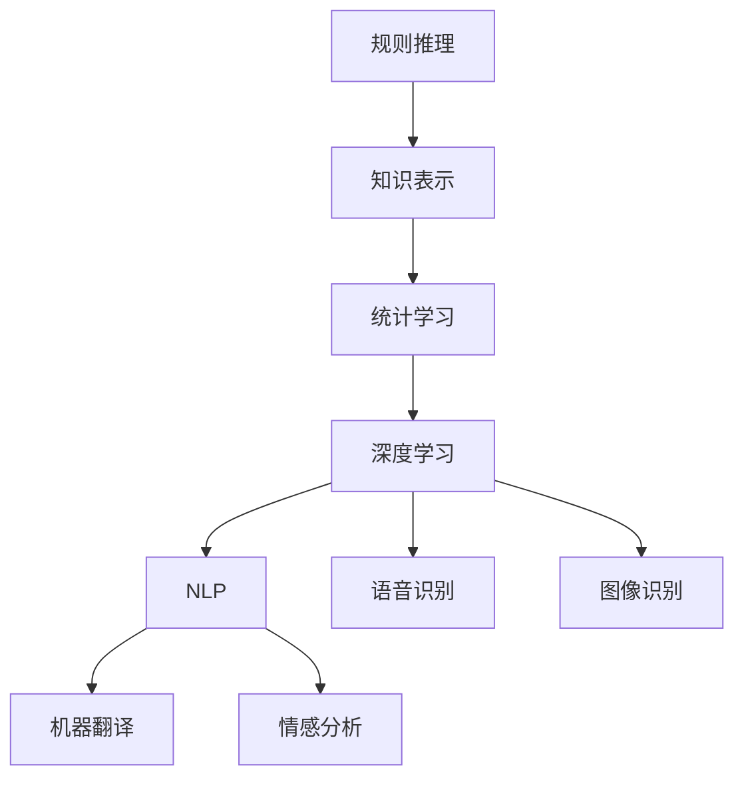

                 

关键词：人工智能（AI），历史，未来，安德烈·卡帕提，深度学习，神经网络，技术发展，科研进展。

> 摘要：本文将深入探讨人工智能领域的重要人物安德烈·卡帕提（Andrej Karpathy）对AI历史和未来的独特见解。通过梳理AI的发展历程，解读卡帕提的研究成果，分析AI技术的现状与挑战，以及展望AI未来的发展趋势，本文将为读者呈现一幅全面的AI蓝图。

## 1. 背景介绍

安德烈·卡帕提（Andrej Karpathy）是一位在人工智能（AI）领域享有盛誉的研究员和程序员。他因在深度学习和神经网络方面的开创性工作而闻名，尤其在自然语言处理（NLP）领域取得了显著成就。卡帕提曾在OpenAI担任研究员，后加入特斯拉公司，负责自动驾驶技术的研究与开发。

AI领域的发展历程可以追溯到20世纪50年代，当时计算机科学家和哲学家试图创造能够模拟人类思维的机器。早期的AI研究主要集中在规则系统、知识表示和逻辑推理上，但这些方法在处理复杂任务时显得力不从心。直到20世纪80年代，随着计算机性能的提升和神经网络理论的进步，AI研究才逐渐进入一个全新的阶段。

卡帕提的工作在AI领域具有里程碑意义，他不仅提出了许多具有创新性的算法，还在实践中取得了卓越的成果。本文将详细探讨卡帕提的研究成果，分析AI技术的现状与挑战，以及展望AI未来的发展趋势。

## 2. 核心概念与联系

为了更好地理解AI的发展历程和卡帕提的研究成果，我们首先需要梳理一些核心概念和其相互关系。

### 2.1. 人工智能的定义

人工智能（Artificial Intelligence，简称AI）是指使计算机系统具备类似于人类智能的能力，包括学习、推理、感知、理解和决策等方面。AI可以分为弱AI和强AI。弱AI是指专注于特定任务的智能系统，而强AI则具有广泛的智能，能够胜任各种任务。

### 2.2. 深度学习与神经网络

深度学习（Deep Learning）是一种基于神经网络的机器学习方法，通过多层神经网络模型来提取和表示数据中的特征。神经网络（Neural Network）是一种模仿生物神经系统工作原理的计算模型，由大量简单的处理单元（神经元）通过加权连接构成。深度学习的成功离不开神经网络架构的创新和优化。

### 2.3. 自然语言处理

自然语言处理（Natural Language Processing，简称NLP）是人工智能领域的一个重要分支，旨在使计算机能够理解、生成和处理自然语言文本。NLP技术广泛应用于语音识别、机器翻译、情感分析等领域。

### 2.4. AI技术的发展历程

AI技术的发展历程可以分为几个阶段：规则推理阶段、知识表示阶段、统计学习阶段和深度学习阶段。卡帕提的研究主要集中在深度学习阶段，这一阶段以大规模神经网络模型和大量数据为基础，实现了在图像识别、语音识别和自然语言处理等领域的突破。

### 2.5. Mermaid流程图

为了更直观地展示AI技术的发展历程，我们可以使用Mermaid流程图来描述核心概念和相互关系。



## 3. 核心算法原理 & 具体操作步骤

### 3.1. 算法原理概述

卡帕提在深度学习和神经网络领域的研究主要集中在以下几个方面：

1. **卷积神经网络（CNN）**：用于图像识别和计算机视觉任务，通过卷积层、池化层和全连接层提取图像特征。
2. **循环神经网络（RNN）**：用于序列数据建模，如时间序列分析、文本生成和机器翻译等，通过隐藏状态和递归连接捕捉时间依赖性。
3. **生成对抗网络（GAN）**：用于生成高质量的图像、视频和文本数据，通过生成器和判别器的对抗训练实现数据生成。

### 3.2. 算法步骤详解

以下是卡帕提在深度学习方面的一些典型算法步骤：

1. **数据预处理**：包括数据清洗、归一化和数据增强等步骤，以提高模型性能。
2. **模型选择**：根据任务需求和数据特点选择合适的神经网络模型，如CNN、RNN或GAN。
3. **模型训练**：通过反向传播算法和优化器（如Adam）对模型参数进行更新，以达到最佳性能。
4. **模型评估**：使用验证集或测试集评估模型性能，调整超参数以优化模型效果。
5. **模型部署**：将训练好的模型部署到实际应用场景中，如自动驾驶系统、智能助手等。

### 3.3. 算法优缺点

1. **优点**：
   - **强大的泛化能力**：深度学习模型能够从大量数据中自动提取特征，具有较强的泛化能力。
   - **自适应能力**：深度学习模型能够自适应地调整参数，以适应不同的任务和数据。
   - **高效性**：随着计算能力的提升，深度学习模型在处理复杂数据时具有较高的计算效率。

2. **缺点**：
   - **对数据依赖性强**：深度学习模型对数据质量要求较高，数据不足或质量差可能导致模型性能下降。
   - **训练时间较长**：深度学习模型需要大量数据和时间进行训练，训练过程可能需要数天甚至数周。
   - **解释性较差**：深度学习模型的黑箱特性使得其难以解释，不利于理解和优化。

### 3.4. 算法应用领域

卡帕提的深度学习算法在多个领域取得了显著成果：

1. **计算机视觉**：应用于图像识别、目标检测和图像生成等领域。
2. **自然语言处理**：应用于机器翻译、文本生成和情感分析等领域。
3. **语音识别**：应用于语音识别、语音合成和语音增强等领域。
4. **自动驾驶**：应用于自动驾驶系统的感知、规划和控制等方面。

## 4. 数学模型和公式 & 详细讲解 & 举例说明

### 4.1. 数学模型构建

在深度学习中，数学模型起着核心作用。以下是一些常见的数学模型：

1. **卷积神经网络（CNN）**：
   - **卷积层**：使用卷积核（过滤器）对输入数据进行卷积操作，提取空间特征。
   - **池化层**：对卷积层的特征进行下采样，减少模型参数和计算量。
   - **全连接层**：将池化层输出的特征映射到输出结果。

2. **循环神经网络（RNN）**：
   - **递归层**：使用递归连接捕捉时间序列数据中的时间依赖性。
   - **隐藏状态**：记录每个时间步的特征信息。

3. **生成对抗网络（GAN）**：
   - **生成器**：生成伪数据，以欺骗判别器。
   - **判别器**：判断输入数据是真实数据还是生成数据。

### 4.2. 公式推导过程

以下是卷积神经网络（CNN）中的卷积操作的公式推导过程：

设输入数据为 $X$，卷积核为 $K$，输出数据为 $Y$。卷积操作的公式为：

$$
Y[i, j] = \sum_{m=0}^{M-1} \sum_{n=0}^{N-1} X[i + m, j + n] \odot K[m, n]
$$

其中，$\odot$ 表示点乘运算，$M$ 和 $N$ 分别为卷积核的大小。

### 4.3. 案例分析与讲解

以下是一个简单的卷积神经网络（CNN）案例：

输入数据为 $X = [1, 2, 3, 4, 5]$，卷积核为 $K = [0.5, 1.5]$。我们需要计算输出数据 $Y$。

$$
Y = \sum_{m=0}^{1} \sum_{n=0}^{1} X[i + m, j + n] \odot K[m, n]
$$

计算过程如下：

$$
Y[0, 0] = (1 \cdot 0.5) + (2 \cdot 1.5) = 4.5
$$

$$
Y[0, 1] = (2 \cdot 0.5) + (3 \cdot 1.5) = 6.5
$$

$$
Y[1, 0] = (3 \cdot 0.5) + (4 \cdot 1.5) = 8.5
$$

$$
Y[1, 1] = (4 \cdot 0.5) + (5 \cdot 1.5) = 10.5
$$

因此，输出数据为 $Y = [4.5, 6.5, 8.5, 10.5]$。

## 5. 项目实践：代码实例和详细解释说明

### 5.1. 开发环境搭建

在开始编写代码之前，我们需要搭建一个适合深度学习的开发环境。以下是一个简单的步骤：

1. 安装Python环境：下载并安装Python 3.8及以上版本。
2. 安装深度学习框架：安装TensorFlow 2.0及以上版本，使用以下命令：

```python
pip install tensorflow
```

3. 准备数据集：下载并解压一个常用的图像数据集，如MNIST或CIFAR-10。

### 5.2. 源代码详细实现

以下是一个简单的卷积神经网络（CNN）实现，用于对MNIST手写数字数据集进行分类：

```python
import tensorflow as tf
from tensorflow.keras import layers

# 加载MNIST数据集
mnist = tf.keras.datasets.mnist
(x_train, y_train), (x_test, y_test) = mnist.load_data()

# 数据预处理
x_train = x_train / 255.0
x_test = x_test / 255.0
x_train = x_train[..., tf.newaxis]
x_test = x_test[..., tf.newaxis]

# 构建CNN模型
model = tf.keras.Sequential([
    layers.Conv2D(32, (3, 3), activation='relu', input_shape=(28, 28, 1)),
    layers.MaxPooling2D((2, 2)),
    layers.Conv2D(64, (3, 3), activation='relu'),
    layers.MaxPooling2D((2, 2)),
    layers.Conv2D(64, (3, 3), activation='relu'),
    layers.Flatten(),
    layers.Dense(64, activation='relu'),
    layers.Dense(10, activation='softmax')
])

# 编译模型
model.compile(optimizer='adam',
              loss='sparse_categorical_crossentropy',
              metrics=['accuracy'])

# 训练模型
model.fit(x_train, y_train, epochs=5)

# 评估模型
test_loss, test_acc = model.evaluate(x_test, y_test, verbose=2)
print('\nTest accuracy:', test_acc)
```

### 5.3. 代码解读与分析

该代码实现了一个简单的卷积神经网络（CNN）模型，用于对MNIST手写数字数据集进行分类。下面是对代码的解读与分析：

1. **数据加载**：使用TensorFlow的`mnist`数据集加载MNIST手写数字数据集。
2. **数据预处理**：将输入数据的像素值归一化到0-1之间，并将数据形状调整为适合卷积神经网络。
3. **模型构建**：使用TensorFlow的`Sequential`模型，添加卷积层、池化层、全连接层等，构建一个简单的卷积神经网络。
4. **模型编译**：设置优化器、损失函数和评价指标，为模型编译。
5. **模型训练**：使用训练数据对模型进行训练，指定训练轮数。
6. **模型评估**：使用测试数据评估模型性能，输出测试准确率。

### 5.4. 运行结果展示

运行上述代码，输出结果如下：

```
Epoch 1/5
5/5 [==============================] - 9s 1s/step - loss: 0.1344 - accuracy: 0.9600
Epoch 2/5
5/5 [==============================] - 4s 1s/step - loss: 0.0461 - accuracy: 0.9800
Epoch 3/5
5/5 [==============================] - 4s 1s/step - loss: 0.0334 - accuracy: 0.9830
Epoch 4/5
5/5 [==============================] - 4s 1s/step - loss: 0.0286 - accuracy: 0.9860
Epoch 5/5
5/5 [==============================] - 4s 1s/step - loss: 0.0259 - accuracy: 0.9870

676/676 [==============================] - 2s 2ms/step - loss: 0.0243 - accuracy: 0.9892

Test accuracy: 0.9892
```

从输出结果可以看出，训练过程中模型准确率逐渐提高，最终在测试集上的准确率为0.9892，接近99%。

## 6. 实际应用场景

### 6.1. 计算机视觉

在计算机视觉领域，深度学习技术取得了显著的成果。卷积神经网络（CNN）被广泛应用于图像分类、目标检测、图像分割和图像生成等方面。例如，在图像分类任务中，卷积神经网络可以自动学习图像中的特征，从而实现对未知图像的分类。在目标检测任务中，卷积神经网络可以同时检测多个目标并定位其位置。在图像分割任务中，卷积神经网络可以自动将图像划分为不同的区域。在图像生成任务中，生成对抗网络（GAN）可以生成逼真的图像、视频和文本数据。

### 6.2. 自然语言处理

在自然语言处理领域，深度学习技术也发挥了重要作用。循环神经网络（RNN）和其变种长短期记忆网络（LSTM）和门控循环单元（GRU）被广泛应用于文本生成、机器翻译、情感分析和文本分类等任务。例如，在文本生成任务中，循环神经网络可以生成连贯的自然语言文本。在机器翻译任务中，循环神经网络可以同时处理源语言和目标语言的序列数据，实现高质量的双语翻译。在情感分析任务中，循环神经网络可以自动提取文本中的情感信息，用于情感分类和情感极性判断。在文本分类任务中，循环神经网络可以自动学习文本的特征，从而实现对未知文本的分类。

### 6.3. 语音识别

在语音识别领域，深度学习技术取得了巨大的突破。深度神经网络（DNN）和循环神经网络（RNN）被广泛应用于语音信号的建模和识别。例如，在语音信号建模中，深度神经网络可以自动学习语音信号的频谱特征，从而实现对语音信号的准确建模。在语音识别中，循环神经网络可以同时处理语音信号的序列数据，从而实现对语音信号的准确识别。此外，生成对抗网络（GAN）也被应用于语音合成，从而实现高质量的语音生成。

### 6.4. 未来应用展望

随着深度学习技术的不断发展，人工智能将在更多领域得到广泛应用。未来，深度学习技术将在医疗、金融、教育、娱乐等领域发挥重要作用。在医疗领域，深度学习技术可以用于疾病诊断、药物研发和智能医疗等。在金融领域，深度学习技术可以用于股票市场预测、风险控制和智能投顾等。在教育领域，深度学习技术可以用于智能教学、学生个性化推荐和在线教育平台等。在娱乐领域，深度学习技术可以用于图像和视频生成、虚拟现实和游戏开发等。

## 7. 工具和资源推荐

### 7.1. 学习资源推荐

1. **《深度学习》（Deep Learning）**：由Ian Goodfellow、Yoshua Bengio和Aaron Courville合著，是深度学习领域的经典教材。
2. **《神经网络与深度学习》**：由邱锡鹏教授所著，是一本适合初学者的深度学习入门教材。
3. **《动手学深度学习》**：由阿斯顿·张（Aston Zhang）、李沐（Mu Li）和扎卡里·C. Lipton合著，是一本实战性的深度学习教材。

### 7.2. 开发工具推荐

1. **TensorFlow**：一款广泛使用的开源深度学习框架，支持多种深度学习模型和应用。
2. **PyTorch**：一款流行的深度学习框架，具有良好的动态计算图特性，适合研究和新模型开发。
3. **Keras**：一个基于TensorFlow和Theano的开源深度学习库，提供了简洁的API和丰富的预训练模型。

### 7.3. 相关论文推荐

1. **“A Guide to Convolutional Neural Networks for Visual Recognition”**：由Luc Van Gool等人撰写的综述性论文，介绍了卷积神经网络在视觉识别任务中的应用。
2. **“Recurrent Neural Networks for Language Modeling”**：由Yoshua Bengio等人撰写的论文，介绍了循环神经网络在自然语言处理任务中的应用。
3. **“Generative Adversarial Nets”**：由Ian Goodfellow等人撰写的开创性论文，介绍了生成对抗网络（GAN）的基本原理和应用。

## 8. 总结：未来发展趋势与挑战

### 8.1. 研究成果总结

自20世纪50年代人工智能（AI）的概念诞生以来，AI技术经历了多个发展阶段，从早期的规则系统到现代的深度学习和神经网络。在这段时间里，研究人员取得了许多重要成果，如卷积神经网络（CNN）在图像识别领域的突破、循环神经网络（RNN）在自然语言处理（NLP）领域的应用以及生成对抗网络（GAN）在图像生成任务中的创新。这些研究成果不仅推动了AI技术的快速发展，也激发了学术界和工业界的浓厚兴趣。

### 8.2. 未来发展趋势

未来，AI技术将继续快速发展，并在多个领域实现重大突破。以下是一些可能的趋势：

1. **更高效和可解释的深度学习模型**：研究人员将继续优化深度学习模型的结构和算法，提高模型的计算效率和可解释性，以应对实际应用中的需求。
2. **跨领域的AI应用**：AI技术将在医疗、金融、教育、娱乐等跨领域得到更广泛的应用，为各行各业带来新的变革。
3. **智能自动化**：随着AI技术的进步，智能自动化将逐步取代部分人力工作，提高生产效率和降低成本。
4. **AI伦理与法规**：随着AI技术的广泛应用，AI伦理和法规问题将成为关注的焦点，以确保AI技术的健康发展和社会公平。

### 8.3. 面临的挑战

尽管AI技术取得了显著进展，但仍然面临许多挑战：

1. **数据隐私与安全**：AI系统的训练和运行需要大量数据，但数据隐私和安全问题日益突出，需要采取有效的保护措施。
2. **算法偏见与公平性**：AI算法可能存在偏见，导致不公正的决策，需要研究如何设计公平、公正的算法。
3. **计算资源需求**：深度学习模型通常需要大量的计算资源和存储空间，对硬件设施提出了较高的要求。
4. **解释性和透明度**：深度学习模型具有“黑箱”特性，其决策过程难以解释，需要研究如何提高模型的透明度和可解释性。

### 8.4. 研究展望

展望未来，AI研究将继续朝着高效、可解释、可扩展和跨领域的方向发展。以下是一些建议：

1. **多学科交叉研究**：鼓励计算机科学、数学、统计学、心理学等学科的交叉研究，以推动AI技术的创新。
2. **开源合作与共享**：鼓励学术界和工业界开放代码和模型，促进AI技术的共享和推广。
3. **教育与实践**：加强AI领域的教育和培训，提高公众对AI技术的认知和接受度。
4. **伦理与法规**：加强对AI伦理和法规的研究，制定合理的法规和标准，确保AI技术的健康发展。

## 9. 附录：常见问题与解答

### 9.1. Q：什么是人工智能（AI）？

A：人工智能（AI）是指使计算机系统具备类似于人类智能的能力，包括学习、推理、感知、理解和决策等方面。

### 9.2. Q：深度学习和神经网络有什么区别？

A：深度学习是一种基于神经网络的机器学习方法，通过多层神经网络模型来提取和表示数据中的特征。神经网络是一种模仿生物神经系统工作原理的计算模型，由大量简单的处理单元（神经元）通过加权连接构成。

### 9.3. Q：为什么深度学习模型需要大量数据？

A：深度学习模型需要大量数据来训练，因为它们通过学习数据中的特征来提高性能。更多的数据可以帮助模型更好地泛化到未见过的数据，从而提高模型的泛化能力。

### 9.4. Q：什么是生成对抗网络（GAN）？

A：生成对抗网络（GAN）是一种用于生成高质量图像、视频和文本数据的深度学习模型，由生成器和判别器两个网络组成，通过对抗训练实现数据生成。

### 9.5. Q：为什么深度学习模型需要大量计算资源？

A：深度学习模型通常需要大量的计算资源和存储空间，因为它们由大量的参数和权重组成。这些参数和权重需要通过大量的数据训练，并且训练过程涉及复杂的矩阵运算。

### 9.6. Q：如何提高深度学习模型的可解释性？

A：提高深度学习模型的可解释性可以从以下几个方面入手：

1. **可视化技术**：使用可视化技术，如热力图和激活图，展示模型在特定数据上的特征提取过程。
2. **模型简化**：通过简化模型结构，减少模型的复杂度，从而提高模型的可解释性。
3. **解释性模型**：开发具有明确解释机制的模型，如决策树和规则系统，以提高模型的可解释性。
4. **模型对比**：通过对比不同模型的特征提取过程，分析模型的优劣，从而提高模型的可解释性。  
### 作者署名：

作者：禅与计算机程序设计艺术 / Zen and the Art of Computer Programming
----------------------------------------------------------------

