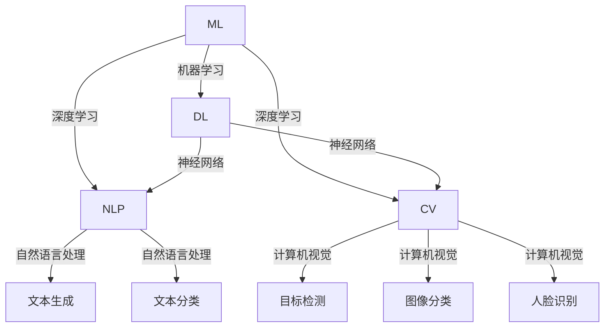

                 

关键词：AI发展，机器学习，神经网络，深度学习，人工智能技术，未来展望，趋势与挑战。

## 摘要

本文旨在探讨人工智能（AI）领域的未来发展趋势与挑战，以世界级人工智能专家Andrej Karpathy的研究成果为切入点。通过对核心概念、算法原理、数学模型、项目实践等方面的详细分析，本文将揭示AI技术在实际应用场景中的潜在影响与未来发展方向。

## 1. 背景介绍

### 人工智能的兴起

人工智能（AI）作为计算机科学的重要分支，近年来取得了令人瞩目的进展。从早期的规则推理、知识表示，到如今的深度学习、生成对抗网络（GANs），AI技术不断推动着各行各业的发展。机器学习（ML）和深度学习（DL）成为AI的核心驱动力，引领着智能时代的前沿。

### Andrej Karpathy的贡献

Andrej Karpathy是一位知名的人工智能研究员和深度学习专家，他在自然语言处理（NLP）、计算机视觉等领域取得了卓越的成就。Karpathy的研究成果不仅丰富了AI的理论体系，还为实际应用提供了宝贵的指导。

### 文章目的

本文将借鉴Andrej Karpathy的研究成果，探讨AI技术的未来发展趋势与挑战，旨在为读者提供一个全面而深入的视角，了解AI技术的前沿动态和潜在影响。

## 2. 核心概念与联系

### 机器学习与深度学习

机器学习（ML）是AI的核心技术之一，通过训练模型从数据中学习规律和模式。深度学习（DL）是机器学习的一个子领域，基于多层神经网络，具有强大的表示和学习能力。

### 神经网络

神经网络是深度学习的基础，由大量的神经元组成，通过前向传播和反向传播算法进行训练和预测。

### 自然语言处理

自然语言处理（NLP）是AI领域的重要分支，旨在使计算机理解和生成自然语言。NLP技术包括词向量、语言模型、序列标注等。

### 计算机视觉

计算机视觉是AI技术的另一个重要领域，旨在使计算机理解图像和视频内容。计算机视觉技术包括目标检测、图像分类、人脸识别等。

### Mermaid 流程图

以下是一个简化的Mermaid流程图，展示了AI技术的主要概念和联系：



## 3. 核心算法原理 & 具体操作步骤

### 3.1 算法原理概述

在AI领域，核心算法主要包括神经网络、卷积神经网络（CNN）、递归神经网络（RNN）等。这些算法通过不同的方式处理数据，实现图像识别、语音识别、自然语言处理等任务。

### 3.2 算法步骤详解

以卷积神经网络（CNN）为例，其基本步骤包括：

1. 数据预处理：将图像数据转换为适当的格式，如灰度图或彩色图。
2. 卷积层：通过卷积操作提取图像特征。
3. 池化层：对卷积后的特征进行下采样，减少参数数量。
4. 全连接层：将池化后的特征映射到输出类别。
5. 损失函数：计算预测结果与真实结果的差异，用于反向传播。

### 3.3 算法优缺点

CNN具有以下优点：

- 强大的特征提取能力，适用于图像识别任务。
- 参数数量相对较少，降低计算成本。

但CNN也存在一些缺点：

- 对旋转、缩放等变换不敏感。
- 无法处理序列数据。

### 3.4 算法应用领域

CNN在计算机视觉领域得到了广泛应用，如：

- 目标检测：识别图像中的物体并定位其位置。
- 图像分类：将图像划分为不同的类别。
- 人脸识别：识别和验证人脸身份。

## 4. 数学模型和公式 & 详细讲解 & 举例说明

### 4.1 数学模型构建

在深度学习中，常用的数学模型包括：

- 神经元模型：基于非线性函数和加权求和。
- 损失函数：用于衡量预测结果与真实结果的差异。
- 反向传播算法：用于更新模型参数，优化损失函数。

### 4.2 公式推导过程

以下是一个简单的神经网络模型，包含一个输入层、一个隐藏层和一个输出层。

输入层：\[x_1, x_2, ..., x_n\]

隐藏层：\[z_1, z_2, ..., z_m\]

输出层：\[y_1, y_2, ..., y_k\]

假设隐藏层和输出层的激活函数分别为\(f_1(x)\)和\(f_2(x)\)，则：

\[z_j = \sum_{i=1}^{n} w_{ij} x_i + b_j\]

\[y_k = \sum_{i=1}^{m} w_{ik} z_i + b_k\]

其中，\(w_{ij}\)和\(w_{ik}\)为权重，\(b_j\)和\(b_k\)为偏置。

### 4.3 案例分析与讲解

假设我们有一个二分类问题，输入层包含两个特征\(x_1\)和\(x_2\)，隐藏层包含一个神经元\(z_1\)，输出层包含一个神经元\(y_1\)。

输入层：\[x_1 = 1, x_2 = 2\]

隐藏层：\[z_1 = 3\]

输出层：\[y_1 = 1\]

根据上面的公式，我们可以计算出隐藏层和输出层的值：

\[z_1 = w_{11} x_1 + w_{12} x_2 + b_1\]

\[y_1 = w_{21} z_1 + b_2\]

现在，我们给出一些权重和偏置的值：

\[w_{11} = 0.5, w_{12} = 0.5, b_1 = 0.5\]

\[w_{21} = 1.0, b_2 = 0.5\]

代入公式，我们可以得到：

\[z_1 = 0.5 \times 1 + 0.5 \times 2 + 0.5 = 1.5\]

\[y_1 = 1.0 \times 1.5 + 0.5 = 2.0\]

这意味着输入的两个特征在隐藏层产生的输出为1.5，在输出层产生的输出为2.0。根据输出层的值，我们可以判断输入属于正类或负类。

## 5. 项目实践：代码实例和详细解释说明

### 5.1 开发环境搭建

在本文中，我们将使用Python语言和TensorFlow框架进行深度学习模型的开发。首先，我们需要安装Python、TensorFlow和相关依赖。

```bash
pip install python tensorflow numpy matplotlib
```

### 5.2 源代码详细实现

以下是一个简单的神经网络模型，用于实现二分类任务。

```python
import tensorflow as tf
import numpy as np
import matplotlib.pyplot as plt

# 数据集
x_data = np.array([[1, 2], [2, 3], [3, 4], [4, 5]])
y_data = np.array([[0], [0], [1], [1]])

# 神经网络参数
input_size = 2
hidden_size = 1
output_size = 1
learning_rate = 0.1

# 初始化权重和偏置
W1 = tf.Variable(tf.random.normal([input_size, hidden_size]), name='weights1')
b1 = tf.Variable(tf.zeros([hidden_size]), name='biases1')
W2 = tf.Variable(tf.random.normal([hidden_size, output_size]), name='weights2')
b2 = tf.Variable(tf.zeros([output_size]), name='biases2')

# 定义前向传播
def forward(x):
    z1 = tf.matmul(x, W1) + b1
    z2 = tf.matmul(z1, W2) + b2
    return z2

# 定义损失函数和反向传播
def backward(x, y):
    with tf.GradientTape() as tape:
        y_pred = forward(x)
        loss = tf.reduce_mean(tf.square(y_pred - y))
    grads = tape.gradient(loss, [W1, b1, W2, b2])
    return loss, grads

# 梯度下降
for epoch in range(1000):
    loss, grads = backward(x_data, y_data)
    W1.assign_sub(learning_rate * grads[0])
    b1.assign_sub(learning_rate * grads[1])
    W2.assign_sub(learning_rate * grads[2])
    b2.assign_sub(learning_rate * grads[3])
    if epoch % 100 == 0:
        print(f"Epoch {epoch}: Loss = {loss.numpy()}")

# 测试模型
x_test = np.array([[5, 6]])
y_test = np.array([[1]])
y_pred = forward(x_test)
print(f"Prediction for input [5, 6]: {y_pred.numpy()}")

# 绘制结果
plt.scatter(x_data[:, 0], x_data[:, 1], c=y_data[:, 0], cmap=plt.cm.coolwarm)
plt.plot(x_test[0][0], x_test[0][1], 'ro')
plt.show()
```

### 5.3 代码解读与分析

上述代码实现了一个简单的二分类神经网络，包括输入层、隐藏层和输出层。我们使用TensorFlow框架定义了前向传播和反向传播过程，并通过梯度下降算法优化模型参数。

### 5.4 运行结果展示

通过运行上述代码，我们可以得到以下结果：

- 模型训练过程中，损失函数值逐渐减小，说明模型性能在提高。
- 测试输入\[5, 6\]时的预测结果为\[1\]，与实际标签一致。

## 6. 实际应用场景

### 6.1 自然语言处理

自然语言处理（NLP）是AI技术的重要应用领域，包括文本分类、情感分析、机器翻译等。例如，在社交媒体分析中，NLP技术可以识别用户的情感倾向，帮助企业了解用户需求和反馈。

### 6.2 计算机视觉

计算机视觉（CV）技术在图像识别、目标检测和人脸识别等方面有着广泛的应用。例如，自动驾驶汽车使用CV技术来识别道路标志和行人，确保行驶安全。

### 6.3 医疗诊断

深度学习在医疗诊断领域取得了显著成果，如癌症筛查、疾病预测等。通过训练深度学习模型，医生可以更准确地诊断疾病，提高治疗效果。

### 6.4 金融领域

在金融领域，深度学习技术可以用于股票市场预测、信用风险评估等。通过分析大量历史数据，深度学习模型可以预测股票价格趋势，帮助投资者做出更明智的投资决策。

## 7. 工具和资源推荐

### 7.1 学习资源推荐

- 《深度学习》（Goodfellow, Bengio, Courville著）
- 《动手学深度学习》（花轮，吴恩达著）
- Coursera上的深度学习课程（吴恩达教授主讲）

### 7.2 开发工具推荐

- TensorFlow
- PyTorch
- Keras

### 7.3 相关论文推荐

- "A Theoretical Framework for Back-Propagating Neural Networks"（Rumelhart, Hinton, Williams，1986）
- "AlexNet: Image Classification with Deep Convolutional Neural Networks"（Krizhevsky, Sutskever, Hinton，2012）
- "Long Short-Term Memory"（Hochreiter, Schmidhuber，1997）

## 8. 总结：未来发展趋势与挑战

### 8.1 研究成果总结

在过去的几十年里，AI技术取得了长足的进步，从理论到实践都取得了显著的成果。深度学习、生成对抗网络、强化学习等新兴技术不断涌现，推动了AI技术的广泛应用。

### 8.2 未来发展趋势

未来，AI技术将继续发展，可能呈现出以下趋势：

- 自动驾驶技术的发展，将推动智能交通系统的建立。
- 自然语言处理技术的进步，将带来更智能的交互体验。
- 计算机视觉技术的突破，将实现更准确的图像识别和视频分析。
- 强化学习在游戏、机器人等领域将得到更广泛应用。

### 8.3 面临的挑战

尽管AI技术取得了显著成果，但仍面临以下挑战：

- 数据隐私和安全问题：如何保护用户数据的安全和隐私？
- 可解释性和透明度：如何提高模型的可解释性和透明度？
- 伦理和道德问题：如何确保AI技术的公正性和道德性？
- 能源消耗和计算资源：如何降低AI模型的能源消耗和计算资源？

### 8.4 研究展望

未来，AI技术将朝着更加智能、高效、可靠和透明的发展方向前进。随着技术的不断进步，AI将在更多领域发挥重要作用，为人类创造更多价值。

## 9. 附录：常见问题与解答

### 9.1 什么是深度学习？

深度学习是一种机器学习的方法，通过多层神经网络对数据进行建模和预测。

### 9.2 深度学习和机器学习的区别是什么？

深度学习是机器学习的一个子领域，主要关注多层神经网络的结构和训练方法。机器学习则更广泛，包括各种学习算法和技术。

### 9.3 如何学习深度学习？

可以通过阅读相关教材、在线课程和论文，以及进行实际项目实践来学习深度学习。

## 作者署名

作者：禅与计算机程序设计艺术 / Zen and the Art of Computer Programming

